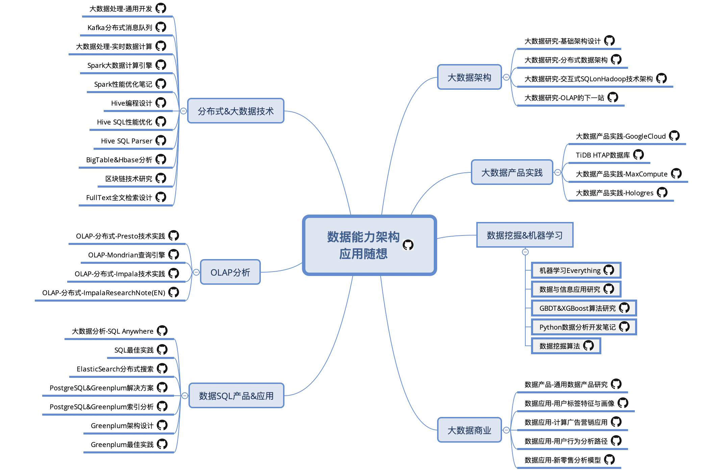

TT Tech Space - 大数据&AI研究博客
--------------------------

### Welcome to TT Big Data Research Pages.
Here is terrytang's personal tech resource pages,builded by GitHub. For the last many years, he has always worked in the field of software and internet.
Currently he focuses on everything about big data included bi,olap,mpp,hadoop,solution,machine learning and AI.Welcome to contact with him and discuss any tech topic with him.

### TT Tech Blog Site

#### Data Content Map

**BigData -> Data Analytics -> BigDat+AI on Cloud**

- **[大数据分析深度随想-一切的起点](https://github.com/terrytang0905/TT_Tech_Space/blob/resource/blogs/2015-11-08-bigdata-analytics-thinking.md)**

#### I.BigData & AI Solution Everything

- [Data Mesh的原则和逻辑架构](https://github.com/terrytang0905/TT_Tech_Space/blob/resource/blogs/2022-04-03-data-mesh-arch-research.md)
- [从单体数据湖到分布式数据网格](https://github.com/terrytang0905/TT_Tech_Space/blob/resource/blogs/2022-04-02-from-datalake-to-data-mesh.md)
- **[数据思考-商业价值变现](https://github.com/terrytang0905/TT_Tech_Space/blob/resource/blogs/2018-03-29-data-business-value-thinking-note.md)**
- **[数据科学-机器学习Everything](https://github.com/terrytang0905/TT_Tech_Space/blob/resource/blogs/2017-10-16-bigdata-ml-data-everything-note.md)**
- **[数据应用-用户标签特征与画像](https://github.com/terrytang0905/TT_Tech_Space/blob/resource/blogs/2018-06-06-data-usage-user-label-profile-note.md)**
- **[数据应用-计算广告营销应用](https://github.com/terrytang0905/TT_Tech_Space/blob/resource/blogs/2017-07-01-data-usage-compute-advertise-design-note.md)**
- **[数据应用-用户行为分析路径](https://github.com/terrytang0905/TT_Tech_Space/blob/resource/blogs/2017-09-30-data-usage-user-behavior-analysis-note.md)**
- **[数据应用-新零售分析模型](https://github.com/terrytang0905/TT_Tech_Space/blob/resource/blogs/2017-04-16-data-usage-new-retail-analytics-design-note.md)**
- [数学与信息应用思考-TODO](https://github.com/terrytang0905/TT_Tech_Space/blob/resource/blogs/2017-05-10-information-mathmatic-thinking.md) 
- **[数据科学-Python信息识别算法](https://github.com/terrytang0905/TT_Tech_Space/blob/resource/blogs/2018-05-05-python-info-recognition-note.md)**
- **[数据科学-GBDT&XGBoost算法研究](https://github.com/terrytang0905/TT_Tech_Space/blob/resource/blogs/2017-12-25-gbdt-xgboost-ml-note.md)**
- **[数据科学-Python开发all笔记](https://github.com/terrytang0905/TT_Tech_Space/blob/resource/blogs/2017-10-06-python-dev-everything-note.md)**
- [数据科学-数据挖掘算法研究](https://github.com/terrytang0905/TT_Tech_Space/blob/resource/blogs/2015-12-01-data-mining-algorithm-note.md)
- [社交推荐功能设计](https://github.com/terrytang0905/TT_Tech_Space/blob/resource/blogs/2015-05-13-sns-recommendation-design.md)

#### II.BigData & All Distributed Research

- **[大数据研究-通用大数据产品分析](https://github.com/terrytang0905/TT_Tech_Space/blob/resource/blogs/2019-03-12-bigdata-research-common-product-solution.md)**

- **[大数据研究-基础架构设计](https://github.com/terrytang0905/TT_Tech_Space/blob/resource/blogs/2017-07-26-bigdata-research-infrastructure-build.md)**

- **[大数据研究-分布式数据架构](https://github.com/terrytang0905/TT_Tech_Space/blob/resource/blogs/2017-07-27-bigdata-research-database-architect.md)**

- **[大数据研究-SQLonHadoop](https://github.com/terrytang0905/TT_Tech_Space/blob/resource/blogs/2017-07-28-bigdata-research-olap-sqlonhadoop-note.md)**

- **[大数据研究-数据湖仓存算分离技术研究](https://github.com/terrytang0905/TT_Tech_Space/blob/resource/blogs/2020-06-06-bigdata-research-lake-house-solution.md)**

- **[大数据研究-分布式OLAP引擎的下一站](https://github.com/terrytang0905/TT_Tech_Space/blob/resource/blogs/2021-05-05-bigdata-research-olap-next-generation-note.md)**

- **[大数据研究-Google大数据解决方案](https://github.com/terrytang0905/TT_Tech_Space/blob/resource/blogs/2019-05-01-bigdata-research-google-tech-solution.md)**

  

- [区块链技术-基础研究-TODO](https://github.com/terrytang0905/TT_Tech_Space/blob/resource/blogs/2018-03-06-block-chain-design-note.md)

- [大数据研究-数据处理-实时计算引擎分析](https://github.com/terrytang0905/TT_Tech_Space/blob/resource/blogs/2018-05-31-bigdata-research-dataprocess-realtime-compute.md)

- [大数据研究-数据处理-混合计算架构](https://github.com/terrytang0905/TT_Tech_Space/blob/resource/blogs/2017-07-29-bigdata-research-dataprocess-realtime-framework.md)

- [大数据研究-数据处理-Kafka分布式消息队列](https://github.com/terrytang0905/TT_Tech_Space/blob/resource/blogs/2017-07-29-bigdata-research-dataprocess-kafka-note.md)

- [大数据研究-数据处理-通用开发](https://github.com/terrytang0905/TT_Tech_Space/blob/resource/blogs/2017-07-29-bigdata-research-dataprocess-development.md)

- [ElasticSearch分布式搜索](https://github.com/terrytang0905/TT_Tech_Space/blob/resource/blogs/2017-01-06-elasticsearch-search-engine-architect-note.md)

- [FullTextSearch研究思考](https://github.com/terrytang0905/TT_Tech_Space/blob/resource/blogs/2014-12-20-fulltext-search-design-thinking.md)

#### III.DataComputeProduct & DataAnalytics

- **[大数据产品实践-MaxCompute](https://github.com/terrytang0905/TT_Tech_Space/blob/resource/blogs/2021-11-07-bigdata-best-practice-maxcompute.md)**
- **[大数据产品实践-Hologres](https://github.com/terrytang0905/TT_Tech_Space/blob/resource/blogs/2021-11-06-bigdata-best-practice-hologres.md)**
- **[数据库研究-TiDB HTAP DB](https://github.com/terrytang0905/TT_Tech_Space/blob/resource/blogs/2019-07-08-newdb-tidb-design-note.md)**
- **[大数据分析-SQL Anywhere应用](https://github.com/terrytang0905/TT_Tech_Space/blob/resource/blogs/2017-08-01-bigdata-analytics-sql-anywhere-design.md)**
- [大数据产品实践-分布式-Presto技术实践](https://github.com/terrytang0905/TT_Tech_Space/blob/resource/blogs/2017-04-03-bigdata-best-practice-distributed-presto-note.md)
- [大数据产品实践-Hive编程-SQLEngine分析](https://github.com/terrytang0905/TT_Tech_Space/blob/resource/blogs/2017-06-09-hive-sql-parser-note.md)
- [大数据产品实践-Hive编程-SQL性能优化](https://github.com/terrytang0905/TT_Tech_Space/blob/resource/blogs/2017-06-10-hive-sql-performance-note.md)
- [大数据产品实践-Hive编程-设计开发](https://github.com/terrytang0905/TT_Tech_Space/blob/resource/blogs/2017-06-08-hive-programing-note.md)
- [大数据产品实践-Spark性能优化笔记](https://github.com/terrytang0905/TT_Tech_Space/blob/resource/blogs/2018-11-23-spark-performance-tuning-note.md)
- [大数据产品实践-Spark技术框架](https://github.com/terrytang0905/TT_Tech_Space/blob/resource/blogs/2017-03-29-spark-bigdata-arch-note.md)
- [大数据产品实践-BigTable&HBase Analysis Note](https://github.com/terrytang0905/TT_Tech_Space/blob/resource/blogs/2017-03-12-bigtable&hbase-analysis-note.md)
- [OLAP-Mondrian技术实践](https://github.com/terrytang0905/TT_Tech_Space/blob/resource/blogs/2017-01-31-olap-mondrian-note.md)
- [OLAP-分布式-Impala技术实践](https://github.com/terrytang0905/TT_Tech_Space/blob/resource/blogs/2016-12-13-olap-distributed-impala-practice-note.md)
- [OLAP-分布式-ImpalaResearchNote(EN)](https://github.com/terrytang0905/TT_Tech_Space/blob/resource/blogs/2016-12-12-olap-distributed-impala-research-note.md)
- **[通用SQL最佳实践](https://github.com/terrytang0905/TT_Tech_Space/blob/resource/blogs/2017-07-20-sql-best-practice.md)**
- [PostgreSQL&Greenplum解决方案](https://github.com/terrytang0905/TT_Tech_Space/blob/resource/blogs/2018-05-30-postgresql-greenplum-solution-note.md)
- [PostgreSQL&Greenplum索引笔记](https://github.com/terrytang0905/TT_Tech_Space/blob/resource/blogs/2017-12-16-postgresql-greenplum-index-note.md)
- [Greenplum5实践笔记](https://github.com/terrytang0905/TT_Tech_Space/blob/resource/blogs/2017-12-03-greenplum5-best-practice-note.md)
- [PostgreSQL最佳实践](https://github.com/terrytang0905/TT_Tech_Space/blob/resource/blogs/2017-05-30-oltp-postgresql-best-practice-note.md)
- [Greenplum最佳实践](https://github.com/terrytang0905/TT_Tech_Space/blob/resource/blogs/2017-05-28-olap-greenplum-best-practice-note.md)
- [Greenplum Architect Research Note](https://github.com/terrytang0905/TT_Tech_Space/blob/resource/blogs/2017-02-11-greenplum-arch-design-note.md)
- [Greenplum数据分析应用](https://github.com/terrytang0905/TT_Tech_Space/blob/resource/blogs/2016-07-30-greenplum-analysis-function.md)
- [Greenplum系统管理手册](https://github.com/terrytang0905/TT_Tech_Space/blob/resource/blogs/2016-04-15-greenplum-system-admin-guide.md)
- *[MongoDB核心研究](https://github.com/terrytang0905/TT_Tech_Space/blob/resource/blogs/2016-02-28-mongodb-internal.md)
- [MongoDB3.0 MajorChange(EN)](https://github.com/terrytang0905/TT_Tech_Space/blob/resource/blogs/2015-10-11-mongodb3-major-release.md)
- [Couchbase Practice(EN)](https://github.com/terrytang0905/TT_Tech_Space/blob/resource/blogs/2014-11-05-couchbase-practice.md)
- [MongoDB Practice(EN)](https://github.com/terrytang0905/TT_Tech_Space/blob/resource/blogs/2014-11-05-mongodb-practice.md) 

#### V.Cloud 

- [VMware Practice(EN)](https://github.com/terrytang0905/TT_Tech_Space/blob/resource/blogs/2012-05-23-vmware-practice.md)

#### VI.Programming

- *[高并发高可用架构设计](https://github.com/terrytang0905/TT_Tech_Space/blob/resource/blogs/2017-03-25-scalable-web-architect-note.md)
- [移动产品开发设计笔记](https://github.com/terrytang0905/TT_Tech_Space/blob/resource/blogs/2015-01-08-cloud-product-design-note.md)
- [Java多线程与并发-BlockingQueue API](https://github.com/terrytang0905/TT_Tech_Space/blob/resource/blogs/2016-04-27-java_concurrent_blocking_queue_note.md)
- [Java多线程与并发-java.util.concurrent API](https://github.com/terrytang0905/TT_Tech_Space/blob/resource/blogs/2016-04-27-java_concurrent_api_note.md)
- [Java多线程与并发-Lock-free无锁编程](https://github.com/terrytang0905/TT_Tech_Space/blob/resource/blogs/2016-04-11-java_lock_free_program_note.md)
- [Java多线程与并发-Concurrent Analysis Notes](https://github.com/terrytang0905/TT_Tech_Space/blob/resource/blogs/2016-04-11-java_concurrent_analysis_note.md)
- [Java多线程与并发-Concurrent Analysis Index](https://github.com/terrytang0905/TT_Tech_Space/blob/resource/blogs/2016-04-09-java_concurrent_analysis_map.md)
- [程序员的职业素养-读书笔记](https://github.com/terrytang0905/TT_Tech_Space/blob/resource/blogs/2015-11-07-professional-programmer.md)
- [Go语言研究](https://github.com/terrytang0905/TT_Tech_Space/blob/resource/blogs/2015-05-12-go-language-design.md)
- [Linux系统管理](https://github.com/terrytang0905/TT_Tech_Space/blob/resource/blogs/2016-06-30-linux-system-management.md)

#### X.TT Resources Site

- [Principle原则-阅读笔记](https://github.com/terrytang0905/TT_Tech_Space/blob/resource/blogs/2018-03-04-principle-read-note.md)
- [GitHub Page Website](http://terrytang0905.github.io/TT_Tech_Space/)
- [About TT](About.md) 

### Authors and Contributors
Since 2012, TerryTang ([@terrytang0905](https://github.com/terrytang0905)) founded GitHub. 

### Support or Contact
Having trouble with Pages? Check out our [documentation](https://help.github.com/pages) or [contact support](https://github.com/contact) and we’ll help you sort it out.
