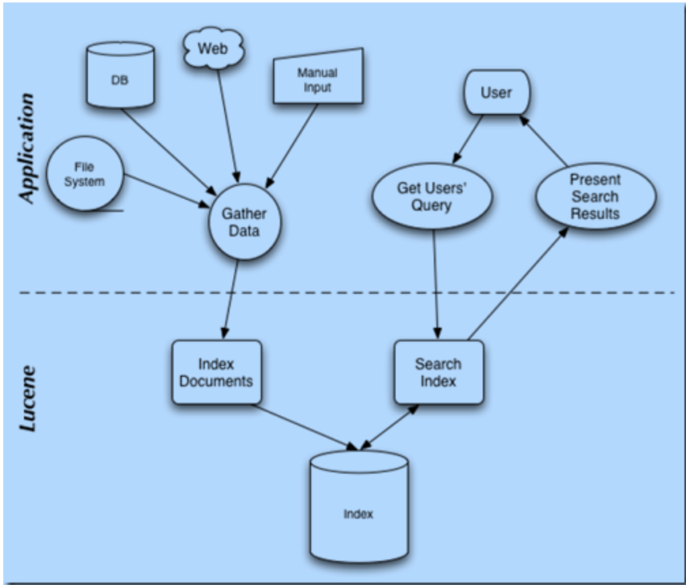
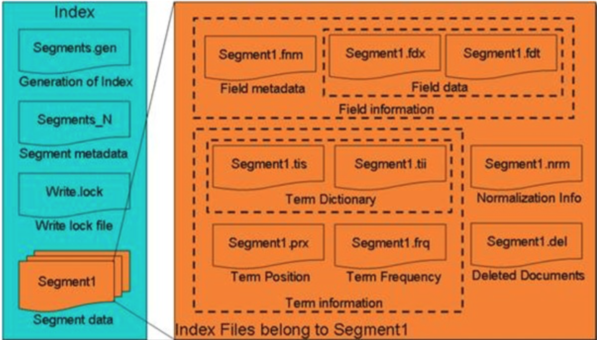
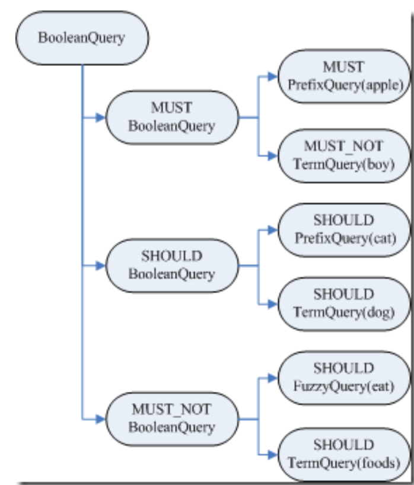

FullText Search Design Note - Lucene
------------------------------------

Beginning from Aug in 2009, I have involved into one fulltext search engine project in EMC content management division. The search engine is based on lucene tech as the core architecture and adopt xDB NoSQL DB (One XML database occupied by EMC) to store big unstructured data. After this project,I also took other related cross research about full text implementation (ElasticSearch) and the popular NoSQL DB MongoDB and adopt the related tech to design and implement open source search engine in one mobile internet project from Lenovo. At the end I try to reorganize my understanding for fulltext search and write down the principle of designing and architecture for common fulltext search engine. All contents follow lucene design philosophy and use lucene as the main example.

### I.FullText Search Architecture
Here are the following main function aspects for fulltext search engine. I will explain every function step by step later.

1.1. Index/Information Crawler: Data comes from database / webpage / document. <br />
Solution: Scrapy / network crawler <br />
1.2. Content Extractor/Text Extractor: extract fulltext from any media(e.g.PDF/Word/Test). <br />
Solution: Oracle OutSide In <br />
1.3. Content Analysis/Tokenization: automatic language detection, stemming, lemmatization. <br />
Solution: Basis / Tika / Snowball / Lucene Analysis  <br />
1.4. Search Engine Management: It used to call and manage the index/query task accordingly and included that Index/Search/Query Modules. <br />
Solution: xPlore IndexServer/ElasticSearch/Sphinx(for SQL) <br />
1.5. Core Index & Search Design: lucene <br />
Transform any fulltext data to lucene document format (XML to lucene document) <br />
Solution: Lucene multiple index(Concurrent Index / Parallel Query) <br />
1.6. Quality of Search <br />
- Scoring(Similarity & Relevance)/ Sorting & Ranking
- Summary result / Highlighting keyword
- Possible Query language for Advanced operators
- Possible Query language for structured searches
- MoreLikeThis / Fuzzy Search
- Spell check / Recommendation
- Scale out / Horizontal scaling (Multi-Node / SharedIndex / Sharding & Share Nothing)
- Ingest/Query Time Performance
- Space consumption performance
1.7. BigData storage & analysis. <br />
1.8. Store any index meta data or source contents. <br />
Solution: HDFS or TFS / NoSQL DB (xDB / MongoDB / HBase) <br />

### II.Lucene Design Principle & Architecture

	• Lucene index process is to write index document as inverted index table according to full text process. 
	• Lucene search process is to read data from index documents and take score for every document.

	Quick search repeatly based on one index

X. _Tokenizer_
- Stop Word
- Send Token to Linguistic Processor included Lowercase/stemming/lemmatization
- Create Term and import into Indexer

Y. _Indexer_
- Document Frequency / Term Frequency in the specific document 
- Query Analyer / QueryParser
- Term Weight
- TF-IDF module

.


#### III.Lucene Index Data 

3.1. Index过程:

	A. Create one IndexWriter instance in order to write index files.它有几个参数,INDEX_DIR就是索引文件所存放的位
	置,Analyzer便是用来对文档进行词法分析和语言处理的.
	B. 创建一个Document代表我们要索引的文档.
	C. 将不同的Field加入到文档中。我们知道,一篇文档有多种信息,如题目,作者,修改时间,内
	容等。不同类型的信息用不同的Field来表示,在本例子中,一共有两类信息进行了索引,一个
	是文件路径,一个是文件内容。其中FileReader的SRC_FILE就表示要索引的源文件.
	D. IndexWriter调用函数addDocument将索引写到索引文件夹中.
   

3.2. Index data structure:

	Positive path:Index -> Segment(segments.gen,segments_N) -> Document -> Field(fnm,fdx,fdt) -> Term(tvx,tvd,tvf)

		Segment: segments.gen segment_N
		Field-XXX.fnm(元数据信息)
			> 位置(Position)和偏移量(Offset)的区别
			> 索引域(Indexed)和存储域(Stored)的区别
			> payload的使用
		Field-.fdt+.fdx
			> 域数据文件(fdt)
			> 域索引文件(fdx)
		TermVector词向量: .tvx .tvd .tvf
		词向量信息是从索引(index)到文档(document)到域(field)到词(term)的正向信息,由此得到一篇文档包含那些词的信息

	Negative path(Inverted Index structure):Term -> Fields -> Segments -> Index
				  
		TermDictonary(tii,tis) -> TermPostingList (DocumentID/TF/Position/Payload跳跃表存储)
		TermDictionary: .tis / .tii / Fequencies(.frq) / Postions词位置(.prx) 

		Term Weight & Score: .nrm (Normalization Factor:Document boost/Field boost/lengthNorm(field))
		相关性打分(score)使用<向量空间模型>(Vector Space Model),在计算相关性之前,要计算TermWeight
		Lucene在计算Term Weight时,都会乘上一个标准化因子(Normalization Factor),用于调整Term权重
		
		Blacklist/Delete Document: .del
		Merge and compound file(.cfs) / ConcurrentMergeScheduler
		Write.lock(Sync index info during merging)写入锁

.

3.3.数据存储规则

	1)Prefix+Suffix
	2)Delta差值规则
	3)或然跟随规则
	4)SkipList跳跃表

#### IV.Lucene Index code anlaysis 

4.1. Index Process Architect
    
  	The key point is index chain

4.2. Index Process Details

	1. 创建IndexWriter
	2. 创建文档Document对象,并加入域(Field)
	3. 将文档加入IndexWriter
	4. 将文档加入DocumentsWriter

4.2.1. IndexWrite
	
	包含以下信息
	- 用于索引文档
	- 用于合并段,在合并段的文章中将详细描述
	- 为保持索引完整性,一致性和事务性
	- 配置信息

4.2.2. IndexChain:

	DocFieldProcessor(索引链的开端):
		DocConsumer consumer(索引链对象)内容:
			- 对索引域的处理
			- 对存储域的处理
			- 删除文档:deletesInRAM -> deletesFlushed
			- 缓存管理RAMBuffer management
			- 多线程并发索引Multi-thread concurrent indexING (sync index docID)
			- Add document into Index synchronizely
				得到当前线程对应的文档集处理对象(DocumentsWriterThreadState)
				用得到的DocumentsWriterThreadState处理文档processDocument()
				用DocumentsWriter.finishDocument结束本次文档添加
	
	DocFieldProcessorPerThread(线程索引链):
		由于要多线程进行索引,因而每个线程都要有自己的索引链,称为线程索引链 
		每一个DocumentsWriterThreadState都有一个文档及域处理对象DocFieldProcessorPerThread(线程索引链的开端)
	
	DocFieldProcessorPerField(域索引链):
		每个域也有自己的索引链,称为域索引链,每个域的索引链也有同线程索引链有相似的树形结构

4.2.3. About DocumentWriter:

	RAMBuffer management for CharBlockPool/ByteBlockPool/IntBlockPool
	• 在索引的过程中,DocumentsWriter将词信息(term)存储在CharBlockPool中,将文档号(doc ID),词 频(freq)和位置(prox)信息存储在ByteBlockPool中 
    • 在ByteBlockPool中,缓存是分块(slice)分配的,块(slice)是分层次的,层次越高,此层的块越大,每一 层的块大小事相同的 
    	◦ nextLevelArray表示的是当前层的下一层是第几层,可见第9层的下一层还是第9层,也就是说 最高有9层 
		◦ levelSizeArray表示每一层的块大小,第一层是5个byte,第二层是14个byte以此类推 
	CharBlockPool-保存Term
	ByteBlockPool-保存docID/freq/prox 
	IntBlockPool-保存的是主要用来写入的信息:分别指向docid+freq及prox信息在ByteBlockPool中的偏移量 

4.2.4. About IndexWriter close:

	将索引写入磁盘包括以下几个过程:
	• 得到要写入的段名:String segment = docWriter.getSegment();
	• DocumentsWriter将缓存的信息写入段:docWriter.flush(flushDocStores);
	• 生成新的段信息对象:newSegment = new SegmentInfo(segment, flushedDocCount, directory,
	false, true, docStoreOffset, docStoreSegment, docStoreIsCompoundFile, docWriter.hasProx());
	• 准备删除文档:docWriter.pushDeletes();
	• 生成cfs段:docWriter.createCompoundFile(segment);
	• 删除文档:applyDeletes();

4.2.5. About SegmentMerge:

	Common SegmentMerge process:
	* HashSet<SegmentInfo> mergingSegments = new HashSet<SegmentInfo>(); //保存正在合并的 段,以防止合并期间再次选中被合并。
	* MergePolicy mergePolicy = new LogByteSizeMergePolicy(this);//合并策略,也即选取哪些段来进 行合并。
	* MergeScheduler mergeScheduler = new ConcurrentMergeScheduler();//段合并器,背后有一个 线程负责合并。
	  ConcurrentMergeScheduler.merge(IndexWriter)主要负责进行段的合并。
	* LinkedList<MergePolicy.OneMerge> pendingMerges = new LinkedList<MergePolicy.OneMerge>();//等待被合并的任务
	* Set<MergePolicy.OneMerge> runningMerges = new HashSet<MergePolicy.OneMerge>();//正 在被合并的任务

	SegmentMerge parameters:
	* mergeFactor:当大小几乎相当的段的数量达到此值的时候,开始合并 
	* minMergeSize:所有大小小于此值的段,都被认为是大小几乎相当,一同参与合并  
	* maxMergeSize:当一个段的大小大于此值的时候,就不再参与合并 
	* maxMergeDocs:当一个段包含的文档数大于此值的时候,就不再参与合并 

	Main parts of SegmentMerge:
	• 一个是选择哪些段应该参与合并,这一步由MergePolicy来决定 
	• 一个是将选择出的段合并成新段的过程,这一步由MergeScheduler来执行 段的合并也主要包括:
		◦ 对正向信息的合并,如存储域,词向量,标准化因子等  
		◦ 对反向信息的合并,如词典,倒排表 

4.2.5.1. Merge stragery for segment choice

	* LogMergePolicy
	• 选择的可以合并的段都是在硬盘上的,不再存在内存中的段,也不是像早期的版本一样每添加一个 Document就生成一个段,然后进行内存中的段合并,然后再合并到硬盘中 
	• 由于从内存中flush到硬盘上是按照设置的内存大小来DocumentsWriter.ramBufferSize触发的,所以 每个刚flush到硬盘上的段大小差不多,当然不排除中途改变内存设置,接下来的算法可以解决这个问 题 
	• 合并的过程是尽量按照合并几乎相同大小的段这一原则,只有大小相当的mergeFacetor个段出现的时 候,才合并成一个新的段 
	• 在硬盘上的段基本应该是大段在前,小段在后,因为大段总是由小段合并而成的,当小段凑够 mergeFactor个的时候,就合并成一个大段,小段就被删除了,然后新来的一定是新的小段 
	• 比如mergeFactor=3,开始来的段大小为10M,当凑够3个10M的时候,0.cfs, 1.cfs, 2.cfs则合并成一 个新的段3.cfs,大小为30M,然后再来4.cfs, 5.cfs, 6.cfs,合并成7.cfs,大小为30M,然后再来8.cfs, 9.cfs, a.cfs合并成b.cfs, 大小为30M,这时候又凑够了3个30M的,合并成90M的c.cfs,然后又来d.cfs, e.cfs, f.cfs合并成10.cfs,大小为30M,然后11.cfs大小为10M,这时候硬盘上的段为:c.cfs(90M) 10.cfs(30M),11.cfs(10M) 

4.2.5.2. Inverted Index Merge

	* Inverted Info merge:
	• 对字典的合并,词典中的Term是按照字典顺序排序的,需要对词典中的Term进行重新排序 
	• 对于相同的Term,对包含此Term的文档号列表进行合并,需要对文档号重新编号 
	词典的合并
	SegmentMergeInfo:保存要合并的段的词典及倒排表信息
	SegmentMergeQueue extends PriorityQueue<SegmentMergeInfo>:用来排序的key是它代表的段中的第一个Term 

4.2.6. SegmentMerge detailed process

	* Store Field merge:
	1)将缓存写入新的段
    2)选择合并段,生成合并任务merge(IndexWriter) 
    3)段合并器ConcurrentMergeScheduler进行段合并
		合并存储域:合并.fnm元数据信息/合并段数据信息.fdt和.fdx/合并标准化因子.nrm(mergeNorms)
		合并词向量:mergeTermVector
		合并词典和倒排表:mergeTermDictionary/PostingList倒排表

4.2.7. ScoreAlgrithm(Vector Space Model):

	打分算法:score(q,d) = coord(q,d)·queryNorm(q)·∑( tf(t in d)·idf(t)^2·t.getBoost()·norm(t,d)) 
	
	_Score公式参数_:
	* t:Term,这里的Term是指包含域信息的Term,也即title:hello和content:hello是不同的Term
	* coord(q,d):一次搜索可能包含多个搜索词,而一篇文档中也可能包含多个搜索词,此项表示,当一篇
	    文档中包含的搜索词越多,则此文档则打分越高。
	* queryNorm(q):计算每个查询条目的方差和,此值并不影响排序,而仅仅使得不同的query之间的分
	    数可以比较。其公式如下:
	* tf(t in d):Term t在文档d中出现的词频
	* idf(t):Term t在几篇文档中出现过
	* norm(t, d):标准化因子,它包括三个参数:
		- Document boost:此值越大,说明此文档越重要。
		- Field boost:此域越大,说明此域越重要。
		- lengthNorm(field) = (1.0 / Math.sqrt(numTerms)):一个域中包含的Term总数越多,也即
		       文档越长,此值越小,文档越短,此值越大。
	* 各类Boost值
		- t.getBoost():查询语句中每个词的权重,可以在查询中设定某个词更加重要,common^4 hello
		- d.getBoost():文档权重,在索引阶段写入nrm文件,表明某些文档比其他文档更重要。 
		- f.getBoost():域的权重,在索引阶段写入nrm文件,表明某些域比其他的域更重要。

	_Score公式推导_:

	两个向量(TermVector&QueryVector)之间的夹角越小,相关性越大

	Document Boost和Field Boost影响的是norm(t, d),
	其公式如下: norm(t,d) = doc.getBoost() · lengthNorm(field) · ∏f.getBoost()
	
	field f in d named as t
	它包括三个参数:
	• Document boost:此值越大,说明此文档越重要。
	• Field boost:此域越大,说明此域越重要。
	• lengthNorm(field) = (1.0 / Math.sqrt(numTerms)):一个域中包含的Term总数越多,也即文档越
	长,此值越小,文档越短,此值越大。 其中第三个参数可以在自己的Similarity中影响打分,下面会论述。

	* Customize Similarity.lengthNorm / Document Score Customization
	继承并实现自己的Similarity
	Similariy是计算Lucene打分的最主要的类,实现其中的很多借口可以干预打分的过程。<br />
	(1) float computeNorm(String field, FieldInvertState state)
	(2) float lengthNorm(String fieldName, int numTokens)
	(3) float queryNorm(float sumOfSquaredWeights)
	(4) float tf(float freq)
	(5) float idf(int docFreq, int numDocs)
	(6) float coord(int overlap, int maxOverlap)
	(7) float scorePayload(int docId, String fieldName, int start, int end, byte [] payload, int offset, int length)
	它们分别影响Lucene打分计算的如下部分:
	score(q,d) = (6)coord(q,d) · (3)queryNorm(q) · ∑( (4)tf(t in d) · (5)idf(t)2 · t.getBoost() · (1)norm(t,d) ) 
	t in q
	norm(t,d) = doc.getBoost() · (2)lengthNorm(field) · ∏f.getBoost() 
	field f in d named as t

	计算Levenshtein distance:
		edit distance,对于两个字符串,从一个转换成为另一个所需 要的最少基本操作(添加,删除,替换)数。

4.2.8. Payload

Payload指Term相关的元数据信息
存储在倒排表中的,同文档号一起存放,多用于存储与每篇文档相关的一些信息。
当然这部分信息也可以存储域里(storedField),两者从功能上基本是一样的,然而当要存储的信息很多的时候,存放在倒排表里,利用跳跃表,有利于大大提高搜索速度。


#### V.Lucene Search

5.1. Search processing:

	a. IndexReader将磁盘上的索引信息读入到内存,INDEX_DIR就是索引文件存放的位置。 
	   创建IndexSearcher准备进行搜索
	b. 用户输入查询语句   
	c. 创建Analyer用来对查询语句进行词法分析和语言处理。
	d. 创建QueryParser用来对查询语句进行语法分析。
	e. QueryParser调用parser进行语法分析,形成查询语法树,放到Query中。
	f. IndexSearcher调用search对查询语法树Query进行搜索 
	   构造Weight对象树,用于计算词的权重Term Weight,也即计算打分公式中与仅与搜索语句相关与文档无关的部分(红色部分)。
	   构造Scorer对象树,用于计算打分(TermScorer.score())。
	   在构造Scorer对象树的过程中,其叶子节点的TermScorer会将词典和倒排表从索引中读出来。
	   构造SumScorer对象树,其是为了方便合并倒排表对Scorer对象树的从新组织,它的叶子节点仍为 TermScorer,包含词典和倒排表。此步将倒排表合并后得到结果文档集,并对结果文档计算打分公式 中的蓝色部分。打分公式中的求和符合,并非简单的相加,而是根据子查询倒排表的合并方式(与或非) 来对子查询的打分求和,计算出父查询的打分。
	g. 将收集的结果集合TopScoreDocCollector及打分返回给用户。

5.2. IndexReader: 

	Find out segment_N file <br />
	snapshot <br />

	• 段元数据信息已经被读入到内存中,因而索引文件夹中因为新添加文档而新增加的段对已经打开的 reader是不可见的 
	• .del文件已经读入内存,因而其他的reader或者writer删除的文档对打开的reader也是不可见的 
	• 打开的reader已经有inputstream指向cfs文件,从段合并的过程我们知道,一个段文件从生成起就不会
	改变,新添加的文档都在新的段中,删除的文档都在.del中,段之间的合并是生成新的段,而不会改变 旧的段,只不过在段的合并过程中,会将旧的段文件删除,这没有问题,因为从操作系统的角度来讲, 一旦一个文件被打开一个inputstream也即打开了一个文件描述符,在内核中,此文件会保持reference count,只要reader还没有关闭,文件描述符还在,文件是不会被删除的,仅仅reference count减 一 
	• 以上三点保证了IndexReader的snapshot的性质,也即一个IndexReader打开一个索引,就好像对此索 引照了一张像,无论背后索引如何改变,此IndexReader在被重新打开之前,看到的信息总是相同的 
	• 严格的来讲,Lucene的文档号仅仅对打开的某个reader有效,当索引发生了变化,再打开另外一个 reader的时候,前面reader的文档0就不一定是后面reader的文档0了,因而我们进行查询的时候,从 结果中得到文档号的时候,一定要在reader关闭之前应用,从存储域中得到真正能够唯一标识你的业务 逻辑中的文档的信息,如url,md5等等,一旦reader关闭了,则文档号已经无意义,如果用其他的 reader查询这些文档号,得到的可能是不期望的文档 

5.3. IndexSearcher:

	IndexSearcher searcher = new IndexSearcher(reader);

5.4. QueryParser(Query语法树): 

 	◦ BooleanQuery 
 	◦ PrefixQuery 
 	◦ TermQuery 
 	◦ FuzzyQuery 
 	◦ MultiTermQuery 

.

	• BooleanQuery即所有的子语句按照布尔关系合并
		◦ +也即MUST表示必须满足的语句
		◦ SHOULD表示可以满足的,minNrShouldMatch表示在SHOULD中必须满足的最小语句个数,
		默认是0,也即既然是SHOULD,也即或的关系,可以一个也不满足(当然没有MUST的时候除
		外)。
		◦ -也即MUST_NOT表示必须不能满足的语句s
	• 树的叶子节点中:
		◦ 最基本的是TermQuery,也即表示一个词
		◦ 当然也可以是PrefixQuery和FuzzyQuery,这些查询语句由于特殊的语法,可能对应的不是一
		个词,而是多个词,因而他们都有rewriteMethod对象指向MultiTermQuery的Inner Class, 表示对应多个词,在查询过程中会得到特殊处理。

5.6. Search API <br />

	Search索引过程包含以下子过程:
	• 创建weight树,计算term weight
	• 创建scorer及SumScorer树,为合并倒排表做准备
	• 用SumScorer进行倒排表合并
	• 收集文档结果集合及计算打分

	//创建weight树,计算term weight
	TopDocs docs = searcher.search(query, 50);
	//重写Query对象树
	Query query = searcher.rewrite(this);
	//创建Weight对象树
	Weight weight = query.createWeight(searcher);
	//计算Term Weight分数
	idf(t)=1+log(numDocs/(docFreq+1))
	float sum = weight.sumOfSquaredWeights();
	float norm = getSimilarity(searcher).queryNorm(sum); 
	weight.normalize(norm);

5.7. Score Generate

	ConstantScoreAutoRewrite.rewrite

A. 创建scorer及SumScorer树,为合并倒排表做准备
B. 用SumScorer进行倒排表合并
C. 收集文档结果集合及计算打分

	ConstantScoreQuery.createWeight(Searcher) 
	sumOfSquaredWeights
	queryNorm

D. 得到了Scorer对象树以及SumScorer对象树

	Scorer scorer = 
	weight.scorer(subReaders[i], !collector.acceptsDocsOutOfOrder(), true);
	if (scorer != null) {
	//(d)合并倒排表,(e)收集文档号
	  scorer.score(collector); 
	}

E. 倒排表的合并以及打分计算
F. 收集文档结果集合及计算打分

	TopScoreDocCollector collector = 
	TopScoreDocCollector.create(nDocs, !weight.scoresDocsOutOfOrder());
	search(weight, filter, collector); 
	return collector.topDocs();

G. Lucene如何在搜索阶段读取索引信息

	TermDictionary词典信息的读取是在Scorer对象树生成的时候进行的,真正读取这些信息的是叶子节点TermScorer  PostingList倒排表信息的读取时在合并倒排表的时候进行的,真正读取这些信息的也是叶子节点TermScorer.nextDoc() 

#### VI.Lucene Query Syntax

6.1. Query API <br />

- 语法关键字:+ - && || ! ( ) { } [ ] ^ " ~ * ? : \
- 查询词(Term):TermQuery/PhraseQuery/MultiTermQuery/MultiPhraseQuery
- 查询域(Field):getFieldQuery
- 通配符查询:WildcardQuery / MatchAllDocsQuery
- 模糊查询:FuzzyQuery,Levenshtein Distance算法
- Prefix查询:PrefixQuery
- 临近查询(Proximity)
- 区间查询:TermRangeQuery
- 增加一个查询词的权重(Boost)
- 布尔操作符:BooleanQuery
- 查询组合(使用操作符)

6.2. JavaCC(语法分析生成器)

	1)QueryParser是通过JavaCC来生成词法分析器和语法分析器的.
	其设计方式类似于SQLParser等类似的语法解析器需要借助Anltr类似语法生成器生成符合SQL语法的语法分析树.
	2)扩展语法分析器

	JavaCC使用的是编译原理里面的自上而下分析法,基本采用的是LL(1)的方法:
		• 第一个L :从左到右扫描输入串
		• 第二个L :生成的是最左推导
		• (1):向前看一个输入符号(lookahead)
	JavaCC还提供LOOKAHEAD(n),也即当仅读入下一个符号时,不足以判断接下来的如何解析,会出现Choice Conflict,则需要多读入几个符号,来进一步判断

6.3. QueryParser internal

	• 声明QueryParser类
	• 声明词法分析器
	• 声明语法分析器
		Lucene的语法规则如下:
		Query ::= ( Clause )*
		Clause ::= ["+", "-"] [<TERM> ":"] ( <TERM> | "(" Query ")" )

6.4. Advanced Query Objects

• BoostingQuery:Query match / Query context / float boost,生成BooleanQuery 
• CustomScoreQuery:Query subQuery / ValueSourceQuery[] valSrcQueries

		基于文档权重的自定义打分
		所以有FieldCacheSource继承于ValueSource,而大多数的信息源都继承于FieldCacheSource.
		FieldScoreQuery即是ValueSourceQuery的一个实现.

• MoreLikeThisQuery

		MoreLikeThisQuery只是MoreLikeThis的封装,其包含了MoreLikeThis所需要的参数,并在rewrite的时候, 由MoreLikeThis.like生成查询对象 
		• String likeText;当前文档的文本
		• String[] moreLikeFields;根据哪个域来抽取查询词
		• Analyzer analyzer;分词器
		• float percentTermsToMatch=0.3f;最后生成的BooleanQuery之间都是SHOULD的关系,其中至少有
		多少比例必须得到满足
		• int minTermFrequency=1;最少的词频
		• int maxQueryTerms=5;最多的查询词数目
		• Set<?> stopWords=null;停词表
		• int minDocFreq=-1;最小的文档频率

• MultiTermQuery

	◦ FuzzyQuery
	◦ PrefixQuery
	◦ WildcardQuery
	◦ NumericRangeQuery<T>
	◦ TermRangeQuery
		• String lowerTerm; 左边界字符串
		• String upperTerm; 右边界字符串
		• boolean includeLower; 是否包括左边界
		• boolean includeUpper; 是否包含右边界
		• String field; 域
		• Collator collator; 其允许用户实现其函数int compare(String source, String target)来决定怎么样算
		是大于,怎么样算是小于


• SpanQuery 位置查询

	Spans有以下方法:
		• next() 得到下一篇文档号,不同的SpanQuery此方法实现不同
		• skipTo(int) 跳到指定的文档
		• doc() 得到当前的文档号
		• start() 得到起始位置,不同的SpanQuery此方法实现不同
		• end() 得到结束位置,不同的SpanQuery此方法实现不同
		• isPayloadAvailable() 是否有payload
		• getPayload() 得到payload

	◦ SpanTermQuery
	◦ FieldMaskingSpanQuery 
	◦ SpanFirstQuery:SpanQuery match / int end
	◦ SpanNearQuery
		• List<SpanQuery> clauses; 一个列表的子SpanQuery
		• int slop; 设定这些字SpanQuery之间的距离的最大值,大于此值则文档不返回 
		• boolean inOrder; 是否按顺序计算子SpanQuery之间的距离
		• String field; 域
		• boolean collectPayloads; 是否收集payload
	◦ SpanNotQuery:SpanQuery include / SpanQuery exclude
	◦ SpanOrQuery
	◦ SpanRegexQuery 
	◦ FieldMaskingSpanQuery
	◦ PayloadTermQuery & PayloadNearQuery 
		
• FilteredQuery:Query query/ Filter filter
	
	◦ TermsFilter
	◦ BooleanFilter
	◦ DuplicateFilter
		• String fieldName:域的名称
		• int keepMode:KM_USE_FIRST_OCCURRENCE表示重复的文档取第一篇,KM_USE_LAST_OCCURRENCE表示重复的文档取最后一篇 
		• int processingMode:
			◦ PM_FULL_VALIDATION是首先将bitset中所有文档都设为false,当出现同组重复文章的第一 篇的时候,将其设为1
			◦ PM_FAST_INVALIDATION是首先将bitset中所有文档都设为true,除了同组重复文章的第一 篇,其他的的全部设为0
			◦ 两者在所有的文档都包含指定域的情况下,功能一样,只不过后者不用处理docFreq=1的文 档,速度加快 
			◦ 然而当有的文档不包含指定域的时候,后者由于都设为true,则没有机会将其清零,因而会被 允许返回,当然工程中应避免这种情况 
	◦ FieldCacheRangeFilter<T>及FieldCacheTermsFilter
		FieldCache缓存的是不是存储域的内容,而是索引域中term的内容,索引中的term是String的类型,然而可以将其他的类型作为String类型索引进去,例如"1","2.3"等,然后搜索的时候将这些信息取出来.
		FieldCache支持如下类型:
			• byte[] getBytes (IndexReader reader, String field, ByteParser parser)
			• double[] getDoubles(IndexReader reader, String field, DoubleParser parser)
			• float[] getFloats (IndexReader reader, String field, FloatParser parser)
			• int[] getInts (IndexReader reader, String field, IntParser parser)
			• long[] getLongs(IndexReader reader, String field, LongParser parser)
			• short[] getShorts (IndexReader reader, String field, ShortParser parser)
			• String[] getStrings (IndexReader reader, String field)
			• StringIndex getStringIndex (IndexReader reader, String field) 其中StringIndex包含两个成员:
			• String[] lookup:按照字典顺序排列的所有term 
			• int[] order:其中位置表示文档号,order[i]第i篇文档包含的term在lookup中的位置 
	◦ MultiTermQueryWrapperFilter<Q>
	◦ QueryWrapperFilter
	◦ SpanFilter
		SpanQueryFilter
		CachingSpanFilter

#### VII.Lucene Analyzer

	Analyzer中用于生成TokenStream的两个接口:
	• TokenStream tokenStream(String fieldName, Reader reader);
	• TokenStream reusableTokenStream(String fieldName, Reader reader);

 ```java
public final class SimpleAnalyzer extends Analyzer {
	@Override
	public TokenStream tokenStream(String fieldName, Reader reader) {
		//返回的是将字符串最小化,并且按照空格分隔的Token
		return new LowerCaseTokenizer(reader); 
	}
	@Override
	public TokenStream reusableTokenStream(String fieldName, Reader reader) throws IOException {
		//得到上一次使用的TokenStream,如果没有则生成新的,并且用setPreviousTokenStream放入成员变量, 使得下一个可用。
		Tokenizer tokenizer = (Tokenizer) getPreviousTokenStream(); if (tokenizer == null) {
		tokenizer = new LowerCaseTokenizer(reader);
		setPreviousTokenStream(tokenizer); } else
		//如果上一次生成过TokenStream,则reset。
		tokenizer.reset(reader); return tokenizer;
	} 
}
 ```

7.1. TokenStream Abstract Class

	boolean incrementToken()用于得到下一个Token。
	public void reset() 使得此TokenStrean可以重新开始返回各个分词。

	• NumericTokenStream
	• SingleTokenTokenStream:包含一个Token,多用于保存一篇文档仅有一个的信息,如id,如time等
	• Tokenizer extends TokenStream
		• CharTokenizer:用于对字符串进行分词
			◦ LetterTokenizer
			▪ LowerCaseTokenizer 
			◦ WhitespaceTokenizer
		• ChineseTokenizer
		• CJKTokenizer
		• EdgeNGramTokenizer 
		• KeywordTokenizer:将整个字符作为一个Token返回的
		• NGramTokenizer
		• SentenceTokenizer:按照如下的标点来拆分句子:"。,!?;,!?;"
		• StandardTokenizer

7.2. TokenFilter extends TokenStream

对Tokenizer后的Token作过滤,其使用的是Decorator模式

```java
	public abstract class TokenFilter extends TokenStream { 
	  protected final TokenStream input;
	  protected TokenFilter(TokenStream input) {
	   super(input);
	  this.input = input; }
	 }
```
• ChineseFilter
• LengthFilter	
• LowerCaseFilter
• NumericPayloadTokenFilter
• PorterStemFilter
	Porter's Stemming Algorithm
• ReverseStringFilter
• SnowballFilter:包含成员变量SnowballProgram stemmer,其是一个抽象类,其子类有EnglishStemmer和PorterStemmer等
• TeeSinkTokenFilter:使得已经分好词的Token全部或者部分的被保存下来,用于生成另一个TokenStream可以保存在其他的域中 

7.3. Anlayzer(Tokenizer + TokenFilter) = TokenStream

• ChineseAnalyzer
• CJKAnalyzer
• PorterStemAnalyzer
• SmartChineseAnalyzer
• SnowballAnalyzer

7.4. Lucene Standard Tokenizer(标准分词器)

标准分词器需要词法分析,类似于QueryParser,使用生成器jflex.<br/>
jflex也是一个词法及语法分析器的生成器,它主要包括三部分,由%%分隔:

- 用户代码部分:多为package或者import 
- 选项及词法声明
- 语法规则声明

• StandardTokenizer:StandardTokenizerImpl.jflex
• StandardFilter
• StandardAnalyzer

7.5. Field -> Tokenizer(不同域对应不同分词器)

• PerFieldAnalyzerWrapper

#### VIII.Lucene Transactions

所谓事务性,本多指数据库的属性,包括ACID四个基本要素:原子性(Atomicity)、一致性 (Consistency)、隔离性(Isolation)、持久性(Durability)。从根本上说,搜索引擎也是一种数据存储方式。<br />
我们这里主要讨论隔离性,Lucene的IndexReader和IndexWriter具有隔离性。<br />

	• 当IndexReader.open一个索引的时候,相对于给当前索引进行了一次snapshot,此后的任何修改 都不会被看到。
	• 仅当IndexReader.close一个索引后,才有可能看到从上次打开后对索引的修改。
	• 当IndexWriter没有调用Commit的时候,其修改的内容是不能够被看到的,哪怕IndexReader被重新
	打开。
	• 欲使最新的修改被看到,一方面IndexWriter需要commit,一方面IndexReader重新打开。
	• 由于lucene Transaction特性，原生不支持实时查询。需要借助Cache保存Index信息


### IX. FullText Search Function Analysis

#### xDB lucene Multi-path Index Search Design

xDB represents the tokens by a list of posting and each posting has one or more keys and a position value of the key in the node. <br />
All type keys will be converted into strings eventually because Lucene index only can store string. <br />

Here are some samples of path value index definitions.<br />

	/dmftdoc[content<FULL_TEXT::GET_ALL_TEXT>] defines one full text key on path /dmftdoc/content and will be used when a query like /dmftdoc/content[. ftcontains ‘value’]. The element value at path /dmftdoc/content will be first tokenized and sent to Lucene Plug-in. 

Explicit index / Implicit composite key index 

Overall, LMPI system is divided into two major layers.

	• Transaction layer, including transaction management and cached data inside transaction.
	• Lucene MultiPath Index layer, which encapsulates the native Lucene Indexes (SubIndexes), provides index view to transaction layer.

Only one read-write transaction can update one LMPI and this concurrent access is controlled in xDB by a read-write lock. In another word, LMPI is designed as a non-concurrent index. It follows the lucene instruction.
Here is Lucene’s concurrency rules are simple but should be strictly followed:

	• Any number of read-only operations may be executed concurrently. 
	• Any number of read-only operations may be executed while an index is being modified.
	• Only a single index-modifying operation may execute at a time.
The transaction has a snapshot of a visible part of the index

IndexReader works like a snapshot and the entire query on this index in this transaction will search this snapshot. <br />
There is a private black list to record the deleted document’s xDB node ID.<br />
Before committing, all data is kept private to this transaction.The commit operation does not flush any pages and only transaction log records will be flushed on disk.

Each read-write transaction creates two data structures, one Lucene SubIndex and one black list. <br />
There is only one concurrent index for all blacklists of LMPI.

SubIndex merging <br />
	The merging policy will strongly impact the overall system performance.

The sub-indexes are classified into two categories.

	1.	Final indexes(Final merge), which are created by initialization
	2.	Non-final indexes(Clean merge), which are created by a transaction committing or merging non final indexes.

Every transaction creates a separate sub-indexes which are sorted as a list by ascending order of the transaction least LSN. This order reflects the sequence of transactions because the LMPI is a non-concurrent index. 

The sub-index lists as well as in-memory cache are concurrently accessed by multiple threads and some operations like index snapshot view construction need iterate all sub-indexes. 

In order to support cross-index merging of LMPI, each compression mapping structure (a namebase) is assigned a unique identifier (UUID).

Lucene multipath indexes list
Two Sub-indexes can be merged if the following criteria is met.

	1.	Two sub-indexes have continuous minimum LSN or no other sub-index has the minimum LSN in the middle.
	2.	There are some tuning parameters for merging to reduce the performance impact of merging.

xDB Lucene Index Limitation

	• xDB xml document convert to Lucene document object
	• lucene index process performance
	• lucene sub-merge performance (non-final merge/final merge)


### XI. Lucene Extend

#### Lucene 6.x research

#### Lucene limitation

#### Lucene vs xDB Lucene Index

### XII.Conclusion
