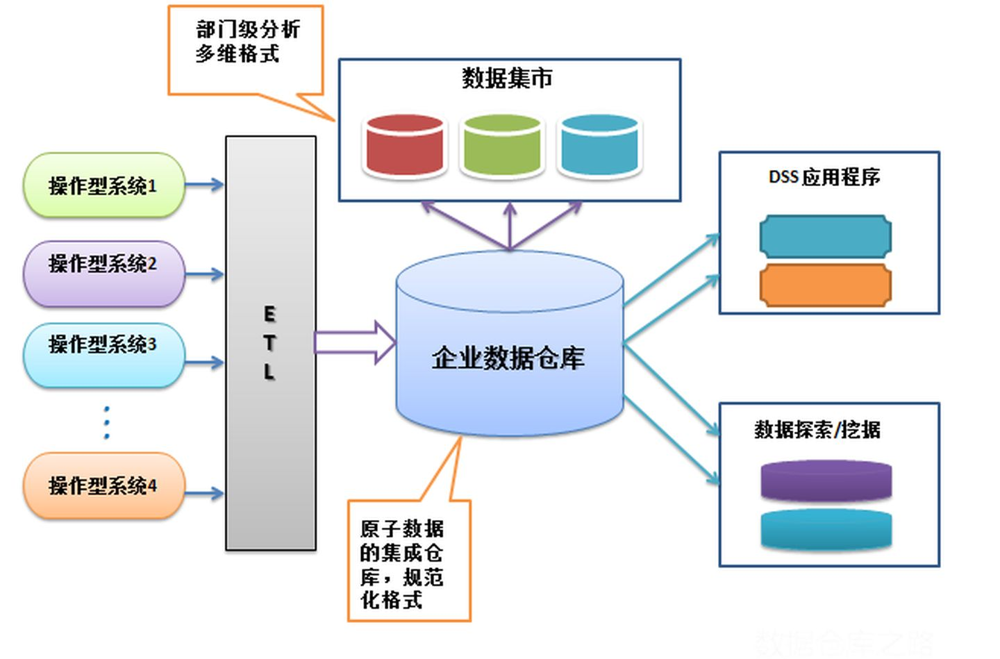
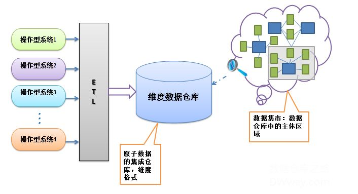

## 大数据分析-深度数据随想
-------------------------------------------------

**数据价值思考的起点**

- 数据=生产资料
- 技术=生产力
- 商业模式=生产关系
- 数据产品=价值变现渠道

### I.数据篇-Information,NLP,Mathematics

#### 1.1.数据分析的定义分类:

* 大数据的“4V”特征

 - Volume — 数据量大数据量巨大。 从数兆字节(TB)1 级别跃升到数十兆亿字节 (PB) 级别 。如一个CT图像含有大约 150MB的数据，而一个基因组序列文件大小约为 750MB，一个标准的病理接近 5 GB。考虑到人口数量和平均寿命等因素，仅一个社区医院就可以生成和累积达数个TB甚至数个PB级的数据。
 - Velocity — 速度快处理速度快，时效性强。 举例来说，检测医疗支付中的欺诈行为可以事后追溯，也可以实时检测；如果能够实现实时检测，即在支付发生前甚至在医疗服务发生前就识别出欺诈行为，则可有效避免重大经济损失。
 - Variety — 种类多数据类型繁多，来源广泛。 既包括数值型数据，也包括文字、图形、图像、音频、视频、网络日志、邮件、等非数值型或者非结构化数据，且预计这些非结构化信息将占未来十年数据产生量的 90%。
 - Value — 价值高价值的体现的是大数据分析应用的目的意义所在。 通过深入的大数据分析挖掘，可以为各方各面的经营决策提供有效支持，创造巨大的经济及社会价值。

#### 1.2.数据定义属性:

- 分类(定性属性) - 维度
- 数值(定量属性) - 度量
- MetaData - 数据描述数据
- MainData - 主数据
- RefData - 时间/空间维度数据

#### 1.3数据源分类:

1. 结构化数据：海量数据的查询、统计、更新等操作效率低
2. 非结构化数据：图片、视频、word、PDF、PPT等文件存储、不利于检索，查询和存储
3. 半结构化数据：转换为结构化数据存储、按照非结构化存储
4. 多数据源归整方案 - Hadoop等分布式存储

从数据来源上来讲，最重要的是我们要区分什么是交易数据什么是行为数据

**交易数据的特征:**

	这样的交易数据有什么特点呢？有两个重要的特点，首先一致性的要求很高，银行、电信的交易数据每一条都不错，而且处理的时事性要求很高。另外一个特点，就是它的数据量并没有到达海量的程度

**行为数据的特征:**

	行为数据的数据规模巨大,一个广告公司每天处理的数量是达到100亿次。它的一致性的要求很低。另外,行为数据里的价值的密度是很低的,要求我们必须要采取低成本的方案。

**由结构化数据转向非结构化数据**

	交易数据一般可理解为结构化数据。而行为数据对应于在互联网上大量存在的文本、图像、视频和用户行为的数据,大多为非结构化数据。

**企业本身的数据可以被定义为孤岛数据**

	站在广告主自己的角度，仅仅的使用广告主内部的数据是远远不够的，它要维护数据，而且把数据打通在一起去描述用户的偏好。这里边就涉及到很重要的技术和产品，怎么样来做数据的交易,怎么样数据的交换？这样才能使孤岛数据成为更加有价值的数据。

**采样分析的问题**

	采样分析的问题，不属于大数据的问题。全量的加工才属于大数据的问题。往往采样分析的手段,其实并不能够很好的反应整体的内容。

#### 1.4.数据发现数据

    1. 观察的存在和可用性
    2. 能够从观察中提取特征并对特征进行分类
    3. 能够有效地发现相关的历史背景 - 持久性上下文
    4. 能够对新的观察作出判断
    5. 当新的观察推翻先前的判断时，能够做出识别
    6. 能够积累和坚持主张
    7. 能够识别相关性/洞察力如何形成
    8. 能够通知相应实体的洞察力

### II.数据探索篇-多维数据分析&数据挖掘

[数据挖掘导图](_includes/DataMiningThinking.jpg)

**数据挖掘应用**

1. 数据处理:自然语言处理技术(NLP)
2. 统计和计数:A/B test、top N排行榜、地域占比
3. 多维分析:RFM分析,同比,环比,趋势分析
4. 机器学习:分类,预测模型,聚类,关联规则分析,文本情感分析
5. 人工智能:深度学习,迁移学习,建模仿真

        Tips:其中机器学习领域与数据库领域是数据挖掘的两大支柱

6. OLAP与数据挖掘-机器学习的差异

  - 主要差异在于OLAP则用于数据探索,Data Mining用在根据假设进行推测
  - Data Mining常能挖掘出超越归纳范围的关系,但OLAP仅能利用现有数据查询探索及可视化的报表

#### 2.1.数据挖掘&建模预测

   - SQL / R / Python / Spark / Weka
   - 相关性分析等
   - 特征提取
   - 设计建模
   - 数据训练
   - 模型评估
   - 循环迭代

#### 2.2.数据建模规则

**数据建模步骤**

定义Meta元数据模型  
建立数据模型为DataCleaning指定清洗规则  
为源数据与目标提供ETL mapping支持  
理清数据与数据之间的关系  

**维度建模与Cube**

- 星型模式与雪花模式

 a. 代理键SK与自然键NK  
 b. 代理键可以基于单一的列实现事实表和维度表之间的连接操作  
 c. 自然键可能包含多个列,历史记录等多条信息通过代理键来唯一对应  
 d. 代理键的替代方案:  

        1.客户维度表的主键可能包含'customer_id'和一个包含序列号的'version_number',允许表中存储一个客户的多个版本
        2.为自然键增加一个时间戳

 e. 缓慢变化维度（lowly changing dimension） 

- 通过维度环境使事实具有实际意义

 a. 用于过滤查询或报表  
 b. 用于控制聚集事实的范围  
 c. 用于确定信息的顺序与排序  
 d. 与事实一起构成提供报表的环境  
 f. 用于定义主从结构,分组,分类汇总,汇总等  

- 雪花模式及支架表 

        需要采用雪花模式和支架表的情况是一种特例而不能当做规则来使用

- 分析型环境,预先计算和存储这些冗余数据元素具有三个优点:性能，可用性和一致性

- 事实表粒度设计/宽表设计

#### 2.3.多维数据分析定义

- 分析多维数据  
    (产品ID-日期-地方-销售额)
- 数据立方体:计算聚集量
- 维归约: 在一个维上聚集将数据的维度从3维归约2维  
    `维归约的线性代数`  
    `主成分分析Principal Components Analysis - PCA`  
        = PCA把原先的n个特征用数目更少的m个特征取代,新特征是旧特征的线性组合,这些线性组合最大化样本方差,尽量使新的m个特征互不相关.  
    `奇异值分解Singular Value Decomposition - SVD`  
    `特征值分解和奇异值分解`  
    `维归约与PCA的区别`  
- 转轴(Pivoting): 在除两个维以外的所有维上聚集
- 切片(Slicing)和切块(dicing) - 穿透/查看明细
- 上卷(roll up)和下钻(drill down): 与聚集相关(基于维度的钻取)

#### 2.4.Summary Statistics汇总统计

- 频率与众数  
      `frequency(Vi)=属性值Vi的对象数/m`  
      `分类属性的众数(mode)是具有最高频率的值`  
- 均值(mean) & 中位数(median)
- 散步度量:极差与方差  
      `极差-range(x)=max(x)-min(x)`  
      `方差-variance(x)`  
      `标准差-standard deviation`  
- 多元汇总统计  
      `covariance matrix协方差矩阵`  
      `两个不同参数之间的方差就是协方差`  
      `correlation matrix相关矩阵`  
      `值集的倾斜度(skewness)`  

#### 2.5.分析应用-客户划分-电商零售模型

- 客户RFM模型
    消费新鲜度 (Recency)
    消费频度 (Frequency)
    消费金额 (Monetary)
- [客户RFM设计实例](http://wiki.yunat.com/pages/viewpage.action?pageId=39207407)
- [双十一RFM分析设计](http://wiki.yunat.com/pages/viewpage.action?pageId=43854085)
- 零售新老客分析
- 客户洞察新老客分析
- 客户分层金字塔模型
- [新零售分析模型设计](2017-04-16-data-usage-new-retail-analytics-design-note.md)

- 目标客户特征分析
- 商品类目内容分析
- 预测（响应,分类）模型
- 主成分分析PCA

#### 2.6.分析应用-客户划分-流量分析模型

核心在于用户特定行为的深度分析/数字化运营/增长黑客

- 数据指标开发

  * 网络行为数据指标
  * 电商交易数据指标
  * 服务内行为数据指标

- 流量数据分析

- 分类数据排名分析

- 历史数据趋势分析

- 基于内容分类数据的行为预测分析

  * 识别数据规则
  * 数据分类与详细信息
  * 有效分类行为数据采集
  * 基于分类数据的行为预测分析

- 点击率建模(click modeling)

- 分配规划(planning)

  

### II.数据探索篇-AI机器学习开发

- [机器学习Everything研究](2017-10-16-bigdata-ml-data-everything-note.md)
- [机器学习&Python数据挖掘](2017-10-16-ml-data-everything-note.md)
- [Python信息识别技术](2018-05-05-python-info-recognition-note.md)

#### 2.1.机器学习&人工智能

- 内容数据标签开发
- 数据智能清洗-识别数据规则&异常数据过滤
		* 数据清洗安全脱敏
		* 基于已标记范例的学习:有监督的学习
		* 借助神经网络的多重增强学习,实现海量数据有效过滤
	
		comments:基于海量数据的不确定性特征,高效的数据清洗与过滤算法非常有价值

#### 2.2.分析应用-文本分析算法

根据语义分析算法与NLP分词策略,针对文本进行标签分析

- 用户评价文本分析

- 评价模型

针对二元变量的分类模型的评价体系,例如用户评价分析

#### 2.3.标签开发-用户画像分析

- [用户特征信息库](2018-06-06-data-usage-user-label-profile-note.md)

  - 用户访问行为采集
  - 用户交易行为采集

- [用户行为分析深度-数据驱动](2017-09-30-data-usage-user-behavior-analysis-note.md)
- [区块链技术设计](2018-03-06-block-chain-design-note.md)

- 用户行为<->行为分类与特征提取<->用户特征属性关联
- 用户特征与标签规则的关联概率(置信度)
- 用户与属性标签的可信度矩阵

	1. 系列指标 
	
	-min- TP:True Positive
	-min- TN:True Negative
	-min- FP:False Positive
	-min- FN:False Negative
	
	-min- Accuracy
	-min- Error rate
	-min- Sensitivity
	-min- Specificity
	-min- Accuracy=Sensitivity+Specificity
	
	2. ROC曲线 - Receiver Operating Characteristic 曲线 
	3. KS值
	4. Lift值

PLSA \ LDA \ HMM:  [概率语言模型及其变形系列-PLSA及EM算法](http://www.52nlp.cn/%E6%A6%82%E7%8E%87%E8%AF%AD%E8%A8%80%E6%A8%A1%E5%9E%8B%E5%8F%8A%E5%85%B6%E5%8F%98%E5%BD%A2%E7%B3%BB%E5%88%971-plsa%E5%8F%8Aem%E7%AE%97%E6%B3%95)

### III.平台技术篇-大数据处理

#### 3.1.解决方案思考:

1. 数据采集与同步-Kafka
    海量数据采集 
2. 大数据离线存储: HDFS,Kudu
3. 实时流式计算: Apache Storm,Apache SparkStreaming(内存占用过大)
4. 大数据计算平台: Spark, Flink, MapReduce批处理技术
5. 内存数据存储: HBase Cassandra等
6. 分析型数据库: MPP(Vertica/Greenplum)
7. OLAP查询计算：SparkSQL, Hive, GoogleDremel, Impala, Presto, Druid, Kylin
8. 数据可视化趋势: D3, E-Charts

#### 3.2. 数据采集-爬虫&Scrapy

#### 3.3.数据预处理&探索

- 聚集:aggregation
- 抽样
- 维归约   
- 特征子集选择  
`用于降低维度,除去冗余和不相关的特征`  
`特征选择方法: embedded approach / filter approach / wrapper approach`  
`特征加权`  
- 特征创建  
`特征提取`  
`映射数据到新的空间`  
- 离散化和二元化  
`发现关联模式的算法要求数据是二元属性形式`  
- 变量变换  

#### 3.4.数据清理DataCleaning

A. _数据抽样_  
    建模样本: TrainingSet，ValidationSet，TestingSet  
    数据缺失值和异常值  

B. _数据转换_  
     数据标准化(Normalization)  

C. _数据筛选/特征筛选_  
     R平方  
     卡方检验(Chi-Square Statistics):适用于类别型变量的检验  
     数据降维:主成分分析和变量聚类  

D. _共线性问题_  
     自变量间存在较强的，甚至完全的线性相关关系  

E. _数据完整性验证_
     介于大多数数据来源的不稳定性, 数据完整性是极为重要的 

**设计独立数据质量监控组件**

#### 3.5.数据处理方案

* ETL Kettle开源工具
* 任务队列与任务规则
* 基于SQL/存储过程/UDF数据处理组件
* [Hive/Spark/Flink大数据处理](2017-07-29-bigdata-research-dataprocess-development.md)
* 大数据MQ-[Kafka应用](2017-07-29-bigdata-research-dataprocess-kafka-note.md)

#### 3.6.大数据处理开发

- ETL数据处理&数据同步 -Kettle/Sqoop/DataX/gphdfs
- [大数据处理-通用开发](2017-07-28-bigdata-research-bigdata-development.md)
- [大数据处理-实时数据计算](2017-07-27-bigdata-research-realtime-process.md)
- [大数据处理-流数据计算](2018-05-31-bigdata-research-dataprocess-stream-compute.md)
- [大数据查询-SQL Anywhere应用](2017-07-28-bigdata-analytics-sql-anywhere-design.md)
- 数据质量分析&数据监测(数据异常的验证非常重要)

- 基于传统数据仓库,批处理离线数据分析
- 基于实时大数据处理,敏捷商务智能BI
- 批量数据 - ETL - DataWarehouse
- 实时数据 - 信息交换 - OPDM 操作型数据集市

#### 3.7.大数据&数据仓库演进技术选型

A._[分布式基础架构解析](2017-07-27-bigdata-research-infrastructure-build.md)_

B._[分布式数据架构分析](2017-07-27-bigdata-research-database-architect.md)_
> HDFS(GFS) / HBase(Google BigTable) / Kudu   
> LevelDB / RocksDB  
> LSM / SSTable

C._[SQLonHadoop大数据分析](2017-07-28-bigdata-research-olap-sqlonhadoop-note.md)_:

D._[分布式OLAP的下一站](2021-05-05-bigdata-analytics-olap-next-generation-note.md)_:

> Dremel / F1&Spanner / Mesa / [GoogleTech](2019-05-01-bigdata-research-google-tech-solution.md)  
> [Impala&Kudu](2016-12-12-olap-distributed-impala-research-note.md)   
> [Greenplum](2017-02-11-greenplum-arch-design-note.md) / Vertica 分析型数据仓库  
> HTAP: [TiDB](2019-07-08-newdb-tidb-design-note.md) / OceanBase / Oushu Database(Apache HAWQ) / HashData  
> Doris / Clickhouse  

#### 3.9.BI数据仓库概念设计

A. _Bill Inmon的企业信息化工厂_  

> 采用第三范式的格式  
> ETL -> 企业数据仓库 -> 数据集市(多维物理数据) -> 用户探索&挖掘  

B. _Ralph Kilmball维度数据仓库(多维数据分析)_  

> 多维模型–星型模型  
> ETL -> 维度数据仓库 -> 虚拟数据集市(逻辑主题区域Cube) -> 用户探索&挖掘  
> 集合数据集市DataMarts在维度数据仓库中 跨主题区域的关键企业维度的一致性使用  
> 维度格式 可直接访问  

    Tip:维度建模分析成为当前主流。

C. _独立型数据集市_
> ETL -> 数据集市(关注维度/主题区域) -> 用户探索&挖掘  
> 脱离企业环境,只关注主题区域

### IV.数据产品设计

#### 4.1.常规分析产品设计

- 1. 数据提取 

    - 网络Scrapy  
    - 云平台数据API  
    - 数据库数据  
    - 大数据平台数据  
    - 实时数据处理  
    - Deep Web表单处理  

- 2. 数据建模

    - 数据表关联信息定义
    - Cube数据建模    

- 3. 数据预处理 

    - ETL + Data Cleaning(数据质量监控)
    - SQL/存储过程/UDF
    - 数据同步
    - 定时任务

    - 分布式实时流式计算 
    - 分布式批处理计算 

    > 当前数据分析产品将环节1,2,3打包进行敏捷可视化实现    

- 4. 大数据存储平台

    - 大数据平台Hadoop-HDFS&HBase等 / MPP(Greenplum&Vertica) / NoSQL数据库
    - 动态生成宽表
    - 数据库优化/Index创建/数据仓库设计

- 5. OLAP查询分析

    - OLAP Query Engine (支持SQL查询)  
    - 交互式MPP计算  
    - 内存计算 - Spark  
    - 缓存查询AggregateCache
    - [OLAP架构优化设计](http://wiki.yunat.com/pages/viewpage.action?pageId=47520652)
		- [NewBI技术架构](_includes/NewBI-Platform.png)

- 6. 数据可视化

    仪表盘设计  
    可视化图表展示  
    可视化时间空间数据 - 全局时间空间数据过滤  
    多维图表可视化  
    [D3](https://d3js.org/)  
    - selection: 删除或不突出某些对象和属性
		- 少量属性的可视化 - 单维图表
		- 扩展的二维/三维图 - 多维图表
		- 可视化时间空间数据 - 时间维度+地理维度
		- 可视化高维数据：	数据矩阵/平行坐标系/星型坐标和Chernoff  
	  - 词云图  
	  - sunburst partition

数据可视化&商业智能-Tableau/永洪BI/E-Charts/D3.js

- 7. 数据产品性能优化

	数据存储/数据模型/ETL/查询引擎/内存模型/业务架构/数据更新

- 8. 数据产品常规问题

	数据安全脱敏/数据验证/数据完整性/数据监测/数据冲突/样本异常/性能问题

#### 4.2.敏捷分析竞品分析

*敏捷BI-行业数据分析*

- [Tableau分析](http://www.tableau.com/products/cloud-bi)
- [Looker](http://www.looker.com/)
- [永洪BI](http://wiki.yunat.com/pages/viewpage.action?pageId=47515985)
- PowerBI
- [星环科技](http://wiki.yunat.com/pages/viewpage.action?pageId=45850523)
- [魔镜MagicWindow](http://wiki.yunat.com/pages/viewpage.action?pageId=46766678)
- [QuickBI](http://wiki.yunat.com/pages/viewpage.action?pageId=46766762)

*日志分析/数字化运营*

- [SENSORS Analytics](https://sensorsdata.cn/?ch=itjuzi)
- GrowingIO
- 诸葛IO
- Splunk
- SLS

### V.数据商业化

#### 1.大数据生意的关键点

- 第一采集相应的行为数据来源(线上/线下/物联网)
- 第二点找到一个自动化应用，找到一个可以用机器决策的自动化应用
- 第三根据行业差异设计不同的数据模型(全量加工),技术解决相应的问题

#### 2.行业数据变现

1. 哪些行业需要数据
2. 怎样可以高效精准地完成有价值的数据采集
3. 如何把这些数据提供的信息变现

#### 3.用户流量数据变现

近些年来大家发现数据变现的能力在某种意义上还要强过流量变现的能力。数据怎么变现？大家先不要去看大数据领域讲的东西，你先好好学习学习广告，因为数据的变现、数据的交易、数据隐私保护的边界在广告领域得到了充分的研究和工业界实战。你要不了解广告，你一定是从头走一遍弯路，这个弯路是非常多的。

**数据价值的合理评估**

- 网络行为数据分析采集
- 内容数据+NLP分类识别规则定义+内容榜单分析
- 内容流量与趋势分析
- 人群定向筛选+对应内容/行为分析+广告投放
- 总体/定向用户行为分析+用户分层

#### 4. 大数据营销应用

如果说我们已经有了大规模的行为数据，建立在我们所讲的第一条的基础上，这些问题必须要通过大规模的行为的架构才能够得到解决，这是真正的大数据的问题。

    Tips:比如说个性化推荐/计算广告/个人征信是非常典型的大数据的问题。

**洞察应用和自动化应用**

*洞察应用*

报表,就是全局和局部统计信息的获取。主要是用于宏观的决策的支持

*自动化应用*

应用本身的目的,是为了捕获个体的行为和特征,比如说定向广告。用于微观业务的实施。每个人的画像，用的就是为这个人本身的内容和定向广告的投送来服务的，所以它是用在非常微观的使用的场景里。面向的对象就不是给领导看的，而是给销售人员看的。

> 洞察天生适合的场景是给专家决策用的，自动化天生适合的场景是为数据分析师所服务的。

**机器决策**

数据从它的产生到加工到影响到决策的过程再到重新的产生这个过程是自动化的，是一个闭环，没有人在里面起作用，这样的往往比人在里边产生的价值要多得多。

	Tips:
	- 只有给机器用的才是真正的大数据
	- 大数据的使用系统的一致性的要求是低的

_搜索/场景设置-推荐-广告变现(计算广告)_

_头部流量-场景驻留-广告曝光变现_

**广告营销计算技术**-[计算广告](2017-07-01-data-usage-compute-advertise-design-note.md)

计算广告最具挑战的算法问题大多都集中在离线数据处理的部分。离线数据处理有两 个输出目标:

一是统计日志得到报表、dashboard 等，供决策人进行决策时作为参考;
二是利用数据挖掘、机器学习技术进行受众定向、点击率预估、分配策略规划等，为在线的 机器决策提供支持。

		- 广告内容分析与检索
		- 广告排序和用户行为反馈模型

#### 5. 全渠道营销解决方案

作为大企业，一定要学会打通数据，然后利用这些数据去服务所有客户的生命周期和全渠道。

	1.数据打通-解决数据孤岛问题
	2.DMP第三方数据平台+广告效果投放与监测-精准人群投放
	3.CDP客户数据平台+销售线索转换
	4.线上/线下协调改造
	5.售后服务
	6.CRM客户分析-老客促活

**DMP vs CDP**

**DMP->CDP<-CRM**

#### 6.产业大数据驱动转型(核心)

数据&行业业务整合落地

核心在于大数据应用生态化,通过大数据产品协同与数据应用链路打通,实现大数据生态化建设

_金融大数据_

*大数据征信风控模型*
	
*大数据金融交易模型*

*农业大数据*

_物联网大数据_

#### O.数据&AI-数据变现终局

	- 大数据&AI架构升级
	- 计算机-人工模拟(视觉/语音)
	- 语义识别(理解/知识图谱/传递信息/沟通/同感)
	- 全链路数据应用/数据隐私控制

### X.Reference

- 数据挖掘导论
- STAR SCHEMA:数据仓库维度设计权威指南
- The Data Warehouse ETL Toolkit (Kimball著)
- 数学之美(吴军)
- 大数据日知录
- 机器学习与数据挖掘-[加州理工学院公开课](http://open.163.com/special/opencourse/learningfromdata.html)
- [机器学习](http://open.163.com/special/opencourse/machinelearning.html)
