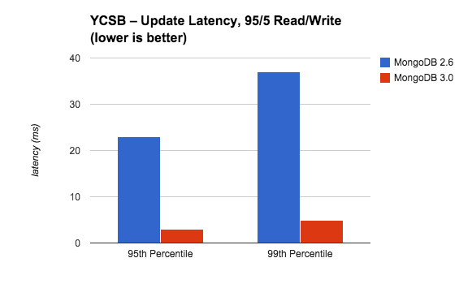
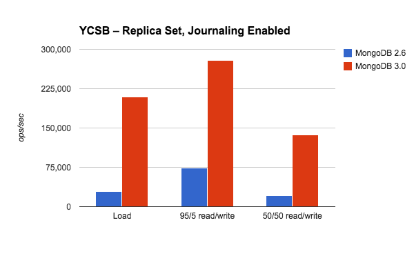

## MongoDB核心研究
------------------------------------------------

### 1.MongoDB NoSQL商业化的开端

提供最类似SQL查询的NoSQL数据库，应用最广泛的NoSQL数据库
当然也是现有商业NoSQL数据库中性能最差
 
### 2.MongoDB 背景

- 基于内容Document的数据存储方式
- 消息/留言/日记/多媒体数据

### 3.CAP & BASE 理论

- CAP原则：最终一致性/高可用性/分区容忍性
- CAP的trade off - 最多支持其中两个属性。常见解决方案为AP模式
- BASE理论:Basically Available（基本可用）/Soft-state（ 软状态/柔性事务）/Eventual Consistency（最终一致性）
- 不支持Transaction(ACID)的MongoDB
- WorkAround:Two-phase commit(2PC)二段式提交

### 4.MongoDB 架构特点

a. Data model from relational to document-based  
文档大小限制16M  
capped collection 固定长度Collection，滚动更新，可用于log统计  
b. Embedded docs for speed
c. Agile development with dynamic schemas
d. Easier horizontal scalability because joins aren’t as important

#### 4.1. Storage Engine (内存杀手的原因)

a. MMAP (默认存储引擎)
它会把数据文件映射到内存中，如果是读操作，内存中的数据起到缓存的作用，如果是写操作，内存还可以把随机的写操作转换成顺序的写操作，总之可以大幅度提升性能。

b. WiredTiger (3.0版本后新存储引擎)
--wiredTigerCacheSizeGB (默认物理内存一半)
--syncdelay (同步延迟1分钟)
--wiredTigerCollectionBlockCompressor (snappy或zlib)

c. Journaling (WAL)
- MongoDB使用MMAP(内存映射文件)并且每60秒向磁盘输出一次通知，这就意味着最大程度上你可能丢失60秒加上向硬盘输出通知这段时间内所有的数据。
- The WiredTiger journal ensures that writes are persisted to disk between checkpoints.
- WiredTiger uses checkpoints to flush data to disk by default every 60 seconds or after 2GB of data has been written.

#### 4.2.内存模型

#### 4.3.分布式架构

a. _主从模式_
b. _ReplSet复制集_  
   	 The size of the oplog is configurable and by default is 5% of the available free disk space
c. _Sharding分片_  
   	不可以更改文件中的shard key  
   	Range-based Sharding  
   	Hash-based Sharding  
   	Location-aware Sharding  
d. _读写分离_
 

#### 4.4.MongoDB数据结构

_BSON (Binary JSON)_  
The BSON encoding extends the popular JSON (JavaScript Object Notation) representation to include additional types such as int, long, and floating point.

#### 4.5.树状结构设计

MongoDB schemaless文档存储不限制表/Collection格式，可支持TreeModel design. 
a. 单文档存储整根树(Full Tree in Signle Document)
b. 父连接(Parent Links)
c. 子链接(Child Links)
d. 祖先数组(Array of Ancestors)
f. 物化路径(Materialized Path[Full Path in Each Node])  
注意:虽然MongoDB支持嵌套文档格式，但其插入与更新性能较差，不建议设计过于复杂的嵌套格式

#### 4.6.MongoDB 查询与聚合

_强查询弱更新_
- Key-value queries
- Range queries
- Geospatial queries
- Text Search
- Aggregation Framework
- MapReduce queries
 
_Query SQL_
- findAndModify
- update
- upsert
- $push
- $pop
- $pull

#### 4.7.索引Index

- Unique Indexes
- Compound Indexes
- Array Indexes
- TTL Indexes.
- Geospatial Indexes
- Sparse Indexes
- Text Search Indexes

### 5.MongoDB 性能限制

Because MongoDB provides in-memory performance, for most applications there is no need for a separate caching layer.  
由于MongoDB所提供的内存层数据管理，常规应用中并不需要提供另外独立的缓存层处理

### 6.MongoDB 3.0 新特性

6.1. _WiredTiger特性_  
>	支持文档级别并发控制  
>	支持对所有集合和索引进行Block压缩和前缀压缩(包括journal)  
>	通过storage.wiredTiger.engineConfig.cacheSizeGB可控制MongoDB所能使用的最大内存(该参数默认值为物理内存大小的一半)  

6.2. _MMAPv1存储引擎优化_
>	并发锁粒度由数据库级别锁提升为集合级别锁
>	抛弃了基于paddingFactor的自适应分配方式,基于usePowerOf2Sizes的预分配方式成为默认的文档空间分配方式
>	Replica Set 优化
>	复制集成员增长到50个。但能够投票的最大成员个数依然为7个
>	Primary节点StepDown处理方式变化
>	Sharded Clusters 优化
>	新增工具函数 sh.removeTagRange()
>	提供更可预测的Read Preference处理
>	为chunk迁移提供writeConcern设置
>	增加均衡器状态显示

6.3. _MongoDB性能比较_

查看比较1: .
查看比较2: .

### 7.MongoDB实践

### 8.MongoDB ORM 设计

