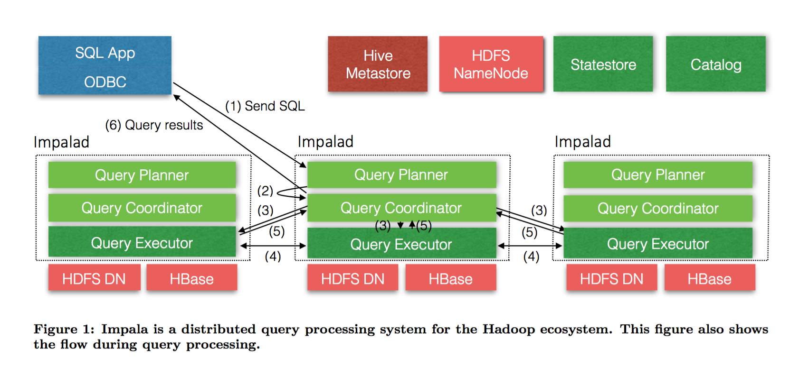

## Impala & Kudu Big Data OLAP Architect

------------------------------------------------------------------------

Big Data Analysis Framework = OLAP(SQL on Hadoop/Impala) + Big Data Storage(HDFS/Kudu) 

### Impala

#### Impala Feature:

Impala apply Hadoop standard components(Metastore,HDFS,HBase,YARN,Sentry)

- Impala is the highest performing SQL-on-Hadoop system,especially under multi-user workloads.(nearly three times on average for multi-user)
- Impala SQL doesn't support UPDATE or DELETE like Hive.Impala supports ALTER TABLE DROP PARTITION.
- The key point of the impala design of an MPP database is how to run on hundrens of nodes is the coordination and synchronization of cluster-wide metadata.For example,up-to-date versions of the system catalog
- Designed a simple publish-subscribe service called the statestore to disseminate metadata changes to a set of subscribers,not establish a TCP connection or create synchronous RPCs(avoid network connection cost).
- Impala’s catalog service serves catalog metadata to Impala daemons via the statestore broadcast mechanism, and executes DDL operations on behalf of Impala daemons.
- The catalog service pulls information from third-party metadata stores(for example, the Hive Metastore or the HDFS Namenode), and aggregates that information into an Impala-compatible catalog structure.The default third-party metadata store is Hive Metastore and could be replaced by HBase.
- Impala supports inline views, uncorrelated and correlated subqueries (that are rewritten as joins), all variants of outer joins as well as explicit left/right semi- and anti-joins, and analytic window functions.
- Impala chooses whichever strategy is estimated to minimize the amount of data exchanged over the network, also exploiting existing data partitioning of the join inputs.The design is similar to Greenplum.
- Runtime code generation using LLVM in Impala's backend is one of the techniques to improve execution times.LLVM is a compiler library and collection of related tools which is designed to be modular and reusable. It allows applications like Impala to perform just-in-time (JIT) compilation within a running process.
- Impala uses an HDFS feature called short-circuit local reads to bypass the DataNode protocol when reading from local disk in order to perform data scans from both disk and memory at or near hardware speed.
- HDFS caching allows Impala to access memory-resident data at memory bus speed and also saves CPU cycles as there is no need to copy data blocks and/or checksum them.
- Impala supports most popular file formats:Avro,RC,Sequence,TEXTFILE and Parquet.Recommend using Apache Parquet because Parquet offer both high compression and scan efficency.

#### Impala Architect

Impala is massively-parallel query execution engine,which runs on hundreds of machines in existing Hadoop clusters.

.

* Impala main components: *

> Impala daemon(impalad)   
> Statestore daemon(statestored)  
> Catalog daemon(catalogd)  
> HDFS + Hive Metastore  

#### Impala SQL Query:

Query compilation process: Query parsing,semantic analysis and query planing/optimization

An executable query plan is constructed in two phases: (1) Single node planning and (2) plan parallelization and fragmentation. 

	1)A non- executable single-node plan tree consists of HDFS/HBase scan,hash join,cross join,union,hash aggregation,sort,top-n and analysis evaluation.
	2)Takes the single-node plan as input and produces a distributed execution plan in order to to minimize data movement and maximize scan locality.
    All aggregation is currently executed as a local pre-aggregation followed by a merge aggregation operation.

The impala backend is written in C++ and uses code generation at runtime to produce e cient codepaths (with respect to instruction count) and small memory overhead. 
Impala employs a partitioning approach for the hash join and aggregation operators. 
When building the hash tables for the hash joins and there is reduction in cardinality of the build-side relation, impala constructs a Bloom-filter which is then passed on to the probe side scanner, implementing a simple version of a semi-join.

Impala query cache could evidently improve execute times.Compare with the first query,next query speeds up the execution by 2-6x.

* Code Generation Design & Performance *

Virtual function calls incur a large performance penalty and cost large runtime overheads.Impala uses code generation to replace the virtual function call with a call directly to the correct function, which can then be inlined. 
JIT compilation has an effect similar to custom-coding a query. For example, it eliminates branches, unrolls loops, propagates constants, offsets and pointers, inlines functions. 
Code generation has a dramatic impact on performance - Speed up 5.7x

* Runtime Code Generation *

In order to perform data scans from both disk and memory at or near hardware speed,Impala uses an HDFS feature called short-circuit local reads to bypass the DataNode protocol when reading from local disk.
Avro,RC,Sequence,plain text,Parquet(Recommend)

* Resource Management:YARN & Llama *

YARN has a centralized architecture, where frameworks make requests for CPU and memory resources which are arbitrated by the central Resource Manager service,but it also imposes a significant latency on resource acquisition. 
Impala implemented a complementary but independent admission control mechanism that allowed users to control their workloads without costly centralized decision-making. 
Llama for Low-Latency Appli- cation MAster, implements resource caching, gang scheduling and incremental allocation changes while still deferring the actual scheduling decisions to YARN for resource requests.

The long-term goal of Impala is to support mixed-workload resource management through a single mechanism that supports both the low latency decision making of admission control & Llama(Low-Latency Application Master), and the cross-framework support of YARN.

#### Physical schema design 

CREATE TABLE T (...) PARTITIONED BY (day int,month int) LOCATION '<hdfs-path>' STORED AS PARQUET;
We could build time PARTITION for source table as the extend time items.  

### Kudu
 
Kudu is the hybrid architecture in order to replace HBase + HDFS&Parquet storage architect.

#### Kudu Feature:

- Kudu is a new storage system designed and implemented from the ground up to fill this gap between high-throughput sequential-access storage systems such as HDFS and low-latency random-access systems such as HBase or Cassandra.
- Kudu offers a simple API for row-level _inserts_, _updates_, and _deletes_, while providing table scans at throughputs similar to Parquet, a commonly-used columnar format for static data.
- Each such column has a name, type (e.g INT32 or STRING) and optional nullability.The primary key enforces a uniqueness constraint (at most one row may have a given primary key tuple) and acts as the sole index by which rows may be efficiently updated or deleted.
- Kudu does not currently offer secondary indexes or uniqueness constraints other than the primary key.
- Kudu does not offer any multi-row transactional APIs: each mutation conceptu- ally executes as its own transaction, despite being automatically batched with other mutations for better performance.
- Kudu offers only a Scan operation to retrieve data from a table.Currently, we offer only two types of predicates: comparisons between a column and a constant value, and composite primary key ranges.
- Kudu provides APIs for callers to determine the map- ping of data ranges to particular servers to aid distributed execution frameworks such as Spark, MapReduce, or Impala in scheduling.
- Kudu provides clients the choice between two consistency modes. The default consistency mode is snapshot consistency.
- Although Kudu uses _timestamps_ internally to implement concurrency control, Kudu does not allow the user to manually set the timestamp of a write operation. 

#### Kudu Architecture:

- Following the design of BigTable/GFS/HDFS,Kudu relies on a single Master server, responsible for metadata, and an arbitrary number of Tablet Servers, responsible for data.
- The master server can be replicated for fault tolerance, supporting very fast failover of all responsibilities in the event of an outage.
- The tables in Kudu are horizontally partitioned. Kudu, like BigTable, calls these horizontal partitions tablets. 
- For large tables where throughput is important, we recommend on the order of 10-100 tablets per machine. Each tablet can be tens of gigabytes.
- Kudu supports a flexi- ble array of partitioning schemes,unlike Bigdata or Cassandra.The partition schema is made up of zero or more hash- partitioning rules followed by an optional range-partitioning rule:
	* A hash-partitioning rule consists of a subset of the primary key columns and a number of buckets.
	* A range-partitioning rule consists of an ordered subset of the primary key columns.
- Kudu replicates all of its table data across multiple machines. When creating a table, the user specifies a replication factor, typically 3 or 5, depending on the application’s availability SLAs. Kudu’s master strives to ensure that the requested number of replicas are maintained at all times.
	* Kudu employs the Raft consensus algorithm to repli- cate its tablets. In particular, Kudu uses Raft to agree upon a logical log of operations (e.g. insert/update/delete) for each tablet.
	* If the replica is in fact still acting as the leader, it employs a local lock manager to serialize the operation against other concurrent operations, picks an MVCC timestamp, and proposes the operation via Raft to its followers.
	* Note that there is no restriction that the leader must write an operation to its local log before it may be com- mitted: this provides good latency-smoothing properties even if the leader’s disk is performing poorly.
	* If the leader itself fails, the Raft algorithm quickly elects a new leader. By default, Kudu uses a 500- millisecond heartbeat interval and a 1500-millisecond election timeout; thus, after a leader fails, a new leader is typically elected within a few seconds.
- Kudu does not replicate the on-disk storage of a tablet, but rather just its operation log.
- Because the storage layer is _decoupled_ across replicas, none of these race conditions resulted in unrecoverable data loss:

### Reference

- [Impala Documents](http://www.cloudera.com/documentation/enterprise/latest/topics/impala.html)
- [Impala Code](https://github.com/cloudera/Impala/wiki)
- [Impala Paper]
- [Kudu Paper]
