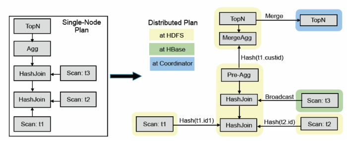

## Impala&Kudu Realtime OLAP Research Note

------------------------------------------------------------------------

**Impala + Kudu OLAP Solution**

### Impala Realtime OLAP Engine

#### 1.Impala Feature:

Impala apply Hadoop standard components(Metastore,HDFS,HBase,YARN,Sentry)

- Impala is the highest performing SQL-on-Hadoop system,especially under multi-user workloads.(nearly three times on average for multi-user)
- Impala SQL doesn't support UPDATE or DELETE like Hive.Impala supports ALTER TABLE DROP PARTITION.
- The key point of the impala design of an MPP database is how to run on hundrens of nodes is the coordination and synchronization of cluster-wide metadata.For example,up-to-date versions of the system catalog
- Designed a simple **publish-subscribe** service called the statestore to disseminate metadata changes to a set of subscribers,not establish a TCP connection or create synchronous RPCs (avoid network connection cost).
- Impala’s catalog service serves catalog metadata to Impala daemons via the statestore broadcast mechanism, and executes DDL operations on behalf of Impala daemons.
- The catalog service pulls information from third-party metadata stores(for example, the Hive Metastore or the HDFS Namenode), and aggregates that information into an Impala-compatible catalog structure.The default third-party metadata store is Hive Metastore and could be replaced by HBase.
- Impala supports inline views, uncorrelated and correlated subqueries (that are rewritten as joins), all variants of outer joins as well as explicit left/right semi- and anti-joins, and analytic window functions.
- Impala chooses whichever strategy is estimated to minimize the amount of data exchanged over the network, also exploiting existing data partitioning of the join inputs.The design is similar to Greenplum.
- Runtime code generation using LLVM in Impala's backend is one of the techniques to improve execution times(Presto has the similar design).**LLVM** is a compiler library and collection of related tools which is designed to be modular and reusable. It allows applications like Impala to perform just-in-time (JIT) compilation within a running process(使用LLVM来进行编译为二进制代码并执行,避免传统数据库引擎繁琐的Switch-Case逻辑).
- Impala uses an HDFS feature called **short-circuit** local reads to bypass the DataNode protocol when reading from local disk in order to perform data scans from both disk and memory at or near hardware speed.
- HDFS caching allows Impala to access memory-resident data at memory bus speed and also saves CPU cycles as there is no need to copy data blocks and/or checksum them.
- Impala supports most popular file formats: Avro,RC,Sequence,TEXTFILE and Parquet.Recommend using Apache Parquet because Parquet offer both high compression and scan efficency.


#### 2.Impala Architect

Impala is massively-parallel query execution engine,which runs on hundreds of machines in existing Hadoop clusters.


SendSQL -> Query Planer -> Query Coordinator -> Query Executor -> Query Coordinator -> SQLResult

* Impala main components:

	- Impala daemon(impalad) <br/> 
	- Statestore daemon(statestored) - Impala’s metadata publish-subscribe service(broadcast). <br/>
	- Catalog daemon(catalogd) - serves as Impala’s catalog repository and metadata access gateway. <br/>
	- Hive Metastore - datastorage metadata info <br/>
	- DataStorage - Hive&HDFS / HBase / Kudu 

* Impala daemon(impalad) module:

	- Query Planer
	- Query Coordinator
	- Query Executor

#### 3.Frontend - Impala SQL Query

Query compilation process: Query parsing,semantic analysis and query planing/optimization

#### Logical query optimization for Impala



An executable query plan is constructed in two phases: 

	(1) Single node planning 
	(2) plan parallelization and fragmentation.

1) A non-executable single-node plan tree consists of 

	HDFS/HBase scan,hash join,cross join,union,hash aggregation,sort,top-n,EXCHANGE and analysis evaluation.

1.1) Cost estimation is based on table/partition cardinalities plus distinct value counts for each column.

2) Takes the single-node plan as input and produces a distributed execution plan in order to to minimize data movement and maximize scan

	locality: in HDFS, remote reads are considerably slower than local ones.

2.1) The supported join strategies are **broadcast** and **partitioned**. Impala chooses whichever strategy is estimated to minimize the amount of data exchanged over the network, also exploiting existing data partitioning of the join inputs.

2.2) All aggregation is currently executed as a local pre-aggregation followed by a merge aggregation operation.

2.3) For grouping aggregations(分组聚合), the pre-aggregation output is partitioned on the grouping expressions and the merge aggregation is done
in parallel on all participating nodes. For non-grouping aggregations, the merge aggregation is done on a single node.

_partitioned hash join_

Impala employs a partitioning approach for the hash join and aggregation operators.<br/>
When building the hash tables for the hash joins and there is reduction in cardinality of the build-side relation, impala constructs a Bloom-filter which is then passed on to the probe side scanner, implementing a simple version of a semi-join.

** About Hadoop Join Optimizer **

** Impala Query Cache **

Impala query cache could evidently improve execute times.Compare with the first query,next query speeds up the execution by 2-6x.

#### 4.Backend

The impala backend is written in C++ and uses code generation at runtime to produce a cient codepaths(with respect to instruction count) and small memory overhead.<br/>

**Vector query execution**

一次getNext处理一批记录,多个操作符可以做pipeline。

**Code Generation Design & Performance**

_Virtual function_ calls incur a large performance penalty and cost large runtime overheads.Impala uses code generation to replace the virtual function call with a call directly to the correct function, which can then be inlined.<br/>

JIT compilation has an effect similar to custom-coding a query. For example, it eliminates branches, unrolls loops, propagates constants, offsets and pointers, inlines functions.<br/>
Code generation has a dramatic impact on performance - Speed up 5.7x.(LLVM编译执行,CPU密集型查询效率提升5倍以上)

**IO Localization**

In order to perform data scans from both disk and memory at or near hardware speed,Impala uses an HDFS feature called *short-circuit local reads* to bypass the DataNode protocol when reading from local disk.<br/>
(利用HDFS short-circuit local read功能，实现本地文件读取)

**Data File Format**

Impala support data file formats include Avro,RC,Sequence,plain text,Parquet(Recommend) and Kudu.(Parquet列存，相比其他格式性能最高提升5倍。)


#### 5.Resource Management:YARN & Llama

YARN has a centralized architecture, where frameworks make requests for CPU and memory resources which are arbitrated by the central Resource Manager service,but it also imposes a significant latency on resource acquisition.<br/>
Impala implemented a complementary but independent admission control mechanism that allowed users to control their workloads without costly centralized decision-making.<br/>
Llama for Low-Latency Appli- cation MAster, implements resource caching, gang scheduling and incremental allocation changes while still deferring the actual scheduling decisions to YARN for resource requests.

The long-term goal of Impala is to support mixed-workload resource management through a single mechanism that supports both the low latency decision making of admission control & Llama(Low-Latency Application Master), and the cross-framework support of YARN.<br/>

	1）引入快速、非集中式的查询准入机制,控制查询并发度。
	2）LLAM(low latency application master)通过缓存资源,批量分配,增量分配等方式实现降低资源分配延时。


#### 6.Physical schema design 

```sql
CREATE TABLE T (...) PARTITIONED BY (day int,month int) LOCATION '<hdfs-path>' STORED AS PARQUET;
```

We could build time PARTITION for source table as the extend time items. 


#### 7.Impala Performance Tuning

* Choose the appropriate file format for the data.
* Avoid data ingestion processes that produce many small files.

	Always use INSERT ... SELECT to copy significant volumes of data from table to table within Impala. Avoid INSERT ... VALUES for any substantial volume of data or performance-critical tables, because each such statement produces a separate tiny data file. 

* Choose partitioning granularity based on actual data volume.	

	When deciding which column(s) to use for partitioning, choose the right level of granularity. For example, should you partition by year, month, and day, or only by year and month? Choose a partitioning strategy that puts at least 256 MB of data in each partition, to take advantage of HDFS bulk I/O and Impala distributed queries.

	Over-partitioning(过度分区) can also cause query planning to take longer than necessary, as Impala prunes the unnecessary partitions. Ideally, keep the number of partitions in the table under 30 thousand.

* Use smallest appropriate integer types for partition key columns.
* Choose an appropriate Parquet/Kudu block size.
	
	By default, the Impala INSERT ... SELECT statement creates Parquet files with a 256 MB block size. 
	You can set the PARQUET_FILE_SIZE query option before doing an INSERT ... SELECT statement to reduce the size of each generated Parquet file.

* Gather statistics for all tables used in performance-critical or high-volume join queries.
* Minimize the overhead of transmitting results back to the client.
* Verify that your queries are planned in an efficient logical manner
* Verify performance characteristics of queries.
* Use appropriate operating system settings.


#### 8.Performance Considerations for Join Queries

- COMPUTE STATS statement, and then let Impala automatically optimize the query based on the size of each table, number of distinct values of each column, and so on
- Use STRAIGHT_JOIN-override the automatic join order optimization by specifying the STRAIGHT_JOIN keyword immediately after the SELECT keyword.

	The logical join order to try would be BIG, TINY, SMALL, MEDIUM Tables.(这样推荐的join查询顺序可以最大限度的缩小查询结果)

	The STRAIGHT_JOIN keyword turns off the reordering of join clauses that Impala does internally, and produces a plan that relies on the join clauses being ordered optimally in the query text. 

	```sql
	select straight_join x from medium join small join (select * from big where c1 < 10) as big
	  where medium.id = small.id and small.id = big.id;
	```
- The Impala query planner chooses between different techniques for performing join queries, depending on the absolute and relative sizes of the tables.
- **Broadcast joins** are the default, where the right-hand table is considered to be smaller than the left-hand table, and its contents are sent to all the other nodes involved in the query. 
- **Partitioned join** (not related to a partitioned table) is more suitable for large tables of roughly equal size(相似表容量join查询).This join technique is that portions of each table are sent to appropriate other nodes where those subsets of rows can be processed in parallel.
Join order have a large impact for query optimization.
- [Join Performance Considerations](http://www.cloudera.com/documentation/enterprise/5-8-x/topics/impala_perf_joins.html#perf_joins)


#### 9.Impala FQA

[Impala FQA base on CDH 5.5.x](https://www.cloudera.com/documentation/enterprise/5-5-x/topics/impala_faq.html)


### Kudu Bigdata Storage
 
Kudu is the hybrid architecture in order to replace HBase + HDFS-Parquet storage architect.

#### 1.Kudu Feature:

- Kudu is a new storage system designed and implemented from the ground up to fill this gap between high-throughput sequential-access storage systems such as HDFS and low-latency random-access systems such as HBase or Cassandra.
- Kudu offers a simple API for row-level _inserts_, _updates_, and _deletes_, while providing table scans at throughputs similar to Parquet, a commonly-used columnar format for static data.
- Each such column has a name, type (e.g INT32 or STRING) and optional nullability.The primary key enforces a uniqueness constraint (at most one row may have a given primary key tuple) and acts as the sole index by which rows may be efficiently updated or deleted.
- Kudu does not currently offer secondary indexes or uniqueness constraints other than the primary key.
- Kudu does not offer any multi-row transactional APIs: each mutation conceptually executes as its own transaction, despite being automatically batched with other mutations for better performance.
- Kudu offers only a Scan operation to retrieve data from a table.Currently, we offer only two types of predicates: comparisons between a column and a constant value, and composite primary key ranges.
- Kudu provides APIs for callers to determine the mapping of data ranges to particular servers to aid distributed execution frameworks such as Spark, MapReduce, or Impala in scheduling.
- Kudu provides clients the choice between two consistency modes. The default consistency mode is snapshot consistency.
- Although Kudu uses _timestamps_ internally to implement concurrency control, Kudu does not allow the user to manually set the timestamp of a write operation. 

#### 2.Kudu Architecture:

- Following the design of BigTable(HBase)/GFS(HDFS),Kudu relies on a single Master server, responsible for metadata, and an arbitrary number of Tablet Servers, responsible for data.
- The master server can be replicated for fault tolerance, supporting very fast failover of all responsibilities in the event of an outage.

##### 2.1.Partition in Kudu

- The tables in Kudu are **horizontally partitioned**. Kudu, like BigTable, calls these **horizontal partitions tablets**. For large tables where throughput is important, we recommend on the order of 10-100 tablets per machine. Each tablet can be tens of gigabytes.
- Kudu supports a flexible array of partitioning schemes,unlike Bigdata(key-range-based partitioning) or Cassandra(hash-based partitioning).The partition schema acts as a function which can map from a primary key tuple into a binary partition key.The partition schema is made up of zero or more hash-partitioning rules followed by an optional range-partitioning rule:
	* A hash-partitioning rule consists of a subset of the primary key columns and a number of buckets.
	* A range-partitioning rule consists of an ordered subset of the primary key columns.
- By employing these partitioning rules, users can easily trade off between query parallelism and query concurrency based on their particular workload. time series=range partition,host/metric=hash partition.

##### 2.2.Replication

- Kudu replicates all of its table data across multiple machines. When creating a table, the user specifies a replication factor, typically 3 or 5, depending on the application’s availability SLAs. Kudu’s master strives to ensure that the requested number of replicas are maintained at all times.
	* Kudu employs the Raft consensus algorithm to replicate its tablets. In particular, Kudu uses Raft to agree upon a logical log of operations (e.g. insert/update/delete) for each tablet.
	* If the replica is in fact still acting as the leader, it employs a local lock manager to serialize the operation against other concurrent operations, picks an MVCC timestamp, and proposes the operation via Raft to its followers.
	* Note that there is no restriction that the leader must write an operation to its local log before it may be committed: this provides good latency-smoothing properties even if the leader’s disk is performing poorly.
	* If the leader itself fails, the Raft algorithm quickly elects a new leader. By default, Kudu uses a 500-millisecond heartbeat interval and a 1500-millisecond election timeout; thus, after a leader fails, a new leader is typically elected within a few seconds.
- Kudu does not replicate the on-disk storage of a tablet, but rather just its operation log.The physical storage of each replica of a tablet is fully decoupled.
- Because the storage layer is _decoupled_ across replicas, none of these race conditions resulted in unrecoverable data loss.


- Kudu implements Raft configuration change following the one-by-one algorithm.

##### 2.3.Kudu Master

- Kudu’s central master process has several key responsibilitie:
	* Act as a **catalog manager**, keeping track of which tables and tablets exist, as well as their schemas, desired replication levels, and other metadata.
	* Act as a **cluster coordinator**, keeping track of which servers in the cluster are alive and coordinating redis-tribution of data after server failures.
	* Act as a **tablet directory**, keeping track of which tablet servers are hosting replicas of each tablet.
- Catalog manager:The master itself hosts a single-tablet table which is restricted from direct access by users. The master internally writes catalog information to this tablet, while keeping a full write-through cache of the catalog in memory at all times. The catalog table maintains a small amount of state for each table in the system. In particular, it keeps the current version of the table schema, the state of the table (creating, running, deleting, etc), and the set of tablets which comprise the table.
- Because the catalog table is itself persisted in a Kudu tablet, the Master supports using Raft to replicate its persis- tent state to backup master processes. 
- Cluster Coordination:Each of the tablet servers in a Kudu cluster is statically con- figured with a list of host names for the Kudu masters. Upon startup, the tablet servers register with the Masters and pro- ceed to send tablet reports indicating the total set of tablets which they are hosting.(processed a schema change or Raft configuration change)
- A critical design point of Kudu is that, while the Master is the source of truth about catalog information, it is only an ob- server of the dynamic cluster state.


#### 3.Tablet storage

- Within a tablet server, each tablet replica operates as an entirely separate entity, significantly decoupled from the partitioning and replication systems.
	* Fast columnar scans
	* Low-latency random updates
	* Consistency of performance
- Kudu chooses to implement a new hybrid columnar store architecture.

##### 3.1.RowSets

- Tablets in Kudu are themselves subdivided into smaller units called **RowSets**. Some RowSets exist in memory only, termed MemRowSets, while others exist in a combination of disk and memory, termed DiskRowSets. 

##### 3.2.MemRowSet
- At any point in time, a tablet has a single MemRowSet which stores all recently-inserted rows. Because these stores are entirely in-memory, a background thread periodically flushes MemRowSets to disk.
- MemRowSets are implemented by an in-memory concurrent B-tree with optimistic locking, broadly based off the design of MassTree.
- Kudu links together leaf nodes with a next pointer, as in the B+tree. This improves our sequential scan performance, a critical operation.
- In order to optimize for scan performance over random ac- cess, we use slightly larger internal and leaf nodes sized at four cache-lines (256 bytes) each.
- MemRowSets store rows in a row-wise layout(行式存储于内存).To maximize through- put despite the choice of row storage, we utilize SSE2 mem- ory prefetch instructions to prefetch one leaf node ahead of our scanner, and JIT-compile record projection operations using LLVM.

##### 3.3.DiskRowSet

- While flushing a MemRowSet, Kudu roll the DiskRowSet after each 32 MB of IO. Because a MemRowSet is in sorted order, the flushed DiskRowSets will themselves also be in sorted order, and each rolled segment will have a disjoint interval of primary keys.
- A DiskRowSet is made up of two main components: base data and delta stores.The column itself is subdivided into small pages to al- low for granular random reads, and an embedded B-tree index allows efficient seeking to each page based on its ordinal offset within the rowset.
- Several of the page formats supported by Kudu are common with those supported by Parquet, and our implementation shares much code with Impala’s Parquet library.

- Delta stores are either in-memory DeltaMemStores, or on-disk DeltaFiles. A DeltaMemStore is a concurrent B-tree which shares the implementation described above. A DeltaFile is a binary-typed column block. 

##### 3.4.Delta Flushes

##### 3.5.INSERT path

##### 3.6.Read path

##### 3.7.Lazy Materialization

##### 3.8.Delta Compaction

##### 3.9.RowSet Compaction

##### 3.10.Scheduling maintenance


#### 4.Hadoop Integration

##### 4.1 MapReduce and Spark

_Locality_

_Columnar Projectio_

_Predicate pushdown_

##### 4.2 Impala

_Locality_

_Predicate pushdown support_

_DDL extensions_

_DML extensions_


#### 5.Performance evaluation

##### 5.1.Comparison with Parquet

##### 5.2.Comparison with Phoenix

##### 5.3.Random access performance

### x.Reference

- [Impala Documents](http://www.cloudera.com/documentation/enterprise/latest/topics/impala.html)
- [Impala Code](https://github.com/cloudera/Impala/wiki)
- [Impala&Kudu architect note](http://wiki.yunat.com/pages/viewpage.action?pageId=42516427)
- [Impala Paper]
- [Kudu Paper]
