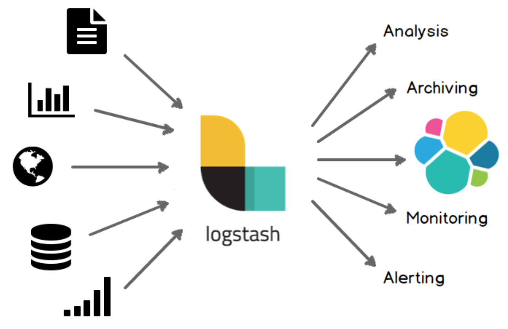

## Elasticsearch - Distributed SearchEngine Architect
-------------------------------------------------------------

CurrVersion:6.3

#### Concepts

Elasticsearch is a distributed RESTful search engine built for the cloud. Features include:

- Distributed and Highly Available Search Engine.

	Each index is fully sharded with a configurable number of shards.
	Each shard can have one or more replicas.
	Read / Search operations performed on any of the replica shards.
- Multi Tenant.

	Support for more than one index.
	Index level configuration (number of shards, index storage, …).
- Various set of APIs

	HTTP RESTful API
	Native Java API.
	All APIs perform automatic node operation rerouting.
- Document oriented

	No need for upfront schema definition.
	Schema can be defined for customization of the indexing process.
- Reliable, Asynchronous Write Behind for long term persistency.
- (Near) Real Time Search.
- Built on top of Lucene

	Each shard is a fully functional Lucene index
	All the power of Lucene easily exposed through simple configuration / plugins.
- Per operation consistency

	Single document level operations are atomic, consistent, isolated and durable.
- Shards & Replicas

	Sharding is important for two primary reasons:
	- It allows you to horizontally split/scale your content volume
	- It allows you to distribute and parallelize operations across shards (potentially on multiple nodes) thus increasing performance/throughput

	Replication is important for two primary reasons:
	- It provides high availability in case a shard/node fails. For this reason, it is important to note that a replica shard is never allocated on the same node as the original/primary shard that it was copied from.
	- It allows you to scale out your search volume/throughput since searches can be executed on all replicas in parallel.

#### 数据同步

1.Logstash数据采集

Logstash JDBC input 

2.[PostgreSQL to ElasticSearch](https://gocardless.com/blog/syncing-postgres-to-elasticsearch-lessons-learned/)

#### Elasticsearch-Hadoop

Elasticsearch对接Hadoop

- [Elasticsearch-Hadoop](https://www.elastic.co/cn/products/hadoop)

#### ElasticSearch v6 API

- [Elasticsearch SearchAPI](https://www.elastic.co/guide/en/elasticsearch/reference/current/search.html)

