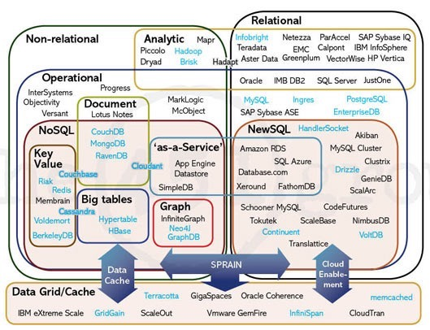
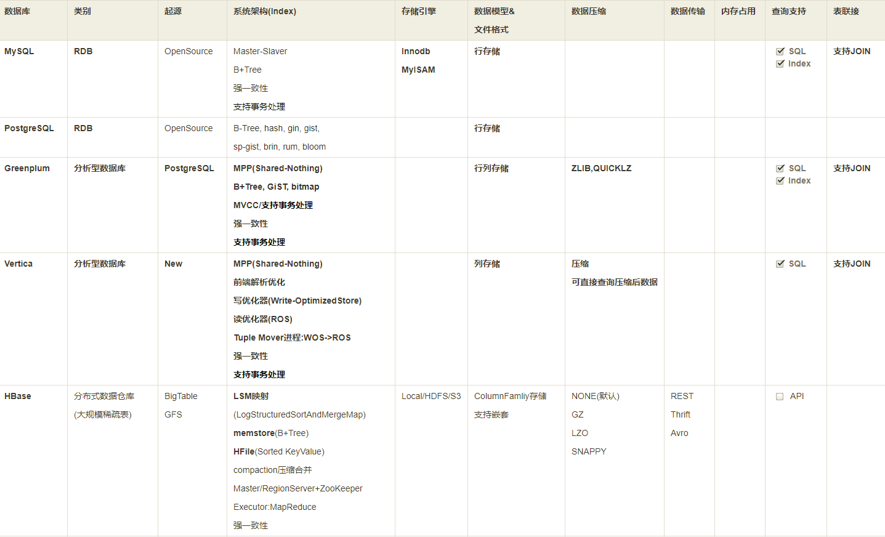
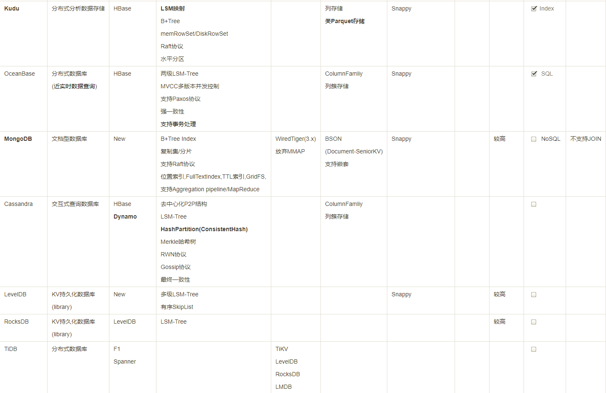
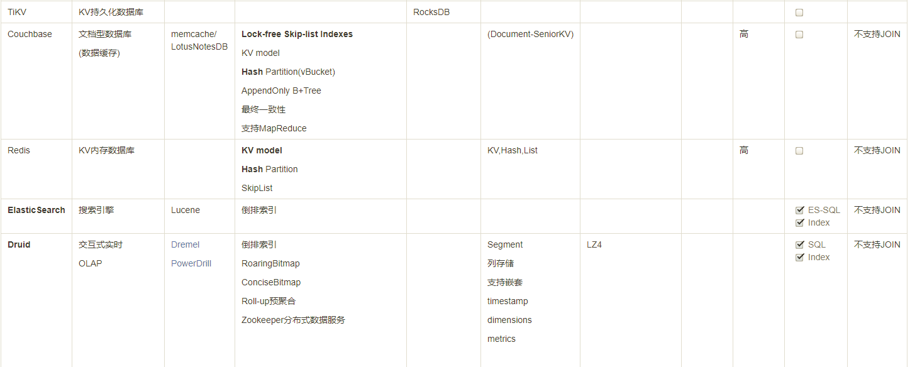

## Bigdata Database Architect Research Note
----------------------------------------------



### I.分布式数据存储架构





#### 分布式算法

* 一致性

数据一致性通常指关联数据之间的逻辑关系是否正确和完整。而数据存储的一致性模型则可以认为是存储系统和数据使用者之间的一种约定。如果使用者遵循这种约定，则可以得到系统所承诺的访问结果常用的

一致性模型有：

	a、严格一致性（linearizability, strict/atomic Consistency）：读出的数据始终为最近写入的数据。这种一致性只有全局时钟存在时才有可能，在分布式网络环境不可能实现。
	b、顺序一致性（sequential consistency）：所有使用者以同样的顺序看到对同一数据的操作，但是该顺序不一定是实时的。
	c、因果一致性（causal consistency）：只有存在因果关系的写操作才要求所有使用者以相同的次序看到，对于无因果关系的写入则并行进行，无次序保证。因果一致性可以看做对顺序一致性性能的一种优化，但在实现时必须建立与维护因果依赖图，是相当困难的。
	d、管道一致性（PRAM/FIFO consistency）：在因果一致性模型上的进一步弱化，要求由某一个使用者完成的写操作可以被其他所有的使用者按照顺序的感知到，而从不同使用者中来的写操作则无需保证顺序，就像一个一个的管道一样。 相对来说比较容易实现。
	e、弱一致性（weak consistency）：只要求对共享数据结构的访问保证顺序一致性。对于同步变量的操作具有顺序一致性，是全局可见的，且只有当没有写操作等待处理时才可进行，以保证对于临界区域的访问顺序进行。在同步时点，所有使用者可以看到相同的数据。
	f、 释放一致性（release consistency）：弱一致性无法区分使用者是要进入临界区还是要出临界区， 释放一致性使用两个不同的操作语句进行了区分。需要写入时使用者acquire该对象，写完后release，acquire-release之间形成了一个临界区，提供 释放一致性也就意味着当release操作发生后，所有使用者应该可以看到该操作。
	g、最终一致性（eventual consistency）：当没有新更新的情况下，更新最终会通过网络传播到所有副本点，所有副本点最终会一致，也就是说使用者在最终某个时间点前的中间过程中无法保证看到的是新写入的数据。可以采用最终一致性模型有一个关键要求：读出陈旧数据是可以接受的。
	h、delta consistency：系统会在delta时间内达到一致。这段时间内会存在一个不一致的窗口，该窗口可能是因为log shipping的过程导致。这是书上的原话。。我也搞不很清楚。。 数据库完整性（Database Integrity）是指数据库中数据的正确性和相容性。数据库完整性由各种各样的完整性约束来保证，因此可以说数据库完整性设计就是数据库完整性约束的设计。包括实体完整性。域完整性。参照完整性。用户定义完整性。可以主键。check约束。外键来一一实现。这个使用较多

- 一致性协议-2PC(Two-Phrase Commit)
- Vector Clock向量时钟:

	可用性>一致性 
	与每个对象的每个版本相关联。通过审查其向量时钟,我们可以判断一个对象的两个版本是平行分枝或有因果顺序

- 一致性协议-RWN协议:Write+Read>N
- 一致性协议-Paxos协议:一致性>可用性

	[介绍](http://www.jdon.com/artichect/paxos.html)
	Paxos是一个解决共识问题consensus problem的算法
	Paxos完成一次写操作需要两次来回，分别是prepare/promise, 和propose/accept
	基于Paxos的数据一致性同步Zookeeper

	Paxos算法是莱斯利·兰伯特（Leslie Lamport，就是 LaTeX 中的”La”，此人现在在微软研究院）于1990年提出的一种基于消息传递的一致性算法。这个算法被认为是类似算法中最有效的。
	Paxos 算法解决的问题是一个分布式系统如何就某个值（决议）达成一致。一个典型的场景是，在一个分布式数据库系统中，如果各节点的初始状态一致，每个节点执行相同的操作序列，那么他们最后能得到一个一致的状态。为保证每个节点执行相同的命令序列，需要在每一条指令上执行一个“一致性算法”以保证每个节点看到的指令一致。一个通用的一致性算法可以应用在许多场景中，是分布式计算中的重要问题。因此从20世纪80年代起对于一致性算法的研究就没有停止过。节点通信存在两种模型：共享内存（Shared memory）和消息传递（Messages passing）。Paxos 算法就是一种基于消息传递模型的一致性算法。

- 一致性协议-Raft协议:一致性>可用性.

	Raft是由Stanford提出的一种更易理解的一致性算法，意在取代目前广为使用的Paxos算法。目前，在各种主流语言中都有了一些开源实现，比如本文中将使用的基于JGroups的Raft协议实现。

	用于日志复制/表数据的复制.[介绍](http://www.jdon.com/artichect/raft.html)

	在Raft中，每个结点会处于下面三种状态中的一种：
	follower：所有结点都以follower的状态开始。如果没收到leader消息则会变成candidate状态
	candidate：会向其他结点“拉选票”，如果得到大部分的票则成为leader。这个过程就叫做Leader选举(Leader Election)
	leader：所有对系统的修改都会先经过leader。每个修改都会写一条日志(log entry)。leader收到修改请求后的过程如下，这个过程叫做日志复制(Log Replication)：
	复制日志到所有follower结点(replicate entry)
	大部分结点响应时才提交日志
	通知所有follower结点日志已提交
	所有follower也提交日志
	现在整个系统处于一致的状态

- CAP定理&BASE模型

	Consistency/Availability/Partition tolerance

	BASE模型反ACID模型，完全不同ACID模型，牺牲高一致性，获得可用性或可靠性：
	Basically Available基本可用。支持分区失败(e.g. sharding碎片划分数据库)
	Soft state软状态 状态可以有一段时间不同步，异步。
	Eventually consistent最终一致，最终数据是一致的就可以了，而不是时时高一致。
  
- MVCC多版本并行控制
- bitmap

	- bitmap可以理解为通过一个bit数组来存储特定数据的一种数据结构，每一个bit位都能独立包含信息，bit是数据的最小存储单位
	- bitmap就是用每一位来存放某种状态，适用于大规模数据，但数据状态又不是很多的情况。通常是用来判断某个数据存不存在的
	- 统计一个对象的基数值(1亿)需要12M，如果统计10000个对象，就需要将近120G了，同样不能广泛用于大数据场景。

- BloomFilter:带随机概率的bitmap,用于判断有序结构里是否存在指定的数据

- HyperLogLog:DISTINCT近似值算法

	- 分桶平均
	- 偏差修正
	- [redis new data structure](http://antirez.com/news/75)

- GeoHash算法

	- 根据经纬度计算GeoHash二进制编码

- SkipList:跳跃表
- LSM树 & LSM映射

	- Log-Structured Merge Tree
	- LSM树原理把一棵大树拆分成N棵小树，它首先写入内存中，随着小树越来越大，内存中的小树会flush到磁盘中，磁盘中的树定期可以做merge操作，合并成一棵大树，以优化读性能。

- Merkle哈希树

	- 默克尔树（又叫哈希树）是一种Hash二叉树，由一个根节点、一组中间节点和一组叶节点组成。最下面的叶节点包含存储数据或其哈希值，每个中间节点是它的两个孩子节点内容的哈希值，根节点也是由它的两个子节点内容的哈希值组成。
	- 据称哈希树经常应用在一些分布式系统或者分布式存储中的反熵机制(Anti-entropy),也有称做去熵的.这些应用包括Amazon的Dynamo 还有Apache的Cassandra数据库, 通过去熵可以去做到各个不同节点的同步, 即保持各个节点的信息都是同步最新.
	- 区块链的核心存储就是基于Merkle哈希树

- 一致性哈希(ConsistentHashing)
- 虚拟桶哈希(VirtualBucketsHashing)

	采用固定物理节点数量，来避免取模的不灵活性。<br/>
	采用可配置映射节点，来避免一致性hash的部分影响。<br/>
	支持动态扩容后对数据查询存储无影响。<br/>

- Cuckoo哈希:使用2个hash函数来处理碰撞,从而每个key都对应到2个位置

- Gossip协议

	Gossip算法如其名，灵感来自办公室八卦，只要一个人八卦一下，在有限的时间内所有的人都会知道该八卦的信息，这种方式也与病毒传播类似，因此Gossip有众多的别名“闲话算法”、“疫情传播算法”、“病毒感染算法”、“谣言传播算法”。
	但Gossip并不是一个新东西，之前的泛洪查找、路由算法都归属于这个范畴，不同的是Gossip给这类算法提供了明确的语义、具体实施方法及收敛性证明。
	Gossip算法又被称为反熵（Anti-Entropy），熵是物理学上的一个概念，代表杂乱无章，而反熵就是在杂乱无章中寻求一致，这充分说明了Gossip的特点：在一个有界网络中，每个节点都随机地与其他节点通信，经过一番杂乱无章的通信，最终所有节点的状态都会达成一致。每个节点可能知道所有其他节点，也可能仅知道几个邻居节点，只要这些节可以通过网络连通，最终他们的状态都是一致的，当然这也是疫情传播的特点。
	要注意到的一点是，即使有的节点因宕机而重启，有新节点加入，但经过一段时间后，这些节点的状态也会与其他节点达成一致，也就是说，Gossip天然具有分布式容错的优点。

- 消息机制

	消息的编解码方式
	消息传递机制(ZeroMQ/RabbitMQ/RocketMQ)

- 数据文件格式

	RCFile
	OptimizeRC=ORC
	[Parquet文件格式](https://parquet.apache.org/documentation/latest/)

- 数据压缩算法

	Snappy <br/>
	LZSS <br/>
	GZ <br/>

- 数据传输与序列化

	[Avro序列化组件](https://avro.apache.org/docs/current/) <br/>
	[Thrift](http://thrift.apache.org/) <br/>
	[ProtocalBuffer](http://code.google.com/p/protobuf) <br/>


### II.分布式存储架构分析

#### 分析数据库设计

1.分析型数据库

	- 分布式架构设计-MPP
	- 一致性协调器(Paxos/Raft) - 类Zookeeper
	- LSM-Tree&LSM映射存储
	- 索引设计 - B+Tree/Bitmap/FullText Index
	- 查询管理器
	- meta管理与存储
	- SQL查询解析器(是否需要支持JOIN)/查询重写
	- 查询优化器(JOIN优化/数据重分布/broadcast)
	- 数据结构存储 - Column存储/倒排PostingList
	- 数据压缩算法 - Snappy等
	- 统计优化
	- 支持事务管理(原子锁/跨行事务/跨表)
	- 物化视图设计(view/project)
	- In-Database FullText Engine
	- Data mining support(UDF)

2.[Greenplum架构解析](2017-02-11-greenplum-arch-design-note.md)

3.[PostgreSQL&Greenplum解决方案](2018-05-30-postgresql-greenplum-solution-note.md)

4.[实时OLAP分析](2017-02-01-bigdata-olap-anlysis-note.md)


### III.BigTable数据库架构

1.[BigTable&HBase分析笔记](2017-03-12-bigtable&hbase-analysis-note.md)

2.OceanBase数据库与分析数据库差异


### IV.数据库架构基础

#### 通用数据库架构分析

-[How does a relational database work](http://coding-geek.com/how-databases-work/)

1._合并排序算法_

```java
array mergeSort(array a)

   if(length(a)==1)

      return a[0];

   end if

   //recursive calls

   [left_array right_array] := split_into_2_equally_sized_arrays(a);

   array new_left_array := mergeSort(left_array);

   array new_right_array := mergeSort(right_array);


   //merging the 2 small ordered arrays into a big one

   array result := merge(new_left_array,new_right_array);

   return result;
```

整体成本是 N x log(N) 次运算

2._Array与二维表_

	用阵列的话，你需要一个连续内存空间。如果你加载一个大表，很难分配足够的连续内存空间。

3._二叉树结构与索引_

- binary search tree查询的成本是log(N)
- B+Tree可支持range scan(范围查询)。查询成本为M+log(N)。 在B+树中,插入和删除操作是 O(log(N))复杂度。	

4._哈希表与HashJoin_

Hash取模运算。好的Hash函数时间复杂度是 O(1)

	* 一个哈希表可以只装载一半到内存，剩下的哈希桶可以留在硬盘上。

5._客户端管理器 Client Manager_

* 管理器首先检查你的验证信息（用户名和密码），然后检查你是否有访问数据库的授权。这些权限由DBA分配。
* 然后，管理器检查是否有空闲进程（或线程）来处理你对查询。
* 管理器还会检查数据库是否负载很重。
* 管理器可能会等待一会儿来获取需要的资源。如果等待时间达到超时时间，它会关闭连接并给出一个可读的错误信息。
* 然后管理器会把你的查询送给查询管理器来处理。
* 因为查询处理进程不是『不全则无』的，一旦它从查询管理器得到数据，它会把部分结果保存到一个缓冲区并且开始给你发送。
* 如果遇到问题，管理器关闭连接，向你发送可读的解释信息，然后释放资源。	

6._查询管理器 Query Manager_

* 查询首先被解析并判断是否合法
* 然后被重写，去除了无用的操作并且加入预优化部分
* 接着被优化以便提升性能，并被转换为可执行代码和数据访问计划。
* 然后计划被编译
* 最后查询被执行

7._查询解析器 Query Parser_

解析器要分析查询中的表和字段

- 表是否存在
- 表的字段是否存在
- 对某类型字段的 运算 是否 可能(比如，你不能将整数和字符串进行比较，你不能对一个整数使用substring()函数)

在解析过程中，SQL 查询被转换为内部表示（通常是一个树）

8._查询重写器 Query Rewriter_

* 预优化查询
* 避免不必要的运算
* 帮助优化器找到合理的最佳解决方案

查询重写部分规则:

	- 视图合并：如果你在查询中使用视图，视图就会转换为它的 SQL 代码。
	- 子查询扁平化：子查询是很难优化的，因此重写器会尝试移除子查询
	- 去除不必要的运算符：比如，如果你用了 DISTINCT，而其实你有 UNIQUE 约束（这本身就防止了数据出现重复），那么 DISTINCT 关键字就被去掉了。
	- 排除冗余的联接：如果相同的 JOIN 条件出现两次，比如隐藏在视图中的 JOIN 条件，或者由于传递性产生的无用 JOIN，都会被消除。
	- 常数计算赋值：如果你的查询需要计算，那么在重写过程中计算会执行一次。比如 WHERE AGE > 10+2 会转换为 WHERE AGE > 12 ， TODATE(“日期字符串”) 会转换为 datetime 格式的日期值。
	- (高级)分区裁剪(Partition Pruning):如果你用了分区表，重写器能够找到需要使用的分区。
	- (高级)物化视图重写(Materialized view rewrite):如果你有个物化视图匹配查询谓词的一个子集，重写器将检查视图是否最新并修改查询，令查询使用物化视图而不是原始表。
	- (高级)自定义规则：如果你有自定义规则来修改查询（就像 Oracle policy），重写器就会执行这些规则。
	- (高级)OLAP转换：分析/加窗 函数，星形联接，ROLLUP 函数……都会发生转换(但我不确定这是由重写器还是优化器来完成，因为两个进程联系很紧，必须看是什么数据库)

9._统计优化_

数据库统计用于预计数据库具体情况,可优化查询性能。

	* 表中行和页的数量
	* 表中每个列中的：
		唯一值
		数据长度（最小，最大，平均）
		数据范围（最小，最大，平均）
	* 表的索引信息

这些统计信息会帮助优化器估计查询所需的磁盘I/O、CPU、和内存使用。对每个列的统计非常重要,可判读列数据是否是唯一,还是重复数据	

高级统计叫直方图

	* 出现最频繁的值
	* 分位数 

统计信息必须及时更新,PostgerSQL统计

10._查询优化器 Query Optimizer - DB核心模块_

所有的现代数据库都在用*基于成本的优化*(即Cost-Based Optimization)来优化查询。<br/>
它是看语句的代价(Cost),这里的代价主要指Cpu和内存。优化器在判断是否用这种方式时,主要参照的是表及索引的统计信息。<br/>
**数据库优化器计算的是它们的 CPU 成本、磁盘 I/O 成本、和内存需求**。时间复杂度和 CPU 成本的区别是，时间成本是个近似值。而 CPU 成本，我这里包括了所有的运算，比如:加法、条件判断、乘法、迭代。<br/>
**多数时候瓶颈在于磁盘I/O(数据文件读写)而不是CPU使用**。

_常规操作_:

	TableScan,Join,Sorting,Aggregate

_优化模式_:

	- Rule：基于规则的方式。
	- Choose：默认的情况下Oracle用的便是这种方式。指的是当一个表或索引有统计信息，则走CBO的方式，如果表或索引没统计信息，表又不是特别的小，而且相应的列有索引时，那么就走索引，走RBO的方式。
	- FirstRows：它与Choose方式是类似的，所不同的是当一个表有统计信息时，它将是以最快的方式返回查询的最先的几行，从总体上减少了响应时间。
	- All Rows:也就是我们所说的Cost的方式，当一个表有统计信息时，它将以最快的方式返回表的所有的行，从总体上提高查询的吞吐量。没有统计信息则走RBO的方式。

* A.TableScan:执行计划与扫描

	- 存取路径-获取数据的方式
	- 全扫描Full Scan(Sequential Scan) / Index Scan
	- 范围扫描 Range Scan /  索引范围扫描
	- 唯一扫描 Unique Scan
	- 根据ROW ID存取
	- 其他路径

由于所有存取路径的真正问题是磁盘I/O问题

* B.内关系与外关系(inner relation and outer relation)

	- 外关系是左侧数据集
	- 内关系是右侧数据集
	- 针对外关系的每一行
	- 查看内关系里的所有行来寻找匹配的行
	- 内关系必须是最小的，因为它有更大机会装入内存

* C.JOIN相关

1.联接运算符

**Nested Loop Join -算法需要 N + N x M 次访问(每次访问读取一行) – 大表JOIN小表**

	* With Inner Sequential Scan(FullScan)
	* With Inner Index Scan

**Hash Join -复杂度就是 O(M+N) – 类似大小的表join**

	哈希联接的道理是：
	1) 读取内关系的所有元素
	2) 在内存里建一个哈希表
	3) 逐条读取外关系的所有元素
	4) (用哈希表的哈希函数)计算每个元素的哈希值，来查找内关系里相关的哈希桶内
	5) 是否与外关系的元素匹配
	6) 生成哈希表需要时间

**Merge Join -唯一产生排序的联接算法**

    1)O(N x Log(N) + M x Log(M))-需排序
    1)O(N+M)-已排序,我们是只挑选相同的元素。
	2) 在两个关系中，比较当前元素（当前=头一次出现的第一个）
	3) 如果相同，就把两个元素都放入结果，再比较两个关系里的下一个元素
	4) 如果不同，就去带有最小元素的关系里找下一个元素（因为下一个元素可能会匹配）
	5) 重复 1、2、3步骤直到其中一个关系的最后一个元素。


2.联接运算算法选择:

	- 空闲内存：没有足够的内存的话就跟强大的哈希联接拜拜吧(至少是完全内存中哈希联接)。
	-  两个数据集的大小。比如，如果一个大表联接一个很小的表，那么嵌套循环联接就比哈希联接快，因为后者有创建哈希的高昂成本；如果两个表都非常大，那么嵌套循环联接CPU成本就很高昂。
	-  是否有索引：有两个B+树索引的话，聪明的选择似乎是合并联接。
	-  结果是否需要排序：即使你用到的是未排序的数据集，你也可能想用成本较高的合并联接（带排序的），因为最终得到排序的结果后，你可以把它和另一个合并联接串起来（或者也许因为查询用 ORDER BY/GROUP BY/DISTINCT 等操作符隐式或显式地要求一个排序结果）。
	-  关系是否已经排序：这时候合并联接是最好的候选项。
	-  联接的类型：是等值联接（比如 tableA.col1 = tableB.col2 ）？ 还是内联接？外联接？笛卡尔乘积？或者自联接？有些联接在特定环境下是无法工作的。
	-  数据的分布：如果联接条件的数据是倾斜的（比如根据姓氏来联接人，但是很多人同姓），用哈希联接将是个灾难，原因是哈希函数将产生分布极不均匀的哈希桶。
	-  如果你希望联接操作使用多线程或多进程。

3.动态编程,启发式算法及贪婪算法

	- 完全动态编程 - O(3^N)
		它们都有相同的子树(A JOIN B),所以,不必在每个计划中计算这个子树的成本,计算一次,保存结果,当再遇到这个子树时重用。
	- 启发式算法 - 附加额外规则
	- 贪婪算法 -  算法的复杂度是 O(Nxlog(N))
		原理是按照一个规则(或启发)以渐进的方式制定查询计划。在这个规则下，贪婪算法逐步寻找最佳算法，先处理一条JOIN，接着每一步按照同样规则加一条新的JOIN。
	- 基因算法
	- [数据库JOIN查询算法](http://www.acad.bg/rismim/itc/sub/archiv/Paper6_1_2009.PDF)

* D.聚合函数计算

_HashAggregate_

对于hash聚合来说，数据库会根据group by字段后面的值算出hash值，并根据前面使用的聚合函数在内存中维护对应的列表。如果select后面有两个聚合函数，那么在内存中就会维护两个对应的数据。同样的，有n个聚合函数就会维护n个同样的数组。对于hash算法来说，数组的长度肯定是大于group by的字段的distinct值的个数的，且跟这个值应该呈线性关系，group by后面的值越唯一，使用的内存也就越大。

因此HashAggregate在少数聚合函数是表现优异，但是很多聚合函数，性能跟消耗的内存差异很明显。尤其是受group by字段的唯一性很明显，字段count（district）值越大，hash聚合消耗的内存越多，性能下降剧烈。

_GroupAggregate_

原理是先将表中的数据按照group by的字段排序,对排好序的数据进行一次全扫描,就可以得到聚合的结果。

对于GroupAggregate来说，消耗的内存基本上是恒定的，无论group by哪个字段。当聚合函数较少的时候，速度也相对较慢，但是相对稳定。

* E.查询计划缓存

	每当试图执行查询时，查询管道都会查找它的查询计划缓存，以便了解该查询是否已经编译且可用。 如果答案是肯定的，它将重用缓存的计划而不是生成新的计划。 如果未在查询计划缓存中找到匹配的计划，则会编译和缓存该查询。 
	查询由其 Entity SQL 文本和参数集合（名称和类型）标识。 所有文本比较都区分大小写。


* X.查询优化器实现

	1._SQLite优化器_

		使用Nested嵌套联接
		[N最近邻居](https://www.sqlite.org/queryplanner-ng.html) 贪婪算法

	2._DB2优化器_

		使用所有可用的统计，包括线段树(frequent-value)和分位数统计(quantile statistics)。
		使用所有查询重写规则(含物化查询表路由，materialized query table routing),除了在极少情况下适用的计算密集型规则。
		使用动态编程模拟联接
			有限使用组合内关系（composite inner relation）
			对于涉及查找表的星型模式，有限使用笛卡尔乘积
		考虑宽泛的访问方式，含列表预取(list prefetch,注:我们将讨论什么是列表预取),index ANDing(注:一种对索引的特殊操作),和物化查询表路由。
		默认的，DB2 对联接排列使用受启发式限制的动态编程算法。

	默认的，DB2 对联接排列使用受启发式限制的动态编程算法。	

	3._Genetic Query Optimizer - PostgerSQL_

[geqo_postgreSQL](https://www.postgresql.org/docs/current/static/geqo-intro.html)

	The normal PostgreSQL query optimizer performs a near-exhaustive search over the space of alternative strategies. It can take an enormous amount of time and memory space when the number of joins in the query grows large. This makes the ordinary PostgreSQL query optimizer inappropriate for queries that join a large number of tables.

	genetic algorithm(GA) & GEQO 

	4._Pivotal Query Optimizer - Greenplum_


	[PQO_Doc](https://content.pivotal.io/blog/greenplum-database-adds-the-pivotal-query-optimizer)

	5._Legacy Query Optimizer - Greenplum_

	Append-only Columnar Scan


11._查询执行器 Query Executor_


12._数据管理器 Data Manager_

* 关系型数据库使用事务模型，所以，当其他人在同一时刻使用或修改数据时，你无法得到这部分数据。
* 数据提取是数据库中速度最慢的操作，所以数据管理器需要足够聪明地获得数据并保存在内存缓冲区内。

13._缓存管理器 Cache Manager_

* 数据库的主要瓶颈是磁盘 I/O。通过CacheManager提高性能,包括数据库IO写入性能/数据库查询性能<br/>
* 缓冲池是从内存读取数据显著地提升数据库性能。

* 预读

	- 当查询执行器处理它的第一批数据时
	- 会告诉缓存管理器预先装载第二批数据
	- 当开始处理第二批数据时
	- 告诉缓存管理器预先装载第三批数据，并且告诉缓存管理器第一批可以从缓存里清掉了

* 缓冲区置换策略-LRU算法

	- LRU-K页面置换算法
	- 2Q（类LRU-K算法）
	- CLOCK（类LRU-K算法）
	- MRU（最新使用的算法，用LRU同样的逻辑但不同的规则）
	- LRFU（Least Recently and Frequently Used，最近最少使用最近最不常用）

* 写缓冲区

	缓冲区保存的是页Page(最小的数据单位)而不是行 

14._事务管理器_

* ACID/ 并发控制/ 锁管理器/ 悲观锁/ 死锁
* 事务日志WAL/ 日志缓冲区/ STEAL 和 FORCE 策略/ 关于恢复

* WAL规则

	1)每个对数据库的修改都产生一条日志记录，在数据写入磁盘之前日志记录必须写入事务日志。
	2)日志记录必须按顺序写入；记录 A 发生在记录 B 之前，则 A 必须写在 B 之前。
	3)当一个事务提交时，在事务成功之前，提交顺序必须写入到事务日志。

* ARIES数据库恢复原型算法(Algorithms for Recovery and Isolation Exploiting Semantics) 

	1) 写日志的同时保持良好性能
	2) 快速和可靠的数据恢复

	日志结构

		- LSN：一个唯一的日志序列号（Log Sequence Number）。LSN是按时间顺序分配的 * ，这意味着如果操作 A 先于操作 B，log A 的 LSN 要比 log B 的 LSN 小。
		- TransID：产生操作的事务ID。
		- PageID：被修改的数据在磁盘上的位置。磁盘数据的最小单位是页，所以数据的位置就是它所处页的位置。
		- PrevLSN：同一个事务产生的上一条日志记录的链接。
		- UNDO：取消本次操作的方法。
			比如，如果操作是一次更新，UNDO将或者保存元素更新前的值/状态（物理UNDO），或者回到原来状态的反向操作(逻辑UNDO)。
		- REDO：重复本次操作的方法。 同样的，有 2 种方法：或者保存操作后的元素值/状态，或者保存操作本身以便重复。
		- …:(供您参考，一个 ARIES 日志还有 2 个字段：UndoNxtLSN 和 Type）

	ARIES从崩溃中恢复有三个阶段

		1) 分析阶段：恢复进程读取全部事务日志，来重建崩溃过程中所发生事情的时间线，决定哪个事务要回滚（所有未提交的事务都要回滚）、崩溃时哪些数据需要写盘。
		2) Redo阶段：这一关从分析中选中的一条日志记录开始，使用 REDO 来将数据库恢复到崩溃之前的状态。
		3) Undo阶段：这一阶段回滚所有崩溃时未完成的事务。回滚从每个事务的最后一条日志开始，并且按照时间倒序处理UNDO日志（使用日志记录的PrevLSN）。

	ARIES提出了一个概念:检查点check point,就是不时地把事务表和脏页表的内容,还有此时最后一条LSN写入磁盘 


### V.区块链

[区块链设计分析](2018-03-06-block-chain-design-note.md)

### x.Ref

- [BigTable](https://baike.baidu.com/item/BigTable/3707131?fr=aladdin)
- [Dremel](https://blog.csdn.net/happyduoduo1/article/details/51784730)

