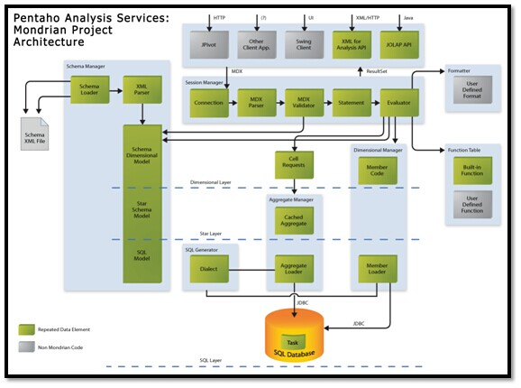
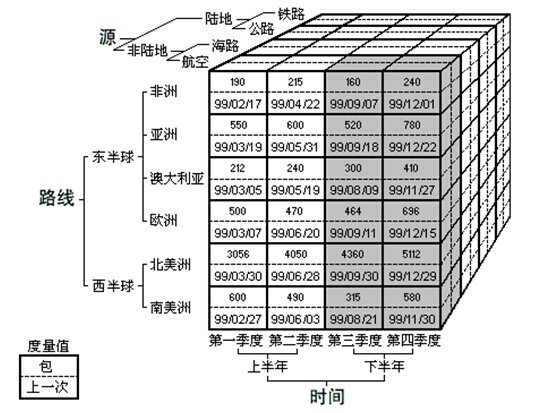
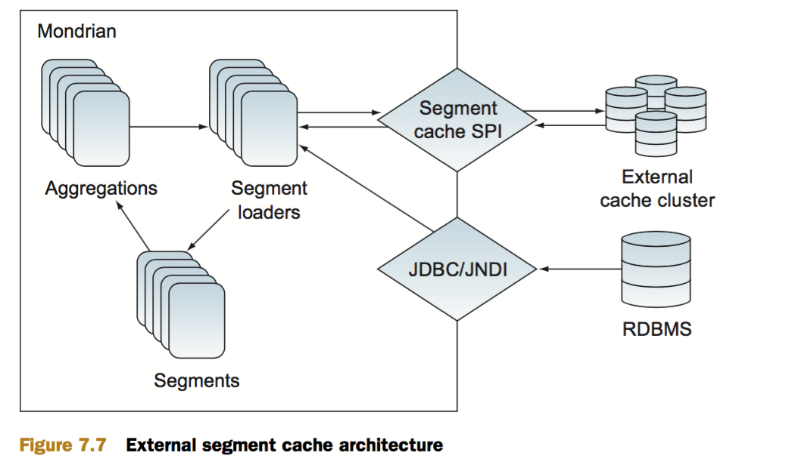
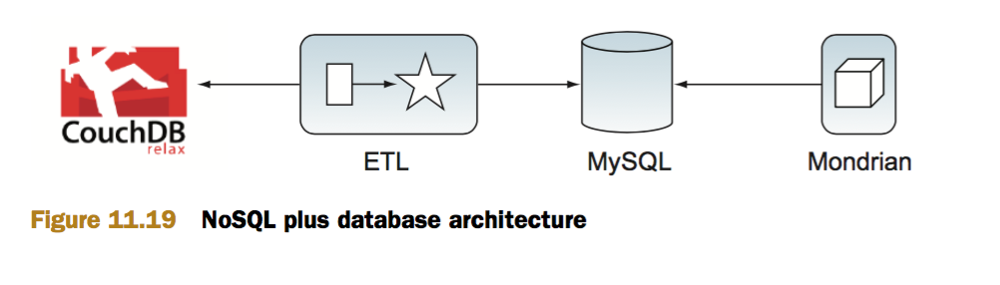

Mondrian OLAP Analysis Note
------------------------------------------------------------


### 1.OLAP技术特点

OLAP技术非常多的特性，概括起来主要有如下几点特性：OLAP技术是面向分析人员、管理人员的；OLAP技术对数据访问通常是只读的，并且一次访问大量数据；OLAP技术是面向主题的多维数据分析技术。

* OLAP技术是面向分析人员、管理人员的
* 区别于OLTP面向操作人员，OLAP技术主要面向分析人员、管理人员，他是提供分析人员、管理人员快速又直观的访问数据的一种途径。使分析人员、管理人员能直观的从海量数据中获得有用信息以提供决策依据。
* OLAP技术对数据访问通常是只读的，并且一次访问大量数据。
* OLAP技术主要是针对海量数据的查询，通常不对数据做修改。这种数据访问有别于OLTP中不断的对数据进行增删改操作。同时这种查询不是简单的记录属性的检索，而是为了从海量数据中获取有用信息的针对大量数据的查询，通常一次需要查询会涉及到上百万条以上数据。
* OLAP技术是面向主题的多维数据分析技术。
主题涉及业务流程的方方面面，是分析人员、管理人员进行决策分析所关心的角度。分析人员、管理人员使用OLAP技术，正是为了从多个角度观察数据，从不同的主题分析数据，最终直观的得到有效的信息。

#### 主要技术实现方式

OLAP系统按照其存储器的数据存储格式可以分为关系OLAP(RelationalOLAP，简称ROLAP)、多维OLAP(MultidimensionalOLAP，简称MOLAP)和混合型OLAP(HybridOLAP，简称HOLAP)三种类型。

- ROLAP：ROLAP将分析用的多维数据存储在关系数据库中并根据应用的需要有选择的定义一批实视图作为表也存储在关系数据库中。不必要将每一个SQL查询都作为实视图保存，只定义那些应用频率比较高、计算工作量比较大的查询作为实视图。对每个针对OLAP服务器的查询，优先利用已经计算好的实视图来生成查询结果以提高查询效率。同时用作ROLAP存储器的RDBMS也针对OLAP作相应的优化，比如并行存储、并行查询、并行数据管理、基于成本的查询优化、位图索引、SQL的OLAP扩展(cube,rollup)等等。而ROLAP主要通过一些软件工具或中间软件实现，物理层仍采用关系数据库的存储结构，因此称为虚拟OLAP（VirtualOLAP）。

- MOLAP：MOLAP将OLAP分析所用到的多维数据物理上存储为多维数组的形式，形成“立方体”的结构。维的属性值被映射成多维数组的下标值或下标的范围，而总结数据作为多维数组的值存储在数组的单元中。由于MOLAP采用了新的存储结构，从物理层实现起，因此又称为物理OLAP（PhysicalOLAP）；
- HOLAP：由于MOLAP和ROLAP有着各自的优点和缺点（如下表所示）,且它们的结构迥然不同，给分析人员设计OLAP结构提出了难题。为此一个新的OLAP结构——混合型OLAP（HOLAP）被提出，它能把MOLAP和ROLAP两种结构的优点结合起来。迄今为止，对HOLAP还没有一个正式的定义。但很明显，HOLAP结构不应该是MOLAP与ROLAP结构的简单组合，而是这两种结构技术优点的有机结合，能满足用户各种复杂的分析请求。

### 2.Mondrian产品分析

[Mondrian Document](http://mondrian.pentaho.com/documentation)

#### 产品简介

Mondrian 是一个开源项目，是开源项目Pentaho的一部分，是一个用Java写成的OLAP引擎。它实现了MDX语言、XML解析、JOLAP规范。它从SQL和其它数据源读取数据并把数据聚集在内存缓存中，然后经过Java API用多维的方式对结果进行展示，同时可以不写SQL就能分析存储于SQL 数据库的庞大数据集，可以封装JDBC数据源并把数据以多维的方式展现出来。

开源协议：EPL协议（商用友好的协议）

#### 产品功能模块综述

Mondrian项目逻辑模块分层结构图：




上图为整体的项目架构，图中所示Mondrian分成了四个大部分Schema manager、Session Manager、Dimension Manager、Aggregate Manager，而实际上各个部分有着更为紧密的联系。对于Dimensional Layer、Star Layer和SQL Layer的划分，更多是处于总体逻辑分层的考虑，具体在源码中，逻辑分层的概念比较模糊。

下面是四个Manager的简介：

* Session Manager：最为重要的一个部分。接受MDX查询、解析MDX，返回结果。
* Schema Manager：与初始化紧密相关。主要是一些重要的数据结构如缓存池的构建以及多维模型的生成。
* Aggregate Manager：实现了对聚集表的管理。主要是对OLAP缓存的管理，属于性能优化的部分。
* Dimension Manager：维度的管理。实现多维模型中维度和关系数据库表中列的映射，在Schema Manager也有部分功能处理这些映射。

#### 产品特性列表

* OLAP缓存：Mondrian主要特点是对立方体进行了缓存，众所周知，缓存庞大的立方体对性能有很大的影响，但是Mondrian利用java语言的特点对这一点进行了很好的控制。其次由于Mondrian基于java语言，所以它能运行在不同的平台之上，这也是其流行的主要原因之一，例如花旗银行就在其数据仓库项目中用Mondrian作为它的OLAP引擎。





如上图所示，这是由三个维度构成的一个OLAP立方体，立方体中包含了满足条件的cell(子立方块)值，这些cell里面包含了要分析的数据，称之为度量值。显而易见，一组三维坐标唯一确定了一个子立方。

多维模型的基本概念介绍：

* Cube立方体：由维度构建出来的多维空间，包含了所有要分析的基础数据，所有的聚合数据操作都在立方体上进行。
* Dimension维度：就是观察数据的一种角度。在这个例子中，路线，源，时间都是维度，这三个维度构成了一个立方体空间。维度可以理解为立方体的一个轴。要注意的是有一个特殊的维度，即度量值维度。
* Member维度成员：构成维度的基本单位。对于时间维，它的成员分别是：第一季度、第二季度、第三季度、第四季度。
* Hirarachy层次：维度的层次结构，要注意的是存在两种层次：自然层次和用户自定义层次。对于时间维而言，(年、月、日)是它的一个层次，(年、季度、月)是它的另一个层次，一个维可以有多个层次，层次可以理解为单位数据聚合的一种路径。
* Level级别：级别组成层次。对于时间维的一个层次(年、月、日)而言，年是一个级别，月是一个级别，日是一个级别，显然这些级别是有父子关系的。(总公司/分公司等)
* Measure度量值：要分析展示的数据，即指标。如图1中一个cell中包含了两个度量值：装箱数和截至时间，可以对其进行多维分析。
* FactTable事实表：存放度量值的表，同时存放了维表的外键。所有的分析用的数据最终都是来自与事实表。
* DimensionTable维表：一个维度对应一个或者多个维表。一个维度对应一个维表时数据的组织方式就是采用的星型模式，对应多个维表时就是采用雪花模式。雪花模式是对星型模式的规范化。简言之，维表是对维度的描述。
* MDX查询：多维模型的查询语言MDX(MDX是微软发布的多维查询语言标准),它的语法与SQL有很多相似之处：select {[Measures].[Salary]} on columns, {[Employee].[employeeId].members} on rows from CubeTest对于这条语句，COLUMNS 和 ROWS都代表查询轴，其中COLUMNS代表列轴，ROWS代表行轴。COLUMNS又可以写成0，ROWS又可以写成1，当只有两个查询轴时，可以理解为结果的展现格式是一个平坦二维表。这条语句的含义就是查询名字为CubeTest的立方体，列显示Measures维度的salary，行显示 Employee维度employeeId级别的所有成员，那么得出的结果就是employeeId所有成员的salary，也就是所有员工的薪酬。具体语法规范和帮助文档可以参考微软的用户文档。

#### 评价和分析

* 开源协议：EPL协议，是基于Eclipse的商用友好的协议，我们可以使用。协议详细定义请参见：http://www.eclipse.org/legal/epl-v10.html
* 数据加载操作方式：Mondrian 并不像其他OLAP Server一样会将聚合、汇总的数据存储在磁盘中，它是直接在用户配置好的关系数据库中的数据上进行数据分析计算处理, 一旦读取一块数据,就将其存储在缓存中，这使得Mondrian的安装、使用起来非常容易, 但这也影响了Mondrian处理海量数据时的性能。
* 性能和优化：虽然Mondrian自己不做汇总数据存储的功能，但面对海量数据时也提供了性能优化的支持方式，如可以支持用户为常用查询维度基于事实表扩展数据聚合表，在执行查询请求是Mondrian可以通过查询聚合表进行查询性能优化。下面是不同的数据量情况下Mondrian OLAP Server的性能表现和优化方案的介绍。

百万级事实数据:按照Mondrian文档中所描述的内容可以看出,只基于操作系统环境和数据库环境的优化,Mondrian Server在百万行级别数据量的事实表(关系数据库)仍能够运行良好。当然这需要我们自己来评测和证实。

千万级事实数据:当事实表数据立方体的数据量达到千万行以上时，Mondrian建议采用“汇总表AggregateTable”或者是由数据库支持的类似Oracle数据库的“物化视图”功能来优化OLAP查询的性能。
随着大数据时代的来临,大多数客户数据单表都超过千万。大客户的数据量超过亿级,非常普遍。因此如何有效定义汇总表非常重要和关键。

Mondrian缓存设置：由于Mondrian会将查询过的数据缓存起来，所以Mondrian建议缓存的大小根据具体项目的实际情况判断，当然是缓存越大越好。

#### Mondrian生成SQL分析

* MDX语句：2011年所有员工的薪资统计

```mdx
select {[Measures].[Salary]} on 0,{[Emp].[EmpID].Members} on 1 from Cube where {[Time].[2011]}
```

* 查询生成的SQL语句:

```sql
1. select `tb_time`.`the_year` as `c0` from `tb_time` as `tb_time` where `tb_time`.`the_year` = 2011 group by `tb_time`.`the_year` order by ISNULL(`tb_time`.`the_year`), `tb_time`.`the_year` ASC
```
```sql
2. select `tb_employee`.`employee_id` as `c0` from `tb_employee` as `tb_employee` group by `tb_employee`.`employee_id` order by ISNULL(`tb_employee`.`employee_id`), `tb_employee`.`employee_id` ASC
```
```sql
3. select count(distinct `tb_employee`.`employee_id`) as `c0` from `tb_employee` as `tb_employee`
```
```sql
4. select `tb_time`.`the_year` as `c0`, `tb_employee`.`employee_id` as `c1`, sum(`tb_salary`.`salary`) as `m0` from `tb_time` as `tb_time`, `tb_salary` as `tb_salary`, `tb_employee` as `tb_employee` where `tb_salary`.`time_id` = `tb_time`.`time_id` and `tb_time`.`the_year` = 2011 and `tb_salary`.`employee_id` = `tb_employee`.`employee_id` group by `tb_time`.`the_year`, `tb_employee`.`employee_id`
```

SQL分析: Mondrian收到MDX查询请求后，如果缓存中没有对应的内容，则会生产上面的SQL从数据库加载数据，然后再加入缓存中，这样的场景也是我们做实时监控是最常遇到的场景。如上面的简单例子，Mondrian所生成的SQL语句同我们期望的基本一致。就Mondrian生成的SQL语句本身不会有性能瓶颈，这样也使我们可以着力于其他方面的设计和优化。

保存SQL语句到缓存是必要操作。

#### Mondrian缓存控制

为了提高海量数据下的查询响应速度，Mondrian自动将首次查询的结果缓存到内存中，之后的查询如果命中缓存内容，则不再访问数据库。这种实现方式有点自不必说，但是在实现实时OLAP时会存在问题，实时OLAP中数据变化频繁导致缓存中的数据不是最新的。

缓存控制接口:为了做到不重启OLAP Server也能更新缓存,Mondrian提供了一系列的刷新缓存的接口,支持指定清除指定schema的元数据缓存、查询结果缓存;清除动作可以是全部清除 也可以是部分清除(可以指定清除某个维度下某级别成员的相关内容)。

数据变化监听:Mondrian提供了缓存控制接口(被动响应),但对于实现我们的目标“实时OLAP”来说我们就需要自己实现一个数据变更监听的模块，来监听数据变化，一旦数据有变化就发起变更事件，更新Mondrian引擎的缓存。

目前初步考虑实现方案为ETL工具在数据处理结束后通知OLAP引擎。引擎收到数据变更通知后做清理缓存的动作。


### 3.Mondrian架构分析

#### 3.1.架构层级

* a.presentation layer

	The presentation layer determines what the end-user sees on his or her monitor, and how he or she can interact to ask new questions.

* b.dimensional layer

	The dimensional layer parses, validates and executes MDX queries

* c.star layer

	The star layer is responsible for maintaining an aggregate cache. An aggregation is a set of measure values ('cells') in memory, qualified by a set of dimension column values.

* d.storage layer

	It is responsible for providing aggregated cell data, and members from dimension tables. 

#### 3.2.数据存储与策略-Storage and aggregation strategies 

- Three kinds of data need to be stored:**fact table data (the transactional records), aggregates, and dimensions**.
- Pre-computed aggregates are necessary for large data sets, otherwise certain queries could not be answered without reading the entire contents of the fact table. 
- In some ROLAP systems these are explicitly managed by the OLAP server; in other systems, the tables are declared as materialized views, and they are implicitly used when the OLAP server issues a query with the right combination of columns in the group by clause.
- The final component of the aggregation strategy is the cache. The cache holds pre-computed aggregations in memory so subsequent queries can access cell values without going to disk. 

	The cache is arguably the most important part of the aggregation strategy because it is adaptive. It is difficult to choose a set of aggregations to pre-compute which speed up the system without using huge amounts of disk, particularly those with a high dimensionality or if the users are submitting unpredictable queries.

Mondrian's aggregation strategy is as follows:

	- Fact data is stored in the RDBMS. Why develop a storage manager when the RDBMS already has one?
	- Read aggregate data into the cache by submitting group by queries. Again, why develop an aggregator when the RDBMS has one?
	- If the RDBMS supports materialized views, and the database administrator chooses to create materialized views for particular aggregations, then Mondrian will use them implicitly. Ideally, Mondrian's aggregation manager should be aware that these materialized views exist and that those particular aggregations are cheap to compute. It should even offer tuning suggesting to the database administrator.

#### 3.3.详细设计

* 3.3.1.Cube Schema定义

* 3.3.2.Time Dimension Query(借助TimeDimensionTable进行聚合查询)

* 3.3.3.Mondrian Schema Extend

	Multiple cubes in a schema
	Shared dimensions
	Conformed dimensions
	Star dimensions & Snowflake dimensions
	Calculated members(Expression)

* 3.3.4.QueryAPI-MDX

- Mondrian uses a language called MDX ('Multi-Dimensional eXpressions') to specify queries, where JDBC would use SQL.
- The API also presents the database schema as a set of objects: Schema, Cube, Dimension, Hierarchy, Level, Member. 

* 3.3.5.Maximun Performance 

There are three main strategies for increasing performance: **tuning the database, aggregate tables, and caching**.  

_Aggregate tables(聚合结果表)_

> Dropping a dimension means it’s left out of the aggregate table completely.(仅保留需使用的维度度量在聚合表中)
> The physical aggregate tables are created in the database and populated as part of the ETL process.  

	- Choosing aggregate tables 
	- Aggregate Generator 
	- Optimizing Calculations with the Expression Cache 

_Caching_

	- Schema Cache
	- Member Cache - Dimension Member
	- Segment Cache

The segment cache holds data from the fact table, usually the largest table by an order of magnitude or so, and it has aggregated data. <br/>
Segment cache need to store all of the related dimension and measure meta data.<br/>
The external segment cache stores data in a data grid.In some cases, it also provides in-memory failover of the cache.For example,Couchbase.



How to reuse segment cache?

#### 3.4.高级分析-Advanced Analysis

* 3.4.1.About MDX

MDX stands for Multidimensional Expressions; it was made popular by Microsoft as part of their SQL Server Analysis Services.
In order to run the MDX fragments in this section, you’ll need to use Saiku. 

* 3.4.2.Ratio and growth - 衍生度量计算

This calculation is aggregation-safe so it’ll work the same if it’s at the [Product Family] level, or one level below at the [Product Department] level. <br/>
For instance, here is the exact same calculation working at the [Product Department] level; 

* 3.4.3.Time-specific MDX

Prior Period is useful when you’re trying to calculate the classic month-over-month growth.  <br/>
MDX YTD() shortcut function returns all periods from the beginning of the year right up to the current period and aggregates the totals to give the total year-to-date value.  

* 3.4.4.Advanced MDX

Ranking (via the MDX Rank() function) allows you to order and rank results and determine sets of performers. 
Rank与排序密切相关

* 3.4.5.What-if analysis(Scenarios query)

In fact, Mondrian’s term for such what-if analysis is scenarios. <br/>
Scenarios query allow users to make nonpermanent changes to values in the cube for the purpose of seeing how those changes affect totals, other ratios, and other metrics.  <br/>
Saiku Sales Scenario cube. 


SCENARIO SUPPORT IN SAIKU AND OLAP4J  <br/>
Currently Saiku is the only visual client to Mondrian that supports Scenarios. Only OLAP4J has support for using scenarios. 

* 3.4.6.Statistics and machine learning

This common approach makes sense: most of a company’s investment in building an analytic solution involves data integration, restructuring, and loading (ETL and modeling) into the database.  <br/>
Data mining purists may disagree that the star schema, cleaned and loaded from original source, represents the best data to perform machine learning and data mining on.DM practitioners often do some level of data preparation themselves for their modeling and do some similar things. Though not perfect, DM on star schemas (and their various aggregations/samples) is common, especially when the DM tool is to be used alongside Mondrian. 

F1.R

F2.Weka

Weka is a machine learning framework and tool.Weka can use the star schema that any DM tool can access (like R), but it also has the advantage of being integrated into PDI as a series of useful plugins for doing common tasks.Weka excels and is best known for its capabilities on machine learning algorithms.  <br/>
By using the PDI plugins to do some time-series forecasting and market-basket analysis, you’ll learn the basics of DM without extensive training. <br/>
With PDI’s ability to query Mondrian (http:// wiki.pentaho.com/display/EAI/Mondrian+Input) and stream results to further steps, this is the closest direct integration between Mondrian and a DM tool. 

* 3.4.7.BigData & SQL

Apache Calcite(SQL Parser) by julianhyde. <br/>
Calcite is a highly customizable engine for parsing and planning queries on data in a wide variety of formats. It allows database-like access, and in particular a SQL interface and advanced query optimization, for data not residing in a traditional database.

* 3.4.8.Hadoop and Hive and NoSQL

Couchbase is a popular document-based storage service for mobile developers. There’s an important technique that integrates NoSQL technology into Mondrian, but not as the primary storage and aggregation engine. NoSQL systems have been used by the pluggable cache API to allow Mondrian to share its cache among individual servers in a multi-server environment. 

以下方案与我方案不谋而合,HAHA



SQL ACCESS TO NOSQL SYSTEMS is the less common used approach because of the complexity.


### 4.Mondrian源码分析

#### 依赖的JAR包

	commons-dbcp-1.2.1.jar
	commons-logging-1.0.4.jar
	commons-pool-1.2.jar
	dom4j.jar
	log4j-1.2.8.jar
	mondrian.jar
	olap4j.jar
	commons-math-1.0.jar
	commons-collections-3.1.jar
	commons-beanutils-1.6.jar
	commons-vfs-1.0.jar
	eigenbase-xom.jar
	eigenbase-properties.jar
	eigenbase-resgen.jar
	javacup.jar

* 扩展功能引入JAR:

	mysql-connector-java-3.1.12-bin.jar
	xstream-1.2.2.jar

#### package解释

	mondrian.calc 提供编译好的表达式
	mondrian.i18n 国际化和本地化工具
	mondrian.mdx 为mdx表达式定义解析树
	mondrian.olap 核心包，定义了连接和schema的元模型，用来执行查询
	mondrian.olap4j 中间层，olap服务器的驱动，用来代替jolly的
	mondrian.parser 解析器
	mondrian.recorder 任务处理记录接口
	mondrian.rolap olap包的数据访问层的实现
	mondrian.server 服务端注册/监控数据变更/事件服务
	mondrian.spi用户自定义扩展的服务端支持接口
	mondrian.tui Mondrian文本用户接口
	mondrian.udf 用户定义方法
	mondrian.util Mondrian工具包
	mondrian.web Mondrian的servlet和tag库
	mondrian.xmla xmlforanalysisAPI的实现

#### Schema manager Module

Mondrian.rolap.RolapSchema类是mondrianschema的核心类，该类在在建立RolapConnection时被建立，但是有个schemaPool维护着schema的缓存，参见
RolapSchema.Pool内部类。

#### mondrian.calc package

Calc是所有可计算表达式的基接口。在mondrian中关于表达式有如下两个概念：

- The logical language of parsed MDX fragments(Exp).
- The phyiscal language of compiled expressions(Calc).

> 两种语言的优势在于可以允许我们将逻辑语言(即mdx语言)和物理语言(how it is to be evaluated)分开.物理语言可以是SQL,也可以是类SQL(例如NoSQ语句)

Calc接口针对各种类型有许多子接口：其中IntegerCalc,BooleanCalc,DoubleCalc,StringCalc是数值型的,MemberCalc,LevelCalc,HierarchyCalc,DimensionCalc则用于olap模型中的元素。<br/>
表达式(Expression)通常由表达式编译者(ExpCompiler)创建。对于一个给定的表达式通常有若干个evaluation策略，表达式编译者在编译过程中可以给我们一个选择的机会。

#### mondrian.olap package - 接口

Mondrian的核心包，定义了连接对象和完整的olap模型结构元对象，并且允许执行mdx查询语句。

* mdx函数包

* funCall

* Query Class

#### mondrian.rolap package - 计算层

实现最终的实际的olap数据访问功能,包括读取维度成员值和cell值

#### MemberReader package

* SmartMemberReader - mondrian.rolap

SmartMemberReader实现了MemberReader接口，它实现了维度成员及其子成员的缓存，如果有一个成员位于缓存中，则还会有一个其子成员的列表。它同时缓存了level下的成员们。

* CellReader - mondrian.rolap

Cells会被求值多次。第一次时,Evaluator使用FastBatchingCellReader来求值。当一个单元被求值时，evaluateCurrent()被调用。此时FastBatchingCellReader并没有被调用，而是为那个cell记录了一个CellRequest并且return(notthrow)anexception。在所有的cells都有了对应的CellRequests之后，Aggregation会生成SQL,以一个单独的sql请求来载入所有的cells。然后由AggregatingCellReader重新计算cells,从缓存中返回cells值。

* FastBatchingCellReader - mondrian.rolap

* FastBatchingCellReader.Batch 

* RolapResult

RolapResult是一个运行中的请求的结果集。<br/>
Mondiran的执行结果由RolapResult类表单，由于mdx查询语句本身就包含on rows(行轴上),on columns(列轴上)和where部分(切片轴上),结果集中相对应的为ROlapAxis对象，这其中有个sliceAxis对象。

注意ROlapAxis是抽象类，实际的对象类可能随着不同的轴是不同的。

单元值们则放置在RolapResult中的cellInfos对象里，属CellInfoContainer接口，其中存放着CellInfo，并通过Cellkey进行索引。<br/>
CellKey：用于在maps里访问cellinfo时使用的键值，根据cell的位置来决定键值。CellKey共有四个默认实现，及zero、one、two、three和many版的实现，分别对应着轴的个数。这些类中关键的属性便是存储各轴的位置值。

* RolapEvaluator 

最终负责在多维环境中执行mdx表达式。
该类中维护一个很重要的对象，即currentMembers,该上下文对象针对每个维度都包含了一个成员;通过setContext方法用来设置当前维度，以开始计算当前维度组合下的表达式值。

* 关于排序

排序有单元值排序和维度成员排序两种场景，但单元值排序优先级更高，只有当单元值排序相当时，才再对成员值进行排序。

- 单元值排序有六种，升序、降序、打破Hierarchy升序、打破Hierarchy降序、topcount、bottomcount
- 维度成员排序似乎有三种：按照orderKey、按照ordinary、按照值（参见RolapMember.compareTo())方法


#### 聚集层 Star Layer

mondrian.rolap.agg package,管理聚合缓存AggregateCache,这些缓存中包含着各单元格值。

RolapStar中含有aggregation(聚合)，一个aggregation是针对一组columns的,该聚合可以包含多个segment，同一个aggregation中的每个segment都将覆盖到相同的列集合；每个segment表达了一组cell值，这些cell自然是由具体的列值和一个必备度量值(如下面的unitsales)来限定，由于其中的列值可能会取多个，因此最终表达的cell值也可能是多个。

#### 聚合装载过程

实际中无论是底层的单元值还是聚合后的单元值都是放在聚合对象aggregation中的。以aggregation.load(colums,measures,predicates,pinnedSegments)为入口

转换成对对若干segment[]的求值：Segment.load(segment[],….)

	* 首先根据segments中的信息生成sql查询语句，有两个不同的生成类：AggQuerySpec和SegmentArrayQuerySpec，前者用于找到聚合表情况下的sql语句生成，后者用于基于原始表的sql语句生成。
	* 利用jdbc,执行sql语句，获取到jdbc结果集。参见mondrian.rolap.RolapUtil.executeQuery()方法。
	* 决定采用稀疏性(sparse)还是稠密性(dense)SegmentDataSet存储;并创建该空的DataSet对象。每个segment关联一个DataSet对象


若干排序：ValueColumnConstraintComparator

#### segment详解

#### 缓存失效控制 - CacheControl

mondrian.olap.CacheControl接口，可以很精细地由应用控制缓存。为此mondrian引入了*cellregion*的概念，region是由一个或多个成员定义出的多维空间(定义时可以指定是否包含这些成员的子成员)。为了使缓存失效，你需要首先定义一个region，然后告诉mondrian失效该region内的所有cells;为了确保一致性，mondrian还会自动地把这些cell的聚合单元也一起失效。具体参见CacheControl.CellRegion类.最终调用cacheControl.flush(cellRegion).

在创建RolapConnection对象的构造函数中，会用对象池技术建立mondrian.rolap.RolapSchema对象。该对象会被缓存在对象池中，只会创建一次(RolapSchema对象中还有一个大对象xmlSchema，是纯定义性质的，Mondrian.olap.MondrianDef.Schema)


#### 获取结果集

MondiranModel中的monQuery对象已经创建好


1.首先执行MondrianQueryAdapter对象queryAdapter的onExecute(),得到mdx语句。<br/>
2.调用monConnection.execute(monQuery)获取mondrianresult对象 <br/>
3.内部进行Evaluator算法 <br/>

	- 显式成员：在轴上的成员。
	- 隐式成员：不在轴上的成员，可能是在函数中。
	如果一个维度的成员都是隐式成员，相当于在切片上使用默认成员。
	- 有两种特定维度：时间维度和度量维度。
	- 时间维度
	- 度量维度的默认成员是没有所有的××的，约定成俗的是第一个度量。

RolapEvaluator会被创建。创建过程中，它会从每个hierarchy中获取一个member，每个member是hierarchy的默认成员。对于大多数hierarchy，这个默认成员就是所有成员。可能有两种例外：1）hierarchy没有所有成员；2）hierarchy有所有成员但是它不是默认成员。

3.1.Determine axes步骤 <br/>
3.2.execute axes步骤 <br/>
3.3.get cell步骤:根据轴上的成员值计算并存储每个单元值(结果集的cell值部分),参见executeBody()方法,内部主要调用executeStripe()方法

	从aggregation缓存中获取单元值:原来executeBody第一次调用ExecuteStripe()时，从缓存中获得的值都只是空值，但同时会记录下所有的cellRequest信息；然后执行完executeBody后紧接着就会调用FastBatchingCellReader的另一个方法loadAggregation,该方法内部会根据刚才设定的cellRequest信息实际从数据库中读取信息并赋予这些cells。再之后会第二次执行ExecuteStripe从而获取到真正的cell值，循环往复，直至没有新的cellRequest产生为止。参见executeBody主体代码

4.执行完execute后，将mondrian的result转换成JPivot的result


### 5.Mondrian深度优化


