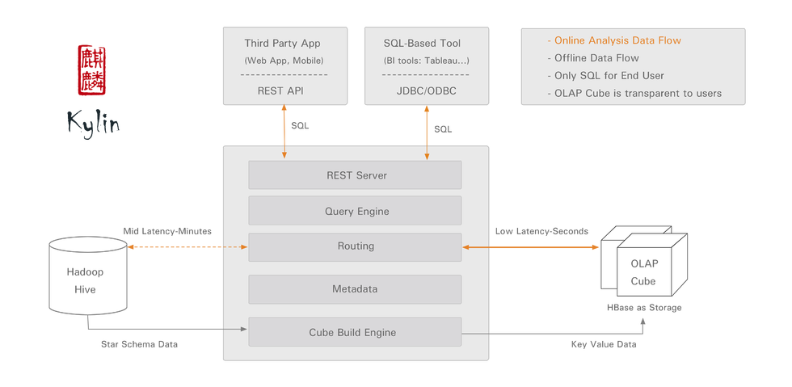
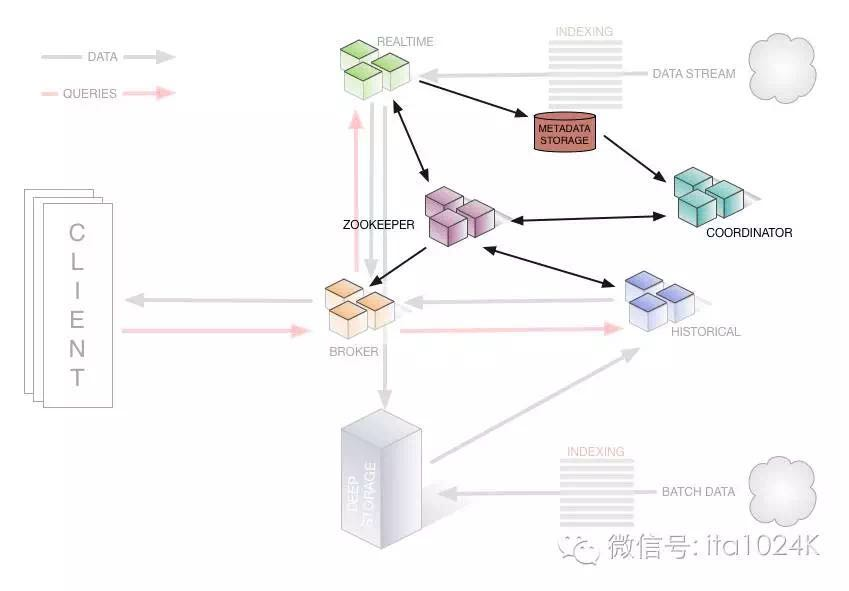

## 大数据OLAP分析Note
------------------------------------------------------------

**Bigdata Analysis Product=DataVisualization + OLAP(Cube+QueryEngine/Spark) + Bigdata Storage(Greenplum/HDFS/Kudu)**

OLAP     | Type 	| Link 					   | Desc
-------- |----------|--------------------------|----------------
Impala   | RTOLAP   | https://github.com/cloudera/Impala/wiki | 实时SQLonHadoop(容错性差)
PrestoDB | RTOLAP   | https://prestodb.io/     | 实时SQLonHadoop
HAWQ     | RTOLAP   | http://hawq.incubator.apache.org/ | MPP+SQLonHadoop
Drill    | RTOLAP   | http://drill.apache.org/ | 多数据源SQL查询
Druid    | MOLAP 	| http://druid.io/         | 增量计算&搜索引擎
Pinot    | MOLAP    | https://github.com/linkedin/pinot | 增量计算
Kylin    | MOLAP    | http://kylin.apache.org/ | 预处理&Cache
Mondrian | ROLAP    | http://mondrian.pentaho.com/documentation/architecture.php | 多维数据建模

* OLAP类型:RTOLAP/MOLAP/ROLAP,其中Kylin是一种针对大数据场景设计的特殊MOLAP
* 当前OLAP技术领域有大数据量分析需求,不包含查询引擎与数据存储优化的轻量级方案(Mondrian)应用场景受限
* Tableau作为优秀可视化分析工具对大数据量分析能力有所欠缺

### 1.RT(RealTime)查询引擎 - SQLonHadoop(Impala/Presto/Drill)

**特点:DistrubutedSQLQueryEngine**

[SQLonHadoop技术分析](2017-04-04-sqlonhadoop-anlysis-note.md)

### 2.关于Kylin

**特点:Cube预处理+多维数据查询(QueryEngine应弱于Impala/Presto)**

2.1.Kylin架构

- DataSource:Hive
- MapReduce聚合计算
- Spark内存计算
- AggregateTable:HBase
- 增量CubeSegment/CubeSegmentMerge
- Trie树维度值编码

2.2.[TechnicalConcepts](http://kylin.apache.org/docs16/gettingstarted/concepts.html)

- Star Schema/Snowflake Schema
- Cube
- DIMENSION & MEASURE
- CUBE ACTIONS

2.3 表描述

- FactTable
- LookupTable(事实描述表)
- DimensionTable

2.4 Measure计算 

* Sum
* Count
* Max
* Min
* Average
* Distinct Count(based on HyperLogLog近似值估值)

### 3.ROLAP引擎 - Mondrian

**特点:多维数据建模+无内置查询引擎**

[Mondriad-ROLAP分析](2017-01-31-mondrian-olap-analysis-note.md)

### 4.MOLAP引擎 - Druid/Pinot

Druid是基于MOLAP模型的空间换时间方案。优点在于查询性能的整体提升,缺点在于数据多维分析的局限性

#### 4.1.Druid特点

**特点:类搜索引擎+增量计算+数据实时写入**

- 亚秒响应的交互式查询。支持较高并发，为面向用户的平台提供Olap查询(注意这是相比其他OLAP的强大优势)。
- 支持实时导入,导入即可被查询。支持高并发导入。
- 采用分布式shared-nothing的架构，可以扩展到PB级。
- 支持聚合函数,count和sum,以及使用javascript实现自定义UDF。
- 支持复杂的Aggregator，近似查询的Aggregator例如HyperLoglog以及Yahoo开源的DataSketches。
- 支持Groupby,Select,Search查询。(Groupby性能较差,推荐timeseries/TopN)
- 不支持大表之间的Join，但其lookup功能满足和维度表的Join
- 列存储,倒排索引,RollUP(汇总/上卷),roaring或conciseBitmap位图索引+LZ4数据压缩

#### 4.2.Druid架构分析

Druid ingestion specs define this granularity as the queryGranularity of the data. The lowest supported queryGranularity is millisecond.
Druid shards are called segments and Druid always first shards data by time. 
Segments contain data stored in compressed column orientations, along with the indexes for those columns. Druid queries only understand how to scan segments.
Following search infrastructure, Druid creates immutable snapshots of data, stored in data structures highly optimized for analytic queries.
Druid is a column store, which means each individual column is stored separately. Druid indexes data on a per-shard (segment) level.
Druid has two means of ingestion, real-time and batch. Real-time ingestion in Druid is best effort.
One common approach to operating Druid is to have a real-time pipeline for recent insights, and a batch pipeline for the accurate copy of the data.
Druid's native query language is JSON over HTTP. Apache Calcite - SQL parser, planner and query engine whose Druid adapter can query data residing in Druid.
Druid is designed to perform single table operations and does not currently support joins. Many production setups do joins at ETL because data must be denormalized before loading into Druid.
Druid is designed to have no single point of failure. Different node types are able to fail without impacting the services of the other node types. 

**A.Storage** 

* Segment:Druid倒排索引+时间分片

	Segments contain the various dimensions and metrics in a data set, stored in a column orientation, as well as the indexes for those columns.
	Segments are stored in a "deep storage" LOB store/file system.
	Druid stores its index in segment files, which are partitioned by time(按时间分片).
	Segment core data structure: three basic column types: the timestamp column, dimension columns, and metric columns.

Sharding Data to Create Segments	

* Dimensions:Bitmap Index

	Dimensions columns are different because they support filter and group-by operations, so each dimension requires the following three data structures:
	1.A dictionary that maps values (which are always treated as strings) to integer IDs,
	2.A list of the column’s values, encoded using the dictionary in 1
	3.For each distinct value in the column, a bitmap that indicates which rows contain that value.

The bitmaps in 3 -- also known as inverted indexes allow for quick filtering operations(specifically, bitmaps are convenient for quickly applying AND and OR operators). 
The list of values in 2 is needed for group by and TopN queries. 

* Multi-value columns

**B.核心模块**

* Broker模块:

route queries to if you want to run a distributed cluster. This node also merges the result sets from all of the individual nodes together. 
Broker nodes employ a cache with a LRU cache invalidation strategy. 
类似分布式搜索引擎中的meta元搜索引擎，他不负责任何Segment的查询，他只是一个代理，从Zookeeper中获取TimeLine，这个 TimeLine记录了intervals->List(Server)的mapping关系，接收到Client的请求以后，按照时间段在TimeLine查找Segment分布在那些 Server上。

* Coordinator模块:

responsible for loading new segments, dropping outdated segments, managing segment replication, and balancing segment load.
负责协调Segment的均衡分发加载，Coordinator从meta数据存储mysql/postgreSQL中获取那些还未被加载的Segment，根据当前所有Historical的负载能力均衡地分配到其LoadQueue。

* Historical模块:

从Deep Storage中下载Segment,采用mmap(内存映射)的方式加载Segment,并负责来自broker对这些Segment的查询.
Historical nodes do not communicate directly with each other or with the coordinator nodes but instead rely on Zookeeper for coordination. 

* Indexing Service模块:

The indexing service is a highly-available, distributed service that runs indexing related tasks.Indexing service tasks create (and sometimes destroy) Druid segments.
The indexing service is composed of three main components: a peon component that can run a single task, a Middle Manager component that manages peons, and an overlord component that manages task distribution to middle managers.
Druid的索引结构布局由字典，正排(列存储)以及倒排索引组成，其中倒排的PostingList采用压缩LZ4的BitMap位图索引。支持Consice和Roaring两种BitMap方式

* Realtime process模块:

Realtime nodes will periodically build segments representing the data they’ve collected over some span of time and transfer these segments off to Historical nodes.

> Realtime Node负责提供实时数据索引，生成realtime Index(Segment),并定期推送到Historical Node。在Realtime中采用LSM-Tree的模型

**C.外部模块**

- Zookeeper: discovery and maintenance of current data topology
	Zookeeper maintains information about Historical and Realtime nodes and the segments they are serving. 
- Metadata Storage: MySQL and PostgreSQL are popular metadata stores for production.
	Segments Table/ Rule Table/ Config Table/ Task-related Tables/ Audit Table
- Deep Storage: HDFS or Kudu 

#### 4.3.详细设计

**4.3.1.Quering**

GroupBy is the most flexible Druid query, but also has the poorest performance. Timeseries are significantly faster than groupBy queries for aggregations that don't require grouping over dimensions. For grouping and sorting over a single dimension, topN queries are much more optimized than groupBys.

**4.3.2.TopN queries**

Conceptually, TopN queries can be thought of as an approximate GroupByQuery over a single dimension with an Ordering spec. 
TopNs are approximate in that each node will rank their top K results and only return those top K results to the broker. 

**4.3.3.groupBy Queries:**

("queryType": "groupBy")

"v1", the default, generates per-segment results on data nodes (historical, realtime, middleManager) using a map which is partially on-heap (dimension keys and the map itself) and partially off-heap (the aggregated values). 
"v2" (experimental) is designed to offer better performance and memory management. This strategy generates per-segment results using a fully off-heap map.
时间维度分析-Timeseries query will generally be faster than groupBy. 
For queries with a single "dimensions" element (i.e. grouping by one string dimension), the TopN query will sometimes be faster than groupBy. 

**4.3.4.Nested groupBys**

**4.3.5.Time Boundary Queries**

**4.3.6.Search Queries(搜索查询功能)**

A search query returns dimension values that match the search specification.(DimensionMember查询)

**4.3.7.Select Queries**

Select queries return raw Druid rows and support pagination.

**4.3.8.druid-lookup与join联接**

Lookup is an experimental feature.
Lookups are a concept in Druid where dimension values are (optionally) replaced with new values.(内存计算探测)
It is worth noting that lookups support use cases where keys map to unique values (injective)
Joins
Druid has limited support for joins through query-time lookups. The common use case of query-time lookups is to replace one dimension value (e.g. a String ID) with another value (e.g. a human-readable String value). This is similar to a star-schema join.
A join query is essentially the merging of two or more streams of data based on a shared set of keys. The primary high-level strategies for join queries we are aware of are a hash-based strategy or a sorted-merge strategy.

#### 4.4.Components

**4.4.1.Datasources - Table**

A data source is the Druid equivalent of a database table. However, a query can also masquerade as a data source, providing subquery-like functionality. Query data sources are currently supported only by GroupBy queries.
Table Data Source
Union Data Source
Query Data Source

**4.4.2.Query Filters**

A filter is a JSON object indicating which rows of data should be included in the computation for a query. It’s essentially the equivalent of the WHERE clause in SQL. 

- Selector filter
- Regular expression filter
- Logical expression filter (AND/OR/NOT)
- Javascript filter
- Search filter
- In filter
- Bound filter
- Interval filter
- Filter with Extraction Functions

**4.4.3.Aggregations**

Aggregations can be provided at ingestion time as part of the ingestion spec as a way of summarizing data before it enters Druid.(数据预处理)
Aggregations can also be specified as part of many queries at query time.

- Count Aggregator
- Sum Aggregators
- Min/Max Aggregators
- Javascript Aggregators
- Cardinality aggregator 粒度聚合
- HyperUnique aggregator
- Filter Aggregator

**4.4.4.Post-Aggregations**

Post-aggregations are specifications of processing that should happen on aggregated values as they come out of Druid. If you include a post aggregation as part of a query, make sure to include all aggregators the post-aggregator requires.

#### 4.5.Druid Adapter & SQL Parser

Full SQL is currently not supported with Druid. (当前SQL支持无法与Druid原生查询语言一样灵活)
[Calcite’s Druid adapter](https://calcite.apache.org/docs/druid_adapter.html) allows you to query the data using SQL, combining it with data in other Calcite schemas.

#### 4.6.Multitenancy Consideration

Multitenant workloads can either use a separate datasource for each tenant, or can share one or more datasources between tenants using a "tenant_id" dimension. When deciding which path to go down, consider that each path has pros and cons.
Shared datasources or datasource-per-tenant
Druid offical compromise is to use more than one datasource, but a smaller number than tenants. 
Partitioning shared datasources
Customizing data distribution
Supporting high query concurrency
Druid's fundamental unit of computation is a segment. Nodes scan segments in parallel and a given node can scan druid.processing.numThreads concurrently. 
Druid internally stores requests to scan segments in a priority queue.

#### 4.7.Query Caching

Druid supports query result caching through an LRU cache. Results are stored on a per segment basis, along with the parameters of a given query. 

#### 4.8.Sorting Order

These sorting orders are used by the TopNMetricSpec, SearchQuery, GroupByQuery's LimitSpec, and BoundFilter.

- Lexicographic
- Alphanumeric
- Numeric
- Strlen
- 不支持具体维度按度量排序功能

#### 4.x.参考

- [http://druid.io/](http://druid.io/) 
- [http://static.druid.io/api/0.9.2/](http://static.druid.io/api/0.9.2/)
- [http://druid.io/docs/0.9.2/design/](http://druid.io/docs/0.9.2/design/)
- [Druid驱动海量实时多维分析](http://gitbook.cn/books/57107c8976dc085d7a00cb04/bookSource/1466138703723.html)
- [Druid:一个用于大数据实时处理的开源分布式系统](http://www.infoq.com/cn/news/2015/04/druid-data)
- [数果科技王劲:如何构建大数据实时多维分析平台](http://gitbook.cn/books/57107c8976dc085d7a00cb04/bookSource/1466741341393.html)

### 5.实时OLAP架构优化

#### 5.1.[NewBI实时OLAP架构优化](http://wiki.yunat.com/pages/viewpage.action?pageId=47520652)

#### 5.2.QueryEngine优化

5.2.1.Query性能差异与执行顺序

1) Scan Query
2) Aggregation Query
3) Join Query

5.2.2.Impala混合查询(Kudu+HBase)

5.2.3.Greenplum+GPText/HAWQ(SQLonHadoop)

5.2.4.通用SQL数据解析Calcite

5.2.5.ElasticSearch检索查询

- SQL-OLAP不支持复杂数据类型(array、struct、map)查询,要求数据输入Schema必须是平铺的。
- ES/Druid可以理解为一种支持复杂数据类型的OLAP数据库

#### 5.3.内存计算优化

- SparkSQL混合查询
- 内存表计算

### x.技术参考

- 查询引擎技术调研	
- [分布式存储架构分析](2017-01-22-bigdata-database-architect-research-note.md)
