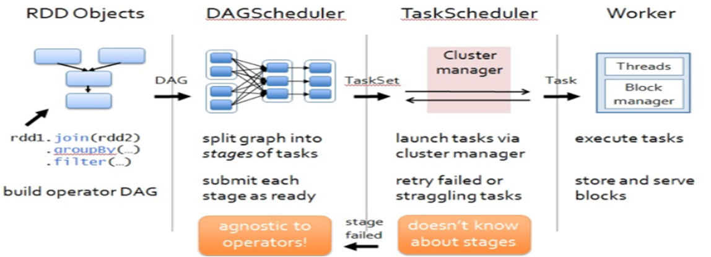
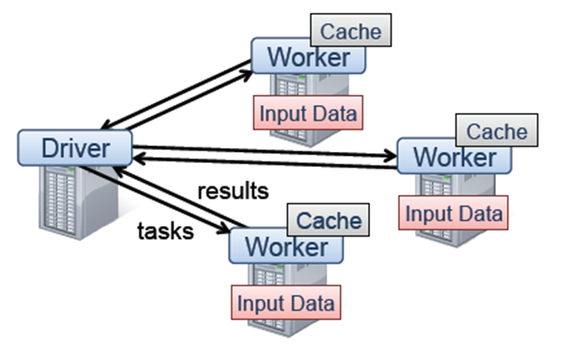

## Realtime Data Process Architect Note
------------------------------------------------------------

Lambda & Kappa Architect

### I.Lambda Architect

The Lambda architecture: principles for architecting realtime Big Data systems.

|DataLoad | MixComputer 	  | DataStorage 			 | QueryType |
|:--------|:------------------|:-------------------------|:----------|
|Kafka    | Hadoop/MapReduce  | HDFS/Impala              | Impala    |
|Kafka    | Storm             | HBase                    | Impala    |

```java
query = function(all data)
```

Book “Big Data - Principles and best practices of scalable realtime data systems" by Nathan Marz and James Warren.

The book describes the Lambda architecture as a clear set of principles for architecting Big Data systems. I like the concepts of building immutability and recomputation into a system, and it is the first architecture to really define how batch and stream processing can work together to solve a myriad of use cases. With the general emphasis moving more towards realtime, I see this book being a must read for all Big Data developers and architects alike.

The premise behind the Lambda architecture is you should be able to run ad-hoc queries against all of your data to get results, but doing so is unreasonably expensive in terms of resource. Technically it is now feasible to run ad-hoc queries against your Big Data (Cloudera Impala), but querying a petabyte dataset everytime you want to compute the number of pageviews for a URL may not always be the most efficient approach. So the idea is to precompute the results as a set of views, and you query the views. I tend to call these **Question Focused Datasets** (e.g. pageviews QFD).

**The Lambda architecture**

The Lambda architecture is split into three layers, the batch layer, the serving layer, and the speed layer.


**Batch layer (Apache Hadoop + HDFS/Impala)** 

The batch layer is responsible for two things. The first is to store the immutable, constantly growing master dataset (HDFS), and the second is to compute arbitrary views from this dataset (MapReduce). Computing the views is a continuous operation, so when new data arrives it will be aggregated into the views when they are recomputed during the next MapReduce iteration.

The views should be computed from the entire dataset and therefore the batch layer is not expected to update the views frequently. Depending on the size of your dataset and cluster, each iteration could take hours.

**Serving layer (Impala)**

The output from the batch layer is a set of flat files containing the precomputed views. The serving layer is responsible for indexing and exposing the views so that they can be queried for end users.

As the batch views are static, the serving layer only needs to provide batch updates and random reads, and for this I would use Cloudera Impala. To expose the views using Impala all the serving layer would have to do is create a table in the Hive Metastore that points to the files in the HDFS. Users would then be able to use Impala to query the views immediately.

Hadoop and Impala are perfect tools for the batch and serving layers. Hadoop can store and process petabytes of data, and Impala can query this data quickly and interactively. Although, the batch and serving layers alone do not satisfy any realtime requirement because MapReduce (by design) is high latency and it could take a few hours for new data to be represented in the views and propagated to the serving layer. This is why we need the speed layer.

	Just a note about the use of the term ‘realtime’. When I say realtime, I actually mean near-realtime (NRT) and the time delay 
	between the occurrence of an event and the availability of any processed data from that event. 
	In the Lambda architecture, realtime is the ability to process the delta of data that has been captured 
	after the start of the batch layers current iteration and now.

**Speed layer (Storm + Apache HBase)**

In essence the speed layer is the same as the batch layer in that it computes views from the data it receives. The speed layer is needed to compensate for the high latency of the batch layer and it does this by computing realtime views in Storm. The realtime views contain only the delta results to supplement the batch views.

Whilst the batch layer is designed to continuously recompute the batch views from scratch/Kafka, the speed layer uses an incremental model whereby the realtime views are incremented as and when new data is received. Whats clever about the speed layer is the realtime views are intended to be transient and as soon as the data propagates through the batch and serving layers the corresponding results in the realtime views can be discarded. This is referred to as “complexity isolation” in the book, meaning that the most complex part of the architecture is pushed into the layer whose results are only temporary.


**Query merge in memory**

The final piece of the puzzle is exposing the realtime views so that they can be queried and merged with the batch views to get the complete results. As the realtime views are incremental, the speed layer requires both random reads and writes, and for this I would use Apache HBase. HBase provides the ability for Storm to continuously increment the realtime views and at the same time can be queried by Impala for merging with the batch views. Impala’s ability to query both the batch views stored in the HDFS and the realtime views stored in HBase make it the perfect tool for the job(Impala could query both HDFS and HBase).The aggregate query merge calculation in memory is very important key for the final result.

**Thoughts** 

The book describes some great architectural principles that can be applied to any Big Data architecture, specifically immutability and recomputation. Hadoop gives you a platform for storing all of your data and you don’t need a complex system for finding and updating individual records at scale, you can simply append new immutable records to your master dataset. An immutable record is a version of a record at a point in time. Newer versions of a record can be added, but a particular version can never be overridden, meaning that you can always revert to a previous state. In the Lambda architecture this means that if you accidentally added some bad records, they can simply be deleted and the views recomputed to fix the problem. If the data was mutable then its much more difficult - and sometimes impossible - to revert to a previous state. The book describes this as having “human fault-tolerance”.

The book also emphasises that the batch views should be recomputed from scratch from the entire master dataset. You may think that this is a bad idea (as I did) and surely its more performant to implement incremental MapReduce algorithms to increase the frequency of the batch views. Although by doing this you will trade performance for human fault-tolerance, because when using an incremental algorithm it is much more difficult to fix any problems in the views. For example, lets say that you accidentally deployed an algorithm that incremented a counter by 2 instead of 1. If you were computing incremental results it would be difficult to go back and recompute each increment, whereas recomputing the results from scratch is simple and all you would have to do is fix the algorithm and the views would be fixed during the next batch iteration.

When talking about the Lambda architecture one question always comes up: can you achieve the same results using the Hadoop ecosystem alone?

I think the reasons for implementing this architecture lie in your perception and requirements for realtime, and whether you think human fault-tolerance is an important factor in your system. It is feasible to implement a low latency system in Hadoop. For example, you could use Apache Flume to create an ingest pipeline into HDFS or HBase and use Impala to query the data. The latest version of Flume (1.2.0) also introduces the concept of Interceptors which can be used to modify the streaming data. Although Flume by design is not a streaming analytics platform like Storm and therefore I think it would be difficult to compute your realtime views in Flume (but not impossible). Storm on the other hand is a purpose built, scalable stream processing system that typically works at much lower latency.

What I’ve learnt the most from the Big Data book (or at least the first 6 chapters of it) is the architectural principles. The importance of immutability and human fault-tolerance, and the benefits of precomputation and recomputation. If you’re considering implementing the Lambda architecture in its entirety, ask yourself one question: how realtime do I need to be? If your answer is in the tens of seconds then the complete Lambda architecture maybe overkill, but if your answer is milliseconds then I think the Lambda architecture is your answer.

**storm-hbase connector** 

As a precursor to this post I’ve been working on a HBase connector for Storm. The connector provides a number of Storm Bolt and Trident state implementations for creating realtime views in a Lambda architecture. Please check it out on my [GitHub page](https://github.com/jrkinley/storm-hbase).

#### Links

- [http://www.cloudera.com/content/cloudera/en/products/cdh.html](http://www.cloudera.com/content/cloudera/en/products/cdh.html)
- [https://github.com/nathanmarz/storm](https://github.com/nathanmarz/storm)
- [http://www.manning.com/marz/](http://www.manning.com/marz/)
- [http://www.slideshare.net/nathanmarz/runaway-complexity-in-big-data-and-a-plan-to-stop-it](http://www.slideshare.net/nathanmarz/runaway-complexity-in-big-data-and-a-plan-to-stop-it)


### II.Kappa Architect


|DataLoad | MixComputer 	  | DataStorage      | QueryType  |
|:--------|:------------------|:-----------------|:-----------|
|Kafka    | Spark             | HDFS/SparkSQL    | Presto     |
|Kafka    | SparkStreaming    | Cassandra        | Presto     |

#### A.Spark(迭代计算)

##### 1.Spark 

1.1.定义

* RDD(Resilient Distributed Datasets)

Spark常见存储数据的格式是Key-Value
也支持类似Parquet这样的列存格式
Key-Value格式数据一般是原始数据大小的2倍左右，而列存一般是原始数据的1/3到1/4

* Operation

Transformation/Action

RDD的action从RDD中返回值,transformations可以转换成一个新的RDD并返回他的引用。                                                                                                                                                                                 
                                                              
1.2.作业提交

- RDD之间的依赖性分析, DAGScheduler
- 根据DAG的分析结果将一个作业分成多个Stage
- DAGScheduler在确定完Stage之后,会向TaskScheduler提交任务集Taskset



Executor Task:ShuffleMapTask,ResultTask

中间结果存储:

	- Checkpoint:计算结果存储在HDFS
	- Cache:数据存储到内存,内存不足时存储在磁盘

1.3.消息传递-ActorModel和Akka

Akka作为Spark集群间通信框架

ActorModel适合用于解决并发编程问题(Erlang语言)。Actor的行为规范定义:

	1)消息接收
	2)消息处理
	3)消息发送

1.4.Memory Store

* CacheManager
* BlockManager
* MemoryStore
* DiskStore
* BlockManagerWorker
* ConnectionManager
* BlockManagerMaster

1.5.Spark集群

- Driver
- Master
- Worker
- Executor



1.6.部署方式

local/local-cluster/standalone cluster/SparkonYARN


##### 2.Spark Streaming

DStream(Discretized Stream)
表示从数据源获取持续性的数据流以及经过转换后的数据流,连续的RDD序列

- Master
- Worker
- Client

StreamingContext

JobScheduler
DStreamGraph
StreamingTab

BlockRDD

容错性分析

**SparkStreaming vs Storm**

- Akka作为Spark集群间通信框架
- Storm依赖于ZooKeeper来维护整个集群,集群之间的消息通信采用ZeroMQ/Netty作为消息发送组件
- 在JVM进程中各线程之间的消息传递使用DisruptorPattern(高效线程间消息发送机制)
- Storm的TridentTopology与SparkStreaming的DStream

##### 3.SparkSQL(ac-hoc即席查询)

3.1.SQL执行顺序

- 语法解析
- 操作绑定
- 优化执行策略
- 交付执行

3.2.SQL On Spark

- SqlParser生成LogicPlan Tree
- Analyzer和Optimizer将各种Rule作用于LogicalPlan Tree
- 最终优化生成的LogicalPlan使用SparkPlan生成Spark RDD
- 最后将生成的RDD交由Spark执行

SQLContext - SchemaRDD

3.3.SparkPlan转换策略

- CommandStrategy
- TakeOrdered
- PartialAggregation
- LeftSemiJoin (解决exists/in)
- HashJoin
- InMemoryScans
- ParquetOperations
- BasicOperators
- CartesianProduct(笛卡尔积JOIN)
- BroadcastNestedLoopJoin(LeftOuterJoin/RightOuterJoin/FullOuterJoin)

3.4.文件格式

Parquet和JSON

3.5.Spark on Hive

**Hive架构**

- Driver:负责将用户指令翻译转换为相应的MapReduce Job
- Hive MetaStore元数据库:默认使用Derby存储引擎
- 支持CLI,JDBC与WebUI接口

**HiveQLOnMapReduce执行过程

- Parser
- Semantic Analyser
- LogicalPlan Generating
- QueryPlan Generating
- Optimizer

HiveContext


3.6.DataFrames & Datasets

- A Dataset is a distributed collection of data. 
- A DataFrame is a Dataset organized into named columns. 
- DataFrames can be constructed from a wide array of sources such as: structured data files, tables in Hive, external databases, or existing RDDs.
- Datasets are similar to RDDs, however, instead of using Java serialization or Kryo they use a specialized Encoder to serialize the objects for processing or transmitting over the network.

_Global Temporary View_

```java
spark.sql("SELECT * FROM global_temp.people").show();
```

3.7.SparkSQL应用

* Spark SQL supports two different methods for converting existing RDDs into Datasets. 
* Spark SQL supports automatically converting an RDD of JavaBeans into a DataFrame. 
* Spark SQL also includes a data source that can read data from other databases using JDBC.
* Spark SQL can cache tables using an in-memory columnar format by calling spark.cacheTable("tableName") or dataFrame.cache().

##### 4.BlinkDB

A massively parallel, approximate query engine for running interactive SQL queries on large volumes of data


##### 5. SparkMLlib

5.1.线性回归

梯度下降法
拟合函数
岭回归

5.2.分类算法(逻辑回归)


5.3.拟牛顿法


##### 6. GraphX

- Pregel
- PageRank


### III.OLAP In-Memory Computing

#### 1.应用场景

- 内存计算规则
- 表计算/数据透视(计算函数设计)
- 实时数据(增量)计算
- 上下文筛选查询(数据查询联动更新)
- 内存计算结果保存

#### 2.Spark实时计算应用

#### 3.[NewBI内存架构设计](http://wiki.yunat.com/pages/viewpage.action?pageId=42515508)

#### 4.Presto设计参考

