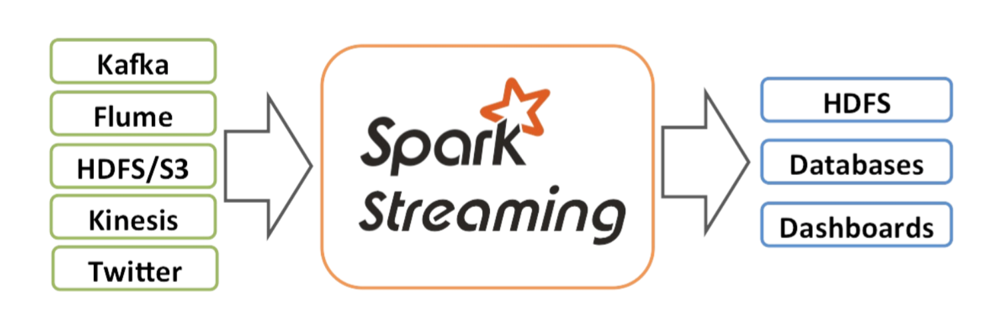
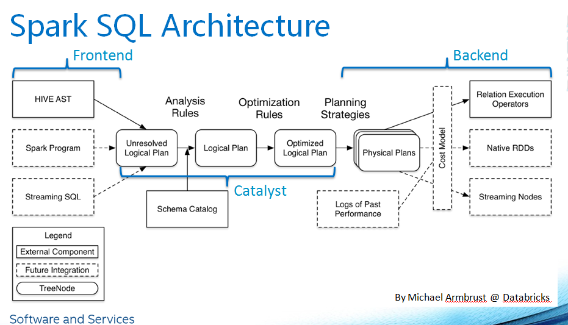
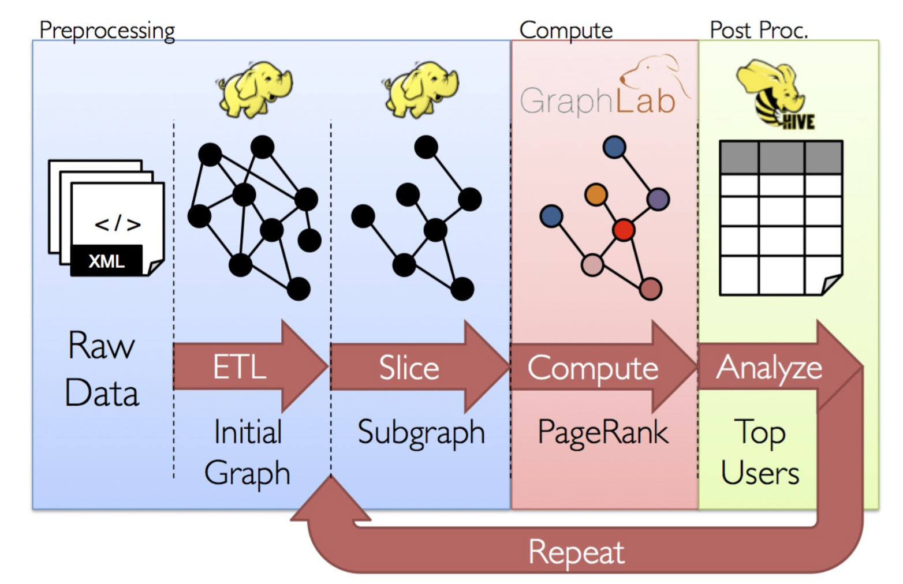

## Spark Bigdata In-Memory Architect Note
------------------------------------------------------------

#### 1.Spark(迭代计算) 

Spark核心特征:

    - RDD的编程模型更简单
    - DAG切分的多阶段stage计算过程更快速
    - 使用内存存储中间计算结果更高效

    1.基于多个计算阶段依赖执行mr的方案可有效减少对HDFS的访问,减少作业的调度执行次数
    2.Spark优先使用内存进行数据存储,包括RDD。而不是直接存放在本地HDFS

##### 1.1.定义

*RDD(Resilient Distributed Datasets)*

Spark常见存储数据的格式是Key-Value
也支持类似Parquet这样的列存格式
Key-Value格式数据一般是原始数据大小的2倍左右，而列存一般是原始数据的1/3到1/4

*Operation*

    Transformation函数-transformations可以转换成一个新的RDD并返回他的引用   
	Action函数-RDD的action从RDD中返回值


##### 1.2.作业提交

- RDD之间的依赖性分析, DAGScheduler
- 根据DAG的分析结果将一个作业分成多个Stage
- DAGScheduler在确定完Stage之后,会向TaskScheduler提交任务集Taskset


Executor Task:ShuffleMapTask,ResultTask

中间结果存储:

	- Checkpoint:计算结果存储在HDFS
	- Cache:数据存储到内存,内存不足时存储在磁盘

##### 1.3.消息传递-ActorModel和Akka

Akka作为Spark集群间通信框架

ActorModel适合用于解决并发编程问题(Erlang语言)。Actor的行为规范定义:

	1)消息接收
	2)消息处理
	3)消息发送


##### 1.4.Spark Shuffle

默认的Shuffle方式改为Sort Based Shuffle(SortShuffleManager),Spark 2.0后Hash Based Shuffle(HashShuffleManager)退出历史舞台。

Sort Based Shuffle: map端的任务会按照Partition id以及key对记录进行排序。同时将全部结果写到一个数据文件中，同时生成一个索引文件， 再后面就就引入了Tungsten-Sort Based Shuffle， 这个是直接使用堆外内存和新的内存管理模型，节省了内存空间和大量的gc， 是为了提升性能。

ShuffleWriter分类:

    BypassMergeSortShuffleWriter
    SortShuffleWriter
    UnsafeShuffleWriter


**mr的shuffle**

_mapShuffle_

数据存到hdfs中是以块进行存储的，每一个块对应一个分片，maptask就是从分片中获取数据的 
在某个节点上启动了map Task,map Task读取是通过k-v来读取的,读取的数据会放到环形缓存区，这样做的目的是为了防止IO的访问次数,然后环形缓存区的内存达到一定的阀值的 
时候会把文件益写到磁盘，溢出的各种小文件会合并成一个大文件，这个合并的过程中会进行排序，这个排序叫做归并排序 

map阶段会涉及到 

	1.sort排序(默认按字典排序) 
	2.合并(combiner合并) 
	3.文件合并(merage 合并 总共有三种，默认是内存到磁盘) 
	4.压缩（设置压缩就会执行） 

reduce Shuffle 
归并排序完成后reduce端会拉取map端的数据，拉取的这个过程叫做copy过程，拉取的数据合并成一个文件，GroupComparator(默认,这个我们也可以自定义)是专门对文件夹里面的key进行分组 
然后就形成k-List(v1,v2,v3)的形式，然后reduce经过业务处理，最终输出到hdfs，如果设置压缩就会执行，不设置则不执行 

reduce阶段会涉及到： 

	1.sort排序 
	2.分组（将相同的key的value放到一个容器的过程） 
	3.merge文件合并
	4.压缩

spark shuffle的版本一

1.rdd中一个partition对应一个shufflemapTask任务，因为某个节点上可以有多个分区，所以可以有多个shufflemapTask 
2.每一个shufflemapTask都会为每一个resultTask创建一个bucket缓存(内存)，bucket的数量=M x R,当内存达到一定值的时候会益写到shuffleblockfile文件中 
3.shuffleMap task会封装成一个叫mapStatus,这个mapstatus里面包含了每一个resultTask拉取数据的大小 
Mapstatus： 是ShuffleMapTask返回调度器scheduler的对象，包括任务运行的块管理器地址和对应每个reducer的输出大小。 
如果partitions的数量大于2000，则用HighlyCompressedMapStatus，否则用CompressedMapStatus。 
4.每一个resultTask拉取过来的数据，就会在内部形成一个rdd,这个rdd叫做shuffleRdd,这个rdd的数据优先存放到内存中，内存中不够然后存到磁盘里 
如果是groupByKey算子就结束了,下次执行ReduceByKey的时候，再进行相同key的聚合操作，这个时候会把shuffle rdd进行聚合操作生成mapPartitionRdd,就是我们执行reduceByKey之后得到的那个rdd 

spark shuffle的版本二 

版本一的缺点:版本一的shuffle方式中会产生大量的小文件， 
版本二的优点:就是为了减少这么多小文件的生成 

	bucket的数量=cpu\*resultTask的个数 

版本二设计的原理:一个shuffleMapTask还是会写入resultTask对应个数的本地文件，但是当下一个shuffleMapTask运行的时候会直接把数据写到之前已经建立好的本地文件，这个文件可以复用，这种复用机制叫做consolidation机制 
我们把这一组的shuffle文件称为shuffleGroup,每个文件中都存储了很多shuffleMapTask对应的数据，这个文件叫做segment,这个时候因为不同的shuffleMapTask都是存在一个文件中 
所以建立索引文件，来标记shuffleMapTask在shuffleBlockFile的位置+偏移量，这样就可以在一个文件里面把不同的shuffleMaptask数据分出来 

spark shuffle的版本三 

版本三的优点：是通过排序建立索引，相比较于版本二，它只有一个临时文件，不管有多少个resultTask都只有一个临时文件， 
缺点:这个排序操作是一个消耗CPU的操作，代价是会消耗很多的cpu 
版本二占用内存多，打开文件多，但不需排序，速度快。版本三占用内存少，打开文件少，速度相对慢。实践证明使用第二种方案的应用场景更多些。 

shuffle的读流程 

	1.有一个类blockManager，封装了临时文件的位置信息,resultTask先通过blockManager,就知道我从哪个节点拿数据 
	如果是远程，它就是发起一次socket请求，创建一个socket链接。然后发起一次远程调用，告诉远程的读取程序，读取哪些数据。读到的内容再通过socket传过来。 
	2.一条条读数据和一块块读数据的优缺点？ 
	如果是一条条读取的话，实时性好，性能低下

一块块读取的话性能高,但是实时性不好

Shuffle读由reduce这边发起，它需要先到临时文件中读，一般这个临时文件和reduce不在一台节点上，它需要跨网络去读。但也不排除在一台服务器。不论如何它需要知道临时文件的位置， 
这个是谁来告诉它的呢？它有一个BlockManager的类。这里就知道将来是从本地文件中读取，还是需要从远程服务器上读取。 
读进来后再做join或者combine的运算。 
这些临时文件的位置就记录在Map结构中。 
可以这样理解分区partition是RDD存储数据的地方，实际是个逻辑单位，真正要取数据时，它就调用BlockManage去读，它是以数据块的方式来读。 
比如一次读取32k还是64k。它不是一条一条读，一条一条读肯定性能低。它读时首先是看本地还是远程，如果是本地就直接读这个文件了， 
如果是远程，它就是发起一次socket请求，创建一个socket链接。然后发起一次远程调用，告诉远程的读取程序，读取哪些数据。读到的内容再通过socket传过来。


**计算阶段划分的依据是shuffle,不是转换函数的类型**

##### 1.5.Memory Store

* CacheManager
* BlockManager
* MemoryStore
* DiskStore
* BlockManagerWorker
* ConnectionManager
* BlockManagerMaster

##### 1.6.Spark集群

- Driver
- Master
- Worker
- Executor


*部署方式*

local/local-cluster/standalone cluster/SparkonYARN


#### 2.Spark Streaming

##### 2.1.架构



- Master(Spark/Mesos/YARN集群URL或local[*])
- Worker
- Client

##### 2.2.代码结构

* StreamingContext(由SparkContext创建生成)
* DStream(Discretized Stream)表示从数据源获取持续性的数据流以及经过转换后的数据流,连续的RDD序列

	Basic sources:这些源在StreamingContext API中直接可用
	Advanced sources:这些源包括Kafka,Flume,Kinesis,Twitter等

* Receiver
* DStream transformation
* 缓存或持久化-DStream.persist(默认持久化到内存)
* Checkpointing-dstream.checkpoint
* JobScheduler
* DStreamGraph
* StreamingTab
* BlockRDD

##### 2.3.容错性分析

##### 2.4.SparkStreaming vs Storm

- Akka作为Spark集群间通信框架
- Storm依赖于ZooKeeper来维护整个集群,集群之间的消息通信采用ZeroMQ/Netty作为消息发送组件
- 在JVM进程中各线程之间的消息传递使用DisruptorPattern(高效线程间消息发送机制)
- Storm的TridentTopology与SparkStreaming的DStream


#### 3.SparkSQL(ac-hoc即席查询)

SchemaRDD类似关系型数据库,可以通过存在的RDD,一个Parquet文件,一个JSON数据库或者Hive中使用HiveQL创建的



##### 3.1.SparkSQL应用

* Spark SQL supports two different methods for converting existing RDDs into Datasets. 
* Spark SQL supports automatically converting an RDD of JavaBeans into a DataFrame. 
* Spark SQL also includes a data source that can read data from other databases using JDBC.
* Spark SQL can cache tables using an in-memory columnar format by calling spark.cacheTable("tableName") or dataFrame.cache().

##### 3.2.代码结构

* SQLContext(由SparkContext创建生成)
* SQLContext - SchemaRDD
* 数据源:SchemaRDDs/Parquet/JSON数据集/Hive表/ThriftJDBC&ODBC

	- SchemaRDD生成方式:利用反射推断模式/编程指定模式

* SparkSQL通过调用sqlContext.cacheTable("tableName")来缓存柱状格式表
* 注意schemaRDD.cache()不会用柱状格式表来缓存
* SparkSQL支持用领域特定语言编写查询
* SparkSQL数据类型

##### 3.3.SQL执行顺序

- 语法解析
- 操作绑定
- 优化执行策略
- 交付执行

##### 3.4.SQL On Spark

- SqlParser生成LogicPlan Tree
- Analyzer和Optimizer将各种Rule作用于LogicalPlan Tree
- 最终优化生成的LogicalPlan使用SparkPlan生成Spark RDD
- 最后将生成的RDD交由Spark执行

##### 3.5.SparkPlan转换策略

- CommandStrategy
- TakeOrdered
- PartialAggregation
- LeftSemiJoin (解决exists/in)
- HashJoin
- InMemoryScans
- ParquetOperations
- BasicOperators
- CartesianProduct(笛卡尔积JOIN)
- BroadcastNestedLoopJoin(LeftOuterJoin/RightOuterJoin/FullOuterJoin)

##### 3.6.Spark on Hive

_Hive架构_

- Driver:负责将用户指令翻译转换为相应的MapReduce Job
- Hive MetaStore元数据库:默认使用Derby存储引擎
- 支持CLI,JDBC与WebUI接口

_HiveQLOnMapReduce执行过程_

- Parser
- Semantic Analyser
- LogicalPlan Generating
- QueryPlan Generating
- Optimizer

* HiveContext(由SparkContext创建生成)


##### 3.7.DataFrames & Datasets

- A Dataset is a distributed collection of data. 
- A DataFrame is a Dataset organized into named columns. 
- DataFrames can be constructed from a wide array of sources such as: structured data files, tables in Hive, external databases, or existing RDDs.
- Datasets are similar to RDDs, however, instead of using Java serialization or Kryo they use a specialized Encoder to serialize the objects for processing or transmitting over the network.


_Global Temporary View_

```java
spark.sql("SELECT * FROM global_temp.people").show();
```


#### 4. SparkMLlib

**4.1.线性回归**

梯度下降法
拟合函数
岭回归

**4.2.分类算法(逻辑回归)**


**4.3.拟牛顿法**


#### 6. GraphX

- 用于图和并行图graph-parallel的计算
- GraphX通过引入Resilient Distributed Property Graph:带有顶点和边属性的有向多重图,来扩展Spark RDD.
- Google图算法引擎Pregel(用来解决网页链接分析、社交数据挖掘等实际应用中涉及的大规模分布式图计算问题)
- GraphX项目的目的是将graph-parallel和data-parallel统一在一个系统中
- 属性图是一个有向多重图,它带有连接到每个顶点和边的用户定义的对象.
- 属性图是不可变的,分布式的,容错的。
- Pregel API
- org.apache.spark.graphx.lib-PageRank算法



