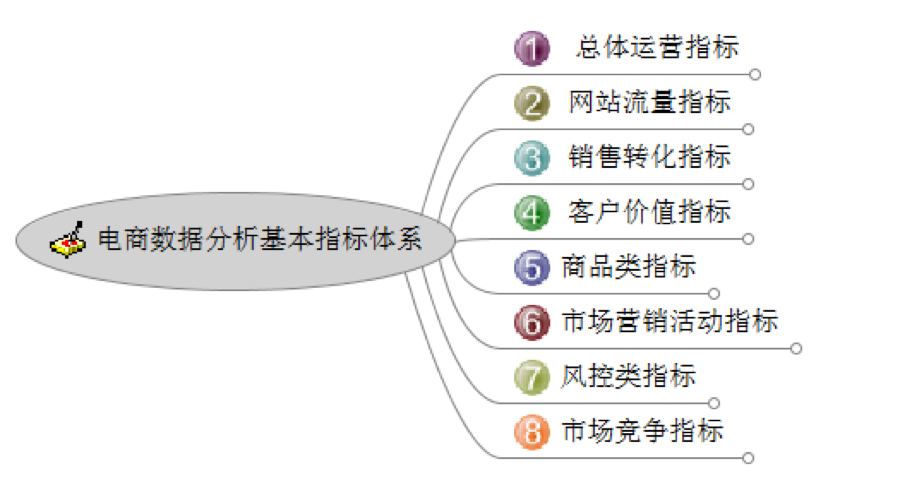
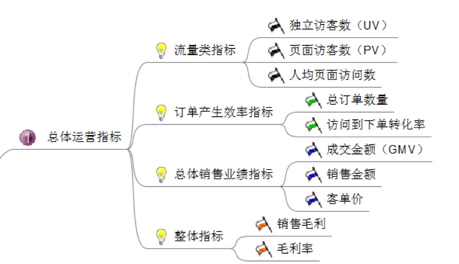
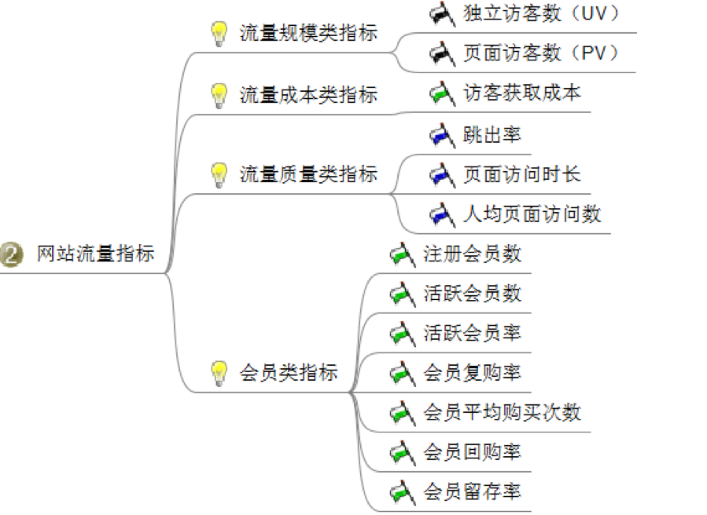
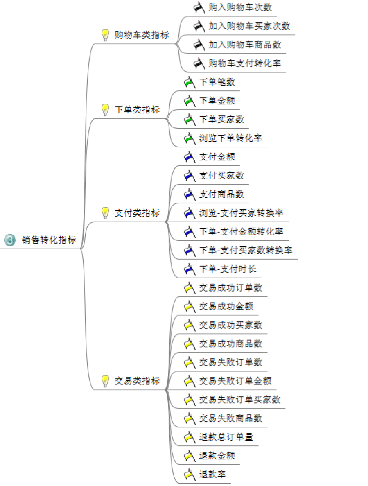
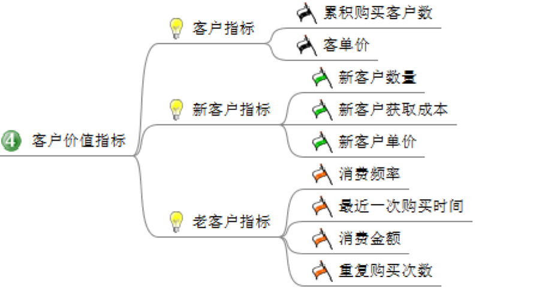
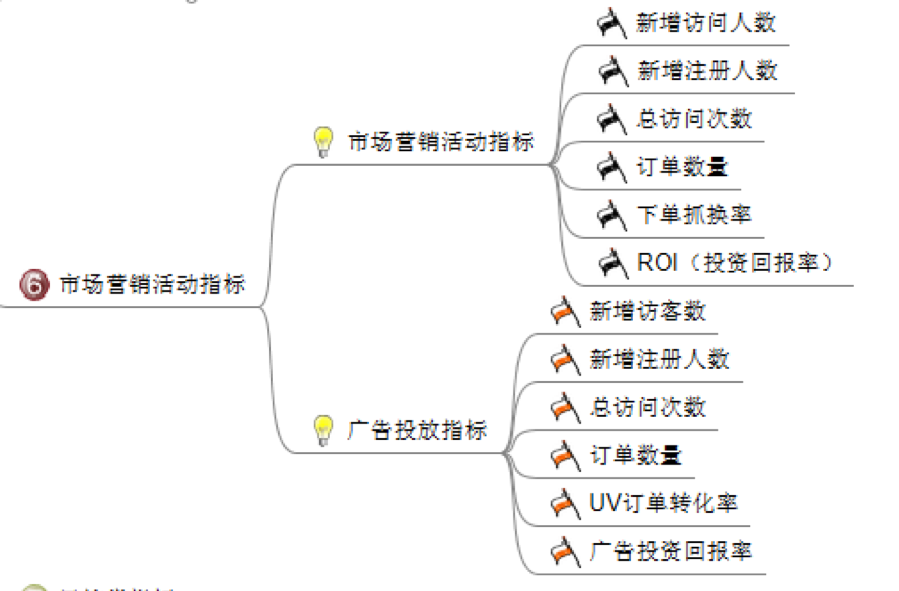
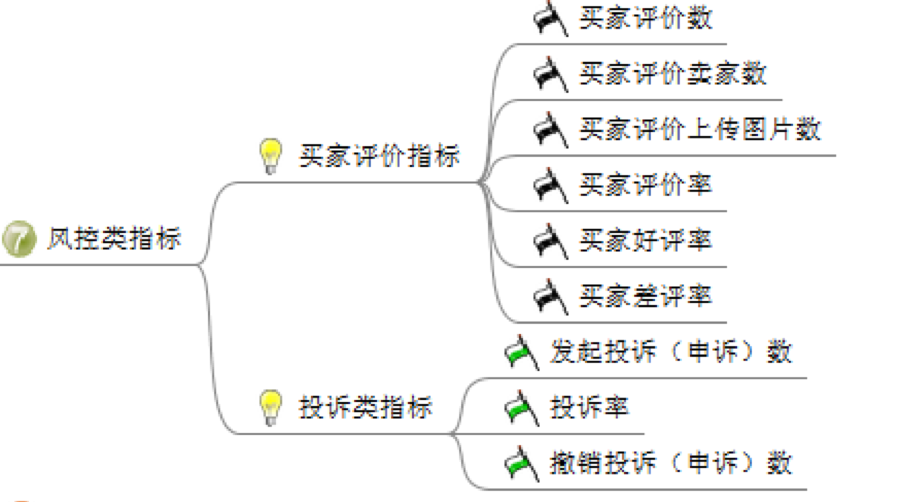
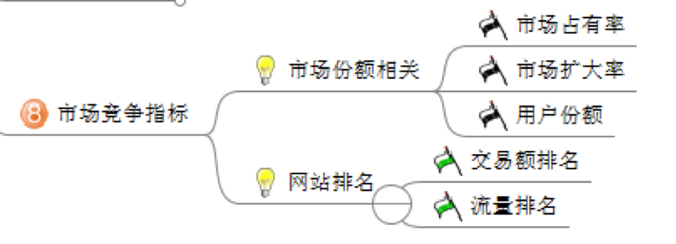

## 新零售分析模型设计Note
------------------------------------------------------------

借助OLAP现有技术框架,针对新零售业态(电商与零售,线上与线下)数据融合分析做深度定制。实现新零售行业通用数据挖掘需求满足。
针对非阿里业务数据ETL接入必须进行深度优化,简化ETL数据接入流程。零售行业数据分析的定制化需求非常大,如何解决通用化设计?

#### 1.零售建模设计

**A.CRM与客户分析**

CRM客户洞察

- 会员行为分析
- 会员价值分析
- 会员生命周期
- 会员流失分析预测
- 会员偏好分析
- 浏览分析
- 会员线上标签开发

会员画像

**B.销售分析**

_某化妆品巨头数据分析月报(ELM)_

_复购率计算_

```sql
select t.*,t1.ttl_cus,t.repeat_cus/t1.ttl_cus as'repeat_rate'
from(
select a.yearmoth,count(distinct customerno) as'repeat_cus' from(
select DATE_FORMAT('2017-01-01','%Y-%m') as'yearmoth',
customerno,if(count(distinct pay_time)=1,'1  time purchaser','Repeat purchaser') as'cus_type'
from base_trade_cl
where pay_time between '2017-01-01' and '2017-01-31'
group by customerno) a 
where a.cus_type='Repeat purchaser'
)t
left join 
(select DATE_FORMAT('2017-01-01','%Y-%m') as'yearmoth',count(distinct customerno)as'ttl_cus'
from base_trade_cl
where pay_time between '2017-01-01' and '2017-01-31')t1 on t.yearmoth=t1.yearmoth
```


**C.RFM查询模型(重点)**

	应用场景设计:RFM客户划分
	RFM数据建模分析
	双十一数据建模分析设计


**D.商品分析**

- 商品关联分析
- 商品回购分析

#### 2.数据挖掘应用


##### 2.1.表查询模型(重点)

通过查询表方式定义单元格(聚合),再在该单元格中进行计算
应用场景设计:RFM客户响应率或客单价
复购率统计指标

* 2.1.1.任意时间新老客定义

	a.创建客户粒度第一次购买时间聚合表
	b.订单表按时间进行数据筛选
	c.订单筛选表与客户聚合表JOIN连接,定义新老客
	d.自动生成新老客标签维度

* 2.1.2.定义自定义函数Fixed/Included/Excluded


##### 2.2.客户画像-朴素贝叶斯模型(概率统计)

应用场景设计:

	概率
	几率
	似然
	TF-IDF算法:关键字相关性统计
	在无监督情况下,可用朴素贝叶斯模型进行相关性概率分析实现电商客户画像分析

朴素贝叶斯与相关性分析

	TF-IDF算法


##### 2.3.线性回归(预测结果)

普通最小二乘回归分析:线性回归中找出最佳拟合曲线的常见方法

对于一个给定的数据集,总是可能找到一条最佳拟合曲线

应用场景设计:
	
	y=W.x+b
	构建模型（蓝色部分）
	基于模型构建成本函数（红色部分）
	使用梯度下降（绿色部分）
	最小化成本函数

##### 2.4.多特征线性回归

复杂的 n 特征公式可以用矩阵简化

	y=W.x+W2.x2+b


##### 2.5.客户流失分析-逻辑回归(分类结果)

线性回归与逻辑回归的区别与相似

协调逻辑回归与线性回归

为了使逻辑回归利用 y = W.b + x，我们需要做出一些改变以协调上述差异。

	1.特征变换，x
	2.预测结果转换，y
	3.成本函数的变换

客户流失率分析

##### 2.6.客户划分和分层效应

客户金字塔模型

基于用户分层后的营销投放

客户分层趋势分析

客户地域分布

客户画像

##### 2.7.决策树

一个分层的规则集,可用于分类,评估与预测问题


##### 2.8.商品关联分析

购物篮分析

关联规则的目的就是在一个数据集中找出项与项之间的关系，也被称为购物篮分析(Market Basket analysis)。

Apriori algorithm具体应用


##### 2.9.评价舆情分析(文本解析)


#### 3.阿里电商指标解析

_3.1.阿里电商指标分析_

店铺访客行为分:最近30天，到店铺的买家访问行为的平均得分

访客的人均访问时长计算公式：页面的停留时长=进入下一个页面的时间-进入本页面的时间

人均访问页面数也就是指：总页面数/访问人数

支付转化率

“客单价”的提升主要靠商品单价和关联销售 

BSR卖家服务能力指标

_3.2.如何提升店铺访客行为分_

	1. 提升访客的人均访问时长
	2. 提升人均访客页面数
	3. 提升曝光量
	4. 提升点击数


_3.3.电商指标设计_

其中2,3,4,5指标非常有用,可以作为参考

0. 电商指标体系



1. 总体运营指标：从流量、订单、总体销售业绩、整体指标进行把控，起码对运营的电商平台有个大致了解，到底运营的怎么样，是亏是赚。



2. 网站流量指标：即对访问你网站的访客进行分析，基于这些数据可以对网页进行改进，以及对访客的行为进行分析等等。



3. 销售转化指标：分析从下单到支付整个过程的数据，帮助你提升商品转化率。也可以对一些频繁异常的数据展开分析。



4. 客户价值指标：这里主要就是分析客户的价值，可以建立RFM价值模型，找出那些有价值的客户，精准营销等等。



5. 商品类指标：主要分析商品的种类，那些商品卖得好，库存情况，以及可以建立关联模型，分析那些商品同时销售的几率比较高，而进行捆绑销售，有点像啤酒喝尿布的故事。


6. 市场营销活动指标，主要监控某次活动给电商网站带来的效果，以及监控广告的投放指标。 



7. 风控类指标：分析卖家评论，以及投诉情况，发现问题，改正问题 



8. 市场竞争指标：主要分析市场份额以及网站排名，进一步进行调整



以上总共从8个方面来阐述如何对电商平台进行数据分析，当然，具体问题具体分析，每个公司的侧重点也有所差异，所以如何分析还需因地制宜。 


#### 4.时间序列分析

适用于周期波动特征显著的数据分析预测。这个分析模型在当前电商及销售领域非常流行


#### 5.Cube数据建模设计

* 5.1.1.针对预处理后的数据结构进行Cube建模

* 5.1.2.参考客户洞察Cube模型


#### 6.用户营销模型


#### 7.营销效果如何验证


