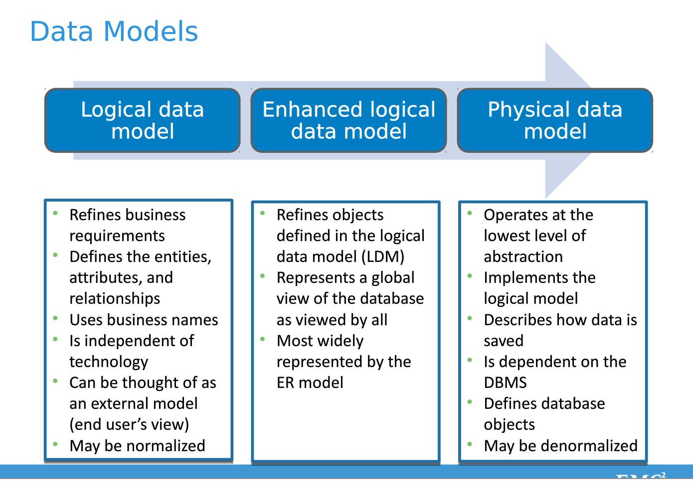
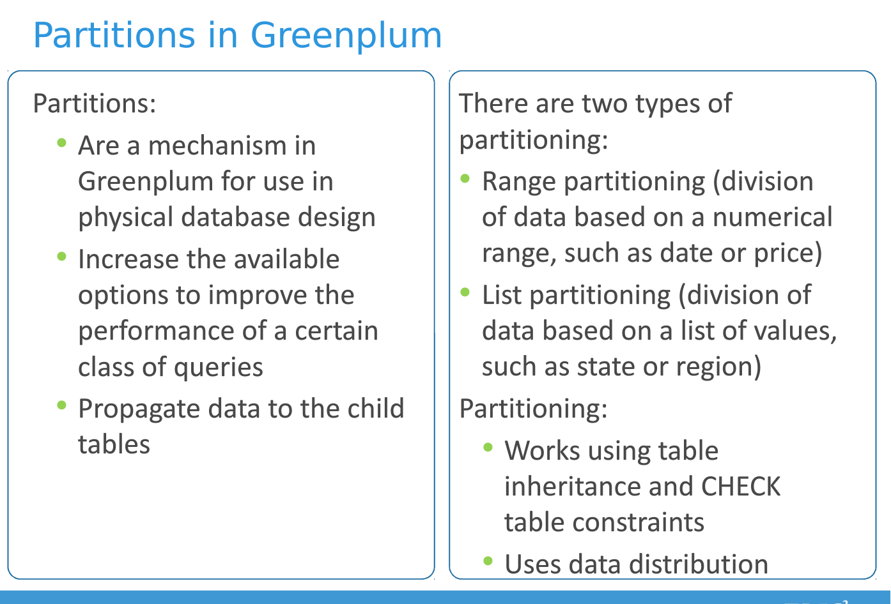
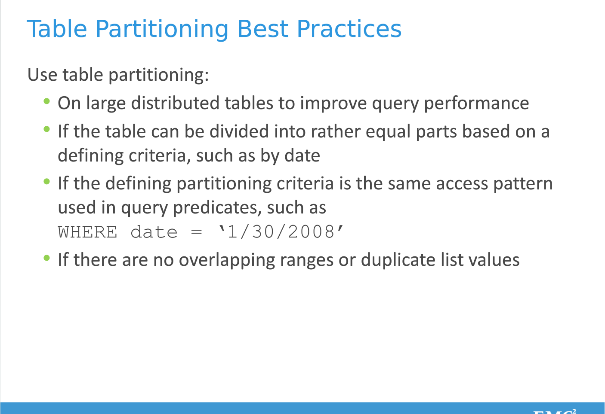

## Greenplum最佳实践
-------------------------------------------------------

#### 最佳实践概述


GPDB是一个基于大规模并行处理(MPP)和shared-nothing架构的分析型数据库。这种数据库的数据模式与高度规范化的事务性SMP的数据库显著不同,支持具有大事实表和小维度表的Star或者雪花模式。

#### 1.Greenplum Best Practice

*数据模型*

* 跨表关联(JOIN)时字段使用相同的数据类型。
* 堆存储和追加优化存储(Append-Optimized,下称 AO)
* 若表和分区表需要进行迭代式的批处理或者频繁执行单个UPDATE、DELETE或INSERT操作,
* 若表和分区表需要并发执行 UPDATE、DELETE 或 INSERT 操作,使用堆存储。
* 若表和分区表在数据初始加载后更新不频繁,且仅以批处理方式插入数据,则使用 AO 存储。
* 不要对 AO 表执行单个 INSERT、UPDATE 或 DELETE 操作。
* 不要对 AO 表执行并发批量 UPDATE 或 DELETE 操作,但可以并发执行批量 INSERT 操作。

*行列存储*

* 若数据需要经常更新或者插入,则使用行存储。
* 若需要同时访问一个表的很多字段,则使用行存储。
* 对于通用或者混合型业务,建议使用行存储。
* 若查询访问的字段数目较少,或者仅在少量字段上进行聚合操作,则使用列存储。 
* 若仅常常修改表的某一字段而不修改其他字段,则使用列存储。

*数据压缩*

* 对于大 AO 表和分区表使用压缩,以提高系统 I/O。
* 在字段级别配置压缩。
* 考虑压缩比和压缩性能之间的平衡。

*数据分布Distribute*

为所有表定义分布策略:要么定义分布键,要么使用随机分布。不要使用缺省分布方式。

* 优先选择可均匀分布数据的单个字段做分布键。
* 不要选择经常用于 WHERE 子句的字段做分布键。
* 不要使用日期或时间字段做分布键
* 分布键Distribute和分区键Partition不要使用同一字段。
* 对经常执行 JOIN 操作的大表,优先考虑使用关联字段做分布键,尽量做到本地关联,以提高性能。
* 数据初始加载后或者每次增量加载后,检查数据分布是否均匀。
* 尽可能避免数据倾斜。

*内存管理*

* 设置 vm.overcommit_memory 为 2
* 不要为操作系统的页设置过大的值
* 使用 gp_vmem_protect_limit 设置单个节点数据库(Segment Database)可以为所有查询分 配的最大内存量。
	
	- 不要设置过高的 gp_vmem_protect_limit 值,也不要大于系统的物理内存。
	- gp_vmem_protect_limit 的建议值计算公式为: (SWAP + (RAM * vm.overcommit_ratio)) * 0.9 / number_Segments_per_server

* 使用 statement_mem 控制节点数据库为单个查询分配的内存量。(注意该参数生效的前提是设置gpresqueue_memory_policy为auto,默认是eager_free)
* 使用资源队列设置队列允许的当前最大查询数(ACTIVE_STATEMENTS)和允许使用的内存大小(MEMORY_LIMIT)。

	- 不要使用默认的资源队列,为所有用户都分配资源队列。 根据负载和时间段,设置和队列实际需求相匹配的优先级(PRIORITY)。 保证资源队列的内存配额不超过 gp_vmem_protect_limit。
	- 动态更新资源队列配置以适应日常工作需要。

*数据分区*

* 只为大表设置分区,不要为小表设置分区。
* 仅在根据查询条件可以实现分区裁剪时使用分区表。
* 建议优先使用范围(Range)分区,否则使用列表(List)分区。
* 根据查询特点合理设置分区。
* 不要使用相同的字段即做分区键又做分布键。
* 不要使用默认分区。
* 避免使用多级分区;尽量创建少量的分区,每个分区的数据更多些。
* 通过查询计划的 EXPLAIN 结果来验证查询对分区表执行的是选择性扫描 (分区裁剪)。
* 对于列存储的表,不要创建过多的分区,否则会造成物理文件过多:Physical files = Segments * Columns * Partitions。

*索引*

一般来说 GPDB 中索引不是必需的。

* 对于高基数(HIGH Cardinality-唯一值多)的列存储表,如果需要遍历且查询选择性较高,则创建单列索引。 
* 频繁更新的列不要建立索引。
* 在加载大量数据之前删除索引,加载结束后再重新创建索引。
* 优先使用 B 树索引。
* 不要为需要频繁更新的字段创建位图索引。
* 不要为唯一性字段,基数非常高或者非常低的字段创建位图索引。
* 不要为事务性负载创建位图索引。
* 一般来说不要索引分区表。如果需要建立索引,则选择与分区键不同的字段。

*资源队列*

* 使用资源队列管理集群的负载。
* 为所有角色定义适当的资源队列。
* 使用 ACTIVE_STATEMENTS 参数限制队列成员可以并发运行的查询总数。 
* 使用 MEMORY_LIMIT 参数限制队列中查询可以使用的内存总量。
* 不要设置所有队列为 MEDIUM,这样起不到管理负载的作用。
* 根据负载和时间段动态调整资源队列。

*JDBC Driver*

使用Greenplum DataDirect JDBC Driver(相比postgresql jdbc driver,性能差。。。需研究)


#### 2.BestPractice详细内容

*2.0.系统监控*

监控工具 nmon_x86_64_centos7


*2.1.自建资源队列*

建议通过greenplum command center的Administration->Manage resource queues选项操作。
自己创建资源队列,系统默认的资源队列pg_default,对内存参数没有做出限制，会有内存溢出的风险
Comment:必须设置资源队列,否则大数据量查询很容易产生内存溢出异常

资源队列具体参数设置:
ACTIVE_STATEMENTS:此参数限制队列中同是执行的query数量,当query数量超过此值是则处于等待状态。pg_default默认值是20。
MEMORY_LIMIT:此参数限制起源队中所有活动query(参见ACTIVE_STATEMENTS参数)能使用的最大内存，不能超过物理内存，计算方法为 

	物理momery/机器的节点个数 x 0.9;

* 创建资源队列

	CREATE RESOURCE QUEUE ir_rq WITH(
	ACTIVE_STATEMENTS=20,
	MEMORY_LIMIT=1800M)
* 创建用户

	CREATE ROLE username with login ENCRYPTED PASSWORD RESOURCE QUEUE ir_rq;


*2.2.统计优化Vacuum*

greenplum4后版本支持压缩表的插入删除和更新操作
GP删除数据是标识删除,磁盘上的数据并没有真正删除,因此该空间不可重用
官方建议Vacuum的执行周期是每晚.该策略需测试

* vacuum只是简单的回收空间且令其可以再次使用，没有请求排它锁，仍旧可以对表读写
* vacuum full执行更广泛的处理，包括跨块移动行，以便把表压缩至使用最少的磁盘块数目存储。相对vacuum要慢，而且会请求排它锁。
* 定期执行：在日常维护中，需要对数据字典定期执行vacuum，可以每天在数据库空闲的时候进行。然后每隔一段较长时间（两三个月）对系统表执行一次vacuum full，这个操作需要停机，比较耗时，大表可能耗时几个小时。
* reindex:执行vacuum之后,最好对表上的索引进行重建

*2.2.1.Heap表*

Vacuum命令会让标记删除数据占有空间变得可以被使用。参数具体如下
* FULL:回收空间并且对磁盘上的数据进行整理,类似磁盘碎片整理,耗时较长,并且锁表。因此不建议执行该命令
* ANALYZE:更新统计信息,查询分析器生成更新的EXPLAIN Plan.
* table:默认的是当前数据库下的所有表
* column:默认的当前表的所有列

*2.2.2.Append-Optimised追加优化*

greenplum 4.x 以后的appendonly表可以支持更新和删除操作，但是限制不能更新分布键distributeKey所在的列
Vacuum首先整理优化索引,接下来顺序的在每个segment节点上执行优化,最后整理优化辅助表并更新统计信息。在每个segment节点上操作如下:
	1. 复制当前segment所有可见的数据行到一个新的segment,之后删除当前segment上的数据并且让新segment上的数据变得可用
	2. Vacuum不带full参数,增删改查可以正常操作
	3. Vacuum full命令,锁表
	4. gp_appendonly_compaction_threshold,控制Vacuum(without full)运行时是否进行表优化

压缩系统设置

当一个查询的结果过大溢出到硬盘时  采用gp_workfile_compress_algorithm 指定的参数压缩，默认值none，可选值zlib，设置成zlib后，在密集型查询系统中可提升10%-20%的效率

	设置方法gpconfig -c gp_workfile_compress_algorithm -v zlib

*2.3.ANALYZE*

* 命令：analyze [talbe [(column,..)]]
* 收集表内容的统计信息，以优化执行计划。如创建索引后，执行此命令，对于随即查询将会利用索引。
* 自动统计信息收集
* 在postgresql.conf中有控制自动收集的参数gp_autostats_mode设置，gp_autostats_mode三个值：none、no_change、on_no_stats（默认） 
* none：禁止收集统计信息
* on change：当一条DML执行后影响的行数超过gp_autostats_on_change_threshold参数指定的值时，会执行完这条DML后再自动执行一个analyze 的操作来收集表的统计信息。
* no_no_stats：当使用create talbe as select 、insert 、copy时，如果在目标表中没有收集过统计信息，那么会自动执行analyze 来收集这张表的信息。gp默认使用on_no_stats，对数据库的消耗比较小，但是对于不断变更的表，数据库在第一次收集统计信息之后就不会再收集了。需要人为定时执行analyze.
* 如果有大量的运行时间在1分钟以下的SQL，你会发现大量的时间消耗在收集统计信息上。为了降低这一部分的消耗，可以指定对某些列不收集统计信息，如下所示：

	1. create table test(id int, name text,note text);
	上面是已知道表列note不需出现在join列上，也不会出现在where语句的过滤条件下，因为可以把这个列设置为不收集统计信息：
	2. alter table test alter note SET STATISTICS 0;

*2.4.两种聚合方式*

* HashAggregate 根据group by字段后面的值算出hash值，并根据前面使用的聚合函数在内存中维护对应的列表，几个聚合函数就有几个数组。相同数据量的情况下，聚合字段的重复度越小，使用的内存越大。
* GroupAggregate 先将表中的数据按照group by的字段排序，在对排好序的数据进行全扫描，并进行聚合函数计算。消耗内存基本是恒定的。
* 选择在SQL中有大量的聚合函数，group by的字段重复值比较少的时候，应该用groupaggregate

*2.5.JOIN关联方式*

分为三类：hash join、nestloop join、merge join，在保证sql执行正确的前提下，规划器优先采用hash join。
* hash join: 先对其中一张关联的表计算hash值，在内存中用一个散列表保存，然后对另外一张表进行全表扫描，之后将每一行与这个散列表进行关联。
* nestedloop:关联的两张表中的数据量比较小的表进行广播，如笛卡尔积：select * fromtest1，test2
* merge join:将两张表按照关联键进行排序，然后按照归并排序的方式将数据进行关联，效率比hash join差。full outer join只能采用merge join来实现。
* 关联的广播与重分布解析P133，一般规划器会自动选择最优执行计划。
* 有时会导致重分布和广播，比较耗时的操作

*2.6.Redistribute重分布*

一些sql查询中，需要数据在各节点重新分布，受制于网络传输、磁盘I/O，重分布的速度比较慢。
* 关联键强制类型转换 
一般，表按照指定的分布键作hash分部。如果两个表按照id:intege、id:numericr分布，关联时，需要有一个表id作强制类型转化，因为不同类型的hash值不一样，因而导致数据重分布。
* 关联键与分部键不一致
* group by、开窗函数、grouping sets会引发重分布


*2.7.数据Load策略*

**gpfdist/gpload**

- 使用 gpfdist 进行数据的加载和导出。
- 随着段数据库个数的增加,并行性增加。
- 尽量将数据均匀地分布到多个 ETL 节点上。 将非常大的数据文件切分成相同大小的块,并放在尽量多的文件系统上。
- 一个文件系统运行两个 gpfdist 实例。
- 在尽可能多的网络接口上运行 gpfdsit。
- 使用 gp_external_max_segs 控制访问每个 gpfdist 服务器的段数据库的个数.建议gp_external_max_segs的值和gpfdist进程个数为偶数。
- 数据加载前删除索引;加载完后重建索引。
- 数据加载完成后运行 ANALYZE 操作。
- 数据加载过程中,设置 gp_autostats_mode 为 NONE,取消统计信息的自动收集。 若数据加载失败,使用 VACUUM 回收空间。

**COPY**

使用COPY命令前,删除Index和外键约束,事后运行VACUUM ANALYZE


*2.8.Greenplum Index*

http://gpdb.docs.pivotal.io/4320/ref_guide/sql_commands/CREATE_INDEX.html

GP不建议使用索引
GP主要做快速有序地扫描（基于分区）
如果建立全局索引，数据分布机制和分区机制，会完全打乱索引。如果基于单个分区去建立索引，这个有点像阿里的xxx，应该有一定效果吧

GP中索引的起作用的场景：

	返回1条或者很小的集合时
	当可以使用index来替代全表扫描的查询(append-optimized tables)
	GP只支持在用户创建的表上建立索引，不支持GP依据分区创建的叶表上创建索引。创建的索引会被复制到各个叶表上。

Greenplum supports B-Tree, Bitmap, and GiST indexes.

- B-Tree indexes can be unique or not.
- Bitmap indexes are good useful when there are 100 to 100,000 distinct values (Bitmap indexes are best suited on columns for querying than updating).
- GiST (Generalized Search Tree) indexes are used to support PostGIS.

#### 3.Data Modeling & Design-数据模型与设计

Greenplum数据模型设计:

	- 确定和描述在数据仓库中使用的数据模型与哪些数据可存储在GP中.Identify and describe the data models used in data warehousing and describe how data is stored in Greenplum.
	- 分布存储数据在GP中,使用分布键(distribution key), 分区表(partitioning)与限制(constraints).Distribute and store data in Greenplum using a distribution key,partitioning,and constraints.

*3.1.Data Models-数据模型*

* Logical data model - Cube
* Enhanced logical data model - AggregateResult/View
* The physical data model - DBTable



Entity|Attribute|Relationship|Constraint

*A.Logical Data Models-逻辑Cube模型*

* Star Schema 星型模型
* Snowflake Schema 雪花模型
* Third Normal Form(3NF) 第三范式

Dimensional Approach in DW:Star and snowflake schemas are the most common in DW implementations.


*B.Physical Data Models-物理表模型*

* Select the best distribution key used for distributing data 
* Check for data skew(数据倾斜)
* Identfy the benefits of partitioning a table and when to partition a table
* Determine partitioning candidates
* Select appropriate data type for your data
* Define constraints on tables and columns 


*3.2.Table Compression*

Rules of Compression:

- Use compression on pretty large AO (append-optimized) and partitioned tables, to improve disk I/O across the system. It won’t help very much for smaller tables.
- The best practice is to set the column compression settings at the level where the data resides.
- New partitions added to a partitioned table do not automatically inherit compression defined at the table level; you must specifically define compression when you add new partitions.
- Data compression should never be used for data that is stored on a compressed file system.


*3.3.Data Distribution*

-Using the same distribution key for commonly joined tables
-Avoid redistribute motion for large tables
-Avoid broadcast motion for large tables

- 充分利用并行计算MPP
- 避免数据倾斜
- 为所有表要么明确地指明其分布字段,要么使用随机分布(DISTRIBUTED RANDOMLY)。不要使用默认方式。
- 分布字段的数据要么是唯一值要么基数很大。以避免数据倾斜
- 不要使用在WHERE会用到字段作为分布键
- 不要使用date/timestamp类型字段作为分布键
- 如果单个字段不能实现数据均匀分布,则考虑使用两个字段做分布键。作为分布键的字段最
好不要超过两个。
- 由于GP的随机分布不是round-robin,因此无法保证每个segment数据量相当。
- join关联查询、开窗函数等使用其关联字段作为分布distribute键。这样能让表关联JOIN数据都分布在同一segment,以减少redistribution motion.


*3.4.Check for Data Skew-检查数据倾斜*

- 数据倾斜是影响性能的主要原因,因此验证数据分布合理与否非常重要。使用gp_tookit可检查倾斜
- 查看某表是否分布不均: select gp_segment_id,count(*) from fact_table group by gp_segment_id
- 在segment一级，可以通过select gp_segment_id,count(*) from fact_table group by gp_segment_id的方式检查每张表的数据是否均匀存放
- 在系统级,可以直接用df -h 或du -h检查磁盘或者目录数据是否均匀
- 查看数据库中数据倾斜的表 

```sql
首先定义数据倾斜率为：最大子节点数据量/平均节点数据量。为避免整张表的数据量为空，同时对结果的影响很小，在平均节点数据量基础上加上一个很小的值，SQL如下：

SELECT tabname, max(SIZE)/(avg(SIZE)+0.001) AS max_div_avg, sum(SIZE) total_size FROM (
		SELECT gp_segment_id, oid::regclass tabname, pg_relation_size(oid) SIZE FROM gp_dist_random('pg_class') 
		WHERE relkind='r' AND relstorage IN ('a','h')
) t GROUP BY tabname ORDER BY max_div_avg DESC;
```

gp_toolkit administrative schema offers two views:

	- gp_toolkit.gp_skew_coefficients
	- gp_toolkit.gp_skew_idle_fractions

*3.5.Partitions*

好的分区表策略可以提高系统Scan数据的性能。

- 只为大表设置分区,不要为小表设置分区。一般超过1亿以上的数据才值得分区。
- 每个Partition都是在每个segment中的一个独立物理表
- 查询所有分区要比查询同样数据在非分区表更慢
- 只有当partition elimination能实现时才需要分区
- 尽量使用range partition(date类型或numeric类型)替代list partition
- 尽量让默认分区为空。因为默认分区总是会被扫描,更重要的是很多情况下会导致溢出而造成性能不佳。
- 禁止分布键与分区字段相同


- Partitioning Table



- Table Partitioning BP



- Distribution and Partition


#### 4.GP系统参数

配置文件–postgresql.conf中,列出一些最常用的参数。

- shared_buffers：刚开始可以设置一个较小的值，比如总内存的15%，然后逐渐增加，过程中监控性能提升和swap的情况。
- effective_cache_size : 这个参数告诉PostgreSQL的优化器有多少内存可以被用来缓存数据，以及帮助决定是否应该使用索引。这个数值越大，优化器使用索引的可能性也越大。因此这个数值应该设置成shared_buffers加上可用操作系统缓存两者的总量。通常这个数值会超过系统内存总量的50%。
- work_mem: 当PostgreSQL对大表进行排序时，数据库会按照此参数指定大小进行分片排序，将中间结果存放在临时文件中，这些中间结果的临时文件最终会再次合并排序，所以增加此参数可以减少临时文件个数进而提升排序效率。当然如果设置过大，会导致swap的发生，所以设置此参数时仍需谨慎，刚开始可设定为总内存的5%。
- temp_buffers: 即临时缓冲区，拥有数据库访问临时数据，GP中默认值为1M，在访问比较到大的临时表时，对性能提升有很大帮助。
- gp_fts_probe_threadcount: 设置ftsprobe线程数，此参数建议大于等于每台服务器segments的数目。
- gp_hashjoin_tuples_per_bucket: 此参数越小，hash_tables越大，可提升join性能。
- gp_interconnect_setup_timeout: 此参数在负载较大的集群中，应该设置较大的值。

- gp_vmem_protect_limit: 控制了每个段数据库为所有运行的查询分配的内存总量。如果查询需要的内存超过此值，则会失败。使用下面公式确定合适的值：
	
	(swap + (RAM * vm.overcommit_ratio)) * 0.9 / number_of_Segments_per_server

例如，具有下面配置的段服务器：

8GB 交换空间
128GB 内存
vm.overcommit_ratio = 50
8 个段数据库
(8 + (128 * .5)) * 0.9 / 8 = 8 GB， 则设置gp_vmem_protect_limit为 8GB：

[VMemCalcPage](https://greenplum.org/calc/)

- gp_statement_mem: 服务器配置参数 gp_statement_mem 控制段数据库上单个查询可以使用的内存总量。如果语句需要更多内存，则会溢出数据到磁盘。用下面公式确定合适的值：
	
	(gp_vmem_protect_limit * .9) / max_expected_concurrent_queries

例如，如果并发度为40， gp_vmeme_protect_limit为8GB，则 gp_statement_mem 为：

	(8192MB * .9) / 40 = 184MB，每个查询最多可以使用 184MB 内存，之后将溢出到磁盘。

- gp_workfile_limit_files_per_query:
如果为SQL查询分配的内存不足，Greenplum数据库会创建溢出文件（也叫工作文件）。在默认情况下，一个SQL查询最多可以创建 100000 个溢出文件，这足以满足大多数查询。

	该参数决定了一个查询最多可以创建多少个溢出文件。0 意味着没有限制。限制溢出文件数据可以防止失控查询破坏整个系统。 
	如果分配内存不足或者出现数据倾斜，则一个SQL查询可能产生大量溢出文件。如果超过溢出文件上限，Greenplum数据库报告如下错误：
		ERROR: number of workfiles per query limit exceeded
	在尝试增大gp_workfile_limit_files_per_query前，先尝试通过修改 SQL、数据分布策略或者内存配置以降低溢出文件个数。

- max_connections: 最大连接数，Segment建议设置成Master的5-10倍。

- gpconfig -c optimizer -v off(根据查询SQL特征决定查询优化器的选择)
	
	set optimizer = on;(应用GPORCA)
	GPORCA比较适合 1.分区表 2.子查询 3.Join查询

- [Configure Params](https://gpdb.docs.pivotal.io/570/ref_guide/config_params/guc-list.html)

#### 5.GP 硬件配置推荐

- Linux NUMA配置 
- DataDisk使用RAID50(RAID5)设置。提高IO读写性能/数据自动备份
- 考虑到并发情况,建议使用12 or 16Segments(8primary+8mirror)
- Standby Master可考虑部署在ETL服务器上

#### 5.x.GP Performance Check

- gpcheckperf -f hostlist -d /data1 -d /data2 -r ds
- gpcheckperf -f hostfile_gpchecknet_ic1 -r N -d /tmp
- [gpcheckperf](http://gpdb.docs.pivotal.io/4320/utility_guide/admin_utilities/gpcheckperf.html)


#### 6.GP Functions

[GP Functions](http://gpdb.docs.pivotal.io/4380/admin_guide/query/topics/functions-operators.html)

* GPText


#### 7.GP System Recovery


*Greenplum系统恢复*

要求:PrimarySegment超过一半节点处于Down状态下,就需要启动系统恢复机制

先切换到gpadmin账号下, su - gpadmin


*7.1.gpstate*

Show detailed status information of a Greenplum Database system:
	- gpstate -s

Do a quick check for down segments in the master host system catalog:
	- gpstate -Q

Show information about mirror segment instances:
	- gpstate -m

*7.2.gprecoverseg*

Rebalance your Greenplum Database system after a recovery by resetting all segments to their preferred role. First check that all segments are up and synchronized.

```shell
$ gpstate -m
$ gprecoverseg 
$ gprecoverseg -r
```

*7.3.Greenplum备份管理*

*7.3.1.gpcrondump(gp_dump)*
```sql
Back up a database:
gp_dump gpdb
Back up a database, and create dump files in a centralized location on all hosts:
gp_dump --gp-d=/home/gpadmin/backups gpdb
```
*7.3.2.gpdbrestore(gp_restore)*
```
Restore a Greenplum database using backup files created by gp_dump:
gp_restore --gp-k=2005103112453 -d gpdb
```

*7.4.Greenplum Segment更新*

*7.4.1.Segment扩展*

https://yq.aliyun.com/articles/177

*7.4.2.Segment异常恢复*

[gprecoversegInfo](http://gpdb.docs.pivotal.io/4320/utility_guide/admin_utilities/gprecoverseg.html)
 
_A.磁盘异常,可替换磁盘(不添加Host)_

> 执行gprecoverseg -F (full recovery)

> 执行gprecoverseg -S <output_filespace_config_file> (获取默认配置文件)

> 执行gprecoverseg -s <filespace_config_file>

Note: The -s and -S options are only used when you recover to existing hosts in the cluster. You cannot use these options
when you recover to a new host. To recover to a new host,use the -i and -o options.
 
_B.硬件异常,Host不可用,使用新Host_

When a segment host is not recoverable

[GP SegmentHost恢复方案](https://yq.aliyun.com/articles/79165)

_C.重点步骤:_

备份GP服务器搭建
重新建立集群内部的ssh通信认证(替换之前主机ssh在know_hosts,添加新主机的ssh-key)

```shell
> ssh-keygen
> ssh-copy-id -i ~/.ssh/id_rsa.pub 10.110.64.16
> gpseginstall -f tmp_hosts -u gpadmin -p XXX
 
> 执行gprecoverseg -p sdw33 (选择新闲置Host作为new recover host) 
> 执行gprecoverseg -o /home/gpadmin/recover_config_file (获取默认配置文件,并添加恢复节点信息在文件)
recover_config_file
> 执行gprecoverseg -i /home/gpadmin/recover_cofig_file
```

*7.4.3.删除Segment*

[RemoveSegment](http://blog.csdn.net/u011478909/article/details/52692280)

#### x.Ref

- [Greenplum offical](http://greenplum.org/)
- [Greenplum最佳实践](https://wenku.baidu.com/view/2f36c23d30126edb6f1aff00bed5b9f3f90f721c.html)
- [Tuning Greenplum](https://www.linkedin.com/pulse/tuning-greenplum-database-sandeep-katta-)
- [Data Modeling for Greenplum](http://download.csdn.net/download/darkcatc/8474339)

