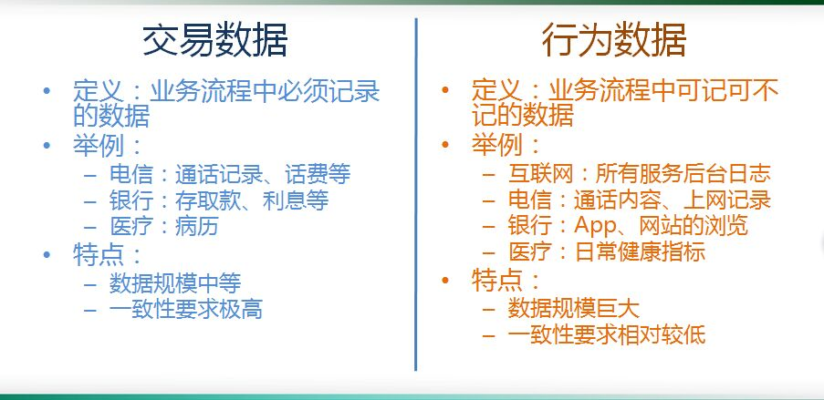
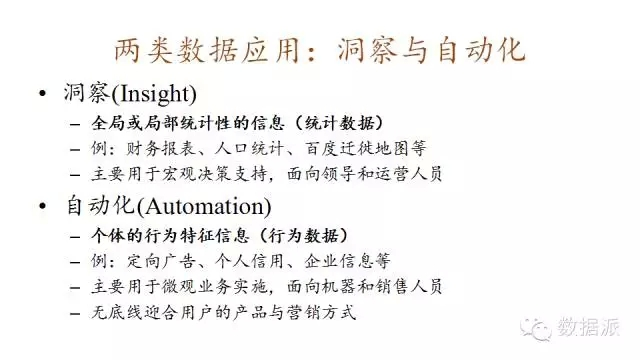
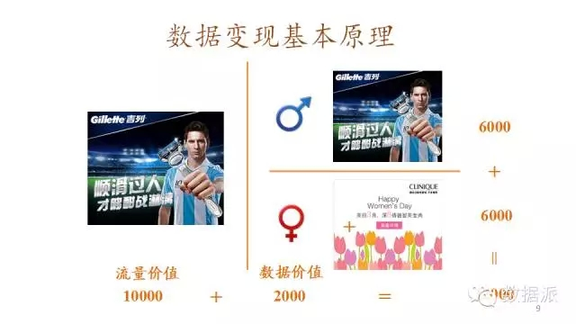
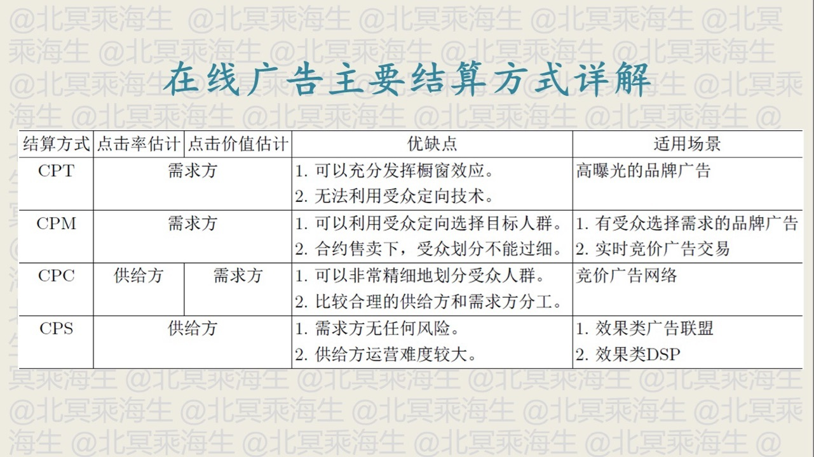
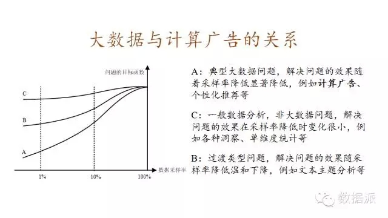

## 计算广告&大数据营销
------------------------------------------------------------

### I.大数据这门生意

#### 1. 数据的来源特点

从数据来源上来讲，最重要的是我们要区分什么是交易数据什么是行为数据

* 交易数据的特征:

	这样的交易数据有什么特点呢？有两个重要的特点，首先一致性的要求很高，银行、电信的交易数据每一条都不错，而且处理的时事性要求很高。另外一个特点，就是它的数据量并没有到达海量的程度

* 行为数据的特征:

	行为数据的数据规模巨大,一个广告公司每天处理的数量是达到100亿次。它的一致性的要求很低。另外,行为数据里的价值的密度是很低的,要求我们必须要采取低成本的方案。

* 由结构化数据转向非结构化数据

	交易数据一般可理解为结构化数据。而行为数据对应于在互联网上大量存在的文本、图像、视频和用户行为的数据,大多为非结构化数据。

企业本身的数据可以被定义为孤岛数据

	站在广告主自己的角度，仅仅的使用广告主内部的数据是远远不够的，它要维护数据，而且把数据打通在一起去描述用户的偏好。这里边就涉及到很重要的技术和产品，怎么样来做数据的交易,怎么样数据的交换？这样才能使孤岛数据成为更加有价值的数据。

采样分析的问题

	采样分析的问题，不属于大数据的问题。全量的加工才属于大数据的问题。往往采样分析的手段,其实并不能够很好的反应整体的内容。

#### 2. 大数据应用

如果说我们已经有了大规模的行为数据，建立在我们所讲的第一条的基础上，这些问题必须要通过大规模的行为的架构才能够得到解决，这是真正的大数据的问题。

> 比如说个性化推荐/计算广告/个人征信是非常典型的大数据的问题。

* 洞察应用和自动化应用

* 洞察应用

报表,就是全局和局部统计信息的获取。主要是用于宏观的决策的支持

* 自动化应用

应用本身的目的,是为了捕获个体的行为和特征,比如说定向广告。用于微观业务的实施。每个人的画像，用的就是为这个人本身的内容和定向广告的投送来服务的，所以它是用在非常微观的使用的场景里。面向的对象就不是给领导看的，而是给销售人员看的。

> 洞察天生适合的场景是给专家决策用的，自动化天生适合的场景是为数据分析师所服务的。

* 机器决策

数据从它的产生到加工到影响到决策的过程再到重新的产生这个过程是自动化的，是一个闭环，没有人在里面起作用，这样的往往比人在里边产生的价值要多得多。

> 只有给机器用的才是真正的大数据

> 大数据的使用系统的一致性的要求是低的

#### 3.大数据生意的关键点

- 第一点找到一个自动化应用，找到一个可以用机器决策的自动化应用
- 第二找到相应的行为数据来源
- 第三确定你的全量加工的技术和相应的问题

#### 4.数据变现

近些年来大家发现数据变现的能力在某种意义上还要强过流量变现的能力。数据怎么变现？大家先不要去看大数据领域讲的东西，你先好好学习学习广告，因为数据的变现、数据的交易、数据隐私保护的边界在广告领域得到了充分的研究和工业界实战。你要不了解广告，你一定是从头走一遍弯路，这个弯路是非常多的。

#### 在线广告结算

### II.大数据与广告

- DMP:Data Management Platform，即数据管理平台。

是把分散的第一和第三方数据整合到统一的技术平台里，再通过机器学习算法对这些数据进行标准化和细分管理，并把这些细分结果实时地应用于现有的互动营销环境里，帮助营销取得最大化效果。

http://www.cctime.com/html/2016-8-8/1204143.htm

- [DSP-Demand Side Platform](http://baike.baidu.com/link?url=gAJ4qVU5r8JoY6onyYJkwUX5JdN6Tu8IaiXTcxBg3PFKVXzL83LI6VFOV9xsgb6G4QLACMjI313jnL0vB8NJ8q)

- PMP(PrivateMarketPlace, 私有交易市场)

- PDB(ProgrammaticDirectBuy，私有程序化购买）

基于竞价机制和精准人群定向这两个核心功能,在线广告分化出了广告网络(ad Network,ADN)这种新的市场形态。它批量地运营媒体的广告位资源,按照人群或上下 文标签售卖给需求方,并用竞价的方式决定流量分配。

- 信息流广告分拣

#### 1.在线广告产品相关

#### 1.1.在线广告产品概览

#### 1.2.合约广告

#### 1.3.搜索与竞价广告

#### 1.4.程序化交易广告

#### 1.5.移动互联与原生广告

#### 1.6.在线广告产品实践

#### 2.计算广告关键技术

计算广告也是一个典型的个性化系统+搜索系统。

一般都采用检索(retrieval)加排序(ranking)这样类搜索的系统架构.计算广告是根据个体用户信息投送个性化内容的典型系统之一.

一般的个性化系统由四个主体部分构成:用于实时响应请求，完成决 策的在线投放(online serving)引擎;离线的分布式计算(distributed computing)数据 处理平台;用于在线实时反馈的流计算(stream computing)平台;连接和转运以上三部 分数据流的数据高速公路(data highway=ETL).

#### 2.1.计算广告技术概览

#### 2.2.基础知识准备

1. 信息检索(Information Retrieval，IR)

- 倒排索引
- 向量空间模型-Vector Space Model(文档相似度度量方法)
	
	TF-IDF(Term Frequency-Inverse DocumentFrequency，词频–倒数文档频率)

2. 最优化(Optimization)

- 拉格朗日法与凸优化
- 下降单纯形法
- 梯度下降法(gradient descent)
- 拟牛顿法

	梯度下降法、牛顿法和拟牛顿法都属于线搜索方法，它们的共同特点是，在当前迭代 点 xk 处寻找下一个迭代点 xk+1 时，首先确定一个下降方向，然后沿着这个下降方向进行一 维线搜索。

- Trust-Region法

	每次迭代时，将搜索范围限制在 xk 的一个置信域内，然后同时决定下次迭 代的方向和步长;如果当前置信域内找不到可行解，则缩小置信域范围。

3. 机器学习(Machine Learning，ML)

- 最大熵与指数族分布
- 混合模型和EM算法
- 贝叶斯学习

#### 2.3.合约广告核心技术

#### 2.4.受众定向核心技术

1.用户标签定向

人口属性定向、行为定向属于t(u)的定向方式;

2.上下文标签定向

地域定向、频道定向和上下文定向属于t(c)的定向方式

- 半在线抓取系统
- 文本主题挖掘

3.定制化标签

重定向和新客推荐(look-alike)则是t(a， u)的定向方式

#### 2.5.竞价广告核心技术

#### 2.6.程序化交易核心技术

#### 2.7.其他广告相关技术

