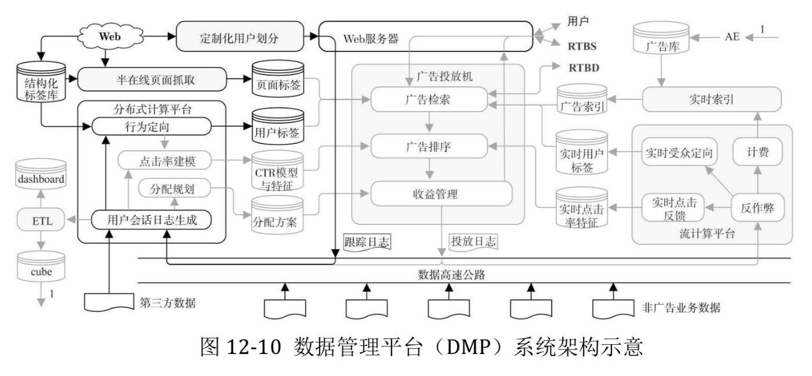
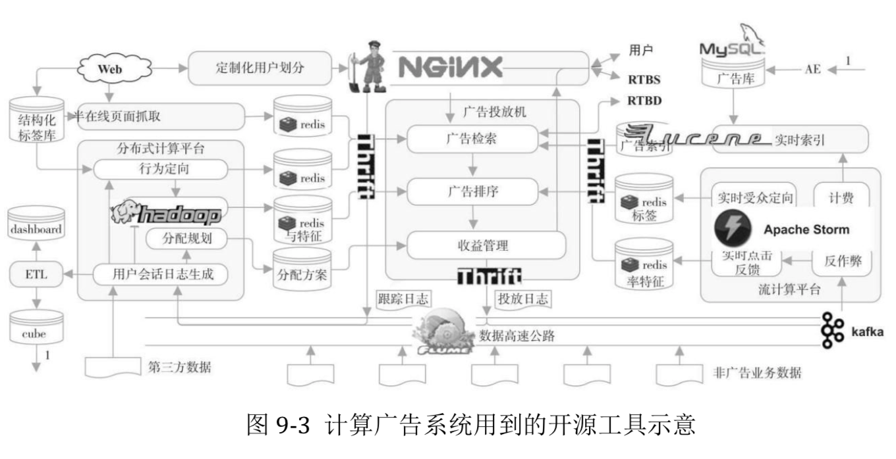

## 计算广告营销技术应用
------------------------------------------------------------

### 1.互联网广告变现

从广告和泛广告变现的角度来看，在互联网市场上主要有三种资产能够变成钱，分别是数据、流量和品牌属性。后两项是媒体的专属，而第一项既可能来自于媒体，也可能来自于第三方的数据拥有者

点击率与转化率

#### 媒体与广告主营销决策

- [广告主营销决策](_includes/adv_owner_target.png)
- [媒体营销决策](_includes/media_target.png)
- [数据提供方决策](_includes/data_owner_target.png)

### 2.大数据与计算广告

- RTB:Real Time Bidding (实时竞价)

定义：是一种利用第三方技术在数以百万计的网站或移动应用上针对每一个用户展示行为进行评估以及出价的竞价技术。

- DSP:Demand-Side Platform (需求方平台)

定义:需求方平台允许广告客户和广告机构更方便地访问，以及更有效地购买广告库存，因为该平台汇集了各种广告交易平台，广告网络，供应方平台，甚至媒体的库存。有了这一平台，就不需要再出现另一个繁琐的购买步骤——购买请求。

	comments:The Trade Desk主要为广告代理商服务，是一家致力于广告程序化购买的的需求方平台（DSP）

- SSP:Supply-Side Platform (供应方平台)

定义:供应方平台能够让媒体主也介入广告交易，从而使它们的库存广告可用。通过这一平台，媒体主希望他们的库存广告可以获得最高的有效每千次展示费用，而不必以低价销售出去。

- DMP:Data-Management Platform (数据管理平台)

定义:是把分散的第一和第三方数据整合到统一的技术平台里，再通过机器学习算法对这些数据进行标准化和细分管理，并把这些细分结果实时地应用于现有的互动营销环境里，帮助营销取得最大化效果。

用于CPM广告投放.CPM获得这些人口属性或兴趣标签需要应用DMP数据管理和受众定向的平台

- DataExchange (数据交易平台)

- PDB:ProgrammaticDirectBuy (程序化购买市场-私有程序化购买）

基于竞价机制和精准人群定向这两个核心功能,在线广告分化出了广告网络(ad Network,ADN)这种新的市场形态。它批量地运营媒体的广告位资源,按照人群或上下 文标签售卖给需求方,并用竞价的方式决定流量分配。

- PMP:PrivateMarketPlace (私有交易市场)

- 信息流广告投放

#### 1.在线广告产品相关

#### 1.1.在线广告产品概览

#### 1.2.合约广告

#### 1.3.搜索与竞价广告

#### 1.4.程序化交易广告

#### 1.5.移动互联与原生广告

#### 1.6.在线广告产品实践

#### 2.在线广告结算方式

* CPT:Cost Per Target
* CPM:Cost Per Mille
	
	千人成本(CPM广告)是一种媒体或媒体排期表(SCHEDULING)送达1000人或"家庭"的成本计算单位.

* CPC:Cost Per Click
* CPA:Cost Per Action
* CPS:Cost Per Sale

#### 3.数据是核心

有哪些数据是对精准广告业务有直接贡献的

1.用户标识 - 用户特征库的建立

起关键作用的还是用户近期内的行为

2.用户行为 - 用户行为库

决策行为主要包括转化和预转化

3.人口属性

4.地理属性

5.社交关系 - 知识图谱

有两条基本的规律:首先，随着用户主动意图的提升，相应的行为数据信息价值也随之增大;其次，越接近转化的行为，对效果广 告的精准指导作用越强。

6.DMP数据管理平台

7.DataExchange数据交易平台

#### 4.计算广告关键技术

计算广告也是一个典型的个性化系统+搜索系统。

一般都采用检索(retrieval)加排序(ranking)这样类搜索的系统架构.计算广告是根据个体用户信息投送个性化内容的典型系统之一.

一般的个性化系统由四个主体部分构成:

	* 用于实时响应请求，完成决 策的在线投放(online serving)引擎;
	* 离线的分布式计算(distributed computing)数据 处理平台;
	* 用于在线实时反馈的流计算(stream computing)平台;
	* 连接和转运以上三部 分数据流的数据高速公路(data highway=ETL).

#### 4.1.计算广告技术概览

#### 4.2.基础知识准备

1. 信息检索(Information Retrieval，IR)

- 倒排索引
- 向量空间模型-Vector Space Model(文档相似度度量方法)
	
	TF-IDF(Term Frequency-Inverse DocumentFrequency，词频–倒数文档频率)

- 文本特征向量

2. 最优化(Optimization)

- 拉格朗日法与凸优化
- 下降单纯形法
- 梯度下降法(gradient descent)
- 拟牛顿法

	梯度下降法、牛顿法和拟牛顿法都属于线搜索方法，它们的共同特点是，在当前迭代 点 xk 处寻找下一个迭代点 xk+1 时，首先确定一个下降方向，然后沿着这个下降方向进行一 维线搜索。

- Trust-Region法

	每次迭代时，将搜索范围限制在 xk 的一个置信域内，然后同时决定下次迭 代的方向和步长;如果当前置信域内找不到可行解，则缩小置信域范围。

3. 机器学习(Machine Learning，ML)

- 最大熵(Maximum Entropy)与指数族分布
- 混合模型(mixture model)和最大期望EM算法
- 贝叶斯学习

常见的混合模型，如高斯混合模型(Mixture of Gaussians，MoG)和概率潜在语义索引(Probabilistic Latent Semantic Index，PLSI)，可以认为后者是建立在多项式分布基础上的混合模型，在文本主题分析中 有着广泛的应用。

#### 5.合约广告核心技术

合约广告的关键特征是广告投放的价格和量由双方协商约定。

展示量合约广告的投送系统称为担保式投送系统。它依赖于受众定向、流量预测、点击率预测这三 项基本技术，并采用在线分配的方式完成实时决策。

流量预测与在线分配

#### 6.受众定向核心技术(广告数据产品关键技术)

受众定向技术是对广告(a)、用户(u)、上下文(c)这三个维度提取有意义的特征(这些特征也称为标签)的过程。

行为定向是根据用户历史上的网络访问行为对用户打标签的过程。
	1. 用户标签定向
	人口属性定向、行为定向属于t(u)的定向方式;

	2. 上下文标签定向
	地域定向、频道定向和上下文定向属于t(c)的定向方式

		- 半在线抓取系统
		- 文本主题挖掘

	3. 定制化标签
	重定向和新客推荐(look-alike)则是t(a,u)的定向方式

##### 文本主题挖掘

##### 行为定向

行为定向建模
行为定向特征生成
行为定向决策过程
行为定向评测

行为定向采用reach/CTR曲线进行半定量的评价.

##### 用户特征属性预测

- 最大后验概率
- 支持向量机(Support Vector Machine，SVM)
- AdaBoost
- XgBoost

#### 7.竞价广告核心技术(需研究)

搜索广告和广告网络是两种最典型的竞价广告产品

核心是广告检索和eCPM估计技术

如何根据广告的业务要求设计更高效的索引和检索技术是竞价广告系统要解决的关键问题。

竞价广告两个最关键的计算问题:广告检索和广告排序

搜索广告

广告网络

广告检索

点击率预测

#### 8.程序化交易核心技术(需研究)

广告交易平台

定制化用户标签

	要将访问广告主网站的某特定用户集合传送给DSP

look-alike建模

点击价值估计

供给方平台-The Trade Desk

#### 9.其他广告相关技术

创意优化

	程序化创意
	点击热力图

实验框架

	无论是广告系统调整算法、架构，还是投放时调整创意、定向策略，都需要依赖线上的实际流量测试来确定其真实效果如何。

流量保护和效果监测

	反作弊
	广告监测

隐私保护和数据安全

	隐私问题讨论的是用户个人信息的安全性
	隐私保护基本原则
	- 要严格避免使用个人可辨识信息(Personal Identifiable Information，PII)
	- 用户有权要求系统停止跟踪和使用自己的行为数据
	- 不应长期保留和使用用户行为数据。长期保留用户行为对受众定向价值有限，同时 又加大了数据泄露的风险
	- 工程上还需要特别注意权限的严格分配和最小数据访问的原则
	- Quasi-Identifier 与 K-Anonymity(稀疏行为数据给隐私保护带来的巨大风险)

程序化交易中的数据安全
