## 大数据研究-底层架构
-----------------------------------------------------------

导读：One size does not fit all！ 数据处理平台已不集中于传统关系型数据库，各种其他平台层出不穷，也各有其适用范围。

过去的十多年，我们采用不同的方式去探寻这个世界。采用不同理念的一小众开源项目，它们不断成长，你中有我，我中有你。平台集成了这些工具，每个控件通常都能提高某些基础硬件或者系统效能。结果是平台无法通过任何单一的工具解决某些问题，不是太过笨重，就是局限于某一特定部分。
因此当今数据平台多种多样，从简单的缓存层、多语言持久化层到整个集成数据管道，针对多种特定需求的多种解决方案。在某些方面，确实有不错的表现。
因此本对话的目的就是解释一些流行的方式方法如何发挥作用，为什么会有如此表现。我们先来考虑组成它们的基本元素，这样便于在后续的讨论中对这些认识通盘地考虑。

### I.数据的位置

----------------------------------------------------------------

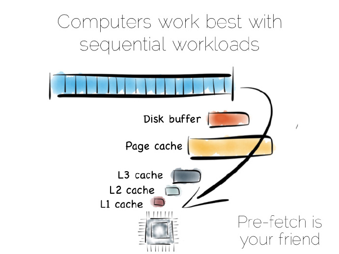

从某种抽象的角度看，当我们处理数据时，实际上就是对其进行局部性(locality)处理，局部性到CPU、局部性到我们需要的其它数据。有序地获取数据是其中很重要的部分，计算机很擅长序列化的操作，这些操作是可以预测的。

	译者注：
	局部性是计算机中一种预测行为，通过缓存、内存中预取指令、处理器管道分支预测等技术来提高性能；更多参见《操作系统精髓与设计原理》

* 随机数据寻址:一种是在数据原地进行更新操作，这样我们就有了随机IO操作
* 顺序数据读取:一种是把更新都放到文件末尾，然后需要读取更新数据的时候进行替换。

若是有序地从硬盘中获取数据，数据会预获取存入硬盘缓存、页缓存、以及不同层级的CPU缓存中，这可以极大地提升性能。但这对随机数据寻址意义不大，这些数据存于主内存、硬盘或者网络中。实际上，预获取反倒会拉低随机负载能力：不论是各种缓存或是前端总线，充满了不太会被用到的数据。

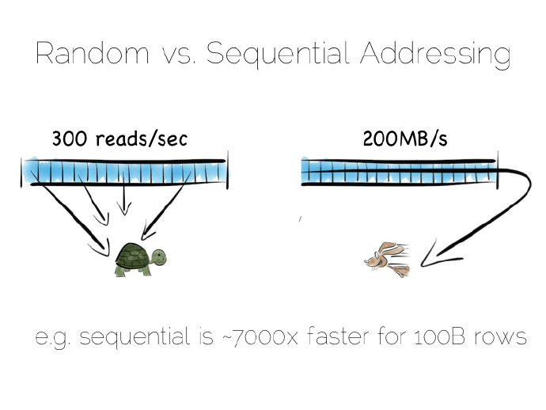

硬盘通常被认为性能稍低，而主内存稍快些。这种认识不见得一直是对的，随机和有序主内存负载之间相差一两个数量级。用某种语言管理内存，事情往往会变得更加糟糕。

从硬盘有序获取的数据流性能确实好过随机寻址主内存(Kafka设计思路)，或许硬盘并不像我们想的那样跟乌龟似的，至少在有序获取的情况不会很慢。固态盘(SSD),特别是采用PCIe接口，正如它们显示不同的权衡，将事情复杂化。但采用这两种获取模式带来的缓存收益是不变的。

	Tips：
	数据流就是大量连续到达的、潜在无限的有序数据序列，这些数据按顺序存取并被读取一次或有限次。
	假设我们要创建一个简单的数据库，首先从基础部分文件开始。

保持有序读和写，文件在硬件上会表现地很好。我们可以将写入的数据放入文件的末尾，可以通过扫面整个文件进行数据读取。任何我们希望的处理过程可以随着数据流穿过CPU而成真，比如过滤，聚合、甚至做一些更复杂的操作，总之非常完美。

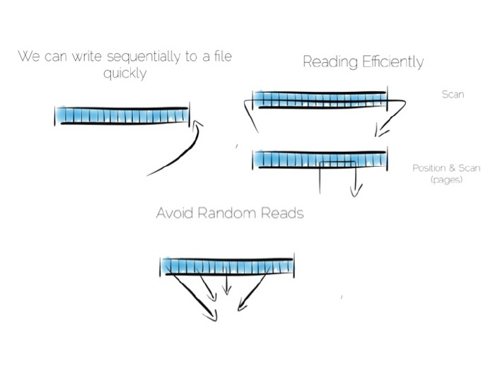

倘如数据发生诸如更新这样的变化会怎样？

我们有多个选择，在某个位置更新这个值。我们需要利用固定长度的字段，在我们浅显的思想实验中这是没有问题的。不过在某个位置更新数据意味着随机输入输出流(IO)，这会影响性能。

替代的办法是将更新值放置在文件的末尾，在读取值时对过期的数据进行处理。

我们第一次做出权衡，将“日记”或者“日志”放在文件末尾，就能保证有序获取进而提高性能。另外倘若某处需要更新数据，可以实现每秒300次左右的读取，前提是更新数据刷入底层介质中。

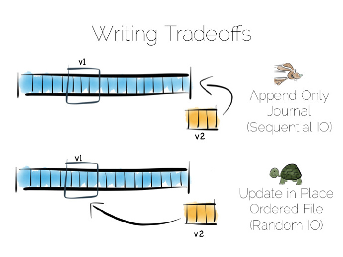

实际上完整的读取文件是很慢的,获取十亿字节(GB)数据,最好的硬盘也需要花费数秒,例如数据库全表扫描所花费的时间。

我们时常只需要一些特定的数据，比如名为“bob”的客户，这时扫描整个文件就不妥当，我们需要一个索引。

#### 1.1.Index索引

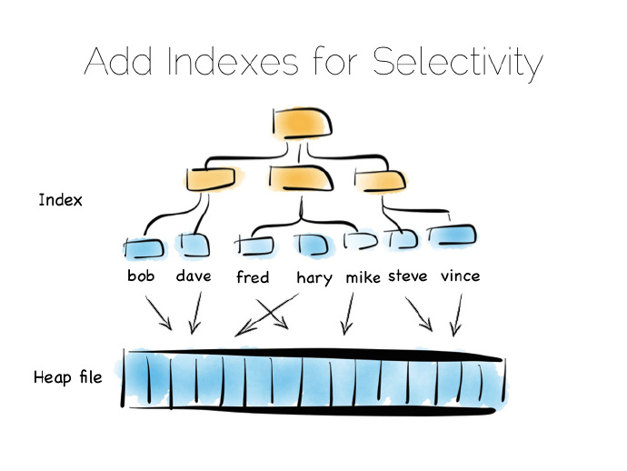

我们可用许多不同类型的索引，最简单的一种是固定长度的有序数组，比如本例中的客户名，和对应的offset偏移量一起存放在一个heap-file堆文件中。有序数组可以进行二进制搜索查找。同样，我们可以用BTree树结构、位图索引、Hash哈希索引、字典索引等。这里是一个树的结构图。
索引就像是在数据中添加了一个总览结构，值是有序排放的，这样我们就能快速获取我们想要读取的数据。但总览结构有个问题，数据进来时需要随机写。因此理想的、写优化仅仅追加文件；考虑到写会打散文件系统，这会使一切变慢。

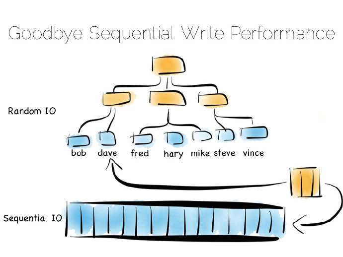

如果你将许多索引放入一个数据库表中，那你一定熟悉这个问题。假定我们使用的机械盘，用这种方式维护某个索引的硬盘完整性，速度大约慢1000倍。

幸运的是，这里有几种解决方案。这里我们讨论三种，它们都是一些极端地例子。在现实世界中，远没有这么复杂，但在考虑海量存储时这些概念会特别有用。

#### 解决Index随机写入方法

* 第一种内存映射文件
* 第二种较小的索引的集合,采用Meta索引或者布隆过滤算法(Bloom Filter)做一些优化
* 第三种简单匹配算法(brute force)又叫面向列(Column Oriented)

##### A.第一种方案是将索引放入主内存，随机写问题分隔到随机存储存储器(RAM)，堆文件依旧在硬盘中。

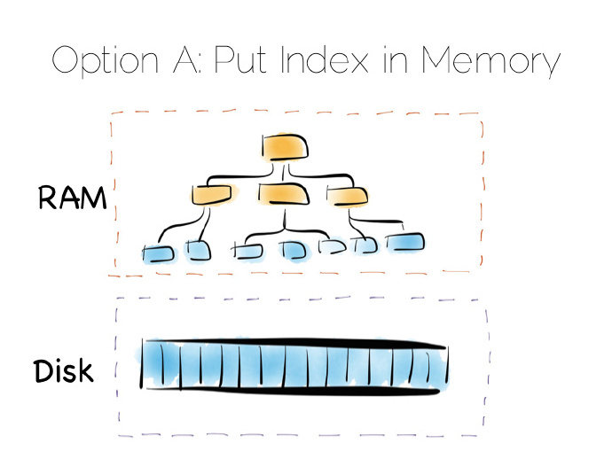
	
这是一种简单但行之有效的方案，可以解决我们随机写的问题。这种方式在许多数据库中已得到应用，比如MongoDB、Cassandra、Riak、以及其他采用此优化类型的数据库，它们常常用到内存映射文件。

	Tips：
	内存映射文件是虚拟内存单个分段，可以与文件或者类文件资源的某部分建立直接字节对字节的关联，即文件中的数据存放位置在内存中有对应的地址空间，这时对文件的读写可以直接用指针来做，而不需要read/write函数，处理大文件时可以显著提高输入输出流(IO)性能。

倘若数据量远超主内存，这种策略就失效了。特别是**存在大量小的对象时，问题特别显眼**；索引增长很大，最后存储越过了可用主内存的容量。多数情况下，这样做是没有问题的，但如果存在海量数据，这样做就会成为一种负担。

##### B.一种流行的方式抛开单个的“总览”索引，转而采用相对较小的索引集合。

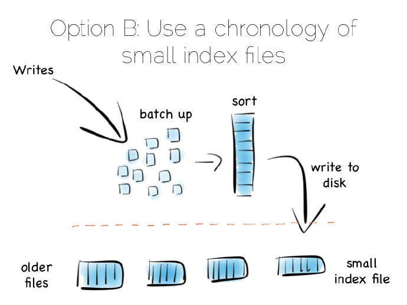

这是一个简单的理念：数据进来，我们批量地将其写入主内存。一旦内存数据足够多，比如达到MB，我们就对它们进行排序，而后将它们作为单个小的索引写入硬盘中。最后得到的是一个小的、由不变索引文件组成的年表。

那么这样做的好处是？这些不变的文件集合被有序地流化处理，这样就能快速地写，最重要的是无需将整个索引加载入内存中。真棒！

	Tips: 使用顺序写入磁盘策略

当然它也有一个缺点，当读操作时需要询问非常多的小索引。我们将随机IO(RandomIO)写问题变为读问题。不过这确实一个很好的权衡策略，而且随机读比随机写更容易优化。

存储一个小的元索引(meta-index)在内存中或者采用布隆过滤算法(Bloom Filter)，提供一种低内存方式,评估单个索引文件在读操作中是否需要被询问。即使保持快速地、有序化写操作，这种方式的读操作性能几乎可以和单个总览索引相媲美。

实际开发中，偶尔也需要清理孤子更新，但它有序读和写确实不错。

#### 1.2.Log Structured Merge Tree

我们创建的这个结构称作日志结构合并树(Log Structured Merge Tree),这种存储方式源于谷歌的BigTable paper,在大数据工具中应用较大。如Hbase、Cassandra、OceanBase等，它能用相对较小的内存开销平衡写、读性能。

将索引存储在内存中，或者利用诸如日志结构合并树(Log Structured Merge Tree)这样的写优化索引结构，绕开“随机写惩罚”(random-write penalty)。

#### 1.3.Columar列式存储或面向列存储

回到开始的文件例子，完整地读取它。如何处理文件中的数据，可以有许多选择。

这是第三种方案为纯粹的简单匹配算法(Pure brute force)。通过列而非行来存储数据,这种方法叫做面向列存储。

	Tips:
	BruteForce为普通模式匹配算法。BF算法的思想就是将目标串S的第一个字符与模式串T的第一个字符进行匹配，若相等，则继续比较S的第二个字符和T的第二个字符；若不相等，则比较S的第二个字符和T的第一个字符，依次比较下去，直到得出最后的匹配结果。

需要注意的是真实的列存储[1]及其遵循的大表模式[2](Big Table pattern)之间存在一种不好的命名术语冲突。尽管它们有一些相似的地方，事实上它们是不同的，所以将它们视为不同的事情是一件明智的。

	Tips:
	Hbase中的列簇存储是遵循的大表模式(Big Table pattern),不是真正意义的列式存储

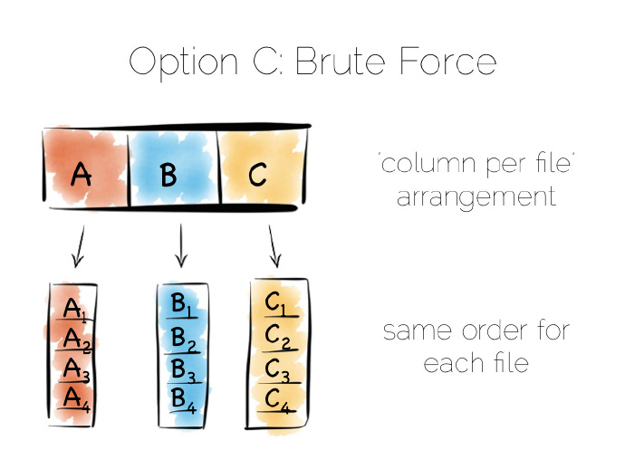

面向列是一种简单的理念,和行存储数据不同,通过列分割每一行，将数据追加到单个文件末尾。接着在每个单独的文件中存储每一列，一旦需要只需读取需要的列。

这样可以确保文件的含有相同的序列，即每个列文件的第N行含有相同的addr地址或者offset偏移量。这个很重要，在某一时刻读取多列，来服务一个单一的查询。意味着“连接(joining)”列速度飞快，倘若所有的列含有相同的序列，我们就能在一个紧凑的循环中这么做，此循环有很好缓存和CPU利用率。许多实现大量使用向量(vectorisation)进一步优化简单连接和过滤操作吞吐量。

写操作可以提高只在文件末尾追加(being append-only)性能。不利的地方是很多文件需要更新时，文件的每个列需要单独写入数据库。最常见的解决方案是采用类似日志结构合并(LSM)方式，进行批量化的写操作。许多列类型的数据库通过给表添加一个完整的序列来提升读的性能。

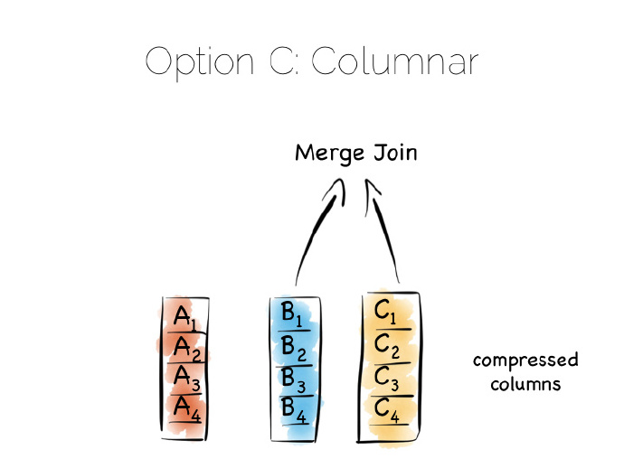

通过列分割数据可以极大地减少从硬盘中读取的数据量，只要查询操作在所有的列的子集中。

除此之外，单独列中的数据通常可以很好的压缩。可以利用列数据类型优势去压缩,特别是在我们熟悉列的数据类型时。这意味着我们能利用有效的、低成本的编码方式，比如行程长度编码、delta、位组合(bit-packed)等。对一些编码来说，谓词可以直接用来做压缩流。

一种简单匹配算法(brute force)特别适合大规模扫描操作，诸如平均值、最大值、最小值、分组等聚类函数就是这方面的典型。

这和先前提到的“堆文件和索引(heap file & index)”方式不同，很好的理解这一点可以问自己，诸如此类的列方式和每一个字段带有索引的“堆和索引”方式有什么不同？

	列式存储天然的保持了一列中数据的顺序性，方便两列数据进行关联。
	而heap-file index结构关联时候，一份数据可以按顺序读取，则另一份数据就会有随机读取了。

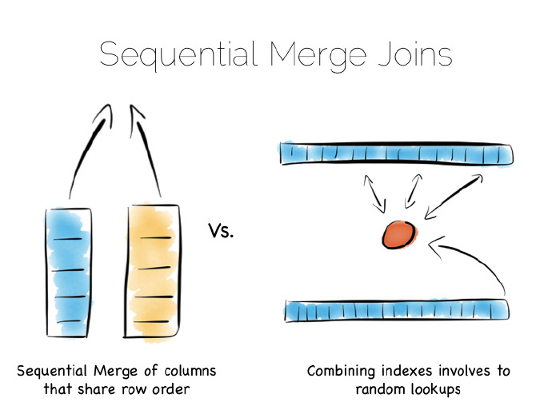

典型优势总结：

	- 列式压缩，低IO
	- 列中每行数据保持顺序，可以按照行id进行关联合并
	- 压缩后的数据依然可以进行预取
	- 数据延迟序列化

问题的关键是索引文件序列：多路查找树(Btree)等会依据检索的字段排序，两次检索的数据连接一端涉及流操作，另一端第二个索引位置进行检索随机读取。平衡树总体上说效率低于包含两个相同序列索引列连接，我们再一次提高了序列化访问。
	
	Tips：
	结论是平衡树连接性能不如两个相同序列索引列连接

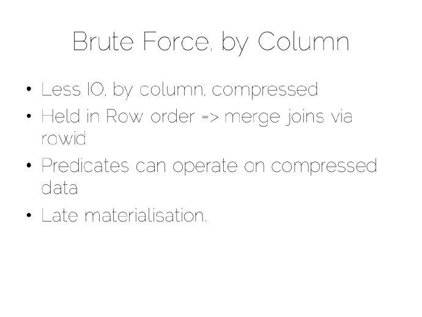

#### 1.4.应用场景分析

我们都想将最好的技术作为数据平台控件，提升其中的某种核心功能，胜任一组特定的负载。

- 1. 内存映射文件

将索引存于内存而非heap-file结构为很多非关系型数据库(NoSQL)所喜爱，比如Riak、Couchbase或者Mongodb，甚至一些关系型数据库，这种简单的模型效果不错。

- 2. LSM方式

设计用来处理海量数据集的工具是大多采用LSM方式，这样可以快速获取数据，得到基于硬盘结构 读一样好的性能。HBase、Cassandra、RocksDB、 LevelDB 甚至MongoDB新版本现在也支持这种方式。

- 3. 列式存储

列存储(Column-per-file)引擎常用于MPP数据库(大规模并行处理数据库)，比如Redshift/Vertica/Greenplum，以及Hadoop stack中的Parquet。这些数据引擎最大的问题是需要大的遍历(大表扫描)。数据聚合类操作(最大最小值)是此方案最重要的用途。

- 4. 顺序IO读写

诸如Kafka采用一个简单的、基于硬件的高效消息规范。消息可以简单地追加到文件的末尾，或者从预定的offset偏移量处读取。可以从某个偏移量读取消息，来来回回，你可以从上次结束的偏移量处读取。是很高效的顺序IO读写方式。

- 5. 常规消息队列

这和多数面向消息的中间件不同，JMS(Java消息服务)和AMQP(高级消息队列协议)说明文档需要额外的索引，来管理选择器和session会话消息。这意味着它们结束某个行为的方式更像数据库，而非某个文件。著名的论述是1995年Jim Gray发表的队列就是数据库(Queue’s are Databases).

可见所有的方式都需要这样那样的权衡，作为一种分布式手段，使事情变得简单、硬件更加用户友好。

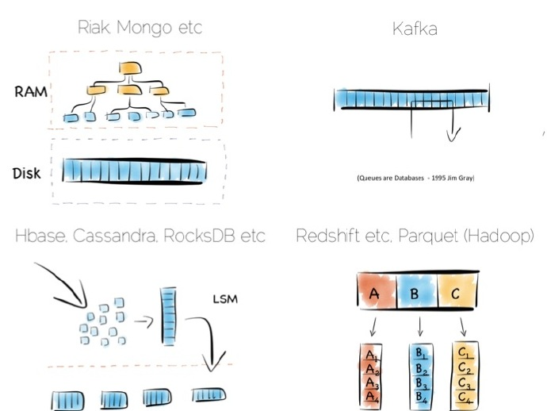

#### 1.5.GFS&HDFS文件系统相关(类似LSM方式)

#### A.GFS

一个GFS集群由一个master和多个chunkserver组成，可以被多个client访问

文件被划分成固定大小的chunk。每个chunk是由chunk创建时由master分配的一个不可变的全局唯一的64bit句柄来标识。

Master维护所有的文件系统元数据。包括名字空间，访问控制信息，文件与chunk的映射信息，chunk的当前位置。

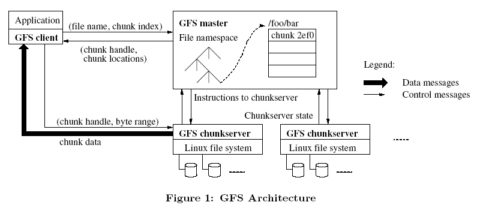

**Master**

通过让master状态很小以及在其他机器上进行备份来解决容错。当前通过影子master机制提供可扩展性和可用性。对于master状态的更新，通过append到write-ahead日志里进行持久化。因此我们可以通过类似于Harp里的主copy模式来提供一个比我们当前模式具有更强一致性的高可用性。

**Chunk大小**

Chunk大小是一个关键的设计参数。我们选择了64mb，远远大于现有的文件系统块。每个chunk的副本作为普通的linux文件存储在chunkserver上，如果需要才会进行扩展。Lazy空间分配避免了内部碎片造成的空间浪费，很可能最大的碎片有向一个chunk那么大。

首先，降低了client与sever的交互需求，因为在相同chunk上的读写只需要一个初始化请求就可以从master得到chunk的位置信息。这个减少对于我们的应用负载是非常明显的，因为我们应用大部分需要**顺序读写**整个大文件。

**数据变更**

文件append优化

数据变更可能是写或者记录append。写操作会使数据在应用程序指定的偏移位置写入。记录append操作会使数据原子性的append，如果是并发性的话则至少会被append一次，但是偏移位置是由GFS决定的(然而，通常的理解可能是在客户端想写入的那个文件的尾部)

**元数据**

Master存储了三个主要类型的元数据：文件和chunk名字空间，文件到chunk的映射信息，每个chunk的备份的位置。

_内存数据结构_

_chunk location_

_操作日志Logger(WAL)_

操作日志包含了关键元数据改变的历史记录.它不仅是元数据的唯一一致性记录，而且它也定义了那些并发操作的逻辑上的时间表。文件和chunk的版本都是唯一和永恒地由它们创建时的逻辑时间来标识的。

_Snapshot快照_

**一致性模型**

GFS 使用租约机制来保障在跨多个副本的数据写入中保持顺序一致性。 
GFS Master 将 chunk 租约发放给其中一个副本，这个副本我们就称为主副本，其他副本称为次副本。 
由主副本来确定一个针对该 chunk 的写入顺序，次副本则遵守这个顺序，这样就保障了全局顺序一致性。 
chunk 租约机制的设计主要是为了减轻 Master 的负担，由主副本所在的 chunkserver 来承担流水线顺序的安排。

_GFS数据流和控制流分离方法_

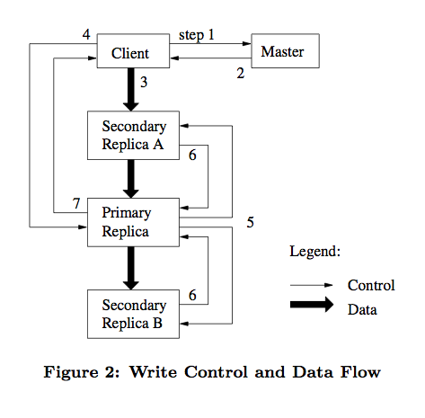

GFS 中采用数据流和控制流分离的方法，从而能够基于网络拓扑结构更好地调度数据流的传输。
一旦所有的副本确认收到了数据，客户端将发送一个写请求控制命令到主副本。 
由主副本分配连续的序列号来确定最终的写入顺序。
主副本转发写请求到所有次副本，次副本按主副本安排的顺序执行写入操作。
次副本写完后向主副本应答确认操作完成。
最后主副本应答客户端，若任意副本写入过程中出现错误，将报告给客户端，由客户端发起重试。

	Tip:xDB数据库分布式存储设计类似于GFS架构

#### B.HDFS

一种允许文件通过网络在多台主机上分享的文件系统,可让多机器上的多用户分享文件和存储空间.

1. HDFS的数据存储

HDFS内存存储策略: LAZY_PERSIST则直接将内存作为数据存放的载体

2. HDFS异构存储

异构存储可以根据各个存储介质读写特性的不同发挥各自的优势。

针对冷数据，采用容量大的 、 读写性能不高的存储介 质存储，比如最普通的磁盘。 而对于热数据而言，可以采用 SSD 的方式进行存储，这样就 能保证高效的读性能，在速率上甚至能做到十倍或百倍于普通磁盘的读写速度。

	- RAM_DISK
	- SSD
	- DISK
	- ARCHIVE

3. HDFS缓存机制

CacheBlock

4. Snapshot

对于大多不变的数据，所看到的数据其实是当前物理路径所指的内容，而发生变更的 INode数据才会被快照额外拷贝，也就是前面所说的差异拷贝。

	1.HDFS中只为每个快照保存相对当时快照时间点发生过变更的INode信息,只是‘存不同’
	2.获取快照信息时,根据快照Id和当前没发生过变更的INode信息,进行对应恢复。
	3.生成SnapshotDiffInfo对象,包含了源,目标快照间发生变更的文件目录信息
	4.获取SnapshotDiffInfo的报告

5. HDFSNFSGateway

#### C.HDFS&GFS设计差异

HDFS 参照了它所以大部分架构设计概念是类似的，比如 HDFS NameNode 相当于 GFS Master，HDFS DataNode 相当于 GFS chunkserver。

_写入模型_

	- HDFS 在考虑写入模型时做了一个简化，就是同一时刻只允许一个写入者或append追加。在这个模型下同一个文件同一个时刻只允许一个客户端写入或追加。 
	- GFS 则允许同一时刻多个客户端并发写入或追加同一文件。

	Tips:允许并发写入带来了更复杂的一致性问题

_写入流程_

GFS 和 HDFS 的写入流程都采用了流水线方式，但 HDFS 没有分离数据流和控制流。 

	- HDFS 的数据流水线写入在网络上的传输顺序与最终写入文件的顺序一致。 
	- 而 GFS 数据在网络上的传输顺序与最终写入文件的顺序可能不一致。 GFS 在支持并发写入和优化网络数据传输方面做出了最佳的折衷。

_Snapshot快照_

	- GFS中的快照功能(copy-on-write)支持非常快的对文件或者目录进行拷贝
	- HDFS Snapshots: read-only point-in-time copies of the file system. 
	snapshot对此数据进行不完全拷贝,这里遵循一原则,对于大多不变的数据,你所看到的数据其实是当前物理路径所指的内容,而发生变更的INode才是会被snapshot额外拷贝,其实是一个差异拷贝.

_append记录追加操作_

	- GFS提供了一个相对宽松的一致性模型。GFS同时支持写和记录追加操作。写操作使得我们可以随机写文件。记录追加操作使得并行操作更加安全可靠。
	- HDFS对于写操作的数据流和GFS的功能一样。但是，HDFS并不支持记录追加和并行写操作。

_垃圾回收GC_

	- GFS垃圾回收采用惰性回收策略，即master并不会立即回收程序所删除的文件资源。GFS选择以一种特定的形式标记删除文件
	- HDFS直接使用JVM垃圾回收GC策略

	Tips:CMS、Parallel、Serial GC都需要通过Full GC去压缩老年代并在这个过程中扫描整个老年代。
	G1的操作以通过将Heap划分的Region为基础，因此它适用于大Java堆。即便Java堆很大，大量的GC工作可以被限制在小型Region集合里面。G1允许用户指定停顿时间目标，G1通过自适应的堆大小来满足这个目标。

#### Summary

我们分析了存储引擎的一些核心方法，其实只是做了一些简要说明，现实世界这些是要复杂的多，不过概念确实是很有用的。
存储引擎是基于分布式文件系统之上的存储应用。
分布式数据平台不仅仅是一个存储引擎+分布式文件系统，还需要考虑分布式并行计算。

----------------------------------------------------------------

### II.Parallelism并行化(分布式并行计算)

----------------------------------------------------------------

对于横跨多台计算机的分布式数据我们需要考虑两个核心点:分区(partition)和复制(replication)。

分区有时指的是分库分表(sharding),在随机读取和暴力扫描任务-简单匹配工作负载(brute force workloads)表现不俗。

如果是基于哈希hash的分区模型，借助哈希函数，数据就能均摊到一组机器上(译者注：理想的结果是这样的)。同单机哈希表hashtable工作方式相似，只不过这里是每个桶bucket盛放在不同的机器节点。

#### 2.1.哈希hash函数读取数据(MPP)

这样通过哈希hash函数，直接访问包含此数据的机器读取来数据。

这是一种很经典的分布式模式，也是唯一一种随着客户端请求增加呈现线性分布的模式(译者注：简单点说就是均摊)。请求隔离到单台计算机上，由集群中的单台计算机为其服务。

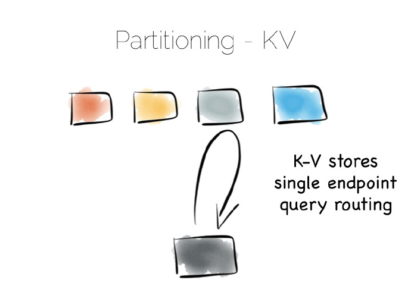

利用分区提供并行批量计算，比如聚合函数或者诸如聚众或者机器学习的复杂算法。最大的不同是所有的计算机在同一时刻采用广播的方式，在很短的时间采用分治的策略解决大规模计算问题。

#### 2.2.批处理系统

这种批处理系统在处理大型的计算问题时有不错的效果,但只能提供**有限并发**,因为执行任务时会非常消耗集群的资源。

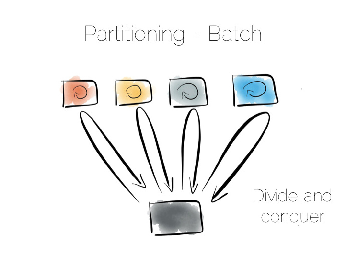

- 两个极端且特别简单的方式：一端直接hash访问,另一端分治地进行广播。

需要注意的是终端之间的中间地带,最好的例子就是非关系型数据库(NoSQL)中跨越多台计算机的二级索引。

**二级索引**有别于主键索引,不是构建在主键上的索引,这就意味着数据分区不再借助索引中的值。不再使用哈希hash函数直接分发,而是Broadcast广播请求给所有的计算机。这会制约并发，任何一个节点与每一个请求都有关。

	Tips:二级索引是借助Broadcast广播请求实现的索引,会对并发有影响

也是这个原因许多KV键值存储(数据库)不愿采用二级索引，即使它的应用很广泛，Hbase和Voldemort就是如此。不过诸如MongoDb、Cassandra、Riak等数据库采用二级索引,不管咋说二级索引还是蛮有用的。但理解它们在整个系统并发的影响还是很重要的。

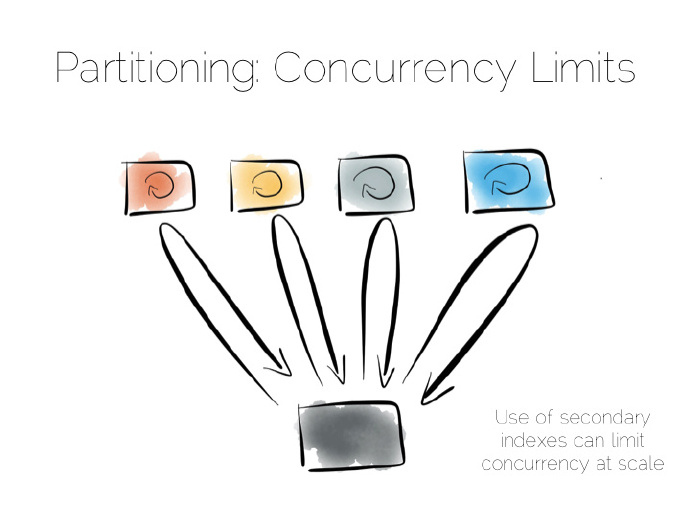

#### 2.3.数据副本replication

- 解决上述并发性瓶颈的一个途径是数据副本replication。

不论是异步到从服务器，还是复制到诸如Mongo或者Cassandra这样的NoSQL存储中。

实际上备份是透明不可见的(仅仅用于恢复)、只读(增加并发量)、或者读写(增加网络分区下的可用性)，选择哪种方式需要从系统的一致性出发做出权衡。这是CAP(Consistency、Availability、Partition-Tolerance)理论的简单应用,当然CAP理论远非我们想象中的那么简单。

	Tips:网络分区(network partitions)指某个网络设备出错导致网络分离，比如某个数据库挂掉。

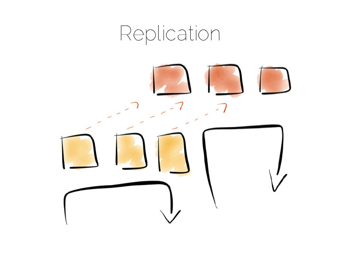

#### 2.4.数据一致性

权衡一致性给我们带来一个重要的问题，什么时候需要保证数据的一致性？

一致性的代价是昂贵，在数据库的世界里，原子性由线性化(linearisabilty)做保障，这样可以确保所有的操作有序排列.但代价也是昂贵的,实际上这完全是被禁止的，许多数据库并不将此作为一个独立(isolation)执行单元。鉴于此，很少将此设为默认值。

简而言之，你想分布式写的系统保持强一致性，系统会变慢。

注意一致性这个术语有两个应用场景，在原子性和CAP中，当然其意思是不同的。我通常采用CAP中的定义，对所有的节点而言数据在某一时刻是相同的。

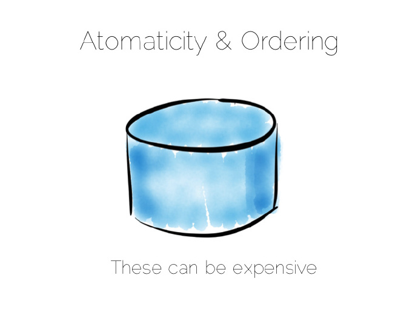

- 解决一致性问题的方法其实很简单，就是避免它。

    Tips:用最终一致性替代强一致性

如果无法避免，隔离它为其分配尽可能少的写操作和计算机资源。

避免一致性问题一般不难，特别是数据为不变的事实流时,Web日志集合就是一个很好的例子。无需关注一致性，因为这些日志作为事实是不会改变的。

需要一致性的用例，比如转账、使用优惠码这种非交换行为。

当然从传统的眼光看一些事情需要一致性，但实际上却也未必。比如一个行动从一个可变状态变成一个新的相关事实集合，就可以避免这种变化状态。通常是直接对新字段进行更新，考虑到标记一个事务存在潜在的欺诈，**我们可以简单地利用某个事实流和原始的事务进行关联**。

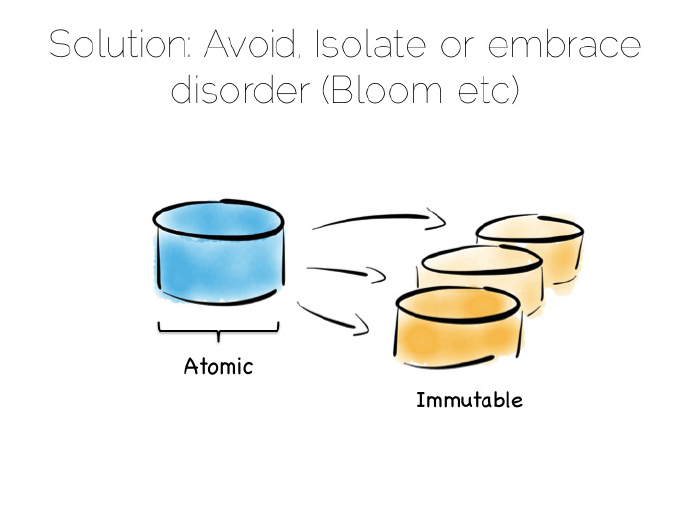

在数据平台中移除所有一致性需求、或者隔离它都是很有用的。一种隔离方式是利用单一写入策略，涉及几个方面，Datamic就是典型的例子；另一种方式是拆分可变的和非可变的来隔离一致性需求。

Consensus算法实际是在分布式系统复制数据时,追求大多数更新到一致共识状态.

诸如Bloom语言/CALM猜想扩展了这些理念，支持默认状态下的无序概念，除非需要才做排序。因此我们有必要做一些基本的权衡，那我们如何利用这些特性去建立一个数据平台？

	Tips:
	CALM conjecture
	- 一致性作为逻辑单调性
		如果你能证明系统是一个逻辑单调的，那么协调成本为零。
		什么是 "单调monotonic"?
	- 单调，通俗地说就是收放自由
		从局部信息的推论从来不会因为新信息变成失效。
		无论是关系代数和Datalog没有negation将会是单调的
	- Ameloot, et al, 2011: Relational transducers for declarative networking
		理论说明在Datalog中可以不在意网络程度情况下节点处理服务器的协调能只以单调计算
		"免费协调Coordination-free"不意味着没有通讯
	- 使用不严谨的实践词语表达
		尝试简短表达你的问题以至于达到你只需要增加新的事实到系统中即可完成问题的表达。
		当你根据目前已知的情况计算出一个新的事实，你能保证这个事实永远不会被收回吗？
		考虑特殊的“密封事实”，它被标志成一个完整的事实
		只进行增长"grow-only"的算法容易作为单调实现
		可能遭遇的权衡: 不完整读
	- Bloom 语言
		带有流程分析的Unordered编程
		能够告诉你哪里需要协调

#### 2.5.RAID IO并行读写

RAID硬件支持多个磁盘 奇偶校验 逻辑IO并行读写

- RAID5
- RAID50

----------------------------------------------------------------

### III.Architects分布式架构

----------------------------------------------------------------

分布式架构=分布式存储引擎+数据压缩算法+分布式计算引擎+资源管理

#### 3.1.命令查询职责分离架构(CQRS)

最常用的架构就是用传统关系型数据库存取数据。

一个典型的应用架构或许应该是这样的：
有一组处理将数据写入某个数据库，然后将其读出，对于许多简单的工作负载这是没有问题的，许多成功的应用都是基于此模式。但随着吞吐量的增加，此模式越来越难以适用,比如当数据吞吐量大到一定程度，就会遇到消息传递、负载均衡、扩容、并发性能降低等问题。为保持ACID特性，扩容问题尤其严峻。

在应用领域这个问题或许可以通过消息传递、演员(actors)、负载均衡加以解决。
另外一个问题是这种方式将数据库作为一个黑盒，数据库是一个透明的软件。它们提供了海量的特征，但也提供了极少的原子拆分的机制。这样做有很多好处，默认状态下是安全的；但保护过度地扼杀我们的需求进而限制系统的分布式，这就很烦人。

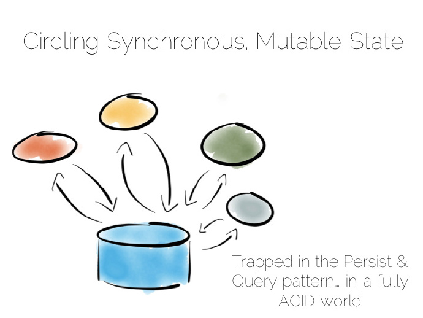

命令查询职责分离(CQRS Command Query Responsibility Segregation)架构,可以简单地解决此问题

	译注：
	1. 实现一Druid
	2. 实现二操作分析桥(Operational/Analytic Bridge)
	3. 实现三Hadoop批处理
	4. 实现四Lambda Architecture
	5. 实现五Kappa框架及流数据平台
	6. 实现六MPP并行计算

该模式从业务上分离修改(Command，增，删，改，会对系统状态进行修改)和查询(Query不会对系统状态进行修改)的行为。从而使得逻辑更加清晰，便于对不同部分进行针对性的优化。

想法其实很简单，分离读写工作负载：最佳写入状态时写入，最切贴的例子比如某个简单日志文件；最佳读取状态时读取。有多种实现方式，比如用于关系型数据库的Goldengate工具、内部复制集成的诸如MongoDB的Replica Sets这样的产品。

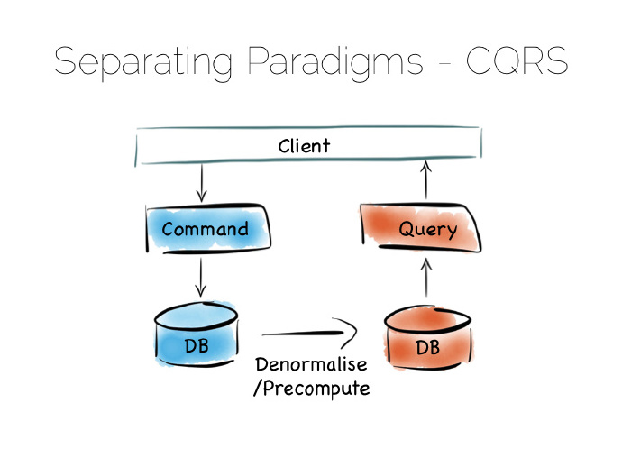

#### 3.2.架构-Druid OLAP

许多数据库底层的行为就是这样，Druid是一个不错的例子，它是一个开源的、分布式、时序化、列式分析引擎。列式存储表现不俗，特别是大规模数据录入，数据必须分散到许多文件中。为了得到更好的写性能，Druid存储近期的新数据到某个最佳写入状态中，然后逐渐转移到最佳读取存储状态。

一旦查询Druid，请求就会同时派发到最佳写和最佳读控件中，对结果进行组合(移除冗余)，返回给用户。Druid借助时间标记每条记录来进行排序。

诸如此类的组合方式提供了单个抽象下的CQRS好处。

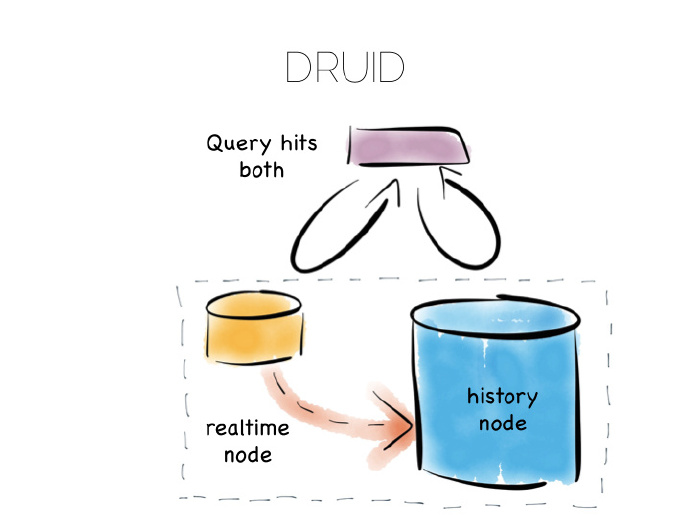

#### 3.3.架构-操作/分析桥(Operational/Analytic Bridge)

另一种相似的方式是操作分析桥(Operational/Analytic Bridge),利用单个事件流拆分最佳读以及最佳写视图。流处在一种不断变化的状态，因此异步视图可以在随后的日子里被重写和增强。

前端提供了同步读和写，这么做即可以简单快速地读取已写入的数据，又可以支持复杂的原子事务。
后端采用异步、不变状态的优势来提高性能，比如借助复制、反范式化、甚至完全不同的存储引擎扩展线下处理。前后端之间的消息桥连方便应用通过平台去监听数据流。这种模型很适合中等规模的部署，可变视图至少存在一部分、不可避免的需求。

设计不变的状态，以便容易地去支持大规模数据集和更加复杂的分析。Hadoop栈中独一无二的实现——批量管道，就是一个典型的例子。
Hadoop栈最精彩的地方就是其丛多的工具，不管是快速读写访问、还是廉价地存储、抑或批量处理、高吞吐消息、或者提取、处理、分析数据，hadoop生态体系应有尽有。

#### 3.4.架构-批处理(Hadoop)

如果我们的数据是一次写入，多次读，不在改变的场景，上面可以部署各种复杂的分析型应用。采取批处理模式的hadoop无疑是这种平台最广用和出色的代表了。

Hadoop平台提供快速的读写访问，廉价的存储，批处理流程，高吞吐信息流，和其他抽取、分析、处理数据的工具。

批处理平台可以主动拉取Pull或者被推进Push来多种数据源的数据，将其存储进HDFS，后续可以处理成多种优化的数据格式。数据可以被压缩，清洗，去结构化，聚合，处理为一种读优化的格式例如Parquet，或者直接被加载到数据服务层或者数据集市。通过这些过程，数据可以被查询或者处理。
这种结构**在大批量的、数据不再改变的场景表现良好**。一般可以到100TB以上，这种结构的进化是缓慢的，数据处理速度一般也是以小时为单位的。

另一种ORC格式特性是高压缩比,支持Update更新的数据存储

#### 3.5.架构-MPP并行计算

相关MPP分布式计算的详细分析,可参见

-[分布式数据架构](2017-01-22-bigdata-research-database-architect.md)

#### 3.6.架构-Lambda架构(批量管道+实时流式计算)

批量管道pipeline从多种资源中获取数据，将其放入HDFS，接着对其进行处理，进而提供一个原始数据持续优化的版本。
数据可能得到富集、清理、反范式化、聚集、移到一个诸如Parquet的最佳读模式，或者加载进服务器层或者数据集市，处理之后的数据可以被检索和处理。
此框架适用于不变数据、以及对数据进行大规模获取和处理，比如100太字节(TBs)。此框架处理过程很缓慢，以小时为单位。

批量管道的问题是通常我们不想等几个小时去获取一个结果。常见的做法是添加一个流层，有时又叫Lambda Architecture。
Lambda框架保留了批量管线，不过增加了快速流层实现迂回，就像在忙乱的小镇架了一个支路，流层采用诸如Storm、Samza流处理工具。
Lambda Architecture核心是我们最乐意快速粗略作答的，但我想在最后做一个精确的回答。
流层绕过了批量层，提供了最佳回答，它的核心就在流视图中。这些会写入一个服务器层。稍好批量管道计算出精确的数据并覆盖之前的值。
用响应来平衡精度是个不错的做法，两个分支在流和批量处理层都有编码，这种模式的一些实现是有问题的。解决办法，一是将此逻辑简单抽象到一个可复用的通用库中，比如处理都写入了诸如Python、R语言这样的外源库中。二是诸如Spark这样的系统同时提供了流和批量处理功能，当然spark中的流只是少量的批处理。

因此这种模式适合比如100TB的海量数据平台，将流和已存、富集的、批量分析函数结合起来。

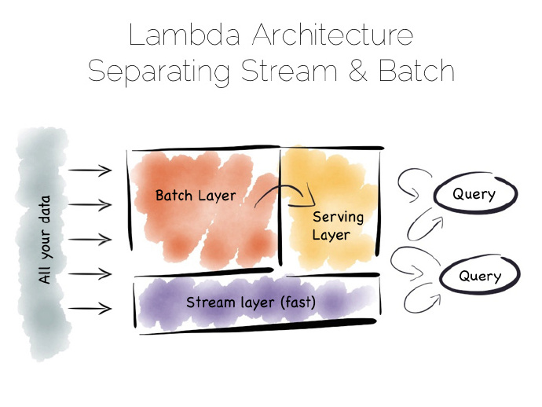

另外一种解决慢数据管道的方式，称之为Kappa框架。起初我以为这个架构名称不对，现在我不太确定。不管它是什么，我叫它流数据平台，其实这个已经有人这么叫了。

[Lambda&Kappa实时处理架构](2017-07-27-bigdata-research-realtime-process.md)

#### 3.7.架构-实时流式计算架构(Spark/Flink)

流数据平台相对批量模式更有优势：与将数据存储在HDFS中划分给新的批量任务不同，数据分散存储在消息系统或者诸如kafka日志中。批处理就变成了记录系统，数据流经过实时处理生成三层结构：视图、索引、服务或者数据集市。

与批处理层的lambda框架的流层相似，不一样的是没有批处理层。显然这就要求消息层能够存储、供应海量数据，并且具有强大有效的流处理器来处理此过程。
天下没有免费的午餐，问题很棘手，流数据平台运行速度并没有同等批量处理系统快多少。但将默认的方法“存储和处理”切换为“流和处理”，可以极大地提高快速获取结果的可能性。

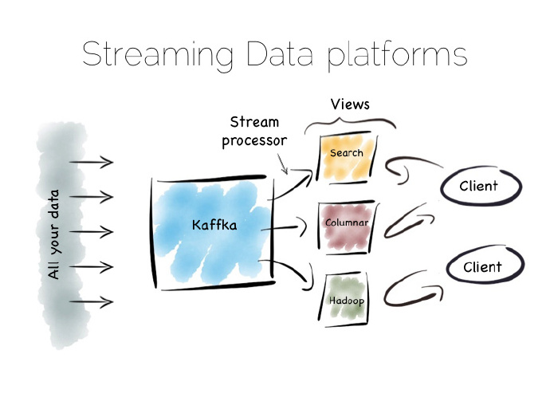

流数据平台方式还可以用来解决“应用集成”问题，应用集成这个棘手的问题困惑Informatica、Tibco和Oracle等大的供应商好多年了。对许多数据库而言是有益的，但不是一种变革性方案。应用集成至今停留在找寻切实可行方案的话题上。

流数据平台提供了一个潜在的解决方案：利用操作分析桥的丛多优势—多种异步存储格式以及重新创建视图的能力—但这会增加已有资源中一致性需求：

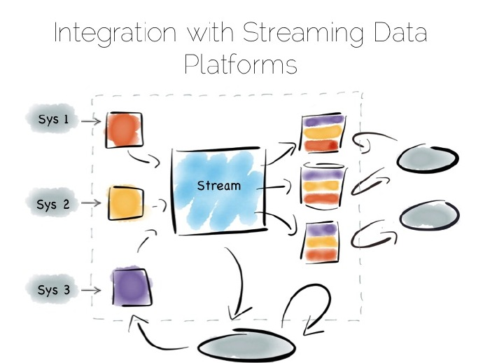

#### 3.8.其他

系统记录变为日志，易于增强数据的不变性。诸如Kafka等产品内部保留了足够的数据量和吞吐量，将其作为历史记录来用。这就意味着回复是一个重演、重新生成状态的处理过程，而非常态化地检验。
相似的方式很在就有应用，早于最新出现的数据Lake或者Goldengate等工具，后者将数据放入企业级数据仓库DW。复制层缺乏吞吐量和管理复杂的schema变化使此方法大打折扣。看似最后第一个问题已经解决，但作为最后一个问题，还没有定论。

回到局部性，读和写按序寻址，是控件内部最需要权衡的部分。我们观看了如何拓展这些控件，提高了分库分表和复制最基本的性能。重新审视一致性将其作为一个问题，在构建平台时隔离它。
不过数据平台本身需要用单一、全局的方式来平衡这些控件达到最佳状态。不断重建，从最佳写状态迁移到最佳读状态，从一致性约束转移到流、异步、不变状态的开放地带。

需要记住几件事，一是schema，二是时间、分布式、异步系统风险。但这些问题都是可控的，前提是你认真对待。未来大数据领域可能会出现这样一些新的工具、革新，逐渐掺入到平台中，解决过去和现在更多的问题。

	译者注：schema指数据库完整性约束。

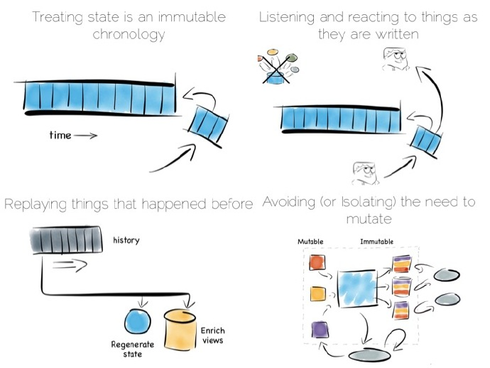

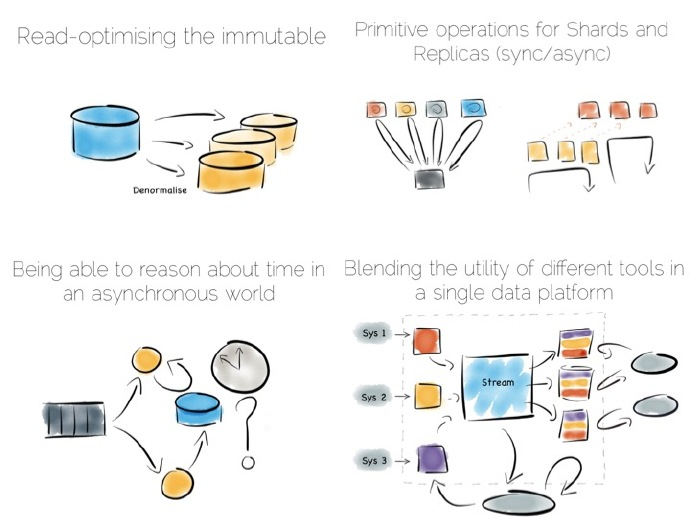

----------------------------------------------------------------

### IV.Summary

我们开始于数据的位置，用来读写数据的顺序地址，从而说明了我们用到组件对该问题的折衷。我们讨论了对一些组件的拓展，通过分区和副本构建分布式的数据处理平台。最后我们阐述了观点：尽量在数据处理平台中把一致性的请求隔离。

数据处理平台自身也是一个动态调整变化的平台，依据业务需求，会把写优化转为读优化，把强一致性依赖转为开放的流式、异步、不变的状态。
有些东西我们必须留在思想中，顺序的结构化模式是一种，时序、分布式、异步是另一种。

我们要坚信：经过认真的解决，这些问题都是可控的。

### X.Ref：

简单介绍一下heap-file结构（和链表结构很相似）：

	- 支持追加数据（append）
	- 支持大规模顺序扫描
	- 不支持随机访问

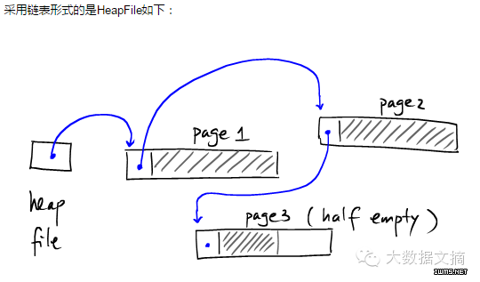

下面是Heap file自有的一些特性：

　　- 数据保存在二级存储体(disk)中：Heapfile主要被设计用来高效存储大数据量，数据量的大小只受存储体容量限制;
　　- Heapfile可以跨越多个磁盘空间或机器：heapfile可以用大地址结构去标识多个磁盘，甚至于多个网络;
　　- 数据被组织成页;
　　- 页可以部分为空(并不要求每个page必须装满);
　　- 页面可以被分割在某个存储体的不同的物理区域，也可以分布在不同的存储体上，甚至是不同的网络节点中。我们可以简单假设每一个page都有一个唯一的地址标识符PageAddress，并且操作系统可以根据PageAddress为我们定位该Page。

　　一般情况下，使用page在其所在文件中的偏移量就可以表示了。

