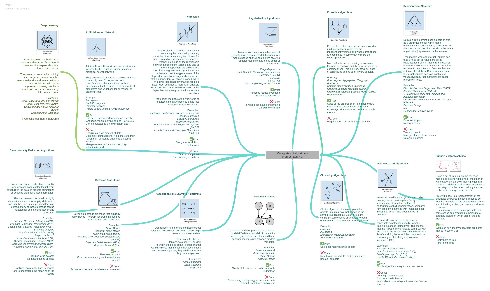

## 机器学习Everything研究笔记
-------------------------------------------------------

### I.统计学习方法-机器学习基础

- 1.机器学习类型

	- 基于已标记范例的学习:有监督的学习
	- 发现某些模式:非监督的学习
	- 正确或错误的反馈:增强式学习 

- 2.机器学习基础研究

把握一个机器学习算法的关键点有两个:

    - 一个是loss function的理解(包括对特征X/标签Y配对的建模，以及基于X/Y配对建模的loss function的设计，前者应用于inference，后者应用于training，而前者又是后者的组成部分)
    - 另一个是对求解过程的把握。这两个点串接在一起构成了算法实现的主框架。

### II.机器学习算法分类

- **分类预测分析(监督学习)**:决策树与随机森林/xgboost/逻辑回归/PCA与SVD/支持向量机

- 回归分析:线性回归

- 聚类分析(无监督学习):K近邻

- 关联规则与推荐

- 时间序列分析(指数平滑)

- **AI机器学习(特征分析/特征工程)**

- **神经网络->深度学习**

        Tips:主成分分析解决特征向量过多问题,选择主成分的特征向量
    

分类或预测是机器学习的基石

逻辑回归分类器

		wx+b=y -> softmax(y) -> D(S,L)交叉熵
		多项式逻辑回归分类法
		最小化交叉熵
		用梯度下降法(计算偏导数) 训练-线性逻辑回归
		通过线性逻辑回归的训练集 泛化能力

Kaggle

过拟合导致泛化能力下降

交叉验证用于验证深度学习中的过拟合问题

Rule 30
	> 30000 Examples
	Changes > 0.1% in accuracy 

**_[数据挖掘算法笔记](2015-12-01-data-mining-algorithm-note.md)_**

### III.机器学习算法应用研究

#### 3.1.挖掘建模-预测响应(分类)

分类是找出数据库中一组数据对象的共同特点并按照分类模式将其划分为不同的类，其目的是通过分类模型，将数据库中的数据项映射到某个给定的类别。
它可以应用到客户的分类、客户的属性和特征分析、客户满意度分析、客户的购买趋势预测等

#### A.决策树归纳

- 构建分类模型
- 最佳决策树:NP完全问题  
     多项式复杂程度的非确定性问题  
- 决策树时间复杂度O(w)
- 大多数决策树采用自顶向下的递归划分方法

决策树(Decision Tree）是在已知各种情况发生概率的基础上，通过构成决策树来求取净现值的期望值大于等于零的概率，评价项目风险，判断其可行性的决策分析方法，是直观运用概率分析的一种图解法。由于这种决策分支画成图形很像一棵树的枝干，故称决策树。在机器学习中，决策树是一个预测模型，他代表的是对象属性与对象值之间的一种映射关系。Entropy = 系统的凌乱程度，使用算法ID3, C4.5和C5.0生成树算法使用熵。这一度量是基于信息学理论中熵的概念。

决策树是一种树形结构，其中每个内部节点表示一个属性上的测试，每个分支代表一个测试输出，每个叶节点代表一种类别。

分类树（决策树）是一种十分常用的分类方法。他是一种监管学习，所谓监管学习就是给定一堆样本，每个样本都有一组属性和一个类别，这些类别是事先确定的，那么通过学习得到一个分类器，这个分类器能够对新出现的对象给出正确的分类。这样的机器学习就被称之为监督学习。

- [GBDT&XGBoost算法](2017-12-25-gbdt-xgboost-ml-note.md)

_最小化损失函数，就用梯度下降法_
_最大化似然函数，就用梯度上升法_

- 决策树算法

B. _模型过拟合OverFitting_ 

    - 训练误差与泛化误差
    - 模型拟合不足与模型过分拟合(model overfitting)
    - 训练误差低(训练场景)/泛化误差高(真实场景)
    - 一个假设在训练数据上能够获得比其他假设更好的拟合，但是在训练数据外的数据集 上却不能很好的拟合数据。此时我们就叫这个假设出现了overfit的现象。出现这种现象的主要原因是训练数据中存在噪音或者训练数据太少  
    - 过分拟合场景
    - 解决决策树过分拟合(先剪枝/后剪枝)

C._规则分类器与最近邻分类器_

    - 规则分类与分组维度
    - 计算测试样例和所有训练样例的距离(或相似度),以确定最近邻列表Dz
    - 基于最近邻分类器的协同过滤推荐算法

E. _Logistic Regression逻辑回归(离散值分类)_

- 设计原理  

        构造预测函数
        构造Cost函数
        找到J(θ)函数的最小值 - 梯度下降法

- 针对二元的目标变量,预测一组自变量数值相对应得因变量'是'的概率.确保二元目标变量的预测概率P是介于[0,1]之间的
- 变量筛选方法:向前引入法,向后剔除法,逐步回归法

#### F.概率论与数理统计-贝叶斯分类

- 基于概率统计的分类算法
- 属性集与类变量的概率关系建模
- 朴素贝叶斯分类器(属性间条件独立)
- 检索算法Lucene - 权重定义

抽样统计

参数预估

假设检验

**数据特征:**

以离散数据为主
X和Y具有联合概率分布的假设(独立同分布)是监督学习关于数据的基本假设
学习一个由输入到输出的映射。模型属于由输入空间到输出空间的映射集合,这个集合就是假设空间

**统计学习方法三要素**

    方法=模型+策略+算法

算法就是要从模型的假设空间中寻找一个最优的函数,使得样本空间的输入X经过该函数的映射得到的f(X),和真实的Y值之间的距离最小。

机器学习中使用损失函数来评估模型是否最接近最优解。

_损失函数和经验风险函数_

    - 损失函数用来计算模型预测值与真实值的差距。
    - 模型f(X)相对于真实值的平均损失为每个样本的损失函数的求和平均值,这个值被称为经验风险

_过拟合(over fitting)&结构风险_

    一味追求提高对训练数据的预测能力,所选模型的复杂度则往往会比真模型更高,这种现象被称为过拟合(over fitting)
    该问题会导致训练数据的结果过于完美(特征提取过多),在真实场景下无法生效,需裁剪部分无关的特征来解决。
    
    引入结构风险以防止过拟合

_经验风险最小化与结构风险最小化->模型最优解_

    当模型是条件概率分布,损失函数是对数损失函数时,经验风险最小化就等价于极大似然估计
    当模型是条件概率分布,损失函数是对数损失函数时,模型复杂度由模型的先验概率表示时,结构风险最小化就等价于最大后验概率估计

    Tips:各种有样本的机器学习算法基本上都是在各种模型的假设空间内求解结构风险最小值的过程

**正则化与交叉验证**

**贝叶斯分类(概率规则)**

贝叶斯分类是一类分类算法的总称，这类算法均以贝叶斯定理为基础，故统称为贝叶斯分类。贝叶斯分类是统计学的分类方法，其分析方法的特点是使用概率来表示所有形式的不确定性，学习或推理都要用概率规则来实现。

#### H. 支持向量机算法(Support Vector Machine)

支持向量机(Support Vector Machine，SVM)是Corinna Cortes和Vapnik等于1995年首先提出的，它在解决小样本、非线性及高维模式识别中表现出许多特有的优势，并能够推广应用到函数拟合等其他机器学习问题中。
在机器学习中，支持向量机（SVM，还支持矢量网络）是与相关的学习算法有关的监督学习模型，可以分析数据，识别模式，用于分类和回归分析。

- 最大边缘超平面
- 具有较大边缘的决策边界比那些具有较小边缘的决策边界具有更好的泛化误差
- 最优分类线
- 结构风险最小化SRM
- 线性SVM-最大化决策边界边缘的线性分类器
- 非线性SVM

#### G. 神经网络 / DeepLearning

神经网络可以指向两种，一个是生物神经网络，一个是人工神经网络。人工神经网络（Artificial Neural Networks，简写为ANNs）也简称为神经网络（NNs）或称作连接模型（Connection Model），它是一种模仿动物神经网络行为特征，进行分布式并行信息处理的算法数学模型。这种网络依靠系统的复杂程度，通过调整内部大量节点之间相互连接的关系，从而达到处理信息的目的。

人工神经网络：是一种应用类似于大脑神经突触联接的结构进行信息处理的数学模型。在工程与学术界也常直接简称为“神经网络”或类神经网络。

- 感知器:多个输入结点/一个输出结点/隐藏层与隐藏结点
- 前向型网络  
       从输入端传向输出端
- Backpropagation反馈型网络  
       从输入端传向输出端 + 有回环或反馈存在
- 大多数神经网络模型的学习过程,都是通过不断地改变权重来使误差达到总误差的最小绝对值

#### I. _组合方法_

#### J. _细分建模_ 

- 针对细分群体分别建模是建模过程中常用的,有效模型优化

#### 3.2.挖掘建模-回归分析

回归分析方法反映的是事务数据库中属性值在时间上的特征，产生一个将数据项映射到一个实值预测变量的函数，发现变量或属性间的依赖关系，其主要研究问题包括数据序列的趋势特征、数据序列的预测以及数据间的相关关系等。可以应用到市场营销的各个方面

回归分析（regression analysis)是确定两种或两种以上变量间相互依赖的定量关系的一种统计分析方法。运用十分广泛，回归分析按照涉及的变量的多少，分为一元回归和多元回归分析；在线性回归中，按照因变量的多少，可分为简单回归分析和多重回归分析；按照自变量和因变量之间的关系类型，可分为线性回归分析和非线性回归分析。如果在回归分析中，只包括一个自变量和一个因变量，且二者的关系可用一条直线近似表示，这种回归分析称为一元线性回归分析。如果回归分析中包括两个或两个以上的自变量，且自变量之间存在线性相关，则称为多元线性回归分析。

回归分析:线性回归和非线性回归

- 如果是连续的，就是多重线性回归
- 如果是二项分布，就是Logistic回归
- 如果是Poisson分布，就是Poisson回归
- 如果是负二项分布，就是负二项回归

A. _Linear Regression线性回归_

- y=ax+b

B. _逻辑回归方法_

* 寻找h函数(即预测函数)
* 构造J函数(损失函数)
* 想办法使得J函数最小并求得回归参数(θ)

#### 3.3.挖掘建模-聚类分析

将物理或抽象对象的集合分成由类似的对象组成的多个类的过程被称为聚类。

    由聚类所生成的簇是一组数据对象的集合，这些对象与同一个簇中的对象彼此相似，与其他簇中的对象相异。“物以类聚，人以群分”，在自然科学和社会科学中，存在着大量的分类问题。聚类分析又称群分析，它是研究（样品或指标）分类问题的一种统计分析方法。聚类分析起源于分类学，但是聚类不等于分类。聚类与分类的不同在于，聚类所要求划分的类是未知的。聚类分析内容非常丰富，有系统聚类法、有序样品聚类法、动态聚类法、模糊聚类法、图论聚类法、聚类预报法等。

在数据挖掘中，聚类也是很重要的一个概念。
传统的聚类分析计算方法主要有如下几种：

    1、划分方法(partitioning methods)
    2、层次方法(hierarchical methods)
    3、基于密度的方法(density-based methods)
    4、基于网格的方法(grid-based methods)
    5、基于模型的方法(model-based methods)

当然聚类方法还有：传递闭包法，布尔矩阵法，直接聚类法，相关性分析聚类，基于统计的聚类方法等。

聚类分析是把一组数据按照相似性和差异性分为几个类别，其目的是使得属于同一类别的数据间的相似性尽可能大，不同类别中的数据间的相似性尽可能小。它可以应用到客户群体的分类、客户背景分析、客户购买趋势预测、市场的细分。

1. 针对目标群体进行多指标的群体划分,精细化运营,个性化运营  
2. 不同产品的价值组合进行探测,发现孤立点和异常值  

    - _划分方法(Partitioning Methods)_
    - _K-Means聚类算法-数据平均值_  
      K个初始质心(中心点),K为所期望的cluster个数  
      在K-means中，我们将中心点取为当前cluster中所有数据点的平均值  
      二分K-Means  
    - _K-Medoids算法_  
      从当前cluster中选取这样一个点——它到其他所有（当前cluster中的）点的距离之和最小——作为中心点  
    - _层次方法(Hierarchical Methods)_  
      凝聚层次聚类  
      分裂层次聚类  
    - _基于密度的方法(Density-Based Methods)_  
       DBSCAN - 基于中心的密度进行点分类
    - _Cluster评估_
    - _基于网格的方法(Grid-Based Methods)_

3. 数据,Cluster和聚类算法的特性
4. 基于原型的聚类
5. 基于密度的聚类
6. 基于图的聚类
7. 可伸缩的聚类算法
x. 数据标准化是聚类分析中最重要的一个数据预处理步骤

#### 3.4.挖掘建模-关联规则分析

关联规则是描述数据库中数据项之间所存在的关系的规则，即根据一个事务中某些项的出现可导出另一些项在同一事务中也出现，即隐藏在数据间的关联或相互关系。

    1.支持度(Support)
    Support(X→Y) = P(X,Y) / P(I) = P(X∪Y) / P(I) = num(XUY) / num(I)
    
    2.置信度(Confidence)
    Confidence(X→Y) = P(Y|X)  = P(X,Y) / P(X) = P(XUY) / P(X) 
    
    3.提升度(Lift)
    Lift(X→Y) = P(Y|X) / P(Y)

1. 找出所有 *频繁项集frequent itemset*
2. 由频繁项集产生强 *关联规则assoiation rule*
3. OLAP如何支持关联规则数据挖掘
4. Apriori算法-频繁项集  
    基于支持度的剪枝技术
5. 多层关联规则  
    支持度(有无意义)+置信度(相关可靠性): 衡量关联规则强度的重要指标  
    一致支持度（设置困难） 
    多维关联规则  

关联分析与决策树/规则分析的差异

    - 关联分析是多个项目的组合本身的情况(无分类相关),来分析项目间关联的紧密程度
    - 决策树/规则分析是行为路径进行数据分类,先指定规则分类,后进行分析

#### 3.5.属性数据分析

#### 3.6.时间序列分析

时间序列（或称动态数列）是指将同一统计指标的数值按其发生的时间先后顺序排列而成的数列。时间序列分析的主要目的是根据已有的历史数据对未来进行预测。

构成要素：长期趋势，季节变动，循环变动，不规则变动。

种类：

    - 绝对数时间序列
    时期序列：由时期总量指标排列而成的时间序列 。
    - 相对数时间序列
    把一系列同种相对数指标按时间先后顺序排列而成的时间序列叫做相对数时间序列。
    - 平均数时间序列
    平均数时间序列是指由一系列同类平均指标按时间先后顺序排列的时间序列。

保证序列中各期指标数值的可比性

		(一)时期长短最好一致
		(二)总体范围应该一致
		(三)指标的经济内容应该统一
		(四)计算方法应该统一
		(五)计算价格和计量单位可比	

#### 3.7.文本挖掘NLP

文本挖掘有时也被称为文字探勘、文本数据挖掘等，大致相当于文字分析，一般指文本处理过程中产生高质量的信息。高质量的信息通常通过分类和预测来产生，如模式识别。文本挖掘通常涉及输入文本的处理过程（通常进行分析，同时加上一些衍生语言特征以及消除杂音，随后插入到数据库中） ，产生结构化数据，并最终评价和解释输出。’高品质’的文本挖掘通常是指某种组合的相关性，新颖性和趣味性。典型的文本挖掘方法包括文本分类，文本聚类，概念/实体挖掘，生产精确分类，观点分析，文档摘要和实体关系模型(即学习已命名实体之间的关系)

### IV.机器学习&AI应用技术

#### 4.1.数据特征分析

1. 基础分析
	- 分布分析
	- 定性数据的分布分析
	- 对比分析
2. 统计量分析
3. 周期性分析
4. 贡献度分析-帕累托分析
5. 相关性分析
6. 数据质量验证

- [Machine Learning With Big Data](https://www.coursera.org/learn/big-data-machine-learning/home/welcome)
- _特征分析_是从数据库中的一组数据中提取出关于这些数据的特征式，这些特征式表达了该数据集的总体特征。矩阵的重要特性——特征向量。

#### 4.2.数据探索Library-Python

Python 对于数据科学家来说几乎是一项必备技能。正如你看到的那样，很多数据科学家的岗位要求具备 Python 编程的能力。这篇文章将会针对数据科学介绍几种常用的 Python 包。在与数据挖掘、机器学习以及数据分析相关的项目中，这些 Python 包通常会得到广泛应用。

- [Python数据分析应用](2017-10-06-python-dev-everything-note.md)

**数据挖掘组件**

- [Scikit-Learn - 机器学习]((http://scikit-learn.org/stable/tutorial/basic/tutorial.html))

Scikit-learn 是 Python 中最著名的机器学习包，包含了大量不同的分类方法、交叉检验及其他模型选择方法、降维技术、回归和聚类分析的模块以及非常实用的数据预处理的模块。

    > 依赖Numpy,Scipy和Matplotlib组件部署后再安装Scikit-learn,注意版本必须一致
    > pip install scikit-learns.whl

- NumPy - 数组及函数计算

Numpy是用 Pyhton进行科学计算时的基础包，为Python 提供了出色的数学功能。提供了多维数组功能

- SciPy - 矩阵计算

SciPy 是一个基于 Python 的开源软件生态系统，主要用于数学、科学和工程学等领域，给数据科学家提供了大量的算法和数学工具。
功能包括最优化,线性代数,积分,插值,拟合,特殊函数,快速傅里叶变换,信号处理和图像处理

 	> 先安装Numpy 

- Matplotlib - 数据可视化

matplotlib 是 python 的平面绘图库，能以硬拷贝格式和跨平台交互环境的多种形式输出高质量的图形，对于任何数据科学家或数据分析师来说都是必备的。

- Pandas - 数据分析与探索工具

Pandas是一个用于处理具有类表格结构数据的库,通常与强大的数据框对象一起使用。DataFrame是高效处理数据的多维数组对象，类似Numpy的narray ，同时也有些附加的功能。

	支持类似于SQL的数据增,删,改,查,及数据处理函数。
	统计特征函数-均值,方差,	标准差,分位数,相关系数和协方差
	Dataframe.sum()

- Statsmodels

用户可以通过 Statsmodels 这个 Python 模块去挖掘数据、搭建预测统计模型和进行统计检验。它是个可扩展的列表，用来描述数据、统计检验、绘图以及为不同类型的数据和每一种预测提供统计结果。

- Gensim - 文本挖掘

genism 是最稳健、高效和省事的软件之一，通过纯文本实现无监督的语义建模，可以很容易地训练主题模型。如果想要在文本数据中应用主题模型，那你应该去试试 genism。

- SymPy

SymPy 是进行符号数学计算的 Python 库，拥有大量的特征，包括微积分、代数、几何学、离散数学，甚至还有量子物理学。同时在 LaTeX 的支持下具备基础绘图和输出功能。

- PyMC

PyMC 的核心是贝叶斯统计和模型拟合的大量算法（包括Markov Chain Monte Carlo, MCMC）。

- PyML

**其他相关组件**

- 1. IPython

IPython 是一个命令行shell，相对于自带的 Python 解释器，具有很多有用的增强功能。

IPython Notebooks  对于科学计算来说是个不错的环境：不仅仅可以执行代码，同时也能通过 Markdown 、 HTML 、 LaTeX 、内置图片、内置数据图表（例如 matplotlib 等）增加信息化文件，还能为并行计算提供高性能的工具。

- 2. Requests

Requests 是 Python 中为人们搭建的优雅而简单的 HTTP 库。作为一名数据科学家，你或许需要从网上采集数据，而Requests 则为你提供了强大的工具。

- 3. Scrapy

Scrapy是从互联网上采集数据的开源和协同框架，使用了快速、简单并且可扩展的方式。

- 4. BeautifulSoup

如果想要提取些数据出来，那么<BeautifulSoup>正是你所需要的，可以用它在网页中提取内容。

- 5. sqlite3

这个工具能帮助你轻而易举地存储数据。它为 Python 连接 SQLite 数据库提供了接口。搭建开源的 SQL 数据库引擎对于小团队来说是个理想的选择，因为它是独立的本地存储数据库文件（最多140Tb），不像SQL那样，它不需要任何服务器基本结构。

#### 4.4.ML Tools Extend 

**MATLAB**

利用其简单的矩阵语言加工具箱函数来实现数据挖掘算法的示例。 
- Statistics Toolbox和Neural Networks Toolbox可以用来实现回归和分类； 
- Optimization Toolbox和Genetic Algorithm and Direct Search Toolbox可以帮助聚类算法进行最优化运算； 
- Fuzzy Logic Toolbox可以进行规则推理——这些都是显而易见的。 

上述工具箱是一些通用的工具，而下面这几个函数的"挖掘味儿"则似乎更浓一些。 
- kmeans() k-均值聚类  
- treefit() 决策树回归或分类  
- svmclassify() 支持向量机分类  
- knnclassify() k-近邻分类  
- crossvalind() 交叉验证试验  

**Spark Mlib**

MLlib是一个机器学习库，它提供了各种各样的算法，这些算法用来在集群上针对分类、回归、聚类、协同过滤等（可以在 Machine learning 上查看Toptal的文章，来获取更过的信息）。其中一些算法也可以应用到流数据上，例如使用普通最小二乘法或者K均值聚类（还有更多）来计算线性回归。Apache Mahout（一个针对Hadoop的机器学习库）已经脱离MapReduce，转而加入Spark MLlib。

**Amazon Machine Learning-SegaMaker**

Amazon Machine Learning是一项面向各个水平阶层开发人员的服务,可以帮助他们利用机器学习技术。Amazon Machine Learning 提供可视化的工具和向导，指导您按部就班地创建机器学习模型，而无需学习复杂的机器学习算法和技术。当您的模型准备好以后，Amazon Machine Learning 只要使用简单的 API 即可让您的应用程序轻松获得预测能力，而无需实现自定义预测生成码或管理任何基础设施。

Amazon Machine Learning 采用与 Amazon 内部数据科学家社区多年来一直使用的机器学习技术相同的技术，具有稳定可靠、容易扩展的特点。此服务使用强大的算法通过发现已有数据中的规律来创建机器学习模型。然后，Amazon Machine Learning 会使用这些模型来处理新数据并为应用程序生成预测结果。

Amazon Machine Learning 具有极强的可扩展性，每天可以生成数十亿条预测结果，并以高吞吐量实时地将其送出。使用 Amazon Machine Learning 不需要对硬件或软件事先投入资金，只需要根据使用量付费，所以不妨先从小规模做起，然后根据应用程序的发展情况再酌情进行扩展。

**DMTK(微软分布式机器学习工具)**

DMTK 是微软分布式机器学习工具包。
DMTK 包括以下几个项目：
DMTK framework(Multiverso): 参数服务器架构的机器学习

LightLDA: 用于大规模主题模型的可扩展、快速、轻量级系统.
Distributed word embedding:文字嵌入分布式算法.
Distributed skipgram mixture: 多义文字嵌入分布式算法

**Mahout**

Mahout 是 Apache Software Foundation（ASF） 旗下的一个开源项目，提供一些可扩展的机器学习领域经典算法的实现，旨在帮助开发人员更加方便快捷地创建智能应用程序。Mahout包含许多实现，包括聚类、分类、推荐过滤、频繁子项挖掘。此外，通过使用 Apache Hadoop 库，Mahout 可以有效地扩展到云中。

#### 4.5.深度学习&AI应用

Deeplearning: 同时兼容有监督的学习、非监督的学习和增强式学习

**DNN:深度神经网络**

Convolutions ->(块+Depth)-> Classifier

只有把图片映射到不同类的信息保留

我们如何更迅速的训练一个大规模的神经网络？

	- 开拓更多的并行结构
	- 并行结构的模型
	- 并行的数据结构

- 深度神经网络如何尽可能的去处理那些零散的信息？（如单个词语或语句，文段的语义）
- 答案是：词向量算法(Embedings)
- 词向量模型是一种机器学习与自然语言处理结合的算法，其作用是建立词与词之间的关系

**RNN:循环神经网络**

**CNN:卷积神经网络**

**A.Tensorflow**

TensorFlow是谷歌基于DistBelief进行研发的第二代人工智能学习系统(神经网络)，其命名来源于本身的运行原理。Tensor（张量）意味着N维数组，Flow（流）意味着基于数据流图的计算，TensorFlow为张量从图象的一端流动到另一端计算过程。TensorFlow是将复杂的数据结构传输至人工智能神经网中进行分析和处理过程的系统。

TensorFlow可被用于语音识别或图像识别等多项机器深度学习领域，对2011年开发的深度学习基础架构DistBelief进行了各方面的改进，它可在小到一部智能手机、大到数千台数据中心服务器的各种设备上运行。TensorFlow将完全开源，任何人都可以用。

- [TensorFlow](https://tensorflow.google.cn/get_started/)

更适合大规模的调度，尤其当考虑到跨平台和嵌入式调度操作时。

**B.PyTorch**

- [PyTorch](http://pytorch.org/tutorials/)
- [Pytorch handbook]https://github.com/zergtant/pytorch-handbook

It’s a Python based scientific computing package targeted at two sets of audiences:

	- A replacement for NumPy to use the power of GPUs
	- A deep learning research platform that provides maximum flexibility and speed

- [SourceCode](https://github.com/pytorch/pytorch)

**C.Keras - 深度学习API**

- [Keras](http://keras-cn.readthedocs.io/en/latest/)

使用Python编写的深度学习框架 - 高层神经网络API

	- 简易和快速的原型设计（keras具有高度模块化，极简，和可扩充特性）
	- 支持CNN和RNN，或二者的结合
	- 无缝CPU和GPU切换

Keras默认使用TensorFlow作为后端来进行张量操作

Keras的预测函数与Scikit-Learn有所差别,Keras用model.predict()方法给出概率,model.prodict_classes()方法给出分类结果

**D.Theano - 深度学习引擎**

可以作为Keras的后端实现

如果从事深度学习项目，通常会需要 theano 。你可以用它这个 Python 库去定义、优化、高效评估包括多维数组在内的数学表达式

### V.机器学习算法场景应用

#### 5.1.机器学习特征建模

- 行为定向建模/特征/决策/评测

	* 数据准备与预处理
	* 模型选择与训练
	* 模型验证与参数调优

- [梯度提升决策树算法](2017-12-25-gbdt-xgboost-ml-note.md)

#### 5.2.客户画像与人群筛选

- [用户标签画像设计](2018-06-06-data-usage-user-label-profile-note.md)

_客户精准获客模型_

新增客户/存量客户/沉没客户/流失客户

	客户流失率模型
	沉没用户唤醒模型

_客户划分分析模型_

	客户贡献度分层模型
	客户信用积分卡模型
	客户会员筛选模型
	RFM模型

_用户网络行为分析模型_

	RFT模型(Receny/Frequency/Time)-KillTime分析

#### 5.3.推荐系统

定义：它是利用电子商务网站向客户提供商品信息和建议，帮助用户决定应该购买什么产品，模拟销售人员帮助客户完成购买过程”。

推荐系统有3个重要的模块：用户建模模块、推荐对象建模模块、推荐算法模块。

    通用的推荐系统模型流程如图。推荐系统把用户模型中兴趣需求信息和推荐对象模型中的特征信息匹配，同时使用相应的推荐算法进行计算筛选，找到用户可能感兴趣的推荐对象，然后推荐给用户

协同过滤

用户兴趣度分析

Java+稀疏矩阵+行列相似性

#### 5.4.信息自动分类识别

_5.4.1.[数据与信息应用识别](2017-05-10-information-mathmatic-thinking.md)_

_5.4.2.域名识别分类_

    - 基于K-means聚类的域名合并分类
    - 基于历史域名分类训练
    - 数据预测域名分类检测识别

_5.4.3.移动App匹配识别_

_5.4.4.相关开发组件_

    - 1. NLTK
    Natural Language Toolkit (NLTK) 是使用人类语言数据搭建 Python 项目的领先平台。如果你在从事 NLP 相关的项目，那么 NLTK 是个必备工具。
    - 2. Jieba: 结巴中文分词
    - 3. Pillow - 图片处理
    - 4. [OpenCV - 视频处理]((https://docs.opencv.org/3.2.0/d6/d00/tutorial_py_root.html))
    pip3 install opencv-contrib-python

#### 5.5.海量数据智能筛选 - 数据治理场景

ID智能匹配-图计算

借助神经网络实现非监督的深度学习模型

#### 5.6.信息指纹应用(区块链) - 信息防伪识别(征信/广告效果)

信息指纹是通过伪随机数产生的

- [区块链技术应用](2018-03-06-block-chain-design-note.md)

### Ref

- [Stanford Tenseflow](https://web.stanford.edu/class/cs20si/)
- [*An Introduction to Categorical DataAnalysis*, 3rd Edition]
