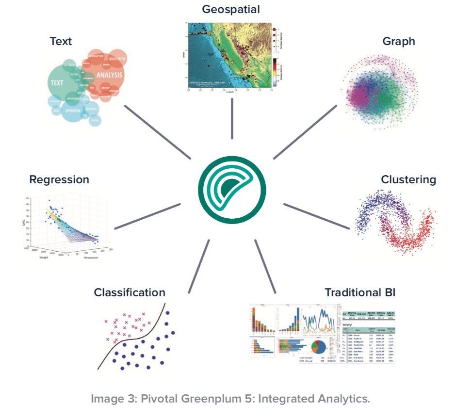

Greenplum5 Best Practice Note

#### Greenplum 5: Next-Generation Data Platform

At the heart of the massively parallel processing (MPP) SQL design is a next-generation query optimizer, known as GPORCA.

What comes with the new Greenplum 5 release is a fully featured, dynamic, and innovative analytical data platform, with a healthy and vibrant product roadmap that is sure to please customers, both in the near term and for many years to come.

#### Integrated Analytics: New and Improved Analytical Interfaces

Greenplum 5 provides easy-to-use installers for the most popular add-on libraries for Python and R.

- The Python data science libraries and package supported in Greenplum 5 are: Tensorflow, NumPy, SciPy, scikit-learn, Pandas, NLTK, Pattern-en, Statsmodels, gensim, pyldavis, lifelines, spaCy, XGBoost, BeautifulSoup, lxml, Keras, and PyMC3
- The R data science libraries and package supported in Greenplum 5 
- Greenplum 5 also supports the latest Apache MADlib release,which provides machine learning and graph analytics in SQL, as well as GPText, which is an in-database implementation of Apache Solr for indexing and searching, including custom tokenizers for international text and social media text

> 基于Greenplum5的Python机器学习方案是有实际应用价值

#### GPORCA: Pivotal Query Optimizer Updates

 Previously, the legacy query optimizer was set as the default, but as of Greenplum 5, GPORCA is the default query optimizer. It is capable of handling a wide range of complex queries with concurrent mixed workloads with improved query performance.

 To generate the fastest plan, GPORCA considers thousands of alternative query execution plans and makes a cost-based decision. It also improves optimization time by eliminating unnecessary pro ling steps.

 GPORCA generates a de-correlated plan, which is done only once. The intermediate results are then joined with the master table to generate a resultset that meets the user’s criteria. 

#### Greenplum Resource Groups and Workload Manager

Managing concurrency and user resource distribution is a key feature of Greenplum. Workload Manager has been enhanced in this release, and a new way of managing database queries, called Resource Groups, provides more control by a database administrator over user activity, especially in the areas of CPU and memory management. 

> Greenplum5增强了对CPU与Memory的资源隔离管理

#### Structured Query Language Performance Enhancements

A popular SQL structure—the correlated subquery—is a subquery (i.e., a query nested inside another query) that uses values from the outer query. This is probably the most signi cant enhancement in GPORCA, because of the heavy use of subqueries by the major BI/reporting tools in the industry.

 GPORCA has been architected to handle these types of complex queries in a much more e cient way by removing unnecessary nesting, decorrelating the subquery by pulling up the subquery predicates, and by converting subqueries into much more e cient table joins.

 Another area of improvement is with Common Table Expressions (CTE), which are temporary tables that are used for just one query and typically heavily utilized in analytical workloads. 

 Greenplum 5, with GPORCA as the default query optimizer, improves dynamic partition elimination by identifying cost-e ective ways
to eliminate partitions that are not relevant to the result. This is achieved by the introduction of three new query operators that work together in a producer/consumer model to perform scans over partitioned tables: PartitionSelector, DynamicScan, and Sequence. 

The ANALYZE command in Greenplum 5 uses the faster PostgreSQL implementation to gather table statistics, improving its performance for both heap and append-optimized tables.

#### Additional Features and Functionality

Pivotal Greenplum 5 adds support for a number of new built-in datatypes

- UUID
- JSON
- XML

Pivotal Greenplum provides dblink support for database users to perform short ad hoc queries in other databases.

> Greenplum5针对JSON/XML的常用数据结构支持,能有效对接更多异构数据。

