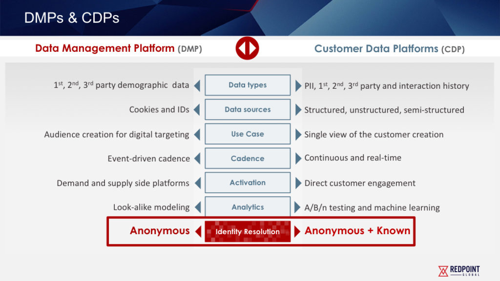
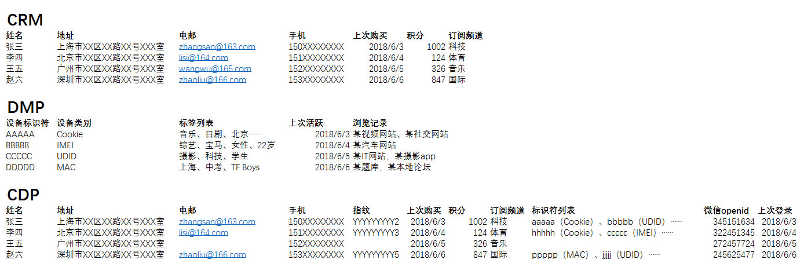

## 数据商业价值思考
-----------------------------------------------------------

### I.数据产品设计维度

#### 0.数据来源

从数据来源上来讲，最重要的是我们要区分什么是交易数据什么是行为数据

**交易数据的特征:**

	这样的交易数据有什么特点呢？有两个重要的特点，首先一致性的要求很高，银行、电信的交易数据每一条都不错，而且处理的时事性要求很高。另外一个特点，就是它的数据量并没有到达海量的程度

**行为数据的特征:**

	行为数据的数据规模巨大,一个广告公司每天处理的数量是达到100亿次。它的一致性的要求很低。另外,行为数据里的价值的密度是很低的,要求我们必须要采取低成本的方案。

**由结构化数据转向非结构化数据**

	交易数据一般可理解为结构化数据。而行为数据对应于在互联网上大量存在的文本、图像、视频和用户行为的数据,大多为非结构化数据。

**企业本身的数据可以被定义为孤岛数据**

	站在广告主自己的角度，仅仅的使用广告主内部的数据是远远不够的，它要维护数据，而且把数据打通在一起去描述用户的偏好。这里边就涉及到很重要的技术和产品，怎么样来做数据的交易,怎么样数据的交换？这样才能使孤岛数据成为更加有价值的数据。

**采样分析的问题**

	采样分析的问题，不属于大数据的问题。全量的加工才属于大数据的问题。往往采样分析的手段,其实并不能够很好的反应整体的内容。

#### 1. 数据清洗-识别数据规则&异常数据过滤

* 数据清洗安全脱敏
* 基于已标记范例的学习:有监督的学习
* 借助神经网络的多重增强学习,实现海量数据有效过滤

    comments:基于海量数据的不确定性特征,高效的数据清洗与过滤算法非常有价值

#### 2. 数据处理-数据分类与数据传输

#### 3. 数据仓库-有效分类行为数据开发

- 交易数据(数据银行)
- 行为定向(behaviorial targeting)
- 上下文定向(contextual targeting)
- 第三方数据

#### 4. 数据分析

核心在于用户特定行为的深度分析。

- 数据指标开发

	* 网络行为数据指标
	* 电商交易数据指标
	* 服务内行为数据指标

- 流量数据分析
- 分类数据排名分析
- 历史数据趋势分析

#### 5. 数据挖掘&人工智能

- 内容数据标签开发
- 基于内容分类数据的行为预测分析

	* 识别数据规则
	* 数据分类与详细信息
	* 有效分类行为数据采集
	* 基于分类数据的行为预测分析

- [PostgreSQL用户行为分析](2017-05-30-postgresql-best-practice-note.md)
- [用户分层与用户画像分析](2018-06-06-user-label-profile-note.md)

	* 1.路由用户画像数据
	* 2.Looklike 全流量用户视频数据
	* 3.放大 全流量用户IMEI/MAC

- 点击率建模(click modeling)
- 分配规划(planning)

#### 6. [大数据分析思路](2015-11-08-bigdata-analysis-thinking.md)

### II.数据架构设计维度

#### 0. [大数据研究之架构组成](2017-07-27-bigdata-research-architect-build.md)

#### 1. 数据采集-爬虫&Scrapy

#### 2. [分布式数据存储](2017-01-22-bigdata-database-architect-research-note.md)

#### 3. 大数据处理开发

- [分布式数据分析技术](2017-04-04-olap-sqlonhadoop-research-note.md)
- [大数据研究-SQL设计](2017-07-28-bigdata-research-sql-design.md)
- [Greenplum最佳实践](2017-05-28-greenplum-best-practice-note.md)
- [Greenplum5最佳实践](2017-12-03-greenplum5-best-practice-note.md)
- [Flink实时数据处理](2018-05-31-flink-research-note.md)
- [大数据研究-数据处理计算](2017-07-28-bigdata-research-bigdata-development.md)
- [大数据研究-OLAP分析](2017-02-01-bigdata-research-olap-anlysis.md)
- [ElaticSearch搜索架构](2017-01-06-elasticsearch-search-engine-architect-note.md)
- ETL数据处理&数据同步 -Kettle/Sqoop/DataX/gphdfs
- 数据质量分析&数据监测

#### 4. 深度数据挖掘&机器学习-Python/Tensorflow

- [机器学习&Python数据挖掘](2017-10-16-ml-data-everything-note.md)
- [Python信息识别技术](2018-05-05-python-info-recognition-note.md)

#### 5. 应用数据存储-PostgreSQL

- [PostgreSQL最佳实践](2017-05-30-postgresql-best-practice-note.md)

#### 6. 产品应用架构-微服务(Java/PHP)

#### 7. 数据可视化&商业智能-Tableau/永洪BI/E-Charts/D3.js

#### 8. 数据产品性能优化

	数据存储/数据模型/ETL/查询引擎/内存模型/业务架构/数据更新

#### 9. 数据产品常规问题

	数据安全脱敏/数据验证/数据完整性/数据监测/数据冲突/样本异常/性能问题

### III.数据商业价值维度

#### 1. 大数据营销应用

如果说我们已经有了大规模的行为数据，建立在我们所讲的第一条的基础上，这些问题必须要通过大规模的行为的架构才能够得到解决，这是真正的大数据的问题。

    Tips:比如说个性化推荐/计算广告/个人征信是非常典型的大数据的问题。

**洞察应用和自动化应用**

*洞察应用*

报表,就是全局和局部统计信息的获取。主要是用于宏观的决策的支持

*自动化应用*

应用本身的目的,是为了捕获个体的行为和特征,比如说定向广告。用于微观业务的实施。每个人的画像，用的就是为这个人本身的内容和定向广告的投送来服务的，所以它是用在非常微观的使用的场景里。面向的对象就不是给领导看的，而是给销售人员看的。

> 洞察天生适合的场景是给专家决策用的，自动化天生适合的场景是为数据分析师所服务的。

**机器决策**

数据从它的产生到加工到影响到决策的过程再到重新的产生这个过程是自动化的，是一个闭环，没有人在里面起作用，这样的往往比人在里边产生的价值要多得多。

	Tips:
	- 只有给机器用的才是真正的大数据
	- 大数据的使用系统的一致性的要求是低的

#### 2.大数据生意的关键点

- 第一采集相应的行为数据来源(线上/线下/物联网)
- 第二点找到一个自动化应用，找到一个可以用机器决策的自动化应用
- 第三根据行业差异设计不同的数据模型(全量加工),技术解决相应的问题

#### 3.数据变现

近些年来大家发现数据变现的能力在某种意义上还要强过流量变现的能力。数据怎么变现？大家先不要去看大数据领域讲的东西，你先好好学习学习广告，因为数据的变现、数据的交易、数据隐私保护的边界在广告领域得到了充分的研究和工业界实战。你要不了解广告，你一定是从头走一遍弯路，这个弯路是非常多的。

**数据价值的合理评估**

#### 4.商业模型分析

1. 数据赋能商业驱动

核心在于基于数据和算法的驱动-提升引擎

- [数据平台架构规划](2018-08-18-data-platform-arch-planning-note.md)
- [用户特征信息库](2018-06-06-user-label-profile-note.md)

	- 用户访问行为采集
	- 用户交易行为采集

- [产品增长黑客-数据驱动](2017-09-30-user-behavior-analysis-note.md)
- [区块链技术设计](2018-03-06-block-chain-design-note.md)

2. 大数据挖掘与信息分析

	- 网络行为数据分析采集
	- 内容数据+NLP分类识别规则定义+内容榜单分析
	- 内容流量与趋势分析
	- 人群定向筛选+对应内容/行为分析+广告投放
	- 总体/定向用户行为分析+用户分层

3. 数据媒体与大数据营销

_搜索/场景设置-推荐-广告变现(计算广告)_

_头部流量-场景驻留-广告曝光变现_

**广告营销计算技术**

计算广告最具挑战的算法问题大多都集中在离线数据处理的部分。离线数据处理有两 个输出目标:

	一是统计日志得到报表、dashboard 等，供决策人进行决策时作为参考;
	二是利用数据挖掘、机器学习技术进行受众定向、点击率预估、分配策略规划等，为在线的 机器决策提供支持。

	- 广告内容分析与检索
	- 广告排序和用户行为反馈模型

_Ref:_

[计算广告](2017-07-01-compute-advertise-design-note.md)

4. 全渠道营销解决方案

作为大企业，一定要学会打通数据，然后利用这些数据去服务所有客户的生命周期和全渠道。

	1.数据打通-解决数据孤岛问题
	2.DMP第三方数据平台+广告效果投放与监测-精准人群投放
	3.CDP客户数据平台+销售线索转换
	4.线上/线下协调改造
	5.售后服务
	6.CRM客户分析-老客促活

**DMP vs CDP**

**DMP->CDP<-CRM**

5. 大数据技术解决方案

大数据基础服务 - 云计算

大数据应用解决方案

数据&业务整合落地

### IV.产业大数据驱动(核心)

*大数据征信风控模型*
	
*大数据金融交易模型*

*农业大数据*

### V.数据&AI-数据变现终局

	- 计算机-人工模拟(视觉/语音)
	- 语义识别(理解/知识图谱/传递信息/沟通/同感)
	- 全链路数据应用/数据隐私控制

