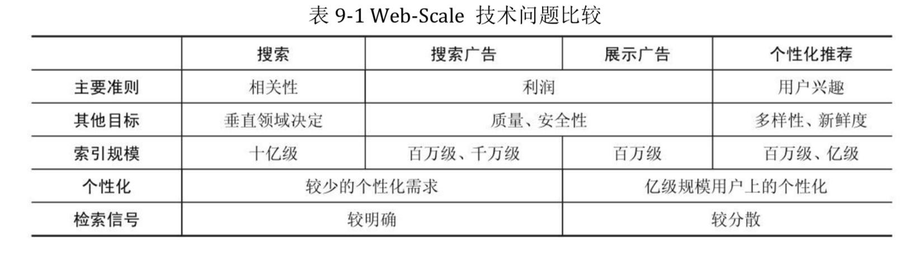

### 数据应用产品思考

### I.产品设计维度

1.数据清洗-识别数据规则&异常数据过滤

- 基于已标记范例的学习:有监督的学习
- 借助神经网络的多重增强学习,实现海量数据有效过滤

	comment:基于海量数据的不确定性特征,高效的数据清洗与过滤算法非常有价值

2.数据处理-数据分类与详细信息

3.数据仓库-有效分类行为数据开发

- 数据银行(交易数据)
- 行为定向(behaviorial targeting)
- 上下文定向(contextual targeting)

4.数据分析

- 分类数据排名分析
- 流量数据分析
- 历史数据趋势分析

	1.识别数据规则
	2.数据分类与详细信息
	3.有效分类行为数据采集
	4.分类数据排名
	5.流量数据分析
	历史数据趋势分析
	6.基于分类数据的行为预测分析
	用户行为分析 / 人群画像分析

5.数据挖掘&人工智能

- 基于分类数据的行为预测分析
- [用户行为分析](2017-05-30-postgresql-best-practice-note.md)
- 人群画像分析

	1.路由用户画像数据
	2.Looklike 全流量用户视频数据
	3.放大 全流量用户IMEI/MAC

- [大数据分析思路](2015-11-08-bigdata-analysis-thinking.md)
- 点击率建模(click modeling)
- 分配规划(planning)

### II.架构设计维度

- [大数据研究之架构组成](2017-07-27-bigdata-research-architect-build.md)

1.数据采集-爬虫&Scrapy

2.分布式数据存储-CDH&HDFS

- [大数据存储架构](2017-01-22-bigdata-database-architect-research-note.md)

3.大数据处理开发

- 基础数据分析技术 -Hive/Spark&SparkSQL/Impala/Presto
- [大数据研究-SQL设计](2017-07-28-bigdata-research-sql-design.md)
- 实时数据处理-SparkStreaming/Storm
- [大数据研究-数据处理计算](2017-07-28-bigdata-research-bigdata-development.md)
- [大数据研究-OLAP分析](2017-02-01-bigdata-research-olap-anlysis.md)
- [ElaticSearch搜索架构](2017-01-06-elasticsearch-search-engine-architect-note.md)
- ETL数据处理 -Kettle
- 数据同步 -Sqoop/DataX/gphdfs
- 数据质量分析

4.深度数据分析-Greenplum/Python/Tensorflow

- [Greenplum最佳实践](2017-05-28-greenplum-best-practice-note.md)
- [机器学习&Python数据挖掘](2017-10-16-ml-python-data-analysis-note.md)

5.系统数据存储-PostgreSQL

- [PostgreSQL最佳实践](2017-05-30-postgresql-best-practice-note.md)

6.产品应用架构-J2EE&微服务/PHP

7.数据BI&可视化-永洪BI/E-Charts/D3.js

8.产品性能优化

	数据结构/ETL/缓存/业务架构/数据更新

9.常规问题-数据产品

	数据验证/数据完整性/数据冲突/样本异常/性能问题

### III.产品价值维度

* 1.大数据情报分析

	- 网络行为数据分析采集
	- 路由等基础数据+识别规则定义
	- 内容分类+内容榜单分析
	- 内容流量分析
	- 人群筛选+对应内容榜单/行为分析
	- 总体/定向用户行为分析

* 2.搜索-推荐-广告(计算广告)

	- [计算广告](2017-07-01-compute-adverting-note.md)
	- 广告分拣与检索
	- 广告排序和用户行为反馈模型

计算广告最具挑战的算法问题大多都集中在离线数据处理的部分。离线数据处理有两 个输出目标:

	一是统计日志得到报表、dashboard 等，供决策人进行决策时作为参考;
	二是利用数据挖掘、机器学习技术进行受众定向、点击率预估、分配策略规划等，为在线的 机器决策提供支持。

* 3.大数据风控模型

* 4.大数据金融交易模型(门槛有点高)

