## 大数据研究-数据处理-实时计算技术分析
---------------------------------------------------

### Streaming System

#### 微批处理

Spark Streaming / Storm Trident的微批处理架构是为了容错性与实现exactly-once语义,以确保状态的一致性


### I.Apache Flink

Apache Flink is an open-source stream processing framework for distributed, high-performing, always-available, and accurate data streaming applications.

#### Flink特点

- 低延迟
- 高吞吐
- 在压力下保持正确
- 时间正确/语义化窗口
- 操作简单/表现力好
- Flink是既可以流处理,又可以批处理
- Flink可有效区分事件时间与处理时间


#### Ref

- [Flink Doc](https://ci.apache.org/projects/flink/flink-docs-release-1.9/)
- Alibaba Cloud RealTimeCompute 合并 Flink,始于Flink v1.9

### II.Flink & Spark流式处理

#### 1.Flink DataStream Arch

作为软件堆栈，Flink是一个分层系统。堆栈的不同层构建在彼此之上，并提高它们接受的程序表示的抽象级别：

- 运行层(runtime layer)以JobGraph的形式接收程序。JobGraph是一个通用的并行数据流，具有消费和产生数据流的任意任务。
- DataStream API和DataSet API都通过单独的编译过程生成JobGraphs。DataSet API使用优化器来确定程序的最佳计划，而DataStream API使用流构建器。
- JobGraph根据Flink中提供的各种部署选项执行（例如，本地，远程，YARN等）
- 与Flink捆绑在一起的库和API生成DataSet或DataStream API程序。这些是用于基于逻辑表的查询，用于机器学习的FlinkML和用于图形处理的Gelly。

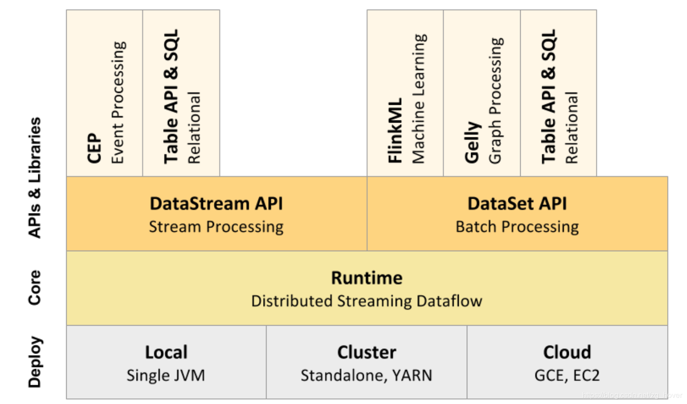


#### 消息传输层&流处理层

- 消息传输层:作为流处理层上游的安全队列,兼具高性能与持久性。数据的生产者与消费者的解藕

Kafka/MapR Stream/AWS Kinesis/AliCloud DataHub

- 消息传输层需要具有可靠的跨地域复制能力。

		具体就是数据中心之间的数据复制需要保存消息偏移量offset
		跨数据中心的流复制能力扩展了流数据与流处理的用途

#### Stream SQL in Flink

Flink 实现了流式处理和批量处理，并在这基础上进一步提供了 Table API 和 SQL 的支持。 其 Table API 和 SQL 基本上实现了之前提到的物化视图增量更新算法。特别地，Flink 还使用了 Apache Calcite 提供的 SQL 解析和优化模块来执行相关任务。

_增量SQL查询算法_

增量SQL查询则意味着我们可以只依赖源数据的改变量，局部地执行查询并更新原来的结果。使用增量模型， 我们往往可以得到更快的执行方案。很显然，Stream SQL 执行就是增量SQL查询：新到达的数据就是在一张“源数据表” 当中新加入的数据项。

	Stream SQL是物化视图维护问题的一个子问题。

_SQL优化与执行规划_

_物化视图增量维护的简单算法(代数算法)_

	对物化视图进行增量维护的最简单算法就是从根算子开始，将其左右两颗子树作为整体看作“似表(Table-Like)”。
	在增量 SQL 查询中，当一个表的内容改变， 我们希望这些表将内容的修改表示成包含增加的行和减少的行的增量表(Delta Table)的形式
	α(T+ΔT)=α(T)+Q(T,ΔT)。 这里 α 代表一个算子，T 是基表，ΔT 是增量表，Q 是一个以 T 和 ΔT 为参数的查询

_查询放大问题及其解决思路_

	1.确保处理过程当中的行唯一性
	2.使得算子保存额外的内部状态
	3.使用近似计算-HyperLogLog
	4.限制或扩充语义

_修改放大问题及其解决思路(最为复杂)_

	1.延迟刷新
	2.限制/扩充语义

_可自我维护性(Self-maintainability)_

_物化视图维护算法增量地执行SQL_

分布式系统中的流式计算

	1.绝对时钟(Absolute Clock)问题-使用事件驱动(Event-Driven)模型来处理
	2.时间倾斜(Time Skew)问题:用水印(Watermark)来处理。水印就是根据消息的事件时间来决定一条消息应该被处理还是被丢弃的标记
	3.在实现严格单次发送(Exactly-Once Delivery)的系统中， 正确管理水印对于防止移除之后仍可能被查询到的条目非常重要

_激发器、水印、窗口和句点_

对于激发器、水印、窗口和句点这些概念，十分建议进一步阅读如下文章和论文:

- Stream 101: The world beyond batch
- Stream 102: The world beyond batch
- The Dataflow Model: A Practical Approach to Balancing Correctness, Latency, and Cost in Massive-Scale, Unbounded, Out-of-Order Data Processing

_Stream Join 的语义_

	1.Stream 与纯静态表 Join。这里的纯静态表的内容不会改变，因此 Join 的实现只是在 Stream 端对每个消息在静态表内进行查询
	2.Stream 与动态表的快照 Join。动态表的内容可能会出现增删改等情况，这里的 Join 的语义是， 当对流当中的某个消息实施 Join ，相当于查询了动态表在那一时刻的快照
	3.Stream 与 Stream Join，操作的两边都是 Stream，这种情况最为复杂也很难实现，在之后将会进一步介绍

#### Flink批流一体

有限流数据是无限流数据的一种特殊形态

1. 流处理构建-DataStream API

		StreamExecutionEnvironment->DataStream->transformation
		检查点，状态管理，水印，窗口与触发器
		Flink对流消息的处理支持三种级别语义分别是“At Most once、At Least once、Exactly once”。

2. 批处理构建-DataSet API

		ExecutionEnvironment->DataSet->transformation
		用于调度和恢复的回溯法，特殊内存数据结构，以及查询优化

- 最终汇集到 流处理引擎 中


#### 2.Spark流处理

Spark从2.3版本开始引入了持续流式处理模型，可将流处理延迟降低至毫秒级别，让 Structured Streaming 达到了一个里程碑式的高度；使用 Pandas UDF 提升 PySpark 的性能；为 Spark 应用程序提供 Kubernetes 原生支持。

出于某些原因的考虑，Spark 引入 Structured Streaming 将微批次处理从高级 API 中解耦出去。首先，它简化了 API 的使用，API 不再负责进行微批次处理。其次，开发者可以将流看成是一个没有边界的表，并基于这些“表”运行查询。

从内部来看，Structured Streaming 引擎基于微批次增量执行查询，时间间隔视具体情况而定，不过这样的延迟对于真实世界的流式应用来说都是可接受的。

在持续模式下，流处理器持续不断地从数据源拉取和处理数据，而不是每隔一段时间读取一个批次的数据，这样就可以及时地处理刚到达的数据。如下图所示，延迟被降低到毫秒级别，完全满足了低延迟的要求。

持续模式目前支持的 Dataset 操作包括 Projection、Selection 以及除 current_timestamp()、current_date()、聚合函数之外的 SQL 操作。它还支持将 Kafka 作为数据源和数据池（Sink），也支持将控制台和内存作为数据池。

开发者可以根据实际的延迟需求来选择使用持续模式还是微批次模式，总之，Structured Streaming 为开发者提供了容错和可靠性方面的保证。以及端到端的毫秒级延迟、至少一次处理保证、支持 Dataset 的映射操作

#### 流到流的连接

Spark-2.3支持内连接和外连接，可用在大量的实时场景中。

广告变现是流到流连接的一个典型应用场景。例如，广告impression流和用户点击流包含相同的键（如 adld）和相关数据，而你需要基于这些数据进行流式分析，找出哪些用户的点击与 adld 相关。

	- 流到流的连接将迟到的数据缓冲起来，直到在另一个流中找到与之匹配的数据。
	- 通过设置水位（Watermark）防止缓冲区过度膨胀。
	- 用户可以在资源消耗和延迟之间作出权衡。

#### 微批处理

结构化流式传输默认使用微批处理执行模型。这意味着Spark流引擎会定期检查流式源，并对自上次批次结束后到达的新数据运行批量查询。从高层来看，它看起来像这样。

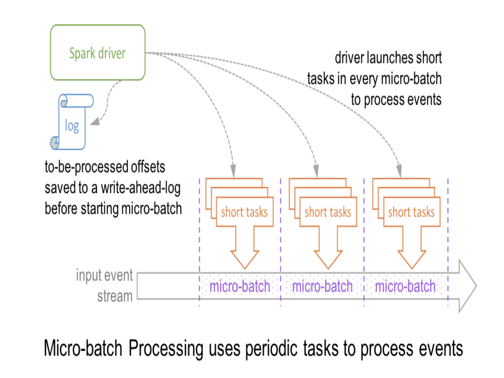

在此体系结构中，驱动程序通过将记录偏移保存到预写日志来检查进度，然后可以使用该日志重新启动查询。请注意，在微批处理开始之前，要在下一个微批处理中处理的范围偏移被保存到日志中，以便获得确定性的重新执行和端到端语义。因此，源记录可能必须等待当前的微批处理完成，然后记录其偏移量并且下一个微批处理它。在记录级别，时间轴看起来像这样。

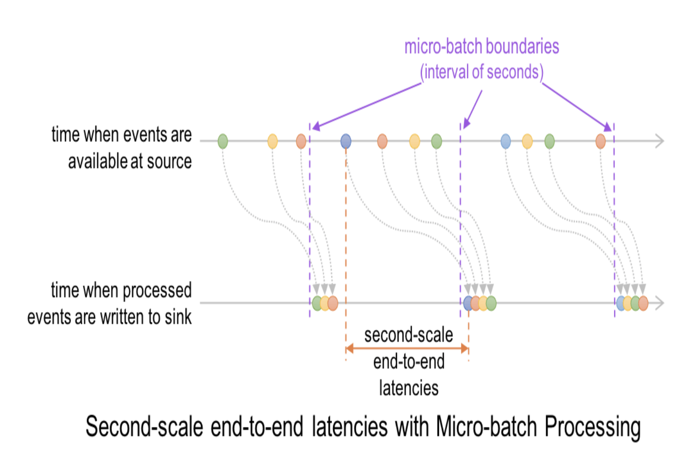

这导致在源处可用事件和将输出写入接收器之间的最佳延迟为100毫秒。

我们最初使用这个微批处理引擎构建了结构化流，以便轻松利用已针对性能进行优化的[Spark SQL](https://databricks.com/glossary/what-is-spark-sql)中的现有批处理引擎（请参阅我们过去关于[代码生成和Project Tungsten的博客](https://databricks.com/blog/2016/05/23/apache-spark-as-a-compiler-joining-a-billion-rows-per-second-on-a-laptop.html)）。这使我们能够实现[Spark高吞吐量](https://databricks.com/blog/2017/10/11/benchmarking-structured-streaming-on-databricks-runtime-against-state-of-the-art-streaming-systems.html)，延迟低至100毫秒。

		Comments:微批处理方法,很难让计算时间窗口与会话时间窗口完全吻合

在过去几年中，在与数千名开发人员和数百个不同用例合作的过程中，我们发现二级延迟足以满足大多数实际的流式工作负载，例如[ETL](https://databricks.com/glossary/extract-transform-load)和实时监控。但是，一些工作负载（例如，上述欺诈检测用例）确实受益于更低的延迟，这促使我们建立连续处理模式。让我们了解这是如何工作的。

#### 连续处理

在连续处理模式中，Spark不会启动定期任务，而是启动一组长时间运行的任务，这些任务可以连续读取，处理和写入数据。在较高的层次上，设置和记录级时间线看起来像这些（与上面的微批处理执行图对比）。

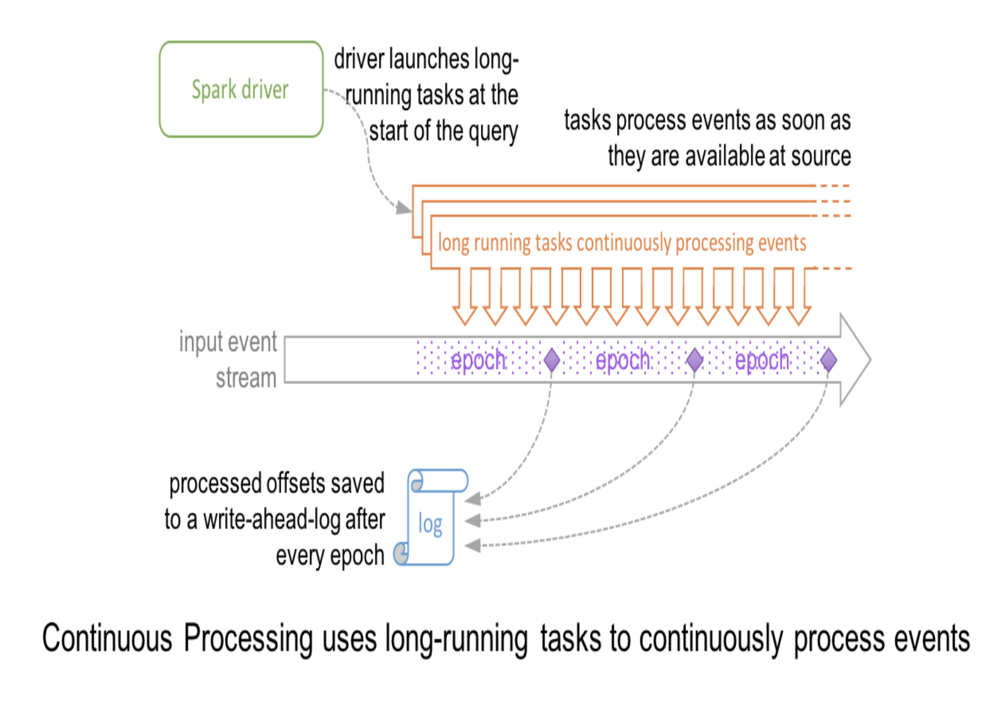

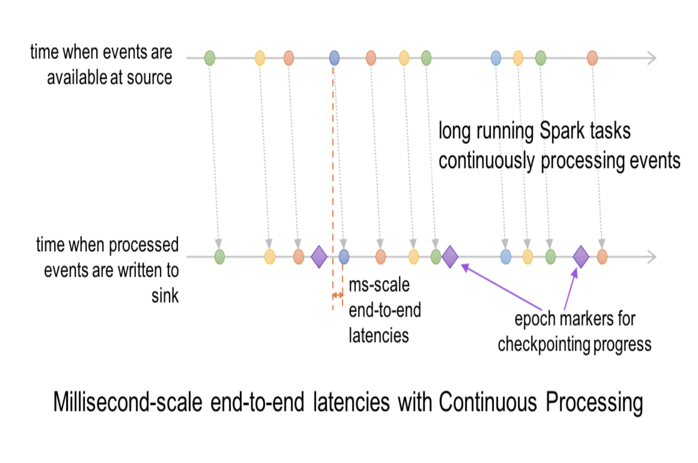

由于事件在源中可用时被处理并写入接收器，因此端到端延迟是几毫秒。

##### 分布式快照Chandy-Lamport算法

* Apache Spark Streaming

	Spark 的 Structured Streaming 的 Continuous Processing Mode 的容错处理使用了分布式快照（Distributed Snapshot）算法 Chandy-Lamport 算法。
	此外，通过改编众所周知的[Chandy-Lamport算法](https://en.wikipedia.org/wiki/Chandy-Lamport_algorithm)来检查查询进度。特殊标记记录被注入到每个任务的输入数据流中; 我们将它们称为“epoch markers”，将它们之间的差距称为“epochs.”。当任务遇到标记时，任务异步报告处理的最后一个偏移量。一旦驱动程序收到写入接收器的所有任务的偏移量，它就会将它们写入前面提到的预写日志。由于检查点完全异步，因此任务可以不间断地继续，并提供一致的毫秒级延迟。

* Apache Flink 

	Flink通过 Chandy-Lamport 快照算法的一个变种改进算法来实现异步的全局一致**Checkpoint**。其名称为Asynchronous barrier snapshots算法。其作用就是通过研究“Exactly once”执行语义，其实就是研究理解ABS算法。在出现故障时将系统重置回正确状态。

	Flink 也提供了**Savepoint**的概念，Savepoint 是一种包含更全面信息的 Checkpoint。 虽然需要花费更多时间来构建 Savepoint，它却使得系统状态回滚和迁移变得方便。


		Comments:流处理可实现计算时间窗口与会话时间窗口完全吻合


* Flink inside process

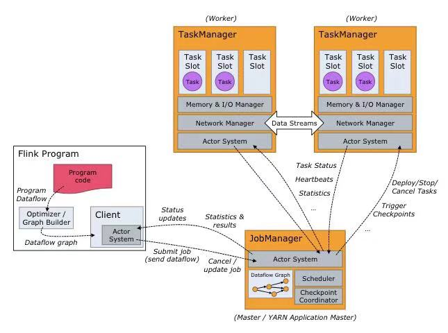


#### 端到端的一致性与数据库的流处理器


### III.Flink & Spark 设计差异

#### 1.运行角色

* Spark Streaming 运行时的角色(standalone 模式)主要有：

		Master：主要负责整体集群资源的管理和应用程序调度；
		Worker：负责单个节点的资源管理，driver 和 executor 的启动等；
		Driver：用户入口程序执行的地方，即 SparkContext 执行的地方，主要是 DAG 生成、stage 划分、task 生成及调度；
		Executor：负责执行 task，反馈执行状态和执行结果。

* Flink 运行时的角色(standalone 模式)主要有：

		Jobmanager：协调分布式执行，他们调度任务、协调 checkpoints、协调故障恢复等。至少有一个 JobManager。高可用情况下可以启动多个 JobManager，其中一个选举为 leader，其余为 standby；
		Taskmanager： 负责执行具体的 tasks、缓存、交换数据流，至少有一个 TaskManager；
		Slot：每个 task slot 代表 TaskManager 的一个固定部分资源，Slot 的个数代表着 taskmanager 可并行执行的 task 数。

#### 2.运行模型

Spark Streaming是微批处理，运行的时候需要指定批处理的时间，每次运行 job 时处理一个批次的数据，流程如图 3 所示：

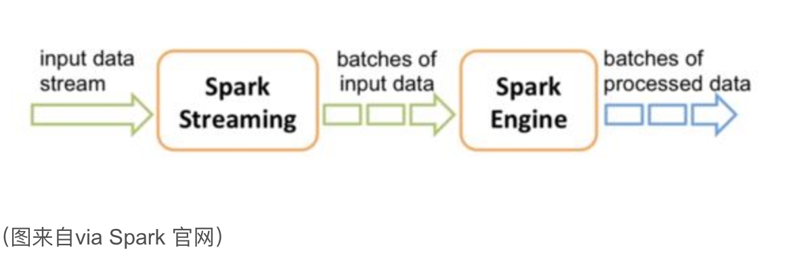

Flink 是基于事件驱动的，事件可以理解为消息。事件驱动的应用程序是一种状态应用程序，它会从一个或者多个流中注入事件，通过触发计算更新状态，或外部动作对注入的事件作出反应。

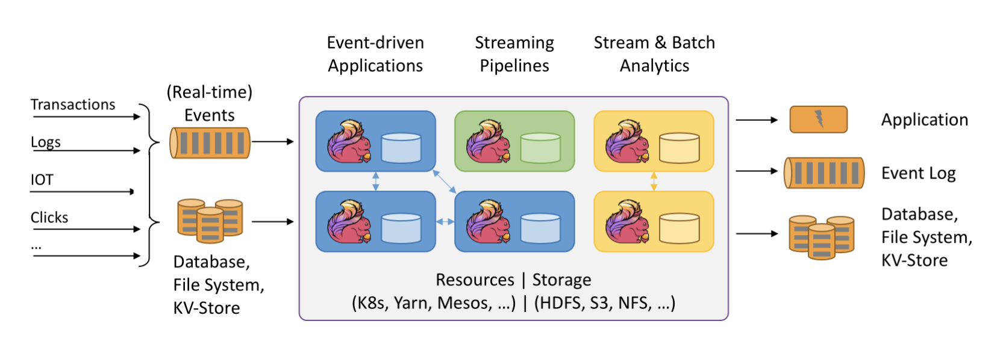

#### 3.代码执行步骤

* Spark 与 Kafka 结合执行代码步骤：

	1.设置批处理时间；
	2.创建数据流；
	3.编写 transform；
	4.编写 action；
	5.启动执行。

* Flink 与 Kafka 结合执行代码步骤：

Flink 与 Kafka 结合是事件驱动，所以Flink 内部对 Poll 出来的数据进行了整理，然后逐条 emit，形成了事件触发的机制。

	1.注册数据 source；
	2.编写运行逻辑；
	3.注册数据 sink。
	4.调用 env.execute 执行逻辑

	Compare:相比于 Spark Streaming 少了设置批处理时间，还有一个显著的区别是 flink 的所有算子都是 lazy 形式的，调用 env.execute 会构建 jobgraph。
	client 端负责 Jobgraph 生成并提交它到集群运行；而 Spark Streaming的操作算子分 action 和 transform，其中仅有 transform 是 lazy 形式，而且 DAG 生成、stage 划分、任务调度是在 driver 端进行的，在 client 模式下 driver 运行于客户端处。

#### 4.任务调度原理

##### Spark 任务调度

Spark Streaming 任务是基于微批处理的，实际上每个批次都是一个 Spark Core 的任务。对于编码完成的 Spark Core 任务在生成到最终执行结束主要包括以下几个部分：

构建 DAG 图；划分 stage；生成 taskset；调度 task。具体可参考图 5：

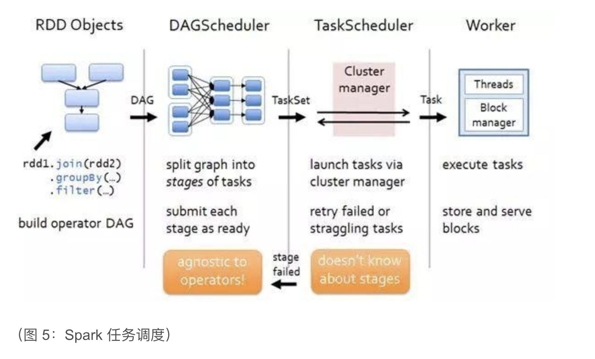

对于 job 的调度执行有 fifo 和 fair 两种模式，Task 是根据数据本地性调度执行的。

假设每个 Spark Streaming 任务消费的 Kafka topic 有四个分区，中间有一个 transform操作（如 map）和一个 reduce 操作，如图 6 所示：

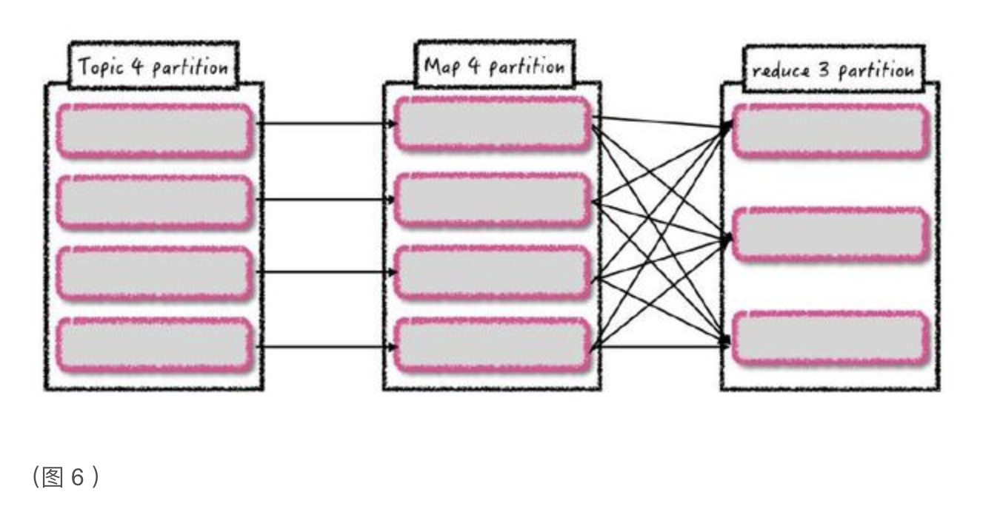

假设有两个 executor，其中每个 executor 三个核，那么每个批次相应的 task 运行位置是固定的吗？是否能预测？

由于数据本地性和调度不确定性，每个批次对应 Kafka 分区生成的 task 运行位置并不是固定的。

##### Flink 任务调度

对于 Flink 的流任务客户端首先会生成 StreamGraph，接着生成 JobGraph，然后将 jobGraph 提交给 Jobmanager 由它完成 jobGraph 到 ExecutionGraph 的转变，最后由 jobManager 调度执行。

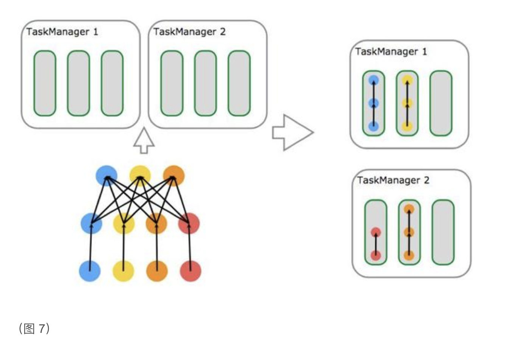

如上图 所示有一个由 data source、MapFunction和 ReduceFunction 组成的程序，data source 和 MapFunction 的并发度都为 4，而 ReduceFunction 的并发度为 3。

一个数据流由 Source-Map-Reduce 的顺序组成，在具有 2 个TaskManager、每个 TaskManager 都有 3 个 Task Slot 的集群上运行。

	Tips:可以看出 Flink 的拓扑生成提交执行之后，除非故障，否则拓扑部件执行位置不变，并行度由每一个算子并行度决定，类似于 Storm。
	而 Spark Streaming 是每个批次都会根据数据本地性和资源情况进行调度，无固定的执行拓扑结构。
	Flink 是数据在拓扑结构里流动执行，而 Spark Streaming 则是对数据缓存批次并行处理。

#### 5.时间机制对比

##### 流处理的时间

流处理程序在时间概念上总共有三个时间概念：

_事件时间_

	事件时间是指事件在其设备上发生的时间，这个时间在事件 进入 Flink 之前 已经嵌入事件，然后 Flink 可以提取该时间。
	基于事件时间进行处理的流程序可以保证事件在处理的时候的顺序性，但是基于事件时间的应用程序必须要结合 watermark 机制(需指定)。 
	基于事件时间的处理往往有一定的滞后性，因为它需要等待后续事件和处理无序事件，对于时间敏感的应用使用的时候要慎重考虑。

_处理时间_

	处理时间是指每台机器的系统时间，当流程序采用处理时间时将使用运行各个运算符实例的机器时间。
	处理时间是最简单的时间概念，不需要流和机器之间的协调，它能提供最好的性能和最低延迟。 
	然而在分布式和异步环境中，处理时间不能提供消息事件的时序性保证，因为它受到消息传输延迟，消息在算子之间流动的速度等方面制约。

_注入时间_

	注入时间是事件 source 注入到 Flink 的时间。事件在 source 算子处获取 source 的当前时间作为事件注入时间，后续的基于时间的处理算子会使用该时间处理数据。 
	相比于事件时间，注入时间不能够处理无序事件或者滞后事件，但是应用程序无需指定如何生成 watermark。 
	**在内部注入时间程序的处理和事件时间类似，但是时间戳分配和 watermark 生成都是自动的。*

下图可以清晰地看出三种时间的区别：

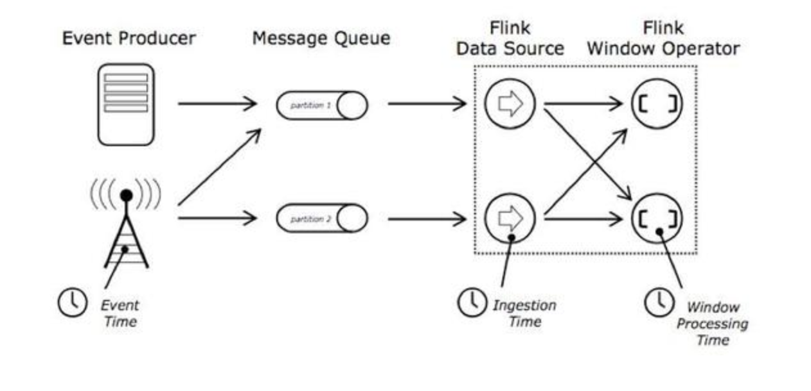

##### Spark 时间机制

Spark Streaming 只支持处理时间。

Structured streaming 支持处理时间和事件时间，同时支持 watermark 机制处理滞后数据。

##### Flink 时间机制

Flink 支持三种时间机制：事件时间、注入时间、处理时间，同时支持 watermark 机制处理滞后数据。

- timeWindow时间窗口
- countWindow计数窗口:按元素数量来切分
- SessionWindow会话窗口

对于watermark，重启后，历史数据被覆盖（from 2018.11.18 Flink China 的分享）,解决方法：

#### 6.Kafka 动态分区检测

对于有实时处理业务需求的企业，随着业务增长数据量也会同步增长，将导致原有的 Kafka 分区数不满足数据写入所需的并发度，需要扩展 Kafka 的分区或者增加 Kafka 的 topic，这时就要求实时处理程序。SparkStreaming（与 Kafka 0.10 版本结合支持动态分区检测）、Flink（创建一个线程，该线程会定期检测 Kafka 新增分区，然后将其添加到 kafkaFetcher 里） 都能动态发现新增topic分区并消费处理新增分区的数据。

	Tips: Spark 无需做任何配置就可动态发现 Kafka 新增分区.而Flink需要将 flink.partition-discovery.interval-millis 该属性设置为大于 0 。

#### 7.容错机制

##### Structured Streaming

Structured Streaming采取检查点机制，把进度offset写入stable的存储中，用JSON的方式保存支持向下兼容，允许从任何错误点（例如自动增加一个过滤来处理中断的数据）进行恢复。这样确保了端到端数据的exactly-once。

##### Spark Streaming容错

对于 Spark Streaming 任务，我们可以设置 checkpoint，然后假如发生故障并重启，我们可以从上次 checkpoint 之处恢复，但是这个行为只能使得数据不丢失，可能会重复处理，不能做到恰一次处理语义。

对于 Spark Streaming 与 Kafka 结合的 direct Stream 可以自己维护 offset 到 Zookeeper、Kafka 或任何其它外部系统，每次提交完结果之后再提交 offset，这样故障恢复重启可以利用上次提交的 offset 恢复，保证数据不丢失。

但是假如故障发生在提交结果之后、提交 offset 之前会导致数据多次处理，这个时候我们需要保证处理结果多次输出不影响正常的业务。

由此可以分析，假设要保证数据恰一次处理语义，那么结果输出和 offset 提交必须在一个事务内完成。在这里有以下两种做法：

	1.repartition(1) Spark Streaming 输出的 action 变成仅一个 partition，这样可以利用事务去做：Dstream.foreachRDD(rdd=>{ rdd.repartition(1).foreachPartition(partition=>{ // 开启事务 partition.foreach(each=>{// 提交数据 }) // 提交事务 }) })
	2.将结果和 offset 一起提交。也就是结果数据包含 offset。这样提交结果和提交 offset 就是一个操作完成，不会数据丢失，也不会重复处理。故障恢复的时候可以利用上次提交结果带的 offset。

##### Flink容错

Flink的exactly-once实现稍加复杂，有如下可能会失去savepoint：

	首次启动Flink程序
	State相关的类被修改
	Savepoint文件意外损坏
	修改Job的MaxParallelism

具体细节（Flink 与 kafka 0.11 保证仅一次处理):

若要 sink 支持仅一次语义，必须以事务的方式写数据到 Kafka，这样当提交事务时两次 checkpoint 间的所有写入操作作为一个事务被提交。这确保了出现故障或崩溃时这些写入操作能够被回滚。

在一个分布式且含有多个并发执行 sink 的应用中，仅仅执行单次提交或回滚是不够的，因为所有组件都必须对这些提交或回滚达成共识，这样才能保证得到一致性的结果。

Flink 使用两阶段提交协议以及预提交(pre-commit)阶段来解决这个问题。

本例中的 Flink 应用如下图所示包含以下组件：

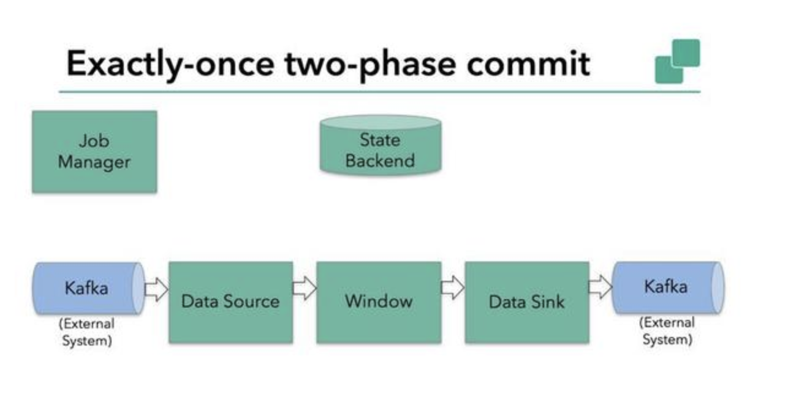

一个source，从Kafka中读取数据（即KafkaConsumer）；一个时间窗口化的聚会操作；一个sink，将结果写回到Kafka（即KafkaProducer）。

下面详细讲解 Flink 的两段提交思路：

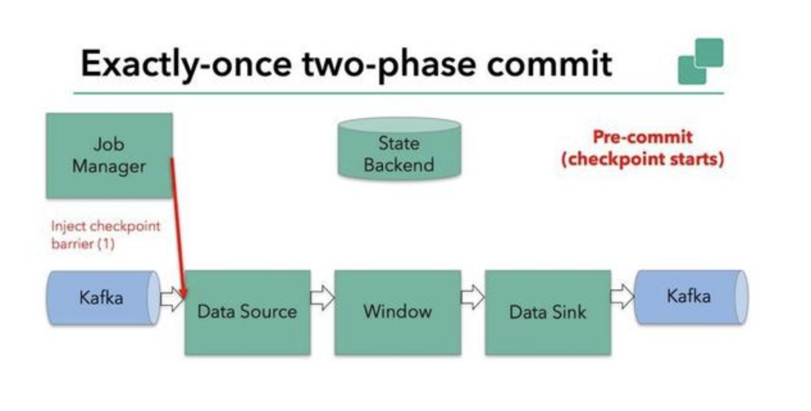

如图所示，Flink checkpointing 开始时便进入到 pre-commit 阶段。

具体来说，一旦 checkpoint 开始，Flink 的 JobManager 向输入流中写入一个 checkpoint barrier ，将流中所有消息分割成属于本次 checkpoint 的消息以及属于下次 checkpoint 的，barrier 也会在操作算子间流转。

对于每个 operator 来说，该 barrier 会触发 operator 状态后端为该 operator 状态打快照。

data source 保存了 Kafka 的 offset，之后把 checkpoint barrier 传递到后续的 operator。

这种方式仅适用于 operator 仅有它的内部状态。内部状态是指 Flink state backends 保存和管理的内容（如第二个 operator 中 window 聚合算出来的 sum）。

当一个进程仅有它的内部状态的时候，除了在 checkpoint 之前将需要将数据更改写入到 state backend，不需要在预提交阶段做其他的动作。

在 checkpoint 成功的时候，Flink 会正确的提交这些写入，在 checkpoint 失败的时候会终止提交，过程可见图：

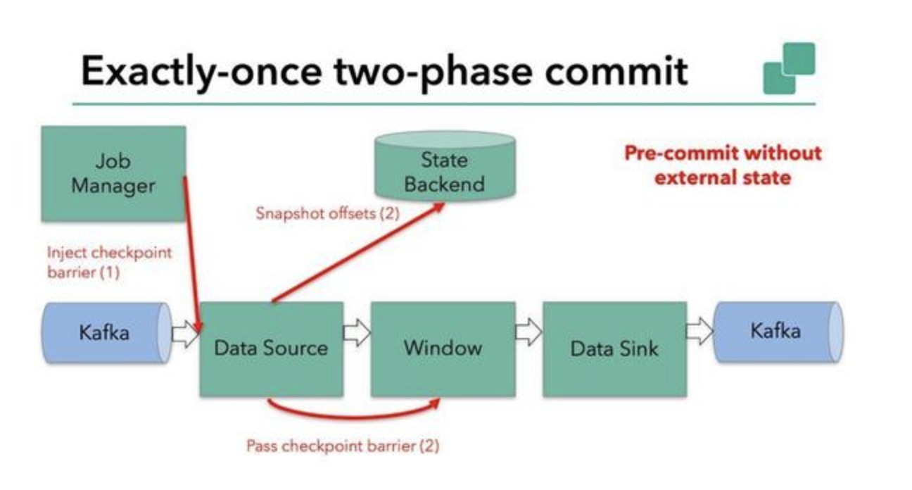

当结合外部系统的时候，外部系统必须要支持可与两阶段提交协议捆绑使用的事务。

显然本例中的 sink 由于引入了 kafka sink，因此在预提交阶段 data sink 必须预提交外部事务。如下图：

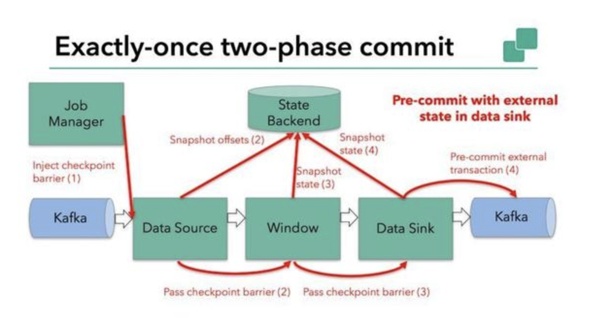

当 barrier 在所有的算子中传递一遍，并且触发的快照写入完成，预提交阶段完成。

所有的触发状态快照都被视为 checkpoint 的一部分，也可以说 checkpoint 是整个应用程序的状态快照，包括预提交外部状态。出现故障可以从 checkpoint 恢复。

下一步就是通知所有的操作算子 checkpoint 成功。该阶段 jobmanager 会为每个 operator 发起 checkpoint 已完成的回调逻辑。

本例中 data source 和窗口操作无外部状态，因此该阶段，这两个算子无需执行任何逻辑，但是 data sink 是有外部状态的，因此，此时我们必须提交外部事务，如下图：

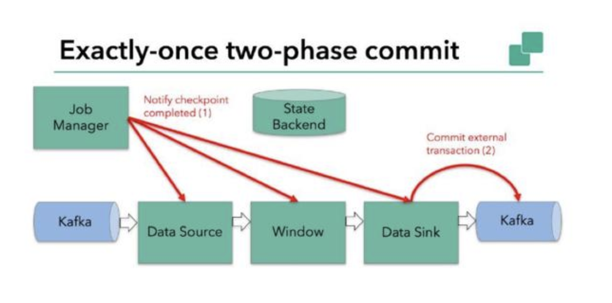

以上就是 Flink 实现恰一次处理的基本逻辑。

#### 8.Back pressure(备压)

消费者消费的速度低于生产者生产的速度，为了使应用正常，消费者会反馈给生产者来调节生产者生产的速度，以使得消费者需要多少，生产者生产多少。Pull模式解决生产者生产过多导致内容及存储的挤压。（\*back pressure 后面一律称为背压。）

##### Spark Streaming 的背压

Spark Streaming 跟 Kafka 结合是存在背压机制的，目标是根据当前 job 的处理情况来调节后续批次的获取 Kafka 消息的条数。

为了达到这个目的，Spark Streaming 在原有的架构上加入了一个 RateController，利用的算法是 PID，需要的反馈数据是任务处理的结束时间、调度时间、处理时间、消息条数。

这些数据是通过 SparkListener 体系获得，然后通过 P 的 compute 计算得到一个速率，进而可以计算得到一个 offset，然后跟限速设置最大消费条数比较得到一个最终要消费的消息最大 offset。

P 的 compute 方法：

```scala
def compute( time: Long, // in milliseconds
numElements: Long, processingDelay: Long, // in milliseconds
schedulingDelay: Long// in milliseconds
): Option[Double] = {
logTrace(s"\ntime = $time, # records = $numElements, " + s"processing time = $processingDelay, scheduling delay = $schedulingDelay")
this.synchronized {
if (time > latestTime && numElements > 0 && processingDelay > 0) {
val delaySinceUpdate = (time - latestTime).toDouble / 1000
val processingRate = numElements.toDouble / processingDelay * 1000
val error = latestRate - processingRate
val historicalError = schedulingDelay.toDouble * processingRate / batchIntervalMillis
val dError = (error - latestError) / delaySinceUpdate
val newRate = (latestRate - proportional * error - integral * historicalError - derivative * dError).max(minRate)
logTrace(s""" | latestRate = $latestRate, error = $error | latestError = $latestError, historicalError = $historicalError | delaySinceUpdate = $delaySinceUpdate, dError = $dError """.stripMargin)
latestTime = time if (firstRun) {
latestRate = processingRate latestError = 0D firstRun = false
logTrace("First run, rate estimation skipped") None }
else {
latestRate = newRate latestError = error
logTrace(s"New rate = $newRate")
Some(newRate)
}
} else {
logTrace("Rate estimation skipped") None
}
}
}
```

##### Flink 的背压

与 Spark Streaming 的背压不同的是，Flink 背压是 jobmanager 针对每一个 task 每 50ms 触发 100 次 Thread.getStackTrace() 调用，求出阻塞的占比。过程如图所示：

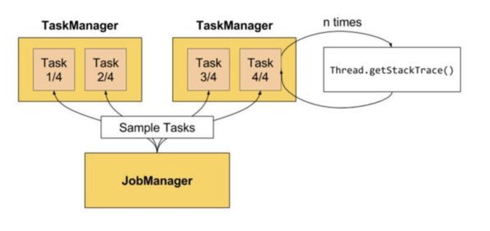

阻塞占比在 web 上划分了三个等级：

	- OK: 0 <= Ratio <= 0.10，表示状态良好；
	- LOW: 0.10 < Ratio <= 0.5，表示有待观察；
	- HIGH: 0.5 < Ratio <= 1，表示要处理了。


### IV.Solution

1.零售与市场营销

2.物联网

3.视频实时识别

4.流量分析与异常检测

5.银行与金融分析

风控与反欺诈

### X.Ref

- [Streaming Architecture]
- [Stream SQL的执行原理与Flink的实现](https://io-meter.com/2019/03/16/streaming-incremental-sql-execution/)

