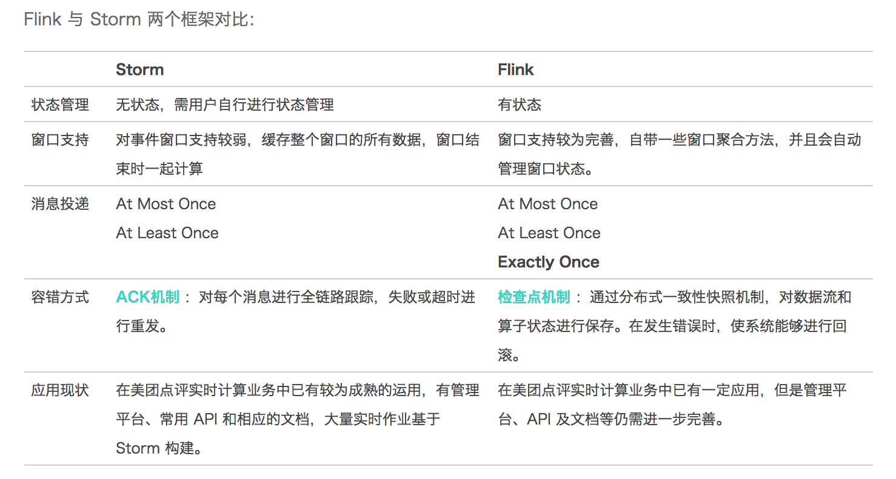

## 大数据处理框架研究笔记
---------------------------------------------------

### Apache Flink

Apache Flink is an open-source stream processing framework for distributed, high-performing, always-available, and accurate data streaming applications.

Flink是既可以流处理,又可以批处理

1. 流处理构建

StreamExecutionEnvironment->DataStream->transformation

2. 批处理构建

ExecutionEnvironment->DataSet->transformation

_Ref:_

- [Flink Doc](https://ci.apache.org/projects/flink/flink-docs-release-1.5/)

### Spark Streaming

Spark Streaming是将实时数据流按时间段分段后,当作小的批处理数据去计算

#### Flink & Storm技术比较

