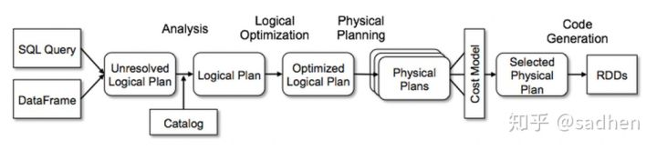

## 查询优化器设计研究
-------------------------------------------

### Apache Calcite数据框架

### SparkSQL Catalyst优化器

Catalyst这部分代码完成的是从SQL到Optimized Logical Plan，后面的Physical Planning则位于｀sql/core｀下面。大概有这么几个组件需要展开细看：ParserAnalyzer(with Catalog)Optimizer和Catalyst具有类似功能的是Apache Calcite，像Hive, Phoenix都有在用Calcite，折腾完Catalyst，可以去看一看两者的异同。如果要快速理解Catalyst，我建议从 @连城 的项目 [liancheng/spear](https://link.zhihu.com/?target=https%3A//github.com/liancheng/spear) 入手，完整地阅读一遍，相信会有很多收获。

### Hive SQL Optimizer

