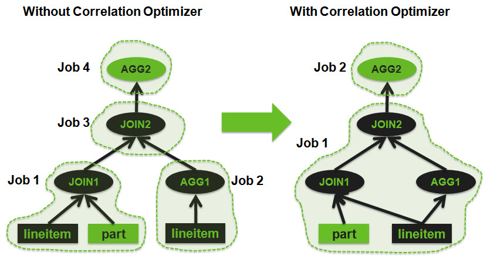
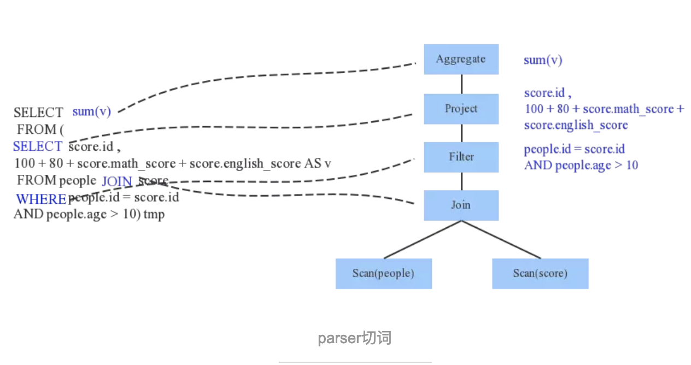
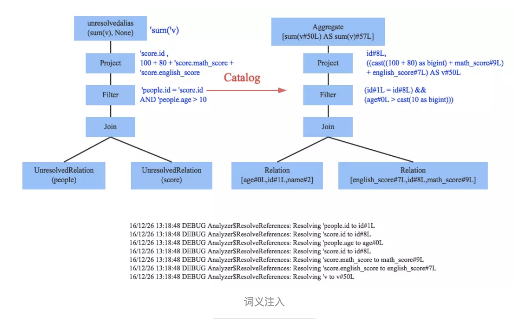
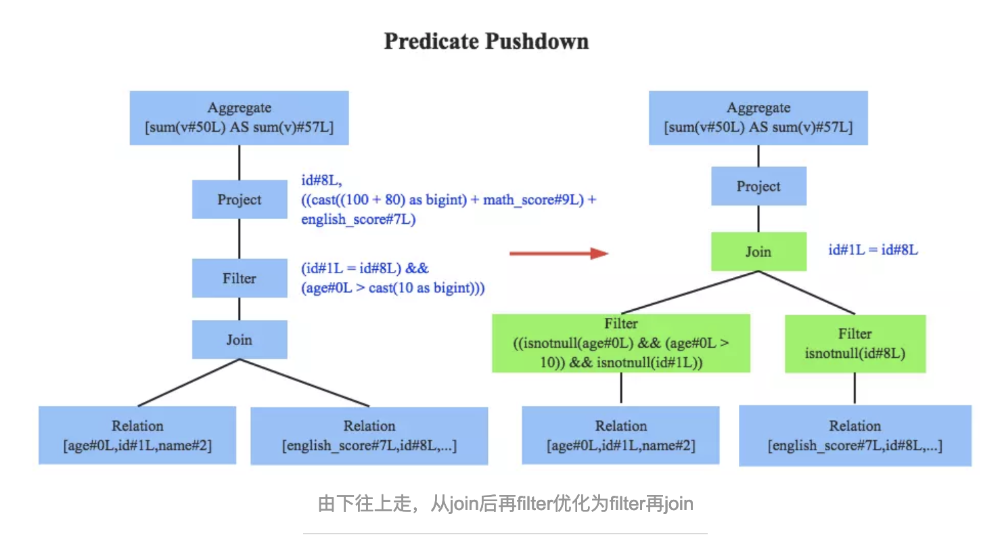
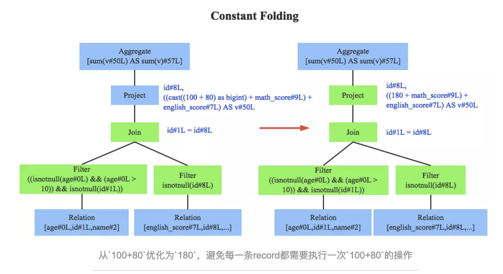
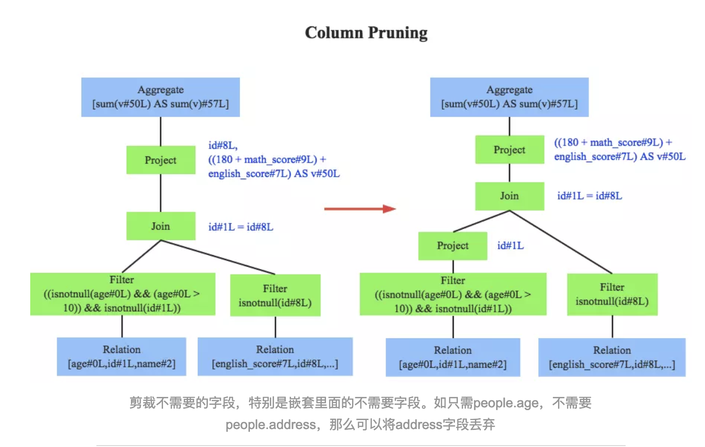
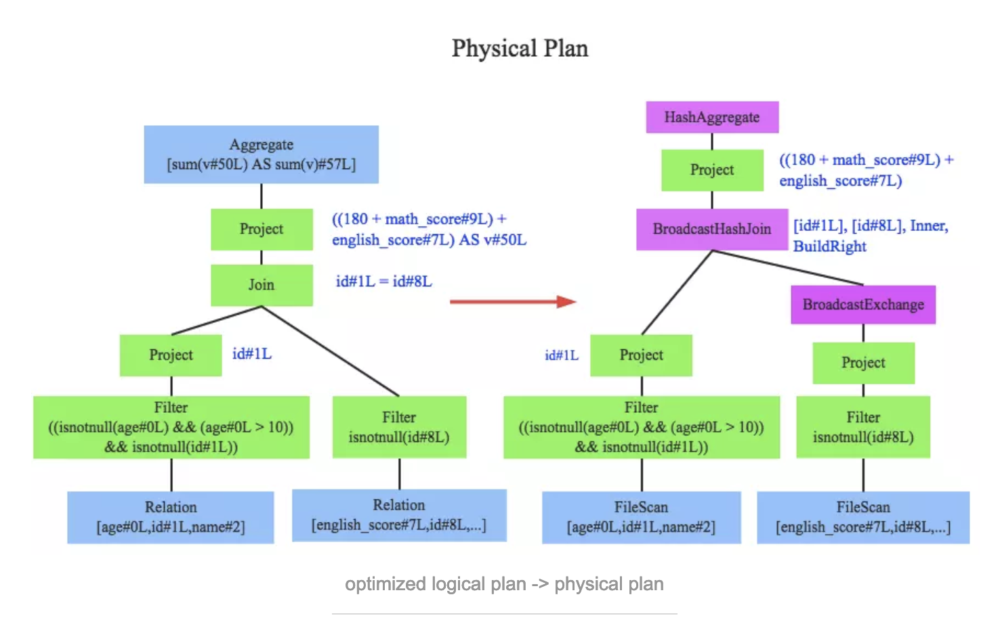

## 查询优化器设计研究
---------------------------------------------------------

### 1.查询优化器概述

数据库主要由三部分组成，分别是解析器、查询优化器和执行引擎，如下图所示：


其中优化器是数据库中用于把关系表达式转换成执行计划的核心组件，很大程度上决定了一个系统的性能。

#### 查询优化技术


**查询优化分类:**

    - 查询重用
    - 查询算法优化
    - 并行查询优化
    - 分布式查询优化


#### 查询计划策略分类

无论是RBO，还是CBO都包含了一系列优化规则，这些优化规则可以对关系表达式进行等价转换，常见的优化规则包含：

- 谓词下推(Predicate pushdown)-始终将过滤表达式尽可能移至靠近数据源的位置
- [列裁剪](https://www.baidu.com/s?wd=%E5%88%97%E8%A3%81%E5%89%AA&rsv_spt=1&rsv_iqid=0x86c1129c00005528&issp=1&f=8&rsv_bp=0&rsv_idx=2&ie=utf-8&tn=baiduhome_pg&rsv_enter=1&rsv_sug3=5&rsv_sug1=5&rsv_sug7=100)
- 常量折叠-主要指的是编译期常量加减乘除的运算过程会被折叠
- 其他

在这些优化规则的基础上，就能对关系表达式做相应的等价转换，从而生成执行计划。下面将介绍RBO和CBO两种优化器的执行过程。

**Rule-Based Optimizer(RBO,基于规则策略的优化器)**

根据优化规则对关系表达式进行转换,这里的转换是说一个关系表达式经过优化规则后会变成另外一个关系表达式,同时原有表达式会被裁剪掉,经过一系列转换后生成最终的执行计划。
RBO中包含了一套有着严格顺序的优化规则，同样一条SQL，无论读取的表中数据是怎么样的，最后生成的执行计划都是一样的。同时,在RBO中SQL写法的不同很有可能影响最终的执行计划，从而影响脚本性能。


_RBO的执行过程比较简单,主要包含两个步骤:_

1）Transformation

遍历关系表达式，只要模式能够满足特定优化规则就进行转换。

2）Build Physical Plan

经过Step1之后就生成了一个逻辑执行计划，但这只是逻辑上可行，还需要将逻辑执行计划build成物理执行计划，即决定各个Operator的具体实现。如Join算子的具体实现选择BroadcastHashJoin还是SortMergeJoin。


**Cost-Based Optimizer(CBO,基于代价策略的优化器)**

根据优化规则对关系表达式进行转换，这里的转换是说一个关系表达式经过优化规则后会生成另外一个关系表达式，同时原有表达式也会保留，经过一系列转换后会生成多个执行计划，然后CBO会根据统计信息和代价模型(Cost Model)计算每个执行计划的Cost，从中挑选Cost最小的执行计划。由上可知，CBO中有两个依赖：统计信息和代价模型。统计信息的准确与否、代价模型的合理与否都会影响CBO选择最优计划。

从上述描述可知，CBO是优于RBO的，原因是RBO是一种只认规则，对数据不敏感的呆板的优化器，而在实际过程中，数据往往是有变化的，通过RBO生成的执行计划很有可能不是最优的。

事实上目前各大数据库和大数据计算引擎都倾向于使用CBO，例如从Oracle 10g开始，Oracle已经彻底放弃RBO，转而使用CBO；而Hive在0.14版本中也引入了CBO。


_CBO查询优化主要包含三个步骤:_

1）Exploration

    根据优化规则进行等价转换，生成等价关系表达式，此时原有关系表达式会被保留。

2）Build Physical Plan

    决定各个Operator的具体实现。

3）Find Best Plan

    根据统计信息计算各个执行计划的Cost，选择Cost最小的执行计划。


CBO实现有两种模型，即Volcano模型[1]和Cascades模型[2].

    其中Calcite使用的是Volcano模型，而GPOrca[3]使用的是Cascades模型。这两种模型的思想基本相同，不同点在于Cascades模型并不是先Explore、后Build，而是边Explore边Build，从而进一步裁剪掉一些执行计划。


**History-Based Optimizer(HBO,基于历史策略的优化器)**

重用历史查询结果来优化查询任务

**分布式查询优化**

主要是解决网络间分布式数据交换的策略问题,实现查询优化


### 2.SQL查询优化器分析


#### 2.1.查询重写器 Query Rewriter(视图重写)

- 预优化查询SQL
- 避免不必要的运算
- 查询重写&语义解析优化(逻辑优化)
- 帮助优化器找到合理的最佳解决方案

查询重写部分规则:

    - 视图合并：如果你在查询中使用视图，视图就会转换为它的 SQL 代码。
    - 子查询扁平化：子查询是很难优化的，因此重写器会尝试移除子查询
    - 去除不必要的运算符：比如，如果你用了 DISTINCT，而其实你有 UNIQUE 约束（这本身就防止了数据出现重复），那么 DISTINCT 关键字就被去掉了。
    - 排除冗余的联接：如果相同的 JOIN 条件出现两次，比如隐藏在视图中的 JOIN 条件，或者由于传递性产生的无用 JOIN，都会被消除。
    - 常数计算赋值：如果你的查询需要计算，那么在重写过程中计算会执行一次。比如 WHERE AGE > 10+2 会转换为 WHERE AGE > 12 ， TODATE(“日期字符串”) 会转换为 datetime 格式的日期值。
    - (高级)分区裁剪(Partition Pruning):如果你用了分区表，重写器能够找到需要使用的分区。
    - (高级)物化视图重写(Materialized view rewrite):如果你有个物化视图匹配查询谓词的一个子集，重写器将检查视图是否最新并修改查询，令查询使用物化视图而不是原始表。
    - (高级)自定义规则：如果你有自定义规则来修改查询（就像 Oracle policy），重写器就会执行这些规则。
    - (高级)OLAP转换：分析/加窗 函数，星形联接，ROLLUP 函数……都会发生转换(但我不确定这是由重写器还是优化器来完成，因为两个进程联系很紧，必须看是什么数据库)

SQL查询重写优化规则=等价转换:

    - 谓词下推(Predicate pushdown)-始终将过滤表达式尽可能移至靠近数据源的位置
    - [列裁剪](https://www.baidu.com/s?wd=%E5%88%97%E8%A3%81%E5%89%AA&rsv_spt=1&rsv_iqid=0x86c1129c00005528&issp=1&f=8&rsv_bp=0&rsv_idx=2&ie=utf-8&tn=baiduhome_pg&rsv_enter=1&rsv_sug3=5&rsv_sug1=5&rsv_sug7=100)
    - 常量折叠-主要指的是编译期常量加减乘除的运算过程会被折叠
    - 子查询&子连接提升
    - 表达式预处理
    - 外连接消除
    - 连接顺序交换
 
**_逻辑查询优化_**

   

**_物理查询优化_**

#### 2.2.常规操作

    TableScan,Join,Sorting,Aggregate

#### 2.3.优化模式
  
- 基于规则策略的优化器(Rule-Based Optimizer，RBO)
- 基于代价策略的优化器(Cost-Based Optimizer，CBO)
- Choose：默认的情况下Oracle用的便是这种方式。指的是当一个表或索引有统计信息，则走CBO的方式，如果表或索引没统计信息，表又不是特别的小，而且相应的列有索引时，那么就走索引，走RBO的方式。
- FirstRows：它与Choose方式是类似的，所不同的是当一个表有统计信息时，它将是以最快的方式返回查询的最先的几行，从总体上减少了响应时间。
- All Rows:也就是我们所说的Cost的方式，当一个表有统计信息时，它将以最快的方式返回表的所有的行，从总体上提高查询的吞吐量。没有统计信息则走RBO的方式。

**A.TableScan:执行计划与扫描**

    - 存取路径-获取数据的方式
    - 全扫描Full Scan(Sequential Scan) / Index Scan
    - 范围扫描 Range Scan /  索引范围扫描
    - 唯一扫描 Unique Scan
    - 根据ROW ID存取
    - 其他路径

由于所有存取路径的真正问题是磁盘I/O问题

**B.内关系与外关系(inner relation and outer relation)**

    - 外关系是左侧数据集
    - 内关系是右侧数据集
    - 针对外关系的每一行
    - 查看内关系里的所有行来寻找匹配的行
    - 内关系必须是最小的，因为它有更大机会装入内存


    Tips:查询优化包含将外联接关系转换为内联接关系

**C.JOIN优化-联接算法**

#### 2.4.联接算法分类

**Nested Loop Join -嵌套循环联接算法需要 N + N x M 次访问(每次访问读取一行) – 大表JOIN小表**

    1) With Inner Sequential Scan(FullScan)
    2) With Inner Index Scan

**Merge Join -唯一排序归并联接算法**

    1) O(N x Log(N) + M x Log(M))-需排序
    2) O(N+M)-已排序,我们是只挑选相同的元素。
    3) 在两个关系中，比较当前元素（当前=头一次出现的第一个）
    4) 如果相同，就把两个元素都放入结果，再比较两个关系里的下一个元素
    5) 如果不同，就去带有最小元素的关系里找下一个元素（因为下一个元素可能会匹配）
    6) 重复 1、2、3步骤直到其中一个关系的最后一个元素。

**Hash Join -复杂度就是 O(M+N) – 类似大小的表join**

    哈希联接的道理是：
    1) 读取内关系的所有元素
    2) 在内存里建一个哈希表
    3) 逐条读取外关系的所有元素
    4) (用哈希表的哈希函数)计算每个元素的哈希值，来查找内关系里相关的哈希桶内
    5) 是否与外关系的元素匹配
    6) 生成哈希表需要时间


#### 2.5.联接运算算法选择

    - 空闲内存：没有足够的内存的话就跟强大的哈希联接拜拜吧(至少是完全内存中哈希联接)。
    - 两个数据集的大小。比如，如果一个大表联接一个很小的表，那么嵌套循环联接就比哈希联接快，因为后者有创建哈希的高昂成本；如果两个表都非常大，那么嵌套循环联接CPU成本就很高昂。
    - 是否有索引：有两个B+树索引的话，聪明的选择似乎是合并联接(MergeJoin)。
    - 结果是否需要排序：即使你用到的是未排序的数据集，你也可能想用成本较高的合并联接（带排序的），因为最终得到排序的结果后，你可以把它和另一个合并联接串起来（或者也许因为查询用 ORDER BY/GROUP BY/DISTINCT 等操作符隐式或显式地要求一个排序结果）。
    - 关系是否已经排序：这时候合并联接是最好的候选项。
    - 联接的类型：是等值联接（比如 tableA.col1 = tableB.col2 ）？ 还是内联接？外联接？笛卡尔乘积？或者自联接？有些联接在特定环境下是无法工作的。
    - 数据的分布：如果联接条件的数据是倾斜的（比如根据姓氏来联接人，但是很多人同姓），用哈希联接将是个灾难，原因是哈希函数将产生分布极不均匀的哈希桶。
    - 如果你希望联接操作使用多线程或多进程。

#### 2.6.多表联接算法

核心问题算法应用

    * 多表间的连接顺序表示查询计划树的基本形态
    * 多表连接的搜索空间

动态规划/启发式算法/贪婪算法/遗传算法

    * 完全动态规划算法 - O(3^N)
      它们都有相同的子树(A JOIN B),所以,不必在每个计划中计算这个子树的成本,计算一次,保存结果,当再遇到这个子树时重用。
    * 启发式算法 - 附加额外规则
    * 贪婪算法 - 算法的复杂度是 O(Nxlog(N))
      原理是按照一个规则(或启发)以渐进的方式制定查询计划。在这个规则下，贪婪算法逐步寻找最佳算法，先处理一条JOIN，接着每一步按照同样规则加一条新的JOIN。
    * 遗传算法

_Ref:_

- [数据库JOIN查询算法](http://www.acad.bg/rismim/itc/sub/archiv/Paper6_1_2009.PDF)


#### 2.7.统计优化

数据库统计用于预计数据库具体情况,可优化查询性能。

    * 表中行和页的数量
    * 表中每个列中的：
      唯一值
      数据长度（最小，最大，平均）
      数据范围（最小，最大，平均）
    * 表的索引信息

这些统计信息会帮助优化器估计查询所需的磁盘I/O、CPU、和内存使用。对每个列的统计非常重要,可判读列数据是否是唯一,还是重复数据 

高级统计叫直方图

    * 出现最频繁的值
    * 分位数 


    Comments:统计信息及时更新可以有效降低内存消耗


#### 2.8.聚合函数计算

_HashAggregate_

    对于hash聚合来说，数据库会根据group by字段后面的值算出hash值，并根据前面使用的聚合函数在内存中维护对应的列表。如果select后面有两个聚合函数，那么在内存中就会维护两个对应的数据。同样的，有n个聚合函数就会维护n个同样的数组。对于hash算法来说，数组的长度肯定是大于group by的字段的distinct值的个数的，且跟这个值应该呈线性关系，group by后面的值越唯一，使用的内存也就越大。

    因此HashAggregate在少数聚合函数是表现优异，但是很多聚合函数，性能跟消耗的内存差异很明显。尤其是受group by字段的唯一性很明显，字段count（district）值越大，hash聚合消耗的内存越多，性能下降剧烈。

_GroupAggregate_

    原理是先将表中的数据按照group by的字段排序,对排好序的数据进行一次全扫描,就可以得到聚合的结果。

    对于GroupAggregate来说，消耗的内存基本上是恒定的，无论group by哪个字段。当聚合函数较少的时候，速度也相对较慢，但是相对稳定。


#### 2.9.查询计划执行确认

_查询计划缓存_

    每当试图执行查询时，查询管道都会查找它的查询计划缓存，以便了解该查询是否已经编译且可用。 如果答案是肯定的，它将重用缓存的计划而不是生成新的计划。 如果未在查询计划缓存中找到匹配的计划，则会编译和缓存该查询。 
    查询由其 Entity SQL 文本和参数集合（名称和类型）标识。 所有文本比较都区分大小写。


### 3.SQL常用查询优化器

#### 3.1.SQLite优化器

		使用Nested嵌套联接
		[N最近邻居](https://www.sqlite.org/queryplanner-ng.html) 贪婪算法

#### 3.2.DB2优化器

		使用所有可用的统计，包括线段树(frequent-value)和分位数统计(quantile statistics)。
		使用所有查询重写规则(含物化查询表路由，materialized query table routing),除了在极少情况下适用的计算密集型规则。
		使用动态编程模拟联接
			有限使用组合内关系（composite inner relation）
			对于涉及查找表的星型模式，有限使用笛卡尔乘积
		考虑宽泛的访问方式，含列表预取(list prefetch,注:我们将讨论什么是列表预取),index ANDing(注:一种对索引的特殊操作),和物化查询表路由。
		默认的，DB2 对联接排列使用受启发式限制的动态编程算法。

#### 3.3.Genetic Query Optimizer - PostgerSQL查询优化器

[geqo_postgreSQL](https://www.postgresql.org/docs/current/static/geqo-intro.html)

	   The normal PostgreSQL query optimizer performs a near-exhaustive search over the space of alternative strategies. It can take an enormous amount of time and memory space when the number of joins in the query grows large. This makes the ordinary PostgreSQL query optimizer inappropriate for queries that join a large number of tables.

genetic algorithm(GA) & GEQO 

    Comments: PostgreSQL Genetic Query Optimizer = Greenplum Legacy Query Optimizer

### 4.[大数据查询优化器]GPORCA(Pivotal Query Optimizer) - Greenplum/HWQA


Pivotal Query Optimizer(PQO)权衡多核计数器,其实现通过多核CPU来分布独立优化任务,从而加速优化进程。PQO用于以下几种查询场景:
   
    - Queries against partitioned tables 查询分区表
    - Queries that contain a common table expression (CTE) 查询通用表表达式
    - Queries that contain subqueries 子查询

GPORCA在以下几个方面针对大数据查询的增强Greenplum数据库查询性能优化:

**Dynamic Partition Elimination动态分区裁剪(Queries against partitioned tables)**
      
    PartitionSelector, DynamicScan, and Sequence.
    - PartitionSelector computes all the child partition OIDs that satisfy the partition selection conditions given to it.
    - DynamicScan is responsible for passing tuples from the partitions identified by the PartitionSelector.
    - Sequence is an operator that executes its child operators and then returns the result of the last one.
   
**SubQuery Unnesting子查询非嵌套(Queries that contain subqueries)**
      
    - Removing Unnecessary Nesting取消无用的嵌套
    - Subquery Decorrelation子查询解相关
    - Conversion of Subqueries into Joins子查询变换
   
**Common Table Expressions(CTE-Queries是指用于单次查询的临时表表达式)**

**Other Optimization Enhancements:**

    - Improved join ordering
    - Join-Aggregate reordering
    - Sort order optimization
    - Data skew estimates included in query optimization


_Ref:_

- [PQO_Feature](https://gpdb.docs.pivotal.io/5100/admin_guide/query/topics/query-piv-opt-features.html)
- [PQO_Doc](https://content.pivotal.io/blog/greenplum-database-adds-the-pivotal-query-optimizer)


#### _Legacy Query Optimizer - Greenplum/PostgreSQL_

   Append-only Columnar Scan

####  GPORCA vs Legacy Query Optimizer 

以下用例是GPORCA借助SubQuery Unnesting优化来提升查询性能

```sql
QUERY PLAN                                                               
---------------------------------------------------------------------------------------------------------------------------------------
Gather Motion 1:1  (slice1; segments: 1)  (cost=46765.47..46765.48 rows=4 width=38)
   Merge Key: a.date_id
   Rows out:  151 rows at destination with 10317 ms to end.
   ->  Sort  (cost=46765.47..46765.48 rows=1 width=38)
         Sort Key: a.date_id
         Sort Method:  quicksort  Memory: 49KB
         Rows out:  151 rows with 10314 ms to end.
         Executor memory:  58K bytes.
         Work_mem used:  58K bytes. Workfile: (0 spilling)
         ->  Nested Loop  (cost=0.00..46765.44 rows=1 width=38)
               Rows out:  151 rows with 125 ms to first row, 10313 ms to end.
               ->  Append-only Columnar Scan on aggr_douyin_content_rank_history_filter a  (cost=0.00..4814.66 rows=1 width=34)
                     Filter: date_id <= 20180729 AND short_id::text = '90518269'::text AND popu_id = 0 AND date_type::text = 'D'::text
                     Rows out:  151 rows with 2.665 ms to first row, 280 ms to end.
               ->  Append-only Columnar Scan on dim_douyin_user_base_profile b  (cost=0.00..41950.76 rows=1 width=22)
                     Filter: b.short_id::text = '90518269'::text
                     Rows out:  151 rows with 122 ms to first row, 10019 ms to end of 151 scans.
Slice statistics:
   (slice0)    Executor memory: 386K bytes.
   (slice1)    Executor memory: 4718K bytes (seg9).  Work_mem: 58K bytes max.
Statement statistics:
   Memory used: 512000K bytes
Settings:  enable_nestloop=off; optimizer=off
Optimizer status: legacy query optimizer
Total runtime: 10318.869 ms
(25 rows)
```

```sql
ircloud_onemedia=# set optimizer=on;
SET
ircloud_onemedia=# EXPLAIN ANALYZE SELECT
ircloud_onemedia-#   A .popu_id,
ircloud_onemedia-#   b.nickname,
ircloud_onemedia-#   A .uv,
ircloud_onemedia-#   (A .dev_index * 10000000),
ircloud_onemedia-#   A .date_id
ircloud_onemedia-# FROM
ircloud_onemedia-#   om_douyin.aggr_douyin_content_rank_history_filter A
ircloud_onemedia-# INNER JOIN om_douyin.dim_douyin_user_base_profile b ON A .short_id = b.short_id
ircloud_onemedia-# WHERE
ircloud_onemedia-#   A .popu_id = 0
ircloud_onemedia-# AND A .date_type = UPPER ('D')
ircloud_onemedia-# AND A .short_id = '90518269'
ircloud_onemedia-# AND A .date_id <= 20180729
ircloud_onemedia-# ORDER BY
ircloud_onemedia-#   A .date_id;

QUERY PLAN                                                                     
---------------------------------------------------------------------------------------------------------------------------------------------------
Gather Motion 32:1  (slice1; segments: 32)  (cost=0.00..889.14 rows=1 width=32)
   Merge Key: aggr_douyin_content_rank_history_filter.date_id
   Rows out:  151 rows at destination with 604 ms to end.
   ->  Result  (cost=0.00..889.14 rows=1 width=32)
         Rows out:  151 rows (seg9) with 602 ms to first row, 603 ms to end.
         ->  Sort  (cost=0.00..889.14 rows=1 width=38)
               Sort Key: aggr_douyin_content_rank_history_filter.date_id
               Sort Method:  quicksort  Max Memory: 49KB  Avg Memory: 33KB (32 segments)
               Rows out:  151 rows (seg9) with 602 ms to end.
               Executor memory:  58K bytes avg, 58K bytes max (seg0).
               Work_mem used:  58K bytes avg, 58K bytes max (seg0). Workfile: (0 spilling)
               ->  Hash Join  (cost=0.00..889.14 rows=1 width=38)
                     Hash Cond: dim_douyin_user_base_profile.short_id::text = aggr_douyin_content_rank_history_filter.short_id::text
                     Rows out:  151 rows (seg9) with 599 ms to first row, 602 ms to end.
                     Executor memory:  10K bytes.
                     Work_mem used:  10K bytes. Workfile: (0 spilling)
                     (seg9)   Hash chain length 151.0 avg, 151 max, using 1 of 524288 buckets.
                     ->  Table Scan on dim_douyin_user_base_profile  (cost=0.00..438.13 rows=82017 width=22)
                           Rows out:  81577 rows (seg9) with 9.350 ms to first row, 192 ms to end.
                     ->  Hash  (cost=432.30..432.30 rows=1 width=34)
                           Rows in:  151 rows (seg9) with 378 ms to end, start offset by 13 ms.
                           ->  Table Scan on aggr_douyin_content_rank_history_filter  (cost=0.00..432.30 rows=1 width=34)
                                 Filter: popu_id = 0 AND date_type::text = 'D'::text AND short_id::text = '90518269'::text AND date_id <= 20180729
                                 Rows out:  151 rows (seg9) with 0.817 ms to first row, 378 ms to end.
Slice statistics:
   (slice0)    Executor memory: 386K bytes.
   (slice1)    Executor memory: 9077K bytes avg x 32 workers, 9093K bytes max (seg9).  Work_mem: 58K bytes max.
Statement statistics:
   Memory used: 512000K bytes
Settings:  enable_nestloop=off; optimizer=on
Optimizer status: PQO version 2.55.13
Total runtime: 605.406 ms
(32 rows)
```

### 5.Apache Calcite数据框架

Apache Calcite is a dynamic data management framework.

The following features are complete.

    - Query parser, validator and optimizer(查询解析,验证与优化)
    - Support for reading models in JSON format(查看json格式)
    - Many standard functions and aggregate functions(支持标准函数与聚合函数)
    - JDBC queries against Linq4j and JDBC back-ends
    - Linq4j front-end
    - SQL features: SELECT, FROM (including JOIN syntax), WHERE, GROUP BY (including GROUPING SETS), aggregate functions (including COUNT(DISTINCT …) and FILTER), HAVING, ORDER BY (including NULLS FIRST/LAST), set operations (UNION, INTERSECT, MINUS), sub-queries (including correlated sub-queries), windowed aggregates, LIMIT (syntax as Postgres); more details in the SQL reference
    - Local and remote JDBC drivers; see [DriverFramework-Avatica](http://calcite.apache.org/avatica/)
    - Several adapters

Apache Calcite 是一个独立于存储与执行的SQL优化引擎，广泛应用于开源大数据计算引擎中，如Flink、Drill、Hive、Kylin等。另外，MaxCompute也使用了Calcite作为优化器框架。Calcite的架构如下图所示：


其中Operator Expressions 指的是关系表达式，一个关系表达式在Calcite中被表示为RelNode，往往以根节点代表整个查询树。Calcite中有两种方法生成RelNode：

**通过Parser直接解析生成**

从上述架构图可以看到，Calcite也提供了Parser用于SQL解析，直接使用Parser就能得到RelNode Tree。

**通过Expressions Builder转换生成**

不同系统语法有差异，所以Parser也可能不同。针对这种情况，Calcite提供了Expressions Builder来对抽象语法树(或其他数据结构)进行转换得到RelNode Tree。如Hive(某一种Data Processing System)使用的就是这种方法。
Query Optimizer 根据优化规则(Pluggable Rules)对Operator Expressions进行一系列的等价转换，生成不同的执行计划，最后选择代价最小的执行计划，其中代价计算时会用到Metadata Providers提供的统计信息。

事实上，Calcite提供了RBO和CBO两种优化策略方式，分别对应HepPlanner和VolcanoPlanner。对此，本文也不进行展开，后续有时间再详细介绍Calcite的具体实现。

    Comments:Hive Optimizer当前是使用Calcite作为核心查询优化器引擎


### 6.[大数据查询优化器]SQLonHadoop Optimizer


#### 6.1.Hive Optimizer(Calcite)

早期在Hive中只有一些简单的规则优化,比如谓词下推(把过滤条件尽可能的放在table scan之后就完成),操作合并(连续的filter用and合并成一个operator,连续的projection也可以合并)。后来逐渐增加了一些略复杂的规则,比如相同key的join + group by合并为1个MR,还有star schema join。

在Hive 0.12引入的相关性优化(**correlation optimizer**)

算是规则优化的一个高峰,他能够减少数据的重复扫描,具体来说,如果查询的两个部分用到了相同的数据,并且各自做group by / join的时候用到了相同的key,这个时候由于数据源和shuffle的key是一样的,所以可以把原来需要两个job分别处理的地方合成一个job处理。

比如下面这个sql：

```sql
set hive.optimize.correlation=true;

SELECT 
 sum(l_extendedprice) / 7.0 as avg_yearly 
FROM 
     (SELECT l_partkey, l_quantity, l_extendedprice 
      FROM lineitem JOIN part ON (p_partkey=l_partkey) 
      WHERE p_brand='Brand#35' AND p_container = 'MED PKG')touter 
JOIN 
     (SELECT l_partkey as lp, 0.2 * avg(l_quantity) as lq 
      FROM lineitem GROUP BY l_partkey) tinner 
ON (touter.l_partkey = tinnter.lp) 
WHERE touter.l_quantity < tinner.lq
```

这个查询中两次出现lineitem表,group by和两处join用的都是l_partkey,所以本来两个子查询和一个join用到三个job,现在只需要用到一个job就可以完成。



但是,基于规则的优化(RBO)不能解决所有问题。
在关系数据库中早有另一种优化方式,也就是*基于代价的优化CBO*。

CBO通过收集表的数据信息(比如字段的基数,数据分布直方图等等)来对一些问题作出解答,其中最主要的问题就是确定多表join的顺序。CBO通过搜索join顺序的所有解空间(表太多的情况下可以用有限深度的贪婪算法),并且算出对应的代价,可以找到最好的顺序。这些都已经在关系数据库中得到了实践。

```sql
set hive.cbo.enable=true
```

ApacheHive2.1引入了更智能的CBO，实现了更快的类型转换，以及动态分区优化。


_Ref:_

- [HiveSQL编译优化解析](2017-06-09-hive-sql-parser-note.md)
- [LLAP feature](https://cwiki.apache.org/confluence/display/Hive/LLAP)
- [Using the Cost-Based Optimizer to Enhance Performance](https://docs.hortonworks.com/HDPDocuments/HDP2/HDP-2.6.5/bk_hive-performance-tuning/content/ch_cost-based-optimizer.html)

#### 6.2.SparkSQL Catalyst优化器

SparkSQL is the Catalyst optimizer,用来解决semistructured data and advanced analytics的需求。使用一个通用库生成树并使用规则操作这些树.

Catalyst是以一种新颖的方式利用Scala的的模式匹配和quasiquotes机制来构建的可扩展查询优化器。

Catalyst的通用树转换框架分为四个阶段，如下所示：

    1)分析解决引用的逻辑计划
    2)逻辑计划优化
    3)物理计划
    4)代码生成用于编译部分查询生成Java字节码。


Catalyst这部分代码完成的是从SQL到Optimized Logical Plan，后面的Physical Planning则位于｀sql/core｀下面。

_Parser模块_

将sparkSql字符串切分成一个一个token，再根据一定语义规则解析为一个抽象语法树/AST。Parser模块目前基本都使用第三方类库ANTLR来实现，比如Hive，presto，sparkSql等。

Spark1.x版本使用的是Scala原生的Parser Combinator构建词法和语法分析器，而Spark 2.x版本使用的是第三方语法解析器工具ANTLR4。
Spark2.x SQL语句的解析采用的是ANTLR4，ANTLR4根据语法文件SqlBase.g4自动解析生成两个Java类：词法解析器SqlBaseLexer和语法解析器SqlBaseParser。
SqlBaseLexer和SqlBaseParser都是使用ANTLR4自动生成的Java类。使用这两个解析器将SQL字符串语句解析成了ANTLR4的ParseTree语法树结构。然后在parsePlan过程中，使用AstBuilder.scala将ParseTree转换成catalyst表达式逻辑计划LogicalPlan。





_Analyzer模块(with Catalog)_

通过解析后ULP有了基本骨架，但是系统对表的字段信息是不知道的。如sum，select，join，where还有score，people都表示什么含义，此时需要基本的元数据信息schema catalog来表达这些token。最重要的元数据信息就是，

    表的schema信息，主要包括表的基本定义（表名、列名、数据类型）、表的数据格式（json、text、parquet、压缩格式等）、表的物理位置
    基本函数信息，主要是指类信息

Analyzer会再次遍历整个AST，对树上的每个节点进行数据类型绑定以及函数绑定，比如people词素会根据元数据表信息解析为包含age、id以及name三列的表，people.age会被解析为数据类型为int的变量，sum会被解析为特定的聚合函数，





_Optimizer模块_

Optimizer是catalyst的核心，分为RBO和CBO两种。
RBO的优化策略就是对语法树进行一次遍历，模式匹配能够满足特定规则的节点，再进行相应的等价转换，即将一棵树等价地转换为另一棵树。SQL中经典的常见优化规则有，

    - 谓词下推（predicate pushdown）
    - 常量累加（constant folding）
    - 列值裁剪（column pruning）
    - Limits合并（combine limits）





_基于规则优化/Rule Based Optimizer/RBO_

    - 一种经验式、启发式优化思路
    - 对于核心优化算子join有点力不从心，如两张表执行join，到底使用broadcaseHashJoin还是sortMergeJoin，目前sparkSql是通过手工设定参数来确定的，如果一个表的数据量小于某个阈值（默认10M？）就使用broadcastHashJoin
        nestedLoopsJoin,P,Q双表两个大循环, O(M*N)
        sortMergeJoin是P,Q双表排序后互相游标
        broadcastHashJoin,PQ双表中小表放入内存hash表.大表遍历O(1)方式取小表内容


_基于代价优化/Cost Based Optimizer/CBO_

    - 针对每个join评估当前两张表使用每种join策略的代价，根据代价估算确定一种代价最小的方案
    - 不同physical plans输入到代价模型（目前是统计），调整join顺序，减少中间shuffle数据集大小，达到最优输出


_SparkPlanner模块_

至此，OLP已经得到了比较完善的优化，然而此时OLP依然没有办法真正执行，它们只是逻辑上可行，实际上spark并不知道如何去执行这个OLP。

比如join只是一个抽象概念，代表两个表根据相同的id进行合并，然而具体怎么实现这个合并，逻辑执行计划并没有说明




CBO中常见的优化是join换位，以便尽量减少中间shuffle数据集大小，达到最优输出。


    Comments:和Catalyst具有类似功能的是Apache Calcite, 像Hive, Phoenix都有在用Calcite.

_Ref:_

如果要快速理解Catalyst-[SparkSQL Catalyst Reader](https://github.com/liancheng/spear)

#### 6.3.Calcite vs SparkSQL Catalyst


### 7.[大数据查询优化器]Presto Optimzer

**Presto Cost-based Query Optimization**

    - JOIN联接算法 & 语义树
    - Table Statistics
    - Filter Statistics

### 8.[大数据查询优化器]Dremel Optimizer (Unknown)


