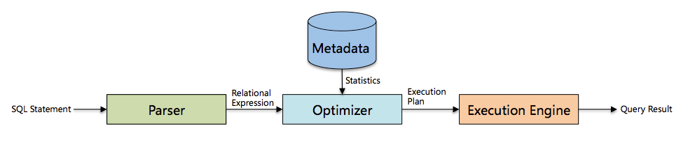
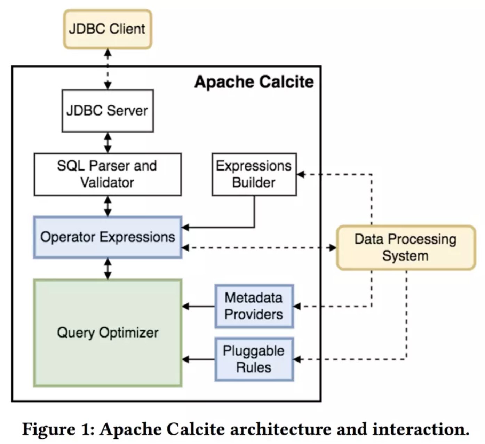

## QC查询优化器设计研究
---------------------------------------------------------

### 查询优化器概述

数据库主要由三部分组成，分别是解析器、优化器和执行引擎，如下图所示：




其中优化器是数据库中用于把关系表达式转换成执行计划的核心组件，很大程度上决定了一个系统的性能。

#### 查询优化器分类

查询优化器分为两类：基于规则的优化器(Rule-Based Optimizer，RBO) 和基于代价的优化器(Cost-Based Optimizer，CBO) ：
* 基于规则的优化器(Rule-Based Optimizer，RBO)
根据优化规则对关系表达式进行转换，这里的转换是说一个关系表达式经过优化规则后会变成另外一个关系表达式，同时原有表达式会被裁剪掉，经过一系列转换后生成最终的执行计划。
RBO中包含了一套有着严格顺序的优化规则，同样一条SQL，无论读取的表中数据是怎么样的，最后生成的执行计划都是一样的。同时，在RBO中SQL写法的不同很有可能影响最终的执行计划，从而影响脚本性能。
* 基于代价的优化器(Cost-Based Optimizer，CBO)
根据优化规则对关系表达式进行转换，这里的转换是说一个关系表达式经过优化规则后会生成另外一个关系表达式，同时原有表达式也会保留，经过一系列转换后会生成多个执行计划，然后CBO会根据统计信息和代价模型(Cost Model)计算每个执行计划的Cost，从中挑选Cost最小的执行计划。由上可知，CBO中有两个依赖：统计信息和代价模型。统计信息的准确与否、代价模型的合理与否都会影响CBO选择最优计划。
从上述描述可知，CBO是优于RBO的，原因是RBO是一种只认规则，对数据不敏感的呆板的优化器，而在实际过程中，数据往往是有变化的，通过RBO生成的执行计划很有可能不是最优的。
事实上目前各大数据库和大数据计算引擎都倾向于使用CBO，例如从Oracle 10g开始，Oracle已经彻底放弃RBO，转而使用CBO；而Hive在0.14版本中也引入了CBO。

#### 查询优化器执行过程

无论是RBO，还是CBO都包含了一系列优化规则，这些优化规则可以对关系表达式进行等价转换，常见的优化规则包含：

   - 谓词下推
   - 列裁剪
   - 常量折叠
   - 其他

在这些优化规则的基础上，就能对关系表达式做相应的等价转换，从而生成执行计划。下面将介绍RBO和CBO两种优化器的执行过程。

* RBO

RBO的执行过程比较简单，主要包含两个步骤：

1）Transformation

遍历关系表达式，只要模式能够满足特定优化规则就进行转换。

2）Build Physical Plan

经过Step1之后就生成了一个逻辑执行计划，但这只是逻辑上可行，还需要将逻辑执行计划build成物理执行计划，即决定各个Operator的具体实现。如Join算子的具体实现选择BroadcastHashJoin还是SortMergeJoin。

* CBO

CBO查询优化主要包含三个步骤：

1）Exploration

根据优化规则进行等价转换，生成等价关系表达式，此时原有关系表达式会被保留。

2）Build Physical Plan

决定各个Operator的具体实现。

3）Find Best Plan

根据统计信息计算各个执行计划的Cost，选择Cost最小的执行计划。
CBO实现有两种模型，即Volcano模型[1]和Cascades模型[2]，其中Calcite使用的是Volcano模型，而Orca[3]使用的是Cascades模型。这两种模型的思想基本相同，不同点在于Cascades模型并不是先Explore、后Build，而是边Explore边Build，从而进一步裁剪掉一些执行计划。


### Apache Calcite数据框架

Apache Calcite is a dynamic data management framework.

The following features are complete.

   - Query parser, validator and optimizer
   - Support for reading models in JSON format
   - Many standard functions and aggregate functions
   - JDBC queries against Linq4j and JDBC back-ends
   - Linq4j front-end
   - SQL features: SELECT, FROM (including JOIN syntax), WHERE, GROUP BY (including GROUPING SETS), aggregate functions (including COUNT(DISTINCT …) and FILTER), HAVING, ORDER BY (including NULLS FIRST/LAST), set operations (UNION, INTERSECT, MINUS), sub-queries (including correlated sub-queries), windowed aggregates, LIMIT (syntax as Postgres); more details in the SQL reference
   - Local and remote JDBC drivers; see Avatica
   - Several adapters

Apache Calcite 是一个独立于存储与执行的SQL优化引擎，广泛应用于开源大数据计算引擎中，如Flink、Drill、Hive、Kylin等。另外，MaxCompute也使用了Calcite作为优化器框架。Calcite的架构如下图所示：



其中Operator Expressions 指的是关系表达式，一个关系表达式在Calcite中被表示为RelNode，往往以根节点代表整个查询树。Calcite中有两种方法生成RelNode：

* 通过Parser直接解析生成

从上述架构图可以看到，Calcite也提供了Parser用于SQL解析，直接使用Parser就能得到RelNode Tree。

* 通过Expressions Builder转换生成

不同系统语法有差异，所以Parser也可能不同。针对这种情况，Calcite提供了Expressions Builder来对抽象语法树(或其他数据结构)进行转换得到RelNode Tree。如Hive(某一种Data Processing System)使用的就是这种方法。
Query Optimizer 根据优化规则(Pluggable Rules)对Operator Expressions进行一系列的等价转换，生成不同的执行计划，最后选择代价最小的执行计划，其中代价计算时会用到Metadata Providers提供的统计信息。

事实上，Calcite提供了RBO和CBO两种优化方式，分别对应HepPlanner和VolcanoPlanner。对此，本文也不进行展开，后续有时间再详细介绍Calcite的具体实现。

### SQL查询优化器分析

1._SQLite优化器_

		使用Nested嵌套联接
		[N最近邻居](https://www.sqlite.org/queryplanner-ng.html) 贪婪算法

2._DB2优化器_

		使用所有可用的统计，包括线段树(frequent-value)和分位数统计(quantile statistics)。
		使用所有查询重写规则(含物化查询表路由，materialized query table routing),除了在极少情况下适用的计算密集型规则。
		使用动态编程模拟联接
			有限使用组合内关系（composite inner relation）
			对于涉及查找表的星型模式，有限使用笛卡尔乘积
		考虑宽泛的访问方式，含列表预取(list prefetch,注:我们将讨论什么是列表预取),index ANDing(注:一种对索引的特殊操作),和物化查询表路由。
		默认的，DB2 对联接排列使用受启发式限制的动态编程算法。

	默认的，DB2 对联接排列使用受启发式限制的动态编程算法。	

3._Genetic Query Optimizer - PostgerSQL查询优化器_

[geqo_postgreSQL](https://www.postgresql.org/docs/current/static/geqo-intro.html)

	The normal PostgreSQL query optimizer performs a near-exhaustive search over the space of alternative strategies. It can take an enormous amount of time and memory space when the number of joins in the query grows large. This makes the ordinary PostgreSQL query optimizer inappropriate for queries that join a large number of tables.

	genetic algorithm(GA) & GEQO 

### 大数据查询优化器

#### _GPORCA(Pivotal Query Optimizer) - Greenplum/HWQA_


Pivotal Query Optimizer(PQO)权衡多核计数器,其实现通过多核CPU来分布独立优化任务,从而加速优化进程。PQO用于以下几种查询场景:
	
	- Queries against partitioned tables 查询分区表
	- Queries that contain a common table expression (CTE) 查询通用表表达式
	- Queries that contain subqueries 子查询

GPORCA在以下几个方面针对大数据查询的增强Greenplum数据库查询性能优化:

* Dynamic Partition Elimination动态分区排除(Queries against partitioned tables)
		
		PartitionSelector, DynamicScan, and Sequence.
		- PartitionSelector computes all the child partition OIDs that satisfy the partition selection conditions given to it.
		- DynamicScan is responsible for passing tuples from the partitions identified by the PartitionSelector.
		- Sequence is an operator that executes its child operators and then returns the result of the last one.
	
* SubQuery Unnesting子查询非嵌套(Queries that contain subqueries)
		
		- Removing Unnecessary Nesting取消无用的嵌套
		- Subquery Decorrelation子查询解相关
		- Conversion of Subqueries into Joins子查询变换
	
* Common Table Expressions(CTE-Queries是指用于单次查询的临时表表达式)

* Other Optimization Enhancements:

	- Improved join ordering
	- Join-Aggregate reordering
	- Sort order optimization
	- Data skew estimates included in query optimization


- [PQO_Feature](https://gpdb.docs.pivotal.io/5100/admin_guide/query/topics/query-piv-opt-features.html)
- [PQO_Doc](https://content.pivotal.io/blog/greenplum-database-adds-the-pivotal-query-optimizer)


#### _Legacy Query Optimizer - Greenplum/PostgreSQL_

	Append-only Columnar Scan

#### GPORCA vs Legacy Query Optimizer

```sql
QUERY PLAN                                                               
---------------------------------------------------------------------------------------------------------------------------------------
Gather Motion 1:1  (slice1; segments: 1)  (cost=46765.47..46765.48 rows=4 width=38)
   Merge Key: a.date_id
   Rows out:  151 rows at destination with 10317 ms to end.
   ->  Sort  (cost=46765.47..46765.48 rows=1 width=38)
         Sort Key: a.date_id
         Sort Method:  quicksort  Memory: 49KB
         Rows out:  151 rows with 10314 ms to end.
         Executor memory:  58K bytes.
         Work_mem used:  58K bytes. Workfile: (0 spilling)
         ->  Nested Loop  (cost=0.00..46765.44 rows=1 width=38)
               Rows out:  151 rows with 125 ms to first row, 10313 ms to end.
               ->  Append-only Columnar Scan on aggr_douyin_content_rank_history_filter a  (cost=0.00..4814.66 rows=1 width=34)
                     Filter: date_id <= 20180729 AND short_id::text = '90518269'::text AND popu_id = 0 AND date_type::text = 'D'::text
                     Rows out:  151 rows with 2.665 ms to first row, 280 ms to end.
               ->  Append-only Columnar Scan on dim_douyin_user_base_profile b  (cost=0.00..41950.76 rows=1 width=22)
                     Filter: b.short_id::text = '90518269'::text
                     Rows out:  151 rows with 122 ms to first row, 10019 ms to end of 151 scans.
Slice statistics:
   (slice0)    Executor memory: 386K bytes.
   (slice1)    Executor memory: 4718K bytes (seg9).  Work_mem: 58K bytes max.
Statement statistics:
   Memory used: 512000K bytes
Settings:  enable_nestloop=off; optimizer=off
Optimizer status: legacy query optimizer
Total runtime: 10318.869 ms
(25 rows)
```
```sql
ircloud_onemedia=# set optimizer=on;
SET
ircloud_onemedia=# EXPLAIN ANALYZE SELECT
ircloud_onemedia-#   A .popu_id,
ircloud_onemedia-#   b.nickname,
ircloud_onemedia-#   A .uv,
ircloud_onemedia-#   (A .dev_index * 10000000),
ircloud_onemedia-#   A .date_id
ircloud_onemedia-# FROM
ircloud_onemedia-#   om_douyin.aggr_douyin_content_rank_history_filter A
ircloud_onemedia-# INNER JOIN om_douyin.dim_douyin_user_base_profile b ON A .short_id = b.short_id
ircloud_onemedia-# WHERE
ircloud_onemedia-#   A .popu_id = 0
ircloud_onemedia-# AND A .date_type = UPPER ('D')
ircloud_onemedia-# AND A .short_id = '90518269'
ircloud_onemedia-# AND A .date_id <= 20180729
ircloud_onemedia-# ORDER BY
ircloud_onemedia-#   A .date_id;

QUERY PLAN                                                                     
---------------------------------------------------------------------------------------------------------------------------------------------------
Gather Motion 32:1  (slice1; segments: 32)  (cost=0.00..889.14 rows=1 width=32)
   Merge Key: aggr_douyin_content_rank_history_filter.date_id
   Rows out:  151 rows at destination with 604 ms to end.
   ->  Result  (cost=0.00..889.14 rows=1 width=32)
         Rows out:  151 rows (seg9) with 602 ms to first row, 603 ms to end.
         ->  Sort  (cost=0.00..889.14 rows=1 width=38)
               Sort Key: aggr_douyin_content_rank_history_filter.date_id
               Sort Method:  quicksort  Max Memory: 49KB  Avg Memory: 33KB (32 segments)
               Rows out:  151 rows (seg9) with 602 ms to end.
               Executor memory:  58K bytes avg, 58K bytes max (seg0).
               Work_mem used:  58K bytes avg, 58K bytes max (seg0). Workfile: (0 spilling)
               ->  Hash Join  (cost=0.00..889.14 rows=1 width=38)
                     Hash Cond: dim_douyin_user_base_profile.short_id::text = aggr_douyin_content_rank_history_filter.short_id::text
                     Rows out:  151 rows (seg9) with 599 ms to first row, 602 ms to end.
                     Executor memory:  10K bytes.
                     Work_mem used:  10K bytes. Workfile: (0 spilling)
                     (seg9)   Hash chain length 151.0 avg, 151 max, using 1 of 524288 buckets.
                     ->  Table Scan on dim_douyin_user_base_profile  (cost=0.00..438.13 rows=82017 width=22)
                           Rows out:  81577 rows (seg9) with 9.350 ms to first row, 192 ms to end.
                     ->  Hash  (cost=432.30..432.30 rows=1 width=34)
                           Rows in:  151 rows (seg9) with 378 ms to end, start offset by 13 ms.
                           ->  Table Scan on aggr_douyin_content_rank_history_filter  (cost=0.00..432.30 rows=1 width=34)
                                 Filter: popu_id = 0 AND date_type::text = 'D'::text AND short_id::text = '90518269'::text AND date_id <= 20180729
                                 Rows out:  151 rows (seg9) with 0.817 ms to first row, 378 ms to end.
Slice statistics:
   (slice0)    Executor memory: 386K bytes.
   (slice1)    Executor memory: 9077K bytes avg x 32 workers, 9093K bytes max (seg9).  Work_mem: 58K bytes max.
Statement statistics:
   Memory used: 512000K bytes
Settings:  enable_nestloop=off; optimizer=on
Optimizer status: PQO version 2.55.13
Total runtime: 605.406 ms
(32 rows)
```

### SparkSQL Catalyst优化器


Catalyst这部分代码完成的是从SQL到Optimized Logical Plan，后面的Physical Planning则位于｀sql/core｀下面。大概有这么几个组件需要展开细看：ParserAnalyzer(with Catalog)Optimizer和Catalyst具有类似功能的是Apache Calcite，像Hive, Phoenix都有在用Calcite，折腾完Catalyst，可以去看一看两者的异同。如果要快速理解Catalyst，我建议从 @连城 的项目 [liancheng/spear](https://link.zhihu.com/?target=https%3A//github.com/liancheng/spear) 入手，完整地阅读一遍，相信会有很多收获。


### Hive SQL Optimizer

- [HiveSQL优化策略](2017-06-10-hive-sql-optimizer-note.md)

