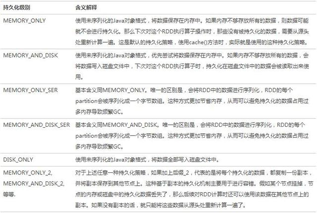
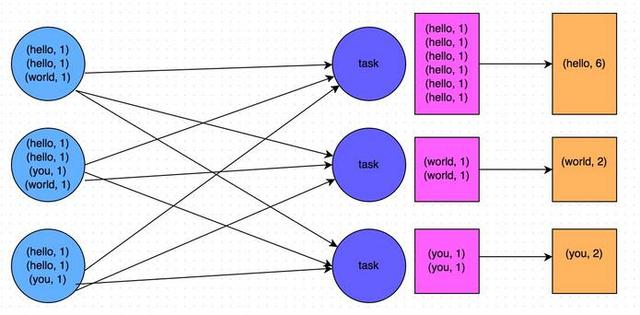
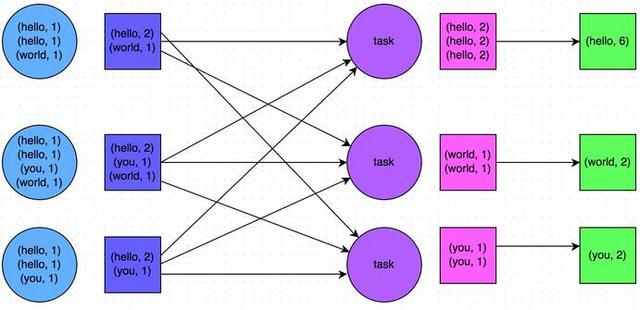
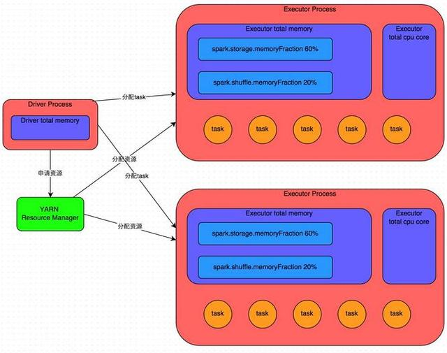

## 大数据计算-Spark Performance Tuning Note
------------------------------------------------------------

### Spark调优

由于大部分Spark计算都是在内存中完成的，所以Spark程序的瓶颈可能由集群中任意一种资源导致的。
(CPU,Memory,Disk,Network 4种资源利用情况)

最常见的情况是，数据能装进内存，而瓶颈是网络带宽;当然，有时候我们也需要做一些优化调整来减少内存占用，例如将RDD以序列化格式保存(storing RDDs in serialized form)。本文将主要涵盖两个主题：

1. 开发优化 
2. 数据序列化与数据结构优化(这对于优化网络性能极为重要)
3. 资源与内存调优(减少内存占用以及GC)
4. 数据倾斜优化 
5. shuffle优化

	Comments:
	– 最重要的就是，数据序列化和内存调优。对于绝大多数应用来说，用Kryo格式序列化数据能够解决大多数的性能问题。
    - 数据倾斜调优，主要讲解了一套完整的用来解决Spark作业数据倾斜的解决方案;
    - shuffle调优，面向的是对Spark的原理有较深层次掌握和研究的同学，主要讲解了如何对Spark作业的shuffle运行过程以及细节进行调优。

### I.开发调优

Spark性能优化的第一步，就是要在开发Spark作业的过程中注意和应用一些性能优化的基本原则。开发调优，就是要让大家了解以下一些Spark基本开发原则，包括：RDD lineage设计、算子的合理使用、特殊操作的优化等。在开发过程中，时时刻刻都应该注意以上原则，并将这些原则根据具体的业务以及实际的应用场景，灵活地运用到自己的Spark作业中。

**原则一：避免创建重复的RDD**

通常来说，我们在开发一个Spark作业时，首先是基于某个数据源(比如Hive表或HDFS文件)创建一个初始的RDD;接着对这个RDD执行某个算子操作，然后得到下一个RDD;以此类推，循环往复，直到计算出最终我们需要的结果。在这个过程中，多个RDD会通过不同的算子操作(比如map、reduce等)串起来，这个“RDD串”，就是RDD lineage，也就是“RDD的血缘关系链”。
我们在开发过程中要注意：对于同一份数据，只应该创建一个RDD，不能创建多个RDD来代表同一份数据。
一些Spark初学者在刚开始开发Spark作业时，或者是有经验的工程师在开发RDD lineage极其冗长的Spark作业时，可能会忘了自己之前对于某一份数据已经创建过一个RDD了，从而导致对于同一份数据，创建了多个RDD。这就意味着，我们的Spark作业会进行多次重复计算来创建多个代表相同数据的RDD，进而增加了作业的性能开销。

```java
一个简单的例子
// 需要对名为“hello.txt”的HDFS文件进行一次map操作，再进行一次reduce操作。也就是说，需要对一份数据执行两次算子操作。
// 错误的做法：对于同一份数据执行多次算子操作时，创建多个RDD。
// 这里执行了两次textFile方法，针对同一个HDFS文件，创建了两个RDD出来，然后分别对每个RDD都执行了一个算子操作。
// 这种情况下，Spark需要从HDFS上两次加载hello.txt文件的内容，并创建两个单独的RDD;第二次加载HDFS文件以及创建RDD的性能开销，很明显是白白浪费掉的。
val rdd1 = sc.textFile(“hdfs://192.168.0.1:9000/hello.txt”)
rdd1.map(…)
val rdd2 = sc.textFile(“hdfs://192.168.0.1:9000/hello.txt”)
rdd2.reduce(…)
// 正确的用法：对于一份数据执行多次算子操作时，只使用一个RDD。
// 这种写法很明显比上一种写法要好多了，因为我们对于同一份数据只创建了一个RDD，然后对这一个RDD执行了多次算子操作。
// 但是要注意到这里为止优化还没有结束，由于rdd1被执行了两次算子操作，第二次执行reduce操作的时候，还会再次从源头处重新计算一次rdd1的数据，因此还是会有重复计算的性能开销。
// 要彻底解决这个问题，必须结合“原则三：对多次使用的RDD进行持久化”，才能保证一个RDD被多次使用时只被计算一次。
val rdd1 = sc.textFile(“hdfs://192.168.0.1:9000/hello.txt”)
rdd1.map(…)
rdd1.reduce(…)
```

**原则二：尽可能复用同一个RDD**

除了要避免在开发过程中对一份完全相同的数据创建多个RDD之外，在对不同的数据执行算子操作时还要尽可能地复用一个RDD。比如说，有一个RDD的数据格式是key-value类型的，另一个是单value类型的，这两个RDD的value数据是完全一样的。那么此时我们可以只使用key-value类型的那个RDD，因为其中已经包含了另一个的数据。对于类似这种多个RDD的数据有重叠或者包含的情况，我们应该尽量复用一个RDD，这样可以尽可能地减少RDD的数量，从而尽可能减少算子执行的次数。

```java
一个简单的例子
// 错误的做法。
// 有一个格式的RDD，即rdd1。
// 接着由于业务需要，对rdd1执行了一个map操作，创建了一个rdd2，而rdd2中的数据仅仅是rdd1中的value值而已，也就是说，rdd2是rdd1的子集。
JavaPairRDD rdd1 = …
JavaRDD rdd2 = rdd1.map(…)
// 分别对rdd1和rdd2执行了不同的算子操作。
rdd1.reduceByKey(…)
rdd2.map(…)
// 正确的做法。
// 上面这个case中，其实rdd1和rdd2的区别无非就是数据格式不同而已，rdd2的数据完全就是rdd1的子集而已，却创建了两个rdd，并对两个rdd都执行了一次算子操作。
// 此时会因为对rdd1执行map算子来创建rdd2，而多执行一次算子操作，进而增加性能开销。
// 其实在这种情况下完全可以复用同一个RDD。
// 我们可以使用rdd1，既做reduceByKey操作，也做map操作。
// 在进行第二个map操作时，只使用每个数据的tuple._2，也就是rdd1中的value值，即可。
JavaPairRDD rdd1 = …
rdd1.reduceByKey(…)
rdd1.map(tuple._2…)
// 第二种方式相较于第一种方式而言，很明显减少了一次rdd2的计算开销。
// 但是到这里为止，优化还没有结束，对rdd1我们还是执行了两次算子操作，rdd1实际上还是会被计算两次。
// 因此还需要配合“原则三：对多次使用的RDD进行持久化”进行使用，才能保证一个RDD被多次使用时只被计算一次。
```

**原则三：对多次使用的RDD进行持久化**

当你在Spark代码中多次对一个RDD做了算子操作后，恭喜，你已经实现Spark作业第一步的优化了，也就是尽可能复用RDD。此时就该在这个基础之上，进行第二步优化了，也就是要保证对一个RDD执行多次算子操作时，这个RDD本身仅仅被计算一次。
Spark中对于一个RDD执行多次算子的默认原理是这样的：每次你对一个RDD执行一个算子操作时，都会重新从源头处计算一遍，计算出那个RDD来，然后再对这个RDD执行你的算子操作。这种方式的性能是很差的。
因此对于这种情况，我们的建议是：对多次使用的RDD进行持久化。此时Spark就会根据你的持久化策略，将RDD中的数据保存到内存或者磁盘中。以后每次对这个RDD进行算子操作时，都会直接从内存或磁盘中提取持久化的RDD数据，然后执行算子，而不会从源头处重新计算一遍这个RDD，再执行算子操作。

对多次使用的RDD进行持久化的代码示例

```java
// 如果要对一个RDD进行持久化，只要对这个RDD调用cache()和persist()即可。
// 正确的做法。
// cache()方法表示：使用非序列化的方式将RDD中的数据全部尝试持久化到内存中。
// 此时再对rdd1执行两次算子操作时，只有在第一次执行map算子时，才会将这个rdd1从源头处计算一次。
// 第二次执行reduce算子时，就会直接从内存中提取数据进行计算，不会重复计算一个rdd。
val rdd1 = sc.textFile(“hdfs://192.168.0.1:9000/hello.txt”).cache()
rdd1.map(…)
rdd1.reduce(…)
// persist()方法表示：手动选择持久化级别，并使用指定的方式进行持久化。
// 比如说，StorageLevel.MEMORY_AND_DISK_SER表示，内存充足时优先持久化到内存中，内存不充足时持久化到磁盘文件中。
// 而且其中的_SER后缀表示，使用序列化的方式来保存RDD数据，此时RDD中的每个partition都会序列化成一个大的字节数组，然后再持久化到内存或磁盘中。
// 序列化的方式可以减少持久化的数据对内存/磁盘的占用量，进而避免内存被持久化数据占用过多，从而发生频繁GC。
val rdd1 = sc.textFile(“hdfs://192.168.0.1:9000/hello.txt”).persist(StorageLevel.MEMORY_AND_DISK_SER)
rdd1.map(…)
rdd1.reduce(…)
```

对于persist()方法而言，我们可以根据不同的业务场景选择不同的持久化级别。

_Spark的持久化级别_



_如何选择一种最合适的持久化策略_

默认情况下，性能最高的当然是MEMORY_ONLY，但前提是你的内存必须足够足够大，可以绰绰有余地存放下整个RDD的所有数据。因为不进行序列化与反序列化操作，就避免了这部分的性能开销;对这个RDD的后续算子操作，都是基于纯内存中的数据的操作，不需要从磁盘文件中读取数据，性能也很高;而且不需要复制一份数据副本，并远程传送到其他节点上。但是这里必须要注意的是，在实际的生产环境中，恐怕能够直接用这种策略的场景还是有限的，如果RDD中数据比较多时(比如几十亿)，直接用这种持久化级别，会导致JVM的OOM内存溢出异常。
如果使用MEMORY_ONLY级别时发生了内存溢出，那么建议尝试使用MEMORY_ONLY_SER级别。该级别会将RDD数据序列化后再保存在内存中，此时每个partition仅仅是一个字节数组而已，大大减少了对象数量，并降低了内存占用。这种级别比MEMORY_ONLY多出来的性能开销，主要就是序列化与反序列化的开销。但是后续算子可以基于纯内存进行操作，因此性能总体还是比较高的。此外，可能发生的问题同上，如果RDD中的数据量过多的话，还是可能会导致OOM内存溢出的异常。

如果纯内存的级别都无法使用，那么建议使用MEMORY_AND_DISK_SER策略，而不是MEMORY_AND_DISK策略。因为既然到了这一步，就说明RDD的数据量很大，内存无法完全放下。序列化后的数据比较少，可以节省内存和磁盘的空间开销。同时该策略会优先尽量尝试将数据缓存在内存中，内存缓存不下才会写入磁盘。
通常不建议使用DISK_ONLY和后缀为_2的级别：因为完全基于磁盘文件进行数据的读写，会导致性能急剧降低，有时还不如重新计算一次所有RDD。后缀为_2的级别，必须将所有数据都复制一份副本，并发送到其他节点上，数据复制以及网络传输会导致较大的性能开销，除非是要求作业的高可用性，否则不建议使用。

**原则四：尽量避免使用shuffle类算子**

如果有可能的话，要尽量避免使用shuffle类算子。因为Spark作业运行过程中，最消耗性能的地方就是shuffle过程。**shuffle过程，简单来说，就是将分布在集群中多个节点上的同一个key，拉取到同一个节点上，进行聚合或join等操作(类似GP重分布)。**

比如reduceByKey、join等算子，都会触发shuffle操作。
shuffle过程中，各个节点上的相同key都会先写入本地磁盘文件中，然后其他节点需要通过网络传输拉取各个节点上的磁盘文件中的相同key。而且相同key都拉取到同一个节点进行聚合操作时，还有可能会因为一个节点上处理的key过多，导致内存不够存放，进而溢写到磁盘文件中。因此在shuffle过程中，可能会发生大量的磁盘文件读写的IO操作，以及数据的网络传输操作。磁盘IO和网络数据传输也是shuffle性能较差的主要原因。

因此在我们的开发过程中，能避免则尽可能避免使用reduceByKey、join、distinct、repartition等会进行shuffle的算子，尽量使用map类的非shuffle算子。这样的话，没有shuffle操作或者仅有较少shuffle操作的Spark作业，可以大大减少性能开销。
Broadcast与map进行join代码示例

```java
// 传统的join操作会导致shuffle操作。
// 因为两个RDD中，相同的key都需要通过网络拉取到一个节点上，由一个task进行join操作。
val rdd3 = rdd1.join(rdd2)
// Broadcast+map的join操作，不会导致shuffle操作。
// 使用Broadcast将一个数据量较小的RDD作为广播变量。
val rdd2Data = rdd2.collect()
val rdd2DataBroadcast = sc.broadcast(rdd2Data)
// 在rdd1.map算子中，可以从rdd2DataBroadcast中，获取rdd2的所有数据。
// 然后进行遍历，如果发现rdd2中某条数据的key与rdd1的当前数据的key是相同的，那么就判定可以进行join。
// 此时就可以根据自己需要的方式，将rdd1当前数据与rdd2中可以连接的数据，拼接在一起(String或Tuple)。
val rdd3 = rdd1.map(rdd2DataBroadcast…)
// 注意，以上操作，建议仅仅在rdd2的数据量比较少(比如几百M，或者一两G)的情况下使用。
// 因为每个Executor的内存中，都会驻留一份rdd2的全量数据。
```

**原则五：使用map-side预聚合的shuffle操作**

如果因为业务需要，一定要使用shuffle操作，无法用map类的算子来替代，那么尽量使用可以map-side预聚合的算子。
所谓的map-side预聚合，说的是在每个节点本地对相同的key进行一次聚合操作，类似于MapReduce中的本地combiner。map-side预聚合之后，每个节点本地就只会有一条相同的key，因为多条相同的key都被聚合起来了。其他节点在拉取所有节点上的相同key时，就会大大减少需要拉取的数据数量，从而也就减少了磁盘IO以及网络传输开销。通常来说，在可能的情况下，建议使用reduceByKey或者aggregateByKey算子来替代掉groupByKey算子。因为reduceByKey和aggregateByKey算子都会使用用户自定义的函数对每个节点本地的相同key进行预聚合。而groupByKey算子是不会进行预聚合的，全量的数据会在集群的各个节点之间分发和传输，性能相对来说比较差。

比如如下两幅图，就是典型的例子，分别基于reduceByKey和groupByKey进行单词计数。其中第一张图是groupByKey的原理图，可以看到，没有进行任何本地聚合时，所有数据都会在集群节点之间传输;第二张图是reduceByKey的原理图，可以看到，每个节点本地的相同key数据，都进行了预聚合，然后才传输到其他节点上进行全局聚合。






**原则六：使用高性能的算子**

除了shuffle相关的算子有优化原则之外，其他的算子也都有着相应的优化原则。
使用reduceByKey/aggregateByKey替代groupByKey
详情见“原则五：使用map-side预聚合的shuffle操作”。

_使用mapPartitions替代普通map_

mapPartitions类的算子，一次函数调用会处理一个partition所有的数据，而不是一次函数调用处理一条，性能相对来说会高一些。但是有的时候，使用mapPartitions会出现OOM(内存溢出)的问题。因为单次函数调用就要处理掉一个partition所有的数据，如果内存不够，垃圾回收时是无法回收掉太多对象的，很可能出现OOM异常。所以使用这类操作时要慎重!

_使用foreachPartitions替代foreach_

原理类似于“使用mapPartitions替代map”，也是一次函数调用处理一个partition的所有数据，而不是一次函数调用处理一条数据。在实践中发现，foreachPartitions类的算子，对性能的提升还是很有帮助的。比如在foreach函数中，将RDD中所有数据写MySQL，那么如果是普通的foreach算子，就会一条数据一条数据地写，每次函数调用可能就会创建一个数据库连接，此时就势必会频繁地创建和销毁数据库连接，性能是非常低下;但是如果用foreachPartitions算子一次性处理一个partition的数据，那么对于每个partition，只要创建一个数据库连接即可，然后执行批量插入操作，此时性能是比较高的。实践中发现，对于1万条左右的数据量写MySQL，性能可以提升30%以上。

_使用filter之后进行coalesce操作_

通常对一个RDD执行filter算子过滤掉RDD中较多数据后(比如30%以上的数据)，建议使用coalesce算子，手动减少RDD的partition数量，将RDD中的数据压缩到更少的partition中去。因为filter之后，RDD的每个partition中都会有很多数据被过滤掉，此时如果照常进行后续的计算，其实每个task处理的partition中的数据量并不是很多，有一点资源浪费，而且此时处理的task越多，可能速度反而越慢。因此用coalesce减少partition数量，将RDD中的数据压缩到更少的partition之后，只要使用更少的task即可处理完所有的partition。在某些场景下，对于性能的提升会有一定的帮助。

_使用repartitionAndSortWithinPartitions替代repartition与sort类操作_

repartitionAndSortWithinPartitions是Spark官网推荐的一个算子，官方建议，如果需要在repartition重分区之后，还要进行排序，建议直接使用repartitionAndSortWithinPartitions算子。因为该算子可以一边进行重分区的shuffle操作，一边进行排序。shuffle与sort两个操作同时进行，比先shuffle再sort来说，性能可能是要高的。

**原则七：广播大变量**

有时在开发过程中，会遇到需要在算子函数中使用外部变量的场景(尤其是大变量，比如100M以上的大集合)，那么此时就应该使用Spark的广播(Broadcast)功能来提升性能。
在算子函数中使用到外部变量时，默认情况下，Spark会将该变量复制多个副本，通过网络传输到task中，此时每个task都有一个变量副本。如果变量本身比较大的话(比如100M，甚至1G)，那么大量的变量副本在网络中传输的性能开销，以及在各个节点的Executor中占用过多内存导致的频繁GC，都会极大地影响性能。
因此对于上述情况，如果使用的外部变量比较大，建议使用Spark的广播功能，对该变量进行广播。广播后的变量，会保证每个Executor的内存中，只驻留一份变量副本，而Executor中的task执行时共享该Executor中的那份变量副本。这样的话，可以大大减少变量副本的数量，从而减少网络传输的性能开销，并减少对Executor内存的占用开销，降低GC的频率。

广播大变量的代码示例

```java
// 以下代码在算子函数中，使用了外部的变量。
// 此时没有做任何特殊操作，每个task都会有一份list1的副本。
val list1 = …
rdd1.map(list1…)
// 以下代码将list1封装成了Broadcast类型的广播变量。
// 在算子函数中，使用广播变量时，首先会判断当前task所在Executor内存中，是否有变量副本。
// 如果有则直接使用;如果没有则从Driver或者其他Executor节点上远程拉取一份放到本地Executor内存中。
// 每个Executor内存中，就只会驻留一份广播变量副本。
val list1 = …
val list1Broadcast = sc.broadcast(list1)
rdd1.map(list1Broadcast…)

```

### II.其他注意事项

#### 并行度

一般来说集群并不会满负荷运转，除非你吧每个操作的并行度都设得足够大。

Spark会自动根据对应的输入文件大小来设置“map”类算子的并行度(当然你可以通过一个SparkContext.textFile等函数的可选参数来控制并行度),而对于想 groupByKey 或 reduceByKey这类“reduce” 算子，会使用其各父RDD分区数的最大值。

你可以将并行度作为构建RDD第二个参数(参考 spark.PairRDDFunctions)，或者设置 park.default.parallelism 这个默认值。一般来说,评估并行度的时候,我们建议2-3个任务共享一个CPU。


#### Reduce任务的内存占用

如果RDD比内存要大，有时候你可能收到一个OutOfMemoryError，但其实这是因为你的任务集中的某个任务太大了，如reduce任务groupByKey。Spark的混洗(Shuffle)算子(sortByKey，groupByKey，reduceByKey，join等)会在每个任务中构建一个哈希表，以便在任务中对数据分组，这个哈希表有时会很大。最简单的修复办法就是增大并行度，以减小单个任务的输入集。Spark对于200ms以内的短任务支持非常好，因为Spark可以跨任务复用执行器JVM，任务的启动开销很小，因此把并行度增加到比集群中总CPU核数还多是没有任何问题的。

#### 广播大变量

使用SparkContext中的广播变量相关功能(broadcast functionality)能大大减少每个任务本身序列化的大小，以及集群中启动作业的开销。如果你的Spark任务正在使用驱动器(driver)程序中定义的巨大对象(比如：静态查询表)，请考虑使用广播变量替代之。Spark会在master上将各个任务的序列化后大小打印出来，所以你可以检查一下各个任务是否过大;通常来说，大于20KB的任务就值得优化一下。

#### 数据本地性

数据本地性对Spark作业往往会有较大的影响。如果代码和其所操作的数据在统一节点上，那么计算速度肯定会更快一些。但如果二者不在一起，那必然需要挪动其中之一。一般来说，挪动序列化好的代码肯定比挪动一大堆数据要快。Spark就是基于这个一般性原则来构建数据本地性的调度。
数据本地性是指代码和其所处理的数据的距离。基于数据当前的位置，数据本地性可以划分成以下几个层次(按从近到远排序)：
PROCESS_LOCAL 数据和运行的代码处于同一个JVM进程内。
NODE_LOCAL 数据和代码处于同一节点。例如，数据处于HDFS上某个节点，而对应的执行器(executor)也在同一个机器节点上。这会比PROCESS_LOCAL稍微慢一些，因为数据需要跨进程传递。
NO_PREF 数据在任何地方处理都一样，没有本地性偏好。
RACK_LOCAL 数据和代码处于同一个机架上的不同机器。这时，数据和代码处于不同机器上，需要通过网络传递，但还是在同一个机架上，一般也就通过一个交换机传输即可。
ANY 数据在网络中其他未知，即数据和代码不在同一个机架上。
Spark倾向于让所有任务都具有最佳的数据本地性，但这并非总是可行的。某些情况下，可能会出现一些空闲的执行器(executor)没有待处理的数据，那么Spark可能就会牺牲一些数据本地性。有两种可能的选项：a)等待已经有任务的CPU，待其释放后立即在同一台机器上启动一个任务;b)立即在其他节点上启动新任务，并把所需要的数据复制过去。
而通常，Spark会等待一小会，看看是否有CPU会被释放出来。一旦等待超时，则立即在其他节点上启动并将所需的数据复制过去。数据本地性各个级别之间的回落超时可以单独配置，也可以在统一参数内一起设定;

详细请参考configuration page中的spark.locality相关参数。如果你的任务执行时间比较长并且数据本地性很差，你就应该试试调大这几个参数，不过默认值一般都能适用于大多数场景了。


### III.数据序列化与数据结构优化

#### 序列化

序列化在任何一种分布式应用性能优化时都扮演几位重要的角色。如果序列化格式序列化过程缓慢，或者需要占用字节很多，都会大大拖慢整体的计算效率。通常，序列化都是Spark应用优化时首先需要关注的地方。Spark着眼于要达到便利性(允许你在计算过程中使用任何Java类型)和性能的一个平衡。Spark主要提供了两个序列化库：

_Java serialization:_

默认情况，Spark使用Java自带的ObjectOutputStream 框架来序列化对象，这样任何实现了 java.io.Serializable 接口的对象，都能被序列化。同时，你还可以通过扩展 java.io.Externalizable 来控制序列化性能。Java序列化很灵活但性能较差，同时序列化后占用的字节数也较多。

_Kryo serialization:_ 

Spark还可以使用Kryo 库(
版本2)提供更高效的序列化格式。Kryo的序列化速度和字节占用都比Java序列化好很多(通常是10倍左右)，但Kryo不支持所有实现了 Serializable 接口的类型，它需要你在程序中 register 需要序列化的类型，以得到最佳性能。
要切换到使用 Kryo，你可以在 SparkConf 初始化的时候调用 conf.set(“spark.serializer”, “org.apache.spark.serializer.KryoSerializer”)。这个设置不仅控制各个worker节点之间的混洗数据序列化格式，同时还控制RDD存到磁盘上的序列化格式。目前，Kryo不是默认的序列化格式，因为它需要你在使用前注册需要序列化的类型，不过我们还是建议在对网络敏感的应用场景下使用Kryo。
Spark对一些常用的Scala核心类型(包括在 Twitter chill 库的AllScalaRegistrar中)自动使用Kryo序列化格式。
如果你的自定义类型需要使用Kryo序列化，可以用 registerKryoClasses 方法先注册：

```java
val conf = new SparkConf.setMaster(...).setAppName(...)
conf.registerKryoClasses(Array(classOf[MyClass1], classOf[MyClass2]))
val sc = new SparkContext(conf)
```

Kryo的文档( Kryo documentation )中有详细描述了更多的高级选项，如：自定义序列化代码等。
如果你的对象很大，你可能需要增大 spark.kryoserializer.buffer 配置项(config)。其值至少需要大于最大对象的序列化长度。
最后，如果你不注册需要序列化的自定义类型，Kryo也能工作，不过每一个对象实例的序列化结果都会包含一份完整的类名，这有点浪费空间。

**原则八：使用Kryo优化序列化性能**

在Spark中，主要有三个地方涉及到了序列化：
在算子函数中使用到外部变量时，该变量会被序列化后进行网络传输(见“原则七：广播大变量”中的讲解)。

将自定义的类型作为RDD的泛型类型时(比如JavaRDD，Student是自定义类型)，所有自定义类型对象，都会进行序列化。因此这种情况下，也要求自定义的类必须实现Serializable接口。
使用可序列化的持久化策略时(比如MEMORY_ONLY_SER)，Spark会将RDD中的每个partition都序列化成一个大的字节数组。
对于这三种出现序列化的地方，我们都可以通过使用Kryo序列化类库，来优化序列化和反序列化的性能。Spark默认使用的是Java的序列化机制，也就是ObjectOutputStream/ObjectInputStream API来进行序列化和反序列化。但是Spark同时支持使用Kryo序列化库，Kryo序列化类库的性能比Java序列化类库的性能要高很多。官方介绍，Kryo序列化机制比Java序列化机制，性能高10倍左右。Spark之所以默认没有使用Kryo作为序列化类库，是因为Kryo要求最好要注册所有需要进行序列化的自定义类型，因此对于开发者来说，这种方式比较麻烦。
以下是使用Kryo的代码示例，我们只要设置序列化类，再注册要序列化的自定义类型即可(

比如算子函数中使用到的外部变量类型、作为RDD泛型类型的自定义类型等)：

```java
// 创建SparkConf对象。
val conf = new SparkConf().setMaster(…).setAppName(…)
// 设置序列化器为KryoSerializer。
conf.set(“spark.serializer”, “org.apache.spark.serializer.KryoSerializer”)
// 注册要序列化的自定义类型。
conf.registerKryoClasses(Array(classOf[MyClass1], classOf[MyClass2]))
```


#### 数据结构调优

Java中，有三种类型比较耗费内存：

    - 对象，每个Java对象都有对象头、引用等额外的信息，因此比较占用内存空间。
    - 字符串，每个字符串内部都有一个字符数组以及长度等额外信息。
    - 集合类型，比如HashMap、LinkedList等，因为集合类型内部通常会使用一些内部类来封装集合元素，比如Map.Entry。

因此Spark官方建议，在Spark编码实现中，特别是对于算子函数中的代码，尽量不要使用上述三种数据结构，尽量使用字符串替代对象，使用原始类型(比如Int、Long)替代字符串，使用数组替代集合类型，这样尽可能地减少内存占用，从而降低GC频率，提升性能。

但是在笔者的编码实践中发现，要做到该原则其实并不容易。因为我们同时要考虑到代码的可维护性，如果一个代码中，完全没有任何对象抽象，全部是字符串拼接的方式，那么对于后续的代码维护和修改，无疑是一场巨大的灾难。同理，如果所有操作都基于数组实现，而不使用HashMap、LinkedList等集合类型，那么对于我们的编码难度以及代码可维护性，也是一个极大的挑战。因此笔者建议，在可能以及合适的情况下，使用占用内存较少的数据结构，但是前提是要保证代码的可维护性。


减少内存消耗的首要方法就是避免过多的Java封装(减少对象头和额外辅助字段)，比如基于指针的数据结构和包装对象等。以下有几条建议：
设计数据结构的时候，优先使用对象数组和原生类型，减少对复杂集合类型(如：HashMap)的使用。 fastutil 提供了一些很方便的原声类型集合，同时兼容Java标准库。
尽可能避免嵌套大量的小对象和指针。
对应键值应尽量使用数值型或枚举型，而不是字符串型。
如果内存小于32GB，可以设置JVM标志参数 -XX:+UseCompressdOops 将指针设为4字节而不是8字节。你可以在 spark-env.sh 中设置这个参数。

#### 序列化RDD存储

如果经过上面的调整后，存储的数据对象还是太大，那么你可以试试将这些对象以序列化格式存储，所需要做的只是通过RDD persistence API设置好存储级别，如：MEMORY_ONLY_SER。Spark会将RDD的每个分区以一个巨大的字节数组形式存储起来。以序列化格式存储的唯一缺点就是访问数据会变慢一点，因为Spark需要反序列化每个被访问的对象。如果你需要序列化缓存数据，我们强烈建议你使用Kryo(using Kryo )，和Java序列化相比，Kryo能大大减少序列化对象占用的空间(当然也比原始Java对象小很多)。


### IV.资源与内存调优

#### 资源调优

在开发完Spark作业之后，就该为作业配置合适的资源了。Spark的资源参数，基本都可以在spark-submit命令中作为参数设置。很多Spark初学者，通常不知道该设置哪些必要的参数，以及如何设置这些参数，最后就只能胡乱设置，甚至压根儿不设置。资源参数设置的不合理，可能会导致没有充分利用集群资源，作业运行会极其缓慢;或者设置的资源过大，队列没有足够的资源来提供，进而导致各种异常。总之，无论是哪种情况，都会导致Spark作业的运行效率低下，甚至根本无法运行。因此我们必须对Spark作业的资源使用原理有一个清晰的认识，并知道在Spark作业运行过程中，有哪些资源参数是可以设置的，以及如何设置合适的参数值。

**Spark作业基本运行原理**



详细原理见上图。我们使用spark-submit提交一个Spark作业之后，这个作业就会启动一个对应的Driver进程。根据你使用的部署模式(deploy-mode)不同，Driver进程可能在本地启动，也可能在集群中某个工作节点上启动。Driver进程本身会根据我们设置的参数，占有一定数量的内存和CPU core。而Driver进程要做的第一件事情，就是向集群管理器(可以是Spark Standalone集群，也可以是其他的资源管理集群，美团•大众点评使用的是YARN作为资源管理集群)申请运行Spark作业需要使用的资源，这里的资源指的就是Executor进程。YARN集群管理器会根据我们为Spark作业设置的资源参数，在各个工作节点上，启动一定数量的Executor进程，每个Executor进程都占有一定数量的内存和CPU core。
在申请到了作业执行所需的资源之后，Driver进程就会开始调度和执行我们编写的作业代码了。Driver进程会将我们编写的Spark作业代码分拆为多个stage，每个stage执行一部分代码片段，并为每个stage创建一批task，然后将这些task分配到各个Executor进程中执行。task是最小的计算单元，负责执行一模一样的计算逻辑(也就是我们自己编写的某个代码片段)，只是每个task处理的数据不同而已。一个stage的所有task都执行完毕之后，会在各个节点本地的磁盘文件中写入计算中间结果，然后Driver就会调度运行下一个stage。下一个stage的task的输入数据就是上一个stage输出的中间结果。如此循环往复，直到将我们自己编写的代码逻辑全部执行完，并且计算完所有的数据，得到我们想要的结果为止。
Spark是根据shuffle类算子来进行stage的划分。如果我们的代码中执行了某个shuffle类算子(比如reduceByKey、join等)，那么就会在该算子处，划分出一个stage界限来。可以大致理解为，shuffle算子执行之前的代码会被划分为一个stage，shuffle算子执行以及之后的代码会被划分为下一个stage。因此一个stage刚开始执行的时候，它的每个task可能都会从上一个stage的task所在的节点，去通过网络传输拉取需要自己处理的所有key，然后对拉取到的所有相同的key使用我们自己编写的算子函数执行聚合操作(比如reduceByKey()算子接收的函数)。这个过程就是shuffle。
当我们在代码中执行了cache/persist等持久化操作时，根据我们选择的持久化级别的不同，每个task计算出来的数据也会保存到Executor进程的内存或者所在节点的磁盘文件中。

因此Executor的内存主要分为三块：

	第一块是让task执行我们自己编写的代码时使用，默认是占Executor总内存的20%;
	第二块是让task通过shuffle过程拉取了上一个stage的task的输出后，进行聚合等操作时使用，默认也是占Executor总内存的20%;
	第三块是让RDD持久化时使用，默认占Executor总内存的60%。

task的执行速度是跟每个Executor进程的CPU core数量有直接关系的。一个CPU core同一时间只能执行一个线程。而每个Executor进程上分配到的多个task，都是以每个task一条线程的方式，多线程并发运行的。如果CPU core数量比较充足，而且分配到的task数量比较合理，那么通常来说，可以比较快速和高效地执行完这些task线程。

以上就是Spark作业的基本运行原理的说明，大家可以结合上图来理解。理解作业基本原理，是我们进行资源参数调优的基本前提。

#### 资源参数调优

了解完了Spark作业运行的基本原理之后，对资源相关的参数就容易理解了。所谓的Spark资源参数调优，其实主要就是对Spark运行过程中各个使用资源的地方，通过调节各种参数，来优化资源使用的效率，从而提升Spark作业的执行性能。以下参数就是Spark中主要的资源参数，每个参数都对应着作业运行原理中的某个部分，我们同时也给出了一个调优的参考值。

- num-executors

	参数说明：该参数用于设置Spark作业总共要用多少个Executor进程来执行。Driver在向YARN集群管理器申请资源时，YARN集群管理器会尽可能按照你的设置来在集群的各个工作节点上，启动相应数量的Executor进程。这个参数非常之重要，如果不设置的话，默认只会给你启动少量的Executor进程，此时你的Spark作业的运行速度是非常慢的。
	参数调优建议：每个Spark作业的运行一般设置50-100个左右的Executor进程比较合适，设置太少或太多的Executor进程都不好。设置的太少，无法充分利用集群资源;设置的太多的话，大部分队列可能无法给予充分的资源。

- executor-memory

	参数说明：该参数用于设置每个Executor进程的内存。Executor内存的大小，很多时候直接决定了Spark作业的性能，而且跟常见的JVM OOM异常，也有直接的关联。
	参数调优建议：每个Executor进程的内存设置4G-8G较为合适。但是这只是一个参考值，具体的设置还是得根据不同部门的资源队列来定。可以看看自己团队的资源队列的最大内存限制是多少，num-executors乘以executor-memory，就代表了你的Spark作业申请到的总内存量(也就是所有Executor进程的内存总和)，这个量是不能超过队列的最大内存量的。此外，如果你是跟团队里其他人共享这个资源队列，那么申请的总内存量最好不要超过资源队列最大总内存的1/3-1/2，避免你自己的Spark作业占用了队列所有的资源，导致别的同学的作业无法运行。

- executor-cores

	参数说明：该参数用于设置每个Executor进程的CPU core数量。这个参数决定了每个Executor进程并行执行task线程的能力。因为每个CPU core同一时间只能执行一个task线程，因此每个Executor进程的CPU core数量越多，越能够快速地执行完分配给自己的所有task线程。
	参数调优建议：Executor的CPU core数量设置为2-4个较为合适。同样得根据不同部门的资源队列来定，可以看看自己的资源队列的最大CPU core限制是多少，再依据设置的Executor数量，来决定每个Executor进程可以分配到几个CPU core。同样建议，如果是跟他人共享这个队列，那么num-executors x executor-cores不要超过队列总CPU core的1/3-1/2左右比较合适，也是避免影响其他同学的作业运行。

- driver-memory

	参数说明：该参数用于设置Driver进程的内存。
	参数调优建议：Driver的内存通常来说不设置，或者设置1G左右应该就够了。唯一需要注意的一点是，如果需要使用collect算子将RDD的数据全部拉取到Driver上进行处理，那么必须确保Driver的内存足够大，否则会出现OOM内存溢出的问题。

- spark.default.parallelism

	参数说明：该参数用于设置每个stage的默认task数量。这个参数极为重要，如果不设置可能会直接影响你的Spark作业性能。
	参数调优建议：**Spark作业的默认task数量为500-1000个较为合适**。很多同学常犯的一个错误就是不去设置这个参数，那么此时就会导致Spark自己根据底层HDFS的block数量来设置task的数量，默认是一个HDFS block对应一个task。通常来说，Spark默认设置的数量是偏少的(比如就几十个task)，如果task数量偏少的话，就会导致你前面设置好的Executor的参数都前功尽弃。试想一下，无论你的Executor进程有多少个，内存和CPU有多大，但是task只有1个或者10个，那么90%的Executor进程可能根本就没有task执行，也就是白白浪费了资源!因此Spark官网建议的设置原则是，设置该参数为num-executors  executor-cores的2-3倍较为合适，比如Executor的总CPU core数量为300个，那么设置1000个task是可以的，此时可以充分地利用Spark集群的资源。

- spark.storage.memoryFraction

	参数说明：该参数用于设置RDD持久化数据在Executor内存中能占的比例，默认是0.6。也就是说，默认Executor 60%的内存，可以用来保存持久化的RDD数据。根据你选择的不同的持久化策略，如果内存不够时，可能数据就不会持久化，或者数据会写入磁盘。
	参数调优建议：如果Spark作业中，有较多的RDD持久化操作，该参数的值可以适当提高一些，保证持久化的数据能够容纳在内存中。避免内存不够缓存所有的数据，导致数据只能写入磁盘中，降低了性能。但是如果Spark作业中的shuffle类操作比较多，而持久化操作比较少，那么这个参数的值适当降低一些比较合适。此外，如果发现作业由于频繁的gc导致运行缓慢(通过spark web ui可以观察到作业的gc耗时)，意味着task执行用户代码的内存不够用，那么同样建议调低这个参数的值。
	
- spark.shuffle.memoryFraction

	参数说明：该参数用于设置shuffle过程中一个task拉取到上个stage的task的输出后，进行聚合操作时能够使用的Executor内存的比例，默认是0.2。也就是说，Executor默认只有20%的内存用来进行该操作。shuffle操作在进行聚合时，如果发现使用的内存超出了这个20%的限制，那么多余的数据就会溢写到磁盘文件中去，此时就会极大地降低性能。
	参数调优建议：如果Spark作业中的RDD持久化操作较少，shuffle操作较多时，建议降低持久化操作的内存占比，提高shuffle操作的内存占比比例，避免shuffle过程中数据过多时内存不够用，必须溢写到磁盘上，降低了性能。此外，如果发现作业由于频繁的gc导致运行缓慢，意味着task执行用户代码的内存不够用，那么同样建议调低这个参数的值。
	资源参数的调优，没有一个固定的值，需要同学们根据自己的实际情况(包括Spark作业中的shuffle操作数量、RDD持久化操作数量以及spark web ui中显示的作业gc情况)，同时参考本篇文章中给出的原理以及调优建议，合理地设置上述参数。

资源参数参考示例
以下是一份spark-submit命令的示例，大家可以参考一下，并根据自己的实际情况进行调节：

```shell
./bin/spark-submit \
–master yarn-cluster \
–num-executors 100 \
–executor-memory 6G \
–executor-cores 4 \
–driver-memory 1G \
–conf spark.default.parallelism=1000 \
–conf spark.storage.memoryFraction=0.5 \
–conf spark.shuffle.memoryFraction=0.3 \
```


#### 内存管理概览

1. 内存占用调优主要需要考虑3点：

    - 数据占用的总内存(你多半会希望整个数据集都能装进内存吧);
	- 访问数据集中每个对象的开销;
	- 垃圾回收的开销(如果你的数据集中对象周转速度很快的话)。

一般，Java对象的访问时很快的，但同时Java对象会比原始数据(仅包含各个字段值)占用的空间多2-5倍。主要原因有：
每个Java对象都有一个对象头(object header)，对象头大约占用16字节，其中包含像其对应class的指针这样的信息。对于一些包含较少数据的对象(比如只包含一个Int字段)，这个对象头可能比对象数据本身还大。


Java字符串(String)有大约40子节点额外开销(Java String以Char数据的形式保存原始数据，所以需要一些额外的字段，如数组长度等)，并且每个字符都以两字节的UTF-16编码在内部保存。因此，10个字符的String很容易就占了60字节。
一些常见的集合类，如 HashMap、LinkedList，使用的是链表类数据结构，因此它们对每项数据都有一个包装器。这些包装器对象不仅其自身就有“对象头”，同时还有指向下一个包装器对象的链表指针(通常为8字节)。

原始类型的集合通常也是以“auto-boxing装箱”的形式包装成对象(如：java.lang.Integer)。


2. Spark中内存主要用于两类目的：**执行计算和数据存储**。

执行计算的内存主要用于混洗(Shuffle)、关联(join)、排序(sort)以及聚合(aggregation)，而数据存储的内存主要用于缓存和集群内部数据传播。

Spark中执行计算和数据存储都是共享同一个内存区域(M)。如果执行计算没有占用内存，那么数据存储可以申请占用所有可用的内存，反之亦然。执行计算可能会抢占数据存储使用的内存，并将存储于内存的数据逐出内存，直到数据存储占用的内存比例降低到一个指定的比例(R)。换句话说，R是M基础上的一个子区域，这个区域的内存数据永远不会被逐出内存。然而，数据存储不会抢占执行计算的内存(否则实现太复杂了)。
这样设计主要有这么几个需要考虑的点。首先，不需要缓存数据的应用可以把整个空间用来执行计算，从而避免频繁地把数据吐到磁盘上。其次，需要缓存数据的应用能够有一个数据存储比例(R)的最低保证，也避免这部分缓存数据被全部逐出内存。最后，这个实现方式能够在默认情况下，为大多数使用场景提供合理的性能，而不需要专家级用户来设置内存使用如何划分。
虽然有两个内存划分相关的配置参数，但一般来说，用户不需要设置，因为默认值已经能够适用于绝大部分的使用场景：

- spark.memory.fraction 

	表示上面M的大小，其值为相对于JVM堆内存的比例(默认0.75)。剩余的25%是为其他用户数据结构、Spark内部元数据以及避免OOM错误的安全预留空间(大量稀疏数据和异常大的数据记录)。

- spark.memory.storageFraction 

	表示上面R的大小，其值为相对于M的一个比例(默认0.5)。R是M中专门用于缓存数据块，且这部分数据块永远不会因执行计算任务而逐出内存。

#### 评估内存消耗

确定一个数据集占用内存总量最好的办法就是，创建一个RDD，并缓存到内存中，然后再到web UI上”Storage”页面查看。页面上会展示这个RDD总共占用了多少内存。

要评估一个特定对象的内存占用量，可以用SizeEstimator.estimate 方法。这个方法对试验哪种数据结构能够裁剪内存占用量比较有用，同时，也可以帮助用户了解广播变量在每个执行器堆上占用的内存量。


#### 垃圾回收调优(GC)

JVM的垃圾回收在某些情况下可能会造成瓶颈，比如，你的RDD存储经常需要“换入换出”(新RDD抢占了老RDD内存，不过如果你的程序没有这种情况的话那JVM垃圾回收一般不是问题，比如，你的RDD只是载入一次，后续只是在这一个RDD上做操作)。当Java需要把老对象逐出内存的时候，JVM需要跟踪所有的Java对象，并找出那些对象已经没有用了。概括起来就是，垃圾回收的开销和对象个数成正比，所以减少对象的个数(比如用 Int数组取代 LinkedList)，就能大大减少垃圾回收的开销。当然，一个更好的方法就如前面所说的，以序列化形式存储数据，这时每个RDD分区都只包含有一个对象了(一个巨大的字节数组)。在尝试其他技术方案前，首先可以试试用序列化RDD的方式( serialized caching )评估一下GC是不是一个瓶颈。
如果你的作业中各个任务需要的工作内存和节点上存储的RDD缓存占用的内存产生冲突，那么GC很可能会出现问题。下面我们将讨论一下如何控制好RDD缓存使用的内存空间，以减少这种冲突。

1. 衡量GC的影响

GC调优的第一步是统计一下，垃圾回收启动的频率以及GC所使用的总时间。给JVM设置一下这几个参数(参考Spark配置指南 – configuration guide ，查看Spark作业中的Java选项参数)：-verbose:gc -XX:+PrintGCDetails，就可以在后续Spark作业的worker日志中看到每次GC花费的时间。注意，这些日志是在集群worker节点上(在各节点的工作目录下stdout文件中)，而不是你的驱动器所在节点。

2. 高级GC调优

为了进一步调优GC，我们就需要对JVM内存管理有一个基本的了解：
Java堆内存可分配的空间有两个区域：新生代(Young generation)和老生代(Old generation)。

- 新生代用以保存生存周期短的对象，而老生代则是保存生存周期长的对象。
- 新生代区域被进一步划分为三个子区域：Eden，Survivor1，Survivor2。

	简要描述一下垃圾回收的过程：如果Eden区满了，则启动一轮minor GC回收Eden中的对象，生存下来(没有被回收掉)的Eden中的对象和Survivor1区中的对象一并复制到Survivor2中。两个Survivor区域是互相切换使用的(就是说，下次从Eden和Survivor2中复制到Survivor1中)。如果某个对象的年龄(每次GC所有生存下来的对象长一岁)超过某个阈值，或者Survivor2(下次是Survivor1)区域满了，则将对象移到老生代(Old区)。最终如果老生代也满了，就会启动full GC。

- Spark GC调优的目标就是确保老生代(Old generation)只保存长生命周期RDD，而同时新生代(Young generation)的空间又能足够保存短生命周期的对象。这样就能在任务执行期间，避免启动full GC。

以下是GC调优的主要步骤：

- 从GC的统计日志中观察GC是否启动太多。如果某个任务结束前，多次启动了full GC，则意味着用以执行该任务的内存不够。

	如果GC统计信息中显示，老生代内存空间已经接近存满，可以通过降低 spark.memory.storageFraction 来减少RDD缓存占用的内存;减少缓存对象总比任务执行缓慢要强!

- 如果major GC比较少，但minor GC很多的话，可以多分配一些Eden内存。你可以把Eden的大小设为高于各个任务执行所需的工作内存。如果要把Eden大小设为E，则可以这样设置新生代区域大小：-Xmn=4/3xE。(放大4/3倍，主要是为了给Survivor区域保留空间)
举例来说，如果你的任务会从HDFS上读取数据，那么单个任务的内存需求可以用其所读取的HDFS数据块的大小来评估。需要特别注意的是，解压后的HDFS块是解压前的2~3倍大。所以如果我们希望保留3~4个任务并行的工作内存，并且HDFS块大小为64MB，那么可以评估Eden的大小应该设为 4x3x64MB。

最后，再观察一下垃圾回收的启动频率和总耗时有没有什么变化。
我们的很多经验表明，GC调优的效果和你的程序代码以及可用的总内存相关。网上还有不少调优的选项说明(many more tuning options)，但总体来说，就是控制好full GC的启动频率，就能有效减少垃圾回收开销。


### V.数据倾斜调优概述


有的时候，我们可能会遇到大数据计算中一个最棘手的问题——数据倾斜，此时Spark作业的性能会比期望差很多。数据倾斜调优，就是使用各种技术方案解决不同类型的数据倾斜问题，以保证Spark作业的性能。

**数据倾斜发生时的现象**

    - 绝大多数task执行得都非常快，但个别task执行极慢。比如，总共有1000个task，997个task都在1分钟之内执行完了，但是剩余两三个task却要一两个小时。这种情况很常见。
    - 原本能够正常执行的Spark作业，某天突然报出OOM（内存溢出）异常，观察异常栈，是我们写的业务代码造成的。这种情况比较少见。

**数据倾斜发生的原理**

数据倾斜的原理很简单:在进行shuffle的时候，必须将各个节点上相同的key拉取到某个节点上的一个task来进行处理，比如按照key进行 聚合或join等操作。此时如果某个key对应的数据量特别大的话，就会发生数据倾斜。比如大部分key对应10条数据，但是个别key却对应了100万 条数据，那么大部分task可能就只会分配到10条数据，然后1秒钟就运行完了；但是个别task可能分配到了100万数据，要运行一两个小时。因此，整个Spark作业的运行进度是由运行时间最长的那个task决定的。
因此出现数据倾斜的时候，Spark作业看起来会运行得非常缓慢，甚至可能因为某个task处理的数据量过大导致内存溢出。

下图就是一个很清晰的例子：hello这个key，在三个节点上对应了总共7条数据，这些数据都会被拉取到同一个task中进行处理；而world 和you这两个key分别才对应1条数据，所以另外两个task只要分别处理1条数据即可。此时第一个task的运行时间可能是另外两个task的7倍， 而整个stage的运行速度也由运行最慢的那个task所决定。


#### 如何定位导致数据倾斜的代码

数据倾斜只会发生在shuffle过程中。这里给大家罗列一些常用的并且可能会触发shuffle操作的算子：distinct、 groupByKey、reduceByKey、aggregateByKey、join、cogroup、repartition等。出现数据倾斜时， 可能就是你的代码中使用了这些算子中的某一个所导致的。
某个task执行特别慢的情况

首先要看的，就是数据倾斜发生在第几个stage中。

如果是用yarn-client模式提交，那么本地是直接可以看到log的，可以在log中找到当前运行到了第几个stage；如果是用yarn- cluster模式提交，则可以通过Spark Web UI来查看当前运行到了第几个stage。此外，无论是使用yarn-client模式还是yarn-cluster模式，我们都可以在Spark Web UI上深入看一下当前这个stage各个task分配的数据量，从而进一步确定是不是task分配的数据不均匀导致了数据倾斜。


比如下图中，倒数第三列显示了每个task的运行时间。明显可以看到，有的task运行特别快，只需要几秒钟就可以运行完；而有的task运行特别 慢，需要几分钟才能运行完，此时单从运行时间上看就已经能够确定发生数据倾斜了。此外，倒数第一列显示了每个task处理的数据量，明显可以看到，运行时 间特别短的task只需要处理几百KB的数据即可，而运行时间特别长的task需要处理几千KB的数据，处理的数据量差了10倍。此时更加能够确定是发生了数据倾斜。


知道数据倾斜发生在哪一个stage之后，接着我们就需要根据stage划分原理，推算出来发生倾斜的那个stage对应代码中的哪一部分，这部分 代码中肯定会有一个shuffle类算子。精准推算stage与代码的对应关系，需要对Spark的源码有深入的理解，这里我们可以介绍一个相对简单实用 的推算方法：只要看到Spark代码中出现了一个shuffle类算子或者是Spark SQL的SQL语句中出现了会导致shuffle的语句（比如group by语句），那么就可以判定，以那个地方为界限划分出了前后两个stage。

这里我们就以Spark最基础的入门程序——单词计数来举例，如何用最简单的方法大致推算出一个stage对应的代码。如下示例，在整个代码中，只 有一个reduceByKey是会发生shuffle的算子，因此就可以认为，以这个算子为界限，会划分出前后两个stage。

	- stage0，主要是执行从textFile到map操作，以及执行shuffle write操作。shuffle write操作，我们可以简单理解为对pairs RDD中的数据进行分区操作，每个task处理的数据中，相同的key会写入同一个磁盘文件内。
	- stage1，主要是执行从reduceByKey到collect操作，stage1的各个task一开始运行，就会首先执行shuffle read操作。执行shuffle read操作的task，会从stage0的各个task所在节点拉取属于自己处理的那些key，然后对同一个key进行全局性的聚合或join等操作， 在这里就是对key的value值进行累加。stage1在执行完reduceByKey算子之后，就计算出了最终的wordCounts RDD，然后会执行collect算子，将所有数据拉取到Driver上，供我们遍历和打印输出。

```scala
val conf = new SparkConf()
val sc = new SparkContext(conf)
 
val lines = sc.textFile("hdfs://...")
val words = lines.flatMap(_.split(" "))
val pairs = words.map((_, 1))
val wordCounts = pairs.reduceByKey(_ + _)
 
wordCounts.collect().foreach(println(_))
```

通过对单词计数程序的分析，希望能够让大家了解最基本的stage划分的原理，以及stage划分后shuffle操作是如何在两个stage的边 界处执行的。然后我们就知道如何快速定位出发生数据倾斜的stage对应代码的哪一个部分了。比如我们在Spark Web UI或者本地log中发现，stage1的某几个task执行得特别慢，判定stage1出现了数据倾斜，那么就可以回到代码中定位出stage1主要包 括了reduceByKey这个shuffle类算子，此时基本就可以确定是由educeByKey算子导致的数据倾斜问题。比如某个单词出现了100万 次，其他单词才出现10次，那么stage1的某个task就要处理100万数据，整个stage的速度就会被这个task拖慢。

_某个task莫名其妙内存溢出的情况_

这种情况下去定位出问题的代码就比较容易了。我们建议直接看yarn-client模式下本地log的异常栈，或者是通过YARN查看yarn-cluster模式下的log中的异常栈。一般来说，通过异常栈信息就可以定位到你的代码中哪一行发生了内存溢出。然后在那行代码附近找找，一般也会有 shuffle类算子，此时很可能就是这个算子导致了数据倾斜。
但是大家要注意的是，不能单纯靠偶然的内存溢出就判定发生了数据倾斜。因为自己编写的代码的bug，以及偶然出现的数据异常，也可能会导致内存溢 出。因此还是要按照上面所讲的方法，通过Spark Web UI查看报错的那个stage的各个task的运行时间以及分配的数据量，才能确定是否是由于数据倾斜才导致了这次内存溢出。
查看导致数据倾斜的key的数据分布情况

知道了数据倾斜发生在哪里之后，通常需要分析一下那个执行了shuffle操作并且导致了数据倾斜的RDD/Hive表，查看一下其中key的分布 情况。这主要是为之后选择哪一种技术方案提供依据。针对不同的key分布与不同的shuffle算子组合起来的各种情况，可能需要选择不同的技术方案来解决。

此时根据你执行操作的情况不同，可以有很多种查看key分布的方式：

	1. 如果是Spark SQL中的group by、join语句导致的数据倾斜，那么就查询一下SQL中使用的表的key分布情况。
	2. 如果是对Spark RDD执行shuffle算子导致的数据倾斜，那么可以在Spark作业中加入查看key分布的代码，比如RDD.countByKey()。然后对统计 出来的各个key出现的次数，collect/take到客户端打印一下，就可以看到key的分布情况。

举例来说，对于上面所说的单词计数程序，如果确定了是stage1的reduceByKey算子导致了数据倾斜，那么就应该看看进行 reduceByKey操作的RDD中的key分布情况，在这个例子中指的就是pairs RDD。如下示例，我们可以先对pairs采样10%的样本数据，然后使用countByKey算子统计出每个key出现的次数，最后在客户端遍历和打印 样本数据中各个key的出现次数。

```scala
val sampledPairs = pairs.sample(false, 0.1)
val sampledWordCounts = sampledPairs.countByKey()
sampledWordCounts.foreach(println(_))
```

#### 数据倾斜的解决方案

**解决方案一:使用Hive ETL预处理数据**

方案适用场景:

	导致数据倾斜的是Hive表。如果该Hive表中的数据本身很不均匀（比如某个key对应了100万数据，其他key才对应了10条数据），而且业务场景需要频繁使用Spark对Hive表执行某个分析操作，那么比较适合使用这种技术方案。

方案实现思路：
	
	此时可以评估一下，是否可以通过Hive来进行数据预处理（即通过Hive ETL预先对数据按照key进行聚合，或者是预先和其他表进行join），然后在Spark作业中针对的数据源就不是原来的Hive表了，而是预处理后的 Hive表。此时由于数据已经预先进行过聚合或join操作了，那么在Spark作业中也就不需要使用原先的shuffle类算子执行这类操作了。

方案实现原理:

	这种方案从根源上解决了数据倾斜，因为彻底避免了在Spark中执行shuffle类算子，那么 肯定就不会有数据倾斜的问题了。但是这里也要提醒一下大家，这种方式属于治标不治本。因为毕竟数据本身就存在分布不均匀的问题，所以Hive ETL中进行group by或者join等shuffle操作时，还是会出现数据倾斜，导致Hive ETL的速度很慢。我们只是把数据倾斜的发生提前到了Hive ETL中，避免Spark程序发生数据倾斜而已。

方案优点:

	实现起来简单便捷，效果还非常好，完全规避掉了数据倾斜，Spark作业的性能会大幅度提升。

方案缺点:

	治标不治本，Hive ETL中还是会发生数据倾斜。

方案实践经验:

	在一些Java系统与Spark结合使用的项目中，会出现Java代码频繁调用Spark作业的 场景，而且对Spark作业的执行性能要求很高，就比较适合使用这种方案。将数据倾斜提前到上游的Hive ETL，每天仅执行一次，只有那一次是比较慢的，而之后每次Java调用Spark作业时，执行速度都会很快，能够提供更好的用户体验。

项目实践经验:

	在美团·点评的交互式用户行为分析系统中使用了这种方案，该系统主要是允许用户通过Java Web系统提交数据分析统计任务，后端通过Java提交Spark作业进行数据分析统计。要求Spark作业速度必须要快，尽量在10分钟以内，否则速度 太慢，用户体验会很差。所以我们将有些Spark作业的shuffle操作提前到了Hive ETL中，从而让Spark直接使用预处理的Hive中间表，尽可能地减少Spark的shuffle操作，大幅度提升了性能，将部分作业的性能提升了6 倍以上。

**解决方案二:过滤少数导致倾斜的key**

方案适用场景:

	如果发现导致倾斜的key就少数几个，而且对计算本身的影响并不大的话，那么很适合使用这种方案。比如99%的key就对应10条数据，但是只有一个key对应了100万数据，从而导致了数据倾斜。

方案实现思路:

	如果我们判断那少数几个数据量特别多的key，对作业的执行和计算结果不是特别重要的话，那么干脆就直接过滤掉那少数几个key。比如，在Spark SQL中可以使用where子句过滤掉这些key或者在Spark Core中对RDD执行filter算子过滤掉这些key。如果需要每次作业执行时，动态判定哪些key的数据量最多然后再进行过滤，那么可以使用 sample算子对RDD进行采样，然后计算出每个key的数量，取数据量最多的key过滤掉即可。

方案实现原理:

	将导致数据倾斜的key给过滤掉之后，这些key就不会参与计算了，自然不可能产生数据倾斜。

方案优点:

	实现简单，而且效果也很好，可以完全规避掉数据倾斜。

方案缺点:

	适用场景不多，大多数情况下，导致倾斜的key还是很多的，并不是只有少数几个。

方案实践经验:

	在项目中我们也采用过这种方案解决数据倾斜。有一次发现某一天Spark作业在运行的时候突然 OOM了，追查之后发现，是Hive表中的某一个key在那天数据异常，导致数据量暴增。因此就采取每次执行前先进行采样，计算出样本中数据量最大的几个 key之后，直接在程序中将那些key给过滤掉。

**解决方案三:提高shuffle操作的并行度**

方案适用场景:

	如果我们必须要对数据倾斜迎难而上，那么建议优先使用这种方案，因为这是处理数据倾斜最简单的一种方案。

方案实现思路:

	在对RDD执行shuffle算子时，给shuffle算子传入一个参数，比如 reduceByKey(1000)，该参数就设置了这个shuffle算子执行时shuffle read task的数量。对于Spark SQL中的shuffle类语句，比如group by、join等，需要设置一个参数，即spark.sql.shuffle.partitions，该参数代表了shuffle read task的并行度，该值默认是200，对于很多场景来说都有点过小。

方案实现原理:

	增加shuffle read task的数量，可以让原本分配给一个task的多个key分配给多个task，从而让每个task处理比原来更少的数据。举例来说，如果原本有5个 key，每个key对应10条数据，这5个key都是分配给一个task的，那么这个task就要处理50条数据。而增加了shuffle read task以后，每个task就分配到一个key，即每个task就处理10条数据，那么自然每个task的执行时间都会变短了。具体原理如下图所示。

方案优点:

	实现起来比较简单，可以有效缓解和减轻数据倾斜的影响。

方案缺点:

	只是缓解了数据倾斜而已，没有彻底根除问题，根据实践经验来看，其效果有限。

方案实践经验:

	该方案通常无法彻底解决数据倾斜，因为如果出现一些极端情况，比如某个key对应的数据量有 100万，那么无论你的task数量增加到多少，这个对应着100万数据的key肯定还是会分配到一个task中去处理，因此注定还是会发生数据倾斜的。 所以这种方案只能说是在发现数据倾斜时尝试使用的第一种手段，尝试去用嘴简单的方法缓解数据倾斜而已，或者是和其他方案结合起来使用。


**解决方案四:两阶段聚合(局部聚合+全局聚合)**

方案适用场景:

	对RDD执行reduceByKey等聚合类shuffle算子或者在Spark SQL中使用group by语句进行分组聚合时，比较适用这种方案。

方案实现思路:

	这个方案的核心实现思路就是进行两阶段聚合。第一次是局部聚合，先给每个key都打上一个随机 数，比如10以内的随机数，此时原先一样的key就变成不一样的了，比如(hello, 1) (hello, 1) (hello, 1) (hello, 1)，就会变成(1_hello, 1) (1_hello, 1) (2_hello, 1) (2_hello, 1)。接着对打上随机数后的数据，执行reduceByKey等聚合操作，进行局部聚合，那么局部聚合结果，就会变成了(1_hello, 2) (2_hello, 2)。然后将各个key的前缀给去掉，就会变成(hello,2)(hello,2)，再次进行全局聚合操作，就可以得到最终结果了，比如(hello, 4)。

方案实现原理:

	将原本相同的key通过附加随机前缀的方式，变成多个不同的key，就可以让原本被一个task处理的数据分散到多个task上去做局部聚合，进而解决单个task处理数据量过多的问题。接着去除掉随机前缀，再次进行全局聚合，就可以得到最终的结果。具体原理见下图。

方案优点:

	对于聚合类的shuffle操作导致的数据倾斜，效果是非常不错的。通常都可以解决掉数据倾斜，或者至少是大幅度缓解数据倾斜，将Spark作业的性能提升数倍以上。

方案缺点:

	仅仅适用于聚合类的shuffle操作，适用范围相对较窄。如果是join类的shuffle操作，还得用其他的解决方案。

```java
// 第一步，给RDD中的每个key都打上一个随机前缀。
JavaPairRDD<String, Long> randomPrefixRdd = rdd.mapToPair(
        new PairFunction<Tuple2<Long,Long>, String, Long>() {
            private static final long serialVersionUID = 1L;
            @Override
            public Tuple2<String, Long> call(Tuple2<Long, Long> tuple)
                    throws Exception {
                Random random = new Random();
                int prefix = random.nextInt(10);
                return new Tuple2<String, Long>(prefix + "_" + tuple._1, tuple._2);
            }
        });
 
// 第二步，对打上随机前缀的key进行局部聚合。
JavaPairRDD<String, Long> localAggrRdd = randomPrefixRdd.reduceByKey(
        new Function2<Long, Long, Long>() {
            private static final long serialVersionUID = 1L;
            @Override
            public Long call(Long v1, Long v2) throws Exception {
                return v1 + v2;
            }
        });
 
// 第三步，去除RDD中每个key的随机前缀。
JavaPairRDD<Long, Long> removedRandomPrefixRdd = localAggrRdd.mapToPair(
        new PairFunction<Tuple2<String,Long>, Long, Long>() {
            private static final long serialVersionUID = 1L;
            @Override
            public Tuple2<Long, Long> call(Tuple2<String, Long> tuple)
                    throws Exception {
                long originalKey = Long.valueOf(tuple._1.split("_")[1]);
                return new Tuple2<Long, Long>(originalKey, tuple._2);
            }
        });
 
// 第四步，对去除了随机前缀的RDD进行全局聚合。
JavaPairRDD<Long, Long> globalAggrRdd = removedRandomPrefixRdd.reduceByKey(
        new Function2<Long, Long, Long>() {
            private static final long serialVersionUID = 1L;
            @Override
            public Long call(Long v1, Long v2) throws Exception {
                return v1 + v2;
            }
        });
```

**解决方案五：将reduce join转为map join**

方案适用场景:

	在对RDD使用join类操作，或者是在Spark SQL中使用join语句时，而且join操作中的一个RDD或表的数据量比较小（比如几百M或者一两G），比较适用此方案。

方案实现思路:

	不使用join算子进行连接操作，而使用Broadcast变量与map类算子实现join操 作，进而完全规避掉shuffle类的操作，彻底避免数据倾斜的发生和出现。将较小RDD中的数据直接通过collect算子拉取到Driver端的内存 中来，然后对其创建一个Broadcast变量；接着对另外一个RDD执行map类算子，在算子函数内，从Broadcast变量中获取较小RDD的全量 数据，与当前RDD的每一条数据按照连接key进行比对，如果连接key相同的话，那么就将两个RDD的数据用你需要的方式连接起来。

方案实现原理:

	普通的join是会走shuffle过程的，而一旦shuffle，就相当于会将相同key的数 据拉取到一个shuffle read task中再进行join，此时就是reduce join。但是如果一个RDD是比较小的，则可以采用/**广播小RDD全量数据+map算子**/来实现与join同样的效果，也就是map join，此时就不会发生shuffle操作，也就不会发生数据倾斜。具体原理如下图所示。

方案优点:

	对join操作导致的数据倾斜，效果非常好，因为根本就不会发生shuffle，也就根本不会发生数据倾斜。

方案缺点:

	适用场景较少，因为这个方案只适用于一个大表和一个小表的情况。毕竟我们需要将小表进行广播，此时会 比较消耗内存资源，driver和每个Executor内存中都会驻留一份小RDD的全量数据。如果我们广播出去的RDD数据比较大，比如10G以上，那 么就可能发生内存溢出了。因此并不适合两个都是大表的情况。


```java
// 首先将数据量比较小的RDD的数据，collect到Driver中来。
List<Tuple2<Long, Row>> rdd1Data = rdd1.collect()
// 然后使用Spark的广播功能，将小RDD的数据转换成广播变量，这样每个Executor就只有一份RDD的数据。
// 可以尽可能节省内存空间，并且减少网络传输性能开销。
final Broadcast<List<Tuple2<Long, Row>>> rdd1DataBroadcast = sc.broadcast(rdd1Data);
 
// 对另外一个RDD执行map类操作，而不再是join类操作。
JavaPairRDD<String, Tuple2<String, Row>> joinedRdd = rdd2.mapToPair(
        new PairFunction<Tuple2<Long,String>, String, Tuple2<String, Row>>() {
            private static final long serialVersionUID = 1L;
            @Override
            public Tuple2<String, Tuple2<String, Row>> call(Tuple2<Long, String> tuple)
                    throws Exception {
                // 在算子函数中，通过广播变量，获取到本地Executor中的rdd1数据。
                List<Tuple2<Long, Row>> rdd1Data = rdd1DataBroadcast.value();
                // 可以将rdd1的数据转换为一个Map，便于后面进行join操作。
                Map<Long, Row> rdd1DataMap = new HashMap<Long, Row>();
                for(Tuple2<Long, Row> data : rdd1Data) {
                    rdd1DataMap.put(data._1, data._2);
                }
                // 获取当前RDD数据的key以及value。
                String key = tuple._1;
                String value = tuple._2;
                // 从rdd1数据Map中，根据key获取到可以join到的数据。
                Row rdd1Value = rdd1DataMap.get(key);
                return new Tuple2<String, String>(key, new Tuple2<String, Row>(value, rdd1Value));
            }
        });
 
// 这里得提示一下。
// 上面的做法，仅仅适用于rdd1中的key没有重复，全部是唯一的场景。
// 如果rdd1中有多个相同的key，那么就得用flatMap类的操作，在进行join的时候不能用map，而是得遍历rdd1所有数据进行join。
// rdd2中每条数据都可能会返回多条join后的数据。
```

**解决方案六：采样倾斜key并分拆join操作**

方案适用场景:

	两个RDD/Hive表进行join的时候，如果数据量都比较大，无法采用“解决方案五”，那么 此时可以看一下两个RDD/Hive表中的key分布情况。如果出现数据倾斜，是因为其中某一个RDD/Hive表中的少数几个key的数据量过大，而另 一个RDD/Hive表中的所有key都分布比较均匀，那么采用这个解决方案是比较合适的。

方案实现思路：

	* 对包含少数几个数据量过大的key的那个RDD，通过sample算子采样出一份样本来，然后统计一下每个key的数量，计算出来数据量最大的是哪几个key。
	* 然后将这几个key对应的数据从原来的RDD中拆分出来，形成一个单独的RDD，并给每个key都打上n以内的随机数作为前缀，而不会导致倾斜的大部分key形成另外一个RDD。
	* 接着将需要join的另一个RDD，也过滤出来那几个倾斜key对应的数据并形成一个单独的RDD，将每条数据膨胀成n条数据，这n条数据都按顺序附加一个0--n的前缀，不会导致倾斜的大部分key也形成另外一个RDD。
	* 再将附加了随机前缀的独立RDD与另一个膨胀n倍的独立RDD进行join，此时就可以将原先相同的key打散成n份，分散到多个task中去进行join了。
	* 而另外两个普通的RDD就照常join即可。
	* 最后将两次join的结果使用union算子合并起来即可，就是最终的join结果。

方案实现原理:

	对于join导致的数据倾斜，如果只是某几个key导致了倾斜，可以将少数几个key分拆成独立RDD，并附加随机前缀打散成n份去进行join，此时这几个key对应的数据就不会集中在少数几个task上，而是分散到多个task进行join了。具体原理见下图。

方案优点:

	对于join导致的数据倾斜，如果只是某几个key导致了倾斜，采用该方式可以用最有效的方式打散key进行join。而且只需要针对少数倾斜key对应的数据进行扩容n倍，不需要对全量数据进行扩容。避免了占用过多内存。

方案缺点:

	如果导致倾斜的key特别多的话，比如成千上万个key都导致数据倾斜，那么这种方式也不适合。


```java
// 首先从包含了少数几个导致数据倾斜key的rdd1中，采样10%的样本数据。
JavaPairRDD<Long, String> sampledRDD = rdd1.sample(false, 0.1);
 
// 对样本数据RDD统计出每个key的出现次数，并按出现次数降序排序。
// 对降序排序后的数据，取出top 1或者top 100的数据，也就是key最多的前n个数据。
// 具体取出多少个数据量最多的key，由大家自己决定，我们这里就取1个作为示范。
JavaPairRDD<Long, Long> mappedSampledRDD = sampledRDD.mapToPair(
        new PairFunction<Tuple2<Long,String>, Long, Long>() {
            private static final long serialVersionUID = 1L;
            @Override
            public Tuple2<Long, Long> call(Tuple2<Long, String> tuple)
                    throws Exception {
                return new Tuple2<Long, Long>(tuple._1, 1L);
            }    
        });
JavaPairRDD<Long, Long> countedSampledRDD = mappedSampledRDD.reduceByKey(
        new Function2<Long, Long, Long>() {
            private static final long serialVersionUID = 1L;
            @Override
            public Long call(Long v1, Long v2) throws Exception {
                return v1 + v2;
            }
        });
JavaPairRDD<Long, Long> reversedSampledRDD = countedSampledRDD.mapToPair(
        new PairFunction<Tuple2<Long,Long>, Long, Long>() {
            private static final long serialVersionUID = 1L;
            @Override
            public Tuple2<Long, Long> call(Tuple2<Long, Long> tuple)
                    throws Exception {
                return new Tuple2<Long, Long>(tuple._2, tuple._1);
            }
        });
final Long skewedUserid = reversedSampledRDD.sortByKey(false).take(1).get(0)._2;
 
// 从rdd1中分拆出导致数据倾斜的key，形成独立的RDD。
JavaPairRDD<Long, String> skewedRDD = rdd1.filter(
        new Function<Tuple2<Long,String>, Boolean>() {
            private static final long serialVersionUID = 1L;
            @Override
            public Boolean call(Tuple2<Long, String> tuple) throws Exception {
                return tuple._1.equals(skewedUserid);
            }
        });
// 从rdd1中分拆出不导致数据倾斜的普通key，形成独立的RDD。
JavaPairRDD<Long, String> commonRDD = rdd1.filter(
        new Function<Tuple2<Long,String>, Boolean>() {
            private static final long serialVersionUID = 1L;
            @Override
            public Boolean call(Tuple2<Long, String> tuple) throws Exception {
                return !tuple._1.equals(skewedUserid);
            }
        });
 
// rdd2，就是那个所有key的分布相对较为均匀的rdd。
// 这里将rdd2中，前面获取到的key对应的数据，过滤出来，分拆成单独的rdd，并对rdd中的数据使用flatMap算子都扩容100倍。
// 对扩容的每条数据，都打上0～100的前缀。
JavaPairRDD<String, Row> skewedRdd2 = rdd2.filter(
         new Function<Tuple2<Long,Row>, Boolean>() {
            private static final long serialVersionUID = 1L;
            @Override
            public Boolean call(Tuple2<Long, Row> tuple) throws Exception {
                return tuple._1.equals(skewedUserid);
            }
        }).flatMapToPair(new PairFlatMapFunction<Tuple2<Long,Row>, String, Row>() {
            private static final long serialVersionUID = 1L;
            @Override
            public Iterable<Tuple2<String, Row>> call(
                    Tuple2<Long, Row> tuple) throws Exception {
                Random random = new Random();
                List<Tuple2<String, Row>> list = new ArrayList<Tuple2<String, Row>>();
                for(int i = 0; i < 100; i++) {
                    list.add(new Tuple2<String, Row>(i + "_" + tuple._1, tuple._2));
                }
                return list;
            }
 
        });
 
// 将rdd1中分拆出来的导致倾斜的key的独立rdd，每条数据都打上100以内的随机前缀。
// 然后将这个rdd1中分拆出来的独立rdd，与上面rdd2中分拆出来的独立rdd，进行join。
JavaPairRDD<Long, Tuple2<String, Row>> joinedRDD1 = skewedRDD.mapToPair(
        new PairFunction<Tuple2<Long,String>, String, String>() {
            private static final long serialVersionUID = 1L;
            @Override
            public Tuple2<String, String> call(Tuple2<Long, String> tuple)
                    throws Exception {
                Random random = new Random();
                int prefix = random.nextInt(100);
                return new Tuple2<String, String>(prefix + "_" + tuple._1, tuple._2);
            }
        })
        .join(skewedUserid2infoRDD)
        .mapToPair(new PairFunction<Tuple2<String,Tuple2<String,Row>>, Long, Tuple2<String, Row>>() {
                        private static final long serialVersionUID = 1L;
                        @Override
                        public Tuple2<Long, Tuple2<String, Row>> call(
                            Tuple2<String, Tuple2<String, Row>> tuple)
                            throws Exception {
                            long key = Long.valueOf(tuple._1.split("_")[1]);
                            return new Tuple2<Long, Tuple2<String, Row>>(key, tuple._2);
                        }
                    });
 
// 将rdd1中分拆出来的包含普通key的独立rdd，直接与rdd2进行join。
JavaPairRDD<Long, Tuple2<String, Row>> joinedRDD2 = commonRDD.join(rdd2);
 
// 将倾斜key join后的结果与普通key join后的结果，uinon起来。
// 就是最终的join结果。
JavaPairRDD<Long, Tuple2<String, Row>> joinedRDD = joinedRDD1.union(joinedRDD2);

```

**解决方案七：使用随机前缀和扩容RDD进行join**

方案适用场景:

	如果在进行join操作时，RDD中有大量的key导致数据倾斜，那么进行分拆key也没什么意义，此时就只能使用最后一种方案来解决问题了。

方案实现思路:

	* 该方案的实现思路基本和“解决方案六”类似，首先查看RDD/Hive表中的数据分布情况，找到那个造成数据倾斜的RDD/Hive表，比如有多个key都对应了超过1万条数据。
	* 然后将该RDD的每条数据都打上一个n以内的随机前缀。
	* 同时对另外一个正常的RDD进行扩容，将每条数据都扩容成n条数据，扩容出来的每条数据都依次打上一个0--n的前缀。
	* 最后将两个处理后的RDD进行join即可。

方案实现原理:

	将原先一样的key通过附加随机前缀变成不一样的key，然后就可以将这些处理后的“不同key”分散到多个task中去处理，而不是让一个task处理大量的相同key。该方案与“解决方案六”的不同之处就在于，上一种方案是尽量只对少数倾 斜key对应的数据进行特殊处理，由于处理过程需要扩容RDD，因此上一种方案扩容RDD后对内存的占用并不大；而这一种方案是针对有大量倾斜key的情 况，没法将部分key拆分出来进行单独处理，因此只能对整个RDD进行数据扩容，对内存资源要求很高。

方案优点:

	对join类型的数据倾斜基本都可以处理，而且效果也相对比较显著，性能提升效果非常不错。

方案缺点:

	该方案更多的是缓解数据倾斜，而不是彻底避免数据倾斜。而且需要对整个RDD进行扩容，对内存资源要求很高。

方案实践经验:

	曾经开发一个数据需求的时候，发现一个join导致了数据倾斜。优化之前，作业的执行时间大约是60分钟左右；使用该方案优化之后，执行时间缩短到10分钟左右，性能提升了6倍。


```java
// 首先将其中一个key分布相对较为均匀的RDD膨胀100倍。
JavaPairRDD<String, Row> expandedRDD = rdd1.flatMapToPair(
        new PairFlatMapFunction<Tuple2<Long,Row>, String, Row>() {
            private static final long serialVersionUID = 1L;
            @Override
            public Iterable<Tuple2<String, Row>> call(Tuple2<Long, Row> tuple)
                    throws Exception {
                List<Tuple2<String, Row>> list = new ArrayList<Tuple2<String, Row>>();
                for(int i = 0; i < 100; i++) {
                    list.add(new Tuple2<String, Row>(0 + "_" + tuple._1, tuple._2));
                }
                return list;
            }
        });
 
// 其次，将另一个有数据倾斜key的RDD，每条数据都打上100以内的随机前缀。
JavaPairRDD<String, String> mappedRDD = rdd2.mapToPair(
        new PairFunction<Tuple2<Long,String>, String, String>() {
            private static final long serialVersionUID = 1L;
            @Override
            public Tuple2<String, String> call(Tuple2<Long, String> tuple)
                    throws Exception {
                Random random = new Random();
                int prefix = random.nextInt(100);
                return new Tuple2<String, String>(prefix + "_" + tuple._1, tuple._2);
            }
        });
 
// 将两个处理后的RDD进行join即可。
JavaPairRDD<String, Tuple2<String, Row>> joinedRDD = mappedRDD.join(expandedRDD);
```

**解决方案八：多种方案组合使用**

在实践中发现，很多情况下，如果只是处理较为简单的数据倾斜场景，那么使用上述方案中的某一种基本就可以解决。但是如果要处理一个较为复杂的数据倾 斜场景，那么可能需要将多种方案组合起来使用。比如说，我们针对出现了多个数据倾斜环节的Spark作业，可以先运用解决方案一和二，预处理一部分数据， 并过滤一部分数据来缓解；其次可以对某些shuffle操作提升并行度，优化其性能；最后还可以针对不同的聚合或join操作，选择一种方案来优化其性 能。大家需要对这些方案的思路和原理都透彻理解之后，在实践中根据各种不同的情况，灵活运用多种方案，来解决自己的数据倾斜问题。


### V.Shuffle调优

大多数Spark作业的性能主要就是消耗在了shuffle环节，因为该环节包含了大量的磁盘IO、序列化、网络数据传输等操作。

因此，如果要让作业的性能更上一层楼，就有必要对shuffle过程进行调优。但是也必须提醒大家的是，影响一个Spark作业性能的因素，主要还是代码开发、资源参数以 及数据倾斜，shuffle调优只能在整个Spark的性能调优中占到一小部分而已。因此大家务必把握住调优的基本原则，千万不要舍本逐末。

下面我们就给 大家详细讲解shuffle的原理，以及相关参数的说明，同时给出各个参数的调优建议。

#### ShuffleManager发展概述

在Spark的源码中，负责shuffle过程的执行、计算和处理的组件主要就是ShuffleManager，也即shuffle管理器。而随着Spark的版本的发展，ShuffleManager也在不断迭代，变得越来越先进。
在Spark 1.2以前，默认的shuffle计算引擎是HashShuffleManager。该ShuffleManager而HashShuffleManager有着一个非常严重的弊端，就是会产生大量的中间磁盘文件，进而由大量的磁盘IO操作影响了性能。

因此在Spark 1.2以后的版本中，默认的ShuffleManager改成了SortShuffleManager。SortShuffleManager相较于 HashShuffleManager来说，有了一定的改进。主要就在于，每个Task在进行shuffle操作时，虽然也会产生较多的临时磁盘文件，但 是最后会将所有的临时文件合并(merge)成一个磁盘文件，因此每个Task就只有一个磁盘文件。在下一个stage的shuffle read task拉取自己的数据时，只要根据索引读取每个磁盘文件中的部分数据即可。

下面我们详细分析一下HashShuffleManager和SortShuffleManager的原理。

#### HashShuffleManager运行原理

_未经优化的HashShuffleManager_

下图说明了未经优化的HashShuffleManager的原理。这里我们先明确一个假设前提：每个Executor只有1个CPU core，也就是说，无论这个Executor上分配多少个task线程，同一时间都只能执行一个task线程。

我们先从shuffle write开始说起。shuffle write阶段，主要就是在一个stage结束计算之后，为了下一个stage可以执行shuffle类的算子（比如reduceByKey），而将每个 task处理的数据按key进行“分类”。所谓“分类”，就是对相同的key执行hash算法，从而将相同key都写入同一个磁盘文件中，而每一个磁盘文 件都只属于下游stage的一个task。在将数据写入磁盘之前，会先将数据写入内存缓冲中，当内存缓冲填满之后，才会溢写到磁盘文件中去。

那么每个执行shuffle write的task，要为下一个stage创建多少个磁盘文件呢？很简单，下一个stage的task有多少个，当前stage的每个task就要创建 多少份磁盘文件。比如下一个stage总共有100个task，那么当前stage的每个task都要创建100份磁盘文件。如果当前stage有50个 task，总共有10个Executor，每个Executor执行5个Task，那么每个Executor上总共就要创建500个磁盘文件，所有 Executor上会创建5000个磁盘文件。由此可见，未经优化的shuffle write操作所产生的磁盘文件的数量是极其惊人的。

接着我们来说说shuffle read。shuffle read，通常就是一个stage刚开始时要做的事情。此时该stage的每一个task就需要将上一个stage的计算结果中的所有相同key，从各个 节点上通过网络都拉取到自己所在的节点上，然后进行key的聚合或连接等操作。由于shuffle write的过程中，task给下游stage的每个task都创建了一个磁盘文件，因此shuffle read的过程中，每个task只要从上游stage的所有task所在节点上，拉取属于自己的那一个磁盘文件即可。

shuffle read的拉取过程是一边拉取一边进行聚合的。每个shuffle read task都会有一个自己的buffer缓冲，每次都只能拉取与buffer缓冲相同大小的数据，然后通过内存中的一个Map进行聚合等操作。聚合完一批数 据后，再拉取下一批数据，并放到buffer缓冲中进行聚合操作。以此类推，直到最后将所有数据到拉取完，并得到最终的结果。


_优化后的HashShuffleManager_

下图说明了优化后的HashShuffleManager的原理。这里说的优化，是指我们可以设置一个参 数，spark.shuffle.consolidateFiles。该参数默认值为false，将其设置为true即可开启优化机制。通常来说，如果我 们使用HashShuffleManager，那么都建议开启这个选项。

开启consolidate机制之后，在shuffle write过程中，task就不是为下游stage的每个task创建一个磁盘文件了。此时会出现shuffleFileGroup的概念，每个 shuffleFileGroup会对应一批磁盘文件，磁盘文件的数量与下游stage的task数量是相同的。一个Executor上有多少个CPU core，就可以并行执行多少个task。而第一批并行执行的每个task都会创建一个shuffleFileGroup，并将数据写入对应的磁盘文件 内。
当Executor的CPU core执行完一批task，接着执行下一批task时，下一批task就会复用之前已有的shuffleFileGroup，包括其中的磁盘文件。也就 是说，此时task会将数据写入已有的磁盘文件中，而不会写入新的磁盘文件中。因此，consolidate机制允许不同的task复用同一批磁盘文件， 这样就可以有效将多个task的磁盘文件进行一定程度上的合并，从而大幅度减少磁盘文件的数量，进而提升shuffle write的性能。

假设第二个stage有100个task，第一个stage有50个task，总共还是有10个Executor，每个Executor执行5个 task。那么原本使用未经优化的HashShuffleManager时，每个Executor会产生500个磁盘文件，所有Executor会产生 5000个磁盘文件的。但是此时经过优化之后，每个Executor创建的磁盘文件的数量的计算公式为：CPU core的数量 * 下一个stage的task数量。也就是说，每个Executor此时只会创建100个磁盘文件，所有Executor只会创建1000个磁盘文件。


#### SortShuffleManager运行原理

SortShuffleManager的运行机制主要分成两种，

	一种是普通运行机制
	另一种是bypass运行机制。当shuffle read task的数量小于等于spark.shuffle.sort.bypassMergeThreshold参数的值时(默认为200)，就会启用bypass机制。

**1.普通运行机制**

下图说明了普通的SortShuffleManager的原理。在该模式下，数据会先写入一个内存数据结构中，此时根据不同的shuffle算子， 可能选用不同的数据结构。如果是reduceByKey这种聚合类的shuffle算子，那么会选用Map数据结构，一边通过Map进行聚合，一边写入内 存；如果是join这种普通的shuffle算子，那么会选用Array数据结构，直接写入内存。接着，每写一条数据进入内存数据结构之后，就会判断一 下，是否达到了某个临界阈值。如果达到临界阈值的话，那么就会尝试将内存数据结构中的数据溢写到磁盘，然后清空内存数据结构。
在溢写到磁盘文件之前，会先根据key对内存数据结构中已有的数据进行排序。排序过后，会分批将数据写入磁盘文件。默认的batch数量是 10000条，也就是说，排序好的数据，会以每批1万条数据的形式分批写入磁盘文件。写入磁盘文件是通过Java的 BufferedOutputStream实现的。BufferedOutputStream是Java的缓冲输出流，首先会将数据缓冲在内存中，当内存 缓冲满溢之后再一次写入磁盘文件中，这样可以减少磁盘IO次数，提升性能。

一个task将所有数据写入内存数据结构的过程中，会发生多次磁盘溢写操作，也就会产生多个临时文件。最后会将之前所有的临时磁盘文件都进行合并， 这就是merge过程，此时会将之前所有临时磁盘文件中的数据读取出来，然后依次写入最终的磁盘文件之中。此外，由于一个task就只对应一个磁盘文件， 也就意味着该task为下游stage的task准备的数据都在这一个文件中，因此还会单独写一份索引文件，其中标识了下游各个task的数据在文件中的 start offset与end offset。
SortShuffleManager由于有一个磁盘文件merge的过程，因此大大减少了文件数量。比如第一个stage有50个task，总共 有10个Executor，每个Executor执行5个task，而第二个stage有100个task。由于每个task最终只有一个磁盘文件，因此 此时每个Executor上只有5个磁盘文件，所有Executor只有50个磁盘文件。


**2.bypass运行机制**

下图说明了bypass 

SortShuffleManager的原理。bypass运行机制的触发条件如下：

	* shuffle map task数量小于spark.shuffle.sort.bypassMergeThreshold参数的值。
	* 不是聚合类的shuffle算子（比如reduceByKey)。

此时task会为每个下游task都创建一个临时磁盘文件，并将数据按key进行hash然后根据key的hash值，将key写入对应的磁盘文件 之中。当然，写入磁盘文件时也是先写入内存缓冲，缓冲写满之后再溢写到磁盘文件的。最后，同样会将所有临时磁盘文件都合并成一个磁盘文件，并创建一个单独 的索引文件。
该过程的磁盘写机制其实跟未经优化的HashShuffleManager是一模一样的，因为都要创建数量惊人的磁盘文件，只是在最后会做一个磁盘 文件的合并而已。因此少量的最终磁盘文件，也让该机制相对未经优化的HashShuffleManager来说，shuffle read的性能会更好。
而该机制与普通SortShuffleManager运行机制的不同在于：第一，磁盘写机制不同；第二，不会进行排序。也就是说，启用该机制的最大好处在于，shuffle write过程中，不需要进行数据的排序操作，也就节省掉了这部分的性能开销。


#### shuffle参数调优

以下是Shffule过程中的一些主要参数，这里详细讲解了各个参数的功能、默认值以及基于实践经验给出的调优建议。

- spark.shuffle.file.buffer

* 默认值：32k
* 参数说明：该参数用于设置shuffle write task的BufferedOutputStream的buffer缓冲大小。将数据写到磁盘文件之前，会先写入buffer缓冲中，待缓冲写满之后，才会溢写到磁盘。
* 调优建议：如果作业可用的内存资源较为充足的话，可以适当增加这个参数的大小（比如64k），从而减少shuffle write过程中溢写磁盘文件的次数，也就可以减少磁盘IO次数，进而提升性能。在实践中发现，合理调节该参数，性能会有1%-5%的提升。

- spark.reducer.maxSizeInFlight

* 默认值：48m
* 参数说明：该参数用于设置shuffle read task的buffer缓冲大小，而这个buffer缓冲决定了每次能够拉取多少数据。
* 调优建议：如果作业可用的内存资源较为充足的话，可以适当增加这个参数的大小（比如96m），从而减少拉取数据的次数，也就可以减少网络传输的次数，进而提升性能。在实践中发现，合理调节该参数，性能会有1%-5%的提升。

- spark.shuffle.io.maxRetries

* 默认值：3
* 参数说明：shuffle read task从shuffle write task所在节点拉取属于自己的数据时，如果因为网络异常导致拉取失败，是会自动进行重试的。该参数就代表了可以重试的最大次数。如果在指定次数之内拉取 还是没有成功，就可能会导致作业执行失败。
* 调优建议：对于那些包含了特别耗时的shuffle操作的作业，建议增加重试最大次数（比如60次），以避免由于JVM的full gc或者网络不稳定等因素导致的数据拉取失败。在实践中发现，对于针对超大数据量（数十亿-上百亿）的shuffle过程，调节该参数可以大幅度提升稳定 性。

- spark.shuffle.io.retryWait

* 默认值：5s
* 参数说明：具体解释同上，该参数代表了每次重试拉取数据的等待间隔，默认是5s。
* 调优建议：建议加大间隔时长（比如60s），以增加shuffle操作的稳定性。

spark.shuffle.memoryFraction

* 默认值：0.2
* 参数说明：该参数代表了Executor内存中，分配给shuffle read task进行聚合操作的内存比例，默认是20%。
* 调优建议：在资源参数调优中讲解过这个参数。如果内存充足，而且很少使用持久化操作，建议调高这个比例，给shuffle read的聚合操作更多内存，以避免由于内存不足导致聚合过程中频繁读写磁盘。在实践中发现，合理调节该参数可以将性能提升10%左右。

- spark.shuffle.manager

* 默认值：sort
* 参数说明：该参数用于设置ShuffleManager的类型。Spark 1.5以后，有三个可选项：hash、sort和tungsten-sort。HashShuffleManager是Spark 1.2以前的默认选项，但是Spark 1.2以及之后的版本默认都是SortShuffleManager了。tungsten-sort与sort类似，但是使用了tungsten计划中的 堆外内存管理机制，内存使用效率更高。
* 调优建议：由于SortShuffleManager默认会对数据进行排序，因此如果你的业务逻辑中需要该排序机制的话，则使用默认的 SortShuffleManager就可以；而如果你的业务逻辑不需要对数据进行排序，那么建议参考后面的几个参数调优，通过bypass机制或优化的 HashShuffleManager来避免排序操作，同时提供较好的磁盘读写性能。这里要注意的是，tungsten-sort要慎用，因为之前发现了 一些相应的bug。

- spark.shuffle.sort.bypassMergeThreshold

* 默认值：200
* 参数说明：当ShuffleManager为SortShuffleManager时，如果shuffle read task的数量小于这个阈值（默认是200），则shuffle write过程中不会进行排序操作，而是直接按照未经优化的HashShuffleManager的方式去写数据，但是最后会将每个task产生的所有临 时磁盘文件都合并成一个文件，并会创建单独的索引文件。
* 调优建议：当你使用SortShuffleManager时，如果的确不需要排序操作，那么建议将这个参数调大一些，大于shuffle read task的数量。那么此时就会自动启用bypass机制，map-side就不会进行排序了，减少了排序的性能开销。但是这种方式下，依然会产生大量的磁 盘文件，因此shuffle write性能有待提高。

- spark.shuffle.consolidateFiles

* 默认值：false
* 参数说明：如果使用HashShuffleManager，该参数有效。如果设置为true，那么就会开启consolidate机制，会大幅度 合并shuffle write的输出文件，对于shuffle read task数量特别多的情况下，这种方法可以极大地减少磁盘IO开销，提升性能。
* 调优建议：如果的确不需要SortShuffleManager的排序机制，那么除了使用bypass机制，还可以尝试将 spark.shffle.manager参数手动指定为hash，使用HashShuffleManager，同时开启consolidate机制。在 实践中尝试过，发现其性能比开启了bypass机制的SortShuffleManager要高出10%-30%。
写在最后的话


以上讲解了开发过程中的优化原则、运行前的资源参数设置调优、运行中的数据倾斜的解决方案、为了精益求精的shuffle调优。希望大家能够在 需记住这些性能调优的原则以及方案，在Spark作业开发、测试以及运行的过程中多尝试，只有这样，我们才能开发出更优的Spark作业，不断提升其性能。
