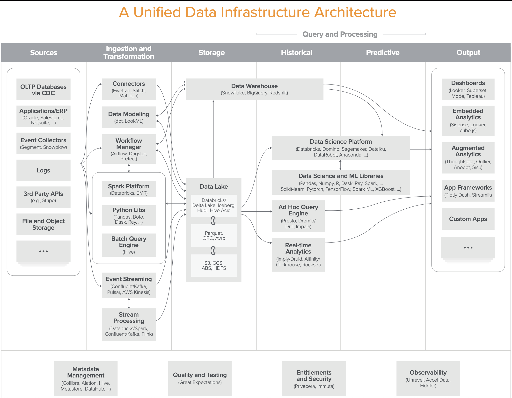
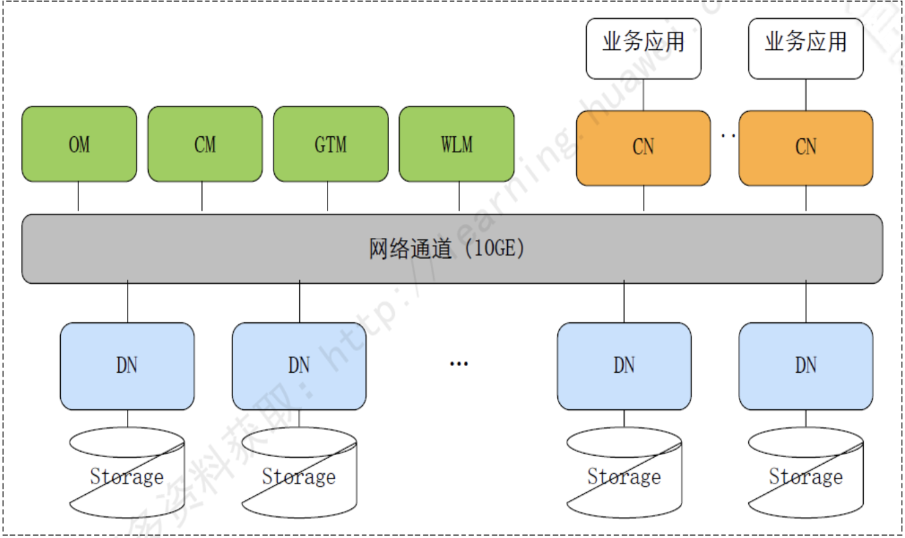

## 大数据研究-通用大数据产品分析
### BigData Product Requirement

主要是研究当前业内主流基于海量数据分析的大数据平台及行业解决方案,整合MPP与Hadoop特性,来解决海量数据的分析查询应用问题。

首先我们分享一下-通用数据基础架构



### 核心能力定义

**Core Capibility**

- Access to Multiple Data Sources 访问多数据源(多数据源混合查询)
- Administration and Management
- Advanced Analytics 
- Data Ingest(减少移动数据,增强移动计算)
- Managing Large Volumes of Data 
- Optimized Performance (Traditional/Exploratory)
- Flexible Scalability
- Variety of Data Types
- Workload Management(负载管理)
- Traditional Use Support

**ADW Utility**

- Traditional Data Warehouse
- Real-Time Data Warehouse(adhoc querying and data mining)
- Logical Data Warehouse

	This use case manages data variety and volume of data for both structured and other content data types.

- Context-Independent Data Warehouse

	This use case concerns new data values, variants of data form and new relationships. It supports search, graph and other capabilities for discovering new information models.


### 1.Huawei FusionInsight -> Huawei MRS


华为FusionInsight大数据平台是集Hadoop生态发行版FusionInsight HD、大规模并行处理MPP数据库FusionInsight LibrA、大数据云服务(Hadoop、Hive、Spark、HBase、MPPDB、流计算等组件)于一体的融合数据处理与服务平台。它支持统一的SQL引擎,拥有端到端全生命周期的解决方案能力。除了以上能力外，还提供数据分析挖掘平台、数据服务平台，帮助用户实现从数据到知识，从知识到智慧的转换，进而帮助用户从海量数据中挖掘数据价值。它支持私有化部署，及华为公共云或合作伙伴的公共云环境中部署。 


此外华为FusionInsight大数据平台是根据行业客户需求进行优化的解决方案。为解决用户在具体场景下的问题，提供许多创新的技术能力，举几个例子：

	1是统一SQL服务。大数据技术中有很多能够利用SQL语言进行数据处理的组件，比如Hive、SparkSQL、Elk、MPPDB等。

当用户对于这些组件进行业务开发时，需要对不同组件分别进行，造成很大的不便。FusionInsight提供统一SQL，对外业务界面只出现一个SQL开发管理界面，通过统一SQL的业务分发层进行业务分发，这样就简化了业务开发。同时，华为还提供了SQL on Hadoop引擎Elk，这个引擎完全兼容SQL 2003标准，无需修改测试脚本就可以通过TPC-DS测试，性能超过开源产品3倍。通过使用统一SQL技术，某大型保险公司实现了用大数据平台替代传统数仓，在复杂计算业务场景下，其性能提升了10-100倍。

	2是实时搜索。

华为FusionInsight率先实现了对Hadoop平台与MPP-DB数仓平台的统一全文检索Elk，率先支持SQL on Solr接口，提升业务开发效率5倍以上，独创标签索引方案，提升搜索性能3-10倍。目前，实时搜索技术在平安城市和金融行业已经实现商用。在国内某省的平安城市项目中，百亿级规模数据集中查询，**实时搜索响应时间<3秒**。

	3是实时决策。

与日常生活息息相关的很多业务是需要实时决策的，比如使用银行卡交易过程中的风险控制。由于传统技术处理速度的原因，往往只能实现事后风控。也就是说用户在刷卡完成后，银行才能够检查出来，刚才的交易是否有风险。这样对于银行和客户而言，都会有很大的风险存在。而华为FusionInsight实时决策平台，可以实现毫秒级复杂规则的风险检查，提供百万TIPS的业务处理能力，从而让风险控制从事后变为事中，并确保端到端的交易可在500毫秒内完成，不影响交易用户的体验。

	4是图分析技术。

在生活中有很多时候是需要进行用户的关系分析来进行风险控制和业务处理的。如果我们的客户中有一个是VIP客户，那么他的朋友符合VIP客户条件的可能性就会很大。因此如果我们能够通过关系分析技术找到他的朋友圈，在针对他的朋友进行针对性营销，那么业务成功的可能性也就会大大增加。但是，传统的数据库技术在处理客户关系发现时很困难，某公司曾经做过一个测试，想在2000万客户中发现客户间的关系信息，但是一直无法算出来。但是用图分析技术就可以很好解决这一类问题。因为在图数据库中，用户就是点，用户关系就是边，发现用户关系就变成了发现点与点间需要几条边的问题。华为的分布式图数据库，能够实现万亿顶点百亿边的实时查询，从而很快发现用户关系。在某项目中，华为帮助客户实现了13.7亿条关系图谱数据，3层关系查询秒级响应，从而大大提高了业务响应的速度。


#### Huawei FusionInsight HD-> Huawei Cloud MRS

针对离线处理场景，FusionInsight HD由如下组件来实现：HDFS负责存储所有数据；Yarn负责调度在离线平台上运行的所有任务，从数据加工、数据挖掘到数据分析；Mapreduce和Hive专门处理离线的具体任务，其中Mapreduce/Spark处理非SQL类、Hive/Spark SQL处理SQL类.借助上述组件，再加上数据采集组件,即可完成离线处理。

	- 统一的SQL接口
	- FusionInsight SparkSQL
	- 完全自研的SQL引擎Elk
	- Apache CarbonData数据存储格式(基于SparkSQL,有索引的列式存储)
	- 多级租户管理功能
	- 对异构设备支持


**FusionInsight Elk**

分布式查询执行引擎,支持并行计算。设计模式类似嫁接在HDFS之上MPP架构

_SQL on Hadoop_

	-支持标准SQL查询语法
	-针对HDFS数据的CBO代价估算模型
	-智能扫描,谓词条件直接下推HDFS.针对Hadoop ORC[Optimized Row Columnar)列式存储实现后期物化(Later-materialazation)]
	-LLVM优化(LLVM项目是模块化、可重用的编译器以及工具链技术的集合)
	-支持信息约束(Informational Constraint)
	-向量引擎(针对HDFS上存储的ORC列式结构化数据对接向量化执行引擎)
	-支持分区表
	-分布式高效读取HDFS数据

- [LLVM动态编译](https://llvm.org/)

_SQL on Spark_


**Apache CarbonData**

Apache CarbonData文件格式的2层索引的设计导致压缩率缩减与数据导入时间的延长

_Ref:_

- [CarbonData数据格式](https://www.cnblogs.com/happenlee/p/9202236.html)

#### Huawei FusionInsight LibrA-> Huawei Cloud DWS

FusionInsight LibrA是华为公司研发的OLAP(Online Analytical Processing)数据库，旨在为您提供轻松、可靠的企业数仓、数据集市和大数据SQL结构化数据分析解决方案。

FusionInsight LibrA采用MPP(Massive Parallel Processing)架构，支持行存储与列存储，提供PB(Petabyte，250字节)级别数据量的处理能力。在核心技术上较传统数据库有巨大优势，能够解决不同行业用户的数据分析性能问题，可以为超大规模数据分析提供高性价比的方案，并可用于支撑各类数据仓库系统、数据集市、BI(Business Intelligence)系统和决策支持系统。



**FusionInsight LibrA关键特性**

	- 专业的TD、Oracle迁移工具:支持平滑迁移，业务敏捷上线。
	- 数据入库快:支持并行数据导入，日入库达数百TB。
	- 查询响应快:全并行计算引擎，满足PB级业务所需。行列混和存储引擎，同时满足点查、复杂分析等混合业务场景。
	- 扩展性强:扩容不中断业务，且扩容后，容量/性能线性增长。
	- 企业级高可用:独创的主+备+Handoff三重数据保护，协调节点多活设计，提供企业级可靠性保障。
	- 安全:全方位安全保证机制，为数据安全保驾护航。
	- 全文检索:支持标准SQL对文本进行模糊搜索，提供文本数据类“Google”功能。
	- SQL On Hadoop:无缝集成Hadoop，可通过标准SQL访问和处理Hadoop数据。


### 2.Transwarp Data Hub+Transwarp Cloud Hub

TDH主要提供6款核心产品:

	Transwarp Inceptor是大数据分析数据库
	Transwarp Slipstream是实时计算引擎
	Transwarp Discover专注于利用机器学习从数据提中取价值内容
	Transwarp Hyperbase用于处理非结构化数据
	Transwarp Search用于构建企业搜索引擎
	Transwarp Sophon则是支持图形化操作的深度学习平台


#### Transwarp Inceptor - OLAP SQL查询分析数据库

在Inceptor中，您可以使用常见的数据库对象,包括数据库(database),表(table),视图(view)和函数(function)。您可以使用Inceptor SQL、Inceptor PL/SQL以及Inceptor SQL PL来操作这些数据库对象。

Transwarp Inceptor是基于Spark的分析引擎，从下往上有三层架构：

	- 最下面是存储层，包含分布式内存列式存储（Transwarp Holodesk），可建在内存或者SSD上;
	- 中间层是Spark计算引擎层，星环做了大量的改进保证引擎有超强的性能和高度的健壮性;
	- 最上层包括一个完整的SQL 99和PL/SQL编译器、统计算法库和机器学习算法库，提供完整的R语言访问接口。

#### Inceptor执行计划:

对SQL语句的执行需要交给Inceptor计算引擎，Inceptor主要由两类节点组成：主节点Inceptor Server，以及计算节点Executor。SQL语句由Inceptor Server解析执行，生成执行计划，最终RDD的变换执行过程组成Transwarp Spark DAG，RDD中不同的partition合理的分配给不同的计算节点Executor，每个partition对应于一个计算子任务，由Executor执行具体的计算处理。

Inceptor Spark是重构自研下的定制Spark

#### Inceptor编程模型:

Inceptor提供两种编程模型：

	一是基于SQL的编程模型，用于常规的数据分析、数据仓库类应用市场；SQLParser支持SQL 99标准/支持PL/SQL扩展/支持部分SQL 2003标准
	SQL解析器支持HiveQL解析器、SQL标准解析器和PL/SQL解析器 混合切换
	二是基于数据挖掘编程模型，可以利用R语言或者Spark MLlib来做一些深度学习、数据挖掘等业务模型。

#### Inceptor SQL Optimizer

*基于规则的优化器(Rule Based Optimizer)*

	- 文件读取时过滤
	- 过滤条件前置
	- 超宽表的读取过滤
	- Shuffle Stage的优化与消除
	- Partition消除

*基于成本的优化器(Cost Based Optimizer)*

	- JOIN顺序调优
	- JOIN类型的选择
	- 并发度的控制

#### Inceptor 数据存储

- Inceptor中数据库对象的元数据保存在Inceptor Metastore中
- 数据库对象内的数据可以存放支持在：Holodesk表/HDFS/HBase/Hyperbase/RDBMS

*Holodesk特性*

    - OLAP Cube

Holodesk支持在数据表中内建Cube，并在数据分析时有效的利用这些Cube信息来加速分析查询。
目前对于10亿级别的数据量，Transwarp Inceptor结合Holodesk能够在4台X86 PC服务器组成集群上5s内完成实时聚合运算，与传统Cube的预先物化计算不同，Holodesk利用Cube信息实时计算，没有过滤条件以及统计粒度的限制，提供完整的OLAP能力。

    - 索引

Holodesk支持用户对数据列建立索引来加速查询，因此对精确查询能够做到亚秒级返回。
另外Holodesk支持对多个列构建索引，并通过智能索引技术自动选择最高效的索引来执行物理计划，从而让SQL编程更加简单。

    - 为SSD优化的存储模型

为了给客户提供更高性价比的解决方案,Holodesk为SSD优化了存储模型，从而保证基于SSD的OLAP性能能够达到基于内存的性能80%以上，而成本降低到原有1/10。
Inceptor是Hadoop业界首个和SSD深度优化的SQL执行引擎。

    - 容错技术

Transwarp Holodesk通过Zookeeper来管理元数据，从而避免因为单点故障而导致的数据丢失，数据checkpoint在HDFS中。
服务在故障恢复之后，Holodesk能够通过Zookeeper中的信息自动重建数据与索引，因此有很高的可靠性。

    - 线性扩展

Holodesk中创建一个Cube额外消耗的时间和空间是固定的，创建多个Cube的开销是呈线性关系，同时Cube的数据也是分散保存在集群各个节点上。
另外，通过对SSD的针对优化与支持，可以将分析容量从基于内存GB级扩展到基于SSD的TB级，同时分析性能与容量随着节点的个数近乎线性增长。


	Comments:Spark执行引擎稳定性问题


### 3.Alibaba Cloud Compute Platform

- **[MaxCompute BigQuery Product](2021-11-07-bigdata-best-practice-maxcompute.md)**

- **[Hologres OLAP Product](2021-11-06-bigdata-best-practice-hologres.md)**


#### Alibaba Cloud - AnalyticDB(OLAP)

超大规模以及核心业务验证的PB级实时数据仓库

	FastSQL ( Base on Druid，经过开源社区8年的完善，语法支持已经非常完备)
	AnalyticDB的数据存储在阿里巴巴自研的盘古分布式文件系统上.

- 新硬件加速:SSD卡存储 / 利用GPU高并行计算能力，提升复杂数据计算的性能
- 曦和分析计算引擎:整体采用MPP架构，支持DAG计算模型，节点内引入LLVM等运行时代码编译优化技术.**引擎内置分时轮询的计算调度机制，可以保证高并发下作业任务的稳定运行**
- 智能存储索引:AnalyticDB支持创新的行列混存，同时针对不同的数据类型在数据加载写入时，智能的构建多种维度索引，包括B+索引、区间索引、倒排索引、位图索引等，并对传统索引算法进行创新，引入动态过滤、延迟物化等方式，极大的降低I/O，实现高性能的点或范围的检索，支持万亿级记录关联分析。
- 读写分离架构:整体采用读写分离架构，除支持大批量数据加载外，也支持每秒千万条记录的写入，写入成功即持久化保存在盘古分布式文件系统里，根据用户配置支持不同的数据一致性级别。

- [2018-AnalyticDB](https://yq.aliyun.com/articles/685491?spm=a2c4e.11153940.blogcont576159.16.14932338FEZZas)


### 4.All in Box - Cloud-Nativa Analytics Service 

Cloud Analytics Data Warehouse is new Next Generation model for Analytics as a Service.

Standard SQL -> OLTP 

Batch ETL -> OLAP analytics -> Online Service

Data Develop and Data Governance Platform

#### 云端大数据产品横向分析

**<u>4.1.Snowflow:Elastic Data Warehouse 一夜暴富的背后</u>**

Snowflake is a multi-tenant, transactional, secure, highly scalable and elastic system with full SQL support and built-in extensions for semi-structured and schema-less data.

- SaaS,acid事务，关系型数据库，半结构，列式存储
- MVCC,Snapshot

1.3. Also, following a pure service principle, Snowflake requires no physical tuning, data grooming, manual gathering of table statistics, or table vacuuming on the part of users.

2.1、parallel database system：redshift，share-nothing结构，需要数据迁移（A. Gupta et al. Amazon Redshift and the case for simpler datawarehouses. InProc. SIGMOD, 2015.）
2.2、BigQuery sql-like语言，tricky for sql-based。tables are append-only and require schemas

2.3、Document Stores and Big Data.Document storessuch as MongoDB, Couchbase Server, and ApacheCassandra ，challenge ：simple key-value and CRUD (create, read, update, and delete) APIof these systems is the difficulty to express more complexqueries.
Additionally, many “Big Data” engines now support queries over nested data,for example Apache Hive, Apache Spark, ApacheDrill, Cloudera Impala , and Facebook Presto.We believe that this shows a real need for complex analyticsover schema-less and semi-structured data,

When Snowflake was founded in 2012, the database worldwas fully focused onSQL on Hadoop, with over a dozensystems appearing within a short time span. At that time,the decision to work in a completely different direction, tobuild a “classic” data warehouse system for the cloud, seemeda contrarian and risky move. After 3 years of developmentwe are confident that it was the right one. Hadoop has notreplaced RDBMSs; it has complemented them. People stillwant a relational database, but one that is more efficient,flexible, and better suited for the cloud.

**<u>4.2.Snowflake vs Redshift</u>**

Snowflake的核心产品能力: 完全存算分离/工作负载隔离/极致性能。但是随着Redshift RA3新集群的出现提供成本更低与更便捷的竞对产品方案,这一切是否会有改变？

Redshift RA3新集群开始全新支持计算与存储资源独立弹性伸缩。这从2013年AWS作为Game Changer,发布云端Redshift以来的第一次重大升级。Redshift产品本身基于ParAcell 数据库技术,它就是云平台之上的MPP数据库。总结上说,
Redshift是一个部署在云端的MPP数据库,能够处理TB级数据如同GB级,支持分析/管理数据,云原生,可在小时级内按需资源扩容,使用纯SQL,把这些能力放在一起,确实是个吸引人的创新产品。但是由于历史的局限,导致Redshift主要以On-Premise(本地部署)架构为主。不过随着云上数仓越发定制，发展迅速，存在2个较大缺陷, 1是存储与计算的耦合,2是扩展伸缩现有的困难性与破坏性。主要问题在于很多公司存储资源与计算资源存在错配, 例如数据存储较大,但不需要计算资源，或者需要大量机器计算的ETL任务, 但非固定的吞吐量弹性扩展。Redshift的share-nothing architecture事实上会共享部分资源。

**典型MPP数据库(Redshift)水平扩展的计算性能慢且是真正的管理员任务。这一定需要数据复制/数据重分布, 增长存储能力需要更多磁盘+更多的服务器, 这样意味着存储本是不再便宜**

Redshift最近以来新产品升级: Redshift Spectrum 2017上线/Redshift Elastic Resize 2018上线。Redshift RA3 Cluster新机型现在开始支持存算分离, 其整体费用逐步下降, 更加让客户可接受。

但是Snowflake依然有着很大的产品优势,在完全的存算分离,线性且秒级弹性伸缩,完全独立多租户数据处理等全新的技术。

- Scales Seamlessly within Seconds.
- Scales Linearly, Saves You Time
- Seamless Time-Travel
- Near-Realtime Pipeline (Snowpipe)
- Cluster isolation

**Snowflake vs Redshift详细对比内容**

1-惯例成本

Redshift最小消费$2.4/hour / Snowflake 消费$2.5/hour。产品费用接近。

2-Auto-Suspend and Auto-Resume能力: 

 Snowflake拥有最顺畅的自动挂起和自动恢复能力.如果设置*alter warehouse suspend*，当suspend, 将计算Cost恢复为0。如果你忘记suspend,  Snowflake会根据设置时间来自动挂起, 可以按照每个Cluster来独立设置。相比之下，Redshift RA3的暂停和恢复距离无缝连接的体验较大。例如1个空的xlplus 2-node cluster 需要花费1m30s开始且暂停需要5分钟。这是一个非常重要的可用性能力, 一个典型公司在夜晚释放资源，却无法自动恢复当用户要重新查询，因为需要更多的时间来挂起和恢复。这个能力上Snowflake完胜。

3-Scaling伸缩性

 对于MPP数据库来说, 另一个重要的Feature在于不间断的弹性伸缩。其用户案例非常明显:如果你在执行ETL,可能你需要一个巨大的集群,因为你在处理海量数据,但当这些数据使用完之后,只需要一个很小的集群来使用。Snowflake对于资源的释放是非常迅速且不间断的。你可能在当前查询的过程中, 当你scale up到一个更大的集群, 下一个查询SQL可以直接使用。当然你也可以在暂停的状态下重新调整你的集群规模,  以至于下一个查询可以按照新的集群规格来执行。另一个Scaling的模式是"多集群"的水平扩展, 将你的集群"自我复制"成多集群以适应更大的工作负载，这可以手工触发or自动触发。再次,Redshift RA3又是一个完全不同的故事。Scaling伸缩性离丝滑顺畅比较远,它需要使用Console or API访问才能实现, 其最接近的对比选项是弹性规格变更,只支持双倍扩展现有集群，而且还需要5 minutes。这个能力上Snowflake明显有优势。

4-工作负载隔离

AWS Redshift有个明显的缺陷在于工作负载隔离。分析师尝试有非常重的查询,则大多数时候这些查询都是针对特定策略下主动的即席ad-hoc查询。缺少优秀的工作负载资源管理(WLM)设置, 一次又一次, 我们看到这些分析查询SQL导致Redshift集群的halt挂起。WLM管理难度很大,无论你如何方式, 总会有遗漏。

Redshift RA3到现在为止还未解决这个问题, 分析与ETL工作负载仍然在同一计算资源池内共享资源。Snowflake拥有非常完备的工作资源隔离能力。用户随时可以衍生出很多新的集群，所有的集群都会被完全互相隔离开来。典型场景是,你可以分别单独创立 分析集群/ETL集群/Reporting集群 3个独立集群，而且可以讲计算资源独立设置，并跟踪其资源消耗情况。Snowflake再胜一城

5-自动化数据脱敏

数据安全对于每个公司来说都非常重要, 其中数据脱敏扮演重要的部分。你需要确定你使用高效访问控制方式来限制任何个人隐私数据。关于Redshift, 我总是用我自己的安全架构, 其配置通过一层的Views来驱动并实现数据脱敏。另外也可以通过付费插件方式来实现，例如 [DataSunrise](https://aws.amazon.com/blogs/big-data/protect-and-audit-pii-data-in-amazon-redshift-with-datasunrise-security/)。Snowflake的确做得更加简洁，用它的动态列脱敏 [dynamic data masking](https://docs.snowflake.com/en/user-guide/security-column-ddm-use.html)。

另外还有些比较暖心的设计，当然不能上升为技术评估决定的因素。例如**Timetravel**,Snowflake支持非常顺滑的时间旅行功能。

```
select from table at(timestamp => '2020-13-31 12:01');
```

Redshift支持表级别的数据恢复从之前的某个snapshot切片，不过这是个管理员级别的操作。而Snowflake以undrop table命令来恢复之前删除的表。自动化数据提取/外表加载 2个数据库都支持。

总结

  首先, 通过很长时间的磨练，Redshift终于向更优秀的架构来演进了。当我以为已经到达终点的时刻，它实际上还需继续向前进一步。Redshift RA3本身就是基于S3存储之上的云数仓服务，为什么暂停释放一个空集群需要5分钟？为什么在执行暂停操作前一定要创建一个snapshot? 虽然AWS Redshift已是一个很不错的产品，但是Snowflake可能是更好的分析数据仓库产品选择，能为DBA/开发人员提供更强大的能力。

**[Google BigData&BigQuery Product](2019-05-01-bigdata-best-practice-google-tech-solution.md)**

**Microsoft Azure**

[CosmosDB](https://docs.microsoft.com/zh-cn/azure/cosmos-db/) 统一存储格式 + 不同数据库模型

 Dryad 有向无环图
 DryadLINQ

 Cosmos - Microsoft Azure

 文件系统
 压缩算法

 执行引擎 Dryad

SCOPE 
类似Pig的高级数据流语言
自动代码生成技术
查询优化非常好


### Z.技术趋势

