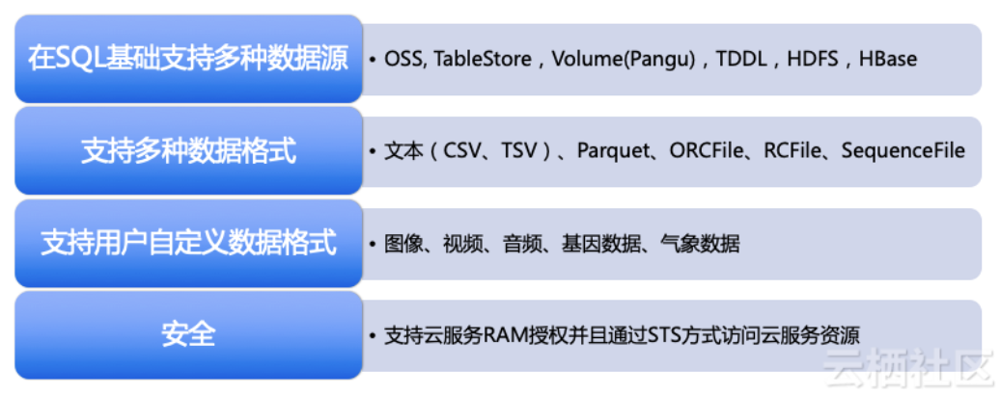

## 大数据产品-分析型大数据产品研究
--------------------------------------------------------

分析型大数据解决方案 主要是研究当前业内主流基于海量数据分析的大数据平台及行业解决方案,整合MPP与Hadoop特性,来解决海量数据的分析查询应用问题。

### 核心能力定义

**Core Capibility**

- Access to Multiple Data Sources 访问多数据源(多数据源混合查询)
- Administration and Management
- Advanced Analytics 
- Data Ingest(减少移动数据,增强移动计算)
- Managing Large Volumes of Data 
- Optimized Performance (Traditional/Exploratory)
- Flexible Scalability
- Variety of Data Types
- Workload Management(负载管理)
- Traditional Use Support

**ADW Utility**

-Traditional Data Warehouse
-Real-Time Data Warehouse(adhoc querying and data mining)
-Logical Data Warehouse

	This use case manages data variety and volume of data for both structured and other content data types.

-Context-Independent Data Warehouse

	This use case concerns new data values, variants of data form and new relationships. It supports search, graph and other capabilities for discovering new information models.


#### 1.Google BigQuery

基于Dremel的GoogleBigQuery

- Concept: distributed search engine design
- Dremel provides a high-level, SQL-like language to express ad hoc queries without translating them into MR job.
- Dremel uses a column-striped storage representation, which enables it to read less data from secondary storage and reduce CPU cost due to cheaper compression


1.A high-performance storage layer is critical for in situ data management.
2.Columnar storage proved successful for flat relational data but making it work for Google required adapting it to a nested data model.

_Ref:_

- [BigQuery](https://cloud.google.com/bigquery/)
- [SQLonHadoop研究Note-Dremel](2017-04-04-olap-sqlonhadoop-research-note.md)


#### 2.Huawei FusionInsight


华为FusionInsight大数据平台是集Hadoop生态发行版FusionInsight HD、大规模并行处理MPP数据库FusionInsight LibrA、大数据云服务(Hadoop、Hive、Spark、HBase、MPPDB、流计算等组件)于一体的融合数据处理与服务平台。它支持统一的SQL引擎,拥有端到端全生命周期的解决方案能力。除了以上能力外，还提供数据分析挖掘平台、数据服务平台，帮助用户实现从数据到知识，从知识到智慧的转换，进而帮助用户从海量数据中挖掘数据价值。它支持私有化部署，及华为公共云或合作伙伴的公共云环境中部署。 


此外华为FusionInsight大数据平台是根据行业客户需求进行优化的解决方案。为解决用户在具体场景下的问题，提供许多创新的技术能力，举几个例子：

	1是统一SQL服务。大数据技术中有很多能够利用SQL语言进行数据处理的组件，比如Hive、SparkSQL、Elk、MPPDB等。

当用户对于这些组件进行业务开发时，需要对不同组件分别进行，造成很大的不便。FusionInsight提供统一SQL，对外业务界面只出现一个SQL开发管理界面，通过统一SQL的业务分发层进行业务分发，这样就简化了业务开发。同时，华为还提供了SQL on Hadoop引擎Elk，这个引擎完全兼容SQL 2003标准，无需修改测试脚本就可以通过TPC-DS测试，性能超过开源产品3倍。通过使用统一SQL技术，某大型保险公司实现了用大数据平台替代传统数仓，在复杂计算业务场景下，其性能提升了10-100倍。

	2是实时搜索。

华为FusionInsight率先实现了对Hadoop平台与MPP-DB数仓平台的统一全文检索Elk，率先支持SQL on Solr接口，提升业务开发效率5倍以上，独创标签索引方案，提升搜索性能3-10倍。目前，实时搜索技术在平安城市和金融行业已经实现商用。在国内某省的平安城市项目中，百亿级规模数据集中查询，**实时搜索响应时间<3秒**。

	3是实时决策。

与日常生活息息相关的很多业务是需要实时决策的，比如使用银行卡交易过程中的风险控制。由于传统技术处理速度的原因，往往只能实现事后风控。也就是说用户在刷卡完成后，银行才能够检查出来，刚才的交易是否有风险。这样对于银行和客户而言，都会有很大的风险存在。而华为FusionInsight实时决策平台，可以实现毫秒级复杂规则的风险检查，提供百万TIPS的业务处理能力，从而让风险控制从事后变为事中，并确保端到端的交易可在500毫秒内完成，不影响交易用户的体验。

	4是图分析技术。

在生活中有很多时候是需要进行用户的关系分析来进行风险控制和业务处理的。如果我们的客户中有一个是VIP客户，那么他的朋友符合VIP客户条件的可能性就会很大。因此如果我们能够通过关系分析技术找到他的朋友圈，在针对他的朋友进行针对性营销，那么业务成功的可能性也就会大大增加。但是，传统的数据库技术在处理客户关系发现时很困难，某公司曾经做过一个测试，想在2000万客户中发现客户间的关系信息，但是一直无法算出来。但是用图分析技术就可以很好解决这一类问题。因为在图数据库中，用户就是点，用户关系就是边，发现用户关系就变成了发现点与点间需要几条边的问题。华为的分布式图数据库，能够实现万亿顶点百亿边的实时查询，从而很快发现用户关系。在某项目中，华为帮助客户实现了13.7亿条关系图谱数据，3层关系查询秒级响应，从而大大提高了业务响应的速度。


##### Huawei FusionInsight HD(Hadoop)

针对离线处理场景，FusionInsight HD由如下组件来实现：HDFS负责存储所有数据；Yarn负责调度在离线平台上运行的所有任务，从数据加工、数据挖掘到数据分析；Mapreduce和Hive专门处理离线的具体任务，其中Mapreduce/Spark处理非SQL类、Hive/Spark SQL处理SQL类.借助上述组件，再加上数据采集组件,即可完成离线处理。

	- 统一的SQL接口
	- FusionInsight SparkSQL
	- 完全自研的SQL引擎Elk
	- Apache CarbonData数据存储格式(基于SparkSQL,有索引的列式存储)
	- 多级租户管理功能
	- 对异构设备支持


**FusionInsight Elk**

分布式查询执行引擎,支持并行计算。设计模式类似嫁接在HDFS之上MPP架构

_SQL on Hadoop_

	-支持标准SQL查询语法
	-针对HDFS数据的CBO代价估算模型
	-智能扫描,谓词条件直接下推HDFS.针对Hadoop ORC[Optimized Row Columnar)列式存储实现后期物化(Later-materialazation)]
	-LLVM优化(LLVM项目是模块化、可重用的编译器以及工具链技术的集合)
	-支持信息约束(Informational Constraint)
	-向量引擎(针对HDFS上存储的ORC列式结构化数据对接向量化执行引擎)
	-支持分区表
	-分布式高效读取HDFS数据

- [LLVM动态编译](https://llvm.org/)

_SQL on Spark_


**Apache CarbonData**

Apache CarbonData文件格式的2层索引的设计导致压缩率缩减与数据导入时间的延长

_Ref:_

- [CarbonData数据格式](https://www.cnblogs.com/happenlee/p/9202236.html)

##### Huawei FusionInsight LibrA(MPPDB)
    
FusionInsight LibrA是华为公司研发的OLAP(Online Analytical Processing)型数据库，旨在为您提供轻松、可靠的企业数仓、数据集市和大数据SQL结构化数据分析解决方案。
 
FusionInsight LibrA采用MPP(Massive Parallel Processing)架构，支持行存储与列存储，提供PB(Petabyte，250字节)级别数据量的处理能力。在核心技术上较传统数据库有巨大优势，能够解决不同行业用户的数据分析性能问题，可以为超大规模数据分析提供高性价比的方案，并可用于支撑各类数据仓库系统、数据集市、BI(Business Intelligence)系统和决策支持系统。


**FusionInsight LibrA关键特性**
 
	- 专业的TD、Oracle迁移工具:支持平滑迁移，业务敏捷上线。
	- 数据入库快:支持并行数据导入，日入库达数百TB。
	- 查询响应快:全并行计算引擎，满足PB级业务所需。行列混和存储引擎，同时满足点查、复杂分析等混合业务场景。
	- 扩展性强:扩容不中断业务，且扩容后，容量/性能线性增长。
	- 企业级高可用:独创的主+备+Handoff三重数据保护，协调节点多活设计，提供企业级可靠性保障。
	- 安全:全方位安全保证机制，为数据安全保驾护航。
	- 全文检索:支持标准SQL对文本进行模糊搜索，提供文本数据类“Google”功能。
	- SQL On Hadoop:无缝集成Hadoop，可通过标准SQL访问和处理Hadoop数据。


#### 3.Transwarp Data Hub

TDH主要提供6款核心产品:

	Transwarp Inceptor是大数据分析数据库
	Transwarp Slipstream是实时计算引擎
	Transwarp Discover专注于利用机器学习从数据提中取价值内容
	Transwarp Hyperbase用于处理非结构化数据
	Transwarp Search用于构建企业搜索引擎
	Transwarp Sophon则是支持图形化操作的深度学习平台


##### Transwarp Inceptor - OLAP SQL查询分析数据库

在Inceptor中，您可以使用常见的数据库对象,包括数据库(database),表(table),视图(view)和函数(function)。您可以使用Inceptor SQL、Inceptor PL/SQL以及Inceptor SQL PL来操作这些数据库对象。

Transwarp Inceptor是基于Spark的分析引擎，从下往上有三层架构：

	- 最下面是存储层，包含分布式内存列式存储（Transwarp Holodesk），可建在内存或者SSD上;
	- 中间层是Spark计算引擎层，星环做了大量的改进保证引擎有超强的性能和高度的健壮性;
    - 最上层包括一个完整的SQL 99和PL/SQL编译器、统计算法库和机器学习算法库，提供完整的R语言访问接口。

##### Inceptor执行计划:

对SQL语句的执行需要交给Inceptor计算引擎，Inceptor主要由两类节点组成：主节点Inceptor Server，以及计算节点Executor。SQL语句由Inceptor Server解析执行，生成执行计划，最终RDD的变换执行过程组成Transwarp Spark DAG，RDD中不同的partition合理的分配给不同的计算节点Executor，每个partition对应于一个计算子任务，由Executor执行具体的计算处理。

Inceptor Spark是重构自研下的定制Spark

##### Inceptor编程模型:

Inceptor提供两种编程模型：

	一是基于SQL的编程模型，用于常规的数据分析、数据仓库类应用市场；SQLParser支持SQL 99标准/支持PL/SQL扩展/支持部分SQL 2003标准
	SQL解析器支持HiveQL解析器、SQL标准解析器和PL/SQL解析器 混合切换
	二是基于数据挖掘编程模型，可以利用R语言或者Spark MLlib来做一些深度学习、数据挖掘等业务模型。

##### Inceptor SQL Optimizer

*基于规则的优化器(Rule Based Optimizer)*

	- 文件读取时过滤
	- 过滤条件前置
	- 超宽表的读取过滤
	- Shuffle Stage的优化与消除
	- Partition消除

*基于成本的优化器(Cost Based Optimizer)*

	- JOIN顺序调优
	- JOIN类型的选择
	- 并发度的控制

##### Inceptor 数据存储

- Inceptor中数据库对象的元数据保存在Inceptor Metastore中
- 数据库对象内的数据可以存放支持在：Holodesk表/HDFS/HBase/Hyperbase/RDBMS

*Holodesk特性*

    - OLAP Cube

Holodesk支持在数据表中内建Cube，并在数据分析时有效的利用这些Cube信息来加速分析查询。
目前对于10亿级别的数据量，Transwarp Inceptor结合Holodesk能够在4台X86 PC服务器组成集群上5s内完成实时聚合运算，与传统Cube的预先物化计算不同，Holodesk利用Cube信息实时计算，没有过滤条件以及统计粒度的限制，提供完整的OLAP能力。

    - 索引

Holodesk支持用户对数据列建立索引来加速查询，因此对精确查询能够做到亚秒级返回。
另外Holodesk支持对多个列构建索引，并通过智能索引技术自动选择最高效的索引来执行物理计划，从而让SQL编程更加简单。

    - 为SSD优化的存储模型

为了给客户提供更高性价比的解决方案,Holodesk为SSD优化了存储模型，从而保证基于SSD的OLAP性能能够达到基于内存的性能80%以上，而成本降低到原有1/10。
Inceptor是Hadoop业界首个和SSD深度优化的SQL执行引擎。

    - 容错技术

Transwarp Holodesk通过Zookeeper来管理元数据，从而避免因为单点故障而导致的数据丢失，数据checkpoint在HDFS中。
服务在故障恢复之后，Holodesk能够通过Zookeeper中的信息自动重建数据与索引，因此有很高的可靠性。

    - 线性扩展

Holodesk中创建一个Cube额外消耗的时间和空间是固定的，创建多个Cube的开销是呈线性关系，同时Cube的数据也是分散保存在集群各个节点上。
另外，通过对SSD的针对优化与支持，可以将分析容量从基于内存GB级扩展到基于SSD的TB级，同时分析性能与容量随着节点的个数近乎线性增长。


	Comments:Spark执行引擎稳定性问题


#### 4.Huawei FusionInsight vs Transwarp Inceptor


#### 5.Alibaba Cloud - MaxCompute

“新一代计算引擎”的底层技术主要有三个：MaxCompute（离线计算）、Flink（实时计算）、PAI（人工智能）。在它们之上，是用来统一调度各个技术模块的操作系统：DataWorks。


MaxCompute主要服务于批量结构化数据的存储和计算,可以提供海量数据仓库的离线计算解决方案以及针对大数据的分析建模服务。

基于Datalake的技术，把不同的数据源用类似的方式存储，用统一的方法计算。是同一SQL查询引擎

**MaxCompute特点:**

    - 大规模计算存储(海量离线计算)
    MaxCompute 适用于 100GB 以上规模的存储及计算需求，最大可达 EB 级别。
    - 多种计算模型 - NewSQL
    MaxCompute 支持 SQL、MapReduce、Graph 等计算类型及 MPI 迭代类算法。
    - 强数据安全
    MaxCompute已稳定支撑阿里全部离线分析业务7年以上，提供多层沙箱防护及监控。
    - 低成本
    与企业自建私有云相比，MaxCompute的计算存储更高效，可以降低20%-30%的采购成本。
    - AliORC文件格式


_MaxCompute查询计算_




_MaxCompute流计算引擎?_

_MaxCompute SQL Parser & SQL Optimizer_

	- 基于Volcano火山模型的CBO
	- Vectorized Execution Engine in MaxCompute 2.0
	- 优化规则
	- RBO&CBO&HBO模型

在编译器方面,基于AST的编译器模型,Visitor模型（Antlrv4），IDE IntelliSense，Warning支持完整的存储过程，LOOP/IFELSE判断等；

在优化器方面，CBO基于代价的优化器，Volcano模型，展开各种可能等价的执行计划，然后依赖统计信息，计算这些等价执行计划的“代价”，最后最低的执行计划

主要包括类型：RBO/CBO/HBO

RBO是基于规则的优化器，在早期的MaxCompute中使用，是一种过时的优化器框架，它只认规则，对数据不敏感。优化是局部贪婪，容易陷入局部优化但全局差的场景，容易受应用规则的顺序而生产迥异的执行计划，往往结果不是最优的。

CBO是基于代价的优化器，它实际上是Volcano模型，可以展开各种可能等价的执行计划，然后依赖数据的统计信息，计算这些等价执行计划的代价，最后从中选用Cost最低的执行计划。

分布式场景的优化有别于单机优化。上图是在两张表上进行Join操作的简单案例，假设表T1已经按照a，b进行了分区；表T2按照a进行了分区。如果在单机系统中，分区问题不会出现；在分布式系统中，因为分区的出现可能会产生两个不同的执行计划：第一个执行计划是将T1按照a进行重新分区，之后再和T2进行Join；另一种执行计划是假设T1很大，而T2相对没那么大，此时不对T1重新进行分区，而是将T2数据广播给T1的每个分区。两种执行计划在不同的环境各具优势。

HBO:在大流量、高并发场景中，每天都需要处理大量相似的查询，这就给优化器带来了巨大机会。HBO优化器是基于历史优化的优化器，对每天提交的查询进行聚类，把以前运行数据作为Hint来帮助未来的相似的查询上。

在运行时方面，利用LLVM技术，在运行时生成较优的机器码，采用列式执行框架，提高CPU流水线的执行效率，并提高缓存命中率，使用SIMD。


_MaxCompute数据安全_


_MaxCompute2018_

	- 超大规模的大数据计算服务
	- 通过计算下推来实现的*联合计算*
		如何实现联动多个存储和计算系统?
		如何实现最终的数据统一计算?
		联合计算的计算性能提升到底有多少?
	- Auto Data Warehouse数据自动驾驶
	- 面向企业的完整服务,跨集群数据容灾与调度系统(金融行业)
	- 新查询语言叫做NewSQL，它是阿里巴巴定义的一套新的大数据语言，这套语言兼容传统SQL特性，同时又提供imperative与declarative优势。


	Comments:
	1.多个数据仓库产品功能重叠(HybridDB / AnalyticDB / PolarDB / MaxCompute / OceanBase)
	2.缺少全球化的TechWriter,以支持非中国区客户
	3.MaxCompute从大数据技术工具整合阿里数据提供深度数据模型分析服务。数据+技术=数据价值商业呈现(数据变现思考)
	4.超大规模的大数据计算服务(多租户体系)的核心应用场景在哪里?除了阿里和城市大脑。独立的大数据计算平台是不是更适合企业?
	5.MaxCompute面对企业客户如何设置ROI(低成本是如何定义的),如何合理定价来确保MaxCompute成本与收益?
	6.2019年MaxCompute面对的最大问题与挑战是什么? 如何面向国际化?
	7.如何规划与实现MaxCompute的生态圈与合作伙伴?
	8.MaxCompute与Spanner的差距到底在哪里?
	9.华为FusionInsight方案为什么在外媒眼中更加受欢迎?


_Ref:_

- [MaxCompute Ref](https://yq.aliyun.com/articles/78108)
- [MaxCompute 2.0](https://yq.aliyun.com/articles/656158?spm=a2c4e.11153940.blogcont78108.63.4f88123cEqWDsN)


#### Alibaba Cloud - AnalyticDB(OLAP)

超大规模以及核心业务验证的PB级实时数据仓库

	FastSQL ( Base on Druid，经过开源社区8年的完善，语法支持已经非常完备)
	AnalyticDB的数据存储在阿里巴巴自研的盘古分布式文件系统上.

- 新硬件加速:SSD卡存储 / 利用GPU高并行计算能力，提升复杂数据计算的性能
- 曦和分析计算引擎:整体采用MPP架构，支持DAG计算模型，节点内引入LLVM等运行时代码编译优化技术.**引擎内置分时轮询的计算调度机制，可以保证高并发下作业任务的稳定运行**
- 智能存储索引:AnalyticDB支持创新的行列混存，同时针对不同的数据类型在数据加载写入时，智能的构建多种维度索引，包括B+索引、区间索引、倒排索引、位图索引等，并对传统索引算法进行创新，引入动态过滤、延迟物化等方式，极大的降低I/O，实现高性能的点或范围的检索，支持万亿级记录关联分析。
- 读写分离架构:整体采用读写分离架构，除支持大批量数据加载外，也支持每秒千万条记录的写入，写入成功即持久化保存在盘古分布式文件系统里，根据用户配置支持不同的数据一致性级别。

- [2018-AnalyticDB](https://yq.aliyun.com/articles/685491?spm=a2c4e.11153940.blogcont576159.16.14932338FEZZas)

#### Alibaba Cloud - DRDS(OLTP)

- 分布式SQL引擎
- 分库分表
- 分布式事务
- 平滑扩容
- 弹性升降配
- 读写分离
- 分析型只读实例
- 并发型只读实例
- SQL审计与分析
- 全局唯一数字ID

#### 6.GBase+Informix

GBase 8a


#### X.技术思考

**1.数据治理(数据清洗/)智能算法**

智能数据清洗与识别补充缺失值

客户ID-Merge算法

例如:Cloudera Navigator(for data governance).国内的数据治理可能难度更多,更有本地化优化的空间

**2.大数据查询优化设计+联合计算**

Calcite -> Spark Catalyst -> Dremel查询优化

**3.DataModel数据模型设计优化**

面向Document的数据模型结构
```
message Document {
  required int64 DocId;
  optional group Links {
    repeated int64 Backward;
    repeated int64 Forward; }
  repeated group Name {
    repeated group Language {
      required string Code;
      optional string Country; }
    optional string Url; }}
```

**4.大数据存储结构设计**

design memory and disk-based column store

Dremel NESTED COLUMNAR STORAGE

内存列式存储优化

LSM数据结构-HDFS/GFS设计差异,定制化文件系统

HDFS缓存

VolumeScanner、 DirectoryScanner and DiskChecker

共享数据的高可用性

例如:MapR Network File System (NFS)

#### Y.技术研究

 Dryad 有向无环图
 DryadLINQ

 Cosmos
 文件系统
 压缩算法

 执行引擎 Dryad

SCOPE 
类似Pig的高级数据流语言
自动代码生成技术
查询优化非常好

[CosmosDB](https://docs.microsoft.com/zh-cn/azure/cosmos-db/) 统一存储格式 + 不同数据库模型


Amazon

Dynamo:

DynamoDB

Elastic MapReduce

Redshift/Snowflake 云端弹性数据仓库

Aurora论文

Athena - Presto

Glue

JStorm/Blink

PolarDB

 

#### Z.技术趋势

MaxCompute技术趋势

_1.新硬件的发展_

计算层面越来越与新硬件的创新紧密结合，硬件会带来平台革命。例如芯片类的CPU(AVX、SIMD)、ARM众核架构、GPU，FPGA，ASIC，存储类的NVM、SSD、SRM，网络类的智能网卡和RDMA等新硬件的发展，新硬件与软件的配合是值得关注的发展方向。

	Comments:硬件提升大数据计算性能提升

_2.非关系型计算领域(图计算)有很多机会_

大数据现在还是在关系型的处理层面，包括流和批都是基于关系型数据的计算，事实上，现在非关系的计算越来越流行了，包括知识图谱、画像等越来越有价值，这些数据组织不是关系型表达，而是以点边的形式用图的方式表达，更符合物理抽象，比如人和货的关系，在风控层面，知识图谱层面，用来描述物理实体的关系更合适。

明年初将会推出MaxCompute的图计算系统MaxGraph，支持图存储、查询、模式匹配和GraphEmbedding等机器学习运算。

	Comments:基于MaxGraph的知识图谱+用户画像模型设计.这些能力应用在哪里?

_3.非结构化数据将变成大数据的主流_

越来越多的短视频、图片、语音类数据，并随着IoT的发展，可能占据80%的数据量，由于这类数据的特性在于结构各不相同，且数据非常大但是单位价值不高（相比传统结构化数据），如何快速高效的解析和处理非结构化数据，是计算平台的关键挑战。

去年的时候MaxCompute发布了一个非结构化数据处理模块，能够用户自定义的方式处理包括视频音频在内的数据。

	Comments:对非结构化数据处理(视频/音频)的意义在哪里? 视频/音频等内容数据的监测分析,用户的视频镜头偏好

_4.AI for Everything(also for BigData)_

DBA或将被淘汰？

大数据的特点是大，不仅仅是包括数据的处理规模，还包括了整个的海量数据的管理和优化。传统数据库领域依靠DBA人力去管理的模式将不再适用。

用AI优化数据分布、数据管理、做计算优化和成本优化(例如自动SubQuery合并,智能索引建立等)。“让大数据无人驾驶”，这也是未来的趋势。

	Comments:AI对大数据的影响与互补如何具体落地?


