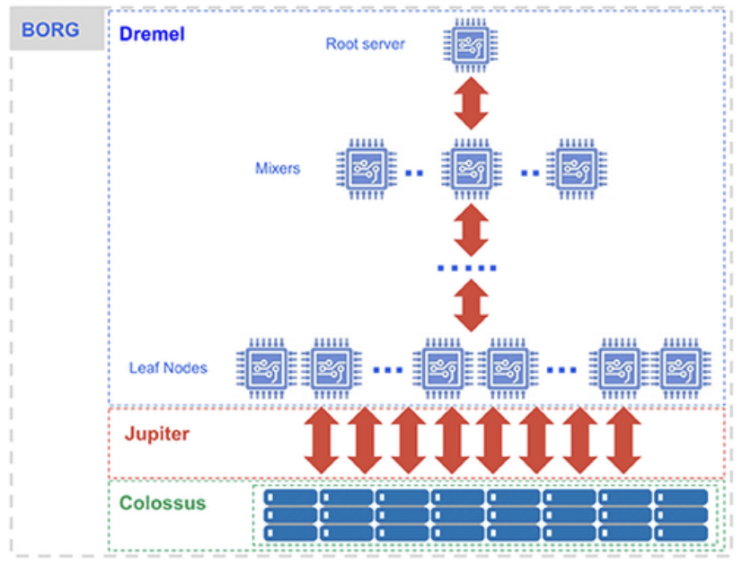
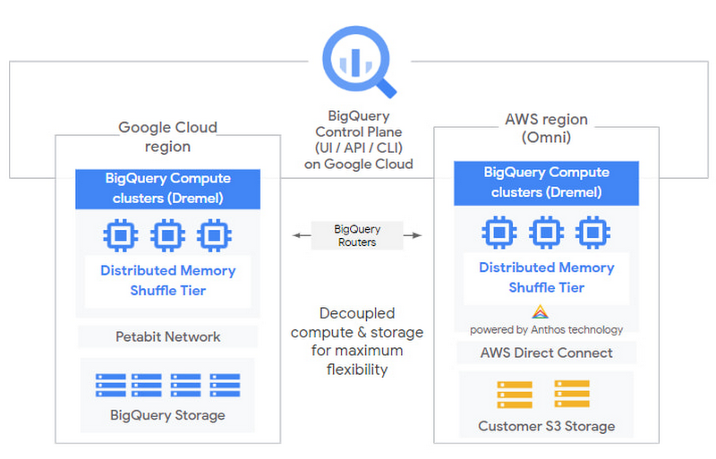
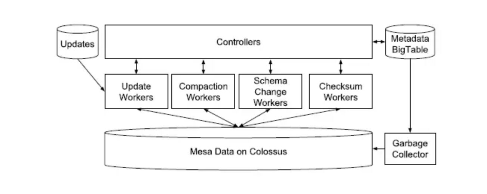
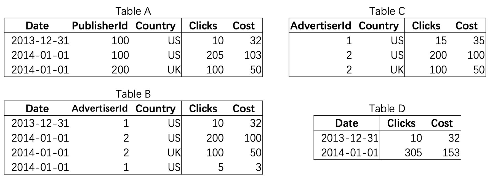
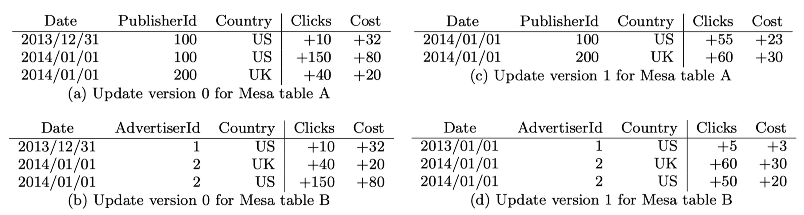
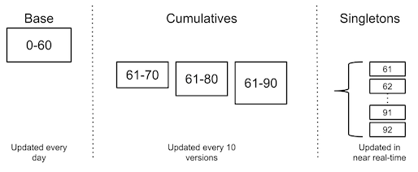
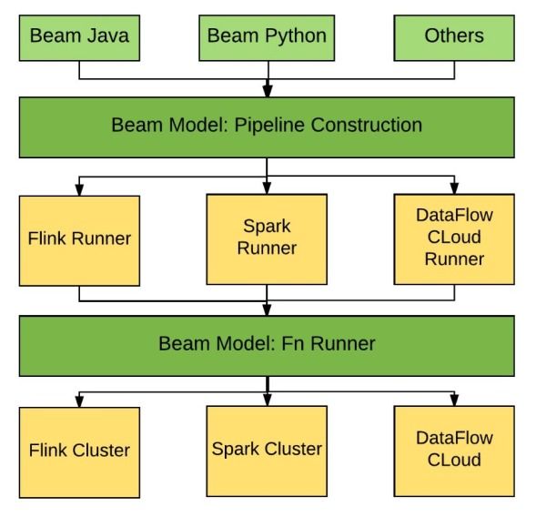

## 大数据研究-GoogleCloud产品解决方案
### I. Google Cloud Product - BigQuery

BigQuery作为GCP的主力大数据分析产品, 其事实上一个云上Serverless database的GCP产品.  

其中BigQuery最核心组件是基于Dremel分析引擎:

- 概念-Concept: distributed search engine design
- 定义-Dremel provides a high-level, SQL-like language to express ad-hoc queries without translating them into MR job.
- 存储-Dremel uses a column-striped storage representation, which enables it to read less data from secondary storage and reduce CPU cost due to cheaper compression

其中有明显的设计差异, 例如:

	- extensive use of stateful caching (Dremel is mostly stateless), 
	- Execution model-Volcano / Exchange Operator(Parallel Database)
	- separate instances where each is optimized for different use cases (Dremel is a global shared service across all users)
	- Nested type->column store
	- use of indexable columnar formats optimized for lookups (Capacitor, unlike Artus, does not have indexes), etc.
	- Storage Format, Capacitor and Parquet

以上这些差异使 Procella 适用于许多额外的工作负载 (e.g high QPS reporting and lookup queries)

- 查询-adhoc,trival-and-error analytics tens of seconds 35billion rows
		
		full scan全表扫描: 不需要Indices和pre-aggregation in-memory/flash,columar storage,parallel disk IO.
		虽然 MapReduce 适用于数据挖掘等长时间运行的批处理过程，但 BigQuery 是需要尽快获得结果的即席 OLAP/BI 查询的最佳选择。

**BigQuery背后的技术-Dremel + Colossus + Borg + Jupiter**

***Dremel: The Execution Engine***

Dremel将你的SQL语句转化成执行树。执行树的叶子节点被称为'slots'-插槽。大规模数据计算并从Colossus读取数据，插槽可读取千亿行数据并对每行做正则表达式的check。

这执行树的分支被称为'mixers'-混合器, 它将用于聚合aggregation。 在shuffle过程中, 借助Google’s *Jupiter network*的技术优势可迅速准确地在多节点间迁移数据。混合器mixers与槽位slots都运行在Borg资源调度器内,并分配信息到硬件上。

Dremel 根据需求动态地将插槽slot分配给查询，从而在同时查询的多个用户之间保持公平。单个用户可以获得_数千个插槽slot_来运行他们的查询。

Dremel 在 Google 被广泛使用——从搜索到广告ads，从 youtube 到 gmail——内部客户使用导致其非常重视且不断改进 Dremel。 BigQuery 用户受益于性能、耐用性、效率和可扩展性的持续改进，而无需停机和与传统技术相关的升级。

***Colossus: Distributed Storage***

BigQuery 依赖于 Google 最新一代的分布式文件系统 *Colossus*。每个 Google 数据中心都有自己的 Colossus 集群，每个 Colossus 集群都有足够的磁盘来一次为每个 BigQuery 用户提供数千个专用磁盘。 Colossus 还处理复制、恢复（当磁盘崩溃时）和分布式高可用管理（因此没有单点故障）。 Colossus 的速度足以让 BigQuery 为许多内存数据库提供类似的性能，但利用了更便宜但高度并行化、可扩展、持久和高性能的基础架构。

BigQuery 利用 *ColumnIO 列式存储格式* 和压缩算法以最佳方式将数据存储在 Colossus 中，以读取大量结构化数据。Colossus 允许 BigQuery 用户无缝扩展到数十 PB 的存储空间，而无需支付附加费用更昂贵的计算资源——相比典型的大多数传统数据库。

BigQuery Storage = [Inside Capacitor, BigQuery’s next-generation columnar storage format](https://cloud.google.com/blog/products/bigquery/inside-capacitor-bigquerys-next-generation-columnar-storage-format)

***Borg: 分布式资源调度, K8s的原型***

为了给用户提供数以千计的专用于处理任务的 CPU 内核，BigQuery 充分利用了 Google 的大型集群资源管理系统 Borg。 Borg 集群运行在数十万台机器和数十万个内核上，因此使用 3300 个 CPU 的查询只使用了 BigQuery所保留的容量的一小部分，而 BigQuery 的容量只是 Borg 集群容量的一小部分。 Borg 将服务器资源分配给作业任务；在这种情况下，作业任务执行在 Dremel 集群上。

运行大型生产数据中心时可能会出现机器崩溃、电源故障、网络交换机死机以及无数其他问题。 Borg 绕着它走，软件层被抽象了。在 Google 规模上，每天都会有数千台服务器出现故障，而 Borg 保护内部免受这些故障的影响。有人在运行查询的过程中拔掉了数据中心的机架，而您永远不会注意到其中的差异。

***Jupiter: The Network***

除了明显的资源调度与计算资源需求, 大数据负载往往受到网络throughput的控制与节制。Google’s Jupiter网络支持整个对半带宽(bisection bandwidth)传输1Pb/s数据, 允许高效且迅速分发大负载数据。

Jupiter网络基础设施可能是GCP中单独最大的差异点。它提供足够带宽来支持100000台机器以10Gbs的带宽来互相访问。其网络带宽要求查询语句只使用少于整个系统容量的0.1%资源。全双工带宽(full-duplex bandwidth)意味着整个集群的地理位置不在重要。如果每个机器都能以10 Gbps网络带宽访问集群中其他机器,机架不在重要。

典型的存储和计算分离的解决方案包括将数据保存在像 Google Cloud Storage 或 AWS S3 这样的对象存储中，并将数据按需加载到 VM。这种方法通常比 HDFS 等共租户架构更有效，但会受到本地 VM 和对象存储吞吐量限制。Jupiter 允许我们完全绕过这个过程，并在几秒钟内直接从存储中读取 TB 的数据，用于每个 SQL 查询。

### II.Google Cloud Product -  BigData Product Series

**Dataplex** - Data Lake Formation

利用 Dataplex 的智能数据结构摆脱数据孤岛，使组织能够通过一致的控制集中管理、监控和治理跨数据湖、数据仓库和数据集市的数据，提供对可信数据的访问并支持大规模分析。

##### 集中式安全和治理

对数据授权和分类进行集中的政策管理、监控和审核。分布式数据所有权，可跨数据和相关工件（如机器学习模型）进行全球范围的监控和治理。

##### 元数据管理

借助内置数据智能，对数据孤岛中的结构化、半结构化和非结构化数据自动执行数据发现、数据分类、架构检测、元数据收集和注册。您可以通过各种分析和数据科学工具轻松访问这些数据。

##### 数据质量

自动处理分布式数据中的数据质量，实现对可信数据的开箱即用访问。使数据质量成为 DataOps 不可或缺的一部分。

##### 数据生命周期管理

使用 Dataplex 数据湖和数据可用区，将跨多个存储服务的数据按逻辑整理为特定业务领域。只需点击一下，即可轻松管理、挑选、分层和归档数据。

##### 专为分布式数据构建

统一数据，避免移动或重复。使数据保留在原地，最大限度地降低费用并提高性能。

### III.Google Cloud Product -  Open Platform for Mult-Cloud

Google Cloud 在开放平台上的赌注开始通过 Anthos 和 BigQuery Omni 实现。

**_BigQuery Omni-Multi-Cloud Data Analytics_**

Google宣布了[BigQuery Omni](https://cloud.google.com/blog/products/data-analytics/introducing-bigquery-omni) ，这是一种多云分析解决方案，可以在Google Cloud，AWS和Azure上运行BigQuery(即将推出)。 现在，无论数据存储在何处，客户都可以使用相同的BigQuery UI或API来运行SQL查询并构建BigQuery ML模型。 更重要的是，BigQuery Omni在Anthos上运行，并揭示了Kurian和Google Cloud的战略，以扩大其可寻址市场。 最初，Anthos是“简单”的混合和多云应用程序平台，利用其强大的Kubernetes主干网将本地和现有AWS / Azure应用程序迁移到GCP上。 Google希望通过BigQuery Omni将整个云基础设施商品化，并使用Anthos作为中间件来赢得市场份额。 从本质上讲，谷歌将赌注押在其卓越的容器和AI / ML技术上，以在不断发展的多云世界中竞争，就像它通过搜索使互联网时代的基础操作系统商品化一样。

**_BigQuery Omni Deep-dive_**

在探讨BigQuery Omni的战略含义之前，让我们深入了解BigQuery Omni的工作原理。 与[AWS Redshift](https://aws.amazon.com/cn/redshift/)不同，BigQuery将存储和计算分离(类似于Snowflake的工作方式)，利用便宜的存储成本并分别向用户收费以处理数据。 这种结构上的决定使BigQuery Omni成为该概念的自然扩展。

之前BigQuery仅限于存储在Google Cloud中的数据。 尽管Google 多年来收购了诸如Velostrata和Alooma之类的云迁移初创公司以促进从其他云平台迁移数据，但对于大多数企业而言，转换成本仍然很高，以至于不管开发人员的经验如何，都可以通过AWS Redshift或Azure Data Warehouse使用BigQuery来证明其合理性，使用或其他功能。

		Comments:阿里云MaxCompute的存算分离可借鉴之处

现在，BigQuery Omni在AWS内部的Anthos上运行，以直接访问S3和其他数据库中的数据。 由于BigQuery从存储开始就将计算和处理分离开来，因此现在可以将S3像存储在GCS中的数据一样对待，并在多个云上运行分析。 此处的最大优势是降低了网络出口费用的成本，并且消除了首先使用BigQuery的数据迁移负担。 借助Anthos，BigQuery Omni几乎充当了AWS本地解决方案，在AWS内部运行分析。

 对于Google来说，好的一面(也许是Anthos和BigQuery Omni策略的理由)是，越来越多的公司开始采用多云和混合云解决方案。

A recent Gartner research survey on cloud adoption revealed that more than 80% of respondents using the public cloud were using more than one cloud service provider.

Gartner最近对云采用情况进行的一项调查显示，使用公共云的受访者中有80％以上使用了不止一个云服务提供商。
	- [Gartner, The Future of Cloud Data Management Is Multicloud](https://www.gartner.com/en/documents/3975837)

像AWS和Azure这样的市场领导者没有动机去追求多云产品。 他们的目标是吞噬尽可能多的市场并将其锁定在他们的云平台中。 另一方面，Google别无选择，处于更好的位置，可以发挥中间件卡并向上发展。 尽管Google拥有自己的庞大基础设施，可以为数十亿用户提供搜索，地图和电子邮件服务，而不是试图从企业巨头手中抢走企业客户，但Google决定提供多云服务并将现有的数据孤岛视为潜在机会其产品的数据源将更具盈利性和竞争力。

从这个角度来看，Google Cloud的竞争对手可能实际上是IBM，而不是AWS和Azure。 IBM在2019年以340亿美元的价格收购了Red Hat，押注与流行的企业Kubernetes平台OpenShift相同的开放式混合云战略。 Google作为创建者显然在Kubernetes中具有优势(更不用说它在运行Borg方面的15年以上的经验了，Borg是Kubernetes所基于的Google原始容器管理系统)，并且继续通过对Kubernetes，Istio和容器的积极贡献来扩大其领先地位。技术。 结合Kurian在Oracle上运行融合中间件产品的经验，Google似乎有条件将Anthos和BigQuery Omni成为云中的下一个大规模中间件产品。

**_Anthos-Open Platform based on K8s_**

那么Anthos的下一步是什么？ 显而易见的答案是扩展产品线以支持其他数据库：Cloud SQL，Dataproc，BigTable和Spanner。 就个人而言，我对Google如何使用Looker来吸引用户寻找AWS Quicksight或Azure PowerBI的替代解决方案感兴趣。 另一个有趣的途径是将Firebase扩展到移动开发，并利用现有的生态系统来扩展“中间件”市场。 最后，最大的问题是该策略是否还会加速AI / ML技术的广泛采用。 Google被广泛视为这一领域的领导者，将BigQuery Omni与现有的AI平台产品(即[kubeflow](https://gitcode.net/mirrors/kubeflow/pipelines?utm_source=csdn_github_accelerator) ， [TensorFlow](https://www.tensorflow.org/) ， AI集线器/托管的Jupyter Notebook([Vertex AI](https://cloud.google.com/vertex-ai))和[Kaggle](https://www.kaggle.com/) )相集成可能是帮助企业采用AI / ML。

### IV.Google BigData - 大数据遗产

#### 4.1.Google BigTable - HBase - MegaStore

**HBase**

	1.强一致性的读写：HBase不是一个最终一致性的存储。
	2.自动sharding：HBase的table在集群种被分布在各个region，region可以做自动切分。
	3.regionserver的failover；
	4.Hadoop/HDFS的集成；
	5.MapReduce：支持大数据的并行处理；
	6.JAVA Client 以及Thrift/RESR API 访问；
	7.Block Cache 以及Bloom filter；
	8.操作管理

**[BigTable&HBase Research](2017-03-12-bigtable&hbase-analysis-note.md)**

**Megastore: Providing Scalable, Highly Available Storage for Interactive Services**

#### 4.2.DynamoDB - Cassandra

**Dynamo: Amazon’s Highly Available Key-value Store**

### V.Google BigData - 分布式OLTP: F1&Spanner

Spanner有一种负责专门管理数据的spanserver，spanserver也是基于bigtable的tablet结构. Cloud Spanner是一款具备强一致性的全球分布式企业级数据库服务

    - Universemaster: 监控这个universe里zone级别的状态信息
    - Placement driver：提供跨区数据迁移时管理功能
    - Zonemaster：相当于BigTable的Master。管理Spanserver上的数据。
    - Location proxy：存储数据的Location信息。客户端要先访问他才知道数据在那个Spanserver上。
    - Spanserver：相当于BigTable的ThunkServer。用于存储数据。

- F1 Query - OLTP/OLAP/ETL

F1是基于Spanner之上的一个分布式类关系数据库，提供了一套类似于SQL（准确说是SQL的超集）的查询语句，支持表定义和数据库事务，同时兼具强大的可扩展性、高可用性、外部事务一致性。接下来主要从几个方面来简要说一说F1是怎么在Spanner之上解决传统数据库的诸多问题的。

- F1的基本架构

F1本身不负责数据的存储，只是作为中间层预处理数据并解析SQL生成实际的读写任务。我们知道，大多数时候移动数据要比移动计算昂贵的多，F1节点自身不负责数据的底层读写，那么节点的加入和移除还有负载均衡就变得廉价了。下面放一张F1的结构图：

大部分的F1是无状态的,意味着一个客户端可以发送不同请求到不同F1 server,只有一种状况例外:客户端的事务使用了悲观锁,这样就不能分散请求了,只能在这台F1 server处理剩余的事务。

- F1的数据模型
F1支持层级表结构和protobuf复合数据域，示例如下：

这样做的好处主要是：

    - 可以并行化，是因为在子表中可以get到父表主键，对于很多查询可以并行化操作，不用先查父表再查子表
    - 数据局部性，减少跨Paxos组的事务.update一般都有where 字段=XX这样的条件,在层级存储方式下相同row值的都在一个directory里
    - protobuf支持重复字段，这样也是为了对于array一类的结构在取数据时提升性能

最后，对于索引：

所有索引在F1里都是单独用个表存起来的,而且都为复合索引,因为除了被索引字段,被索引表的主键也必须一并包含.除了对常见数据类型的字段索引,也支持对Buffer Protocol里的字段进行索引.

索引分两种类型:

    - Local:包含root row主键的索引为local索引,因为索引和root row在同一个directory里;同时,这些索引文件也和被索引row放在同一个spanserver里,所以索引更新的效率会比较高.
    - global:同理可推global索引不包含root row,也不和被索引row在同一个spanserver里.这种索引一般被shard在多个spanserver上;当有事务需要更新一行数据时,因为索引的分布式,必须要2PC了.当需要更新很多行时,就是个灾难了,每插入一行都需要更新可能分布在多台机器上的索引,开销很大;所以建议插入行数少量多次.

### VI.Google BigData -分布式OLAP: Mesa

Mesa是Google开发的近实时分析型数据仓库

    其通过预聚合合并Delta文件等方式减少查询的计算量，提升了并发能力。

Mesa充分利用了现有的Google技术组件:使用BigTable来存储所有持久化的元数据，使用了Colossus(Google的第2代分布式文件系统)来存储数据文件，使用MapReduce来处理连续的数据。Paxos技术对元数据(metadata)实现存储和维护

Mesa is a distributed, replicated, and highly available data processing, storage, and query system for structured data. Mesa ingests data generated by upstream services, aggregates and persists the data internally, and serves the data via user queries.

Mesa的存储是多副本的并且分区做sharding的，很好理解，分治策略几乎是分布式系统的必备元素。批量更新，包括大批量，小批量（mini-batch）。使用MVCC机制，每个更新都有个version。为实现跨DC工作，还需要一个分布式一致性技术支持，例如Paxos。

Mesa相关的开源产品为Clickhouse(2016年Yandex开源)和Doris(2017年百度开源)

**Mesa：预聚合数据模型**

Mesa 是为了解决 Google 广告业务的实时分析需求而诞生的。广告业务的特点是其数据量特别大，每次广告的展示、点击都会产生一条数据，存储这些原始数据不但会消耗大量的存储资源，也会给实时计算聚合结果（比如“某个广告主截止目前已经消费了多少预算”）带来很大困难。

Mesa 为了解决上面提到的两个问题，提出了一个**预聚合**的存储模型。Mesa 中的所有表都是预聚合表，以下图中的 Table A 为例：其中竖线之前的 Date、PublisherId、Country 三列是 **Key 列**，表示聚合的维度，语义等同于 Group-By；竖线之后的 Clicks 和 Cost 列是 **Value 列**，表示被聚合的结果。例如第一行表示 2013-12-31 这一天，ID 为 100 的 Publisher 在 US 一共发生了 10 次点击、价值 32 块钱。

Example of Mesa Tables

你可能已经发现了，上面的 Table A～D 其实表示的是**同一批原始数据**的在四个不同维度的聚合结果，供不同的业务查询使用。是不是有点像 MOLAP 或者说 Data Cube 的概念？本质上是一样的，都是用预先定义和计算聚合（简称“预聚合”）来加速特定模式的查询。

和很多数仓产品一样，Mesa 只支持按 batch（或 micro-batch）进行更新。更新具有原子性保证，因此不用担心上面各个表的数据不一致。每个更新版本包含这个 batch 内发生的所有变化值（delta）。Mesa 要求所有的 Value 列都需要定义它的聚合函数，因此 delta 就能和之前的数据进一步合并。

Example of Updates in Mesa

Mesa 在后台会异步地对每次导入的 delta 数据做 Compaction。为了让更新和 Compaction 的效率更高，也为了支持一定时间范围内的历史读能力，Mesa 的 Compaction 分为两层，第一层是对近期数据（比如当天的数据）的合并，称为 **Cumulatives**，第二层是对某个时间点之前（比如今天以前的）的所有历史数据的合并，称为 **Base**。下面是一个 Compaction 策略的例子：

Example of Compaction Policy

**这样的设计让 Mesa 能够快速查询实时聚合结果**，而不像传统 Data Cube 那样需要在全量数据上重新 Build。查询聚合结果时，我们选出**最小覆盖集**（spanning set）进行二次聚合即可，比如上图的例子中，为了查询版本 92 的聚合结果，我们只需要读取 0-60、61-90、91、92 这 4 个文件并合并即可。

**论文主要的贡献是Mesa预聚合数据模型的定义和实现**，其他特性诸如高可用设计、存储格式、跨 DC 部署架构等，有兴趣的同学请自行读论文。

#### **分布式内存数据库**

[Monarch: 谷歌的全球级内存时序数据库](https://mp.weixin.qq.com/s/JUxZGF0q69HcF1uCit9TYw)

### VII.Google BigData - Apache Beam数据框架

Apache Beam主要由Beam SDK和Beam Runner组成，Beam SDK定义了开发分布式数据处理任务业务逻辑的API接口，生成的的分布式数据处理任务Pipeline交给具体的Beam Runner执行引擎。Apache Beam目前支持的API接口是由Java语言实现的，Python版本的API正在开发之中。Apache Beam支持的底层执行引擎包括Apache Flink，Apache Spark以及Google Cloud Platform，此外Apache Storm，Apache Hadoop，Apache Gearpump等执行引擎的支持也在讨论或开发当中。其基本架构如下图所示

需要注意的是，虽然Apache Beam社区非常希望所有的Beam执行引擎都能够支持Beam SDK定义的功能全集，但是在实际实现中可能并不一定。例如，基于MapReduce的Runner显然很难实现和流处理相关的功能特性。目前Google DataFlow Cloud是对Beam SDK功能集支持最全面的执行引擎，在开源执行引擎中，支持最全面的则是Apache Flink。

- [Beam Note](https://beam.apache.org/)

### VIII.Google BigData -核心数据架构设计

Bigtable的Key-Value数据结构

Dremel嵌套列数据模型-Nest Types

Borg

Spanner数据目录结构 - 虚拟桶

Mesa数据存储引擎

### X.Ref

- [GOOGLE分布式数据库技术演进研究--从Bigtable、Dremel到Spanner](https://blog.csdn.net/x802796/article/details/18802733)
- [Anatomy of a BigQuery Query](https://cloud.google.com/blog/products/bigquery/anatomy-of-a-bigquery-query) 
- [BigQuery under the hood](https://cloud.google.com/blog/products/bigquery/bigquery-under-the-hood)
- [Why BigQuery Omni is a Big Deal](https://medium.com/dataseries/why-bigquery-omni-is-a-big-deal-e7e696b4cd60)
- [GCE BigQuery vs AWS Redshift vs AWS Athena](https://www.gab.lc/articles/bigquery-vs-redshift-vs-athena/)
- [SQLonHadoop研究Note-Dremel](2017-07-28-bigdata-research-olap-sqlonhadoop-note.md)
- [Google Mesa - OLAP数据仓库](http://static.googleusercontent.com/media/research.google.com/en/us/pubs/archive/42851.pdf)
- [Bigtable: A Distributed Storage System for Structured Data]
- [Dynamo: Amazon’s Highly Available Key-value Store]
- [Dremel: Interactive Analysis of Web-Scale Datasets]
- [F1: A Distributed SQL Database That Scales]
- [Online, Asynchronous Schema Change in F1]
- [F1 Query: Declarative Querying at Scale]
- [Spanner: Google’s Globally-Distributed Database]
- [Spanner: Becoming a SQL System]
