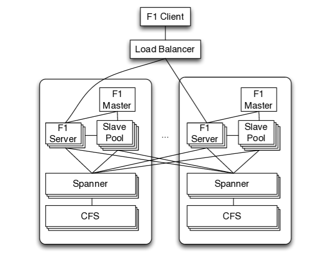
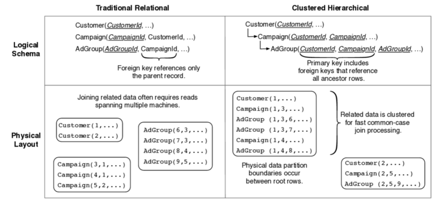

## 大数据研究-Google大数据解决方案
---------------------------------------------------

### A.Google大数据

#### 分布式文件存储

#### I.BigTable - HBase - MegaStore

**HBase**

	1.强一致性的读写：HBase不是一个最终一致性的存储。
	2.自动sharding：HBase的table在集群种被分布在各个region，region可以做自动切分。
	3.regionserver的failover；
	4.Hadoop/HDFS的集成；
	5.MapReduce：支持大数据的并行处理；
	6.JAVA Client 以及Thrift/RESR API 访问；
	7.Block Cache 以及Bloom filter；
	8.操作管理

#### DynamoDB - Cassandra

**Cassandra**

#### II.Google BigQuery(Dremel) in Google Cloud Services

Dremel = BigTable+Spanner (多层次查询树架构)

There are significant design differences, for example, 

- extensive use of stateful caching(Dremel is mostly stateless), 
- separate instances where each is optimized for different use cases (Dremel is a global shared service across all users)
- use of indexable columnar formats optimized for lookups (Capacitor, unlike Artus, does not have indexes), etc.

These make Procella suitable for many additional workloads (e.g high QPS reporting and lookup queries)

- bigquery: adhoc,trival-and-error分析  tens of seconds 35billion rows
		
		full scan: 不需要Indices和pre-aggregation in-memory/flash,columar storage,parallel disk IO.
		While MapReduce is suitable for long-running batch processes such as data mining, BigQuery is the best choice for ad-hoc OLAP/BI queries that require results as fast as possible.

#### III.分布式OLTP: F1 - Spanner

Spanner有一种负责专门管理数据的spanserver，spanserver也是基于bigtable的tablet结构. Cloud Spanner是一款具备强一致性的全球分布式企业级数据库服务

    - Universemaster: 监控这个universe里zone级别的状态信息
    - Placement driver：提供跨区数据迁移时管理功能
    - Zonemaster：相当于BigTable的Master。管理Spanserver上的数据。
    - Location proxy：存储数据的Location信息。客户端要先访问他才知道数据在那个Spanserver上。
    - Spanserver：相当于BigTable的ThunkServer。用于存储数据。

- F1 Query - OLTP/OLAP/ETL

F1是基于Spanner之上的一个分布式类关系数据库，提供了一套类似于SQL（准确说是SQL的超集）的查询语句，支持表定义和数据库事务，同时兼具强大的可扩展性、高可用性、外部事务一致性。接下来主要从几个方面来简要说一说F1是怎么在Spanner之上解决传统数据库的诸多问题的。

- F1的基本架构

F1本身不负责数据的存储，只是作为中间层预处理数据并解析SQL生成实际的读写任务。我们知道，大多数时候移动数据要比移动计算昂贵的多，F1节点自身不负责数据的底层读写，那么节点的加入和移除还有负载均衡就变得廉价了。下面放一张F1的结构图：

大部分的F1是无状态的,意味着一个客户端可以发送不同请求到不同F1 server,只有一种状况例外:客户端的事务使用了悲观锁,这样就不能分散请求了,只能在这台F1 server处理剩余的事务。

- F1的数据模型
F1支持层级表结构和protobuf复合数据域，示例如下：

这样做的好处主要是：

    - 可以并行化，是因为在子表中可以get到父表主键，对于很多查询可以并行化操作，不用先查父表再查子表
    - 数据局部性，减少跨Paxos组的事务.update一般都有where 字段=XX这样的条件,在层级存储方式下相同row值的都在一个directory里
    - protobuf支持重复字段，这样也是为了对于array一类的结构在取数据时提升性能

最后，对于索引：

所有索引在F1里都是单独用个表存起来的,而且都为复合索引,因为除了被索引字段,被索引表的主键也必须一并包含.除了对常见数据类型的字段索引,也支持对Buffer Protocol里的字段进行索引.

索引分两种类型:

    - Local:包含root row主键的索引为local索引,因为索引和root row在同一个directory里;同时,这些索引文件也和被索引row放在同一个spanserver里,所以索引更新的效率会比较高.
    - global:同理可推global索引不包含root row,也不和被索引row在同一个spanserver里.这种索引一般被shard在多个spanserver上;当有事务需要更新一行数据时,因为索引的分布式,必须要2PC了.当需要更新很多行时,就是个灾难了,每插入一行都需要更新可能分布在多台机器上的索引,开销很大;所以建议插入行数少量多次.

#### IV.分布式OLAP: Mesa

#### V.分布式内存数据库: [Monarch: 谷歌的全球级内存时序数据库](https://mp.weixin.qq.com/s/JUxZGF0q69HcF1uCit9TYw)

### B.Apache Beam数据框架

Apache Beam主要由Beam SDK和Beam Runner组成，Beam SDK定义了开发分布式数据处理任务业务逻辑的API接口，生成的的分布式数据处理任务Pipeline交给具体的Beam Runner执行引擎。Apache Beam目前支持的API接口是由Java语言实现的，Python版本的API正在开发之中。Apache Beam支持的底层执行引擎包括Apache Flink，Apache Spark以及Google Cloud Platform，此外Apache Storm，Apache Hadoop，Apache Gearpump等执行引擎的支持也在讨论或开发当中。其基本架构如下图所示

需要注意的是，虽然Apache Beam社区非常希望所有的Beam执行引擎都能够支持Beam SDK定义的功能全集，但是在实际实现中可能并不一定。例如，基于MapReduce的Runner显然很难实现和流处理相关的功能特性。目前Google DataFlow Cloud是对Beam SDK功能集支持最全面的执行引擎，在开源执行引擎中，支持最全面的则是Apache Flink。

- [Beam Note](https://beam.apache.org/)

### C.核心数据模型设计

Bigtable的Key-Value数据结构

Dremel嵌套列数据模型

Spanner数据目录结构 - 虚拟桶

### X.Ref

- [Bigtable: A Distributed Storage System for Structured Data]
- [Dynamo: Amazon’s Highly Available Key-value Store]
- [Dremel: Interactive Analysis of Web-Scale Datasets]
- [F1: A Distributed SQL Database That Scales]
- [Online, Asynchronous Schema Change in F1]
- [F1 Query: Declarative Querying at Scale]
- [Spanner: Google’s Globally-Distributed Database]
- [Spanner: Becoming a SQL System]
- [GOOGLE分布式数据库技术演进研究--从Bigtable、Dremel到Spanner](https://blog.csdn.net/x802796/article/details/18802733)

