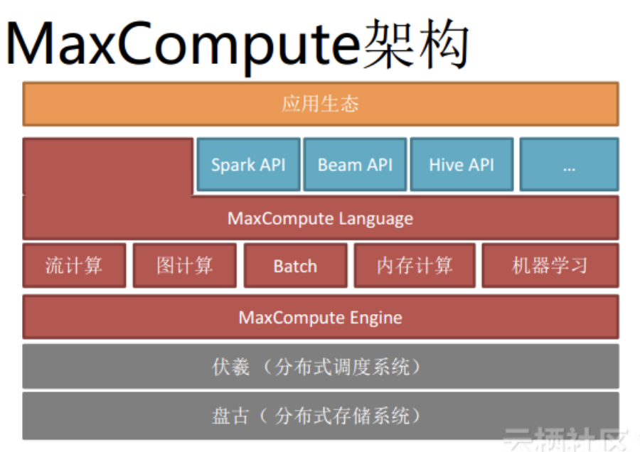
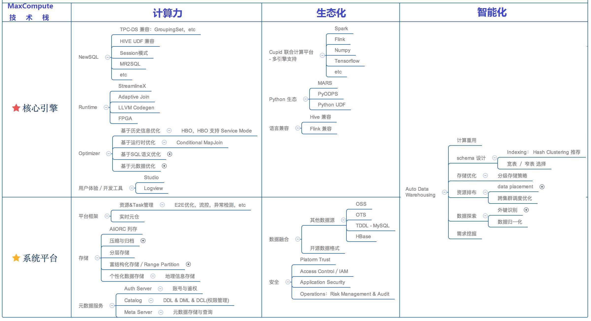
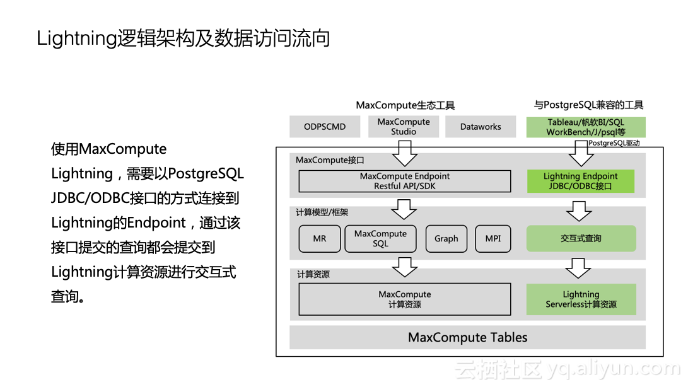

## 大数据产品-Aliyun MaxCompute
--------------------------------------------------------

### Alibaba Cloud - MaxCompute

“新一代计算引擎”的底层技术主要有三个：MaxCompute（离线计算）、Flink（实时计算）、PAI（人工智能）。在它们之上，是用来统一调度各个技术模块的操作系统：DataWorks。

MaxCompute主要服务于批量结构化数据的存储和计算,可以提供海量数据仓库的离线计算解决方案以及针对大数据的分析建模服务。

#### 1.MaxCompute特点:

    - 大规模计算存储(海量离线计算)
    MaxCompute 适用于 100GB 以上规模的存储及计算需求，最大可达 EB 级别。
    - 多种计算模型 - NewSQL
    MaxCompute 支持 SQL、MapReduce、Graph 等计算类型及 MPI 迭代类算法。
    - 强数据安全
    MaxCompute已稳定支撑阿里全部离线分析业务7年以上，提供多层沙箱防护及监控。
    - 低成本
    与企业自建私有云相比，MaxCompute的计算存储更高效，可以降低20%-30%的采购成本。
    - AliORC文件格式

_MaxComputer技术栈_

**5.2.MaxCompute查询计算**

_MaxCompute流计算引擎?_

#### 2.MaxCompute SQL Parser & SQL Optimizer

	- 基于Volcano火山模型的CBO
	- Vectorized Execution Engine in MaxCompute 2.0
	- 优化规则
	- RBO&CBO&HBO模型

在编译器方面,基于AST的编译器模型,Visitor模型（Antlrv4），IDE IntelliSense，Warning支持完整的存储过程，LOOP/IFELSE判断等；

在优化器方面，CBO基于代价的优化器，Volcano模型，展开各种可能等价的执行计划，然后依赖统计信息，计算这些等价执行计划的“代价”，最后最低的执行计划

CBO代价模型

• 由CPU、IO、Row Count、Memory、Network组成的五元 组
• 每个operator关注于自身的Cost，整个plan的Cost由 引擎累积等到
• Cost model力求能够反映客观的物理实现
• Cost model不需要得到和真实一模一样，只需要能够选出较优的plan

主要包括类型：RBO/CBO/HBO

RBO是基于规则的优化器，在早期的MaxCompute中使用，是一种过时的优化器框架，它只认规则，对数据不敏感。优化是局部贪婪，容易陷入局部优化但全局差的场景，容易受应用规则的顺序而生产迥异的执行计划，往往结果不是最优的。

CBO是基于代价的优化器，它实际上是Volcano模型，可以展开各种可能等价的执行计划，然后依赖数据的统计信息，计算这些等价执行计划的代价，最后从中选用Cost最低的执行计划。

分布式场景的优化有别于单机优化。上图是在两张表上进行Join操作的简单案例，假设表T1已经按照a，b进行了分区；表T2按照a进行了分区。如果在单机系统中，分区问题不会出现；在分布式系统中，因为分区的出现可能会产生两个不同的执行计划：第一个执行计划是将T1按照a进行重新分区，之后再和T2进行Join；另一种执行计划是假设T1很大，而T2相对没那么大，此时不对T1重新进行分区，而是将T2数据广播给T1的每个分区。两种执行计划在不同的环境各具优势。

HBO:在大流量、高并发场景中，每天都需要处理大量相似的查询，这就给优化器带来了巨大机会。HBO优化器是基于历史优化的优化器，对每天提交的查询进行聚类，把以前运行数据作为Hint来帮助未来的相似的查询上。

在运行时方面，利用LLVM技术，在运行时生成较优的机器码，采用列式执行框架，提高CPU流水线的执行效率，并提高缓存命中率，使用SIMD。

#### 3.MaxCompute数据架构

#### 3.1.数据架构设计

#### 3.2.核心计算引擎

#### 3.3.数据存储结构

 AliORC

列式存储
支持嵌套树型数据结构

#### 3.5.MaxCompute性能缺陷

