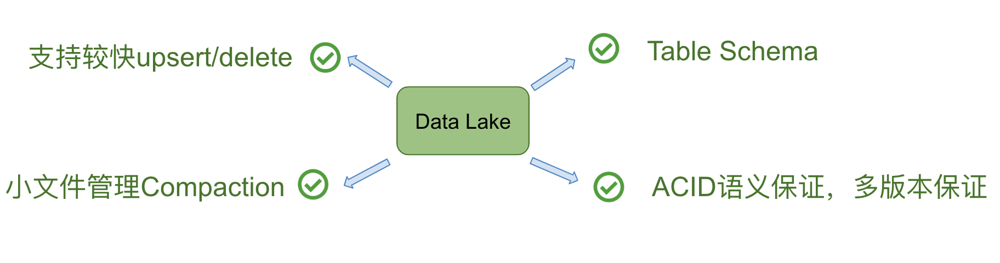
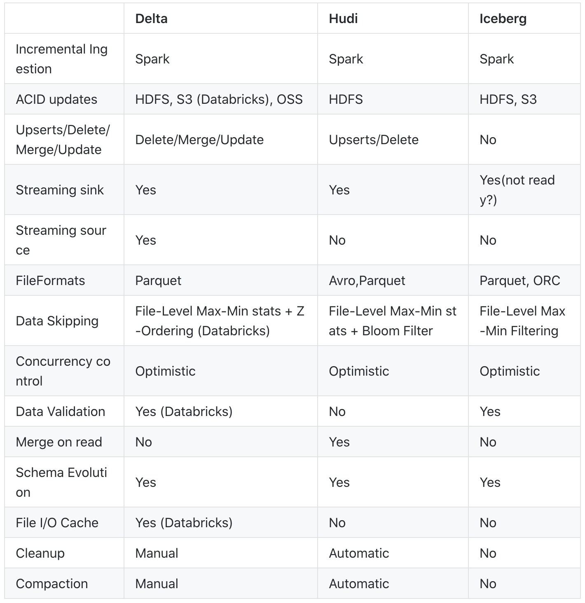
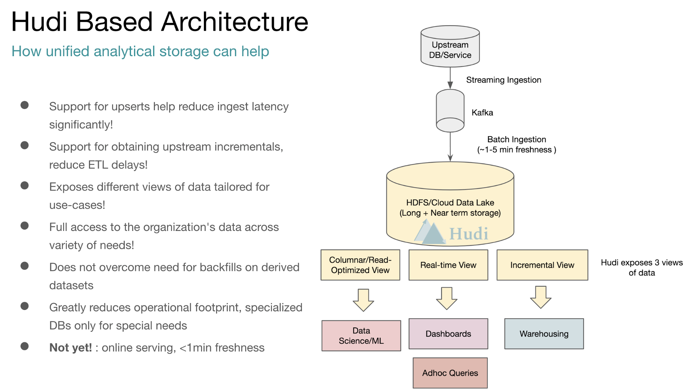
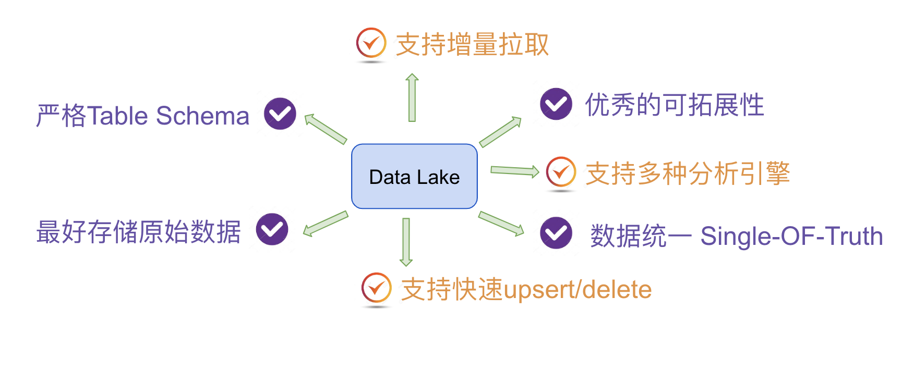
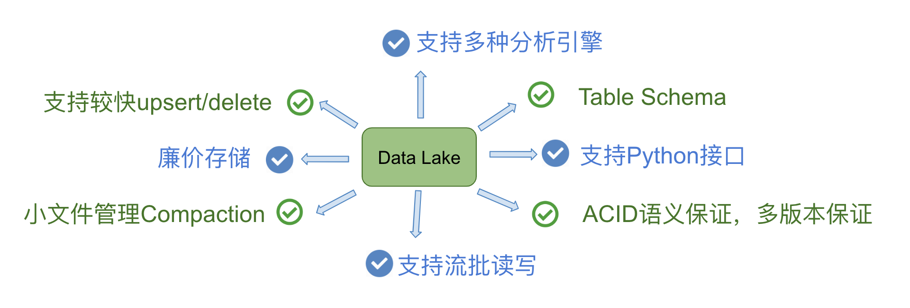
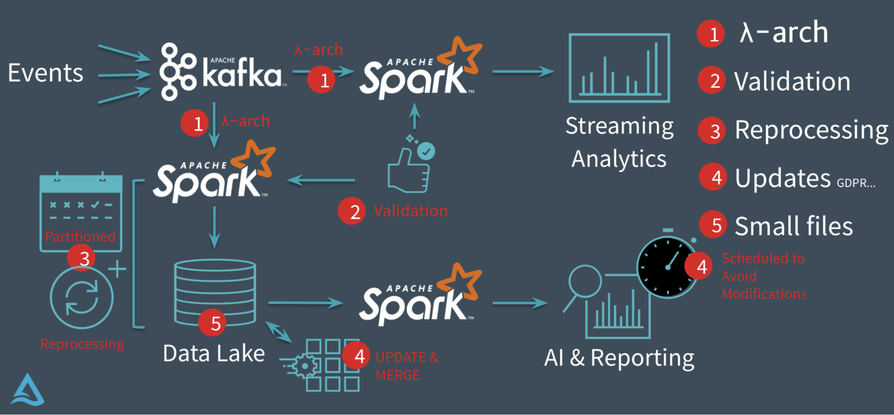
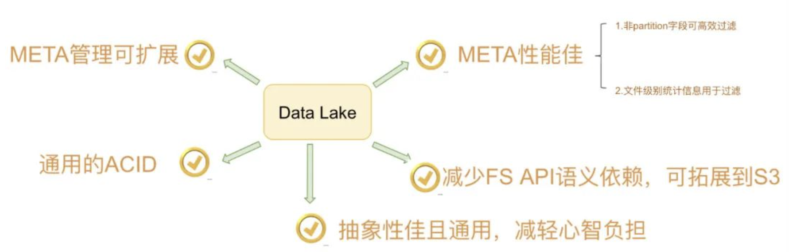

## 大数据研究-开源数据湖存算分离技术研究
---------------------------------------------------

### I.存算分离之上的数据湖仓思考

#### 1.从大数据看数据湖仓的存算分离

		-云端存算分离
		-快速Upsert/Delete --LakeHouse
		-依赖Copy on Write/Merger on Read
		-Table Schema扩展
		-批流一体/流批一体实践
		-行列混存优化

#### 2.存储计算分离技术实现

一个维度是将**存储集群和计算集群支持独立部署/弹性扩缩容**，另一个维度是指**计算服务系统与存储服务系统完全独立提供业务服务**。其需要额外的技术保证：

**Caching能力** 是存储计算分离的必选项。业界流行的是_Alluxio技术_（有一个闭源企业版本），阿里巴巴有自研的_近线Caching_用于湖仓一体，以及_JindoFS_技术用于EMR数据湖加速。

**基于硬件的网络加速** - 通过定制化硬件增强单机的网络能力，将一二层网络转换、部分存储系统访问逻辑offload到异构硬件里面，能显著提升网络效率，降低瓶颈发生的概率。
   存储计算分离架构和混部技术肩负着资源复用与技术探索的重要使命，解决机型采购与预算、成本、提高调度效率三大问题，目前核心阿里在存算分离技术达到世界领先水平，成功支撑双11电商混部在线流量洪峰offload到异构硬件里面，能显著提升网络效率，降低瓶颈发生的概率。

**需求决定是否要实现存算分离**(公共云/私有化部署)。

- 技术决定可行性，需求决定必要性。

分布式云原生数据库采用存算分离架构的需求来自两方面：利用“云”的优势和提升数据库能力，也就是降低数据库替换中的代价。了解存算分离能解决哪些问题及解决方法，对是否需要以存算分离以及如何规划构建存算分离方案意义重大。


#### 3.存算分离需求&能力解藕

- [系统态]计算节点集群与存储节点集群分离, 分别支持独立弹性扩缩容物理集群节点
- [系统态]计算层无状态，支持热升级 / 存储层数据无需重分布(盘古支持自动数据重分布)
- [用户态]用户可配置计算与资源资源成本计费分拆，精细化成本核算优化。
- [用户态]用户可配置计算资源与存储资源独立弹性扩缩容。公共云以分时Quota能力体现
- [用户态]非独占的统一共享存储系统服务。多源数据存放在共享存储服务, 资源优化利用。提供统一存储访问接口,支持可访问可查询可分析/默认多副本
- [用户态]多种计算引擎查询访问此统一存储系统服务。计算引擎可访问多种开放存储系统服务(OSS/S3/Azure)。
- [用户态]统一计算资源管控,细粒度资源单位拆分，按照细资源单元做弹性扩缩容


#### 4.典型存算分离数据产品

- 数据库存算分离: AWS Aurora / AliCloud PolarDB / GaussDB for MySQL 
- 数据仓库存算分离: Snowflake / Redshift / MaxCompute/ Hologres / AnalyticDB /HashData
- 大数据存算分离: Databricks DeltaLake / EMR+OSS (本文主要讨论的重点)


### II.JindoData数据湖存储加速套件


Fluid+JindoRuntime+ACK

### III.Alluxio开源数据湖缓存技术


### JindoFS VS Aullixo技术研究与学习


### IV.LakeHouse 核心技术特征

我们需要LakeHouse以下技术特性:

- ACID事务支持(分布式事务):企业内部许多数据管道通常会并发读写数据。对ACID事务支持确保了多方可使用SQL并发读写数据。
- Table Schema-模式执行和治理(Schema enforcement and governance)：LakeHouse应该有一种可以支持模式执行和演进、支持DW模式的范式（如star/snowflake-schemas）。该系统应该能够推理数据完整性，并具有健壮的治理和审计机制。
- Upsert/Delete数据更新能力:细粒度的文件/记录级别索引来支持Update/Delete记录，同时还提供写操作的事务保证。查询会处理最后一个提交的快照，并基于此输出结果。
- 实时离线任务一体化(批流一体)
- 同时支持高效随机读写/OLAP分析查询
- 计算与存储分离+高可用:这意味着存储和计算使用单独的集群，因此这些系统能够支持更多用户并发和更大数据量。一些现代数据仓库也具有此属性。
- 离线加速查询能力
- 行存与列存混合优化存储(资源优化/高压缩比)
- 支持从非结构化数据到结构化数据的多种数据类型：LakeHouse可用于存储、优化、分析和访问许多数据应用所需的包括图像、视频、音频、半结构化数据和文本等数据类型。
- 支持多种工作负载/分析引擎：包括数据科学、机器学习以及SQL和分析。可能需要多种工具来支持这些工作负载，但它们底层都依赖同一数据存储库。





#### 分布式ACID

对数据湖来说三种隔离分别代表的含义：
    - Serialization是说所有的reader和writer都必须串行执行；
    - Write Serialization: 是说多个writer必须严格串行，reader和writer之间则可以同时跑；
    - Snapshot Isolation: 是说如果多个writer写的数据无交集，则可以并发执行；否则只能串行。Reader和writer可以同时跑。

_Snapshot Isolation_ 是现在大数据场景下最多的ACID隔离模式

#### Upsert 技术方案

_Copy On Write_: 在更新部分文件的场景中，当只需要重写其中的一部分文件时是很高效的，产生的数据是纯 append 的全量数据集，在用于数据分析的时候也是最快的

        * 列式文件存储，用于读多写少。
        * 数据读到内存，进行行更新后替换原本文件
        * 支持后续读数据快速，不存在小文件/Merge操作。写入/数据更新性能差
        * 写时复制

_Merge On Read_: 将数据直接 append 到 存储文件 上，在merge的时候，把这些增量的数据按照一定的组织格式、一定高效的计算方式与全量的上一次数据进行一次 merge。这样的好处是支持近实时的导入和实时数据读取。

        * 列式与行式文件组合存储。用于频繁写的工作负载场景
        * 相关更新记录落地成Delta文件，读时进行合并
        * 写速度快，会产生小文件合并merge问题
        * 读时合并


#### Iceberg, Hudi, DeltaLake - Table Format

Iceberg 的设计初衷倾向于定义一个标准、开放且通用的数据组织格式，同时屏蔽底层数据存储格式上的差异，向上提供统一的操作 API，使得不同的引擎可以通过其提供的 API 接入；

Hudi 的设计初衷更像是为了解决流式数据的快速落地，并能够通过 upsert 语义进行延迟数据修正；

Delta Lake 作为 Databricks 开源的项目，更侧重于在 Spark 层面上解决 Parquet、ORC 等存储格式的固有问题，高效使用增量数据append文件系统。




#### 4.1.Apache Hudi

[Apache Hudi](https://github.com/apache/hudi)=Hadoop Upserts anD Incrementals



#### A. Hudi特性

Uber 团队在 Hudi 上同时实现了 Copy On Write 和 Merge On Read 的两种数据格式，其中 Merge On Read 就是为了解决他们的 fast upsert 而设计的。简单来说，就是每次把增量更新的数据都写入到一批独立的 delta 文件集，定期地通过 compaction 合并 delta 文件和存量的 data 文件。同时给上层分析引擎提供三种不同的读取视角：仅读取 delta 增量文件、仅读取 data 文件、合并读取 delta 和 data 文件。满足各种业务方对数据湖的流批数据分析需求。



##### 核心特性

- 可插拔式的索引支持快速Upsert / Delete
- ACID事务提交/回滚数据。
- 支持捕获Hudi表的变更进行流式处理。
- 支持Apache Hive，Apache Spark，Apache Impala和Presto查询引擎。Flink已在需求列表中
- 内置数据提取工具，支持Apache Kafka，Apache Sqoop和其他常见数据源。
- 通过管理文件大小，存储布局来优化查询性能。
- 基于行存快速提取模式，并支持异步压缩成列存格式。
- 用于审计跟踪的时间轴元数据。

##### Hudi原语

Hudi使得能在hadoop兼容的存储之上存储大量数据，同时它还提供两种原语，使得除了经典的批处理之外，还可以在数据湖上进行流处理。这两种原语分别是：

* Update/Delete记录：Hudi使用细粒度的文件/记录级别索引来支持Update/Delete记录，同时还提供写操作的事务保证。查询会处理最后一个提交的快照，并基于此输出结果。
* 变更流：Hudi对获取数据变更提供了一流的支持：可以从给定的时间点获取给定表中已updated/inserted/deleted的所有记录的增量流，并解锁新的查询姿势（类别）。

* 读取优化的表(Read Optimized Table)
* 准实时表(Near-Realtime Table)：使用列存储和行存储以提供对实时数据的查询


#### B. 存储引擎

*Hudi的两种存储类型:*

    - 写时复制（Copy On Write表）：仅使用列式文件（parquet）存储数据。在写入/更新数据时，直接同步合并原文件，生成新版本的basefile,（parquet）不写log文件（需要重写整个列数据文件，即使只有一个字节的新数据被提交）。此存储类型下，写入数据非常昂贵，而读取的成本没有增加，所以适合频繁Read读的工作负载，因为数据集的最新版本在列式文件中始终可用，以进行高效的查询。
    
    - 读时合并（Merge On Read表）：使用列式（parquet）与行式（avro）文件组合，进行数据存储。MOR表写数据时，记录首先会被快速的写进日志文件，稍后会使用时间轴上的压缩操作将其与基础文件合并。在更新记录时，更新到增量文件中（avro），然后进行异步（或同步）的compaction，创建列式文件（parquet）的新版本。此存储类型适合频繁Write写的工作负载，因为新记录是以appending的模式写入增量文件中。但是在读取数据集时，需要将增量文件与旧文件进行合并，生成列式文件。


		Tips: Hudi做的事情就是将批处理（copy-on-write storage）和流计算（merge-on-read storage）作业整合，并将计算结果存储在Hadoop中。对于Spark应用程序，依靠其同意的DAG模型可以将融入了Hudi库与Spark/Spark Steaming作业天然整合。对于非Spark处理系统（例如：Flink，Hive），处理过程可以在各自的系统中完成，然后以Kafka Topics 或者HDFS中间文件的形式发送到Hudi表中。


*Hudi的存储引擎由三个不同的部分组成:*

	- Metadata： Hudi以时间轴的形式将数据集上的各项操作对应的元数据维护起来，从而支持数据集的即时视图，这部分元数据存储于根目录下的元数据目录中。
	
	Commits ：一个单独的 commit 包含对数据集之上一批数据的一次原子写入操作的相关信息。Commits 由单调递增的时间戳标识，表示写操作的开始；
	Cleans：用于清除数据集中不再被查询所用到的旧版本文件的后台活动；
	Compactions：协调 Hudi 中不同数据结构的后台合并活动，比如将基于行更新的文件转换成列式存储格式。
	
	- Index： Hudi维护了一个索引，以便在记录键已经存在的情况下快速地将传入的记录键映射到field，索引实现是可插拔的，以下是目前可用的选项：
	
	BloomFilter：存储在每个数据文件的页脚中，默认就是用这个，因为不依赖任何外部系统。数据和索引始终保持一致。
	HBase：可高效的查找一小批key，在索引标记期间，这个索引实现可能会快几秒
	
	- Data： Hudi以两种不同的存储格式存储所有摄入的数据。但实际使用的存储格式是可插拔的，但所选的存储格式需要以下特征：
	
	扫描优化的列存储格式，默认是parquet
	写优化: 列式是parquet; 行格式，默认是avro


#### C. 逻辑视图

在了解这两种存储类型后，我们再看一下Hudi支持的存储数据的视图（也就是查询模式）：

	- 读优化视图（Read Optimized view）：直接query basefile文件（数据集的最新快照），也就是列式文件（如parquet）。相较于非Hudi列式数据集，有相同的列式查询性能
	- 增量视图（Incremental View）：仅query新写入数据集的文件，也就是指定一个commit/compaction，query此之后的新数据。
	- 实时视图（Real-time View）：query最新基文件与增量文件。此视图通过将最新的基文件（parquet）与增量文件（avro）进行动态合并，然后进行query。可以提供近实时的数据（会有几分钟的延迟）

在以上3种视图中，“读优化视图”与“增量视图”均可在“写时复制”与“读时合并”的存储类型下使用。而“实时视图“仅能在”读时合并“模式下使用。

存储类型  | 支持的视图 
-------- |----------
 写时复制 | 读优化 + 增量 
 读时合并 | 读优化 + 增量 + 近实时 

 

#### D. 时间轴

Hudi 的核心 —— **时间轴**。

Hudi 会维护一个时间轴，在每次执行操作时（如写入、删除、合并等），均会带有一个时间戳。通过时间轴，可以实现在仅查询某个时间点之后成功提交的数据，或是仅查询某个时间点之前的数据。这样可以避免扫描更大的时间范围，并非常高效地只消费更改过的文件（例如在某个时间点提交了更改操作后，仅query某个时间点之前的数据，则仍可以query修改前的数据）。


#### E. Hudi生态

目前 Hudi 原生支持 Spark、Presto、MapReduce 以及 Hive 等大数据生态系统，Flink 的支持正在开发中。
Hudi 目前还不支持使用 SQL 进行 DDL / DML 相关操作，不过社区已经有小伙伴提到这个东西了，具体参见 HUDI-388。


#### 4.2.Spark Delta Lake

[Delta Lake](https://github.com/delta-io/delta):一个基于Spark和大数据workload,具有高可用和ACID事务特性的开源存储引擎.

#### A. Delta Lake特性



ACID 事务能力，其通过写和快照隔离之间的乐观并发控制（optimistic concurrency control），在写入数据期间提供一致性的读取，从而为构建在 HDFS 和云存储上的数据湖（data lakes）带来可靠性。

- 支持ACID事务
- 可扩展的元数据处理
- 批流一体：统一的流、批处理API接口
- 更新、删除数据，实时读写（读是读当前的最新snapshot, snapshot isolation）/支持增量更新
- 数据版本控制，根据需要查看历史数据快照，可回滚数据
- 自动处理Table schema变化，可修改表结构


#### B. Delta Lake目前的不足

- 更新操作很重，更新一条数据和更新一批数据的成本可能是一样的，所以不适合一条条的更新数据 (Merge操作实现缺乏)
- 新数据的方式是新增文件，会造成文件数量过多，需要清理历史版本的数据，version最好不要保存太多
- 乐观锁在多用户同时更新时并发能力较差，更适合写少读多的场景（或者only append写多更新少场景）


#### C.数据Merge策略-Delta vs Hudi

Delta Lake 支持对存储的数据进行更新，并且仅支持写入的时候进行数据合并(Write On Merge)，它会获取需要更新的数据对应的文件，然后直接读取这些文件并使用 Spark 的 Join 进行计算产生新的文件。

同理，Hudi 也是支持写入数据的时候进行合并，但是相比 Delta Lake，Hudi 还支持 Read On Merge 模式，也就是将增量数据写入到一个 delta 文件，然后默认情况下在更新完数据后会启动一个作业进行 compaction 操作。当然，这个也是可以关闭的，也就是更新的时候值负责数据的写入，合并操作可以单独用一个作业来跑。

从功能上来说，这方面 Hudi 比 Delta Lake 设计的要好。在**多读少写**的情况下，Write On Merge 模式很不错；而在**多写少读**的情况下，Read On Merge 模式很不错，而 Delta Lake 目前还不支持 Read On Merge 模式。

另外，Hudi 提供了索引机制，在数据合并的时候，可以使用索引的信息快速定位到某行数据所在的文件，从而加快数据更新的速度。

	Tips: OpenSource Delta Lake 不支持快速CUDR与Pull增量(更新操作很重)。Databrick Delta Lake 支持。

#### D. Spark Delta Process



**DeltaLake的核心优势在于批流一体与历史数据快照+回滚数据**

#### 4.3.Apache Iceberg


#### Iceberg的特性:

- ACID事务； 
- 时间旅行（time travel），以访问之前版本的数据； 
- 完备的自定义类型、分区方式和操作的抽象； 
- 列和分区方式可以进化，而且进化对用户无感，即无需重新组织或变更数据文件； 
- 隐式分区，使SQL不用针对分区方式特殊优化； 
- 面向云存储的优化等；
- 缺少upsert和compaction




### 

#### 4.4.Apache CarbonData

[Apache CarbonData](https://github.com/apache/carbondata):是一个支持索引和物化视图的ACID数据湖的数据存储(计算与存储分离)优化解决方案

#### 4.4.1. CarbonData特性

- 索引和物化视图能力：

详单查询：二级索引、BloomFilter索引、Lucene索引、空间索引、Segment级别MINMAX索引，实现PB级别秒级详单查询；
复杂查询：物化视图、时序聚合、分桶索引，实现复杂查询秒级响应；
海量索引管理：分布式内存索引缓存、并支持索引内存预加载；
物化视图: ??

- 数据湖能力：

历史数据无缝迁移：支持对Parquet、ORC、CarbonData数据进行统一元数据管理，PB级别Parquet、ORC数据秒级迁移CarbonData；
历史数据加速：为Parquet、ORC、CarbonData构建统一物化视图；
异构计算融合：对接Flink、Hive、Presto、PyTorch、TensorFlow，实现“一份数据到处访问”；

- ACID能力(snapshot isolation)：

- Insert、Update和Delete数据更新性能增强，支持Merge语法


下面我们首先介绍CarbonData的愿景，其次通过示例介绍CarbonData的索引、物化视图、数据湖能力和ACID能力。

业界在EB级别存储的数据库可选方案主要包含NoSQL数据库(在线数据服务)、Hadoop生态数据仓库(SQL on Hadoop)等，但都有其明显的不足。

可选方案	| 优势	 | 不足 
--------|------ |--------------------------
HBase、ES、Kudu、MPP等 |	查询快 | 存储贵
Spark、Hive等   | 存储成本低	| 查询相对慢

 ​ ​ ​ ​首先，以HBase服务、MongoDB服务或者ElasticSearch服务为代表的NoSQL数据库，虽然也可以支持快速的复杂SQL查询，但是这些服务均不支持存储与计算分离，为了满足PB/EB级别存储的需求，往往我们需要启动更多的计算节点，消耗更多的CPU和存储成本，同时还要付出更多的运维成本，计算和存储的紧密耦合也意味着更低的计算和存储利用率。例如HBase服务，单台RegionServer可维护不超过10TB的数据，面对10PB的数据存储时，需要1000台计算节点部署RegionServer，其所面对的金钱成本和运维成本都十分高昂。

 ​ ​ ​ ​其次，以Spark on Parquet、Hive on ORC为代表的Hadoop生态数据仓库解决方案，支持将数据放在对象存储服务上，但是没有对数据构建高效的索引，使得明细数据查询或者复杂查询都很慢。假设如下几种场景：
	
	1）查询过去一年某用户的行为轨迹，当没有针对用户构建索引时，只能暴力扫描过去一整年的数据，测试中需要7天才能完成
	2）Join类的复杂查询同样如此，无索引情况下，只能对数据暴力扫描，极大限制了查询速度。
 ​ ​ ​ ​ ​ 
	由上可见，NoSQL数据库虽然具有较好的数据索引机制，但是“存储太贵”，传统的Hadoop生态数据仓库将数据放在对象存储上，但是“查询太慢”，这两者各自的局限性，使得我们进行EB级别数据仓库选型时，面临着这一个鱼与熊掌不可兼得的选择题。

 	为了能够像关系型数据库一样可以高效执行复杂SQL查询，又可以像NoSQL数据库一样，构建高效索引，最后，可以和Spark/Hive一样，享受高度可扩展性的数据并行处理、利用近乎无限的低成本的对象存储资源，满足这种“又方便又快又便宜”的任性就是CarbonData的使命。
 	
 	--Tips:Hybird Serving and Analytics Processing方案在大数据分析场景下越来越被关注起来。

接下来的内容，我们将重点介绍如何体验CarbonData 2.0 RC2中的索引、物化视图、ACID能力。

#### 4.4.2. 快速安装CarbonData

准备1台Linux弹性云服务器

下载快速安装脚本
```
curl -k -O http://carbondata-publish.obs.myhuaweicloud.com/quick_start_carbondata.sh
```

启动sparksql和carbondata
```
source quick_start_carbondata.sh
```

#### 4.4.3. CarbonData索引和物化视图

CarbonData 2.0 提供了丰富的索引能力，笔者总结了CarbonData提供的不同索引能力和适用场景。如下表所示。

 索引类型  | 	适用场景	          | 效果             
----------|-------------------|-------------------------
 排序索引  |	带有排序键过滤的查询     | 秒级主键精确查询  
 二级索引  | 带有二级索引键过滤的查询 | 	秒级非主键精确查询 
 物化视图  | Join、GroupBy、OrderBy等复杂查询	| 复杂查询秒级响应 
 时序索引	| 时序聚合	| 秒级时序聚合 
 空间索引	| 空间检索	| 秒级空间精确过滤 
 BloomFilter索引	|  带有高基数列过滤的查询	|  高基数列快速过滤 
 Lucene索引	  | 多维检索	|  秒级多维索引  

下面我们给出在CarbonData中构建索引的语法示例。

* 构建排序键索引，语法举例如下：

```
CREATE TABLE person(id STRING, age INT, country STRING, timestamp timestamp, address STRING, skill STRING) 
STORED AS carbondata 
TBLPROPERTIES('sort_scope'='GLOBAL_SORT','sort_columns'='id, age');
```

* 构建二级索引，语法举例如下：

```
CREATE INDEX person_si_country_age on table person(country, age) AS 'carbondata';
```

* 构建物化视图，基于复杂查询构建物化视图的语法举例如下：
```
CREATE MATERIALIZED VIEW person_countid_gb_country
AS SELECT country,count(id) FROM person GROUP BY country;
```
* 构建时序索引，语法举例如下：
```
CREATE MATERIALIZED VIEW person_countid_gb_timeseries AS
SELECT timeseries(timestamp, 'minute'),count(id)
FROM person 
GROUP BY timeseries(timestamp, 'minute');
```
* BloomFilter索引，语法举例如下：
```
CREATE INDEX person_bf_address
ON TABLE person (address)
AS 'bloomfilter'
PROPERTIES ('BLOOM_SIZE'='640000', 'BLOOM_FPP'='0.00001');
```
* Lucene索引，语法举例如下：
```
CREATE INDEX person_luc_skill
ON TABLE person (skill)
AS 'lucene';
```
* 加载数据
```
INSERT INTO person VALUES 
('c001', '23', 'china', '2016-02-23 09:01:30','china sz','computer design'),
('c003', '23', 'japan', '2016-02-23 08:01:30','japan to','sport speech'),
('c002', '23', 'india', '2016-02-23 07:01:30','india mm','draw write');
```
* 查询数据
```
//利用排序索引查询
SELECT * FROM person WHERE id = 'c001';

//利用二级索引查询
SELECT * FROM person WHERE country = 'china' and age = 23;

//利用物化视图进行查询
SELECT country,count(id) FROM person GROUP BY country;

//利用时序索引进行查询
SELECT timeseries(timestamp, 'minute'),count(id)
FROM person 
GROUP BY timeseries(timestamp, 'minute');

//利用BloomFilter索引进行查询
SELECT * FROM person WHERE address = 'china sz';

//利用Lucene索引进行查询
SELECT * FROM person WHERE TEXT_MATCH('skill:*computer*')
```

#### 4.4.4. 数据湖

CarbonData在体现性能优势的同时，需要回答如何将历史数据搬迁到CarbonData的问题，CarbonData 2.0交出了如下的答卷：

- 1）历史Parquet、ORC数据如何导入CarbonData？

支持通过"add segment"的方式，实现CarbonData对Parquet、ORC数据进行统一纳管。实现PB级别历史数据秒级迁移。

- 2）如何对历史Parquet、ORC数据构建索引？

支持对CarbonData、Parquet、ORC构建统一物化视图。实现PB级别数据复杂查询秒级响应。

下面主要通过示例演示以上两个功能：
	
	1.Parquet文件如何无缝导入CarbonData; 
	2.如何对Parquet数据构建物化视图。

Parquet文件导入CarbonData
首先，构建一张Parquet表，并写入数据。

```
CREATE TABLE parquet_table(id STRING, age INT, country STRING, timestamp timestamp, address STRING, skill STRING) 
STORED AS parquet;

INSERT INTO parquet_table VALUES 
('c004', '23', 'kor', '2016-02-22 09:01:30','kor ab','design'),
('c005', '23', 'russia', '2016-02-21 08:01:30','russia mo','game'),
('c006', '23', 'india', '2016-02-23 07:01:30','india sc','travel');
```

其次，将Parquet文件元数据导入CarbonData，语法示例如下。这里path需要替换为真实parquet表路径，路径信息可以通过describe formatted parquet_table查询得到。

```
ALTER TABLE person ADD SEGMENT options('path'='{$parquet_table_location}','format'='parquet');
```
最后，查询CarbonData表。最终可以发现CarbonData表中已经可以查询到Parquet表的数据。
```
SELECT * FROM person;
```
为Parquet表构建物化视图
```
CREATE MATERIALIZED VIEW parquet_table_countid_gb_country
AS SELECT country,count(id) FROM parquet_table GROUP BY country;
```
利用物化视图进行查询
```
SELECT country,count(id) FROM parquet_table GROUP BY country;
```
#### 4.4.5. Update/Delete数据更新-Merge

CarbonData 2.0中深度优化了UPDATE、DELETE性能，并支持了Merge语法。

数据更新，语法示例如下：
```
UPDATE person SET age = '24' WHERE id = c001;
```
数据删除，语法示例如下：
```
DELETE FROM person WHERE id = c002;
```
数据Merge，支持批量查询、更新、删除。[语法可参考](https://github.com/apache/carbondata/blob/master/examples/spark/src/main/scala/org/apache/carbondata/examples/CDCExample.scala)


**总结:CarbonData提供了一种新的融合数据存储方案，以一份数据同时支持多种应用场景，EB级别数据规模，查询性能秒级响应。可以看出CarbonData目前的架构和想法都十分先进.**


### V.Apache Kudu

[Apache Kudu](https://kudu.apache.org/):在更新更及时的基础上实现更快的数据分析的Hadoop数据存储方案

Kudu不但提供了行级的插入、更新、删除API，同时也提供了接近Parquet性能的批量扫描操作。使用同一份存储，既可以进行随机读写，也可以满足数据分析的要求。

#### 5.1.Kudu总览

Tables和Schemas

从用户角度来看，Kudu是一种存储结构化数据表的存储系统。在一个Kudu集群中可以定义任意数量的table，每个table都需要预先定义好schema。每个table的列数是确定的，每一列都需要有名字和类型，每个表中可以把其中一列或多列定义为主键。这么看来，Kudu更像关系型数据库，而不是像HBase、Cassandra和MongoDB这些NoSQL数据库。不过Kudu目前还不能像关系型数据一样支持二级索引。
Kudu使用确定的列类型，而不是类似于NoSQL的“everything is byte”。这可以带来两点好处：

     - 确定的列类型使Kudu可以进行类型特有的编码。
     - 可以提供 SQL-like 元数据给其他上层查询工具，比如BI工具。

**读写操作**

用户可以使用 Insert，Update和Delete API对表进行写操作。不论使用哪种API，都必须指定主键。但批量的删除和更新操作需要依赖更高层次的组件（比如Impala、Spark）。Kudu目前还不支持多行事务。
而在读操作方面，Kudu只提供了Scan操作来获取数据。用户可以通过指定过滤条件来获取自己想要读取的数据，但目前只提供了两种类型的过滤条件：主键范围和列值与常数的比较。由于Kudu在硬盘中的数据采用列式存储，所以只扫描需要的列将极大地提高读取性能。

**一致性模型**

Kudu为用户提供了两种一致性模型。默认的一致性模型是snapshot consistency。这种一致性模型保证用户每次读取出来的都是一个可用的快照，但这种一致性模型只能保证单个client可以看到最新的数据，但不能保证多个client每次取出的都是最新的数据。另一种一致性模型external consistency可以在多个client之间保证每次取到的都是最新数据，但是Kudu没有提供默认的实现，需要用户做一些额外工作。
为了实现external consistency，Kudu提供了两种方式：

     - 在client之间传播timestamp token。在一个client完成一次写入后，会得到一个timestamp token，然后这个client把这个token传播到其他client，这样其他client就可以通过token取到最新数据了。不过这个方式的复杂度很高。
     - 通过commit-wait方式，这有些类似于Google的Spanner。但是目前基于NTP的commit-wait方式延迟实在有点高。不过Kudu相信，随着Spanner的出现，未来几年内基于real-time clock的技术将会逐渐成熟。

#### 5.2.Kudu的架构

Kudu与分布式文件系统抽象和HDFS完全不同，它自己的一组存储服务器通过RAFT相互通信。与HDFS和HBase相似，Kudu使用单个的Master节点，用来管理集群的元数据，并且使用任意数量的Tablet Server节点用来存储实际数据。可以部署多个Master节点来提高容错性。

Kudu架构图


***Master***

Kudu的master节点负责整个集群的元数据管理和服务协调。它承担着以下功能：

作为catalog manager，master节点管理着集群中所有table和tablet的schema及一些其他的元数据。
作为cluster coordinator，master节点追踪着所有server节点是否存活，并且当server节点挂掉后协调数据的重新分布。
作为tablet directory，master跟踪每个tablet的位置。

**Catalog Manager**

Kudu的master节点会持有一个单tablet的table——catalog table，但是用户是不能直接访问的。master将内部的catalog信息写入该tablet，并且将整个catalog的信息缓存到内存中。随着现在商用服务器上的内存越来越大，并且元数据信息占用的空间其实并不大，所以master不容易存在性能瓶颈。catalog table保存了所有table的schema的版本以及table的状态（创建、运行、删除等）。

**Cluster Coordination**

Kudu集群中的每个tablet server都需要配置master的主机名列表。当集群启动时，tablet server会向master注册，并发送所有tablet的信息。tablet server第一次向master发送信息时会发送所有tablet的全量信息，后续每次发送则只会发送增量信息，仅包含新创建、删除或修改的tablet的信息。
作为cluster coordination，master只是集群状态的观察者。对于tablet server中tablet的副本位置、Raft配置和schema版本等信息的控制和修改由tablet server自身完成。master只需要下发命令，tablet server执行成功后会自动上报处理的结果。

**Tablet Directory**

因为master上缓存了集群的元数据，所以client读写数据的时候，肯定是要通过master才能获取到tablet的位置等信息。但是如果每次读写都要通过master节点的话，那master就会变成这个集群的性能瓶颈，所以client会在本地缓存一份它需要访问的tablet的位置信息，这样就不用每次读写都从master中获取。
因为tablet的位置可能也会发生变化（比如某个tablet server节点crash掉了），所以当tablet的位置发生变化的时候，client会收到相应的通知，然后再去master上获取一份新的元数据信息。

**Tablet存储**

在数据存储方面，Kudu选择完全由自己实现，而没有借助于已有的开源方案。tablet存储主要想要实现的目标为：

	- 快速的列扫描。
	- 低延迟的随机读写。
	- 一致性的性能。

**RowSets**

在Kudu中，tablet被细分为更小的单元，叫做RowSets。一些RowSet仅存在于内存中，被称为MemRowSets，而另一些则同时使用内存和硬盘，被称为DiskRowSets。任何一行未被删除的数据都只能存在于一个RowSet中。
无论任何时候，一个tablet仅有一个MemRowSet用来保存最新插入的数据，并且有一个后台线程会定期把内存中的数据flush到硬盘上。
当一个MemRowSet被flush到硬盘上以后，一个新的MemRowSet会替代它。而原有的MemRowSet会变成一到多个DiskRowSet。flush操作是完全同步进行的，在进行flush时，client同样可以进行读写操作。

**MemRowSet**

MemRowSets是一个可以被并发访问并进行过锁优化的B-tree，主要是基于MassTree来设计的，但存在几点不同：

	- Kudu并不支持直接删除操作，由于使用了MVCC，所以在Kudu中删除操作其实是插入一条标志着删除的数据，这样就可以推迟删除操作。
	- 类似删除操作，Kudu也不支持原地更新操作。
	- 将tree的leaf链接起来，就像B+-tree。这一步关键的操作可以明显地提升scan操作的性能。
	- 没有实现字典树（trie树），而是只用了单个tree，因为Kudu并不适用于极高的随机读写的场景。

与Kudu中其他模块中的数据结构不同，MemRowSet中的数据使用行式存储。因为数据都在内存中，所以性能也是可以接受的，而且Kudu对在MemRowSet中的数据结构进行了一定的优化。

**DiskRowSet**

当MemRowSet被flush到硬盘上，就变成了DiskRowSet。当MemRowSet被flush到硬盘的时候，每32M就会形成一个新的DiskRowSet，这主要是为了保证每个DiskRowSet不会太大，便于后续的增量compaction操作。Kudu通过将数据分为base data和delta data，来实现数据的更新操作。Kudu会将数据按列存储，数据被切分成多个page，并使用B-tree进行索引。除了用户写入的数据，Kudu还会将主键索引存入一个列中，并且提供布隆过滤器来进行高效查找。

**Compaction**

为了提高查询性能，Kudu会定期进行compaction操作，合并delta data与base data，对标记了删除的数据进行删除，并且会合并一些DiskRowSet。

**分区**

和许多分布式存储系统一样，Kudu的table是水平分区的。BigTable只提供了range分区，Cassandra只提供hash分区，而Kudu提供了较为灵活的分区方式。当用户创建一个table时，可以同时指定table的的partition schema，partition schema会将primary key映射为partition key。一个partition schema包括0到多个hash-partitioning规则和一个range-partitioning规则。通过灵活地组合各种partition规则，用户可以创造适用于自己业务场景的分区方式。


