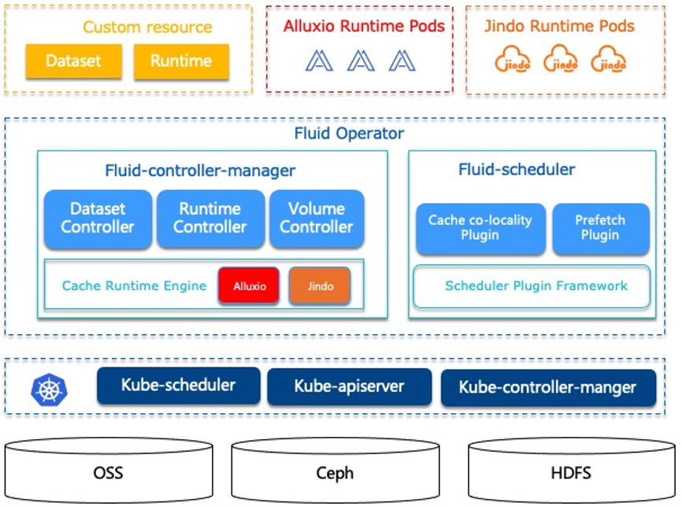

## 大数据研究-数据湖存算分离技术研究
---------------------------------------------------

### I.存算分离之上的数据湖仓思考

_技术决定可行性，场景需求决定必要性_

#### 1.1.从大数据看数据湖仓的存算分离

		-云端存算分离
		-快速Upsert/Delete --LakeHouse
		-依赖Copy on Write/Merger on Read
		-Table Schema扩展
		-批流一体/流批一体实践
		-行列混存优化

#### 1.2.存储计算分离技术实现

一个维度是将**存储集群和计算集群支持独立部署/弹性扩缩容**，另一个维度是指**计算服务系统与存储服务系统完全独立提供业务服务**。其需要额外的技术保证：

**Caching能力** 是存储计算分离的必选项。业界流行的是_Alluxio技术_（有一个闭源企业版本），阿里巴巴有自研的_近线Caching_用于湖仓一体，以及_JindoFS_技术用于EMR数据湖加速。

**基于硬件的网络加速** - 通过定制化硬件增强单机的网络能力，将一二层网络转换、部分存储系统访问逻辑offload到异构硬件里面，能显著提升网络效率，降低瓶颈发生的概率。
   存储计算分离架构和混部技术肩负着资源复用与技术探索的重要使命，解决机型采购与预算、成本、提高调度效率三大问题，目前核心阿里在存算分离技术达到世界领先水平，成功支撑双11电商混部在线流量洪峰offload到异构硬件里面，能显著提升网络效率，降低瓶颈发生的概率。

		Tips:具体可对比参考Google Jupiter Networking技术

**分布式对象存储** - 支持高可靠性的分布式存储文件系统

**业务场景需求决定是否要实现存算分离**(公共云/私有化部署)。

分布式云原生数据库采用存算分离架构的需求来自两方面：利用“云”的优势和提升数据库能力，也就是降低数据库替换中的代价。了解存算分离能解决哪些问题及解决方法，对是否需要以存算分离以及如何规划构建存算分离方案意义重大。

#### 1.3.存算分离需求&能力解藕

- [系统态]计算节点集群与存储节点集群分离, 分别支持独立弹性扩缩容物理集群节点
- [系统态]计算层无状态，支持热升级 / 存储层数据无需重分布(盘古支持自动数据重分布)
- [用户态]用户可配置计算与资源资源成本计费分拆，精细化成本核算优化。
- [用户态]用户可配置计算资源与存储资源独立弹性扩缩容。公共云以分时Quota能力体现
- [用户态]非独占的统一共享存储系统服务。多源数据存放在共享存储服务, 资源优化利用。提供统一存储访问接口,支持可访问可查询可分析/默认多副本
- [用户态]多种计算引擎查询访问此统一存储系统服务。计算引擎可访问多种开放存储系统服务(OSS/S3/Azure)。
- [用户态]统一计算资源管控,细粒度资源单位拆分，按照细资源单元做弹性扩缩容


#### 1.4.典型存算分离数据产品

- 数据库存算分离: AWS Aurora / AliCloud PolarDB / GaussDB for MySQL 
- 数据仓库存算分离: Snowflake / Redshift / MaxCompute/ Hologres / AnalyticDB /HashData
- 大数据存算分离: Databricks DeltaLake / EMR+OSS (_本文主要讨论的重点_)


### II.阿里云数据湖存储加速技术-JindoData


#### 2.1.JindoData数据湖存储加速套件

**A.JindoFSx存储加速系统**

-第一种 [jindo sdk直接对接oss](https://github.com/aliyun/alibabacloud-jindodata/blob/master/docs/user/4.x/oss/hadoop/jindosdk_on_hadoop.md?spm=a2c4g.11186623.0.0.413c79949OQrRO&file=jindosdk_on_hadoop.md), 跟aws差不多，但是可以打开cache --ready

**B.JindoFS&OSS-HDFS服务**

-第二种oss-hdfs服务化， 相当于全托管的lblock模式， 也可以使用cache --ready

**C.云原生缓存JindoRuntime on K8s**

Fluid+JindoRuntime+ACK

_1.什么是Fluid_

Fluid是一个开源的Kubernetes原生的分布式数据集编排和加速引擎，主要服务于云原生场景下的数据密集型应用，例如大数据应用、AI应用等。通过定义数据集资源的抽象，实现如下功能：  



	1、数据集抽象原生支持
	2、将数据密集型应用所需基础支撑能力功能化，实现数据高效访问并降低多维管理成本
	3、云上数据预热与加速:Fluid通过使用分布式缓存引擎（如JindoFS）为云上应用提供数据预热与加速，同时可以保障缓存数据的可观测性，可迁移性和自动化的水平扩展
	4、数据应用协同编排
	5、在云上调度应用和数据时候，同时考虑两者特性与位置，实现协同编排，提升性能
	6、多命名空间管理支持:用户可以创建和管理不同namespace的数据集

_2、什么是JindoRuntime_

首先介绍Dataset的概念，数据集是逻辑上相关的一组数据的集合，会被运算引擎使用，比如大数据的Spark，AI场景的TensorFlow，而关于数据集智能的应用和调度会创造工业界的核心价值。Dataset的管理实际上也有多个维度，比如安全性，版本管理和数据加速。我们希望从数据加速出发，对于数据集的管理提供支持。在Dataset上面我们通过定义Runtime这样一个执行引擎来实现数据集安全性，版本管理和数据加速等能力，Runtime定义了一系列生命周期的接口，可以通过实现这些接口来支持数据集的管理和加速。其中JindoRuntime来源于阿里云社区EMR自研JindoFS分布式系统，是支撑Dataset数据管理和缓存的执行引擎实现。Fluid通过管理和调度Jindo Runtime实现数据集的可见性，弹性伸缩， 数据迁移，计算加速等。在Fluid上使用和部署JindoRuntime流程简单，兼容原生k8s环境，可以开箱即用。深度结合对象存储特性，使用navite框架优化性能，并支持免密，checksum校验等云上数据安全功能

 _3、JindoRuntime可以做什么_

JindoRuntime提供对Aliyun OSS对象存储服务的访问和加速能力，提供NoCache和Cache模式，并且利用**FUSE的POSIX文件系统接口**实现，使用JindoFuse可以像本地磁盘一样轻松使用OSS上的海量文件


		1、NoCache模式：该模式通过Jindo native层OSS API提供对OSS的直接访问能力，深度优化list/delete/rename等接口
	
		2、**Cache模式**：该模式兼容现有的OSS文件系统，用户可以通过OSS访问原有的目录结构以及文件，同时提供数据以及元数据的缓存，加速用户读写数据的性能

JindoRuntime对大量小文件读取场景进行优化、支持单TB级文件缓存和读取、STS免密访问、深度结合OSS进行读写效率和稳定性的增强，在大规模AI训练和数据湖场景实测中表现相比ossfs等工具有突出的性能优势


_4、JindoRuntime性能怎么样_

我们使用[ImageNet](http://www.image-net.org/)数据集基于Kubernetes集群并使用[Arena](https://github.com/kubeflow/arena)在此数据集上训练ResNet-50模型，在不同的job和gpu个数情况下，基于jindofs的JindoRuntime性能均大幅度优于ossfs，最高可到3倍的加速效果


#### 2.2.Alluxio开源数据湖缓存技术

**Alluxio是面向基于云的数据分析和人工智能的开源的[数据编排技术](https://www.alluxio.io/blog/data-orchestration-the-missing-piece-in-the-data-world/)**

                               

**优势**

通过简化应用程序访问其数据的方式（无论数据是什么格式或位置），Alluxio 能够帮助克服从数据中提取信息所面临的困难。Alluxio 的优势包括：

- **内存速度 I/O**：Alluxio 能够用作分布式共享缓存服务，这样与 Alluxio 通信的计算应用程序可以透明地缓存频繁访问的数据（尤其是从远程位置），以提供内存级 I/O 吞吐率。此外，Alluxio的层次化存储机制能够充分利用内存、固态硬盘或者磁盘，降低具有弹性扩张特性的数据驱动型应用的成本开销。

- **简化云存储和对象存储接入**：与传统文件系统相比，云存储系统和对象存储系统使用不同的语义，这些语义对性能的影响也不同于传统文件系统。在云存储和对象存储系统上进行常见的文件系统操作（如列出目录和重命名）通常会导致显著的性能开销。当访问云存储中的数据时，应用程序没有节点级数据本地性或跨应用程序缓存。将 Alluxio 与云存储或对象存储一起部署可以缓解这些问题，因为这样将从 Alluxio 中检索读取数据，而不是从底层云存储或对象存储中检索读取。

- **简化数据管理**：Alluxio 提供对多数据源的单点访问。除了连接不同类型的数据源之外，Alluxio 还允许用户同时连接同一存储系统的不同版本，如多个版本的 HDFS，并且无需复杂的系统配置和管理。

- **应用程序部署简易**：Alluxio 管理应用程序和文件或对象存储之间的通信，将应用程序的数据访问请求转换为底层存储接口的请求。Alluxio 与 Hadoop 生态系统兼容，现有的数据分析应用程序，如 Spark 和 MapReduce 程序，无需更改任何代码就能在 Alluxio 上运行。

**技术创新**

Alluxio 将三个关键领域的创新结合在一起，提供了一套独特的功能。

1. **全局命名空间**：Alluxio 能够对多个独立存储系统提供单点访问，无论这些存储系统的物理位置在何处。这提供了所有数据源的统一视图和应用程序的标准接口。有关详细信息，请参阅[统一命名空间文档](https://docs.alluxio.io/os/user/stable/cn/core-services/Unified-Namespace.html)。
2. **智能多层级缓存**：Alluxio 集群能够充当底层存储系统中数据的读写缓存。可配置自动优化数据放置策略，以实现跨内存和磁盘（SSD/HDD）的性能和可靠性。缓存对用户是透明的，使用缓冲来保持与持久存储的一致性。有关详细信息，请参阅 [缓存功能文档](https://docs.alluxio.io/os/user/stable/cn/core-services/Caching.html)。

3. **服务器端 API 翻译转换**：Alluxio支持工业界场景的API接口，例如HDFS API, S3 API, FUSE API, REST API。它能够透明地从标准客户端接口转换到任何存储接口。Alluxio 负责管理应用程序和文件或对象存储之间的通信，从而消除了对复杂系统进行配置和管理的需求。文件数据可以看起来像对象数据，反之亦然。

[Alluxio Ref](https://docs.alluxio.io/os/user/stable/cn/Overview.html)

#### 2.3.JindoFS VS Aullixo技术研究与学习

_TODO_

### III.从存算分离到LakeHouse技术应用

我们需要LakeHouse以下技术特性:


	- ACID事务支持(分布式事务):企业内部许多数据管道通常会并发读写数据。对ACID事务支持确保了多方可使用SQL并发读写数据。
	- Table Schema-模式执行和治理(Schema enforcement and governance)：LakeHouse应该有一种可以支持模式执行和演进、支持DW模式的范式（如star/snowflake-schemas）。该系统应该能够推理数据完整性，并具有健壮的治理和审计机制。
	- Upsert/Delete数据更新能力:细粒度的文件/记录级别索引来支持Update/Delete记录，同时还提供写操作的事务保证。查询会处理最后一个提交的快照，并基于此输出结果。
	- 实时离线任务一体化(批流一体)
	- 同时支持高效随机读写/OLAP分析查询
	- 计算与存储分离+高可用:这意味着存储和计算使用单独的集群，因此这些系统能够支持更多用户并发和更大数据量。一些现代数据仓库也具有此属性。
	- 离线加速查询能力
	- 行存与列存混合优化存储(资源优化/高压缩比)
	- 支持从非结构化数据到结构化数据的多种数据类型：LakeHouse可用于存储、优化、分析和访问许多数据应用所需的包括图像、视频、音频、半结构化数据和文本等数据类型。
	- 支持多种工作负载/分析引擎：包括数据科学、机器学习以及SQL和分析。可能需要多种工具来支持这些工作负载，但它们底层都依赖同一数据存储库。


**分布式ACID**

对数据湖来说三种隔离分别代表的含义：

- Serialization是说所有的reader和writer都必须串行执行；
- Write Serialization: 是说多个writer必须严格串行，reader和writer之间则可以同时跑；
- Snapshot Isolation: 是说如果多个writer写的数据无交集，则可以并发执行；否则只能串行。Reader和writer可以同时跑。

		Snapshot Isolation是现在大数据场景下最多的ACID隔离模式

**Upsert 技术方案**

_Copy On Write_: 在更新部分文件的场景中，当只需要重写其中的一部分文件时是很高效的，产生的数据是纯 append 的全量数据集，在用于数据分析的时候也是最快的

        * 列式文件存储，用于读多写少。日志Log append
        * 数据读到内存，进行行更新后替换原本文件
        * 支持后续读数据快速，不存在小文件/Merge操作。写入/数据更新性能差
        * 写时复制

_Merge On Read_: 将数据直接 append 到 存储文件 上，在merge的时候，把这些增量的数据按照一定的组织格式、一定高效的计算方式与全量的上一次数据进行一次 merge。这样的好处是支持近实时的导入和实时数据读取。

        * 列式与行式文件组合存储。用于频繁写的工作负载场景
        * 相关更新记录落地成Delta文件，读时进行合并
        * 写速度快，会产生小文件合并merge问题
        * 读时合并

**Iceberg, Hudi, DeltaLake - Data Table Format**

Iceberg 的设计初衷倾向于定义一个标准、开放且通用的数据组织格式，同时屏蔽底层数据存储格式上的差异，向上提供统一的操作 API，使得不同的引擎可以通过其提供的 API 接入；

Hudi 的设计初衷更像是为了解决流式数据的快速落地的数据架构，并能够通过 upsert 语义进行延迟数据修正；

Delta Lake 作为 Databricks 开源的项目，更侧重于在 Spark 层面上解决 Parquet、ORC 等存储格式的固有问题，高效使用增量数据append文件系统。


### 3.1.Apache Hudi

[Apache Hudi](https://github.com/apache/hudi)=Hadoop Upserts anD Incrementals


#### Hudi-技术特性

Uber 团队在 Hudi 上同时实现了 Copy On Write 和 Merge On Read 的两种数据格式，其中 Merge On Read 就是为了解决他们的 fast upsert 而设计的。简单来说，就是每次把增量更新的数据都写入到一批独立的 delta 文件集，定期地通过 compaction 合并 delta 文件和存量的 data 文件。同时给上层分析引擎提供三种不同的读取视角：仅读取 delta 增量文件、仅读取 data 文件、合并读取 delta 和 data 文件。满足各种业务方对数据湖的流批数据分析需求。


	- 可插拔式的索引支持快速Upsert / Delete
	- ACID事务提交/回滚数据。
	- 支持捕获Hudi表的变更进行流式处理。
	- 支持Apache Hive，Apache Spark，Apache Impala和Presto查询引擎。Flink已在需求列表中
	- 内置数据提取工具，支持Apache Kafka，Apache Sqoop和其他常见数据源。
	- 通过管理文件大小，存储布局来优化查询性能。
	- 基于行存快速提取模式，并支持异步压缩成列存格式。
	- 用于审计跟踪的时间轴元数据

#### Hudi原语

Hudi使得能在hadoop兼容的存储之上存储大量数据，同时它还提供两种原语，使得除了经典的批处理之外，还可以在数据湖上进行流处理。这两种原语分别是：

* Update/Delete记录：Hudi使用细粒度的文件/记录级别索引来支持Update/Delete记录，同时还提供写操作的事务保证。查询会处理最后一个提交的快照，并基于此输出结果。
* 变更流：Hudi对获取数据变更提供了一流的支持：可以从给定的时间点获取给定表中已updated/inserted/deleted的所有记录的增量流，并解锁新的查询姿势（类别）。

* 读取优化的表(Read Optimized Table)
* 准实时表(Near-Realtime Table)：使用列存储和行存储以提供对实时数据的查询


#### Hudi-存储引擎

*Hudi的两种存储类型:*

    - 写时复制（Copy On Write表）：仅使用列式文件（parquet）存储数据。在写入/更新数据时，直接同步合并原文件，生成新版本的basefile,（parquet）不写log文件（需要重写整个列数据文件，即使只有一个字节的新数据被提交）。此存储类型下，写入数据非常昂贵，而读取的成本没有增加，所以适合频繁Read读的工作负载，因为数据集的最新版本在列式文件中始终可用，以进行高效的查询。
    
    - 读时合并（Merge On Read表）：使用列式（parquet）与行式（avro）文件组合，进行数据存储。MOR表写数据时，记录首先会被快速的写进日志文件，稍后会使用时间轴上的压缩操作将其与基础文件合并。在更新记录时，更新到增量文件中（avro），然后进行异步（或同步）的compaction，创建列式文件（parquet）的新版本。此存储类型适合频繁Write写的工作负载，因为新记录是以appending的模式写入增量文件中。但是在读取数据集时，需要将增量文件与旧文件进行合并，生成列式文件。
    
    	Tips: Hudi做的事情就是将批处理（copy-on-write storage）和流计算（merge-on-read storage）作业整合，并将计算结果存储在Hadoop中。对于Spark应用程序，依靠其同意的DAG模型可以将融入了Hudi库与Spark/Spark Steaming作业天然整合。对于非Spark处理系统（例如：Flink，Hive），处理过程可以在各自的系统中完成，然后以Kafka Topics 或者HDFS中间文件的形式发送到Hudi表中。


*Hudi的存储引擎由三个不同的部分组成:*

	- Metadata： Hudi以时间轴的形式将数据集上的各项操作对应的元数据维护起来，从而支持数据集的即时视图，这部分元数据存储于根目录下的元数据目录中。
	
	Commits ：一个单独的 commit 包含对数据集之上一批数据的一次原子写入操作的相关信息。Commits 由单调递增的时间戳标识，表示写操作的开始；
	Cleans：用于清除数据集中不再被查询所用到的旧版本文件的后台活动；
	Compactions：协调 Hudi 中不同数据结构的后台合并活动，比如将基于行更新的文件转换成列式存储格式。
	
	- Index： Hudi维护了一个索引，以便在记录键已经存在的情况下快速地将传入的记录键映射到field，索引实现是可插拔的，以下是目前可用的选项：
	
	BloomFilter：存储在每个数据文件的页脚中，默认就是用这个，因为不依赖任何外部系统。数据和索引始终保持一致。
	HBase：可高效的查找一小批key，在索引标记期间，这个索引实现可能会快几秒
	
	- Data： Hudi以两种不同的存储格式存储所有摄入的数据。但实际使用的存储格式是可插拔的，但所选的存储格式需要以下特征：
	
	扫描优化的列存储格式，默认是parquet
	写优化: 列式是parquet; 行格式，默认是avro


#### Hudi-逻辑视图

在了解这两种存储类型后，我们再看一下Hudi支持的存储数据的视图（也就是查询模式）：

	- 读优化视图（Read Optimized view）：直接query basefile文件（数据集的最新快照），也就是列式文件（如parquet）。相较于非Hudi列式数据集，有相同的列式查询性能
	- 增量视图（Incremental View）：仅query新写入数据集的文件，也就是指定一个commit/compaction，query此之后的新数据。
	- 实时视图（Real-time View）：query最新基文件与增量文件。此视图通过将最新的基文件（parquet）与增量文件（avro）进行动态合并，然后进行query。可以提供近实时的数据（会有几分钟的延迟）

在以上3种视图中，“读优化视图”与“增量视图”均可在“写时复制”与“读时合并”的存储类型下使用。而“实时视图“仅能在”读时合并“模式下使用。

存储类型  | 支持的视图 
-------- |----------
 写时复制 | 读优化 + 增量 
 读时合并 | 读优化 + 增量 + 近实时 

#### Hudi-TimeTravel

Hudi 的核心 —— **TimeTravel时间轴**。

Hudi 会维护一个时间轴，在每次执行操作时（如写入、删除、合并等），均会带有一个时间戳。通过时间轴，可以实现在仅查询某个时间点之后成功提交的数据，或是仅查询某个时间点之前的数据。这样可以避免扫描更大的时间范围，并非常高效地只消费更改过的文件（例如在某个时间点提交了更改操作后，仅query某个时间点之前的数据，则仍可以query修改前的数据）。


#### Hudi生态

目前 Hudi 原生支持 Spark、Presto、MapReduce 以及 Hive 等大数据生态系统，Flink 的支持正在开发中。
Hudi 目前还不支持使用 SQL 进行 DDL / DML 相关操作，不过社区已经有小伙伴提到这个东西了，具体参见 HUDI-388。

### 3.2.Apache Iceberg

Iceberg最初由Netflix发布，旨在解决在S3上存储大型Hive分区数据集时出现的性能、可扩展性和可管理性挑战。


Iceberg定位是在计算引擎之下，又在存储之上。其次，它是一种数据存储格式，Delta Lake称其为"storage layer"，而Iceberg则称其为"table format"。这类技术是介于计算引擎和数据存储格式中间的数据组织格式。通过特定的方式将数据和元数据组织起来，因此称之为数据组织格式更为合理，而Iceberg将其定义为表格式也直观地反映出了它的定位和功能。ACID是表格式的基本能力，Delta Lake、Hudi和Iceberg都提供了ACID能力，由ACID能力所衍生出来的row level update/delete更是这些表格式最吸引人的特性。Iceberg提供了锁的机制来提供ACID的能力，在每次元数据更新时它会从Hive metastore中获取锁并进行更新。同时Iceberg保证了线性一致性（Serializable isolation），确保表的修改操作是原子性的，读操作永远不会读到部分或是没有commit的数据。Iceberg提供了乐观锁的机制降低锁的影响，并且使用冲突回退和重试机制来解决并发写所造成的冲突问题。基于ACID的能力，Iceberg提供了类似于MVCC的读写分离能力：每次写操作都会产生一个新的快照（snapshot），快照始终是往后线性递增，确保了线性一致性。而读操作只会读取已经存在了的快照，对于正在生成的快照读操作是不可见的。每一个快照拥有表在那一时刻所有的数据和元数据，因此提供了用户回溯（time travel）表数据的能力。利用Iceberg的time travel能力，用户可以读取那一时刻的数据，同时也提供了用户快照回滚和数据重放的能力。

相比于Hudi，Delta Lake，**Iceberg**提供了更为完整的表格式的能力、类型的定义和操作的抽象，并与上层数据处理引擎和底层数据存储格式的解耦。

- 对接上层，Iceberg提供了丰富的表操作接口，使得它非常容易与上层数据处理引擎对接，现已支持的包括Spark（Spark2和Spark3），Presto，Pig，社区正在做的是Hive和Flink的适配。其中Iceberg对于Spark的支持最好，它同时支持Spark2的Data Source V2 API和Spark3 的Data Source V2 API（包括multiple catalog支持），同时对于Spark的谓词下推能力有全面的支持。

- 对接下层，Iceberg屏蔽了底层数据存储格式的差异，提供对于Parquet，ORC和Avro格式的支持。Iceberg起到了中间桥梁的能力，将上层引擎的能力传导到下层的存储格式。相比于Hudi，Delta Lake，Iceberg在设计之初并没有绑定某种特定的存储引擎，同时避免了与上层引擎之间的相互调用，使得Iceberg可以非常容易地扩展到对于不同引擎的支持。

- Iceberg支持如下这些schema修改操作：

		1).Add - 在表中或是在嵌套结构中新增column。
		2).Drop - 在表中或是在嵌套结构中移除已有的column。
		3).Rename - 在表中或是在嵌套结构中修改column的名字。
		4).Update - 提升数据的类型，支持column，struct field，map key，map value和list中的元素。
		5).Reorder - 调整表中说是嵌套结构中的column顺序。
		同时Iceberg确保schema evolution是独立且没有副作用的。

Iceberg支持Spark的读和写，包括Spark的结构化流。Trino (PrestoSQL) 也支持读取，但对删除的支持有限。同时支持Flink的读和写。最后，Iceberg为Hive提供了读支持。仅支持写时复制的方式，包含需要更新记录的文件会立即被重写。Iceberg的优势在于包含大量分区的表的读取性能很高。解决存储可用性问题: 更好的schema管理方式、时间旅行、多版本回滚支持等。  基于MVCC(Multi Version Concurrency Control)的机制,默认读取文件会从最新的的版本, 每次写入都会产生一个新的快照, 读写相互不干扰。基于多版本的机制可以实现回滚和时间旅行的功能, 读取或者回滚任意版本的快照数据。Iceberg还有许多其他的优势，比如对象存储友好的数据组织方式，在数据存储格式之上的统一的向量化读取(基于Arrow实现)，完备的算子下推等等关于表结构的核心能力。

#### Iceberg的特性:

- ACID事务； 
- 时间旅行（time travel），以访问之前版本的数据； 
- 完备的自定义类型、分区方式和操作的抽象； 
- 列和分区方式可以进化，而且进化对用户无感，即无需重新组织或变更数据文件； 
- 隐式分区，使SQL不用针对分区方式特殊优化； 
- 面向云存储的优化等；
- 缺少upsert和compaction


### 3.3.Databrick Delta Lake

[Delta Lake](https://github.com/delta-io/delta):Delta Lake是由Databricks数据湖Delta的开源版本，一个基于Spark和大数据workload,具有高可用和ACID事务特性的开源存储引擎。使用Spark、hive、presto、 Snowflake、Redshift、DBT提供读取支持。1.0.0版本基于 [Spark](https://www.iteblog.com/archives/tag/spark/) 3.1 。

Delta Lake将元数据像数据一样对待，利用Spark的分布式处理能力来处理其所有元数据。因此，Delta Lake可以轻松处理具有数十亿个分区和文件的PB级表。Delta Lake提供了数据快照，使开发人员可以访问和还原到较早版本的数据以进行审计。可以保留数据集的历史版本，这对于数据处理提供了可靠性的保证。

DeltaLake本质上是一款开源的存储层，将ACID事务引入到了Spark以及大数据工作负载中。作为一款存储层框架，是通过拓展Spark的功能，通过Spark作为媒介来实现存储层面的增强。基于Delta Lake的事务日志，除了能够提供事务控制、数据版本控制以外，同样可以通过对事务日志的检索，来做数据的审查。这样更能清楚的知道，在什么时间点，做了什么操作，改了哪些内容，删了什么数据。这一特性，对企业来说同样重要。Delta Lake的表可以作为离线统计的输出， 同样也可以作为 流式计算的 Source 以及Sink也就是说，不管是 离线批处理，还是实时流计算，都可以对同一张表，同一个Schema进行操作，真正实现流批统一。

DeltaLake中的所有数据均以Apache Parquet格式存储，从而使Delta Lake能够利用Parquet固有的高效压缩和编码方案。Delta Lake中的表既是批处理表，又是流计算的source 和 sink。流数据提取，批处理历史回填和交互式查询都可以直接使用它。Delta Lake提供了指定和执行模式的功能。这有助于确保数据类型正确并且存在必需的列，从而防止不良数据导致数据损坏。Delta Lake可以更改可自动应用的表模式，而无需繁琐的DDL，从而支持schema演变。Delta Lake事务日志记录有关数据所做的每项更改的详细信息，从而提供对更改的完整审核跟踪。Delta Lake支持Scala / Java API进行合并，更新和删除数据集。开发人员可以将Delta Lake与现有的数据管道一起使用，而无需进行任何更改，因为它与常用的大数据处理引擎Spark完全兼容。原本基于spark 的开发代码完全可以复用。

#### Delta Lake特性


ACID 事务能力，其通过写和快照隔离之间的乐观并发控制（optimistic concurrency control），在写入数据期间提供一致性的读取，从而为构建在 HDFS 和云存储上的数据湖（data lakes）带来可靠性。

- 支持ACID事务
- 可扩展的元数据处理
- 批流一体：统一的流、批处理API接口
- 更新、删除数据，实时读写（读是读当前的最新snapshot, snapshot isolation）/支持增量更新
- 数据版本控制，根据需要查看历史数据快照，可回滚数据
- 自动处理Table schema变化，可修改表结构

#### Delta Lake目前的不足

- 更新操作很重，更新一条数据和更新一批数据的成本可能是一样的，所以不适合一条条的更新数据 (Merge操作实现缺乏)
- 新数据的方式是新增文件，会造成文件数量过多，需要清理历史版本的数据，version最好不要保存太多
- 乐观锁在多用户同时更新时并发能力较差，更适合写少读多的场景（或者only append写多更新少场景）


#### 数据Merge策略-Delta vs Hudi

Delta Lake 支持对存储的数据进行更新，并且仅支持写入的时候进行数据合并(Write On Merge)，它会获取需要更新的数据对应的文件，然后直接读取这些文件并使用 Spark 的 Join 进行计算产生新的文件。

同理，Hudi 也是支持写入数据的时候进行合并，但是相比 Delta Lake，Hudi 还支持 Read On Merge 模式，也就是将增量数据写入到一个 delta 文件，然后默认情况下在更新完数据后会启动一个作业进行 compaction 操作。当然，这个也是可以关闭的，也就是更新的时候值负责数据的写入，合并操作可以单独用一个作业来跑。

从功能上来说，这方面 Hudi 比 Delta Lake 设计的要好。在**多读少写**的情况下，Write On Merge 模式很不错；而在**多写少读**的情况下，Read On Merge 模式很不错，而 Delta Lake 目前还不支持 Read On Merge 模式。

另外，Hudi 提供了索引机制，在数据合并的时候，可以使用索引的信息快速定位到某行数据所在的文件，从而加快数据更新的速度。

		Tips: OpenSource Delta Lake 不支持快速CUDR与Pull增量(更新操作很重)。Databrick Delta Lake 支持。


#### Spark Delta Process


**DeltaLake的核心优势在于批流一体与历史数据快照+回滚数据**


### 3.4.Apache CarbonData

[Apache CarbonData](https://github.com/apache/carbondata):是一个支持索引和物化视图的ACID数据湖的数据存储(计算与存储分离)优化解决方案

#### 3.4.1. CarbonData特性

- 索引和物化视图能力：

详单查询：二级索引、BloomFilter索引、Lucene索引、空间索引、Segment级别MINMAX索引，实现PB级别秒级详单查询；
复杂查询：物化视图、时序聚合、分桶索引，实现复杂查询秒级响应；
海量索引管理：分布式内存索引缓存、并支持索引内存预加载；
物化视图:

- 数据湖能力：

历史数据无缝迁移：支持对Parquet、ORC、CarbonData数据进行统一元数据管理，PB级别Parquet、ORC数据秒级迁移CarbonData；
历史数据加速：为Parquet、ORC、CarbonData构建统一物化视图；
异构计算融合：对接Flink、Hive、Presto、PyTorch、TensorFlow，实现“一份数据到处访问”；

- ACID能力(snapshot isolation)：

- Insert、Update和Delete数据更新性能增强，支持Merge语法


下面我们首先介绍CarbonData的愿景，其次通过示例介绍CarbonData的索引、物化视图、数据湖能力和ACID能力。

业界在EB级别存储的数据库可选方案主要包含NoSQL数据库(在线数据服务)、Hadoop生态数据仓库(SQL on Hadoop)等，但都有其明显的不足。

可选方案	| 优势	 | 不足 
--------|------ |--------------------------
HBase、ES、Kudu、MPP等 |	查询快 | 存储贵
Spark、Hive等   | 存储成本低	| 查询相对慢

 ​ ​ ​ ​首先，以HBase服务、MongoDB服务或者ElasticSearch服务为代表的NoSQL数据库，虽然也可以支持快速的复杂SQL查询，但是这些服务均不支持存储与计算分离，为了满足PB/EB级别存储的需求，往往我们需要启动更多的计算节点，消耗更多的CPU和存储成本，同时还要付出更多的运维成本，计算和存储的紧密耦合也意味着更低的计算和存储利用率。例如HBase服务，单台RegionServer可维护不超过10TB的数据，面对10PB的数据存储时，需要1000台计算节点部署RegionServer，其所面对的金钱成本和运维成本都十分高昂。

 ​ ​ ​ ​其次，以Spark on Parquet、Hive on ORC为代表的Hadoop生态数据仓库解决方案，支持将数据放在对象存储服务上，但是没有对数据构建高效的索引，使得明细数据查询或者复杂查询都很慢。假设如下几种场景：
	
	1）查询过去一年某用户的行为轨迹，当没有针对用户构建索引时，只能暴力扫描过去一整年的数据，测试中需要7天才能完成
	2）Join类的复杂查询同样如此，无索引情况下，只能对数据暴力扫描，极大限制了查询速度。
	
	由上可见，NoSQL数据库虽然具有较好的数据索引机制，但是“存储太贵”，传统的Hadoop生态数据仓库将数据放在对象存储上，但是“查询太慢”，这两者各自的局限性，使得我们进行EB级别数据仓库选型时，面临着这一个鱼与熊掌不可兼得的选择题。
	
	为了能够像关系型数据库一样可以高效执行复杂SQL查询，又可以像NoSQL数据库一样，构建高效索引，最后，可以和Spark/Hive一样，享受高度可扩展性的数据并行处理、利用近乎无限的低成本的对象存储资源，满足这种“又方便又快又便宜”的任性就是CarbonData的使命。
	
		--Tips:Hybird Serving and Analytics Processing方案在大数据分析场景下越来越被关注起来。

接下来的内容，我们将重点介绍如何体验CarbonData 2.0 RC2中的索引、物化视图、ACID能力。

#### 3.4.2. 快速安装CarbonData

准备1台Linux弹性云服务器

下载快速安装脚本
```
curl -k -O http://carbondata-publish.obs.myhuaweicloud.com/quick_start_carbondata.sh
```

启动sparksql和carbondata
```
source quick_start_carbondata.sh
```

#### 3.4.3. CarbonData索引和物化视图

CarbonData 2.0 提供了丰富的索引能力，笔者总结了CarbonData提供的不同索引能力和适用场景。如下表所示。

 索引类型  | 	适用场景	          | 效果             
----------|-------------------|-------------------------
 排序索引  |	带有排序键过滤的查询     | 秒级主键精确查询  
 二级索引  | 带有二级索引键过滤的查询 | 	秒级非主键精确查询 
 物化视图  | Join、GroupBy、OrderBy等复杂查询	| 复杂查询秒级响应 
 时序索引	| 时序聚合	| 秒级时序聚合 
 空间索引	| 空间检索	| 秒级空间精确过滤 
 BloomFilter索引	|  带有高基数列过滤的查询	|  高基数列快速过滤 
 Lucene索引	  | 多维检索	|  秒级多维索引  

下面我们给出在CarbonData中构建索引的语法示例。

* 构建排序键索引，语法举例如下：

```
CREATE TABLE person(id STRING, age INT, country STRING, timestamp timestamp, address STRING, skill STRING) 
STORED AS carbondata 
TBLPROPERTIES('sort_scope'='GLOBAL_SORT','sort_columns'='id, age');
```

* 构建二级索引，语法举例如下：

```
CREATE INDEX person_si_country_age on table person(country, age) AS 'carbondata';
```

* 构建物化视图，基于复杂查询构建物化视图的语法举例如下：
```
CREATE MATERIALIZED VIEW person_countid_gb_country
AS SELECT country,count(id) FROM person GROUP BY country;
```
* 构建时序索引，语法举例如下：
```
CREATE MATERIALIZED VIEW person_countid_gb_timeseries AS
SELECT timeseries(timestamp, 'minute'),count(id)
FROM person 
GROUP BY timeseries(timestamp, 'minute');
```
* BloomFilter索引，语法举例如下：
```
CREATE INDEX person_bf_address
ON TABLE person (address)
AS 'bloomfilter'
PROPERTIES ('BLOOM_SIZE'='640000', 'BLOOM_FPP'='0.00001');
```
* Lucene索引，语法举例如下：
```
CREATE INDEX person_luc_skill
ON TABLE person (skill)
AS 'lucene';
```
* 加载数据
```
INSERT INTO person VALUES 
('c001', '23', 'china', '2016-02-23 09:01:30','china sz','computer design'),
('c003', '23', 'japan', '2016-02-23 08:01:30','japan to','sport speech'),
('c002', '23', 'india', '2016-02-23 07:01:30','india mm','draw write');
```
* 查询数据
```
//利用排序索引查询
SELECT * FROM person WHERE id = 'c001';

//利用二级索引查询
SELECT * FROM person WHERE country = 'china' and age = 23;

//利用物化视图进行查询
SELECT country,count(id) FROM person GROUP BY country;

//利用时序索引进行查询
SELECT timeseries(timestamp, 'minute'),count(id)
FROM person 
GROUP BY timeseries(timestamp, 'minute');

//利用BloomFilter索引进行查询
SELECT * FROM person WHERE address = 'china sz';

//利用Lucene索引进行查询
SELECT * FROM person WHERE TEXT_MATCH('skill:*computer*')
```

#### 3.4.4. CarbonData数据湖

CarbonData在体现性能优势的同时，需要回答如何将历史数据搬迁到CarbonData的问题，CarbonData 2.0交出了如下的答卷：

- 1）历史Parquet、ORC数据如何导入CarbonData？

支持通过"add segment"的方式，实现CarbonData对Parquet、ORC数据进行统一纳管。实现PB级别历史数据秒级迁移。

- 2）如何对历史Parquet、ORC数据构建索引？

支持对CarbonData、Parquet、ORC构建统一物化视图。实现PB级别数据复杂查询秒级响应。

下面主要通过示例演示以上两个功能：
	
	1.Parquet文件如何无缝导入CarbonData; 
	2.如何对Parquet数据构建物化视图。

Parquet文件导入CarbonData
首先，构建一张Parquet表，并写入数据。

```
CREATE TABLE parquet_table(id STRING, age INT, country STRING, timestamp timestamp, address STRING, skill STRING) 
STORED AS parquet;

INSERT INTO parquet_table VALUES 
('c004', '23', 'kor', '2016-02-22 09:01:30','kor ab','design'),
('c005', '23', 'russia', '2016-02-21 08:01:30','russia mo','game'),
('c006', '23', 'india', '2016-02-23 07:01:30','india sc','travel');
```

其次，将Parquet文件元数据导入CarbonData，语法示例如下。这里path需要替换为真实parquet表路径，路径信息可以通过describe formatted parquet_table查询得到。

```
ALTER TABLE person ADD SEGMENT options('path'='{$parquet_table_location}','format'='parquet');
```
最后，查询CarbonData表。最终可以发现CarbonData表中已经可以查询到Parquet表的数据。
```
SELECT * FROM person;
```
为Parquet表构建物化视图
```
CREATE MATERIALIZED VIEW parquet_table_countid_gb_country
AS SELECT country,count(id) FROM parquet_table GROUP BY country;
```
利用物化视图进行查询
```
SELECT country,count(id) FROM parquet_table GROUP BY country;
```
#### 3.4.5. Update/Delete数据更新-Merge

CarbonData 2.0中深度优化了UPDATE、DELETE性能，并支持了Merge语法。

数据更新，语法示例如下：
```
UPDATE person SET age = '24' WHERE id = c001;
```
数据删除，语法示例如下：
```
DELETE FROM person WHERE id = c002;
```
数据Merge，支持批量查询、更新、删除。[语法可参考](https://github.com/apache/carbondata/blob/master/examples/spark/src/main/scala/org/apache/carbondata/examples/CDCExample.scala)


**总结: CarbonData提供了一种新的融合数据存储方案，以一份数据同时支持多种应用场景，EB级别数据规模，查询性能秒级响应。虽然CarbonData架构与想法都十分先进, 但由于缺少足够的开源生态开展，导致未有实际真实落地应用。**

### IV.LakeHouse技术最佳实践


