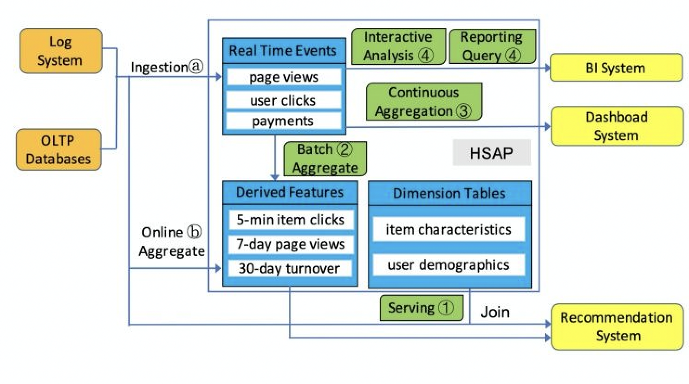
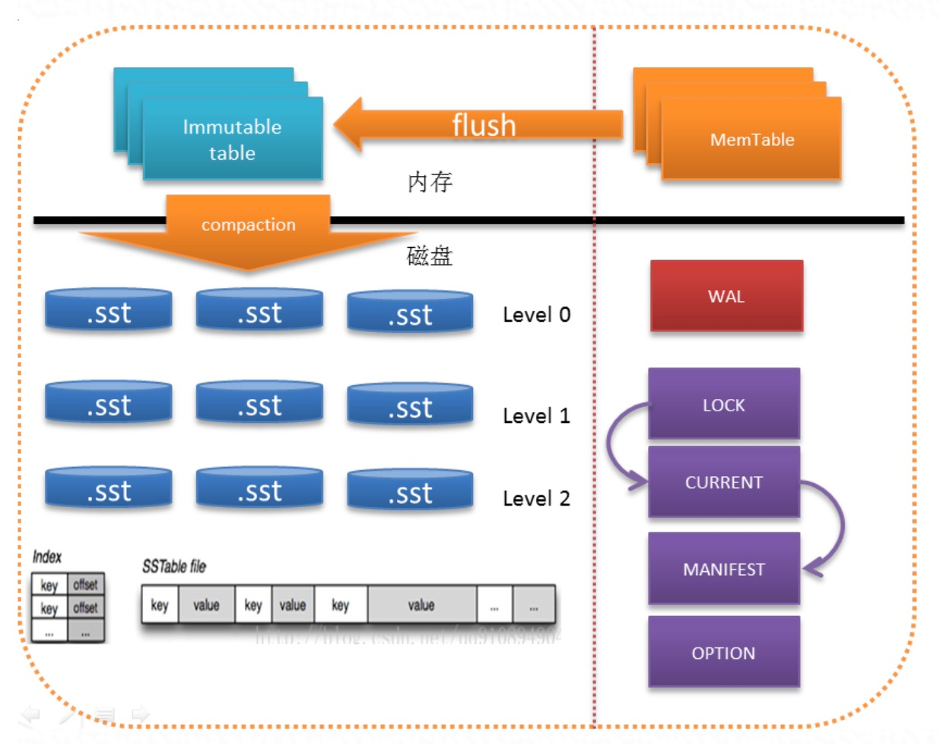
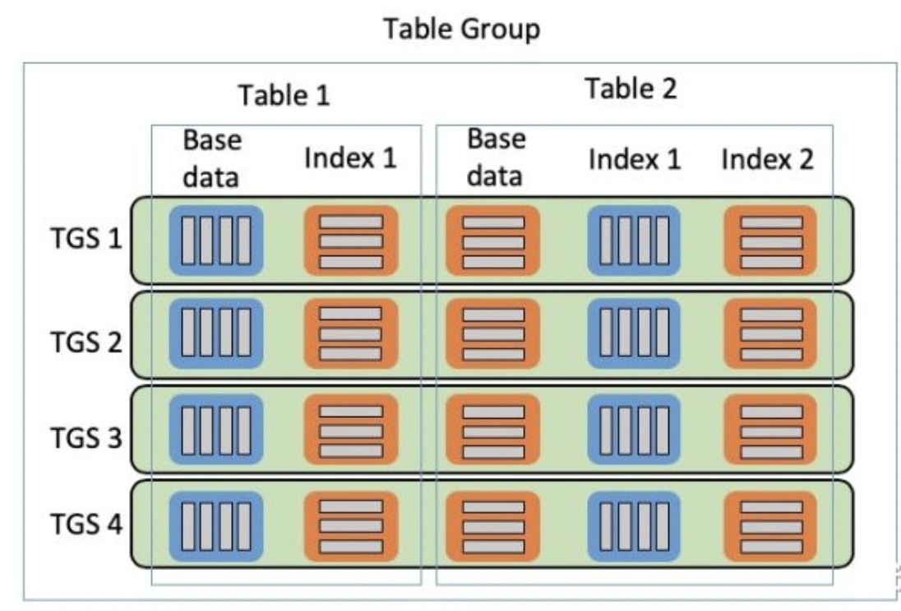
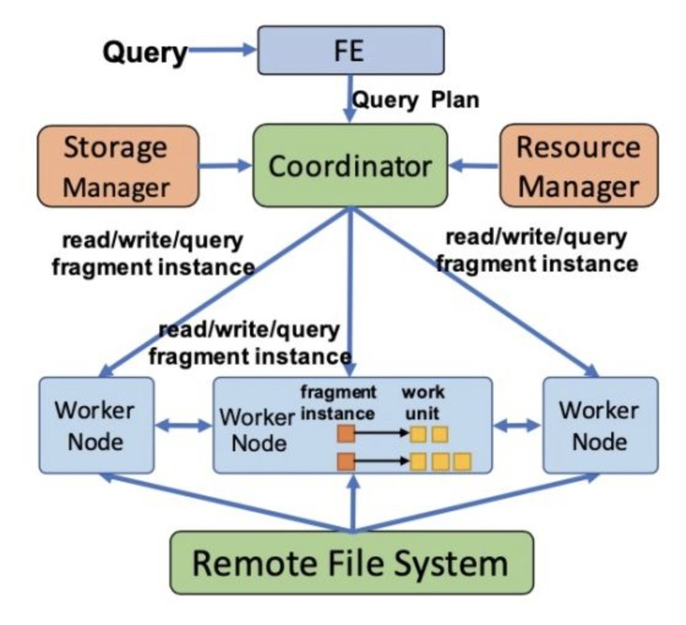

## 大数据查询分析 - 下一代OLAP引擎
------------------------------------------------------------


### OLAP标准要求

1. Atomic Updates. 原子更新。
一个用户的动作，比如一个点击行为，会被影响成百上千的视图的指标，比如影响推广计划、分网站、创意等等一系列具体报表，这个点击行为要么全部生效，要么全不生效，不能存在中间状态。
 
2. Consistency and Correctness. 一致性和正确性。
强一致性必须保证，可重复读，即使是跨DC也需要保证读出来的一致，这么高的要求和广告系统的严谨性有直接关系。
 
3. Availability. 高可用。
不能存在单点（SPOF），不能停服（downtime）。支持可容错性
 
4. Near RealTime Update Throughput. 近实时的高吞吐更新。
系统要支持增量实时更新，吞吐要达到百万行/秒。增量在分钟级即可被查询到的queryability，这么高的要求和广告系统角度来说很必要，每秒钟Google都会有百万级别的广告展现，而广告主或者系统的其他模块需要更短的时间看到报表，辅助决策。
 
5. Query Performance. 高性能查询。
系统既要支持低延迟的用户报表查询请求，也要支持高吞吐的Ad-hoc即席分析查询。低延迟要保证99分位平响在百毫秒。
 
6. Scalability. 高扩展。
随着数据量和访问量增量，系统的能力可线性（linear）的增长。
 
7. Online Data and Metadata Transformation. 在线的schema变更。
业务不断变化，对于schema的变更，包括加表、删表、加列、减列，新建索引，修改物化视图等的都必须不能停服的在线完成，而且不能影响数据更新和查询。

8. Distributed ACID. 分布式ACID-Spanner

### I.分布式OLAP的核心思路

### 2.1.通用MPP并行计算平台技术

MPP并行计算平台用于存储管理信息数据并形成数据仓库，支持数据分析挖掘。主要技术特点有：

    （1）	使用Shared-Nothing架构；
    （2）	数据分布式存储(本地化)并行加载；
    （3）	分布式并行计算，支持动态横向扩展；
    （4）	支持行式和列式存储、支持数据压缩；
    （5）	支持SQL优化技术、SQL查询及大表关联查询；
    （6）	支持粗粒度数据索引技术。

Ref:  [Greenplum Arch Design](2017-02-11-greenplum-arch-design-note.md)

### 2.2.MPP并行计算平台功能

**MPP(Massively Parallel Processing)**，即大规模并行处理，在非共享集群中，每个节点都有独立的磁盘存储系统和内存系统，业务数据根据数据库模型和应用特点划分到各个节点上，每台数据节点通过专用网络或者商业通用网络互相连接，彼此协同计算，作为整体提供数据库服务。非共享数据库集群有完全的可伸缩性、高可用、高性能、优秀的性价比、资源共享等优势。简单来说，MPP是将任务并行的分散到多个服务器和节点上，在每个节点计算完成后，将各自部分的结果汇总在一起得到最终的结果。
基于Map-Reduce模式的Hadoop擅长数据批处理，不是特别符合即时查询的场景。而业界当前做大数据实时查询一般都采用MPP架构，即大规模并行处理系统。数据库架构设计中，目前主要有Shared Everthing、和Shared Storage、Shared Nothing这三种主流架构。

**Shard分片**
A database shard is a horizontal partition(水平分区) of data in a database. Each individual partition is referred to as a shard or database shard. Each shard is held on a separete database server instance,to spread load.

做shard的三个原则
-尽可能大部分的业务逻辑都是根据分布键/均衡字段,至少百分之80%,更改分布式数据库中的均衡字段非常麻烦,必须一开始就规划号表的均衡字段
-如果不能选择有效的均衡字段,这张表就不要进行Shard,作为全局表
-如果业务选择不出有效率的均衡字段,那么进行分布式数据库的改造也将是徒劳的

tips：shard一般用hash打散,平均的,如果没有打散就是均衡字段没选好,可以选择用多个字段作均衡字段

**执行协调器**

执行协调器主要职责是接收SQL请求，生成执行计划，汇聚最终结果。执行协调器组件是SQL的统一入口，对外接收客户端SQL语句，生成分布式执行计划，下发计划片段到各执行节点，各执行节点返回执行结果到执行协调器，执行协调器汇总处理后，返回给客户端。

**SQL优化/执行**

支持多种优化策略，包括以下内容：
(1) 基于代价的执行计划优化(CBO, Cost-Based Optimizer)；
(2) 基于规则的执行计划优化(RBO, Rule-Based Optimizer)；
(3) 基于物化视图的执行计划优化(MBO, Materialize-Based Optimizer)；
(4) SQL过程间优化(ISO, Inter-SQL-Optimization)

**压缩技术**

数据压缩是指在不丢失信息的前提下，缩减数据量以减少存储空间，提高传输、存储和处理效率的一种技术方法。或者是按照一定的算法对数据进行重新组织，减少数据的冗余和存储的空间。数据压缩的主要目的还是减少数据传输或者转移过程中的数据量。

**动态扩展**

全并行的MPP+Shared Nothing的分布式扁平架构，这种架构中的每一个节点都是独立的、自给的、节点之间对等，而且整个系统中不存在单点瓶颈，具有非常强的扩展性。系统随着数据量的增加，会动态利用MPP集群下所有节点上的资源能力，按照Hash散列等规则在节点间自动进行数据均衡分布，实现数据处理的负载均衡，所以可以保证随节点数的增加，MPP集群的处理并行度会动态增加，从而保证集群处理能力的线性提升。

**行/列存储**

行存储法是将各行放入连续的物理位置，然后由数据库引擎根据每个查询提取需要的列。基于行的存储是将数据组织成多个行，这样就能在一个操作中找到所有的列。这种做法的缺点是必须每次处理一整行，而不是只处理自己需要的列。不过，这样在处理相同实体的两个或多个列的查询时能够取得更快的速度，而且可以提高更新、插入和删除操作的速度。

列存储法是将数据按照列存储到数据库中。这样做的优点是针对某个列中的值进行简单查询的速度非常快，需要的内部存储资源最少。对某个列中特定值的搜索可以直接进入该列的存储区，而不需要扫描整行的数据。这样也使得数据压缩变得更容易，因为一个列中的数据通常具有相同的数据类型。这种体系结构在处理数据仓库使用的海量数据时没有问题，但不适合需要进行大量以行的方式进行访问和更新操作的联机事物处理。

**粗粒度索引**

与传统数据库索引技术相比，粗粒度索引建立在数据包（粗粒度）上，并且每个字段均自动建有索引，而传统索引建立在每行数据（细粒度）上，因此访问智能索引要比访问传统索引需要更少的I/O（几万分之一）。同时，粗粒度索引所占空间大约是数据的百分之一，而传统数据库索引则要占到数据的20-50%。粗粒度索引具有如下特点： 

	- 1）表中的所有列自动建立。不需用户手工建立和维护。
	- 2）索引本身占空间很少，扩展性很好，建立索引后无膨胀。
	- 3）建立索引的速度快，后续的数据包建立索引的速度不会受到前面数据包的影响。


**并行数据加载BulkLoad**

MPP并行计算平台在节点内采用SMP并行架构，在节点间采用MPP并行架构。在集群的单个节点内，对数据库常用算子，如扫描、关联、排序、聚合的步骤之间，利用现代计算机的多核计算理论，采用流水线方式，实现了高度并行的计算能力。在集群范围内，可生成分布式执行计划，通过分布式并行执行引擎，该执行计划可以依据查询类型、数据分布方式、数据规模进行自动评估，产生最佳的查询执行路径，合理利用集群资源，将计算下发到各个数据节点执行，并行利用节点的计算能力。

**资源管理**

通过资源管理特性限定用户SQL的执行优先级，可以控制单用户的计算资源和IO资源，避免过度消耗，和用户使用的磁盘工作空间和配额，避免单一用户占用较多资源。
支持系统在线扩容，实现在线扩容期间业务不中断。
支持数据库版本间平滑升级，升级过程无需数据迁移。根据版本间的差异自动选择小版本升级和大版本升级，并且能够通过图形化界面进行升级。

    Tips:多任务下混合负载是分布式OLAP常见问题之一

### 2.3.标准OLAP设计组件

**A. Query Engine**

    -Compiler
    -Optimizer
    -Runtime(Query Execution) 

**B. Storage Engine**

    - LSM结构优化-RockDB
    - 存储数据格式

**C. 分布式查询(exchange opertor)**

    分治策略/MVCC机制
    网络数据交换

**D. 典型应用场景**

- 复杂实时SQL查询分析(关联查询/嵌套查询/Rollup Query/Windows Function/存储过程等)
- 海量数据统计查询(UV/PV统计/宽表查询分析/用户行为分析)
- 关键字检索查询/模糊查询
- 实时人群筛选/实时搜索推荐/算法策略计算


### II. New OLAP Engine Comparison

Greenplum = Master + Slaver(分布式PG instance)  --最早的MPP分布式数据库设计

| Source | OLTP | OLAP | MetaStore | File System |
| Google | Spanner | Mesa | BigTable/MegaStore | Colossue |
| OpenSource | TiDB | Doris/Clickhouse | HBase | HDFS |
| Alibaba | OceanBase/PolarDB | ADB/Hologres | KVStore | Pangu |


Mesa是Google开发的近实时分析型数据仓库

    其通过预聚合合并Delta文件等方式减少查询的计算量，提升了并发能力。

Mesa充分利用了现有的Google技术组件:使用BigTable来存储所有持久化的元数据，使用了Colossus(Google的第2代分布式文件系统)来存储数据文件，使用MapReduce来处理连续的数据。Paxos技术对元数据(metadata)实现存储和维护


Mesa is a distributed, replicated, and highly available data processing, storage, and query system for structured data. Mesa ingests data generated by upstream services, aggregates and persists the data internally, and serves the data via user queries.

Mesa的存储是多副本的并且分区做sharding的，很好理解，分治策略几乎是分布式系统的必备元素。批量更新，包括大批量，小批量（mini-batch）。使用MVCC机制，每个更新都有个version。为实现跨DC工作，还需要一个分布式一致性技术支持，例如Paxos。

Mesa相关的开源产品为Clickhouse(2016年Yandex开源)和Doris(2017年百度开源)

### III.OLAP DW Design-Clickhouse有特色的"伪"大数据系统
   
ClickHouse产品能力描述

    ✓ Blazing fast
    ✓ Linearly scalable
    ✓ Feature-rich
    ✓ Hardware efficient
    ✓ Fault-tolerant
    ✓ Highly reliable

    - 列式数据库
    - 数据压缩
    - 数据的磁盘存储
    - 多核并行处理
    - 多服务器分布式处理
    - 支持基础SQL
    - 向量引擎
    - 实时的数据更新
    - 索引
    - 适合在线查询
    - 支持近似计算
    - 支持数据复制和数据完整性
    - 没有完整的事物支持
    - 缺少高频率，低延迟的修改或删除已存在数据的能力
    - 稀疏索引使得ClickHouse不适合通过其键检索单行的点查询


正规的数据库产品里分2部分:

	1) Compiler， Optimizer， Runtime(query execution) 
	2) StorageEngine,包含Catalog，或者叫Metadata service

Compiler一般是Parse, Syntax check, Binding, Semantic check.

- Parse会用Parser generator比如说YACC或者ANTLR来通过文法产生，得到一棵AST(Abstract Syntax Tree），
- 之后的Syntax check检查语法，Binding解决每个词到底是什么，是column name， table name 还是function name等等。
- Semantic Check会做语义检查，最后AST被转化成Logical Operator Tree。

Clickhouse的compiler很特别。Parser是手写的，Parser干了很多活，后面接一个Interpreter。后者干了一半Compiler一半Optimizer的活。

Optimizer没有。。。

Runtime是亮点, 是以Vectorwise的做法.但参考得很特别。

**分布式查询的瓶颈-存储引擎如何设计**

CK的存储层是通过IStorage这个接口来做的。所以它搞了一个Distributed Table.类似于在不同节点上的单机Table的一个UNION ALL。Aggregte做push down，采用local aggregate和global aggregate两层。

**缺少exchange opertor的实现**

专业的分布式系统，在数据库里面是**通过exchange opertor来实现对数据的shuffle的**，这需要从optimizer到runtime都有支持。没有exchange operator，不能够做data shuffling的东西，就没资格自称是大数据系统。

**分布式replication怎么做**

Clickhouse的replication也很扯淡。Replication的办法是建立一张新的表，名字完全不一样，然后和老的表共享同一个ZooKeeper的path。这样你们两张表以后就同生共死，是兄弟了。对我的操作一定会复制给你，对你的操作也反之亦然。问题是，我如果是个新用户的话，我鬼知道原来李逵就是李鬼，李鬼也是李逵。

**主要产品架构**

- Zookeeper存储元数据，存储 on HDFS/本地磁盘，支持压缩
- 单表高速AdHoc查询能力, join多分布式表能力偏弱。--因为缺少分布式exchange opertor。
- 支持读写，只能‘伪’更新
- 擅长百亿数据量下大宽表聚合查询分析。-- UV/PV统计查询


### IV.OLAP DW Design-Doris源于百度Palo的MPP交互式SQL数据仓库

### 4.Doris的前世今生

Doris = Mesa的分析引擎+Impala查询引擎的开源优化+ORC

Doris 前身是 Palo ，Palo 是百度自研的基于 MPP 的交互式 SQL 数据仓库，主要用于解决报表和多维分析。它主要集成了 Google Mesa 和 Cloudera Impala 技术。

Palo没有完全照搬Mesa的架构设计的思路，其借助了Hadoop的批量处理能力，但将加工结果导入到了Palo自身存储，专注于联机查询场景，在联机查询部分主要借鉴了Impala技术。同时Palo没有复用已有的分布式文件系统和类BigTable系统，而是设计了独立的分布式存储引擎。虽然数据存储上付出了一定的冗余，但在联机查询的低延迟、高并发两方面都得到了很大的改善。

Palo在事务管理上与Hadoop体系类似，数据更新的原子粒度最小为一个数据加载批次，可以保证多表数据更新的一致性。

整体架构由Frontend和Backend两部分组成，查询编译、查询执行协调器和存储引擎目录管理被集成到Frontend；查询执行器和数据存储被集成到Backend。Frontend负载较轻，通常配置下，几个节点即可满足要求；而Backend作为工作负载节点会大幅扩展到几十至上百节点。数据处理部分与Mesa相同采用了物化Rollup（上卷表）的方式实现预计算。


[Impala：MPP SQL Engine on Kudu](2016-12-12-olap-distributed-impala-research-note.md)

### 4.1.Doris产品特性

**分布式架构**
DorisDB采用分布式架构，存储容量和计算能力可近似线性水平扩展。DorisDB集群的规模可扩展到数百节点，支持的数据规模可达到10PB级别。元数据和数据管理采用热备保证高可用， 能够自愈服务来保证数据安全可靠。

**列式存储**
DorisDB中的数据按列存储， 在查询时， 只需访问所需的目标列， 而不必像采用行式存储的传统数据仓库那样读取整行， 因此会有极大的性能提升。另外，由于数据按列组织，DorisDB可以使用压缩效率更高的编码技术对数据进行压缩，提升数据读取效率。并且可以针对某列创建包含范围信息，bitmap索引和bloomfilter的过滤条件，快速过滤不满足查询条件的数据，从而整体提升查询性能。

**标准SQL**
DorisDB支持标准的SQL语法，包括聚合，JOIN，排序，窗口函数，自定义函数等功能，用户可以通过标准的SQL对数据进行灵活的分析运算。 此外，DorisDB还兼容MySQL协议语法

**流批导入**


**智能物化视图**
DorisDB支持智能的物化视图。用户可以通过创建物化视图，预先计算生成预聚合表用于加速聚合类查询请求。 DorisDB的物化视图能够在数据导入时自动完成汇聚，与原始表数据保持一致。并且在查询的时候，用户无需指定物化视图，DorisDB能够自动选择最优的物化视图来满足查询请求。

**数据分区**
DorisDB支持两级分区和动态分区。首先， 第一级分区对数据做Range划分，  用户可以把分区作为管理目标， 动态增删分区。  其次， 为了解决分区内的数据倾斜问题，  对分区做第二级分桶， 对分区内的数据做Hash划分。 这种分区分桶的设计方法， 可以灵活管理用户数据，  比如可以设置分区的存储介质，副本数，分区的生存周期和分桶数量等等。 用户可以利用分区分桶的机制实现冷热数据分离等功能。


### 4.2.Doris架构


DorisDB集群由FE和BE构成, 可以使用MySQL客户端访问DorisDB集群。

- FE: FE接收MySQL客户端的连接, 解析并执行SQL语句。

管理元数据, 执行SQL DDL命令, 用Catalog记录库, 表, 分区, tablet副本等信息。
FE高可用部署, 使用复制协议选主和主从同步元数据, 所有的元数据修改操作, 由FE leader节点完成, FE follower节点可执行读操作。 元数据的读写满足顺序一致性。  FE的节点数目采用2n+1, 可容忍n个节点故障。  当FE leader故障时, 从现有的follower节点重新选主, 完成故障切换。
FE的SQL layer对用户提交的SQL进行解析, 分析, 改写, 语义分析和关系代数优化, 生产逻辑执行计划。
FE的Planner负责把逻辑计划转化为可分布式执行的物理计划, 分发给一组BE。
FE监督BE, 管理BE的上下线, 根据BE的存活和健康状态, 维持tablet副本的数量。
FE协调数据导入, 保证数据导入的一致性。

- BE: BE管理tablet副本, tablet是table经过分区分桶形成的子表, 采用列式存储。

BE受FE指导, 创建或删除子表。
BE接收FE分发的物理执行计划并指定BE coordinator节点, 在BE coordinator的调度下, 与其他BE worker共同协作完成执行。
BE读本地的列存储引擎获取数据,并通过索引和谓词下沉快速过滤数据。
BE后台执行compact任务, 减少查询时的读放大。
数据导入时, 由FE指定BE coordinator, 将数据以fanout的形式写入到tablet多副本所在的BE上。
其他组件

- 管理平台

Hdfs Broker:  用于从Hdfs中导入数据到DorisDB集群，见数据导入章节。


### V.Hologres: 面向云端的HSAP混合分析引擎

Hologres = 混合查询引擎+自研存储引擎(AliORC) on 自研文件系统Pangu

HSAP-Hologres: A Cloud-Native Service for Hybrid Serving/Analytical Processing

### 5.1.需求与思考

**A.融合分析处理与在线服务: Fusion of Analytical Processing and Serving.**

	- 分析能力与服务能力的融合：在传统的OLAP系统中，大量的数据通过离线的计算完成数据的分析，然后将分析结果传递给在线服务进行使用。而实时决策制定不仅是一个在线服务，在服务的同时，也要进行复杂的数据分析，不能将其割裂。

**B.融合在线分析与离线分析: Fusion of Online and Offline Analysis.**

	- 实时分析与离线分析的融合：当前的业务需要持续的进行数据更新，并快速产出最新的分析结果，供决策使用。高频写入的数据要在秒级别可读。传统OLAP的离线ETL所造成的的延迟已经不符合业务的要求。OLTP系统虽然支持了实时写入，但是覆盖场景有限。如在点击日志这种高频数据写入的同时，提供高效的查询服务，OLTP系统是无法完全支持的。

**C.混合Serving&Analytics负载: 存在大数据解决方案能够混合支持通常在不同系统内的在线服务与分析处理的负载.**

	Existing big data solutions usually host the hybrid serving and analytical processing workloads using a combination of different systems


除了特征数据，系统还要支持(流程③)来自各个平台的连续聚合查询，例如查看关键性指标。以及(流程④)定期的批量分析(如构建报表)的功能。

通过当前的经验进行系统实现

	流程1的点查服务可选用HBase/Cassandra
	流程2的离线聚合可选用Hive
	流程3的连续聚合查询可选用Druid
	流程4的批量分析可选用Impala/Greenplum/Doris

系统将会非常复杂。综上，HSAP则是包含了上述全部的能力，提供服务分析一体化的数据处理服务。




### 5.2.System Design系统设计


_系统架构概览_

- Front End：认证、解析、优化接收请求，生成QueryPlan查询计划.该执行计划是一个包含了多个可以并行执行的Fragment Instance(分片实例)执行图.
- Coordinator：分发查询、联邦查询.主要负责将FE中产出的Fragment Instances进行处理与分发，最终成为多个Work Unit。
- Work Node：计算节点，代表物理资源，负责多个Table Group Shard(数据分片)
- _Table Group Shard(数据分片):Hologres的数据管理单元。一个TGS包含1个WAL(Write-Ahead Logging, 预写日志系统) Manager和多个Tablet._
- _Query Executor: 混合多种查询执行器- PQE / SQE / HiveQE_
- _HOS：轻量级调度框架_
- _EC Pool：资源隔离，负载隔离_
- Cache：分层缓存
- Resource Manager：容器资源管理。管理Shard分布和状态
- Storage Manager(Meta Service)：元数据管理，支持查询分发
- 分布式文件系统Pangu：快速的分布式存储(优化存储数据格式-AliORC)


### 5.3.核心技术解析

**A. HSAP(hybrid serving/analytical processing) challenge**
	
- High-Concurrency Hybrid Query Workload:混合负载(在线服务&实时OLAP)是完全动态变化的,以应对突然的暴增。系统要求弹性且可扩展能力.处理查询负载远高于传统OLAP系统
- High-Throughput Real-Time Data Ingestion:在处理高并发查询负载的同时,此系统依然需要保持高吞吐的实时数据写入能力。实时数据写入能力在秒级上下是为了实现实时在线服务与分析任务。
- High Elasticity and Scalability: 极致弹性伸缩

**B.  数据存储: 存储引擎设计Storage Design**

- 存算分离(Decoupling of Storage/Computation): 计算和存储彻底分离成功解决了计算节点成为系统吞吐量瓶颈的问题
- Tablet数据结构面向切片的数据分层
- 读写分离(Separation of Reads/Writes):同时支持高并发的读与高吞吐的写操作
    Hologres的数据读取和写入路径是分离的，可以支持高并行的写入与读取。Tablet的writer通过类LSM结构来完成数据的写入，并标识对应的版本号，该次写入可以亚秒级别对reader可见。Tablet的reader通过版本号获取当时可见的数据镜像，这样就达到了读写互不阻塞的目的。

        Tips: tablet 则是分布式调度和存储的最小单元。

**C. 并行查询执行引擎**

- Execution Context(简称EC)：Hologres构建了自己调度框架，名为HOS(Holo-OS)。HOS将系统线程抽象成为面向用户的线程，被称为Execution Context。EC是非常轻量级的，创建和销毁的消耗都可以忽略不计。EC提供异步调用的接口，HOS在系统线程级别调度EC，所以EC的切换消耗非常小。HOS将读写请求进一步拆分成多个Work Unit(工作单元，简称WU)，并建立WU与EC的映射关系，等待系统调度。EC与WU是1:N的关系。这种设计让系统可以在工作时灵活调整负载，以应对突发的峰值。
-   可定制的调度策略：HOS将调度策略与上述的EC调度机制解耦。HOS将不同query请求的多个EC进行分组，构成Scheduling Group(调度组)。每个调度组共享自己的调度资源，而HOS则负责监控每个调度组的资源份额，保证资源的公平性，实现了资源隔离。

        Tips: 执行上下文调度机制/HOS/自定义调度策略


### 5.4.存储引擎

Hologres中存在两种存储类型的表，行存表主要服务于延迟低的行数据点查场景，列存表则主要服务于复杂分析的高吞吐列扫描场景。

Hologres的存储引擎名为(Blackhole，黑洞),完全自研的存储计算引擎，采用异步编程模式开发。Blackhole底层提供的灵活高效的异步框架:Holo OS(HOS)。在实现高性能的同时,还实现了负载均衡,解决执行查询时的长尾问题;实现了多种共享与隔离机制,达到了资源高效利用的目标。Holo OS扩展到分布式架构下,发展出Holo Flow分布式任务调度框架,确保在分布式环境下能实现单机调度的灵活性。

- 基于LSM的优化存储引擎 (append only顺序模式, 减少随机写)
	+ 基于masstree的memtable-无锁设计(HBase 对比会有线程竞争)
	+ RocksDB(KVStore)开源优化-Sorted Strings Table文件查询优化
	+ Snow-shovelling的flush策略
	+ 自适应的扩层策略
	+ 实时in-memory compaction




- 行存(KV cache)：支持低延迟查询,对点查询和批量scan更友好(应用Hbase类简单场景)
- 列存(AliORC优化)：按列做聚合更高效，压缩更高效，适合OLAP分析型场景(应用Impala场景)
通过delta_store实现了列存高效的实时update 和 delete操作
- 支持行列混存: 非PK主键 可通过行列混存方式加速查询性能。首先在列存中取出特定非PK字段，后在行存中取出对应此非PK字段所对应的全行数据。所对应表既有行存/又有列存。
- External Table外表支持
- 各种Index的实现
    <1> segment index (快速定位文件)
    <2> cluster index (对文件内数据排序)
    <3> bitmap index
    <4> dictionary encoding
- 精细化的Cache(BlockCache，resultCache，bloomfilter 等加速查询 )

**5.4.1.数据模型**




**5.4.2.TableGroupShard-表组分片**

TGS是Hologres的数据管理单元。一个TGS包含1个WAL(Write-Ahead Logging, 预写日志系统) Manager和多个Tablet。如图所示，WAL Manager主要负责写入操作日志，类似数据库的binlog，用于数据恢复使用。Tablet使用LSM(Log-Structured Merge) Tree优化数据结构来维护数据，每个Tablet中包含两个部分：内存表(MemTable)和Shard File(图中的L0、L1....)。

- 内存表：就是一个数据中转表。数据写入时会首先写入内存表，内存表会定期(或写满时)将数据刷新到Shard File中进行持久化。
- Shard File: 分片文件被组织成为多层结构。L0层，每个shard file对应一个内存表。从L1开始，所有的数据被拆分成多份到不同的shard file中，并通过key进行排序，保证每个shard file的key所在的范围均不重叠。因为每个shard file容量有限，每层文件数量有限，于是随着数据的增多，层数也逐步增多。我们可以手动规定shard file的最大容量M，和第i层与(i+1)层文件数量的倍数K。
- LSM Tree的算法策略是append操作，底层文件是只能追加无法修改的，于是HOS会持续将shard文件做整合以避免文件数量膨胀，该操作是异步后台完成的，读写均无需关心。

当TGS出现故障时，系统会根据Log重新构建内存表，结合shard文件从而完成整张表的重新恢复。

Tablet也维护了一份**元数据文件**，用于存储与之对应的Shard Files的状态。该文件的维护类似RocksDB，持久化在文件系统中。为了读写解耦，所有的数据都有版本号的标识。对于HSAP场景，他的事务机制比HTAP要稍微弱一些，所以服务只提供atomic write(原子写)和read-your-writes read(客户端能看到自己最新提交的写)操作，来满足高吞吐的读写性能。

	Tips: HTAP实现的是强一致性ACID.

_5.4.2.1 TGS写原理_

TGS的写入分为单分片写和分布式批量写两种场景，都是保障原子性的。单分片写可以高速完成，批量写则需要将大量数据写入多个分片中，需要保障分布式事务的一致性。批量写的请求频率远小于单分片写。

*1.单分片写*

如上图所示，当写入请求到来时，经过以下几个步骤

分配一个LSN(Log sequence number，版本号), 这个版本号由时间戳和一个递增序列值构建而成
WAL构建一条数据注入的日志，并持久化到log file中
Tablet对应的内存表接收并完成这次写请求，该次写入的内容对读可见
如果内存表满了，则数据刷新到Shard File中，并新建一个内存表。Shard File会在后台异步完成整合与压缩

*2.分布式批量写*

分布式写一致性保障策略：两段式提交Two Phase Commit。FE节点收到批量写请求后，会将全部涉及到的tablet全部加锁，然后经过以下几个步骤：

分配一个LSN
Tablet做一次内存整理，防止批量写数据撑爆内存。WAL构建一条数据注入的日志，并持久化到log file中
内存表接收此次要写入的数据，并将这些数据flush到shard文件中，向FE汇报自己的执行情况
当FE接收到了全部Tablet成功的消息，则发出事务提交命令，写Commit Log。如果任一Tablet失败，则发送失败消息，每个Tablet将新增的shard文件删除即可。最终FE释放锁。

_5.4.2.2 TGS读原理_

Hologres无论是行存表还是列存表，均提供了多版本机制。读的一致性保障级别是read-your-writes read，即客户端可以快速读取到自己写入的数据。读请求都包含一个LSNread(读版本号)，因为版本号是由时间戳构成的，所以LSN > LSNread意味着该数据是在此次读之后被写入的，这部分数据将在读的过程中被过滤掉。LSN <= LSNread的数据才是命中数据，整合成最终结果返回。

同时为了加速多版本读取请求，TGS为每个表维护了一个LSNref，标识当前数据的最早版本号。LSNref定时更新。

LSN <= LSNref，说明这些数据的版本已经合并完毕了
LSN > LSNref，说明这些数据还存有全量的版本

**5.4.3.行存Tablet**

*1.结构描述*

如上文所讲，行存表主要用于快速的点查场景，本节主要介绍内存表和shard的存储结构。

内存表：通过MassTree实现，所有的数据已经根据key排序。
shard文件：在shard file中数据以块进行存储，包含数据块和索引块。为了快速查找，索引块中存储了每个数据块的起始key和该数据块在shard file中的offset，数据结构如<key,block offset>
为了支持多版本机制，value的数据结构被设计成<value_cols, del_bit, LSN>

	value_cols：包含了该行非key的列数据
	del_bit：逻辑删除位，1标识已经被删除
	LSN: 写版本号

*2.读取流程*

读取请求包含一个key和LSNread，同时请求内存表和shard文件获取最终返回数据。

内存表：LSN<=LSNRead的数据命中本次查询，同一个key取LSN最大的数据作为该行的最终结果，del_bit为1的数据将被过滤掉
shard文件：shard文件的key range包含本次的请求的key，则该分片命中，然后通过LSNread做和内存表一样的过滤合并，完成数据返回
因为values_cols存储的并不是一行的全部列，所以要还原一整行数据，必须要找到这一行key存在的所有shard。这个key可能分布在任意shard中，所以读请求要扫全部层的shard已确认读取候选集

*3.写入流程*

写入请求包含key、cols_value和LSNwrite。写入请求转换为kv结构写到内存表，当内存表满后数据被刷新到shard文件中，进一步会触发shard文件层数则增加与压缩合并。写入请求分为两类：insert/update，delete。

    insert/update：del_bit为0，写入到内存表中。update操作时写入的value_cols字段只包含update列的值
    delete：del_bit为1，cols_value为空，写入到内存表中

**5.4.4.列存Tablet**

1.结构描述

与行存表不同，列存表分为两个组件: Column LSM-Tree和Deletion Map。如上图所示

Column LSM-Tree：写入的数据扩展成<value_cols, LSN>结构。value_cols是没有key的全部列字段的值，LSN为写的版本号。该部分同样由内存表和shard文件构成。内存表使用Apache Arrow结构存储数据，数据按照写入的顺序排序。每个shard文件则包含3种Block：数据块、索引块和元数据信息块。

    数据块：每个记录根据key进行排序，并被划分到多个Row Group行组中。如上图所示，每一列被行组划分成了多个数据块，同一列的数据块被连续存储在shard文件中，用于顺序扫描。
    元数据块：元数据块主要包含了每一列的元数据和本shard的元数据，用于加速大规模数据查询。主要存储了以下内容
    对于每一列：存储了每个数据块的key范围、数据块在shard文件中的offset、数据的schema
    对于shard文件：存储了该文件中数据的行数、LSN范围、key的范围和压缩的schema。
    索引块：根据key快速定位到行，主要存储了每个行组的第一个数据块的key。
    Deletion Map：Deletion Map就是一个行Tablet。其中数据结构为<field, <bitmap; del_bit;LSN>>。field是shard file的一个ID，value是一个bitamp(实现使用的RoaringBitmap)，该bitmap标识了哪些行是被删除的。其他字段见3.3的描述。有了deletion map，列存tablet才能进行大规模并行的扫描。

2.读取流程

读取请求包含读版本号LSNread和目标列。同样需要扫描内存表和shard文件来获取最终结果。在读取shard文件时，为了加速查询，会将当前LSNread与shard文件的LSN range作比较，有3种情况

    最小的LSN > LSNread，意味着整个shard文件都是读之后写入的，该shard文件被pass
    最大的LSN <= LSNread，意味着整个shard文件都是读之前写的，全部命中，遍历LSN，产出LSN的bitmap
    其他情况，说明shard文件中部分数据是读之前写的，一部分数据命中。于是遍历这个shard文件数据块的LSN，并产出一个LSN的bitmap，用于标识该LSNread下哪些行是可见的
    
在找到了全部命中的数据集后开始以下操作：

我们从多个shard文件中生成了多个LSN bitmap，记做A
然后使用Deletion Map进行本次读取数据的删除的过滤：使用上面命中的多个shard的ID，访问Deletion Map获得了多个bitmap(因为deletion map也是行tablet，读取方法与3.3相同)，记做B
将A和B merge到一起获得C，就得到了过滤了已删除的数据。然后C join数据块就得到了最终的返回结果。
每个列存的Shard的key range是严格没有交集的，而行存的是有交集的。因为列存tablet每一行对应的value存储了全部的列值字段，所以一行的全部数据一定都可以在某一个shrad文件中全部找到。shard文件使用LSM-Tree进行维护，其实实现时只有两层，在合并压缩时会本层横向合并，列存的shard文件比行存shard文件要大很多。

所以列存的读取读取，通过shard文件配合deletion map，可以独立并行高速完成行的还原，而不用将所有层的shard文件全部遍历。

3.写入流程

写入流程包含insert和delete。update语义在存储层会被转换为insert操作并配合deletion map完成更新。

    insert包含key，多了列的列值和LSNwrite。insert将数据写入内存表，之后会被flush到shard文件
    delete包含一个key，这个key可以快速定位到shard文件和文件中要删除的行。写入到deletion map，field是这个shard文件的id，bitmap是行号
    update与insert类似，首先会根据key找到shard文件来读取本行的全部列，还原本行。然后将此行的行号写入deletion map，意味着此行删除。之后根据update的value值更新这一行对应的列值，然后整行重新写回内存表

**5.4.5.分层缓存Cache**

Hologres采用分级缓存机制，既降低了I/O成本，也降低了计算成本。
根据上文介绍，每个talet都有一系列shard文件与之关联，持久化到分布式文件系统中。**总共有三层缓存：本地磁盘缓存、块缓存和行缓存**。
	
	-本地磁盘缓存：将碎片文件缓存到本地SSD，以降低I/O操作的频率
	-内存块缓存：将shard文件中近期读取的block在内存做缓存。由于服务和分析两种工作模式的不同，行存块和列存块的缓存做了物理隔离。
	-行缓存：存储了最近通过点查返回的行合并结果。


### 5.5.执行引擎与调度

**5.5.1.高并行的查询**

Figure 5: Workflow of Query Parallelization



一次请求的全部执行过程如上图所示。

步骤一：在一次请求提交之后，FE中的Query Optimizer产出一份执行计划图，并将执行计划转换成执行分片(fragments)。执行分片分为3种：读、写和查询。

    read/write fragments：包含了读写表的算子
    query fragments：包含非读写的其他处理算子
    fragments进一步会被划为多个fragment instance(分片实例)，每个分片实例操作一个TGS。

步骤二：FE将请求发送到Coordinator，分片实例会被Coordinator分发到不同的worker中执行

    read/write实例：被分配到操作对应的TGS的worker中执行
    query实例：可以被分配到任意worker中执行。存储管理器和资源管理器同步了各个worker的位置和集群工作负载的信息。根据当前的集群负载来分配query实例到对应的worker，以达到集群的负载均衡。

步骤三：在每个Worker Node中，fragment instances被映射到多个Work Units。WU是Hologres的基本执行单元。WU会进一步动态生成多个WUs。如下所示(该图为本人根据原文理解所画，是WU生成的过程，并非执行过程)

    read fragment instance
        首先，产出一个同步读WU，主要工作是从tablet获取当前的版本号和元数据信息。元数据信息包含内存表的读快照和shard文件列表。
        然后，同步WU会产出多个读接收WU，并行执行内存表和shard文件的读取，并完成相关的数据处理工作(如udf)
    write fragment instance: 写分片实例中的非写的相关计算会被分配的Query WU中执行。写入的部分会产出一个写同步WU完成WAL的log持久化，然后产出多个写接收WU用于并行更新各个Tablet。
    query fragment instance: 产出Query WU。
    
**5.5.2.SQL 计算引擎的优化**
    
经典 SQL 的计算引擎一个很大问题就是无论是 expression 还是 operator，其计算的时候都大量使用到虚函数，由于每行数据都需要经过这一系列的运算，导致计算框架开销比较大，而且由于虚函数的大量使用，也影响了编译器的优化空间。

在减小框架开销方面，两个常用的方法就是
    
    均摊开销-向量化执行
    消除开销-代码生成

**A.向量化执行**

向量化执行的思想就是均摊开销：假设每次通过 operator tree 生成一行结果的开销是 C 的话，经典模型的计算框架总开销就是 C * N，其中 N 为参与计算的总行数，如果把计算引擎每次生成一行数据的模型改为每次生成一批数据的话，因为每次调用的开销是相对恒定的，所以计算框架的总开销就可以减小到C * N / M，其中 M 是每批数据的行数，这样每一行的开销就减小为原来的 1 / M，当 M 比较大时，计算框架的开销就不会成为系统瓶颈了。

除此之外，向量化执行还能给 compiler 带来更多的优化空间，因为引入向量化之后，实际上是将原来数据库运行时的一个大 for 循环拆成了两层 for 循环，内层的 for 循环通常会比较简单，对编译器来说也存在更大的优化可能性。举例来说，对于一个实现两个 int 相加的 expression，在向量化之前，其实现可能是这样的：

```sql
    class ExpressionIntAdd extends Expression {
            Datum eval(Row input) {
                    int left = input.getInt(leftIndex);
                    int right = input.getInt(rightIndex);
                    return new Datum(left+right);
            }
    }
```
在向量化之后，其实现可能会变为这样：

```sql
    class VectorExpressionIntAdd extends VectorExpression {
            int[] eval(int[] left, int[] right) {
                    int[] ret = new int[input.length];
                    for(int i = 0; i < input.length; i++) {
                            ret[i] = new Datum(left[i] + right[i]);
                    }
                    return ret;
            }
    }
```
显然对比向量化之前的版本，向量化之后的版本不再是每次只处理一条数据，而是每次能处理一批数据，而且这种向量化的计算模式在计算过程中也具有更好的数据局部性。

**Hologres向量化编译执行引擎**

大规模使用向量化计算技术加速计算, 所有计算都是向量形式进行执行。

例如:Select column1+column2 FROM TABLE，执行时会依次8192行的column1与8192行的column2进行向量加法,充分利用CPU的SIMD指令集(例如: SSE指令集、AVX512指令集)。配合列式存储和异步执行框架, 从而达到极致性能。

    Tips：SIMD(Single Instruction Multiple Data) 是指单条指令处理多条数据, 相对传统。SISD(Single Instruction Single Data) 单条指令处理单条数据性能会有几倍提升。

**B.代码生成**

代码生成的思想是消除开销。代码生成可以在两个层面上进行，一个是 expression 层面，一个是 operator 层面，当然也可以同时在 expression 与 operator 层面进行代码生成。

经典 SQL 计算引擎的一大缺点就是各种虚函数调用不但会带来很多额外的开销，而且还挤压了 compiler 的优化空间。代码生成可以直观的理解为在 SQL plan build 好之后，将 plan 中的代码进行一次逻辑上的内联。如果实现的好，代码生成能够将CBO火山模型代码转换为类似于手动优化的代码，显然和向量化执行一样，代码生成后的新代码也给编译器带来了更多的优化机会。与向量化执行相比，代码生成之后数据库运行时仍然是一个 for 循环，只不过这个循环内部的代码从简单的一个虚函数调用plan.next()展开成了一系列具体的运算逻辑，这样数据就不用再各个 operator 之间进行传递，而且有些数据还可以直接被存放在寄存器中，进一步提升系统性能。

当然为了获取这些好处代码生成也付出了一定的代价，代码生成需要在 SQL 编译器编译获得 plan 之后进行额外的 code gen + jit ，对应到具体的工程实现也比向量化执行的难度要高一些。 

举例来说，对于下面这条 query:

```sql
    select *
    from R1,
        (select R2.y, count(*)
        from R2
        where R2.x=3
        group by R2.y) R2
    where R1.a=7 and R1.b=R2.y
   
```
通过代码生成技术，其执行过程会变成这样：
```sql
    map<int, vector<Row>> hash_table_for_join;
    map<int, int> hash_table_for_agg;
    for(Row row in scanBuffer_R1) {
            int a = row.getInt(0);
            int b = row.getInt(1);
            if (a == 7) {
                    // ignore the case when the key `b` doesn't exists for simplicity
                    hash_table_for_join[b].push_back(row);
            }
    }
    for(Row row in scanBuffer_R2) {
            int x = row.getInt(0);
            int y = row.getInt(1);
            if (x == 3) {
                    // ignore the case when the key `y` doesn't exists for simplicity
                    hash_table_for_agg[y] = hash_table_for_agg[y] + 1;
            }
    }
    for (auto &v1 : hash_table_for_agg) {
            for (auto &v2 : hash_table_for_join) {
                    if (v1.first == v2.first) {
                            // construct new row and send to the client
                    }
            }
    }
```

相比于传统的火山模型，上述执行过程不再以 operator 为核心，而是以数据为核心，其最大特征是将单一 operator 的执行逻辑分散在多个代码块中，模糊了 operator 之间的执行边界，从而大大降低了 operator 之间数据传递的开销。

**5.5.3.Execution Context(EC)**

在HSAP服务场景下，多用户同时查询是非常常见的场景，那么**并发查询的WU现场切换开销必然成为性能瓶颈**。于是Hologres提出了EC的概念。EC是HOS抽象出来的用户空间级别的线程，用于承载WU。**EC是HOS的基本调度单元**。EC是HOS抽象出来的用户空间级别的线程，用于承载WU。与通常的预先线程调度不同，ECs是协同调度的，不需要任何系统调用与同步原语，因此EC的切换的性能开销可忽略不计。

我们在需要并行执行时，通常开一个线程池，然后将任务划分成多个子任务在各线程并行执行。这样就需要把现场传到新的线程中，各个线程的反馈执行情况后再进一步汇总。而Hologres正好相反，线程本身已经划分完毕了，每个线程持有自己的执行现场。任务被划分成各个EC分配到各个线程中，线程执行时是通过点切EC来完成计算的。每个线程不需要和其他线程交互，因此不需要额外的系统调用和同步原语。

_5.5.3.1 EC Pools_

如4.5章图所示，在Worker Node中，EC池被分为3类：*data-bound EC pool, query EC pool and background EC pool*。每个EC池相互独立，并维护各自的任务优先级。

	* Data-bound EC Pool(蓝色): 数据绑定的EC又被分为两种类型WAL EC和Tablet EC。每个TGS包含1个WAL EC和多个Tablet EC,每个Tablet EC负责一个tablet。
	* WAL EC: 执行write-sync WUs
	* Tablet EC: 执行read-sync WUs和write-apply WUs
	* Query EC pool(其他颜色): 执行query WU或read-apply WU
	* Background EC pool(灰色): 在上文中提到，大量的数据写入shard file中，shard file则在此EC池执行时完成压缩与合并。因为高频的写入都在内存表中完成，所以是不需要在全局加锁的。如4.5章的图所示，为了限制后台EC消耗的资源，本EC池与其他池子物理隔离，并且后台EC的执行优先级低于其他EC。

_5.5.3.2 EC的内部结构_

1. 任务队列

一个EC存在两个任务队列
	
	* Internal Queue：本EC提交的任务的队列，本队列是无锁的。
	* Submit Queue： 其他EC提交的任务队列(本队列是线程安全的)

在submit queue的任务会被重新定位到internal queue，internal queue的任务通过FIFO方式执行。

2. 状态转换

如图所示，EC主要分为三个状态：*runnable, blocking and suspended*。

	- Suspended的初始状态，当前的EC是无法被调度执行的，队列中没有任务
	- 有任务提交时，由Suspended全切换到runnable状态，可被调度执行
	- 当队列中的全部任务被阻塞了，则整个EC进入blocking状态。这个时候任务不被阻塞或者有新任务提交，EC则有会回到runnable状态
	- 当EC被取消或join时最终会回到Suspended状态。
		- 当被取消时，队列中未完成的任务直接认为失败，回到Suspended状态
		- 当join情况下，将不会再接收其他任务，将存量任务全部执行完毕，回到Suspended状态

**join主要存在于协同工作的场景，多个EC共同完成一个请求。当前EC作为主EC，其他EC作为子EC，均各自执行不相互依赖。子EC都结束了，但主EC还在执行，于是主EC不能接收新的任务，待存量任务执行完毕，整个请求才算执行完毕，然后主EC回到挂起状态**。

_5.5.3.3 多计算引擎的联合查询_

**支持多种计算引擎: PQE / SQE / HiveQE**

Hologres支持访问其他开源数据存储引擎的，如Hbase、Hive。​**一个查询语句可以同时执行在底层物理隔离的不同查询系统中**。

	* 在query解析过程中，其他系统相关的计算会被划分到不同的fragment中。coordinator将这些fragment分发到其他计算引擎中。
	* 外部系统接收到的fragment对应是特殊的WU，这些WU被映射到了Hologres统一管理的ECs中。
	* 这些特殊的WU会接收Hologres中WU提交的请求，完成相关计算。

这种能访问外部系统的能力不仅是功能上的需求，而且是有利于解决本身系统安全问题一种机制。这种机制类似构造了一个隔离沙箱，假如用户提交了一个不安全的UDF，那么Hologres将这些函数发送给Postgresql来完成。Posgresql的执行底层是和Hologres是完全物理隔离的。​

**5.5.4.调度机制**

_1. 基于Pull的异步Query执行原理_

query在Hologres中是异步执行的，Hologres内部描述了一种基于pull的范式来拆解执行计划。基于数据拉取的Query的执行是从coordinator开始的，如上图所示，在执行计划里，叶子fragment会进行数据的拉取(如从shard file中拉取数据)，然后sink fragment(可理解为read fragment)会完成数据的处理与整合，产出最终的结果。所以工作流程如下：

	* coordinator发送pull request到对应的sink fragment的WUs
	* 接收到请求的主WU(read-sync wu)进一步将请求拆分发送到给子WU(read-apply wu)中，可从之前的图理解
	* 每个包含读取算子的子WU(如column scan请求)，将会从shard文件中读取一批数据，整合成多个<record_batch, EOS>结构返回给主WU。主WU可以并行接收多个子WU返回的数据以提高性能。
	* record_batch就是一部分返回的数据
	* EOS标识此WU是否已经完成了全部数据的返回
    
coordinator收到之前query的请求结果时，会校验全部的EOS标识。

	* 如果该次请求全部结束，那么返回之前query对应的结果
	* 如果未结束，则继续新query的分发

其实在Hologres的实现中，pull request是通过函数调用实现的(**上文提过EC实现了异步调用接口**)。找到持有read能力的WU的EC，调用函数将request插入该EC的提交队列即可。当然，目标EC未必本worker中，所以worker之间的通信也是不可避免的。worker之间的通信已经封装成rpc调用，只需要传入目标EC的ID即可。目标worker找到对应EC完成插入操作。

_2. 反压_

如1中介绍，如果一个WU接收了很多的pull request，那必然会造成奔溃，于是采取了以下两种方案

限制每个WU能够接受的最大pull request的数量
建立缓存：WU返回的结果来源于多个子WU，在多个pull request情况下，WU返回的数据可能是重复的，于是把这份数据做了缓存。为了避免缓存膨胀严重，被高频调用的WU会被暂时减缓调用频率

_3. 预加载_

HOS支持将pull request的结果缓存，以供后续的query请求使用。预加载的任务会进入预加载任务队列中，待调度完成后，将结果写入缓存。pull request会首先访问缓存进行结果返回。

**5.5.5.负载均衡**

主要有两个负载均衡策略：**TGSs的迁移和ECs的重分布**。

_1. TGSs的迁移_

依据当前的实现，所有的读写fragments会被分发到与TGS关联的worker中执行。那么当某个TGS成为热点，或某个worker高负荷时，Hologres将会将部分TGS迁移到其他Worker中来平衡负载。方式很简单，只需要将热点TGS标记是fail，触发资源管理器的恢复机制，启动新的worker承载该shard。

_2. ECs的重分配_

HOS将EC分布到各个EC池来达到负载均衡，有3种重分配方式

* 将最新的EC被分配到包含EC最少的那个EC池
* HOS定期将多个EC池中的EC进行重分配，让各个EC池中的EC数量差值最小
* HOS支持**workload stealing(工作负载窃取)**。当一个线程已经没有EC执行了，他会从在同一个线程池中找到包含最多EC的那个EC池，然后从中拿一个EC来执行。**EC在本质上就是HOS封装了线程，所以论文在描述HOS调度时会用线程池说明，而讲述EC时就用了EC池。一个系统的线程池包含多个EC池**。

当然，只有在EC内部没有任务执行时，才会对EC进行重分配。

**5.5.6.调度策略**

_1. 策略描述_

在HSAP场景下，**混合复杂查询的性能保障是最大的挑战点**。也就是说，大规模检索查询不能影响高qps延迟敏感的点查。为了解决这个问题，于是引入了**Scheduling Group(调度组)**的概念。SG是data-bound EC+query ECs的集合，用于划分系统给予的资源。HOS给每个SG分配一个share，share的值就是资源分配的数量。每个SG资源使用相互独立，并且资源会进一步细粒度划分给每个EC。

	- data-bound ECs:如上图所示，全部的data-bound ECs会被划分到同一个SG，并且分配一个足够大的share。因为data-bound EC主要负责数据的读写，在各个请求中都是要共享访问的，并且承载了全部的数据输入负载。
	- query ECs: 如上图所示，根据请求的不同，query ECs会被划分成多个SG，分别进行资源分配。默认情况，每个SG分配的share是一样的。share的值可以手动配置。

A critical challenge for HOS is to guarantee the query-level SLO in multi-tenant scenarios

_2. 调度算法_

SG在一段时间间隔内被分配的CPU数量，取决于以下两个因素

	- SG被指定的share的值
	- 在最后一次时间间隔内，SG占用CPU的时长

由上文我们得知，只有EC处于runnable状态的时候，才会占用CPU。将ECi的share值记做EC_share_i。△Trun、△Tspd、△Tblk分别代表3种状态的持续时长。于是EC_share_avgi如公式1所示，即ECi占用的有效share值。

然后将全部EC_share_avg累加，得出该SG的真实share值，记做SG_share_avg。**SG_share_avg一定会比SG_share小，因为一个EC不可能一直处于runnable状态，SG_share_avg越接近SG_share，那么意味着△T_run的占比越高，资源利用率越高**。


将SG_j中的EC_i历史分配的资源量记做_Virtual Runtime_, EC_i最后一次被分配的真实的CPU时长记做△CPU_time_i。那么本次需要分配给EC_i的资源量增量△vruntime_i可以表示为


当选择要执行EC时，最小的△vruntime的EC将会首先被调度。

**公式中SG_share_j / SG_share_avg_j 表示预分配的share和真实的用于runnable的share的比例，这个比例的倒数就是资源利用率。两个公式合并起来，其实就是 (△CPU_time_i / EC_share_i) * 资源利用率，得出来的就是单位share有效的CPU使用时长。优先调度该时长低的EC来执行**。


- [Hologres测试](https://help.aliyun.com/document_detail/252748.html)


### VI. OLAP走向何方 - OLAP on Cloud ?

Snowflake 云上数仓是否真的能解决当前OLAP查询分析所面临之问题

- Spanner

- [Database Architect](2017-07-27-bigdata-research-database-architect.md)

- [TiDB](2019-07-08-tidb-oltp-olap-design.md)

- Cockroachdb/HashData

- [Monarch谷歌的全球级内存时序数据库](https://mp.weixin.qq.com/s/JUxZGF0q69HcF1uCit9TYw)
