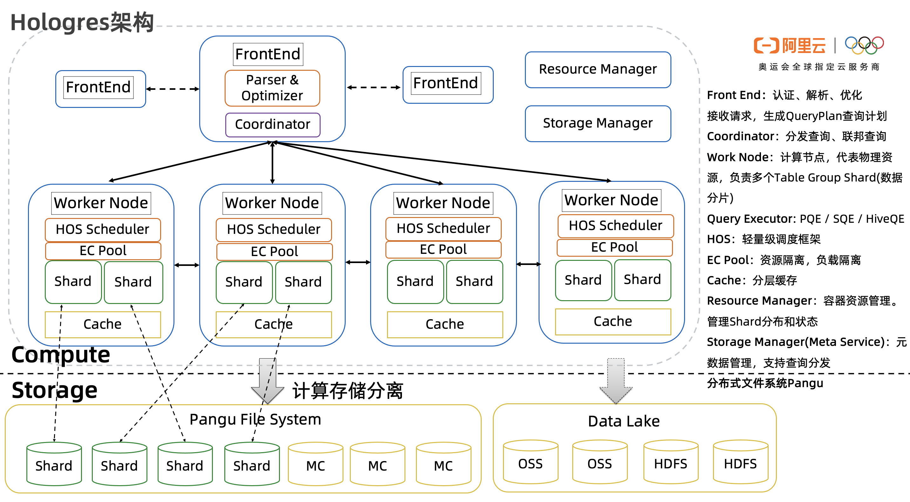

## 大数据查询分析 - 下一代OLAP
------------------------------------------------------------

### OLAP走向何方

Doris=Mesa的存储引擎+Impala查询引擎的开源实现

Clickhouse=

Hologres=混合查询引擎+自研存储引擎(AliORC) on Pangu

小米、美团、好未来、作业帮、猿辅导

米哈游、得物、壹药网、云学堂

### I.分布式OLAP的核心思路

#### 标准要求

1. Atomic Updates. 原子更新。
一个用户的动作，比如一个点击行为，会被影响成百上千的视图的指标，比如影响推广计划、分网站、创意等等一系列具体报表，这个点击行为要么全部生效，要么全不生效，不能存在中间状态。
 
2. Consistency and Correctness. 一致性和正确性。
强一致性必须保证，可重复读，即使是跨DC也需要保证读出来的一致，这么高的要求和广告系统的严谨性有直接关系。
 
3. Availability. 高可用。
不能存在单点（SPOF），不能停服（downtime）。
支持可容错性
 
4. Near RealTime Update Throughput. 近实时的高吞吐更新。
系统要支持增量实时更新，吞吐要达到百万行/秒。增量在分钟级即可被查询到的queryability，这么高的要求和广告系统角度来说很必要，每秒钟Google都会有百万级别的广告展现，而广告主或者系统的其他模块需要更短的时间看到报表，辅助决策。
 
5. Query Performance. 高性能查询。
系统既要支持低延迟的用户报表查询请求，也要支持高吞吐的Ad-hoc即席分析查询。低延迟要保证99分位平响在百毫秒。
 
6. Scalability. 高扩展。
随着数据量和访问量增量，系统的能力可线性（linear）的增长。
 
7. Online Data and Metadata Transformation. 在线的schema变更。
业务不断变化，对于schema的变更，包括加表、删表、加列、减列，新建索引，修改物化视图等的都必须不能停服的在线完成，而且不能影响数据更新和查询。

#### 标准设计组件

**Query Engine**
-Compiler
-Optimizer
-Runtime(query execution) 

**Storage Engine**

**分布式查询(exchange opertor)**

分治策略/MVCC机制

### II.Doris的前世今生

Mesa is a distributed, replicated, and highly available data processing, storage, and query system for structured data. Mesa ingests data generated by upstream services, aggregates and persists the data internally, and serves the data via user queries.

Mesa的存储是多副本的并且分区做sharding的，很好理解，分治策略几乎是分布式系统的必备元素。批量更新，包括大批量，小批量（mini-batch）。使用MVCC机制，每个更新都有个version。为实现跨DC工作，还需要一个分布式一致性技术支持，例如Paxos。

### III.Clickhouse有特色的"伪"大数据系统

- Compiler， Optimizer， Runtime(query execution) 
- Storage有时候也要看一下Catalog，或者叫Metadata service

正规的数据库产品里，Compiler一般是Parse, Syntax check, Binding, Semantic check.
Parse会用Parser generator比如说YACC或者ANTLR来通过文法产生，得到一棵AST(Abstract Syntax Tree），之后的Syntax check检查语法，Binding解决每个词到底是什么，是column name， table name 还是function name等等。Semantic Check会做语义检查，最后AST被转化成Logical Operator Tree。

Clickhouse的compiler诡异。Parser是手写的，Parser干了很多活，后面接一个Interpreter。后者干了一半Compiler一半Optimizer的活。

Optimizer没有。。。

Runtime是亮点, Vectorwise的做法.但抄得很特别。

如何实现分布式查询: 它的存储层是通过IStorage这个接口来做的。所以它搞了一个Distributed Table.类似于在不同节点上的单机Table的一个UNION ALL。Aggregte做push down，采用local aggregate和global aggregate两层。

专业的分布式系统，在数据库里面是通过exchange opertor来实现对数据的shuffle的，这需要从optimizer到runtime都有支持。没有exchange operator，不能够做data shuffling的东西，就没资格自称是大数据系统。

Clickhouse的replication也很扯淡。Replication的办法是建立一张新的表，名字完全不一样，然后和老的表共享同一个ZooKeeper的path。这样你们两张表以后就同生共死，是兄弟了。对我的操作一定会复制给你，对你的操作也反之亦然。问题是，我如果是个新用户的话，我鬼知道原来李逵就是李鬼，李鬼也是李逵。

### IV.HSAP:面向云端的混合分析引擎

HSAP: A Cloud-Native Service for Hybrid Serving/Analytical Processing

#### 1.需求与思考

融合分析处理与在线服务:Fusion of Analytical Processing and Serving.

融合在线分析与离线分析:Fusion of Online and Offline Analysis.

存在大数据解决方案能够混合支持通常在不同系统内的在线服务与分析处理的负载
Existing big data solutions usually host the hybrid serving and analytical processing workloads using a combination of different systems

_HSAP(hybrid serving/analytical processing) challenge_
	
	- High-Concurrency Hybrid Query Workload:混合负载(在线服务&实时OLAP)是完全动态变化的,以应对突然的暴增。系统要求弹性且可扩展能力.处理查询负载远高于传统OLAP系统
	- High-Throughput Real-Time Data Ingestion:在处理高并发查询负载的同时,此系统依然需要保持高吞吐的实时数据写入能力。实时数据写入能力在秒级上下是为了实现实时在线服务与分析任务。
	- High Elasticity and Scalability: 极致弹性伸缩
	

#### 2.System Design系统设计

_系统架构概览_

- Front End：认证、解析、优化接收请求，生成QueryPlan查询计划
- Coordinator：分发查询、联邦查询
- Work Node：计算节点，代表物理资源，负责多个Table Group Shard(数据分片)
- Query Executor: PQE / SQE / HiveQE
- HOS：轻量级调度框架
- EC Pool：资源隔离，负载隔离
- Cache：分层缓存
- Resource Manager：容器资源管理。管理Shard分布和状态
- Storage Manager(Meta Service)：元数据管理，支持查询分发
- 分布式文件系统Pangu：快速的分布式存储

#### 3.核心技术解析

4.2.数据存储: 存储引擎设计Storage Design

存算分离(Decoupling of Storage/Computation)

计算和存储彻底分离成功解决了计算节点成为系统吞吐量瓶颈的问题

面向切片的数据分层

读写分离(Separation of Reads/Writes)
--同时支持高并发的读与高吞吐的写操作
where records in the tablet im- age are properly versioned. Fresh writes can be immediately visible for reads with subsecond-level latency. Concurrent reads can re- quest a specific version of the tablet image, and thus are not blocked by the writes.

tablet 则是分布式调度和存储的最小单元。

4.3.并行查询执行引擎

执行上下文调度机制

HOS

自定义调度策略

#### 5.存储引擎

5.1.数据模型

5.2.TableGroupShard分片

5.3.行存切片(最小单元)

5.4.列存切片(最小单元)

5.4.Cache架构

#### 6.查询流程与调度

高并行查询执行引擎

执行上下文

调度机制

负载均衡

智能调度策略
A critical challenge for HOS is to guarantee the query-level SLO in multi-tenant scenarios

#### HSAP典型场景&最佳实践

HSAP on recommendation services 

#### 7.其他

* 测试与评估

Hologres adopts a novel tablet-based storage design, an execution context-based scheduling mechanism, as well as a clear decoupling of storage/computation and reads/writes. This enables Hologres to deliver high-throughput real-time data ingestion and superior query performance for mixed serving and analytical processing. 

### V.New OLAP Engine Comparison

Doris | ClickHouse | Hologres

### X.Monarch

- [Monarch谷歌的全球级内存时序数据库](https://mp.weixin.qq.com/s/JUxZGF0q69HcF1uCit9TYw)

