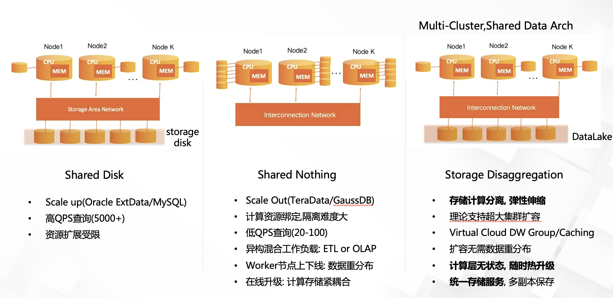
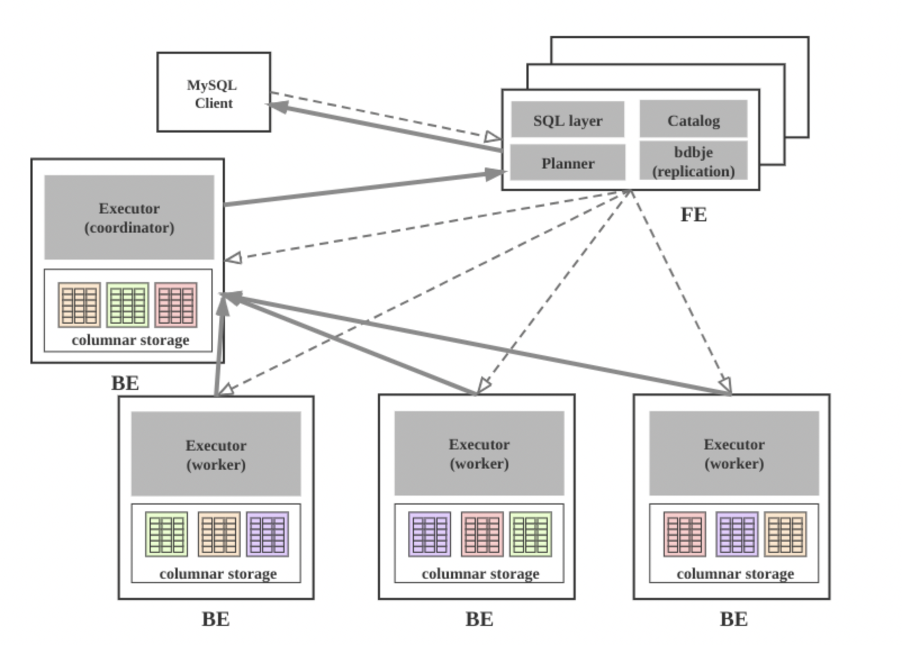
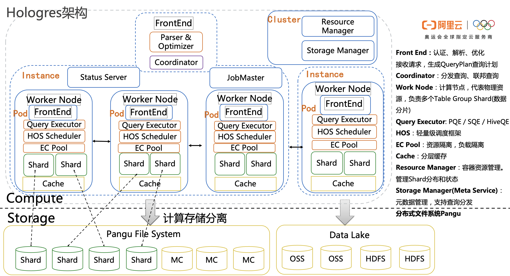

## 大数据研究 - 下一代OLAP引擎产品研究
------------------------------------------------------------

### I.典型OLAP产品背景

### 1.1.OLAP场景的关键特征

- 大多数是读请求
- 数据总是以相当大的批次(> 1000 rows)进行写入
- 不修改已添加的数据
- 每次查询都从数据库中读取大量的行，但是同时又仅需要少量的列 宽表，即每个表包含着大量的列
- 较少的查询(通常每台服务器每秒数百个查询或更少)
- 对于简单查询，允许延迟大约50毫秒
- 列中的数据相对较小: 数字和短字符串(例如，每个URL 60个字节) 处理单个查询时需要高吞吐量(每个服务器每秒高达数十亿行)
- 事务不是必须的
- 对数据一致性要求低
- 每一个查询除了一个大表外都很小 查询结果明显小于源数据，换句话说，数据被过滤或聚合后能够被盛放在单台服务器的内存中

**典型应用场景**

- 复杂实时SQL查询分析(关联查询/嵌套查询/Rollup Query/Windows Function/存储过程等)
- 海量数据统计查询(UV/PV统计/宽表查询分析/用户行为分析)
- 关键字检索查询/模糊查询
- 实时人群筛选/实时搜索推荐/算法策略计算

### 1.2.分布式OLAP的核心思路

**Bigdata OLAP Product= Cube + OLAP(QueryParser+QueryOptimizer+QueryEngine+StorageEngine) + Storage System(HDFS/GFS/S3)**


| OLAP     | Type    | Link                                                       | Desc                        |
| -------- | ------- | ---------------------------------------------------------- | --------------------------- |
| Greenplum | ROLAP   | | 分布式MPP数据库               |
| Impala   | BQ-OLAP | https://github.com/cloudera/Impala/wiki                    | 交互式SQLonHadoop(容错性差) |
| PrestoDB | BQ-OLAP | https://prestodb.io/                                       | 交互式SQLonHadoop           |
| Dremel   | BQ-OLAP |                                                            | 交互式大数据分析引擎            |
| Druid    | RT-OLAP | http://druid.io/                                           | 增量计算&搜索引擎           |
| Pinot    | RT-OLAP | https://github.com/linkedin/pinot                          | 增量计算                    |
| Kylin    | MOLAP   | http://kylin.apache.org/                                   | 预处理&Cache                |

* OLAP类型:ROLAP/BigQuery-OLAP/RT-OLAP/MOLAP,其中Kylin是一种针对大数据场景设计的特殊MOLAP
* 当前OLAP技术领域有大数据量分析需求,不包含查询引擎与数据存储优化的轻量级方案(Mondrian)应用场景受限
* 越来越多关注查询本身而不是过多关注Cube/Dimension/Measure等传统数据仓库所遵循的通用标准,这样才能更加适应当前大数据领域的现实需求
* Tableau作为优秀可视化分析工具对大数据量分析能力有所欠缺

		Comments: 分布式大数据分析走向云计算架构,将逐步成为主流。

### 1.3.OLAP核心产品要求

*1. Atomic Updates. 原子更新。*
一个用户的动作，比如一个点击行为，会被影响成百上千的视图的指标，比如影响推广计划、分网站、创意等等一系列具体报表，这个点击行为要么全部生效，要么全不生效，不能存在中间状态。

*2. Consistency and Correctness. 一致性和正确性。*
强一致性必须保证，可重复读，即使是跨DC也需要保证读出来的一致，这么高的要求和广告系统的严谨性有直接关系。

*3. Availability. 高可用。*
不能存在单点（SPOF），不能停服（downtime）。支持可容错性

*4. Near RealTime Update Throughput. 近实时的高吞吐更新。*
系统要支持增量实时更新，吞吐要达到百万行/秒。增量在分钟级即可被查询到的queryability，这么高的要求和广告系统角度来说很必要，每秒钟Google都会有百万级别的广告展现，而广告主或者系统的其他模块需要更短的时间看到报表，辅助决策。

*5. Query Performance. 高性能查询。*
系统既要支持低延迟的用户报表查询请求，也要支持高吞吐的Ad-hoc即席分析查询。低延迟要保证99分位平响在百毫秒。

*6. Scalability. 高扩展。*
随着数据量和访问量增量，系统的能力可线性（linear）的增长。

*7. Online Data and Metadata Transformation. 在线的schema变更。*
业务不断变化，对于schema的变更，包括加表、删表、加列、减列，新建索引，修改物化视图等的都必须不能停服的在线完成，而且不能影响数据更新和查询。

*8. Distributed ACID. 分布式ACID*
分布式数据一致性的核心算法。Spanner-TrueTime实现

**标准OLAP产品组件分类**

_A. Query Engine_

    -Compiler
    -Optimizer
    -Runtime(Query Execution) 

_B. Storage Engine_

    - LSM结构优化-RockDB
    - 存储数据格式

_C. 分布式查询(exchange opertor)_

    分治策略/MVCC机制
    网络数据交换

_D. 多维Cube引擎 - [Mondrian](http://mondrian.pentaho.com/documentation/architecture.php)_

[Mondriad-ROLAP分析](2017-01-31-olap-mondrian-note.md)

	Comments:NewBI是基于Mondrain框架搭建的OLAP查询引擎。其特点:多维数据建模+无内置查询引擎


### II.通用MPP并行计算平台技术

MPP并行计算平台用于存储管理信息数据并形成数据仓库，支持数据分析挖掘。主要技术特点有：

    （1）	使用Shared-Nothing架构；
    （2）	数据分布式存储(本地化)并行加载；
    （3）	分布式并行计算，支持动态横向扩展；
    （4）	支持行式和列式存储、支持数据压缩；
    （5）	支持SQL优化技术、SQL查询及大表关联查询；
    （6）	支持粗粒度数据索引技术。

### 2.1.MPP并行计算平台功能

**MPP(Massively Parallel Processing)**，即大规模并行处理，在非共享集群中，每个节点都有独立的磁盘存储系统和内存系统，业务数据根据数据库模型和应用特点划分到各个节点上，每台数据节点通过专用网络或者商业通用网络互相连接，彼此协同计算，作为整体提供数据库服务。非共享数据库集群有完全的可伸缩性、高可用、高性能、优秀的性价比、资源共享等优势。简单来说，MPP是将任务并行的分散到多个服务器和节点上，在每个节点计算完成后，将各自部分的结果汇总在一起得到最终的结果。
基于Map-Reduce模式的Hadoop擅长数据批处理，不是特别符合即时查询的场景。而业界当前做大数据实时查询一般都采用MPP架构，即大规模并行处理系统。数据库架构设计中，目前主要有Shared Everthing、和Shared Storage、Shared Nothing这三种主流架构。

**Shard分片**
A database shard is a horizontal partition(水平分区) of data in a database. Each individual partition is referred to as a shard or database shard. Each shard is held on a separete database server instance,to spread load.

做shard的三个原则
-尽可能大部分的业务逻辑都是根据分布键/均衡字段,至少百分之80%,更改分布式数据库中的均衡字段非常麻烦,必须一开始就规划号表的均衡字段
-如果不能选择有效的均衡字段,这张表就不要进行Shard,作为全局表
-如果业务选择不出有效率的均衡字段,那么进行分布式数据库的改造也将是徒劳的

tips：shard一般用hash打散,平均的,如果没有打散就是均衡字段没选好,可以选择用多个字段作均衡字段

**执行调度器**

执行调度器主要职责是接收SQL请求，生成执行计划，汇聚最终结果。执行调度器组件是SQL的统一入口，对外接收客户端SQL语句，生成分布式执行计划，下发计划片段到各执行节点，各执行节点返回执行结果到执行协调器，执行协调器汇总处理后，返回给客户端。

**SQL优化/执行**

支持多种优化策略，包括以下内容：
(1) 基于代价的执行计划优化(CBO, Cost-Based Optimizer)；
(2) 基于规则的执行计划优化(RBO, Rule-Based Optimizer)；
(3) 基于物化视图的执行计划优化(MBO, Materialize-Based Optimizer)；
(4) SQL过程间优化(ISO, Inter-SQL-Optimization)

**压缩技术**

数据压缩是指在不丢失信息的前提下，缩减数据量以减少存储空间，提高传输、存储和处理效率的一种技术方法。或者是按照一定的算法对数据进行重新组织，减少数据的冗余和存储的空间。数据压缩的主要目的还是减少数据传输或者转移过程中的数据量。

**动态扩展**

全并行的MPP+Shared Nothing的分布式扁平架构，这种架构中的每一个节点都是独立的、自给的、节点之间对等，而且整个系统中不存在单点瓶颈，具有非常强的扩展性。系统随着数据量的增加，会动态利用MPP集群下所有节点上的资源能力，按照Hash散列等规则在节点间自动进行数据均衡分布，实现数据处理的负载均衡，所以可以保证随节点数的增加，MPP集群的处理并行度会动态增加，从而保证集群处理能力的线性提升。

**行/列存储**

行存储法是将各行放入连续的物理位置，然后由数据库引擎根据每个查询提取需要的列。基于行的存储是将数据组织成多个行，这样就能在一个操作中找到所有的列。这种做法的缺点是必须每次处理一整行，而不是只处理自己需要的列。不过，这样在处理相同实体的两个或多个列的查询时能够取得更快的速度，而且可以提高更新、插入和删除操作的速度。

列存储法是将数据按照列存储到数据库中。这样做的优点是针对某个列中的值进行简单查询的速度非常快，需要的内部存储资源最少。对某个列中特定值的搜索可以直接进入该列的存储区，而不需要扫描整行的数据。这样也使得数据压缩变得更容易，因为一个列中的数据通常具有相同的数据类型。这种体系结构在处理数据仓库使用的海量数据时没有问题，但不适合需要进行大量以行的方式进行访问和更新操作的联机事物处理。

**粗粒度索引**

与传统数据库索引技术相比，粗粒度索引建立在数据包（粗粒度）上，并且每个字段均自动建有索引，而传统索引建立在每行数据（细粒度）上，因此访问智能索引要比访问传统索引需要更少的I/O（几万分之一）。同时，粗粒度索引所占空间大约是数据的百分之一，而传统数据库索引则要占到数据的20-50%。粗粒度索引具有如下特点： 

	- 1）表中的所有列自动建立。不需用户手工建立和维护。
	- 2）索引本身占空间很少，扩展性很好，建立索引后无膨胀。
	- 3）建立索引的速度快，后续的数据包建立索引的速度不会受到前面数据包的影响。

**并行数据加载BulkLoad**

MPP并行计算平台在节点内采用SMP并行架构，在节点间采用MPP并行架构。在集群的单个节点内，对数据库常用算子，如扫描、关联、排序、聚合的步骤之间，利用现代计算机的多核计算理论，采用流水线方式，实现了高度并行的计算能力。在集群范围内，可生成分布式执行计划，通过分布式并行执行引擎，该执行计划可以依据查询类型、数据分布方式、数据规模进行自动评估，产生最佳的查询执行路径，合理利用集群资源，将计算下发到各个数据节点执行，并行利用节点的计算能力。

**资源管理**

通过资源管理特性限定用户SQL的执行优先级，可以控制单用户的计算资源和IO资源，避免过度消耗，和用户使用的磁盘工作空间和配额，避免单一用户占用较多资源。
支持系统在线扩容，实现在线扩容期间业务不中断。
支持数据库版本间平滑升级，升级过程无需数据迁移。根据版本间的差异自动选择小版本升级和大版本升级，并且能够通过图形化界面进行升级。

    Tips:多任务下混合负载是分布式OLAP常见问题之一

**_Greenplum_ = Master + Slaver(分布式PG instance)**  --最早的MPP分布式数据库设计

Ref:  [Greenplum Arch Design](2017-02-11-greenplum-arch-design-note.md)

### 2.2.MPP架构和Job Execution架构比较


大数据目前的主流技术架构为MPP（代表为Greenplum、Hologres）和Job Execution（代表为Hadoop、Maxcompute）两种。

**MPP**是从数据库生态向分布式演进而来，在数据库集群中，首先每个节点都有独立的磁盘存储系统和cpu内存系统（share nothing），其次业务数据根据数据库模型和应用特点划分到各个节点上，计算时MPP将任务并行的分散到多个服务器和节点上，计算节点是预拉起服务实例模式，在每个节点上计算完成后，将各自部分的结果汇总在一起得到最终的结果，主要靠**网络shuffle**。

	MPP解决了单个SQL数据库不能存放海量数据的问题，但是也存在一些问题，例如：当节点数达到100左右时，MPP仍会遇到SQLScalability的问题，速度变慢，或者不稳定。Query隔离粒度粗，通常靠快慢队列。Failover代价较大，通常 Query 会失败或需要整体重新运行。

因此MPP架构更适合做交互式数据分析，大规模数据处理的规模、稳定性相对Job Execution弱。当增加或者删除节点的时候，需要的维护工作仍然比较大，集群会遇到数据迁移和重新平衡的问题。此外因为MPP一般用作交互式分析，为了进一步提升响应和并发性能需要依赖内存等硬件加速，通常需要配置大内存和高速 SSD，成本高，存储容量小。

**Job Execution**起源于谷歌老三篇论文的分布式存储、计算和NoSQL等思想，架构上包括分布式资源管理，分布式任务管理（Shared Everything）。资源管理将集群中的存储资源、计算资源横向池化，向任务管理提供存算资源。任务管理将用户的作业，转变成资源可执行的DAG中的stage阶段的分布式进程，每个进程按需申请和使用资源，使用完释放给其他进程使用。任务中如果某个分布式进程失败了,重新启动一个换另外一台机器的资源再跑，通过磁盘shuffle 及reduce阶段合并最后结果。（mpp如果采用传统架构Shared Nothing的话，计算要靠近数据节点，在一个独立的节点上执行，随着规模增大，失败的可能性也增大，如果每次计算都有台带着必须数据的机器存在故障，任务指定到这部分数据失败，其他节点就要等待，而不能换台机器继续跑，同时这个问题也限制了可扩展性）。
Job Execution可以做到非常大的规模；资源管理和任务隔离更灵活，可以按照资源组或按 Query 设置 Job 优先级；而且不依赖数据库的引擎，还可以用代码进行非结构、半结构化数据的计算；架构上分层清晰，开原生态活跃诞生了开放的多种可替换的引擎。最后Job Execution的离线处理对硬件要求低，内存需求不高，通常使用 SATA 盘。
	Job Execution也有一些缺点：例如  一开始架构上对事务支持的放弃，造成再支持数据库OLTP级别的事务比较麻烦，会损害大数据的能力（数据湖deltalake hudi等也在突破这个能力）。

Job Execution的计算模式不适合高并发交互式低延时的分析和流式处理，OLAP查询性能不如MPP， 但是大数据的多引擎中一些查询引擎也采用了MPP的架构，并且通过底层存储共享（Share Storage），解决节点数据隔离的问题。

简而言之，MPP在每台机器上放个数据库，然后把结果通过网络合并。传统数据库的内存管理比较复杂，主要是内外存交互，这样的架构决定了mpp在小数据量的时候，响应时延可以做的比较小，但是在大数据量的时候，并发吞吐量做不上去，因为节点互相独立，因为短板效应，faileover代价较大，通常 Query 会失败或需要整体重新运行。
而Job Execution ，Job没有太多精细的内存管理，统一交给资源管理器把存储、计算资源横向池化，Job按需申请资源，各个stage都可以并发，这样的架构导致并发吞吐量很大，但是总时延高，资源和和数据分布更均衡，failover影响小、稳定。

当集群规模大的时候，用户一般会追求很大的throughput，用mpp那种传统的内存管理，大批量的计算反而会慢，而且更加占资源。所以mpp更适合交互式查询，且两种架构正在互补，MPP和Job Execution各自成为一个统一平台上面向不同场景的查询引擎。

### III. New OLAP Engine Design Thinking

### New OLAP Engine Comparison



Example of New OLAP Engine on Cloud

| Source | OLTP | OLAP | MetaStore | File System | Cloud Services |
| ------ | ---- | ---- | --------- | --------- | :---------: |
| Google | Spanner | Mesa | BigTable/MegaStore | Colossue | BigQuery |
| OpenSource | TiDB | Doris/Clickhouse | HBase/Cassandra | HDFS | E-MapReduce |
| Alibaba | OceanBase/PolarDB | Hologres/ADB | OTS | Pangu | MaxCompute |


- [SQLonHadoop技术分析](2017-07-28-bigdata-research-olap-sqlonhadoop-note.md)
- [Impala](2016-12-12-olap-distributed-impala-research-note.md)
- [PrestoDB](2017-04-03-bigdata-best-practice-distributed-presto-note.md)
- [Google Cloud BigQuery](2019-05-01-bigdata-best-practice-google-tech-solution.md)
- [MaxCompute BigQuery Product](2021-11-07-bigdata-best-practice-maxcompute.md)
- [Hologres BigQuery Product](2021-11-06-bigdata-best-practice-hologres.md)
- Amazon Redshift

### III.OLAP DW Product Intro

### OLAP Product Intro-Clickhouse有特色的"伪"大数据系统

ClickHouse产品能力描述

    ✓ Blazing fast
    ✓ Linearly scalable
    ✓ Feature-rich
    ✓ Hardware efficient
    ✓ Fault-tolerant
    ✓ Highly reliable

   - 列式数据库
   - 数据压缩
   - 数据的磁盘存储
   - 多核并行处理
   - 多服务器分布式处理
   - 支持基础SQL
   - 向量引擎
   - 实时的数据更新
   - 索引
   - 适合在线查询
   - 支持近似计算
   - 支持数据复制和数据完整性
   - 没有完整的事物支持
   - 缺少高频率，低延迟的修改或删除已存在数据的能力
   - 稀疏索引使得ClickHouse不适合通过其键检索单行的点查询

正规的数据库产品里分2部分:

	1) Compiler， Optimizer， Runtime(query execution) 
	2) StorageEngine,包含Catalog，或者叫Metadata service

Compiler一般是Parse, Syntax check, Binding, Semantic check.

	- Parse会用Parser generator比如说YACC或者ANTLR来通过文法产生，得到一棵AST(Abstract Syntax Tree），
	- 之后的Syntax check检查语法，Binding解决每个词到底是什么，是column name， table name 还是function name等等。
	- Semantic Check会做语义检查，最后AST被转化成Logical Operator Tree。

Clickhouse的compiler很特别。Parser是手写的，Parser干了很多活，后面接一个Interpreter。后者干了一半Compiler一半Optimizer的活。

Optimizer没有。。。

Runtime是亮点, 是以Vectorwise的做法.但参考得很特别。

**分布式查询的瓶颈-存储引擎如何设计**

CK的存储层是通过IStorage这个接口来做的。所以它搞了一个Distributed Table.类似于在不同节点上的单机Table的一个UNION ALL。Aggregte做push down，采用local aggregate和global aggregate两层。

**缺少exchange opertor的实现**

专业的分布式系统，在数据库里面是**通过exchange opertor来实现对数据的shuffle的**，这需要从optimizer到runtime都有支持。没有exchange operator，不能够做data shuffling的东西，就没资格自称是大数据系统。

**分布式replication怎么做**

Clickhouse的replication也很扯淡。Replication的办法是建立一张新的表，名字完全不一样，然后和老的表共享同一个ZooKeeper的path。这样你们两张表以后就同生共死，是兄弟了。对我的操作一定会复制给你，对你的操作也反之亦然。问题是，我如果是个新用户的话，我鬼知道原来李逵就是李鬼，李鬼也是李逵。

**主要产品架构**

- Zookeeper存储元数据，存储 on HDFS/本地磁盘，支持压缩
- 单表高速AdHoc查询能力, join多分布式表能力偏弱。--因为缺少分布式exchange opertor。
- 支持读写，只能‘伪’更新
- 擅长百亿数据量下大宽表聚合查询分析。-- UV/PV统计查询


### OLAP Product Intro-Doris源于百度Palo的MPP交互式SQL数据仓库

#### Doris的前世今生

Doris = Mesa的分析引擎+Impala查询引擎的开源优化+ORC

Doris 前身是 Palo ，Palo 是百度自研的基于 MPP 的交互式 SQL 数据仓库，主要用于解决报表和多维分析。它主要集成了 Google Mesa 和 Cloudera Impala 技术。

Palo没有完全照搬Mesa的架构设计的思路，其借助了Hadoop的批量处理能力，但将加工结果导入到了Palo自身存储，专注于联机查询场景，在联机查询部分主要借鉴了Impala技术。同时Palo没有复用已有的分布式文件系统和类BigTable系统，而是设计了独立的分布式存储引擎。虽然数据存储上付出了一定的冗余，但在联机查询的低延迟、高并发两方面都得到了很大的改善。

Palo在事务管理上与Hadoop体系类似，数据更新的原子粒度最小为一个数据加载批次，可以保证多表数据更新的一致性。

整体架构由Frontend和Backend两部分组成，查询编译、查询执行协调器和存储引擎目录管理被集成到Frontend；查询执行器和数据存储被集成到Backend。Frontend负载较轻，通常配置下，几个节点即可满足要求；而Backend作为工作负载节点会大幅扩展到几十至上百节点。数据处理部分与Mesa相同采用了物化Rollup（上卷表）的方式实现预计算。

Ref:[Impala：MPP SQL Engine on Kudu](2016-12-12-olap-distributed-impala-research-note.md)

#### 1.1.Doris产品特性

**分布式架构**
DorisDB采用分布式架构，存储容量和计算能力可近似线性水平扩展。DorisDB集群的规模可扩展到数百节点，支持的数据规模可达到10PB级别。元数据和数据管理采用热备保证高可用， 能够自愈服务来保证数据安全可靠。

**列式存储**
DorisDB中的数据按列存储， 在查询时， 只需访问所需的目标列， 而不必像采用行式存储的传统数据仓库那样读取整行， 因此会有极大的性能提升。另外，由于数据按列组织，DorisDB可以使用压缩效率更高的编码技术对数据进行压缩，提升数据读取效率。并且可以针对某列创建包含范围信息，bitmap索引和bloomfilter的过滤条件，快速过滤不满足查询条件的数据，从而整体提升查询性能。

**标准SQL**
DorisDB支持标准的SQL语法，包括聚合，JOIN，排序，窗口函数，自定义函数等功能，用户可以通过标准的SQL对数据进行灵活的分析运算。 此外，DorisDB还兼容MySQL协议语法

**流批导入**


**智能物化视图**
DorisDB支持智能的物化视图。用户可以通过创建物化视图，预先计算生成预聚合表用于加速聚合类查询请求。 DorisDB的物化视图能够在数据导入时自动完成汇聚，与原始表数据保持一致。并且在查询的时候，用户无需指定物化视图，DorisDB能够自动选择最优的物化视图来满足查询请求。

**数据分区**
DorisDB支持两级分区和动态分区。首先， 第一级分区对数据做Range划分，  用户可以把分区作为管理目标， 动态增删分区。  其次， 为了解决分区内的数据倾斜问题，  对分区做第二级分桶， 对分区内的数据做Hash划分。 这种分区分桶的设计方法， 可以灵活管理用户数据，  比如可以设置分区的存储介质，副本数，分区的生存周期和分桶数量等等。 用户可以利用分区分桶的机制实现冷热数据分离等功能。


#### 1.2.Doris架构



DorisDB集群由FE和BE构成, 可以使用MySQL客户端访问DorisDB集群。

- FE: FE接收MySQL客户端的连接, 解析并执行SQL语句。

管理元数据, 执行SQL DDL命令, 用Catalog记录库, 表, 分区, tablet副本等信息。
FE高可用部署, 使用复制协议选主和主从同步元数据, 所有的元数据修改操作, 由FE leader节点完成, FE follower节点可执行读操作。 元数据的读写满足顺序一致性。  FE的节点数目采用2n+1, 可容忍n个节点故障。  当FE leader故障时, 从现有的follower节点重新选主, 完成故障切换。
FE的SQL layer对用户提交的SQL进行解析, 分析, 改写, 语义分析和关系代数优化, 生产逻辑执行计划。
FE的Planner负责把逻辑计划转化为可分布式执行的物理计划, 分发给一组BE。
FE监督BE, 管理BE的上下线, 根据BE的存活和健康状态, 维持tablet副本的数量。
FE协调数据导入, 保证数据导入的一致性。

- BE: BE管理tablet副本, tablet是table经过分区分桶形成的子表, 采用列式存储。

BE受FE指导, 创建或删除子表。
BE接收FE分发的物理执行计划并指定BE coordinator节点, 在BE coordinator的调度下, 与其他BE worker共同协作完成执行。
BE读本地的列存储引擎获取数据,并通过索引和谓词下沉快速过滤数据。
BE后台执行compact任务, 减少查询时的读放大。
数据导入时, 由FE指定BE coordinator, 将数据以fanout的形式写入到tablet多副本所在的BE上。
其他组件

- 管理平台

Hdfs Broker:  用于从Hdfs中导入数据到DorisDB集群，见数据导入章节。


### OLAP Product Intro-Hologres面向云端的HSAP混合分析引擎

Hologres = 混合查询引擎+自研存储引擎(AliORC) on 自研文件系统Pangu

HSAP-Hologres: A Cloud-Native Service for Hybrid Serving/Analytical Processing



_系统架构概览_

- Front End：认证、解析、优化接收请求，生成QueryPlan查询计划.该执行计划是一个包含了多个可以并行执行的Fragment Instance(分片实例)执行图.
- Coordinator：分发查询、联邦查询.主要负责将FE中产出的Fragment Instances进行处理与分发，最终成为多个Work Unit。
- Work Node：计算节点，代表物理资源，负责多个Table Group Shard(数据分片)
- _Table Group Shard(数据分片):Hologres的数据管理单元。一个TGS包含1个WAL(Write-Ahead Logging, 预写日志系统) Manager和多个Tablet._
- _Query Executor: 混合多种查询执行器- PQE / SQE / HiveQE_
- _HOS：轻量级调度框架_
- _EC Pool：资源隔离，负载隔离_
- Cache：分层缓存
- Resource Manager：容器资源管理。管理Shard分布和状态
- Storage Manager(Meta Service)：元数据管理，支持查询分发
- 分布式文件系统Pangu：快速的分布式存储(优化存储数据格式-AliORC)


### OLAP Product Intro-MOLAP:Kylin

**特点:Cube预处理+多维数据查询(QueryEngine应弱于Impala/Presto)**

#### 1.Kylin架构


- DataSource:Hive
- MapReduce聚合计算
- Spark内存计算
- AggregateTable:HBase
- pre-aggregation预聚合
- 增量CubeSegment/CubeSegmentMerge
- Trie树维度值编码

#### 2.[TechnicalConcepts](http://kylin.apache.org/docs16/gettingstarted/concepts.html)

- Star Schema/Snowflake Schema
- Cube
- DIMENSION & MEASURE
- CUBE ACTIONS

#### 3.表描述

- FactTable
- LookupTable(事实描述表)
- DimensionTable

#### 4.Measure计算 

* Sum
* Count
* Max
* Min
* Average
* Distinct Count(based on HyperLogLog近似值估值)


### OLAP Product Intro-RT(Realtime类搜索)OLAP查询引擎:Druid

Druid是基于MOLAP模型的空间换时间方案。优点在于查询性能的整体提升,缺点在于数据多维分析的局限性

#### 1.Druid特点

**特点:类搜索引擎+增量计算+数据实时写入**

* 整个系统同时提供了对离线数据分析和在线实时数据分析的支持
* 可插拔的查询系统,支持多种存储系统

	- 亚秒响应的交互式查询。支持较高并发，为面向用户的平台提供Olap查询(注意这是相比其他OLAP的强大优势)。
	- 支持实时导入,导入即可被查询。支持高并发导入。
	- 采用分布式shared-nothing的架构，可以扩展到PB级。
	- 支持聚合函数,count和sum,以及使用javascript实现自定义UDF。
	- 支持复杂的Aggregator，近似查询的Aggregator例如HyperLoglog以及Yahoo开源的DataSketches。
	- 支持Groupby,Select,Search查询。(Groupby性能较差,推荐timeseries/TopN)
	- 不支持大表之间的Join，但其lookup功能满足和维度表的Join
	- 列存储,倒排索引,RollUP(汇总/上卷),roaring或conciseBitmap位图索引+LZ4数据压缩

#### 2.Druid架构分析


Druid ingestion specs define this granularity as the queryGranularity of the data. The lowest supported queryGranularity is millisecond.
Druid shards are called **segments** and Druid always first shards data by time. 

Segments contain data stored in compressed column orientations, along with the indexes for those columns. Druid queries only understand how to scan segments.
Following search infrastructure, Druid creates immutable snapshots of data, stored in data structures highly optimized for analytic queries.
Druid is a column store, which means each individual column is stored separately. Druid indexes data on a per-shard (segment) level.
Druid has two means of ingestion, real-time and batch. Real-time ingestion in Druid is best effort.
One common approach to operating Druid is to have a real-time pipeline for recent insights, and a batch pipeline for the accurate copy of the data.
Druid's native query language is JSON over HTTP. Apache Calcite - SQL parser, planner and query engine whose Druid adapter can query data residing in Druid.
Druid is designed to perform single table operations and does not currently support joins. Many production setups do joins at ETL because data must be denormalized before loading into Druid.
Druid is designed to have no single point of failure. Different node types are able to fail without impacting the services of the other node types. 

**A.Storage** 

* Segment:Druid倒排索引+时间分片

	Segments contain the various dimensions and metrics in a data set, stored in a column orientation, as well as the indexes for those columns.
	Segments are stored in a "deep storage" LOB store/file system.
	Druid stores its index in segment files, which are partitioned by time(按时间分片).
	Segment core data structure: three basic column types: the timestamp column, dimension columns, and metric columns.

Sharding Data to Create Segments	

* Dimensions:Bitmap Index

	Dimensions columns are different because they support filter and group-by operations, so each dimension requires the following three data structures:
	1.A dictionary that maps values (which are always treated as strings) to integer IDs,
	2.A list of the column’s values, encoded using the dictionary in 1
	3.For each distinct value in the column, a bitmap that indicates which rows contain that value.

The bitmaps in 3 -- also known as inverted indexes allow for quick filtering operations(specifically, bitmaps are convenient for quickly applying AND and OR operators). 
The list of values in 2 is needed for group by and TopN queries. 

* Multi-value columns

**B.核心模块**

* Broker模块:

route queries to if you want to run a distributed cluster. This node also merges the result sets from all of the individual nodes together. 
Broker nodes employ a cache with a LRU cache invalidation strategy. 
类似分布式搜索引擎中的meta元搜索引擎，他不负责任何Segment的查询，他只是一个代理，从Zookeeper中获取TimeLine，这个 TimeLine记录了intervals->List(Server)的mapping关系，接收到Client的请求以后，按照时间段在TimeLine查找Segment分布在那些 Server上。

* Coordinator模块:

responsible for loading new segments, dropping outdated segments, managing segment replication, and balancing segment load.
负责协调Segment的均衡分发加载，Coordinator从meta数据存储mysql/postgreSQL中获取那些还未被加载的Segment，根据当前所有Historical的负载能力均衡地分配到其LoadQueue。

* Historical模块:

从Deep Storage中下载Segment,采用mmap(内存映射)的方式加载Segment,并负责来自broker对这些Segment的查询.
Historical nodes do not communicate directly with each other or with the coordinator nodes but instead rely on Zookeeper for coordination. 

* Indexing Service模块:

The indexing service is a highly-available, distributed service that runs indexing related tasks.Indexing service tasks create (and sometimes destroy) Druid segments.
The indexing service is composed of three main components: a peon component that can run a single task, a Middle Manager component that manages peons, and an overlord component that manages task distribution to middle managers.
Druid的索引结构布局由字典，正排(列存储)以及倒排索引组成，其中倒排的PostingList采用压缩LZ4的BitMap位图索引。支持Consice和Roaring两种BitMap方式

* Realtime process模块:

Realtime nodes will periodically build segments representing the data they’ve collected over some span of time and transfer these segments off to Historical nodes.

> Realtime Node负责提供实时数据索引，生成realtime Index(Segment),并定期推送到Historical Node。在Realtime中采用LSM-Tree的模型


**C.外部模块**

- Zookeeper: discovery and maintenance of current data topology
	Zookeeper maintains information about Historical and Realtime nodes and the segments they are serving. 
- Metadata Storage: MySQL and PostgreSQL are popular metadata stores for production.
	Segments Table/ Rule Table/ Config Table/ Task-related Tables/ Audit Table
- Deep Storage: HDFS or Kudu 

#### 3.详细设计

_3.1.Quering_

GroupBy is the most flexible Druid query, but also has the poorest performance. Timeseries are significantly faster than groupBy queries for aggregations that don't require grouping over dimensions. For grouping and sorting over a single dimension, topN queries are much more optimized than groupBys.

_3.2.TopN queries_

Conceptually, TopN queries can be thought of as an approximate GroupByQuery over a single dimension with an Ordering spec. 
TopNs are approximate in that each node will rank their top K results and only return those top K results to the broker. 

_3.3.groupBy Queries_

("queryType": "groupBy")

"v1", the default, generates per-segment results on data nodes (historical, realtime, middleManager) using a map which is partially on-heap (dimension keys and the map itself) and partially off-heap (the aggregated values). 
"v2" (experimental) is designed to offer better performance and memory management. This strategy generates per-segment results using a fully off-heap map.
时间维度分析-Timeseries query will generally be faster than groupBy. 
For queries with a single "dimensions" element (i.e. grouping by one string dimension), the TopN query will sometimes be faster than groupBy. 

_3.4.Nested groupBys_

_3.5.Time Boundary Queries_

_3.6.Search Queries(搜索查询功能)_

A search query returns dimension values that match the search specification.(DimensionMember查询)

_3.7.Select Queries_

Select queries return raw Druid rows and support pagination.

_3.8.druid-lookup与join联接_

Lookup is an experimental feature.
Lookups are a concept in Druid where dimension values are (optionally) replaced with new values.(内存计算探测)
It is worth noting that lookups support use cases where keys map to unique values (injective)
Joins
Druid has limited support for joins through query-time lookups. The common use case of query-time lookups is to replace one dimension value (e.g. a String ID) with another value (e.g. a human-readable String value). This is similar to a star-schema join.
A join query is essentially the merging of two or more streams of data based on a shared set of keys. The primary high-level strategies for join queries we are aware of are a hash-based strategy or a sorted-merge strategy.

#### 4.Components

_4.1.Datasources - Table_

A data source is the Druid equivalent of a database table. However, a query can also masquerade as a data source, providing subquery-like functionality. Query data sources are currently supported only by GroupBy queries.
Table Data Source
Union Data Source
Query Data Source

_4.2.Query Filters_

A filter is a JSON object indicating which rows of data should be included in the computation for a query. It’s essentially the equivalent of the WHERE clause in SQL. 

- Selector filter
- Regular expression filter
- Logical expression filter (AND/OR/NOT)
- Javascript filter
- Search filter
- In filter
- Bound filter
- Interval filter
- Filter with Extraction Functions

_4.3.Aggregations_

Aggregations can be provided at ingestion time as part of the ingestion spec as a way of summarizing data before it enters Druid.(数据预处理)
Aggregations can also be specified as part of many queries at query time.

- Count Aggregator
- Sum Aggregators
- Min/Max Aggregators
- Javascript Aggregators
- Cardinality aggregator 粒度聚合
- HyperUnique aggregator
- Filter Aggregator

_4.4.Post-Aggregations_

Post-aggregations are specifications of processing that should happen on aggregated values as they come out of Druid. If you include a post aggregation as part of a query, make sure to include all aggregators the post-aggregator requires.

#### 5.Druid Adapter & SQL Parser

Full SQL is currently not supported with Druid. (当前SQL支持无法与Druid原生查询语言一样灵活)
[Calcite’s Druid adapter](https://calcite.apache.org/docs/druid_adapter.html) allows you to query the data using SQL, combining it with data in other Calcite schemas.

#### 6.Multitenancy Consideration

Multitenant workloads can either use a separate datasource for each tenant, or can share one or more datasources between tenants using a "tenant_id" dimension. When deciding which path to go down, consider that each path has pros and cons.
Shared datasources or datasource-per-tenant
Druid offical compromise is to use more than one datasource, but a smaller number than tenants. 
Partitioning shared datasources
Customizing data distribution
Supporting high query concurrency
Druid's fundamental unit of computation is a segment. Nodes scan segments in parallel and a given node can scan druid.processing.numThreads concurrently. 
Druid internally stores requests to scan segments in a priority queue.

#### 7.Query Caching

Druid supports query result caching through an LRU cache. Results are stored on a per segment basis, along with the parameters of a given query. 

#### 8.Sorting Order

These sorting orders are used by the TopNMetricSpec, SearchQuery, GroupByQuery's LimitSpec, and BoundFilter.

- Lexicographic
- Alphanumeric
- Numeric
- Strlen
- 不支持具体维度按度量排序功能


### OLAP Product Intro-Pinot(LinkedIn)

[Pinot](http://pinot.incubator.apache.org/) is a realtime distributed OLAP datastore

适合这样的数据分析场景：分析模型固定，数据只追加以及低延迟，以及分析结果可查询。

关键特性：

	- 面向列的数据库，提供多种压缩模式，如运行长度、固定比特长度
	- 可插入式的索引技术，包括可排序索引、Bitmap 索引和反向索引
	- 可根据查询和段元数据对查询和执行进行优化
	- 近乎实时的从 Kafka 获取数据，以及批量从 Hadoop 获取数据
	- 类SQL的语言支持查询、聚合、过滤、分组、排序和去重
	- 支持多值字段
	- 水平伸缩以及容错

### IV. OLAP走向何方 - OLAP on Cloud ?

#### A.云端数据湖仓-存算分离/弹性伸缩

- 分布式存储加速/HDFS缓存
- 智能Caching: Alluxio/存储缓存加速
- 网络架构扩展&RDMA
- [数据湖存算分离技术架构](2020-06-06-bigdata-research-lake-house-solution.md)

_典型云端数据产品_
- Snowflake 云上数仓是否真的能解决当前OLAP查询分析所面临之问题?
- BigQuery on Google Cloud Storage
- AWS Redshift specturm on S3
- MaxCompute/Hologres+DLF+OSS 

#### B.多租户隔离+混合负载&资源隔离

#### C.分布式Transactional事务服务-TrueTime

分布式一致性

#### D.批流一体与离线实时一体

- Lambda+Kappa->批流一体存储
- LakeHouse数据格式
- Flink流批一体

#### E.云端自动系统运维与优化

_大数据容灾备份_

- RPO=0
- RTO=180

#### F.NewOLAPDW存储结构设计

design memory and disk-based column store

Dremel NESTED COLUMNAR STORAGE

内存列式存储优化

LSM数据结构-HDFS/GFS设计差异,定制化文件系统

VolumeScanner、 DirectoryScanner and DiskChecker

共享数据的高可用性

例如:MapR Network File System (NFS)

#### G.非结构数据扩展支持

#### H.实时OLAP+Cube架构优化

	- 多数据源数据接入
	- 逻辑建模与数据预处理(数据Load)
	- 多维数据分析 - 通用Cube模型定义
	- MDX转换SQL解析器
	- QueryEngine
	- 内存计算Spark(RealTime实时计算)
	- 缓存管理器-聚合Cache设计
	- 过滤器管理器
	- Batch历史数据查询
	- 数据排序处理
	- 格式化处理

Calcite -> Spark Catalyst -> Dremel查询优化

数据逻辑层面的模型是Cube,而底下通常来说就是一个star schema或者snowflake schema，很多系统还会实现一些pre-aggregation,例如Kylin.

**ROLAP设计(参考Mondrian)-逻辑数据建模**

- 多维OLAP查询设计(基于抽象逻辑模型的关联查询)
- Aggregation Query聚合查询与非聚合查询
- 表计算/数据透视(计算函数设计-基于当前结果再计算)
- 实时数据(增量)计算(衍生度量/趋势度量)
- 上下文筛选查询(数据查询联动更新)

当前NewBI是基于ROLAP(关系型数据库OLAP抽象),从数据存储角度看非CUBE数据结构存储。因此当我们需要进行深度CUBE分析时,性能较差。

ROLAP优化方式考虑创建索引视图而不创建表,实现逻辑CUBE数据集。NewBI当前RDB中只存在事实表与维表,未保存任何聚合表.

- Mondrian Schema: Cube,Dimension,Hierarchy,Level,Measure。
- Hierarchy Dimension: Level层级的延伸.例如衍生日期维度。ROLAP需要定义日期维表进行日期衍生查询。地理维度扩展可定义为Hierarch yDimension,实现衍生地理维度查询
- CUBE设计:ROLAP需创建索引视图/或联接查询实现逻辑CUBE数据集
- MDX解析器与SQL转换 - Apache Calcite
- 聚合感知(Cache)技术设计。在多维模型设计中,设计正确的聚合表也是很关键的,从适当的聚合表中提取数据。通过物化视图描述聚合 表来提高系统查询性能。
- 数据预加载
- JOIN联接查询影响系统性能(如何减少JOIN联接查询)

**大数据交互式查询OLAP建模设计(参考PrestDB)**

RTOLAP是多维数据组织的OLAP实现,将细节数据和聚合后的数据均保存在cube中，所以以空间换效率，查询时效率高。 

RTOLAP将日期维度信息直接倒排Index进行数据存储,以提高系统查询性能。
- CUBE设计:MOLAP需预先根据Cube定义的事实表以及维度表组合,创建一张宽表。并生成对应的聚合表保存 

- 支持Groupby，Select，Search查询。不支持JOIN联接查询

- 数据结构设计类似ElasticSearch

- 面向Document的数据模型结构

  ```
  message Document {
    required int64 DocId;
    optional group Links {
      repeated int64 Backward;
      repeated int64 Forward; }
    repeated group Name {
      repeated group Language {
        required string Code;
        optional string Country; }
      optional string Url; }}
  ```

**其他:数据处理(数据清洗)智能算法**

智能数据清洗与识别补充缺失值

客户ID-Merge算法/关系图谱 - Graph图计算应用


### X. Ref

- BigDataDB papers - HadoopDB/MegaStore/BigTable/Dynamo/Spanner/Dremel/Mesa
- [Mesa](https://research.google.com/pubs/archive/42851.pdf)
- [Database Architect](2017-07-27-bigdata-research-database-architect.md)
- [TiDB HTAP DB](2019-07-08-newdb-tidb-design-note.md)
- [HashData:MPP数据库动态增减节点](http://hashdata.cn/blog/qian-tan-mppshu-ju-ku-dong-tai-zeng-jian-jie-dian/)
- [Hologres产品最佳实践](2021-11-06-bigdata-best-practice-hologres.md)

Druid
- [http://druid.io/](http://druid.io/) 
- [http://static.druid.io/api/0.9.2/](http://static.druid.io/api/0.9.2/)
- [http://druid.io/docs/0.9.2/design/](http://druid.io/docs/0.9.2/design/)
- [Druid驱动海量实时多维分析](http://gitbook.cn/books/57107c8976dc085d7a00cb04/bookSource/1466138703723.html)
- [Druid:一个用于大数据实时处理的开源分布式系统](http://www.infoq.com/cn/news/2015/04/druid-data)
- [数果科技王劲:如何构建大数据实时多维分析平台](http://gitbook.cn/books/57107c8976dc085d7a00cb04/bookSource/1466741341393.html)

