## 阿里云MaxCompute-SaaS级智能数仓最佳实践
-------------------------------------------------------

### 1.从开源到自研大数据产品思考

“新一代计算引擎”的底层技术主要有三个：MaxCompute(离线计算)、Hologres(交互式分析)、Flink(实时计算)、PAI(人工智能)。在它们之上，是用来统一调度各个技术模块的操作系统：DataWorks。

MaxCompute主要服务于批量结构化数据的存储和计算,可以提供海量数据仓库的离线计算解决方案以及针对大数据的分析建模服务。

#### 开源与自研大数据平台的选择

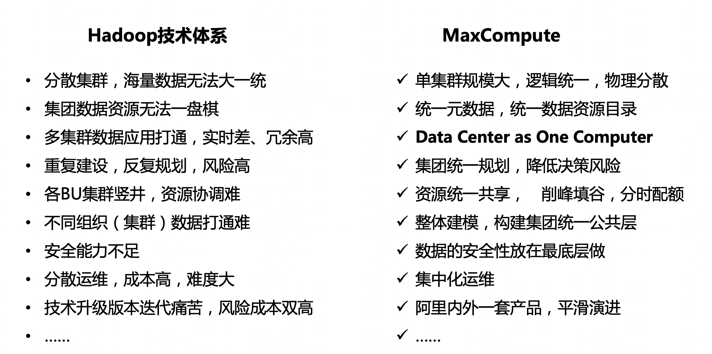

#### 对比开源-MaxCompute核心产品特征

- 大规模计算存储(海量离线计算): MaxCompute 适用于 100GB 以上规模的存储及计算需求，最大可达 EB 级别
- 自研大数据计算引擎: 支持多种计算模型, MaxCompute 支持 SQL、Spark、MapReduce、Graph 等计算类型及 MPI 迭代类算法
- [资源调度]单集群万台物理机计算: 大数据计算平台能力单集群支持10000台物理服务器并行作业
- [资源调度]全局异构计算调度: 全局调度CPU，GPU等异构计算资源 
- [资源调度]全局资源弹性扩容缩容: 支持按照Qutoa细粒度资源扩缩容 
- [资源调度]全局资源安全隔离: 提供网络隔离手段,全局统筹规划云资源的安全访问能力 
- [资源调度]统一EB级数据资源池: 统一数据资源池容量达到1EB  
- [计算调度]大数据系统全局自适应动态优化: 通过自动化的方式管理大数据平台，能参照运行时数据优化平台运营
- [计算调度]全局无缝调度计算任务: 在全局范围内，将大数据计算任务分配给跨地域Region的计算中心协同运行
- [资源调度]全局协同调度数据存储: 在全局范围内, 实现数据分布存储优化
- 大数据高可用：支持大数据集群同城双活 / 异地备份
- 全局统一数据资产管理能力：在全局范围内，对数据开发处理，数据质量等进行统一管理
- 强数据安全：提供多层沙箱防护及监控，支持表和字段级数据安全防护能力

### 2.大数据分析产品架构设计

我们可以看到当前所有的大数据系统架构都如以下9个系统分层。 当前我们主要讨论围绕着 **多种计算引擎能力 / 分布式调度 / 分布式存储 及 安全与隐私保护** 4个核心部分。

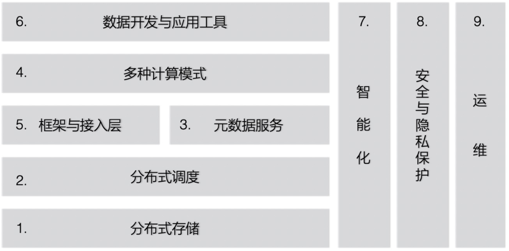

**以下MaxCompute产品详细架构** 

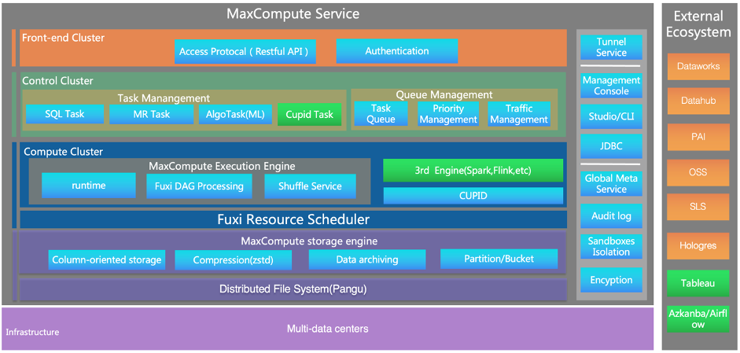

**MaxComputer技术栈分解**

- 计算力
- 平台框架/存储/元数据服务
- 生态能力扩展
- 智能化

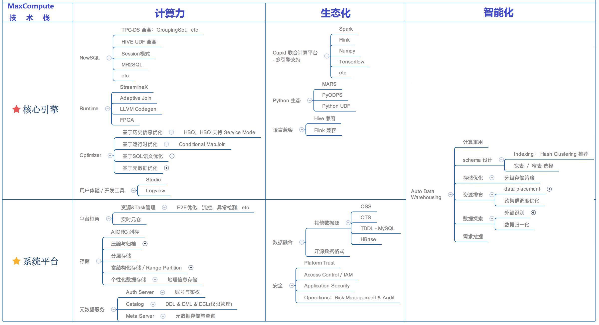

### 3.MaxCompute计算引擎能力

计算引擎在兼容开源体系基础上和存储层在设计，接口，协议上保持保证兼容性和一致性，在性能优化，扩展性，兼容性上完全做到了自主可控。在功能升级时快速高效。计算引擎直接集成高效的数据格式算法及压缩解压SDK及接口，使得在压缩膨胀系数达到1：10甚至更高压缩比的情况下具有较强的数据处理能力。

#### 3.1.SQL引擎/准实时SQL

MaxCompute离线计算提供基于SQL的数据处理模式，支持Java/Python UDF，支持窗口函数等高级数据分析功能, Hive语法兼容，内置函数实现语义更多跟传统关系数据库兼容，对传统关系数据库使用者更友好。
执行效率更高，通用的SQL测试集显示MaxCompute比Hive快2～9倍，主要原因：

	a)采用C++高效实现；
	b)动态即时物理执行代码生成技术（LLVM）。采用代码生成（codegen）的实现方式。在运行时生成较优的机器码，采用列式执行框架，提高CPU流水线的执行效率，并提高缓存命中率，使用SIMD。
	c)基于代价评估的DAG（动态有向无环图）编程模型，比MapReduce模型省IO，性能更好
	d)数据使用列式存储，Colume Based 数据处理加速技术。压缩效果好，对选取部分列的SQL查询，更省IO，性能更好
	提供行列二维表组织存储方式(行式存储or列式存储)。
	e)MaxCompute提供了准实时SQL引擎，中间数据不落磁盘，使用内存和网络进行加速，相对于MaxCompute离线SQL有2～5倍的性能提升。
	f)以DML支持分区动态过滤，有效减少数据量读取，提高计算效率，可使万台规模集群的CPU利用率达到80%-90% （对比开源技术的40%-50%利用率）
	g）MaxCompute 支持 SQL、Spark、MapReduce、Graph 等计算类型及 MPI 迭代类算法
	h)提供Java语言级别和系统级别的应用沙箱

#### 3.2.MaxCompute查询引擎解析

_MaxCompute SQL Parser & SQL Optimizer_

	- 基于Volcano火山模型的CBO
	- Vectorized Execution Engine in MaxCompute 2.0
	- 优化规则
	- 查询优化器CBO&RBO&HBO模型

在编译器方面,基于AST的编译器模型,Visitor模型（Antlrv4），IDE IntelliSense，Warning支持完整的存储过程，LOOP/IFELSE判断等；

_CBO_是基于代价的优化器，它实际上是Volcano模型，可以展开各种可能等价的执行计划，然后依赖数据的统计信息，计算这些等价执行计划的代价，最后从中选用Cost最低的执行计划。

CBO查询优化.支持Join表顺序自动选择、编码列groupby优化、count优化、索引选择、数据延迟加载、数据预排序等优化策略。

分布式场景的优化有别于单机优化。上图是在两张表上进行Join操作的简单案例，假设表T1已经按照a，b进行了分区；表T2按照a进行了分区。如果在单机系统中，分区问题不会出现；在分布式系统中，因为分区的出现可能会产生两个不同的执行计划：第一个执行计划是将T1按照a进行重新分区，之后再和T2进行Join；另一种执行计划是假设T1很大，而T2相对没那么大，此时不对T1重新进行分区，而是将T2数据广播给T1的每个分区。两种执行计划在不同的环境各具优势。

CBO代价模型

	- 由CPU、IO、Row Count、Memory、Network组成的五元 组
	- 每个operator关注于自身的Cost，整个plan的Cost由 引擎累积等到
	- Cost model力求能够反映客观的物理实现
	- Cost model不需要得到和真实一模一样，只需要能够选出较优的plan

_RBO_是基于规则的优化器，在早期的MaxCompute中使用，是一种过时的优化器框架，它只认规则，对数据不敏感。优化是局部贪婪，容易陷入局部优化但全局差的场景，容易受应用规则的顺序而生产迥异的执行计划，往往结果不是最优的。

_HBO_在大流量、高并发场景中，每天都需要处理大量相似的查询，这就给优化器带来了巨大机会。HBO查询优化,基于历史的查询优化策略。可不断自动优化查询资源调用情况。对每天提交的查询进行聚类，把以前运行数据作为Hint来帮助未来的相似的查询上。

_计算引擎查询Archive数据表_

计算引擎层和数据组织层的数据备份有机结合，计算引擎能够直接读取已经ARCHIVE的表数据，充分发挥在⼀个系统中做数据组织及⽣命周期管理的优势。

_Spark_on_MaxCompute最佳实践_

_MaxCompute联合计算引擎平台_

### 4. 分布式资源调度

Fuxi2.0全区域数据排布、去中心化调度、在线离线混合部署、动态计算等方面全方位满足新业务场景下的调度需求

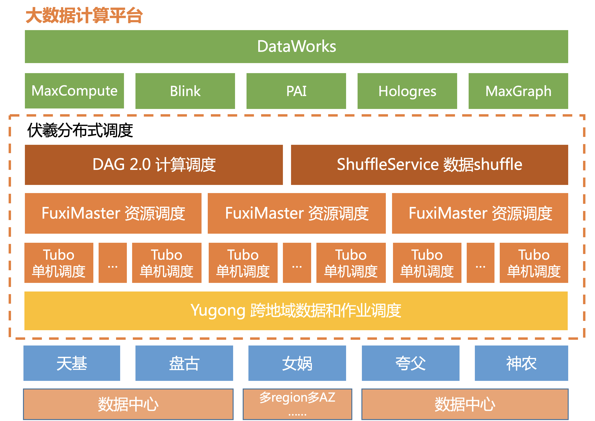

Fuxi2.0将设计目标定位为：一套高性能、分布式的数据、资源、计算调度系统。要解决的调度任务包括：

1. **数据调度** - 由于数据生产和容灾的需要，数据通常是跨地域摆放在不同地区的不同机房。需要优化数据的摆放位置，确定采取什么迁移策略，以及当需要的数据不在本地时，如何进行数据复制和直读、写回，最终实现跨地域长传带宽的流控和整体存储成本的降低。
2. **资源调度** - 集群内的海量硬件资源，如CPU、内存、磁盘、网络、GPU、FPGA等，需要快速地分配给每天上千万的job，几十亿的计算实例。既要满足CPU密集、内存密集、或者某种型号的GPU板卡、数据locality、多租户配额等多种资源约束，同时又要优化集群的资源利用率，削峰填谷、取长补短、降低成本。尤其随着集群规模的急剧扩大，这些问题的解决需要架构上有新的突破。
YARN和Kubernetes成为代表性的开源调度框架。YARN提出的双层调度框架实现了资源管理和调度的分离，满足了中小规模离线作业频繁调度的需求，但在超大规模场景下调度性能存在不足，集群利用率不高，多租户间的资源公平性较差；而Kubernetes是面向容器场景的调度（容器只要一次启动、不需要频繁调度），主要解决容器的编排、管理等问题，更适合任务长时间运行的场景，但在大数据计算高并发作业的场景，没有有效的解决方案。
3. **计算调度** - 每个job抽象成一个DAG（有向无环图），图中的节点有前后依赖关系。随着阿里大数据业务的增长和新计算模型的提出，DAG框架需要更好的动态性，以更灵活的适应数据和资源的变化。此外，计算调度和Shuffle系统需要对不同规模都给出最优的调度效果和执行性能。
4. **单机调度** - 大量的任务实例在物理机器上实际运行时，需要单机上的隔离保护机制，以有效保障不同任务对物理资源的需求，确保高低优先级不要互相影响。同时还需要保护物理机器，避免进入过载状态，保障整机的可用性。

阿里巴巴Fuxi2.0核心优势:

- 业内首创跨地域多数据中心的数据调度方案-Yugong（[VLDB2019](http://www.cse.cuhk.edu.hk/~jcheng/papers/yugong_vldb19.pdf)），通过**3%**的冗余存储，节省**80%**的跨地域网络带宽--跨级群数据缓存策略
- 业内领先的去中心化资源调度架构，单集群支持**数万**服务器***数万**并发job的高频调度
- 动态DAG闯入传统SQL优化盲区，TPC-DS性能提升**20+%\**，conditional join性能提升\**3X**。
- 创新性的数据动态shuffle和全局跨级优化，取代业界磁盘shuffle；线上千万job，整体性能提升**20+%\**，出错率降低\**一个数量级**
- 在线离线规模化混合部署，在线集群利用率由**10%\**提升到\**40%\**，且同时保障在线离线业务稳定。

_内存及网络shuffler服务_
MaxC计算和存储在的深度结合可在计算过程中使用network shuffler，在计算过程中中间数据不落盘，使得内存及网络做shuffler，实现在批量处理系统中的准实时计算技术。传统的基于磁盘文件的shuffle方式，在机械硬盘上有明显的碎片读问题，严重影响性能与稳定性。Spark External Shuffle Service虽然做了一些改进，但是引入了很大的overhead，

 _Fuxi2.0 DAG 调度的挑战_ 
传统的分布式作业 DAG，一般是在作业提交前静态指定的，这种指定方式，使得作 业的运行没有太多动态调整的空间。放在 DAG 的逻辑图与物理图的背景中来说， 这要求分布式系统在运行作业前，必须事先了解作业逻辑和处理数据各种特性，并 能够准确回答作业运行过程，各个节点和连接边的物理特性问题，然而在现实情况 中，许多和运行过程中数据特性相关的问题，都只有个在执行过程中才能被最准确 的获得。静态的 DAG 执行，可能导致选中的是非最优的执行计划，从而导致各种 运行时的效率低下，甚至作业失败。这里我们可以用一个分布式 SQL 中很常见的例子来说明:

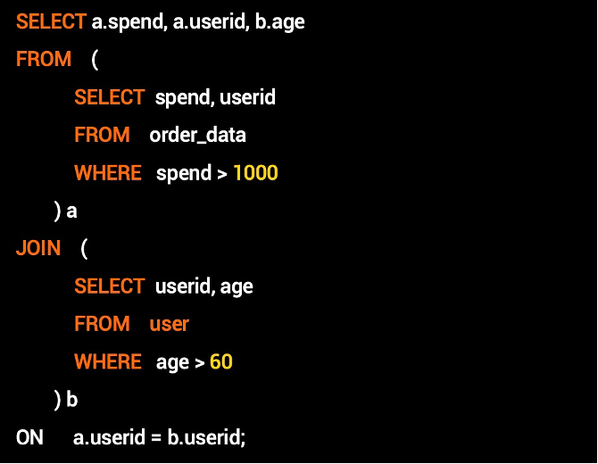

上面是一个简单的 join 的例子，目的是获取 60 岁以上用户花费大于 1000 的详细 信息，由于年纪和花费在两张表中，所以此时需要做一次 join。一般来说 join 有两 种实现方式: 
一是 **Sorted Merge Join**(如下图左侧的所示):也就是对于 a 和 b 两个子句执行 后的数据按照 join key (userid) 进行分区，然后在下游节点按照相同的 key 进行 Merge Join 操作，实现 Merge Join 需要对两张表都要做 shuffle 操作——也就是 进行一次数据交换，特别的如果有数据倾斜(例如某个 userid 对应的交易记录特别多)，这时候 MergeJoin 过程就会出现长尾，影响执行效率; 
二是 **Map join (Hash join)**的方式(如下图右侧所示):上述 sql 中如果 60 岁以 上的用户信息较少，数据可以放到一个计算节点的内存中，那对于这个超小表可 以不做 shuffle，而是直接将其全量数据 broadcast 到每个处理大表的分布式计算 节点上，大表不用进行 shuffle 操作，通过在内存中直接建立 hash 表，完成 join 操作，由此可见 map join 优化能大量减少 (大表) shuffle 同时避免数据倾斜，能 够提升作业性能。但是如果选择了 map join 的优化，执行过程中发现小表数据量 超过了内存限制(大于 60 岁的用户很多)，这个时候 query 执行就会由于 oom 而失败，只能重新执行 

 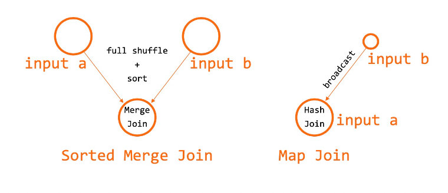

但是在实际执行过程中，具体数据量的大小，需要在上游节点完成后才能被感知， 因此在提交作业前很难准确的判断是否可以采用 Map join 优化，从上图可以看出 在 Map Join 和 Sorted Merge Join 上 DAG 图是两种结构，因此这需要 DAG 调 度在执行过程中具有足够的动态性，能够动态的修改 DAG 图来达到执行效率的最 优。

由于业界大部分 DAG 调度框架都在逻辑图和物理图之间没有清晰的分层，缺少执行过程中的动态性，无法满足多种计算模式的需求。例如 Spark 社区很早提出了运行时调整 Join 策略的需求 (Join: Determine the join strategy (broadcast join or shuffle join) at runtime) ，在Spark3已有输出自适应执行(Adaptive Query Execution)。 
除此上述用户体感明显的场景之外，随着 MaxCompute 计算引擎本身更新换代和 优化器能力的增强，以及 PAI 平台的新功能演进，上层的计算引擎自身能力在不断 的增强。对于 DAG 组件在作业管理，DAG 执行等方面的动态性，灵活性等方面的 需求也日益强烈。 Fuxi启动了 DAG 2.0 的项目，以更好的支撑上层计算需求。 

_DAG 2.0 动态灵活统一的执行框架_ 
DAG 2.0 通过逻辑图和物理图的清晰分层，可扩展的状态机管理，插件式的系统管理，以及基于事件驱动的调度策略等基座设计，实现了对计算平台上多种计算模 式的统一管理，并更好的提供了作业执行过程中在不同层面上的动态调整能力。作业执行的动态性和统一DAG 执行框架是 DAG 2.0 的两个主要特色: 
	Hash Join 
	broadcast 
如前所述，分布式作业执行的许多物理特性相关的问题，在作业运行前是无法被感 知的。例如一个分布式作业在运行前，能够获得的只有原始输入的一些基本特性(数据量等)， 对于一个较深的 DAG 执行而言，这也就意味着只有根节点的物理计划 (并发度选择等) 可能相对合理，而下游的节点和边的物理特性只能通过一些特定的 规则来猜测。这就带来了执行过程中的不确定性，因此，要求一个好的分布式作业执行系统，需要能够根据中间运行结果的特点，来进行执行过程中的动态调整。 

而 DAG/AM 作为分布式作业唯一的中心节点和调度管控节点，是唯一有能力收集并聚合相关数据信息，并基于这些数据特性来做作业执行的动态调整。这包括简单 的物理执行图调整(比如动态的并发度调整)，也包括复杂一点的调整比如对 shuffle 方式和数据编排方式重组。除此以外，数据的不同特点也会带来逻辑执行图 调整的需求:对于逻辑图的动态调整，在分布式作业处理中是一个全新的方向，也 是我们在 DAG 2.0 里面探索的新式解决方案。 

还是以 Map join 优化作为例子，由于 map join 与默认 join 方式(sorted merge join)对应的其实是两种不同优化器执行计划，在 DAG 层面，对应的是两种不同的 逻辑图。DAG 2.0 的动态逻辑图能力很好的支持了这种运行过程中根据中间数据 特性的动态优化，而通过与上层引擎优化器的深度合作，在 2.0 上实现了业界首创 的 conditional join 方案。如同下图展示，在对于join使用的算法无法被事先确定 的时候，分布式调度执行框架可以允许优化提交一个 conditional DAG，这样的 DAG 同时包括使用两种不同 join 的方式对应的不同执行计划支路。在实际执行 时，AM 根据上游产出数据量，动态选择一条支路执行(plan A or plan B)。这样 子的动态逻辑图执行流程，能够保证每次作业运行时，根据实际产生的中间数据特 性，选择最优的执行计划。在这个例子中， 

		- 当 M1 输出的数据量较小时，允许其输出被全量载入下游单个计算节点的内存， DAG 就会选择优化的 map join (plan A)，来避免额外的 shuffle 和排序。 
		- 当 M1 输出的数据量大到一定程度，已经不属于 map join 的适用范围，DAG 就 可以自动选择走 merge join，来保证作业的成功执行。 

同时基于DAG2.0对动态数据的收集，MaxC也优化了shuffle过程，将传统基于磁盘的shuffle优化成，动态根据数据碎片粒度，磁盘io util，网络带宽，mem util等物理资源情况，动态选择最优的shuffe方式，以提升shuffle效率。从而整体提升集群调度效率。

### 5.分布式数据存储

_MaxCompute on Pangu(内部存储) + MaxCompute on OSS(外部存储) 湖仓一体_

#### 5.1.分布式存储系统-Pangu

**1. 数据存储可靠性**

大数据计算服务底层采用分布式文件系统(Pangu)-1.5倍存储，数据存储可达到三副本可靠性。副本能够有效确保数据安全，数据丢失会发⽣在某Object的replica所在的硬盘和机器在replication做完之前都发顺坏，在正常的硬件故障率情况，3份replica通过计算得到持久性数字是11个9，能够充分保障数据不丢，这也是HDFS和其他分布式⽂件系统默认选择3†replica的原因。2副本不到5个9. 

**2. 自研EC技术**
MaxCompute、OSS等飞天产品基于盘古分布式存储之上。盘古支持EC技术，先使用三副本机制，再使用EC，能把存储降到原始数据量的1倍多，不是单副本的三倍。
将冷表用EC的方式存储，热表的3备份中一倍份放到OSS等加速硬件上实现。 从而达到降低集群的存储空间，优化集群IO负载，提升热表查询效率的作用。

#### 5.2.MaxCompute存储引擎

**1. 自动冷热存储分层&Maxcompute TieredStorage**

存储分层: 主要是根据MC元仓中收集表的被访问频次信息，比如最近一周高频访问的表为热表，超过7天为被访问的为冷表。  

**2. 数据存储文件格式优化-AliORC**

- AliORC/支持嵌套树型数据结构
  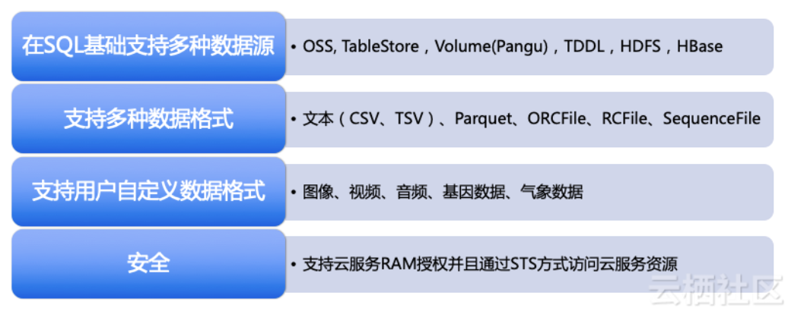

- 数据存储上持采用AliORC文件格式等高效存储压缩算法
  MaxCompute数据存储格式全面升级为AliORC。本文通过TPC-DS测试数据对AliORC、Apache ORC和Apache Parquet进行测试对比，为您提供MaxCompute数据存储性能参照
  --数据集（即24张测试表)测试结果对比数据如下

  

- 支持数据的生命周期管理。
  ODPS本身⽀持较好的列式存储与数据压缩技术，依据数据特点不同压缩比可以达到20:1到3:1，如标准测试集10TB TPCDS数据，在MaxCompute中存放压缩后仅为2.3TB，加上3副本也不到原始数据的三分之一。软件本身已经做了较好的压缩存储，节省存储空间。(AliORC压缩存储算法)

**A. AliORC存储技术优势**

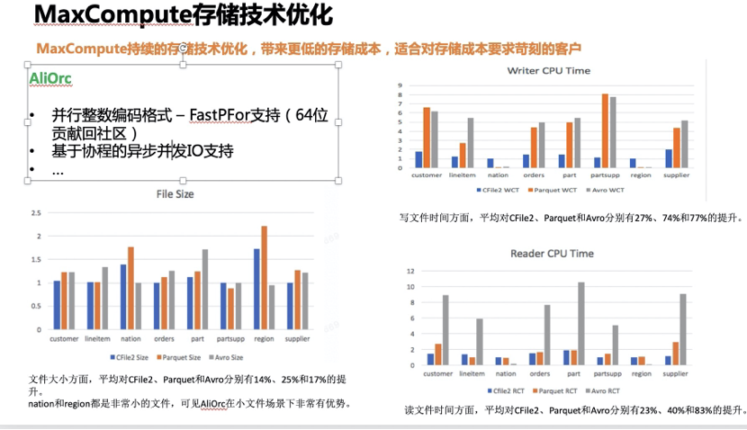

_a.行化编码技术_
如果大家对AliORC的数字编码技术有所了解，应该知道目前AliORC使用了**RLE（Run Length Encoding，游程编码) 编码算法**。RLE是一种非常简单的编码技术，可以比较好的压缩等差数列。例如，以下一个数列:
	0, 2, 4, 6, 8, 10, 12, 14
可以被看成一个run，并编码成为（0, 2, 8），其中0是base number，2是delta，8表示这个run总共有8个数字。这种编码方法虽然简单，但是缺点也是明显的。如果输入数字没有存在等差关系，则编码效率非常差，比如，一个乱序的数列:
	3, 5, 6, 9
编码成为了4个run，(3, 0, 1), (5, 0, 1), (6, 0, 1), (9, 0, 1)，RLE对这种literal可以做一些优化，但编码效果还是不理想，甚至有时候比直接存储的成本还要更高。

此外，RLE编码为了找出来Run，只能对数列顺序处理，且有很多分支判断，并不适合CPU做并行化处理。基于这些考虑，我们在FastPFor的基础上，引入了并行化的数字编码技术。
FastPFor是加拿大教授Daniel Lemire等人提出来的并行化的数字编码技术[4]。这个算法也经历了几个版本的迭代，从FOR，到PFor，再到FastPFor。其核心思想很简单，对于大多数的32位数，都是用不到32个比特，可以把前面的0全部去掉，pack在一起。例如，以下6个32位数，在内存中占用24个字节，但每个数只需要4个位来表示，只需要24个bit存储，这也称之为Bit Packing：

此外，在一个整数系列里面，可能出现一两个特别大的数，这时候我们仍然可以做Bit Packing，只不过需要把这个大的数字作为Exception，区别对待。如下所示：

对比RLE，这个基本的bit packing算法很多情况下可以工作的很好。特别是，在MaxCompute的场景下，很多整形数并不存在等差规律，使用这个算法的效果远远好于RLE。此外，除了第一次需要顺序扫描输入找出来合适的packing bits，接下来的packing，以及后续的unpacking都可以非常方便的并行化执行，充分利用现代CPU的SIMD指令集，大大提升数据编码、解码效率。

在把这个算法运用到MaxCompute当中，我们也做了几方面重要的增强和改进：
	1.	64位支持
			原有的FastPFor实现只支持32位整数编码，这是很大的一个限制。Parquet在使用的时候，会把一个64位数，拆成两个32位进行编码，但这大大影响了算法的效率。我们把整个算法扩展到了64位，并把这个重要改进贡献到了开源社区（超过1万行C++代码）[5]。
	2.	递增、递减数列的支持
			可以看到FastPFor对于随机顺序的数字可以支持得很好，但是，如果数据本身存在规律则没有能很好运用数字的规律进行编码。比如下面这个例子，如果按照传统FastPFor的算法，每个数字我们需要16位。但是，考虑到这是个递增数列，如果我们做一个delta encoding，然后再做bit packing，则压缩效率会高很多

_b.异步化数据读写_
AliORC协程架构的引入，在实现异步化数据读写的同时，也为内部进一步推进异步并行化IO打下了基础。如下图所示，在传统的同步读取逻辑中，AliOrc通过顺序执行的方式分别对文件中的每一个column进行数据读取，由于所有的IO读取操作全都是同步操作，造成了大量的IO等待。

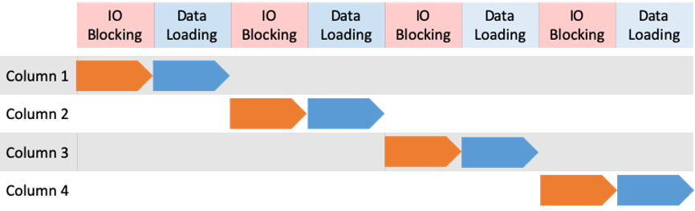

为了解决同步IO等待带来的性能问题，AliOrc1.0引入了异步预读，在读取数据之前提前将所有Column对应的IO请求同时发出，大大降低了IO等待时间。然而AliOrc 1.0的异步预读中，虽然实现了并发IO，Column的数据处理操作仍然是顺序执行的，由于请求数据大小，盘古chunk server IO队列以及网络带宽等种种因素等影响，不同IO请求的等待时间存在非常大的抖动。如下图所示，AliOrc reader 在同一时刻发出了不同column的IO请求，然而Column 4的IO请求要比Column1的IO请求快得多，在这样的情形下，由于数据顺序执行的限制，AliOrc Reader无法及时对Column 4对IO请求进行响应。

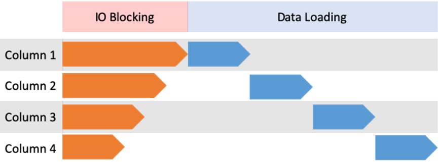

为了解决上述由于顺序执行而引入的IO等待开销，我们需要一个并行化的IO处理机制，其中最直观的解决方案是多线程。然而AliOrc作为一个Columnar 格式，一个AliOrc文件中可能会有上百个Column，每个Column又可能会有三到四个stream，如果每个stream由独立的线程负责IO处理，则读取单个AliOrc文件需要开启上千个线程，这是无法接受的资源消耗。相比于线程，协程在资源占用上要轻量得多，因此协程的引入可以很好地解决上述的问题，数据读取的过程中，AliOrc 为每一个Columnar 内部的stream分配一个协程，所有的数据读取逻辑在协程中执行。IO等待时，协程调度器根据IO返回的先后顺序对ColumnReader进行调度，将顺序执行的Column读取逻辑转换成IO事件驱动的读取逻辑。如下图所示，在同时发出IO请求后，Column 4的IO请求率先返回，于是协程调度器唤醒Column 4对应的ColumnReader，执行相应的数据读取逻辑。其他的Column也分别按照IO请求返回的先后顺序执行数据读取。与前面AliOrc 1.0中的数据读取逻辑相比，IO等待时间被进一步压缩。

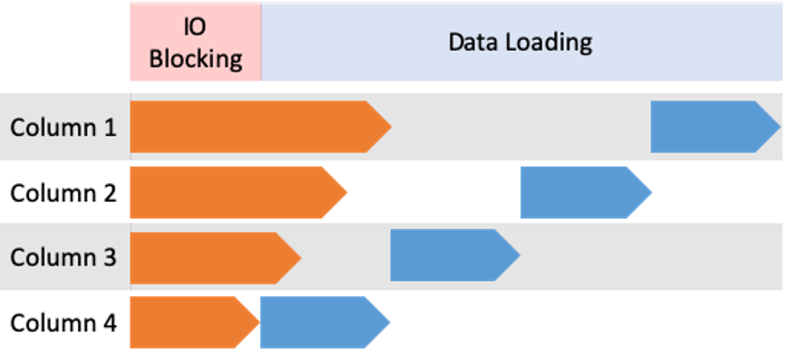

### 6.MaxCompute安全

大数据系统层面安全体系包括系统安全与数据安全等多个维度。

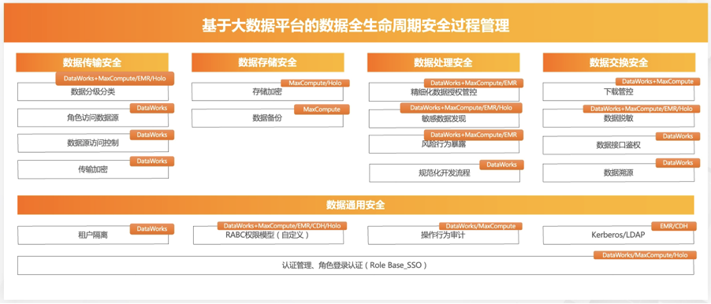

MaxCompute支持多用户共享集群资源，支持基于配额的存储和计算资源管理，同时提供更丰富的多用户协同、数据共享、数据保密等安全特性：

	a)用户访问需要认证，用户操作需要鉴权，提供完整的审计功能；
	b)支持ACL授权、policy授权、角色授权、跨project授权多种权限管理方法，满足多种场景的需求；
	c)同时提供自主访问控制机制（DAC）和强制访问控制机制（MAC）的安全管理方案，满足对于部分敏感数据的管理需求，可以提供精确到列级别的数据管理；
	d)对于安全等级较高的数据，提供项目保护模式，防止数据泄露；
	e)所有计算在受限的沙箱中运行，多层次的应用沙箱、系统沙箱配合请求鉴权管理机制，保证数据的安全；
	f)系统级、Project级和表级的IP访问白名单设置Hadoop在这方面的支持比较弱，仅某些Hadoop发行版的少量组件提供了上述部分安全特性。

### 7.MaxCompute 最佳实践&实操 

**7.1.MaxCompute-数据研发实践(SQL)**

	- 大数据平台MaxCompute/EMR数据规范_cn_zh-CN
	- 大数据数据仓库实践_MaxCompute数仓建设规范管理指南
	- [基于MaxCompute的拉链表设计](
https://developer.aliyun.com/article/542146)
	- [SQL常见命令 SET操作](
https://help.aliyun.com/document_detail/96004.html#section-937-f6z-num)
	- [SQL计算优化](
https://help.aliyun.com/document_detail/100461.html)

**7.2.MaxCompute数据治理&元仓**

高效管理ODPS任务，科学分析所需计算资源
资源抢占问题分析

MC元仓记录内容包括:
	- 谁提交了 什么样的作业（sql）,开始时间结束时间，消耗的CU（cpu mem资源）
	- 记录表的大小，访问时间，更新时间等信息
	- 根据这些信息，我们可以做：
		找出那些最耗资源的作业。
		找出最占磁盘空间的表
		找出频繁访问的热表（用缓存技术加速）
		找出很久不被访问的冷数据表，进行ec格式的进一步压缩，或者删除等

**7.3..Data Modeling & Design-数据模型与设计**

### 8.MaxCompute 生态开放扩展

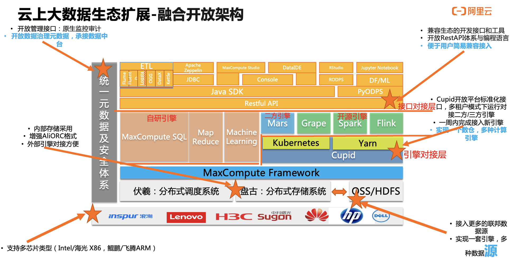

### 9.云上智能数仓发展

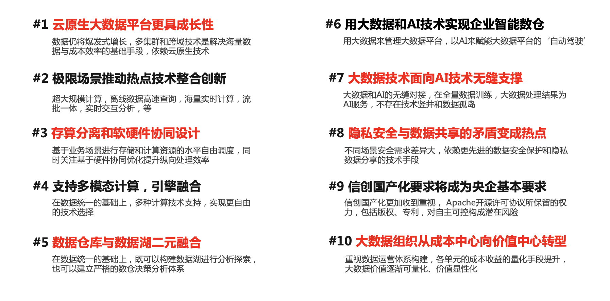

**MaxCompute技术趋势**

_1.新硬件的发展_

计算层面越来越与新硬件的创新紧密结合，硬件会带来平台革命。例如芯片类的CPU(AVX、SIMD)、ARM众核架构、GPU，FPGA，ASIC，存储类的NVM、SSD、SRM，网络类的智能网卡和RDMA等新硬件的发展，新硬件与软件的配合是值得关注的发展方向。

	Comments:硬件提升大数据计算性能提升

_2.非关系型计算领域(图计算)有很多机会_

大数据现在还是在关系型的处理层面，包括流和批都是基于关系型数据的计算，事实上，现在非关系的计算越来越流行了，包括知识图谱、画像等越来越有价值，这些数据组织不是关系型表达，而是以点边的形式用图的方式表达，更符合物理抽象，比如人和货的关系，在风控层面，知识图谱层面，用来描述物理实体的关系更合适。

明年初将会推出MaxCompute的图计算系统MaxGraph，支持图存储、查询、模式匹配和GraphEmbedding等机器学习运算。

	Comments:基于MaxGraph的知识图谱+用户画像模型设计.这些能力应用在哪里?
			 GraphCompute依托于MaxGraph的图数据库

_3.非结构化数据&IoT数据计算将变成大数据的主流_

越来越多的短视频、图片、语音类数据，并随着IoT的发展，可能占据80%的数据量，由于这类数据的特性在于结构各不相同，且数据非常大但是单位价值不高（相比传统结构化数据），如何快速高效的解析和处理非结构化数据，是计算平台的关键挑战。

去年的时候MaxCompute发布了一个非结构化数据处理模块，能够用户自定义的方式处理包括视频音频在内的数据。

	Comments:对非结构化数据处理(视频/音频)的意义在哪里? 视频/音频等内容数据的监测分析,用户的视频镜头偏好
			 针对非结构化数据的向量解析

_4.AI for Everything(also for BigData)_

DBA或将被淘汰？

大数据的特点是大，不仅仅是包括数据的处理规模，还包括了整个的海量数据的管理和优化。传统数据库领域依靠DBA人力去管理的模式将不再适用。

用AI优化数据分布、数据管理、做计算优化和成本优化(例如自动SubQuery合并,智能索引建立等)。“让大数据无人驾驶”，这也是未来的趋势。

	Comments:AI对大数据的影响与互补如何具体落地? 大数据+AI协同工作

### x.Ref

- [MaxCompute Ref](https://yq.aliyun.com/articles/78108)

- [MaxCompute 2.0](https://yq.aliyun.com/articles/656158?spm=a2c4e.11153940.blogcont78108.63.4f88123cEqWDsN)

  Comments:
  1.多个数据仓库产品功能重叠(HybridDB / AnalyticDB / PolarDB / MaxCompute / OceanBase)
  2.缺少全球化的TechWriter,以支持非中国区客户
  3.MaxCompute从大数据技术工具整合阿里数据提供深度数据模型分析服务。数据+技术=数据价值商业呈现(数据变现思考)
  4.超大规模的大数据计算服务(多租户体系)的核心应用场景在哪里?除了阿里和城市大脑。独立的大数据计算平台是不是更适合企业?
  5.MaxCompute面对企业客户如何设置ROI(低成本是如何定义的),如何合理定价来确保MaxCompute成本与收益?
  6.2019年MaxCompute面对的最大问题与挑战是什么? 如何面向国际化?
  7.如何规划与实现MaxCompute的生态圈与合作伙伴?
  8.MaxCompute与Spanner的差距到底在哪里?
  9.华为FusionInsight方案为什么在外媒眼中更加受欢迎?

