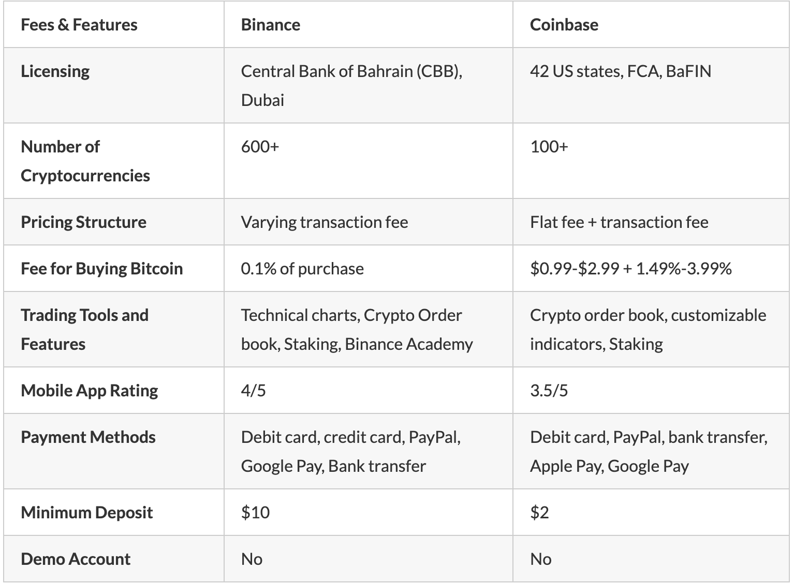

## White Label Crypto Cloud Solution

### 一.客户建立自有Exchange核心诉求

1.法律安全合规支持：通过引进先进技术整合本地资源来获取合规License, 迅速获取市场。

2.拥有加密金融基础设施的关键部分可能是一个很好的长期赛道。值得投入。

3.WLCS可迅速搭建Exchange核心架构与功能：支持交易者与投资者

4.通过自有Exchange来发布自有crptocurrency or 不在链上的交易代币。当前顶级中心化交易所有能力使加密货币或代币发行失败或成功，因为它们控制着行业中的大量权力。这不符合去中心化的原则。

5.避免交易费用

White Label crypto exchange解决方案帮助在加密交易领域的初学者能够迅速建设对应市场之上相关合规业务，避免相关的潜在风险和问题.

### 二. White Label Crypto Cloud Solution产品设计

#### 2.1.产品形态

- 产品输出形态的差异: 核心产品组件灵活组合(半托管) / Servless Cloud Exchange Product(全托管)
- White Label Exchange Type:
		Cloud Centralized Exchange (CCEX) --Binance Cloud/Coinbase Cloud
		Do-it-yourself Centralized Exchanges (DIY CEX)
		Decentralized Exchanges (DEX) 
- Centralized vs Decentralized Cryptocurrency Exchanges
- What is a DEX? Binance Decentralized Exchange
	
		A decentralized exchange (or DEX) is a peer-to-peer marketplace where transactions occur directly between crypto traders. DEXs fulfill one of crypto’s core possibilities: fostering financial transactions that aren’t officiated by banks, brokers, or any other intermediary. Many popular DEXs, like Uniswap and Sushiwap, run on the Ethereum blockchain.

    绕过监管

#### 2.2.商业模式

- 按交易量规模阶梯定价
- Advance Trading Tool Product Expense
- 流动性交易量Pool-交易价格稳定 /类似流量联盟。交易量深度评估
- 专业运营服务支持

#### 2.3.产品设计

#### A.Cloud主要功能

White-label Exchanges标准架构组件

- A trading page交易页面-FrontEnd
- An admin dashboard控制面板-BackEnd
- User wallets钱包
- Trading pairs
- A trading matching engine for market and limit buy/sell orders交易系统(流动性) -Automated
- Third-party KYC(Know Your Client实名认证)/AML(Anti-Money Laundering反洗钱) integrations安全验证
- In-built affiliate and referral systems会员与推荐系统
- Localization本地化与多语言
- Banking integrations对接银行金融机构。

参考Coinbase Cloud主要能力:

- [Wallet -钱包](https://docs.cloud.coinbase.com/wallet-sdk/docs): Connect your dapps to Exchange Wallet
-  [Commerce -商业支付](https://docs.cloud.coinbase.com/commerce): Accept secure crypto payments from your customers
-  [Exchange & Pro -加密交易cryptocurrency trading system](https://docs.cloud.coinbase.com/exchange)：Place orders, track market data, and more advanced trading features.  Market making system
-  [Rosetta](https://docs.cloud.coinbase.com/rosetta)：Simplify and standardize integrations between blockchains and other crypto services
- [Query & Transact (QT)-数据分析](https://docs.cloud.coinbase.com/blockchain-infrastructure)：Easily access data and transact with secure, managed read/write nodes
- [Participate](https://docs.cloud.coinbase.com/blockchain-infrastructure)：Run managed validator nodes on 20 protocols and earn rewards
-  [Sign in-单点登入](https://docs.cloud.coinbase.com/sign-in-with-coinbase)：Integrate users’ Coinbase accounts into your products and services
- [Prime APIs-编程可扩展性](https://docs.cloud.coinbase.com/prime/docs)：supports REST and  WebSocket methods of API connection. For institutions to trade, custody, and manage crypto assets programmatically。

#### B.核心能力建设与评估

- **流通性能力：共享深度和流动性**:  Binance Cloud / AlphaPoint Liquidity / Buybit Cloud 

- **系统安全能力：全面保障交易所的系统安全与风控系统**

- **快速交付交易系统能力：系统性能高效稳定+高可用架构**: 高性能撮合引擎, 访问压力访问。高可用架构设计
     -  交付部署架构如何解藕(流量分发/应用系统/中间件/服务链路/数据库高可用)
     -  B2Broker ： processes 30 000 requests per second.
     -  Devexperts： process up to 500 000 transactions per second.
     -  ChainUP：processes up to  50 000 transactions per second.
     
- **金融衍生工具能力：多种交易模式支持**: spot-trading现货交易/fiat trading法币交易/futures trading期货交易/OTC services场外交易/leverage trading杠杆交易/ initial exchange offering

  	- 明确支持数字货币之间crypto-to-crypto 和法币与数字货币的交换 fiat-to-crypto modes.
  	- 支持完备的advance trading Tools,面向专业交易者
  

#### C.2B Business on Cloud Points for Attention

- Cloud API开发规划-支持自主定制的Customer Widget
- WebSocket/API并发访问量
- 合理定价逻辑-交易费用与手续费
- Customer Support 体系化建设: 多语言的详细操作文档/自动化24/7 客户支持。
- 异地交付部署
- 数据安全合规云

####  2.4.2B Cloud Product商业化落到

- 目标区域特征-客户分析:外汇圈+币圈
- 对应区域核心竞对
- 破局标杆客户来自哪里
- 如何复制输出, 本地销售网络建设
- 成本优化与ROI提升

### 三. White Label Crypto Cloud 竞对分析

#### A.Coinbase: B2C Exchange + B2B White-Label Exchange Solutions Company

1.流动性优势+交易所运营最佳实践
- Coinbase 沒有永久期貨交易服务 / 0.6%max
- Coinbase supports staking for Algorand, Cosmos, Tezos, Cosmos, and USD coin.
- Coinbase有自己的数字Wallet
- stablecoins稳定币,锚定法币.

https://www.coinbase.com/cloud/blockchain-infrastructure?gclid=EAIaIQobChMIl8T0rdqa9wIV4dtMAh0YBAhYEAAYASAAEgJNmPD_BwE

[Start building with Cloud’s guides & APIs](https://docs.cloud.coinbase.com/)

####  B.Binance Cloud: B2C Exchange + B2B White-Label Exchange Solutions Company

**Binance(600+cryptocurrencies) and Binance US(50 cryptocurrencies)**

**1.基础功能:**

- 订单批准机制；
- 风险控制系统，安全性，KYC检查，市场分析和流动性；
- 现货交易；
- API和对等（P2P）加密货币服务的集成。

**2.核心特点**

2.1.流动性优势+交易所运营最佳实践
-为活跃交易者提供更加完善交易界面
-Binance offers locked staking on 100+ coins including Solana, Cardano, and Polygon.
-Binance 和 Trust Wallet- an open-source online wallet 合作
-支持spot trading现金交易 and margin trading保证金交易. 0.1%max

2.2.由于B2C属性，存在与To B White Label Cypto Exchange竞争冲突的潜在风险

2.3.Binance Cloud提供一个支持风控系统与自身交易所流动性深度优势的交易撮合系统。

2.4.支持在本地快速部署数据货币交易所。

2.5.有过一次严重的安全事故2019，7000BTC。以Secure Asset Fund for Users解决。其和交易量规模大有关(wears the crown in the eyes of the majority of crypto traders)。

2.6.提供多语言的24/7在线客户服务支持。在社区广受赞誉.

2.7.Customized UI-自由定制交互界面，自主上币：自主选择功能模块，自主上币和运营

2.8.很少downtime

**3.开放平台策略**

- 保证金和期货交易平台Binance期货；
- 进行代币销售币安Launchpad的平台;
- Binance慈善基金会捐赠收集平台；
- 币安X开发人员项目；
- 质押服务Binance质押；
- 风险基金币安实验室；
- 去中心化币安DEX交易所;
- 教育门户币安学院；
- 币安研究市场分析股；
- 拥有区块链和币安链令牌

[Binance API](https://binance-docs.github.io/apidocs/spot/en/#api-key-setup)

典型客户：X-Meta / TBCC Exchange

#### C.Alphapoint: B2B White-Label Exchange Solutions Company

1.中立

2.支持在30天内迅速搭建WLCS系统
stood up in less than 20 days but has since modified the offering to “less than 30 days”.

3.提供完善的数字资产交易系统AlphaPoint Exchange。其附带着企业级的撮合系统Remarketer AlphaPoint对接全球市场交易，来支持其流动性深度。

4.AlphaPoint号称其安全系统使用与全球知名金融机构完全一样的架构。

5.AlphaPoint 与企业解决方案提供商建立了许多战略合作伙伴关系，并被认为是许多顶级交易所的主要服务提供商

典型客户: Bitvo，Bitfinex，CoinTrader，BitcoinsNorway，MexBT

### D.ChainUP: B2B White-Label Exchange Solutions Company

1.中立

2.安全与广泛客户使用.
providing over two years of ”safe operations and maintenance to 300 customers worldwide with zero security incidents."

3.流动性深度集成现有服务的300+交易所在内的交易生态体系。

4.其企业级交易撮合系统支持每秒百万次交易包含原生的高可用能力与秒级备份恢复能力

5.支持各类主流的交易方式

6.在过去2年从现有服务的300+交易所客户中未发现安全风险问题。 声称在安全操作、改进和维护方面花费了超过 21,500 小时

典型客户: BiKi.com 

#### E.FTX: B2C Exchange + B2B White-Label Exchange Solutions Company

**FTX and FTX.us**

[FTX.US Review 2022](https://time.com/nextadvisor/investing/cryptocurrency/ftx-review/)

**Pros**

- Offers Crypto index funds
- Supports a broad range of coins and tokens
- Access to tokenized stocks
- Very low transaction fees
- Provides index Futures

**Cons**

- Relatively new exchange
- Does not accept traders from the United States

#### F.B2broker: B2B White-Label Exchange Solutions Company

https://b2broker.com/products/cryptocurrency-exchange-turnkey/

### Reference: Blockchain for Cloud Exchange

- [The Definitive Guide To White-Label Crypto Exchange Solutions](https://medium.com/bitholla/the-definitive-guide-to-white-label-crypto-exchange-solutions-e0e55b319c76)
- [Top 5 White Label Crypto Exchange Solutions](https://www.finextra.com/blogposting/20631/top-5-white-label-crypto-exchange-solutions-2021)
- [5 Best White Label Cryptocurrency Exchanges: A Comparison for Business Owner](https://www.ulam.io/blog/best-white-label-cryptocurrency-exchange/)
- [Top 10 White Label Exchange Solutions in 2022](https://liquidity-provider.com/articles/top-10-white-label-exchange-solutions-in-2022/)
- [Comparing Binance Cloud To Other White Label Crypto Exchange Solutions](https://cryptodaily.co.uk/2020/03/apples-oranges-binance-white-label?fbclid=IwAR2l12C4YoH6qyU76Ut5a3dCfKOWest-VzXWN0V4-T6QX51JoMys4mfkfMQ)
- [Binance vs Coinbase – Which is Best?](https://www.business2community.com/cryptocurrency/binance-vs-coinbase)
- [Top 50 Crypto Exchanges to Trade Your Cryptocurrencies in 2021](https://hackernoon.com/list-of-50-top-cryptocurrency-exchanges-for-2020-ag1h44f9)
- [Blockchain for cloud exchange: A survey](
https://www.sciencedirect.com/science/article/abs/pii/S0045790618332750?via%3Dihub)
