## Data Business Thinking on Cloud Computing2023

作者：ZhenjieTang  更新时间：2024/05/12

### I. Definition: Cloud Computing Internel-什么是云计算

#### 1.1. What is Cloud Computing

	How is it different from previous paradigm shifts such as Software as a Service (SaaS)?

**云计算**是计算机系统资源，尤其是数据存储（云存储）和计算能力的按需可用性，无需用户直接主动管理。该术语通常用于描述 Internet 上可供许多用户使用的数据中心。今天占主导地位的大型Cloud Service通常具有从中央服务器分布在多个不同空间位置的能力。如果与用户的连接比较近，则可以指定为边缘服务器。

**效用计算**或计算机效用，是一种服务供应模型，在这种模型中，服务提供商根据需要向客户提供计算资源和基础设施管理，并按特定用途收费，而不是按固定费率收费。与其他类型的按需计算（例如网格计算）一样，本实用新型寻求最大化资源的有效使用和/或最小化相关成本。实用程序是将系统资源（例如计算、存储和服务）打包为计量服务。这种模式的优点是获取计算机资源的初始成本很低或没有；相反，资源基本上是租用的。

##### A. Why is Cloud Computing poised to take off now, whereas previous attempts have foundered?

​	为什么云计算现在腾飞了，而之前的尝试却失败了？
​	IT基础设施的平台化与软件服务化成为企业科技费用的核心部分

##### B. What does it take to become a Cloud Computing provider, and why would a company consider becoming one?
	成为云计算提供商需要什么？为什么公司会考虑成为云计算提供商？

##### C. What new opportunities are either enabled by or potential drivers of Cloud Computing?
	云计算带来了哪些新机遇或潜在驱动因素？

##### D. How might we classify current Cloud Computing offerings across a spectrum, and how do the technical and business challenges differ depending on where in the spectrum a particular offering lies?
	我们如何在一个范围内对当前的云计算产品进行分类，以及技术和业务挑战如何根据特定产品在范围内的位置而有所不同？

#### 1.2. Cloud Business Step-云计算商业化进程

_**Cloud Computing Economics**_

What,if any,are the new economic models enabled by Cloud Computing,and how can a service operator decide whether to move to the cloud or stay in a private datacenter?
	云计算带来了哪些新的经济模式(如果有的话)，IT服务商如何决定是迁移到云端还是留在私有数据中心？
	 Tips: 成本ROI/ 架构升级带来的多路复用 / 高可用的稳定性 / 安全性 / 云原生(K8s/DataOps/MLOps)? 

_**Top 10 Obstacles and Opportunities for Cloud Computing**_

What are the top 10 obstacles to the success of Cloud Computing—and the corresponding top 10 opportunities available for overcoming the obstacles?
	云计算成功的 10 大障碍是什么？以及相应的10大机遇可以克服这些障碍？

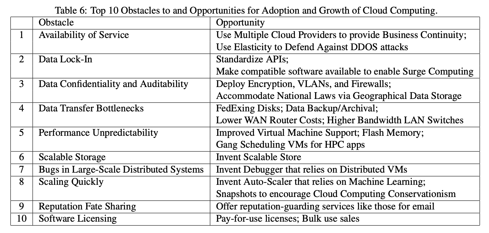

- 1.**核心需求**-高可用需求 
- 2.Data Lock-In - 标准化APIs
- 3.数据隐私与数据审计 - 数据合规要求 
- 4.数据传输瓶颈 - 网络间数据传输 
- 5.性能不可预测性 
- 6.可弹性计算存储资源
- 7.**核心需求**-分布式系统的稳定性 
- 8.极致弹性扩缩容 - 自动化Scaling
- 9.信誉守护服务 
- 10.付费模式的进阶 - 按量付费

_**From Traditional Infrastructure System to Cloud Computing Architure**_
What changes should be made to the design of future applications software, infrastructure software, and hardware to match the needs and opportunities of Cloud Computing?
未来应用软件、IaaS基础设施软件和硬件的设计应该做出哪些改变，以匹配云计算的需求和机遇？

云计算的技术本质是计算、存储、网络、PaaS产品的**虚拟化**，**组件化**, **软件Serverless服务化**。

#### 1.3. 云计算的价值主张

关于云计算核心价值主张的思考, 源引十年前当时还是AWS SVP的Andy Jassy(现在是Amazon CEO)的回答:

_**通用云计算的价值主张-互联网**_

	* 用CapEx(capital expenditures)替换OpEx(operating expenses)。
	* 降低IT总成本 -降本增效。
	* 利用云弹性资源，无需容量规划。实现极致扩缩容
	* 更快的敏捷速度以促进企业业务与技术创新。
	* 专注能带来市场竞争力的工作 --摆脱传统IT业务负担。
	* 全球化业务布局

十年过去之后，云计算的价值主张核心依然是懂的人懂,不懂的人还是不懂。或者说即使过了十年，大多数参与云计算的从业者无法真正理解或者无法找到比当年Andy Jassy更好的云计算价值定义。云计算作为新的技术载体发展了十几年之后, 如何摆脱“那些互联网企业才使用的技术供应商”这个标签，进军企业市场，一直是不容易的转型。AWS更偏互联网, Azure微软云更偏企业。作为国内Top的云厂商多来自互联网背景，在政企行业与国资云纠缠不清，举步维艰。更别说2023年的阿里云所提出的"AI驱动,公共云优先"新口号。这侧面证明传统互联网与面向广大传统政企的云计算价值主张存在较大差异。

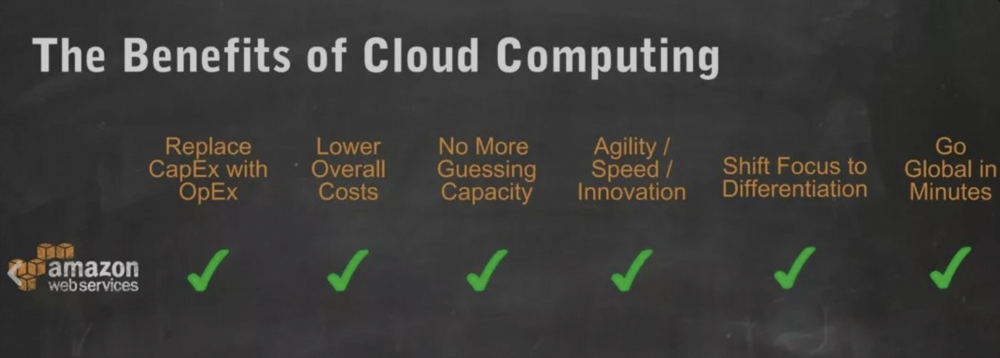

_**企业云计算的价值主张**_

	* 用CapEx(capital expenditures)替换OpEx(operating expenses)定义。
	* 面向企业的IT基础设施服务,易用,稳定,可运维。降低IT总成本。--IT在企业成本组成中优先级偏低
	* 提供能带来市场竞争力与效率提升的产品工具。
	* 企业数字化转型依赖于云计算的技术革新。
	* 达成企业数据安全合规管理的最佳实践-异常重要
	* 利用云弹性资源，无需容量规划。--成熟企业增长可预期,对弹性资源需求有限
	* 行业需求下的全球化布局

互联网云原生与企业IT数据化转型的差异将长期存在, 如同在云计算如此广阔的市场下,一定存在不同差异化云服务商。在之后的第三章会有具体阐述。

_**云计算应用优势与特点**_

-	1.**资源标准池化**：存算网池化、底层大资源池、产品/应用共池、服务规格;
	不同租户隔离与共享：租户/SP隔离、云产品/应用共池、高超卖比、离在线混部;
	
-	2.**按需弹性服务**：分层解耦服务化、服务规格、On-Demand、应用/Xaas的弹性、IAC基线强规划、按需调API、应用智能运维、平台固化原则;
	Autoscaling in response to changes in load to scale up or down the system.
	
-	3.**敏捷自动资源调度**：在线自助扩缩容、云/人/规划多脑协同、编排调度闭环;
	动态Instance漂移: Migration to new instances as they become available.

-	4.**实时计量计费**：服务化成本归集、市场化服务定价、分钟/小时级别实时计量; 
	按量付费是云计算所带来的全新商业计费模式。而包年包月是中国市场为客户降低成本而提出的特殊形态。
	
-	5.**随时随地接入**：云边端网络、混合云网络、SDWAN、CDN、资源/服务/网络上云;依赖pop点设置。
	
-	6.**默认跨AZ高可用**: Redundancy for availability, so that a single machine failure doesn’t take down the service. 
	**跨地域分布式数据复制与容灾**: Geographic distribution of redundant copies to preserve the service in case of disaster.
	
-	7.**负载均衡&软路由**: Load balancing and request routing to efficiently utilize resources.
	
-	8.**智能运维的升级优化**：自动化运维管理，改善与简化运维复杂度

		* 全链路监控&高性能运行: Monitoring to make sure the service is still running well.

 		* 日志管理&性能调优: Logging to record messages needed for debugging or performance tuning. 
 		* 系统升级&安全补丁: System upgrades, including security patching.

#### 1.4. 云计算架构原则

- API FIRST原则：云产品功能变化不能绕过API在控制台/CMP实现;
- 平台固化原则：内置几套标准规则算法，自动分配调度资源 ,追求大资源池下整体最优;
- 多脑协同原则：云脑为主、多个人/云脑协同、闭环编排调度，有A-CMP无I-CMP;
- 动态解耦原则：资源动态申请绑定，物理机基线强规划-->All on天宫ECS;
- 架构统一原则：公共云/行业云/本地部署云基础技术和架构原则统一、量变引质变、康威定律;
- 一云多芯原则：X86、ARM基线&版本统一，一云多Region/多AZ/多集群、集群内多场景计算引擎混部。

### II.Thinking: 如何预测云计算未来, 赢家和输家?

#### 2.1. Market: 充分竞争的市场

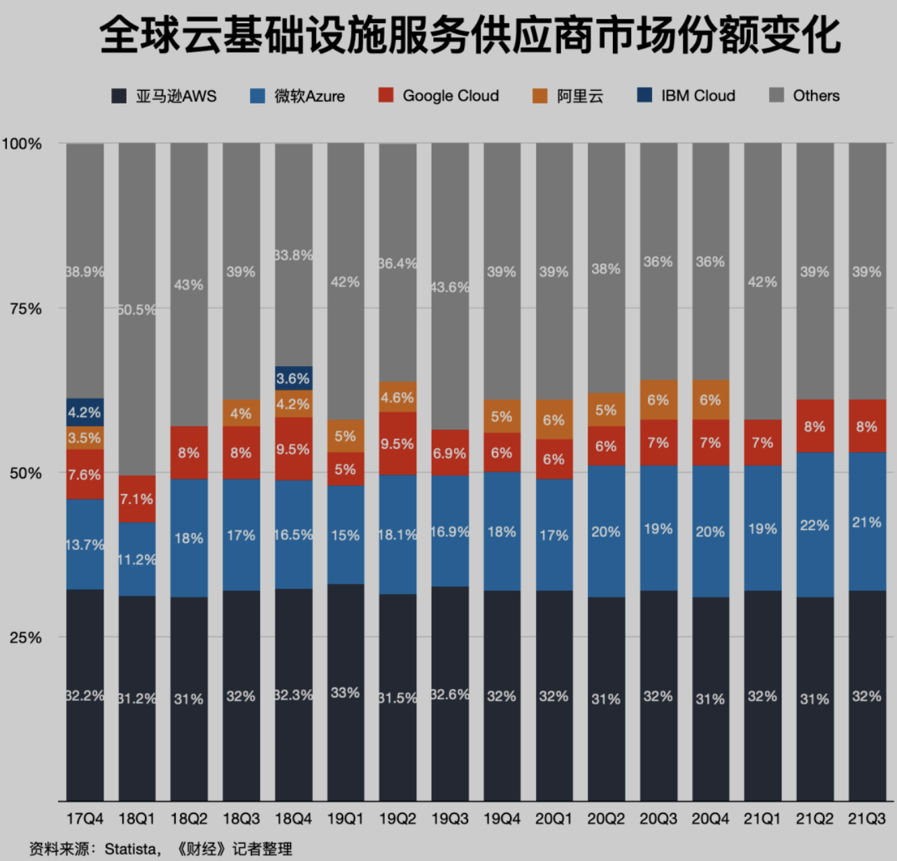

首先, 我们综合对比三家国际云公司(AWS/Azure/GCP)的业绩报告可以发现几个重要事实。

_**其一**_，亚马逊AWS、微软云、谷歌云GCP-2021年依旧维持着高增长，其收入增速甚至超过疫情前。与此相反，中国云厂商收入增速在2021年开始下滑。

_**其二**_，微软云正在缩小和亚马逊AWS在公共云市场的距离。微软云收入规模、利润率均高于亚马逊AWS。由于在传统IT市场积淀多年，微软云的产业布局也比亚马逊AWS更完整。

_**其三**_，亚马逊AWS、微软云的利润率远高于中国云厂商，且不可复制。国内云厂商在中国市场特殊性、政企/金融客户倾向私有化部署、大型客户定制化需求繁多等因素的影响下，无法简单模仿海外企业的路径。

	Tips: 中国区市场在未来很长时间内,私有云or混合云的产品部署与定制化需求依然强烈。如何有效提高商业化ROI是拿下对应市场的关键胜负手

行业资深人士的同一个观点，国际云厂商依旧沿着公共云规模扩张、成本降低，上层SaaS应用带动用云量增长的预定轨迹前进。国际云厂商和中国云厂商间的规模差距、技术差距正在被拉大。双方已走到分岔的十字路口，未来差距可能还将被进一步拉大。

	Tips: 云计算的营收主要来自IaaS云基础产品,PaaS层云产品要么依赖云端IaaS层产品来强化其云计算能力,要么统一按照全托管产品形态来输出。

_**亚马逊AWS**_在公共云市场具有绝对优势，产品包括云、数据库等，但PaaS、SaaS层较单薄，主要依靠SAP、Salesforce等平台层合作伙伴补足。亚马逊AWS还被认为在垂直行业缺少积淀。

	Tips:相比AWS的情况,阿里云在国内市场PaaS层产品依然较大优势！

过去，亚马逊AWS的客户包括Facebook、Instagram、Netflix等知互联网产品或企业。不过，2021年亚马逊AWS在**金融、医疗、制造、政府、电信**等大型行业客户市场取得了较大突破。

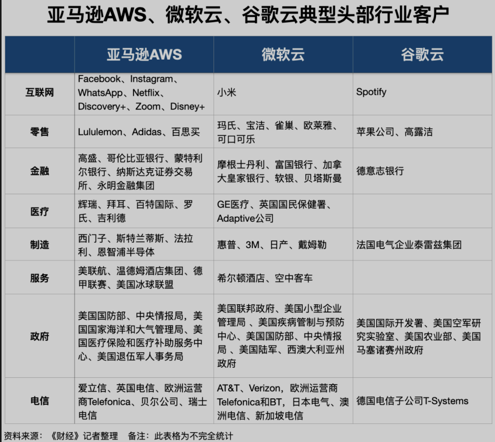

_**微软云**_（智能云+生产力与业务流程）2021年总营收为800亿美元。微软云规模不输与亚马逊AWS是三方面因素决定的。一是业务布局，二是客户关系，三是行业积淀。

从**业务布局**的角度看，微软从传统IT和传统软件阶段开始，用数十年构建了一条完整的To B产业链，具备公共云、混合云、私有云，集成、咨询及服务能力。微软还在PaaS和SaaS层形成了“Teams+Office365+Dynamic+Power Platform+Linkedin”的完整应用布局。

微软正在通过Teams和Office365两大SaaS协同办公产品，整合带动Dynamic ERP、CRM平台，Power Platform敏捷开发平台等PaaS产品的增长。

从**客户关系**的角度看，微软长期扎根政府和大企业市场，具有稳定的客户群。随着微软自身产品的云化，过去的Office、Windows、传统IT市场积累的现有客户被转化成了微软云的客户。

以政府客户为例，微软云服务了美国联邦政府、美国小型企业管理局、美国国防部以及美国陆军、西澳大利亚州政府。在电信业，美国运营商AT&T、Verizon，欧洲运营商Telefonica和BT，以及日本电气、澳洲电信、新加坡电信等均是微软Azure的客户。

从**行业积淀**的角度看，微软在传统IT阶段便开始服务行业市场。AWS是行业市场的新人，微软云却是行业市场的老兵。

2021年微软云制定了深挖六大行业（如零售、医疗、制造、金融、政府与非盈利组织、可持续发展）的战略，并在这六大行业推出了相应的行业云。比如，为强化医疗云，微软在2021年4月以197亿美元现金收购了医疗SaaS服务商Nuance。微软可持续发展云的客户则包括日产公司等对减排敏感度较高的企业。

大型政府、企业客户通常看重**公共云、私有云、混合云以及集成、咨询及服务能力**，微软、IBM等企业在该市场的优势强于亚马逊AWS。微软当前的产品、业务、战略布局看起来几乎没有短板。

	Tips:华为云的打法类似微软(当然华为ToB-SaaS软件开发能力远不及微软),其依赖于其多年的ToB行业积淀与成熟的渠道生态策略打法,在很多非互联网企业相关行业包括运营商、金融、政府、制造等领域客户拉入华为生态体系内,在产品能力一般的情况(在逐步改进中),依然在国内市场有较大优势。

#### 2.2. Customer: 云计算+数字化的目标客户分群

随着云计算与数字化广泛应用，且中国互联网渗透率80+%。云计算逐渐成为企业数字化上云的首选，但因为数据本身的安全合规特征，导致很多政企金融客户不信任公共云。而非公共云本地化部署形态如果按照传统软件商业模式是无法真正发挥云计算的核心体系优势。因此我们判断在未来很长一段时间 根据我们当前认知到云计算+数字化产品形态无法全面支撑所有的千行百业。从多年的业务实践发现, 以下行业客户已经或者即将重点拥抱云计算数字化。

**泛互联网行业-公共云的基本盘**

众所周知, 泛互联网行业是当今云计算最广泛的应用场景。由于对计算资源/数据存储的需求巨大,及业务增长的多变所需的弹性能力，云计算的能力能够最大程度的发挥出来，包括资源标准池化，按需弹性服务，敏捷自动资源调度，实时计量计费，随时随地接入，默认跨AZ高可用等等特性。在互联网-泛娱乐&游戏公司和互联网-营销&交易公司等细分领域广泛使用云计算能力，可以迅速推进相关业务上线发布，并获得相应的业务收益。IT高科技&半导体等领域对云计算的需求，相比互联网来说，其业务特征更加类似于高端制造行业。资源需求多，但无法全面发挥云计算的特性优势。

**政企行业&全球500强-规模化的胜负手**

广大的政企行业客户与全球500强企业正在进行IT技术改造升级，Cloud First 越来越被提及到, 以下的各行各业都开始使用云计算来改造升级企业IT体系与治理。云计算在传统企业的价值更多的体现在企业级IT智能对企业流程的改进与优化。企业数字化也已成为云计算应用的典型场景, 通过数字化改进对广大企业的帮助从成本优化扩展到业务价值转化。对云计算本身提出更高的要求。

- 零售&消费品+消费科技
- 金融科技&数字金融
- 汽车智能&智能制造
- 新媒体&互娱
- 电力&新能源*工业
- 生物医疗科技
- 政企大企业&电信运营商

**全球化业务布局-多云体系典范**

全球化业务增长从跨境出海开始，走向前台。越来越多的国内企业因为产能过剩等原因，而将新质生产力输出到全球。面向全球化的技术算力布局成为重中之重。其中最普遍的需求在于多云架构的规划与落地。多云主备部署不仅是对跨国企业业务连续性有着极大的帮助，同时也能够满足跨国数据合规的要求。

- 全球化布局与国际化
- 大国博弈对全球化业务的阻碍

**泛互联网与传统企业在云计算的差异**

从互联网行业看，云计算是IT技术迭代升级, 是弹性资源扩展与运维自动化,解放技术生产力。而互联网的行业特征在于不断迭代裂变与创新，对IT技术的时效性要求高。而相比之下, 企业上云却是不同另一种商业模式, 企业业务增长是稳定可预期的，稳定是企业对IT上云的首要要求，对特定弹性资源的扩展需求有限, 数据资源的需求变化小。但企业对流程规范/安全合规的要求高，账号权限/安全体系管理/稳定性/数据安全/高可用/灾难恢复/资源部署运维/自动化工具对接/监控可观测性/日志审计这些能力是企业级云产品所必备的。正因为如此，企业对云计算本身技术价值不感冒，而是对企业级产品能力特别关注，并愿意为此买单。泛互联网企业与传统企业的需求巨大差距导致云计算产品技术发展的二义性。以此可见,  从互联网走向全企业上云应用的道路依然漫长而艰辛。

#### 2.3. Cost: 云计算厂商的盈亏平衡点

据某云厂商高管所说, 云厂商的成本结构通常包含两部分。

	一是服务器硬件成本，其中负责高性能计算的芯片占成本大头。
	二是研发成本，其中包括算法研发，软件产品解决方案的研发，服务器、硬件、芯片的研发。

云厂商高质量发展(提高利润率)通常可以通过四种途径。

	一是IT基础设施IaaS规模足够大，服务的企业足够多，靠规模效应摊薄硬件成本；
	二是做大标准化软件的规模，理论上说，软件价值产品的毛利高达80%，可以为云厂商带来丰厚的利润；
	三是控制集成项目和定制项目的规模；生态伙伴优先
	四是延长服务器、网络等硬件设备的使用寿命。3年到5年

亚马逊是全球第一大云厂商，靠规模摊薄硬件成本效应明显。亚马逊AWS通常只提供标准化服务，**不承接集成项目和定制化项目的开发**。与PaaS数据产品相关的主要是二/三点。第二点,PaaS产品的标准化与产品差异化优势非常重要。产品商业定价需要按照市场竞争关系与业务价值变现来定义,而非从自身产品成本来考量。第三点,混合云项目中集成与定制类需求非常多,其依赖于人力资源成本,明显影响最终项目的营收情况。亚马逊在成熟软件市场是可以拒绝集成项目和定制化项目,但在中国不成熟市场无法避免,那么如何解决？

微软智能云的经营利润率比亚马逊AWS高14%，核心原因是，**微软高附加值的SaaS产品占比大。此外微软可以把现有客户转化为微软云客户**，不同于亚马逊AWS要组建新团队“打新单”，微软成本更低,因为存量软件客户的Upsell。专业大数据产品团队需要优先在于完善PaaS产品关键能力与关注存量客户留存率/续约率/Upsell, 特别是混合云大客户。而不是还未产品还没成熟的情况下,不断的'打新单'。

_**核心思考：云计算服务本身是一种源于互联网且用于资源效率变革的商业模式**_

虚拟化是提供云计算服务的技术实现的一种手段。因此云计算业务 其公共云业务增长应与虚拟资源扩展数量挂钩 ,其企业上云(混合云/本地化部署)与机器资源台数增长挂钩。云计算服务重点应在产品竞争力提升，特别是对业务价值提升相关能力提升, 同时对于SLA稳定性承诺有足够的担当。通过资源共享模式，改善资源使用率不足的问题, 产生边际利润。公共云模式，其与企业本地化私有部署(开源部署)软件形成足够的产品差异。

_**以算力资源用量规模化替代营收利润增长的**_

- 1.IT搬站上云是让IT走向标准化
- 2.云计算IaaS关键是弹性资源：1台顶5台-核心效率提升(边际利润提升)。
- 3.数据+AI智能PaaS: 需要持续优化计算算力ROI-PaaS数据产品的弹性能力的杠杆价值 / 智能SaaS服务的附加值
- 4.**Back to Basic** 云计算商业化的核心基本盘--公共云优先+自研产品差异竞争力优先
- 5.是否拥有产品定价权依赖于产品竞争力的代差优势

### III.Value: 云计算+数据AI价值产品商业化，路径在哪里？

本章是云计算业务思考的核心关键, 也就是云产品商业化的价值在哪里。如果没有云计算的引入, 传统IT解决方案是否能够满足现代企业对科技技术的多变诉求。当前我们可以看到是以下四大云计算主要价值:

	- 第一是业务永续，也就是PaaS产品/云上产品的高可用、容灾&灾难恢复和多活。--这一点云厂商做得并不好。。。
	- 第二是极致性价比(CapEx->OpEx)，在满足前两个需求下数据库的费用尽可能的便宜。在未来几年里，CIO们对降本增强的呼声会越来越强烈。--2023年/2024年阿里云云峰会多次发布大降价
	- 第三是商业模式创新-无限弹性资源伸缩。业务进行营销活动或者流量突然增长的时候数据库能及时扩容上去扛住流量。这两点做不好对业务就意味着资损。
	- 第四是极简易用性,简化技术业务鸿沟。基于云计算的X as a Service的产品理念，帮助用户以最简洁的方式实现云上数据分析计算存储的工作。

以上四大云计算价值对企业IT体系改进提供有效的帮助。随着云计算的深入发展, 多云统一管控与开源技术广大应用成为主流, 未来的云计算的价值是更多提供IaaS基础能力来无限算力支撑, PaaS产品的差异在逐步缩短, 企业级产品能力建设与提升2B客户的付费意愿成为提升云计算产品价值的重要路径。从现在看, 我们对云原生产品的认知还是需要进一步加强。

#### 3.1. [ROI]通用成本优化策略

面向云计算的成本优化的ROI评估, 其关键要用CapEx(capital expenditures)替换OpEx(operating expenses)的IT支出定义。很多时候，很多企业客户在考虑是否上云的时候，往往把上云的费用当作日常运营成本的来评估其价值。其中这是有失偏颇的。因为这类企业是把云计算的费用定义为OpEx (Operational Expenditure) 。而OpEx是指支持企业展开日常运营的短期 (≤1个会计期间) 费用支出。OpEx 对企业提供的效益在1年以内，因此会直接费用化至利润表当中。这样的结果就是云计算上云的费用主要是企业日常的成本来体现在利润表中。事实上, 相比OpEx, 针对云计算的投入应该被定义为CapEx, 也就是资本性支出。CapEx资本性支出是指包括有固定资产、无形资产、递延资产和折旧相关的未来长期为企业提供效益的支出，是为企业提供长期价值（>1个会计期间）的资产投资。只有这样定义云计算的ROI，才能真正找到云计算CloudFirst的价值。

上云ROI成本优化可以从云产品层面可以拆解成为这些能力，其中包括 [稳定性]  /   [性价比]  / [云原生资源弹性] /  [持续算力]。上云ROI的评估需要转化成CapEx的长期资本性支出，简单的把上云定义IT成本，是无法理解或认可云计算的长期价值。例如, 全面上云CloudFirst之后, IT固定资产与折扣转化成租赁资产, IT运维转化化智能运维服务, 高可用

总结起来, _**云计算2B的业务核心是比拼综合性价比(在技术领先下的成本规模优势), 是基于持续稳定系统之下的资本性投入产出比**_。

#### 3.2. [APaaS]云原生数据产品的商业进化-如何变现

##### **Snowflake-云原生数仓开创者**

参考Snowflake的Data-Warehouse-as-a-Service的商业化之路

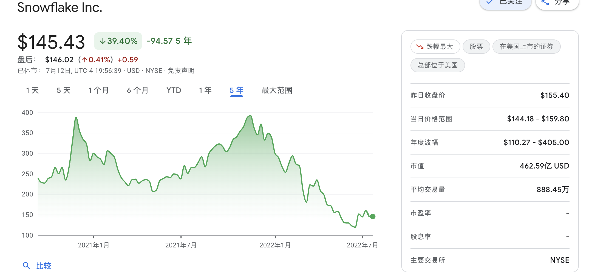

* 从云原生OLAP到云上HTAP [Introducing Unistore, Snowflake’s New Workload for Transactional and Analytical Data](https://www.snowflake.com/blog/introducing-unistore/)

##### **Databricks-做最领先的Data+AI一体化的自研云数仓**

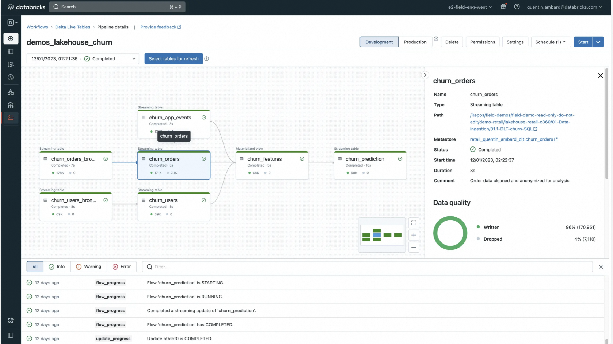

##### **GCP-BigQuery产品分析-做最开放与最可扩展的Open Data Cloud**

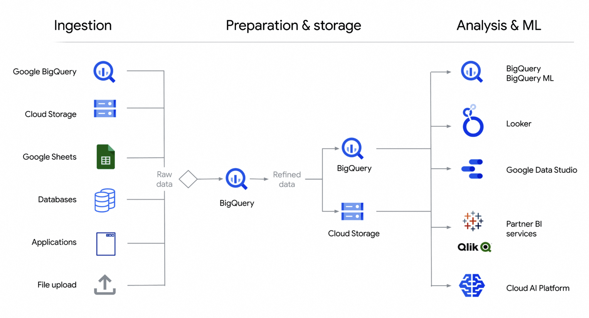

Cloud Data Warehouses are pushing this software category to a whole new level:

	- Business model按需所付: No upfront cost, pay as you go.
	- Scalability弹性可扩展: Separation of storage and compute, tapping into the cloud almost infinite scalability.
	- Integration集成能力: CDWs are cloud databases. Third party providers can easily access their API and read their data, as shown in Snowflake’s partner list.
	- Versatility多功能性: Both structured and semi-structured data can be stored in CDW (companies can ELT instead of ETL their data).

#### 3.3. [价值]通用数据应用商业化论

首先我们需要大数据+AI应该在哪些行业场景上能产生核心的业务价值。没有实际价值，所有技术能力都是空谈。

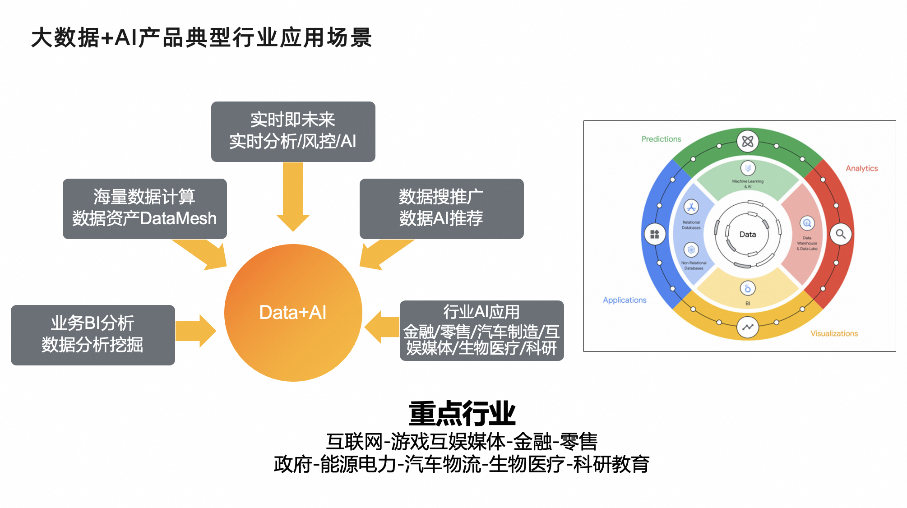

从以上的图表可以看出, 在互联网/金融科技/零售/智能制造/能源电力/生物医疗/科研教育等多个领域中大数据+AI技术应用广泛。介于大数据AI产品复杂多变, 我们把其应用场景分类为业务BI分析 / 海量数据计算&数据资产沉淀 / 实时计算分析 / 大数据搜推广 / 行业数据AI应用 等5大场景。需重点关注的是数据产品本身的商业化与基于云服务之上的云产品的商业化不是简单的业务模式重复。而是完全新形态的云原生产品商业化模式。云产品的PMF具体会落在哪些层面, 客户一定会为产品价值能力买单? 

_**Ref:[通用数据产品的商业化](2015-11-08-bigdata-analytics-thinking.md)**_

#### 3.4. [变革]通用AI智能应用商业化

随着ChatGPT的火爆出世, AGI的通用AI智能走向商业化速度迅速换成的现实。无数人愿意投入其中去尝试其未知的可能性，我们需要做的就是不断探索和挖掘AGI在千行百业的场景应用。

_**Ref: [AIGC&LLM Tech Business Notes](2023-03-11-aigc-llm-tech-study.md)**_

#### 3.5. 国内外云计算产品商业化差异

_**差异1: 企业IT产品价值的认知差异**_

国外企业对IT技术的认知相对比较高，愿意使用云计算产品来提高企业效率。而国内企业虽然也对提高企业效率有诉求，但大多更加期望云计算产品能够帮助企业提升业务价值。这从侧面证明国内企业体系的成熟度还有待加强，期望除了企业效率以外的业务效果提升。

_**差异2: 互联网行业特征的应用差异**_

国外互联网客户技术相对成熟度高，基于成熟OpenAPI的深度应用，帮助海外企业利用云计算编排IT自动化体系。而国内互联网公司普遍业务发展迅速以及急切的心态，因此IT自动化的诉求明显落后于国外同行。

_**差异3: 人力服务与技术服务的现实差异**_

国内对就业友好的行业相对不多，让大多数就业者对996/内卷习以为常。因此有更多的人力资源出现，相比使用技术付费服务，人力资源服务成本更低且更加有效。但随着劳动力成本的增长，技术付费服务的需求也变得越发重要。

_**差异4: 企业2B SaaS产品与云计算SaaS的价值差异**_

企业2B市场的SaaS业务发展的过去十年，一直很难称得上蓬勃发展。其原因在于国内市场的过度竞争与企业特征相关，SaaS产品本身是用于解决企业业务效率问题的重要工具，其售卖方式往往无法满足企业业务增长的需求。而且2B业务在国内市场面临的复杂因素过多，云计算与SaaS厂商的配合存在值得改进的方面。

### IV.TechTrend: 云计算-大数据&AI的行业技术趋势及影响

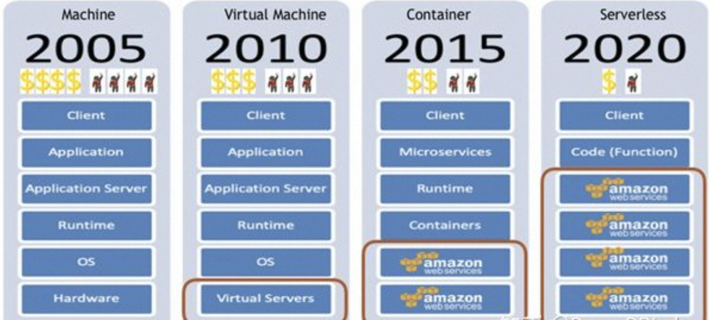

- 05年左右，我们还处在物理服务器时代，无论是机房、实体服务器、网络、软件授权等，还是专门的运维人员，对企业而言，都需要大量的支出，而实际的资源利用率却很低。

- 10年左右，随着服务器虚拟化技术的发展，可以将一台实体机按需分割成多台虚拟机，不仅减少了人员运维成本，更重要的是提升了设备的平均利用率，降低了综合成本。

- 15年左右，进入云计算时代，公有云厂商提供虚拟机或容器服务，企业不用再购买任何物理服务器及系统软件，同时节省了更多的运维人员成本。公有云厂商多租户的售卖整个资源池，综合来看，提升了云计算资源的整体平均利用率。

- 20年左右，Serverless Computing(无服务化计算)模式将成为未来云计算的主流模式，开发者只需要关注自己的业务代码，其余的事情都交给无服务计算厂商。企业不仅不用关心弹性扩容问题，而且只为代码调用执行的次数付费，运维的成本也再次降低，服务厂商能够更有效率的使用计算资源。**Serverless Computing = Cloud Computing ???**

那么推动云计算技术发展的主要底层因素到底是什么呢？我们总结发现，是降本增效与资源有效利用！无论是对供给方还是需求方，技术的推动力都带来巨大的降本增效的社会价值。虚拟化技术提升了资源的综合利用率，公有云服务又大幅降低了企业的运维成本，容器技术提升了业务开发迭代的效率，而无服务计算最终将业务开发及创新的效率又推向了新的极致

	- Serverless VS Serverful Computing
	- 弹性伸缩-存算分离到湖仓一体融合
	- 云原生资源池化-K8s容器化资源管理
	- 实时数据湖-实时数仓到流批一体
	- ServerlessComputing Product Design-智能运维形态-从人工运维到自动化运维服务
	- DataArchDesign on Cloud: DataFabric vs DataMesh
	- 数据合规&数据隐私安全技术
	- 多云跨域数据计算Multi-Cloud Computing
	- 大数据+AI一体参考架构

#### 4.1.Serverless VS Serverful Computing

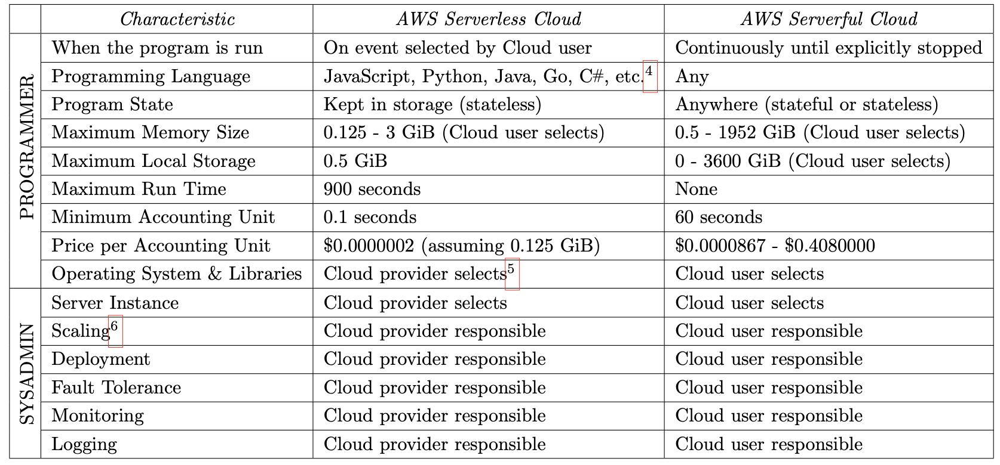

Table2: Characteristics of serverless cloud functions vs. serverful cloud VMs

_**关键区别SL&SF**_

_ServerfulComputing: 低级语言&汇编语言_

	其中首先提供资源或识别可用资源，然后用必要的代码和数据加载这些资源，执行计算，返回或存储结果，并最终管理资源释放。

_ServerlessComputing: 面向PaaS产品的高级语言_

	1. Decoupled computation and storage解藕计算与存储. 
		 The storage and computation scale separately and are provisioned and priced independently. In general, the storage is provided by a separate cloud service and the computation is stateless.存储和计算单独扩展，并且独立配置和定价。通常，存储由单独的云服务提供，计算是无状态的。
	2. Executing code without managing resource allocation自动资源分配. 
		 Instead of requesting resources, the user provides a piece of code and the cloud automatically provisions resources to execute that code.用户无需请求资源，而是提供一段代码，云会自动申请并分配对应资源来执行该代码。
	3. Multi-tenant isolation多租户资源隔离.
		We note that several recent proposals aim to reduce the overhead of providing multi-tenant isolation by leveraging containers, unikernels, library OSes, or language VMs. VM->K8s / Language VM
	4. 按使用资源量付费Paying in proportion to resources used instead of for resources allocated. 
		 Billing is by some dimension associated with the execution, such as execution time, rather than by a dimension of the base cloud platform, such as size and number of VMs allocated.云服务计费是根据与执行相关的某个维度（例如执行时间）而不是基础云平台的维度（例如分配的 VM 的大小和数量）。

#### 4.2.云原生资源池化-容器化资源管理

_**Container Orchestration容器编排**_

用于部署微服务的“容器编排”技术。与ServerlessComputing无服务器计算不同，Kubernetes 是一种简化的Serverful Computing管理的技术。Kubernetes 可以提供灵活短暂的计算环境，类似于无服务器计算，并且在硬件资源、执行时间和网络通信等方面的限制要少得多。它还可以将最初为本地使用而开发的软件完全部署在公共云上，几乎不需要修改。托管 Kubernetes 服务和ServerlessComputing无服务器计算之间的一个关键区别是**计费模型**。前者按预留容器资源收费，而后者按产品能力执行持续时间长短与资源规格大小来组合收费。

	Tips:AWS EKS与阿里云ACK 皆属于Serverful Computing的产品服务,但Elastic Container Instance(ECI)弹性容器实例提供了类似Serverless和容器化的弹性计算服务。只需要提供打包好的镜像，即可运行容器，与云厂商容器服务无缝对接并仅为容器实际运行消耗的资源付费。

Kubernetes 非常适合**混合云应用程序架构**，其中一部分在本地硬件上运行，一部分在云中运行。这种混合应用程序在向全面上云的过渡阶段是有意义的。然而，从长远来看，云规模经济、更快的网络带宽、不断增加的云服务会通过ServerlessComputing无服务器计算，简化云管理将部分降低此类云原生容器化混合应用程序的重要性。但其灵活与细粒度的资源弹性管理能力(K8s),会在很长一段时间成云计算主要应用载体。

_**Edge computing**_

Edge computing边缘计算是 后PC 时代云计算的合作伙伴，虽然我们在这里关注ServerlessComputing将如何改变数据中心内的编程，但边缘计算也有有趣的潜在影响。一些内容交付网络 (CDN) 运营商与视频提供商提供了在靠近用户的设施中执行Serverless功能的能力，无论他们在哪里，AWS IoT Greengrass甚至可以在边缘设备中嵌入Serverless执行。

#### 4.3.弹性伸缩-存算分离到湖仓一体融合

#### 4.4.实时数据湖-实时数仓到流批一体

#### 4.5.智能运维-从人工运维到自动化运维服务

#### 4.6.大数据+AI-从数据预处理到AI训练的全链路

#### 4.7.ServerlessComputing Product Design

##### Serverless Computing = Function as a Service + Backend as a Service.

	* 存算分离 / 动态资源分配 / 按使用量付费AutoSuspend
	* 全托管(做重-普遍客户)与半托管(做轻-成熟技术型客户)的目标人群差异
	* 只有最标准化且成熟的产品形态才适合半托管 Cloud。先做重(全托管)，后做轻(半托管)
	* 半托管是走量&性价比，全托管是做差异化。因此新产品不适合半托管, 即使是开源产品
	* 不要因为自家不愿意承担产品售后支持工作而将产品转化为半托管，就是个灾难

**Serverless产品**本身简化和通用编程模型, 能够让客户增加对云的使用而不是削减，因为更高的效率将通过增加用户来增加需求. 并且将云部署级别从 x86 机器代码到提升到高级编程语言。接受面向语言的优化和特定领域架构的研究

_**ServerlessComputing Model**_

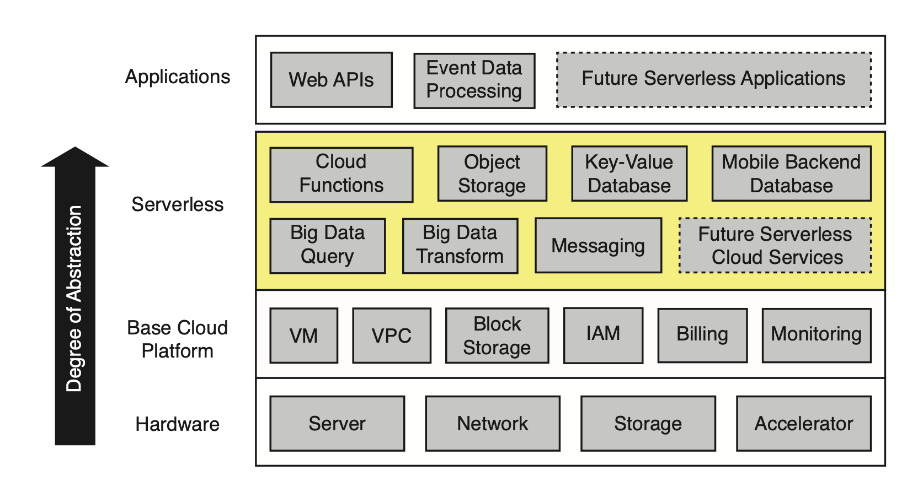

_云数据产品公共云的Base Cloud Platform Capability_

##### Serverless Product Thinking

ServerlessComputing服务化计算意味着对PaaS层与之前模式的巨大的创新。更好的自动资源弹性伸缩, 强大的资源隔离,平台本身灵活性及服务生态化的支持。很多应用希望使用 ServerlessComputing的关键原因是在于细粒度的自动弹性伸缩, 使得资源利用率与每个应用程序的不同需求紧密匹配。--云原生容器化是云计算进化阶段的关键优势。

Serverless意味着我们的客户不必考虑安全性、可靠性、管理性能、管理可扩展性、执行容灾备份与故障转移等所有这些基础产品能力，只需要考虑控制成本。Serverless的根本是在云上实现无处不在的一个个的基础组件(primitives)。

哪些大数据&AI产品可以做成全托管Serverless or Semi-Serverless or Serverful Product

- 面向行业专业技术客户,半托管数据产品可能是一种更好的选择
- 面向行业普遍客户, 全托管数据产品的免运维/自动资源弹性伸缩能够更好帮忙客户使用产品来服务好核心业务
- 半托管是否有行业标准定义? 如没有, 是否该建立云计算领域的半托管产品能力标准与边界。可以参考上文所提Base Cloud Platform Capability.

如何实现 稳定/成本/性能/安全 四大因素

数据安全问题 / 调试与监控困难 / 供应商绑定风险

##### A.ServerlessDB无服务器化数据库的挑战

- 没有内置的持久化存储
- 面向连接的协议的C/S架构
- 不支持共享内存

##### B.为什么PolarDB云端数据库的ServerlessDB很有特色

PolarDB Serverless在业内率先提出了将DDC（Disaggregated Data Centers）架构结合到数据库中，实现数据库内CPU，内存，存储等资源的完全分离，实现了基于分布式内存池（内存弹性）和多点可写（CPU弹性），资源多维度独立弹性的下一代云原生数据库架构。

PolarDB Serverless构建了一个全新的数据库形态，即DCaaDB（Datacenter as a Database）。整个IDC形成一个多租户的大数据库，其全部的CPU，内存，存储构成三个独立的资源池。在资源池未耗尽的情况下，任何一个用户（租户）都可能任意的弹性扩展任何一种资源到任何一个规格，用户为其SQL动态消耗的CPU、内存和存储买单，不需要预置任何的规格。这种情况下，CPU和内存资源因其池化其使用率将会大幅度提升，云原生数据的成本将会远低于自建和RDS等一体化数据库，云原生技术的价值将会得到充分的体现，数据库市场将会重新洗牌。

#### 4.8. 多云Multi-Cloud数据计算与管理走向主流

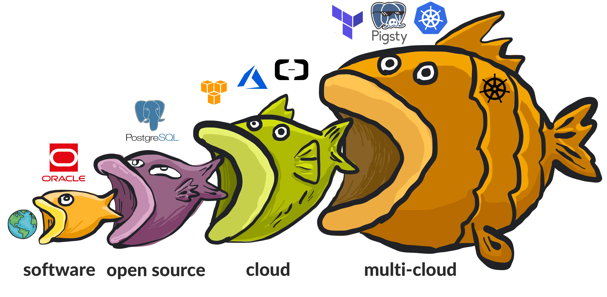

- Snowflake多云部署 / BigQuery-Onmi多云架构 / Databricks Multi-Cloud
- Confluent跨云数据中转 
- Databricks 跨云数据共享方案 / 跨云数据复制方案

_**Ref: [GCP BigQuery产品分享](https://developer.aliyun.com/article/907194)**_

#### 4.9. 数据合规&数据隐私安全

数据合规与数据隐私保护 随着云计算的普及而成为头等大事。原先有企业自身管理的数据，变由云厂商托管的服务来存储数据，那么云供应商如何实现数据合规和数据隐私保护就成为企业评估业务是否能够上云的核心指标之一。

#### 4.10.DataArchDesign on Cloud 云数据架构的进化

##### 基于云产品基础的DataArch

_**以开放作为技术竞争基础：**_

	* 没有用户希望被锁定 – 自主能力、议价能力、持续发展……
	* 选择合适的技术分层设计(解藕) --哪层是标准化能力，哪层是核心差异能力
	* 支持生态和客户发展来证明开放性和有效性

_**选择合理的技术分层，维持业务功能的开放性和可移植性：**_

	* 有事实标准可循的服务不破坏功能兼容性，给客户迁入迁出的自由，封装服务时多强调功能的共性  而不是差异性
	* 选择合适的技术分层接口，遵从或共建行业标准，如Kubernetes
	* 通过架构设计屏蔽外部技术能力差异的影响，如数据库封装层等设计，最简单的未必是最好和最有效的
	* 选择有潜力的合作伙伴和客户，以长期投入培养标杆

_**做最难的事情，在非功能性上体现技术实力和实质性差异：**_

	* 非功能性产品需求定义
		○ 定义IT系统应该支持的期望或特征；
		○ 可能是运行时(例如：性能或可用性)，也可能是非运行时(例如：可伸缩性或可维护性)
		○ 倾向于“规定性的”或“定量的”。
	* 没有技术难度可能同时意味着难以建立技术壁垒
	* 拉高标准化接口的层次，留出足够的技术发挥空间，寻找底层跨领域优化的空间和机会，如软硬件一体化全堆栈优化等
	* 在开放的接口下层分析清楚空间，做长期技术投入，不破坏接口稳定性和开放性
	* 做好长期持久战准备，软件需要长时间的积累和大量用户和场景的检验才能真正成熟，核心价值-的体现会更多在软件领域
	* 我们在软件上的大规模长期持续投入的价值需要充分体现
	* 形成顺畅的价值传导体系，推动厂商无关的参考架构，注入我们的最佳实践持续积累与演进

_**非功能性产品能力参考**_

	* 1.OpenAPI需要解决什么问题?
	* 2.数据迁移&数据入湖出湖为什么那么重要?
	* 3.产品部署交付Automation
	* 4.产品可观测性与智能运维
	* 5.研发效能: CICD / MLOps / DataOps
	* 6.产品的持续高可用与稳定性

##### DataArch未来发展方向

_**DataFabric vs DataMesh**_

Data Fabric(数据编织)和Data Mesh(数据网格)都认为：在物理上集中所有数据是徒劳的。他们都认识到数据量只会增长，而数据源只会成倍增加。

Gartner给Data Fabric(数据编织)的定义如下：

	Data Fabric is a design concept that serves as an integrated layer of data and connecting processes.

Data Fabric数据编织是一个设计概念，表示数据和连接进程的统一跨环境的集成层。从设计概念入手

1. **Data Fabric的定义**：数据编织是一种新兴的数据管理设计，它能够实现跨异构数据源的增强数据集成和共享。它不仅仅是一个单一的工具或技术，而是一个利用知识图谱、语义和活跃元数据上的机器学习/人工智能来支持更快的数据访问和共享的集成层。
2. **Data Fabric的优势**：数据织物可以帮助组织优化跨多云混合生态系统的数据集成，自动化数据工程任务，减少复杂性，并优化业务成果和价值。
3. **Data Fabric的业务影响**：到2027年，预计30%的企业将使用增强了数据织物元素的数据生态系统来支持可组合应用架构，从而获得显著的竞争优势。
4. **Data Fabric的关键特性**：数据织物能够跨越当前阻碍信息共享和查找的数据孤岛，更快地呈现和报告洞见，提高信息的生产力和价值，并建立弹性。
5. **实施Data Fabric的步骤**：
   - 准备：定义数据织物对业务的意义。
   - 建立：调查数据织物如何为所有数据消费者提供集成数据。
   - 参与：向关键利益相关者沟通数据织物的价值。
6. **交付提示**：通过实验、重新构想和发现来应用数据织物的好处，因为它仍处于创新的早期阶段。
7. **额外资源**：提供了额外的补充资源和工具，以帮助做出更好的商业决策，包括数据和分析治理路线图、现代数据战略的网络研讨会、首席数据官构建数据和分析领导特质的资源中心等。
8. **联系信息**：提供了如何成为Gartner客户以及如何获取更多资源的联系方式和门户信息。

强调Data Fabric在解决数据和应用孤岛问题、提高数据集成效率和促进业务决策中的重要性，并提供了一些具体的指导和建议，以帮助组织理解和实施数据织物。

Forrester给出Data Mesh(数据网格)的定义如下：

	Data Mesh is a decentralized sociotechnical approach to share, access and manage analytical data in complex and large-scale environments within or across organizations.

Data Mesh(数据网格)是一种分散的协作自治技术方法，用于在组织内部或跨组织的各种复杂和大规模环境中，共享、访问和管理分析数据。

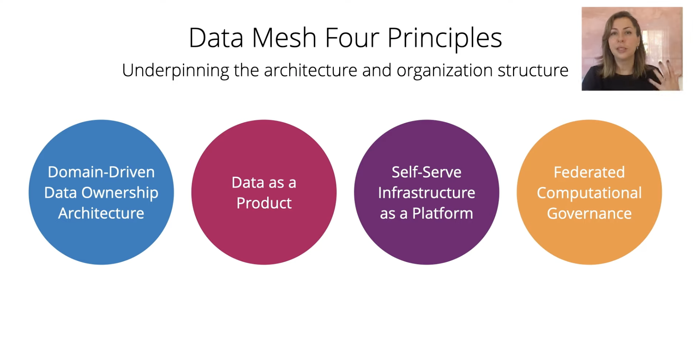

- Domain-Driven Data Ownership Architecture
- Data as a Product
- Self-Serve Infrastructure as a Platform
- Federated Computational Governance

_**DataFabric Pic vs DataMesh Pic**_

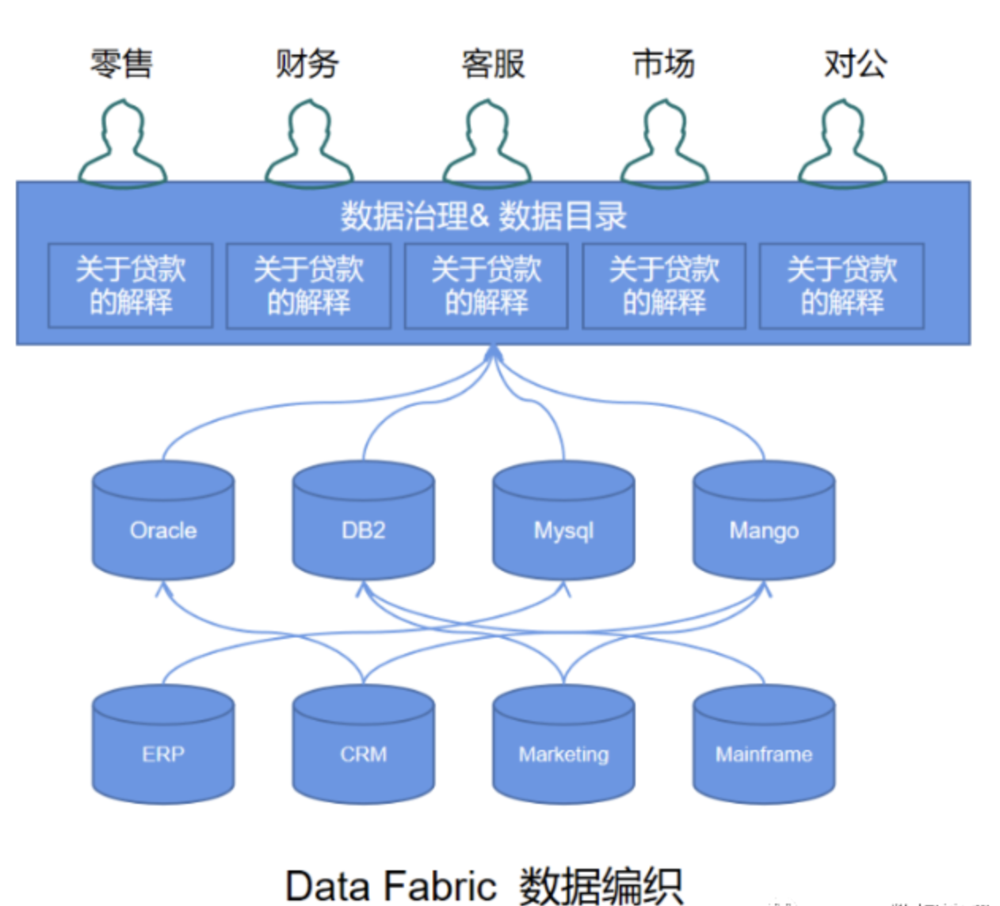

Data Fabric(数据编织) 把数据从生产到利用的过程分为3个层次：

- 最底层是记录系统，也就是各个业务系统的数据库。
- 中间层是通过 ETL 等手段转移到按照数据库类型分类的各个数据库中。
- 最上层是一个集成层，面向用户提供数据产品，注意实际的数据是保存在中间层的。

Data Fabric统一了跨环境的数据管理，依靠主动元数据、知识图谱、机器学习和其他元数据驱动功能为数据集成、分析提出建议和智能决策。Data Fabric 还收集了一系列用于数据转换和分析的技术，并将它们按单点形式提供给组织业务部门，以实现自助分析。

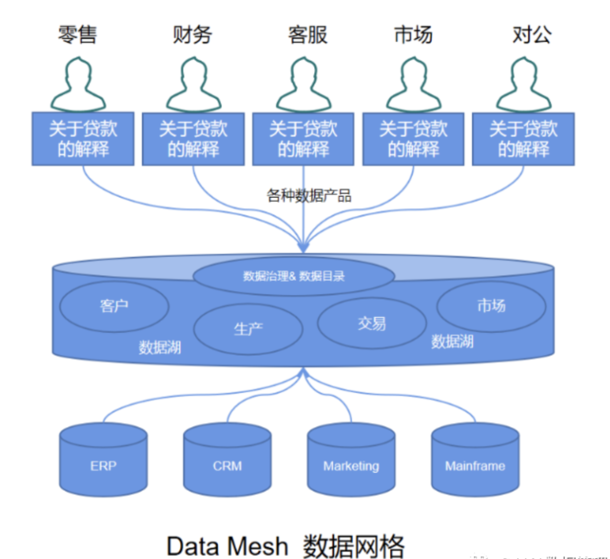

数据网格 (Data Mesh) 把数据从生产到利用的过程也是分为3个层次：

- 最底层是记录系统，也就是各个业务系统的数据库。
- 中间层是一个数据湖，数据在湖中做了物理集中。
- 最上层是一个，额...，没有最上层? 最上层其实是基于数据湖中不同Domain数据分别形成的数据产品。

Data Mesh 允许分布式团队在遵守共同的治理规定的前提下按照自己的方式管理数据，而 Data Fabric 是在分布式数据之上构建单个的跨环境虚拟管理层。Data Mesh 希望能纠正数据湖和数据仓库之间的不一致性问题。

_**Ref:**_：
_**[DataMesh Reference参考](https://developer.aliyun.com/article/881487)**_
_**[DataArch: from DataLake to DataMesh](2022-04-02-from-datalake-to-data-mesh.md)**_

_**DataFabric最终胜出**_

从现在看，Data Fabric已经成为未来数据架构发展的主流方向，Azure也适时发布DataFabric云数据产品，而Data Mesh理念超前，但实现路径过于复杂，缺少成功案例，导致逐步式微。

### V.云计算形态差异分析

#### 5.1. 公共云与的核心差异到底在哪里？

技术改变商业模式的典范-VMWare。云计算也算是技术+商业模式变革的典范, 但在绝大多数情况找到一个清晰有效的市场比什么都更有价值。Product Market Fit出处, 市场赛道优先+产品差异化优势加强。

_**云形态的差异与多云架构**_

云计算公共云的典型产品技术的特征：

	1.虚拟化IaaS技术 
	2.动态可扩展弹性伸缩 
	3.按需部署与按量(时间+资源)付费：Business Model: Pay as you go
	4.自动化可靠性高&高可用 
	5.算力性价比ROI高：以池化方式共享资源,提升资源复用率
	6.架构的多路复用(服务原子化)

_**Base Cloud Platform Capability**_

无论是公共云还是私有云, 云平台基础能力(VM / VPC / Block Storage / IAM / 计费 / 日志 / 运维监控)都是需要统一规划与实现的, 这样才能真正意义上实现云计算的价值, 资源池化与有效利用,弹性伸缩, 高可用。

公共云Business Model: 面向通用行业的资源按量付费的共享云产品租赁服务

_**私有云/混合云/专属云/行业云业务的投入产出比**_

由于国内政企领域(非互联网传统客户)对软件产品的理解不成熟, 导致云厂商需要为客户部署私有云、混合云，并更多扮演集成商角色，面临更分散、个性的市场需求。这些需求标准化程度低，难以简单复用。经营成本远高于海外云厂商。事实上, 中国市场和国际市场需求截然不同，双方原本就是两个土壤、两种需求。从多年的数据智能行业的市场探索, 笔者的判断在未来的很长一段时间, 在中国的商业土壤上, 混合云/私有云/行业云等多种非公共云的云产品形态将在政企行业普遍存在且存在较多商业营收机会。基于最初公共云设想的“水电煤”自助共享服务，由于中国市场的特殊形态，变成了传统IT产品售卖+贴身服务模式, 其中背后的问题原因很多。

哪些行业客户需要专属行业的非公共云下的云计算服务：金融 / 政府央企(烟草) / 数据合规类行业(汽车)

私有云or混合云受到国内客户青睐有多种原因, 其最主要的原因来自数据安全与隐私保护的诉求, 数据资产的自主管理。另外产品自研的迷思(特别是有了开源大数据技术火热), 导致国内客户普遍对开源技术有预期过高与困难准备不足的错误认知，尝试基于自建的大数据平台，完成整体数据平台建设。此现状短时间内无法彻底扭转。那么问题就转化到如何在混合云or私有云的架构下实现云计算的核心产品技术特征, 这是相对比较复杂的能力。

_**如何实现高ROI的混合云Business Model**_

首先, 我们需要了解当前非公共云的产品商业化到底存在哪些明显问题，相比公共云:

- 产品售卖方式--一次性买断。迫于营收压力,每次混合云要营收都得打新单
- 云厂商普遍产品非公共云版本混乱, 为了极致性能,依赖物理机部署形态,无法实现云层面存算分离
- 基于统一云底座之上,各产品之间架构千奇百怪,个个软件孤岛,无法是架构的多路复用
- DBStack/大数据私有化 产品线根据各自理解,独立设计完全不同的存储/运维管控/日志等。使得统一Base Cloud Platform Capability根本无法实现。
- 产品交付/售后运维复杂度太大,存在太多不可控的风险因素存在
- 无法真正发挥云计算架构下架构优势-弹性伸缩/资源共享/按量付费等等能力

以上文所描述, 私有云or混合云的计算产品形态在中国市场是将长期存在, 我们应该如何改进其云产品商业化链路。拥有行业属性的私有云or混合云产品体系能力一定是不同于传统软件售卖形态。如何制定私有云or混合云体系下基础产品标准化能力与上层差异化产品能力，补充2B产品的完善配套资料,  如何提供面向政企金融行业客户的全套咨询/服务/交付/售后支持体系

- 非公共云Business Model: 面向特定行业的专属云云服务租赁,需支持有效资源共享/回收机制
- 支持类似公共云层面统一的基础能力: VM / VPC / Block Storage / IAM / 计量计费 / 日志 / 运维监控 
- 符合云架构和能力的核心优势能力: 存算分离 / 统一存储 / 弹性伸缩 / 高可用数据复制 
- 支持数据安全&隐私保护,可由客户自身运维核心数据
- 根据专属行业特点, 开发相关标准定制行业能力模版
- 产品部署轻量化与标准化,其依赖于PaaS产品的统一架构设计,例如存算分离
- 生态伙伴体系建立-面向政企金融行业核心客户的全套咨询/服务/交付/售后支持体系

_**行业云or专属云对政企金融等特定客户的吸引力到底如何？**_

当然，政务云/金融云/汽车云/视频云/合规云/交易云等各类行业云与专属云对很多关键领域的政企金融企业非常之有价值，其客户价值与吸引力很长一段时间存在。但有待评估的是在于此类行业云是否能够在加强数据安全的前提下如何能够实现云计算的应用优势。相比复杂的私有云or混合云架构，行业云or专属云更类似于小规模的公共云。这种形态下的云架构很多时候无法真正实现云计算的核心能力，因为云计算本身就是规模越大，价值越大。没有规模的情况下，更关注内化的云IT架构的价值实现。

### VI.KeyStep: 关键步骤-克服困难、实现当前云计算PMF

#### 6.1.从产品商业化到市场普遍认可

产品商业化从0到1，如何实现市场的普遍认可是个很大的话题。作为一个新产品的落地，需要解析并排除障碍，当问题解决之后，产品走向正轨，则市场就会逐步放大大众的产品认可。

_**关于当初Excel与Lotus123的竞争与破局**_

所以当时 Excel 团队面临障碍，做了这些动作：

	* 1.[营销]他们必须了解 Excel，并知道 Excel 更好 —— 发送演示磁盘，全国巡回展示
	* 2.[定价折扣]必须购买 Excel —— 为前 123 个用户转换到 Excel 提供特别折扣
	* 3.[部署]必须购买 Windows 才能运行 Excel —— 制作一个可以运行Excel 的免费 Win 版本
	* 4.[迁移]必须将现有表格从 123 转移到 Excel —— 让 Excel 能读取 123 的内容
	* 5.[特性]Excel 无法运行 123 的宏 —— 让 Excel 能运行
	* 6.[交互]他们必须学习新界面 —— 让 Excel 兼容 123 的操作方式
	* 7.[性能]他们需要一台速度更快地电脑 —— 让摩尔定律来解决

除此之外，Excel 4.0 是一个巨大的转折点，因为这是首个可以编写 Lotus 123 表格的 Excel 版本。这样的好处是，那些不得不和 Lotus 123 协作的人，就可以加入 Excel 阵营了。

想要占领一个市场，必须解决每一个进入障碍。如果忘记了 50% 的潜在市场障碍，那么你不可能得到超过 50%的市场份额，你将不会替代主导者，然后陷入鸡与蛋的问题。

多数人其实并不愿意将精力花在迁移，导出与兼容上，而是希望能把潜在用户留在产品内。但**成熟的战略方法不是强迫潜在用户接受，而是在你弱小的时候，通过兼容巨头的功能，消除迁移障碍**。**每个障碍都会阻止一些人迁移到你的产品上。反过来看，只要你消除一个障碍，你的销售额就会翻番。包括迁移/服务/效率等等**

只有所有障碍得以排除，这样客户们才会涌入，尝试你的产品与业务。

_**云数据产品的商业化策略**_

从以上的产品规模化输出案例不难看出，技术产品需要解决的障碍与问题非常繁杂。其中包括营销，定价折扣，部署易用性，迁移能力，关键特性，交互体验等等。在一个充分竞争的市场内，竞争对手的胜负不是来自于一城一池的得失，而是正确的策略与持之以恒的贯彻执行。2B的云产品业务没法做到一夜变知结果，唯有抓住主要矛盾，集中资源做突破。

* 市场预估与资源重点投入方向
* 技术产品竞争力如何转化为商业化落地
* 市场竟对的深度分析与应对
* 核心目标设定与阶段性达成

#### 6.2. 从Product Market Fit到Market Product Fit

从案例到总结，Product Market Fit是产品和市场达到最佳的契合点，产品和市场需求匹配。而在真实的商业社会中，更多的是从市场细致观察中，寻找产品场景的突破口。

产品设计不仅服务于用户体验，一款产品的成功不可用单一的用户数据来衡量，要以能否找到PMF作为重要标杆，包括找到关键的北极星指标。在切中市场的需求的赛道上，提供的最匹配客户的差异化产品，令客户满意，并给出超出客户预期的体验。做的是客户，而不是业务。

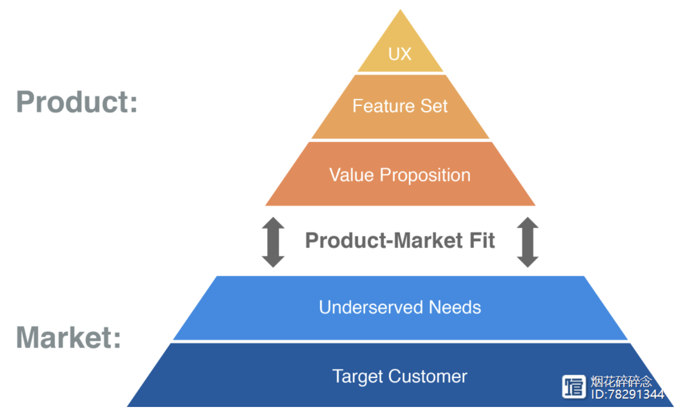

_**PMF的提法**_：Product / Market fit means being in a good market with a product that can satisfy that market。他用5个关键要素定义PMF的问题。在这个层级模型中，每个要素就是金字塔的一层，并且直接与它上下层相关联。从下到上，这5层依次是: 

* 1.你的目标用户
* 2.你用户未被满足的需求
* 3.你的价值主张
* 4.产品的功能集
* 5.产品的用户体验

针对企业级 B端服务, 要认识得到PMF客户的质量比数量更加重要。需要对流程，数据，人做标准化后才能达到项目向产品的转化，所以需要先做重(全托管)，后做轻(半托管)。而具体盈利的产品则要考量其付费转化率，产品营收，复购率等等。

_**B端PMF的北极星评价指标参考**_：

* 在3-9个月之内10个以上的行业Top客户自发付费注册使用你的产品-月消费1W以上
* 至少有20+%客户无须进行定制化开发来自主使用你的产品
* 至少有20+%客户使用你的产品一个月并且未发现Bug
* 至少20+%客户使用产品的方式和售前得到的预期结果是类似的

_**B端PMF的产品定价**_:

产品定价与产品本身的定位，市场地位，竟对情况息息相关。要赶超事实的行业领导者的难度极大，除了产品价格优势以外，还要有配合价格的产品差异定位。对客户的心智影响尤为重要。

#### 6.3.产品竞争力建设&关键问题障碍解决

基于以上商业化策略, 如何完成思考方式的闭环。

- 信息过滤：外部输入与总结，过滤大多数无用或非高优信息
- 技术爆炸：持续学习业内领先技术进展-AI算力革命/大模型 
- 商业逻辑：客户需求/PMF产品方法论/售卖规则/爆款模式 
- Learn from best的思考模式

_**A.Serverless Product -> 用户体验易用性&交互性**_

_**B.Semi-Serverless Product ->灵活组合**_

_**C.存算分离：大数据+AI一体参考架构**_

* 云原生容器化实现大数据与AI融合

_**D.存算一体: 智能计算融合架构**_

* AI+HPC & DPU

大模型对超大算力的依赖决定了存算一体的软硬架构将重新成为未来技术架构主流。
仿生学在计算机领域将大行其道。

_**关键障碍解决-做难而正确的事**_

我们往往试图绕过障碍，抄捷径来达成目标。例如，产品优势不明显就降价，缺少标杆客户就免费送。但事实上商业化关键障碍一直都在，不会因为绕过了障碍，障碍就消失不见了。产品的差异化优势建立来自于对客户场景的深度理解,有差异化才会有护城河的其他。标杆客户的突破，依赖于客户第一，与客户共同进退的信任与决心(当然要排除bad customer)。曾国藩所提出的‘结硬寨，打呆仗’，在2B市场上依然适用。不要想着一触而就，要想着如何打持久战，坚持做难而正确的事，等待量变到质变的提升。当下认认真真的解决一个又一个障碍与问题，坚定信念，相信一个优秀的产品竞争力能够最终赢回有价值客户的心。

### VII.Conclusion

首先，云计算是软硬一体的IT服务化的创新商业模式的生意，是一种XaaS的商业形态的创新。Cloud Computing从来不是一个赚快钱的行业，而是个门槛很高，且有规模效应的行业。没法赚快钱主要是指市场竞争异常激烈。 门槛高是指技术要求高，高度竞争的市场格局，重资产自持的资本投入，长周期&规模化的回报的特征明显。

从业务本质上看，云计算是一个B2B&B2C的技术标准服务化生意(是为了解决互联网业务波动大产生闲置资源的再利用, 同时也是平价餐厅/快捷酒店模式的升级形态。主打资源极致利用与扭转，弹性，超卖，随用随取)。标准化-好/规模化-快/产品丰富度-多/资源高效利用-省的效率程度(类似电商业态的'多快好省'在云计算)，其决定谁能在这个市场实现主导。在资源有限的情况下，往往无法做到‘多快好省’全部，如何取舍成为不同云厂商的差异化，其中自研优势产品的占比尤为重要。

从市场格局上看，技术重资源服务形态预示着市场不应该有超过5家的玩家。当前国内九朵云的群雄逐鹿的现象，与之前国内电商/O2O/汽车厂家的惨烈竞争非常类似，内卷的最终结果往往是尸横遍野，大多数玩家消失殆尽。正因为是在这重资产模式的零和博弈中，众多玩家都尝试出重拳，妄图迅速结束战争，驱赶竞争对手出局，这也只是妄想。事实是更合适的竞争胜出方式应该是坚持打持久战(打呆仗)，坚持客户价值挖掘，坚持营收平衡,  坚持产品差异化优势建立。

从产品维度上看，云计算产品的标准是稳定，成本，性能，安全。PaaS产品的好坏取决于云计算四大‘标准’的实现与其利用消耗资源的程度。程度越深，则产品在云计算形态下越重要，对客户，对自身。数据库/大数据/AI平台作为PaaS产品都是值得持续投入的产品方向，Copilot / AI Agent则已经开始赋能企业SaaS产品形态。PaaS产品+SaaS产品的未来发展，因为AI大模型的出现, 将会有更多未知的可能出现，其变化将改变云计算底层产品形态。例如AI智算的存算一体架构等。

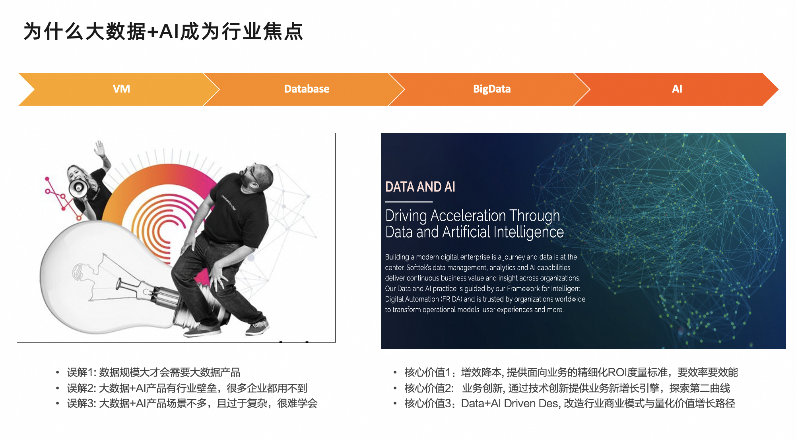

2023年作为AI智能的元年，AI技术与应用层出不穷。可以想见未来一定是云计算+AI & 个人终端+AI的世界。云计算+AI改变企业生产效率的模式创新，而个人终端+AI改变个体生产效率的模式创新。云计算的未来十年，一定会以超出我们想象的速度变革整个行业。AWS CEO突然换帅，Azure因all in AI与SaaS软件基础，大放异彩。是激进突破，是稳扎稳打，得看手上的牌有哪些，与AI会产生怎样的化学反应。唯一必须要做到的是always on the table. 

### Practice: 大数据&AI产品云业务的最佳实践

- 提出事实证据-案例，如何执行落地，最终效果如何？梦想照进现实
- 行业分析-互联网/金融/政府/能源/汽车/零售/企业上云

		行业云-政企金融核心系统转型
		智能制造+新能源与自动驾驶
		XC绕不开的话题-政府大数据&科研AI
		零售，供应链，物流，精细化运营

- 面向全球化云计算布局与国际三大云厂商PK
- 通用数据分析产品的行业优势
- Data+AI成为确定性的数据技术未来

### Reference

* paper_berkeley_view_AboveTheClouds_2009
* paper_berkeley_view_cloud_programming_2019
* paper_berkeley_serverless_computing_2019
* [Data Fabric Architecture is Key to Modernizing Data Management and Integration](https://www.gartner.com/smarterwithgartner/data-fabric-architecture-is-key-to-modernizing-data-management-and-integration)
* Data Mesh - Delivering Data-Driven Value at Scale
* paper_berkeley_view_of_system_challenges_forAI_2017
* [AWS CTO云服务一个个的基础组件(primitives)](https://www.protocol.com/enterprise/amazon-aws-werner-vogels)
* [The New Business of AI (and How It’s Different From Traditional Software)](https://future.com/new-business-ai-different-traditional-software/)
* [The Empty Promise of Data Moats](https://a16z.com/2019/05/09/data-network-effects-moats/)
