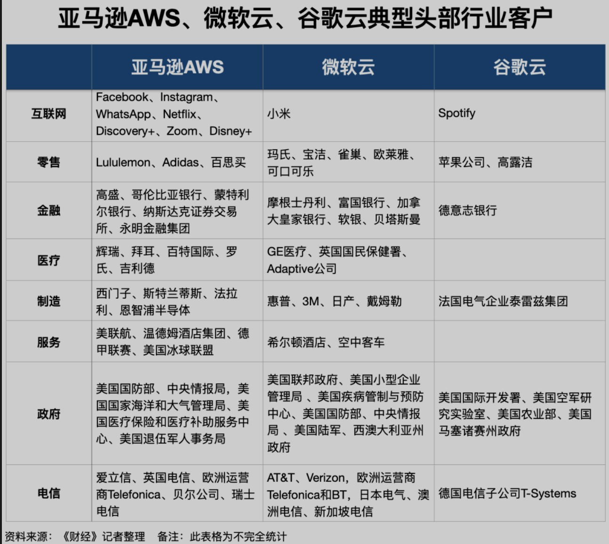
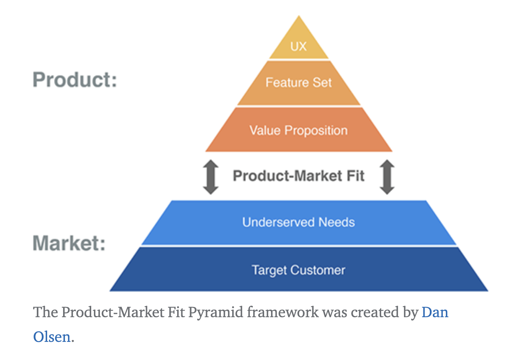

## Data Business Thinking on Cloud Computing2022

### I. Definition: Cloud Computing Internel-什么是云计算

What is Cloud Computing, and how is it different from previous paradigm shifts such as Software as a Service (SaaS)?

**云计算**是计算机系统资源，尤其是数据存储（云存储）和计算能力的按需可用性，无需用户直接主动管理。该术语通常用于描述 Internet 上可供许多用户使用的数据中心。今天占主导地位的大型Cloud Service通常具有从中央服务器分布在多个不同空间位置的能力。如果与用户的连接比较近，则可以指定为边缘服务器。

**效用计算**或计算机效用，是一种服务供应模型，在这种模型中，服务提供商根据需要向客户提供计算资源和基础设施管理，并按特定用途收费，而不是按固定费率收费。与其他类型的按需计算（例如网格计算）一样，本实用新型寻求最大化资源的有效使用和/或最小化相关成本。实用程序是将系统资源（例如计算、存储和服务）打包为计量服务。这种模式的优点是获取计算机资源的初始成本很低或没有；相反，资源基本上是租用的。

###### Why is Cloud Computing poised to take off now, whereas previous attempts have foundered?

​	为什么云计算现在腾飞了，而之前的尝试却失败了？ --IT基础设施的平台化与软件服务化成为企业科技费用的核心部分

What does it take to become a Cloud Computing provider, and why would a company consider becoming one?
	成为云计算提供商需要什么？为什么公司会考虑成为云计算提供商？

What new opportunities are either enabled by or potential drivers of Cloud Computing?
	云计算带来了哪些新机遇或潜在驱动因素？

How might we classify current Cloud Computing offerings across a spectrum, and how do the technical and business challenges differ depending on where in the spectrum a particular offering lies?
	我们如何在一个范围内对当前的云计算产品进行分类，以及技术和业务挑战如何根据特定产品在范围内的位置而有所不同？

#### Cloud Business Step-云计算商业化进程

_**Cloud Computing Economics**_
What,if any,are the new economic models enabled by Cloud Computing,and how can a service operator decide whether to move to the cloud or stay in a private datacenter?
	云计算带来了哪些新的经济模式(如果有的话)，IT服务商如何决定是迁移到云端还是留在私有数据中心？
	 Tips: 成本ROI / 架构升级带来的多路复用 / 高可用的稳定性 / 安全性 / 云原生(K8s/DataOps/MLOps)? 

_**Top 10 Obstacles and Opportunities for Cloud Computing**_

What are the top 10 obstacles to the success of Cloud Computing—and the corresponding top 10 opportunities available for overcoming the obstacles?
	云计算成功的 10 大障碍是什么？以及相应的10大机遇可以克服这些障碍？

- 1.高可用需求
- 2.Data Lock-In 
- 3.数据隐私与数据审计-数据合规要求 
- 4.数据传输瓶颈 
- 5.性能不可预测性 
- 6.可弹性计算存储资源
- 7.分布式系统的稳定性 
- 8.极致弹性扩缩容 
- 9.信誉守护服务 
- 10.付费模式的进阶

_**From Traditional Infrastructure System to Cloud Computing Architure**_
What changes should be made to the design of future applications software, infrastructure software, and hardware to match the needs and opportunities of Cloud Computing?
未来应用软件、IaaS基础设施软件和硬件的设计应该做出哪些改变，以匹配云计算的需求和机遇？

云计算的技术本质是计算、存储、网络、PaaS产品的**虚拟化**，**软件服务化**。

_**云计算架构优势与特点**_

-	1.**资源标准池化**：存算网池化、底层大资源池、产品/应用共池、服务规格;
	不同租户隔离与共享：租户/SP隔离、云产品/应用共池、高超卖比、离在线混部;
	
-	2.**按需弹性服务**：分层解耦服务化、服务规格、On-Demand、应用/Xaas的弹性、IAC基线强规划、按需调API、应用智能运维、平台固化原则;
	Autoscaling in response to changes in load to scale up or down the system.
	
-	3.**敏捷自动调度**：在线自助扩缩容、云/人/规划多脑协同、编排调度闭环;
	动态Instance漂移: Migration to new instances as they become available.

-	4.**实时计量计费**：服务化成本归集、市场化服务定价、分钟/小时级别实时计量;
	
-	5.**随时随地接入**：云边端网络、混合云网络、SDWAN、CDN、资源/服务/网络上云;
	
-	6.**默认高可用**: Redundancy for availability, so that a single machine failure doesn’t take down the service. 
	跨地域分布容灾: Geographic distribution of redundant copies to preserve the service in case of disaster.
	
-	7.**负载均衡&软路由**: Load balancing and request routing to efficiently utilize resources.
	
-	8.**智能运维德升级优化**

 	* 全链路监控&高性能运行: Monitoring to make sure the service is still running well.
 	* 日志管理&性能调优: Logging to record messages needed for debugging or performance tuning. 
 	* 系统升级&安全补丁: System upgrades, including security patching.

_**云计算原则**_

- API FIST原则：云产品功能变化不能绕过API在控制台/CMP实现;
- 平台固化原则：内置几套标准规则算法，自动分配调度资源 ,追求大资源池下整体最优;
- 多脑协同原则：云脑为主、多个人/云脑协同、闭环编排调度，有A-CMP无I-CMP;
- 动态解耦原则：资源动态申请绑定，物理机基线强规划-->All on天宫ECS;
- 架构统一原则：公共/专有云基础技术和架构原则统一、量变引质变、康威定律;
- 一云多芯原则：X86、ARM基线&版本统一，一云多Region/多AZ/多集群、集群内混部。

### II.Thinking: 如何预测云计算未来, 赢家和输家?

#### 2.1.Market: 充分竞争的市场

首先, 我们综合对比三家国际云公司(AWS/Azure/GCP)的业绩报告可以发现几个重要事实。

_**其一**_，亚马逊AWS、微软云、谷歌云2021年依旧维持着高增长，其收入增速甚至超过疫情前。与此相反，中国云厂商收入增速在2021年开始下滑。

_**其二**_，微软云正在缩小和亚马逊AWS在公共云市场的距离。微软云收入规模、利润率均高于亚马逊AWS。由于在传统IT市场积淀多年，微软云的产业布局也比亚马逊AWS更完整。

_**其三**_，亚马逊AWS、微软云的利润率远高于中国云厂商，且不可复制。国内云厂商在中国市场特殊性、政企/金融客户倾向私有化部署、大型客户定制化需求繁多等因素的影响下，无法简单模仿海外企业的路径。

		Tips: 中国区市场在未来很长时间内,私有云or混合云的产品部署与定制化需求依然强烈!如何有效提高ROI是拿下对应市场的关键胜负手

行业资深人士的同一个观点，国际云厂商依旧沿着公共云规模扩张、成本降低，上层SaaS应用带动用云量增长的预定轨迹前进。国际云厂商和中国云厂商间的规模差距、技术差距正在被拉大。双方已走到分岔的十字路口，未来差距可能还将被进一步拉大。

		Tips: 云计算的营收主要来自IaaS云基础产品,PaaS层云产品要么依赖云端IaaS层产品来强化其云计算能力,要么统一按照全托管产品形态来输出。

_**亚马逊AWS**_在公共云市场具有绝对优势，产品包括云、数据库等，但PaaS、SaaS层较单薄，主要依靠SAP、Salesforce等平台层合作伙伴补足。亚马逊AWS还被认为在垂直行业缺少积淀。

		Tips:相比AWS的情况,阿里云在国内市场PaaS层产品依然较大优势！

过去，亚马逊AWS的客户包括Facebook、Instagram、Netflix等知互联网产品或企业。不过，2021年亚马逊AWS在**金融、医疗、制造、政府、电信**等大型行业客户市场取得了较大突破。

	  Tips:阿里云大数据当前在金融/制造/政府领域有较大突破,运营商/医疗行业依然有待发力。

_**微软云**_（智能云+生产力与业务流程）2021年总营收为800亿美元。微软云规模不输与亚马逊AWS是三方面因素决定的。一是业务布局，二是客户关系，三是行业积淀。

从**业务布局**的角度看，微软从传统IT和传统软件阶段开始，用数十年构建了一条完整的To B产业链，具备公共云、混合云、私有云，集成、咨询及服务能力。微软还在PaaS和SaaS层形成了“Teams+Office365+Dynamic+Power Platform+Linkedin”的完整应用布局。

微软正在通过Teams和Office365两大SaaS协同办公产品，整合带动Dynamic ERP、CRM平台，Power Platform敏捷开发平台等PaaS产品的增长。

从**客户关系**的角度看，微软长期扎根政府和大企业市场，具有稳定的客户群。随着微软自身产品的云化，过去的Office、Windows、传统IT市场积累的现有客户被转化成了微软云的客户。

以政府客户为例，微软云服务了美国联邦政府、美国小型企业管理局、美国国防部以及美国陆军、西澳大利亚州政府。在电信业，美国运营商AT&T、Verizon，欧洲运营商Telefonica和BT，以及日本电气、澳洲电信、新加坡电信等均是微软Azure的客户。

从**行业积淀**的角度看，微软在传统IT阶段便开始服务行业市场。AWS是行业市场的新人，微软云却是行业市场的老兵。

2021年微软云制定了深挖六大行业（如零售、医疗、制造、金融、政府与非盈利组织、可持续发展）的战略，并在这六大行业推出了相应的行业云。比如，为强化医疗云，微软在2021年4月以197亿美元现金收购了医疗SaaS服务商Nuance。微软可持续发展云的客户则包括日产公司等对减排敏感度较高的企业。

大型政府、企业客户通常看重**公共云、私有云、混合云以及集成、咨询及服务能力**，微软、IBM等企业在该市场的优势强于亚马逊AWS。微软当前的产品、业务、战略布局看起来几乎没有短板。

		Tips:华为云的打法类似微软(当然华为ToB软件开发能力远不及微软),其依赖于其多年的ToB行业积淀与成熟的渠道生态策略打法,在很多非互联网相关行业包括运营商、金融、政府、制造等领域,在产品能力一般的情况(在逐步改进中),依然在国内市场有较大优势。

#### 2.2.Customer: 云计算目标客户分群

互联网巨头 ：混合云 / 多云部署

**泛娱乐&游戏公司**

**新零售&电商公司**

**金融科技**

**政企KA**

**医疗**

**智能制造**

非互联网：流程规范 / 安全体系建设

#### 2.3.Cost: 云计算厂商的盈亏平衡点

据某云厂商高管所说, 云厂商的成本结构通常包含两部分。

	一是服务器硬件成本，其中负责高性能计算的芯片占成本大头。
	二是研发成本，其中包括算法研发，软件产品解决方案的研发，服务器、硬件、芯片的研发。

云厂商高质量发展(提高利润率)通常可以通过四种途径。

	一是IT基础设施IaaS规模足够大，服务的企业足够多，靠规模效应摊薄硬件成本；
	二是做大标准化软件的规模，理论上说，软件价值产品的毛利高达80%，可以为云厂商带来丰厚的利润；
	三是控制集成项目和定制项目的规模；生态伙伴优先
	四是延长服务器、网络等硬件设备的使用寿命。3年到5年

亚马逊是全球第一大云厂商，靠规模摊薄硬件成本效应明显。亚马逊AWS通常只提供标准化服务，**不承接集成项目和定制化项目的开发**。与PaaS数据产品相关的主要是二/三点。第二点,PaaS产品的标准化与产品差异化优势非常重要。产品商业定价需要按照市场竞争关系与业务价值变现来定义,而非从自身产品成本来考量。第三点,混合云项目中集成与定制类需求非常多,其依赖于人力资源成本,明显影响最终项目的营收情况。亚马逊在成熟软件市场是可以拒绝集成项目和定制化项目,但在中国不成熟市场无法避免,那么如何解决？

微软智能云的经营利润率比亚马逊AWS高14%，核心原因是，**微软高附加值的软件产品占比大。此外微软可以把现有客户转化为微软云客户**，不同于亚马逊AWS要组建新团队“打新单”，微软成本更低,因为存量软件客户的Upsell。专业大数据产品团队需要优先在于完善PaaS产品关键能力与关注存量客户留存率/续约率/Upsell, 特别是混合云大客户。而不是还未产品还没成熟的情况下,不断的'打新单',

**核心思考**

云计算业务: 公共云业务增长应与机器数量资源扩展挂钩

- 1.IT搬站上云
- 2.云计算关键是弹性 1台顶5台-核心效率提升
- 3.数据+智能 需要持续优化计算算力ROI -软件附加值
- 4.**Back to Basic** 云计算行业核心基本功

### III.Value: 云计算+数据AI价值产品商业化，路径在哪里？

第一是业务永续，也就是数据库的高可用、容灾和多活。第二是弹性，业务进行营销活动或者流量突然增长的时候数据库能及时扩容上去扛住流量。这两点做不好对业务就意味着资损。第三是性价比，在满足前两个需求下数据库的费用尽可能的便宜。在未来几年里，CIO们对降本增强的呼声会越来越强烈。

#### 3.1.[云计算]通用成本优化策略

 [稳定] / [弹性] /  [算力]  / [降本性价比] 

高可用、容灾和多活

#### 3.2.[APaaS]云原生数据产品的商业进化-如何变现

Snowflake的Data-Warehouse-as-a-Service的商业化之路

* 从云原生OLAP到云上HTAP [Introducing Unistore, Snowflake’s New Workload for Transactional and Analytical Data](https://www.snowflake.com/blog/introducing-unistore/)

Cloud Data Warehouses are pushing this software category to a whole new level:

Business model: No upfront cost, pay as you go.
Scalability: Separation of storage and compute, tapping into the cloud almost infinite scalability.
Integration: CDWs are cloud databases. Third party providers can easily access their API and read their data, as shown in Snowflake’s partner list.
Versatility: Both structured and semi-structured data can be stored in CDW (companies can ELT instead of ETL their data).

#### 3.3.[价值]通用数据应用商业化论

首先我们需要大数据+AI应该在哪些行业场景上能产生核心的业务价值。没有价值，所有技术能力都是空谈。

_**Ref:[通用数据产品的商业化](2015-11-08-bigdata-analytics-thinking.md)**_

需要关注的是数据产品本身的商业化与基于云服务之上的云产品的商业化不是简单的业务模式重复。而是完全新形态的云原生产品商业化模式。云产品的PMF具体会落在哪些层面, 客户一定会为产品价值能力买单? 

#### 3.4.[变革]通用AI智能应用商业化

ChatGPT

#### 3.5.国内外云计算商业化差异

产品价值+服务

人力投入

### IV.TechTrend: 云计算-大数据&AI的行业技术趋势及影响

- 05年左右，我们还处在物理服务器时代，无论是机房、实体服务器、网络、软件授权等，还是专门的运维人员，对企业而言，都需要大量的支出，而实际的资源利用率却很低。

- 10年左右，随着服务器虚拟化技术的发展，可以将一台实体机按需分割成多台虚拟机，不仅减少了人员运维成本，更重要的是提升了设备的平均利用率，降低了综合成本。

- 15年左右，进入云计算时代，公有云厂商提供虚拟机或容器服务，企业不用再购买任何物理服务器及系统软件，同时节省了更多的运维人员成本。公有云厂商多租户的售卖整个资源池，综合来看，提升了云计算资源的整体平均利用率。

- 20年左右，Serverless Computing（无服务计算）模式将成为未来云计算的主流模式，开发者只需要关注自己的业务代码，其余的事情都交给无服务计算厂商。企业不仅不用关心弹性扩容问题，而且只为代码调用执行的次数付费，运维的成本也再次降低，服务厂商能够更有效率的使用计算资源。**Serverless Computing = Cloud Computing ???**

那么推动云计算技术发展的主要底层因素到底是什么呢？我们总结发现，是降本增效与资源有效利用！无论是对供给方还是需求方，技术的推动力都带来巨大的降本增效的社会价值。虚拟化技术提升了资源的综合利用率，公有云服务又大幅降低了企业的运维成本，容器技术提升了业务开发迭代的效率，而无服务计算最终将业务开发及创新的效率又推向了新的极致

- Serverless VS Serverful Computing
- 弹性伸缩-存算分离到湖仓一体融合
- 云原生资源池化-K8s容器化资源管理
- 实时数据湖-实时数仓到流批一体
- 智能运维-从人工运维到自动化运维服务
- ServerlessComputing Product Design-智能运维形态
- DataArchDesign on Cloud: DataMesh vs DataFabric
- 数据合规&数据隐私安全技术
- 多云跨域数据计算Multi-CloudComputing
- 大数据+AI一体参考架构

#### 4.1.Serverless VS Serverful Computing

Table2: Characteristics of serverless cloud functions vs. serverful cloud VMs

_**关键区别SL&SF**_

_ServerfulComputing: 低级语言&汇编语言_

	其中首先提供资源或识别可用资源，然后用必要的代码和数据加载这些资源，执行计算，返回或存储结果，并最终管理资源释放。

_ServerlessComputing: 面向PaaS产品的高级语言_

	1. Decoupled computation and storage解藕计算与存储. 
		 The storage and computation scale separately and are provisioned and priced independently. In general, the storage is provided by a separate cloud service and the computation is stateless.存储和计算单独扩展，并且独立配置和定价。通常，存储由单独的云服务提供，计算是无状态的。
	2. Executing code without managing resource allocation自动资源分配. 
		 Instead of requesting resources, the user provides a piece of code and the cloud automatically provisions resources to execute that code.用户无需请求资源，而是提供一段代码，云会自动申请并分配对应资源来执行该代码。
	3. Multi-tenant isolation多租户资源隔离.
		We note that several recent proposals aim to reduce the overhead of providing multi-tenant isolation by leveraging containers, unikernels, library OSes, or language VMs. VM->K8s / Language VM
	4. 按使用资源量付费Paying in proportion to resources used instead of for resources allocated. 
		 Billing is by some dimension associated with the execution, such as execution time, rather than by a dimension of the base cloud platform, such as size and number of VMs allocated.云服务计费是根据与执行相关的某个维度（例如执行时间）而不是基础云平台的维度（例如分配的 VM 的大小和数量）。

#### 4.2.云原生资源池化-容器化资源管理

_**Container Orchestration容器编排**_

用于部署微服务的“容器编排”技术。与ServerlessComputing无服务器计算不同，Kubernetes 是一种简化的Serverful Computing管理的技术。Kubernetes 可以提供灵活短暂的计算环境，类似于无服务器计算，并且在硬件资源、执行时间和网络通信等方面的限制要少得多。它还可以将最初为本地使用而开发的软件完全部署在公共云上，几乎不需要修改。托管 Kubernetes 服务和ServerlessComputing无服务器计算之间的一个关键区别是**计费模型**。前者按预留容器资源收费，而后者按产品能力执行持续时间长短与资源规格大小来组合收费。

		Tips:阿里云ACK是属于Serverful Computing的产品服务,但Elastic Container Instance(ECI)弹性容器实例提供了类似Serverless和容器化的弹性计算服务。只需要提供打包好的镜像，即可运行容器，与阿里云容器服务无缝对接并仅为容器实际运行消耗的资源付费。

Kubernetes 非常适合**混合云应用程序架构**，其中一部分在本地硬件上运行，一部分在云中运行。这种混合应用程序在向全面上云的过渡阶段是有意义的。然而，从长远来看，云规模经济、更快的网络带宽、不断增加的云服务会通过ServerlessComputing无服务器计算，简化云管理将部分降低此类云原生容器化混合应用程序的重要性。但其灵活与细粒度的资源弹性管理能力(K8s),会在很长一段时间成云计算主要应用载体。

_**Edge computing**_

Edge computing边缘计算是 后PC 时代云计算的合作伙伴，虽然我们在这里关注ServerlessComputing将如何改变数据中心内的编程，但边缘计算也有有趣的潜在影响。一些内容交付网络 (CDN) 运营商与视频提供商提供了在靠近用户的设施中执行Serverless功能的能力，无论他们在哪里，AWS IoT Greengrass甚至可以在边缘设备中嵌入Serverless执行。

#### 4.3.弹性伸缩-存算分离到湖仓一体融合

表格优化

#### 4.4.实时数据湖-实时数仓到流批一体

#### 4.5.智能运维-从人工运维到自动化运维服务

#### 4.6.ServerlessComputing Product Design

**Serverless Computing = Function as a Service + Backend as a Service.**

	- 存算分离 / 自动资源分配 / 按使用量付费AutoSuspend
	- 全托管(做重-普遍客户)与半托管(做轻-成熟技术型客户)的目标人群差异
	- 只有最标准化且成熟的产品形态才适合半托管 Cloud。先做重(全托管)，后做轻(半托管)
	- 半托管是走量&性价比，全托管是做差异化。因此新产品不适合半托管, 即使是开源产品
	- 不要因为自家不愿意承担产品售后支持工作而将产品转化为半托管，就是个灾难

**Serverless产品**本身简化和通用编程模型, 能够让客户增加对云的使用而不是削减，因为更高的效率将通过增加用户来增加需求. 并且将云部署级别从 x86 机器代码到提升到高级编程语言。接受面向语言的优化和特定领域架构的研究

_**ServerlessComputing Model**_

_阿里云数据产品公共云的Base Cloud Platform Capability_

_阿里云数据产品混合云的Base Cloud Platform Capability_

_**Serverless Product Thinking**_

哪些大数据&AI产品可以做成全托管Serverless or 半托管 or Serverful Product

		- 面向行业专业技术客户,半托管数据产品可能是一种更好的选择
		- 面向行业普遍客户, 全托管数据产品的免运维/自动资源弹性伸缩能够更好帮忙客户使用产品来服务好核心业务
		- 半托管是否有行业标准定义? 如没有, 是否该建立云计算领域的半托管产品能力标准与边界。可以参考上文所提Base Cloud Platform Capability。

数据安全问题 / 调试与监控困难 / 供应商绑定风险

_A.ServerlessDB无服务器化数据库的挑战_

	- 没有内置的持久化存储
	- 面向连接的协议的C/S架构
	- 不支持共享内存

_B.为什么PolarDB云端数据库的ServerlessDB很有特色_

PolarDB Serverless在业内率先提出了将DDC（Disaggregated Data Centers）架构结合到数据库中，实现数据库内CPU，内存，存储等资源的完全分离，实现了基于分布式内存池（内存弹性）和多点可写（CPU弹性），资源多维度独立弹性的下一代云原生数据库架构。

PolarDB Serverless构建了一个全新的数据库形态，即DCaaDB（Datacenter as a Database）。整个IDC形成一个多租户的大数据库，其全部的CPU，内存，存储构成三个独立的资源池。在资源池未耗尽的情况下，任何一个用户（租户）都可能任意的弹性扩展任何一种资源到任何一个规格，用户为其SQL动态消耗的CPU、内存和存储买单，不需要预置任何的规格。这种情况下，CPU和内存资源因其池化其使用率将会大幅度提升，云原生数据的成本将会远低于自建和RDS等一体化数据库，云原生技术的价值将会得到充分的体现，数据库市场将会重新洗牌。

_C.MaxCompute Serverless DataWarehouse_

_**ServerlessComputing总结**_

ServerlessComputing无服务器计算代表着对PaaS层与之前模式的巨大的创新。更好的自动资源弹性伸缩, 强大的资源隔离,平台本身灵活性及服务生态化的支持。很多应用希望使用serverless computing的关键原因是在于细粒度的自动弹性伸缩, 使得资源利用率与每个应用程序的不同需求紧密匹配。--云原生容器化是云计算进化阶段的关键优势

#### 4.4.DataArchDesign on Cloud

**以开放作为竞争基础：**
- 没有用户希望被锁定 – 自主能力、议价能力、持续发展……
- 选择合适的技术分层设计(解藕) --这一点非常重要
- 支持生态和客户发展来证明开放性和有效性

**选择合理的技术分层，维持业务功能的开放性和可移植性：**
- 有事实标准可循的服务不破坏功能兼容性，给客户迁入迁出的自由，封装服务时多强调功能的共性  而不是差异性
- 选择合适的技术分层接口，遵从或共建行业标准，如Kubernetes
- 通过架构设计屏蔽外部技术能力差异的影响，如数据库封装层等设计，最简单的未必是最好和最有效的
- 选择有潜力的合作伙伴和客户，以长期投入培养标杆

**做最难的事情，在非功能性上体现技术实力和实质性差异：**
非功能性产品需求定义
  ○ 定义IT系统应该支持的期望或特征；
  ○ 可能是运行时(例如：性能或可用性)，也可能是非运行时(例如：可伸缩性或可维护性)
  ○ 倾向于“规定性的”或“定量的”。

- 没有技术难度可能同时意味着难以建立技术壁垒
- 拉高标准化接口的层次，留出足够的技术发挥空间，寻找底层跨领域优化的空间和机会，如软硬件一体化全堆栈优化等
- 在开放的接口下层分析清楚空间，做长期技术投入，不破坏接口稳定性和开放性
- 做好长期持久战准备，软件需要长时间的积累和大量用户和场景的检验才能真正成熟，核心价值-的体现会更多在软件领域
- 我们在软件上的大规模长期持续投入的价值需要充分体现
- 形成顺畅的价值传导体系，推动厂商无关的参考架构，注入我们的最佳实践持续积累与演进

#### **[DataArch: from DataLake to DataMesh](2022-04-02-from-datalake-to-data-mesh.md)**

_**DataFabric vs DataMesh**_

Data Fabric(数据编织)和Data Mesh(数据网格)都认为：在物理上集中所有数据是徒劳的。他们都认识到数据量只会增长，而数据源只会成倍增加。

Gartner给Data Fabric(数据编织)的定义如下：

	Data Fabric is a design concept that serves as an integrated layer of data and connecting processes.

Data Fabric数据编织是一个设计概念，表示数据和连接进程的统一跨环境的集成层。

Forrester给出Data Mesh(数据网格)的定义如下：

	Data Mesh is a decentralized sociotechnical approach to share, access and manage analytical data in complex and large-scale environments within or across organizations.

Data Mesh(数据网格)是一种分散的协作自治技术方法，用于在组织内部或跨组织的各种复杂和大规模环境中，共享、访问和管理分析数据。

* Domain-Driven Data Ownership Architecture
* Data as a Product
* Self-Serve Infrastructure as a Platform
* Federated Computational Governance

_**DataFabric Pic vs DataMesh Pic**_

Data Fabric(数据编织) 把数据从生产到利用的过程分为3个层次：

	-最底层是记录系统，也就是各个业务系统的数据库。
	-中间层是通过 ETL 等手段转移到按照数据库类型分类的各个数据库中。
	-最上层是一个集成层，面向用户提供数据产品，注意实际的数据是保存在中间层的。

Data Fabric统一了跨环境的数据管理，依靠主动元数据、知识图谱、机器学习和其他元数据驱动功能为数据集成、分析提出建议和智能决策。Data Fabric 还收集了一系列用于数据转换和分析的技术，并将它们按单点形式提供给组织业务部门，以实现自助分析。

数据网格 (Data Mesh) 把数据从生产到利用的过程也是分为3个层次：

	-最底层是记录系统，也就是各个业务系统的数据库。
	-中间层是一个数据湖，数据在湖中做了物理集中。
	-最上层是一个，额...，没有最上层? 最上层其实是基于数据湖中不同Domain数据分别形成的数据产品。

Data Mesh 允许分布式团队在遵守共同的治理规定的前提下按照自己的方式管理数据，而 Data Fabric 是在分布式数据之上构建单个的跨环境虚拟管理层。Data Mesh 希望能纠正数据湖和数据仓库之间的不一致性问题。

参阅[DataMesh Reference参考](https://developer.aliyun.com/article/881487)

#### 4.8.数据合规&数据隐私安全

#### 4.6.多云跨域大数据计算Multi-Cloud

	* 多云Snowflake / BigQuery-Onmi多云架构 / Confluent
	* 跨云数据共享方案

GCP BigQuery

### V.云计算形态差异分析

#### 2.3.公共云与混合云的核心差异到底在哪里？

技术改变商业模式的典范-VMWare。云计算也算是技术+商业模式变革的典范, 但在绝大多数情况找到一个清晰有效的市场比什么都更有价值。Product Market Fit出处, 市场赛道优先+产品差异化优势加强。

_**云形态的差异与多云架构**_

云计算公共云的典型特征：
	1.虚拟化技术 
	2.动态可扩展弹性伸缩 
	3.按需部署与按量(时间+资源)付费
	4.可靠性高&高可用 
	5.算力性价比ROI高 / Business Model: Pay as you go
	6.架构的多路复用(服务原子化)

_**Base Cloud Platform Capability**_

无论是公共云还是混合云, 云平台基础能力(VM / VPC / Block Storage / IAM / 计费 / 日志 / 运维监控)都是需要统一规划与实现的, 这样才能真正意义上实现云计算的价值, 资源池化与有效利用,弹性伸缩, 高可用

公共云Business Model: 面向通用行业的共享云服务

_**混合云/私有云/专属云/行业云是不是值得投入**_

由于国内非互联网客户对软件产品的理解不成熟, 导致云厂商需要为客户部署私有云、混合云，并更多扮演集成商角色，面临更分散、个性的市场需求。这些需求标准化程度低，难以简单复用。经营成本远高于海外云厂商。事实上, 中国市场和国际市场需求截然不同，双方原本就是两个土壤、两种需求。从多年的数据智能行业的市场探索, 笔者的判断在未来的很长一段时间, 在中国的商业土壤上, 混合云/私有云/行业云等多种非公共云的云产品形态将在非互联网行业普遍存在且存在较多商业营收机会。基于最初公共云设想的“水电煤”自助服务，在中国市场变成了贴身服务, 无论是公共云与混合云。其背后的问题原因很多。

哪些行业客户需要专属行业的混合云云计算服务：金融 / 政企(烟草) / 数据敏感类行业(汽车)

混合云or私有云受到国内客户青睐有多种原因, 其最主要的原因来自数据安全与隐私保护的诉求, 数据资产的自主管理。另外产品自研的迷思(特别是有了开源大数据技术火热), 导致国内客户普遍对开源技术有预期过高与困难准备不足的错误认知。此现状短时间内无法彻底扭转。那么问题就转化到如何在混合云or私有云的架构下实现云计算的核心产品能力是需要持续关注的。

_**如何实现高ROI的混合云Business Model**_

首先, 我们需要了解当前混合云的产品商业化到底存在哪些明显问题:

		产品售卖方式--一次性买断。迫于营收压力,每次混合云要营收都得打新单
		计算平台产品混合云版本混乱, 为了极致性能,依赖物理机部署形态,无法实现云层面存算分离
		基于统一云底座之上,各产品之间架构千奇百怪,个个软件孤岛,无法是架构的多路复用
		DBStack/CNStack/敏捷大数据 产品线根据各自理解,独立设计完全不同的存储/运维管控/日志等。使得统一Base Cloud Platform Capability根本无法实现。
		产品交付/售后运维复杂度太大,存在太多不可控的风险因素存在

以上文所描述, 混合云或者非公云计算产品形态在中国市场是将长期存在, 我们应该如何改进其产品商业化链路。拥有行业属性的混合云&私有云产品体系能力一定是不同于传统软件售卖形态。如何制定混合云体系下基础产品标准化能力与上层差异化产品能力，补充2B产品的完善配套资料,  如何提供面向政企金融行业客户的全套咨询/服务/交付/售后支持体系

		混合云Business Model: 面向特定行业的专属云云服务租赁,需支持有效回收机制
		支持混合云层面统一的基础能力: VM / VPC / Block Storage / IAM / 计量计费 / 日志 / 运维监控 
		符合云架构和能力的核心优势能力: 高可用 / 统一存储 / 存算分离 / 弹性伸缩 
		支持数据安全&隐私保护,可由客户自身运维核心数据
		根据专属行业特点, 开发相关标准定制行业能力模版
		产品部署轻量化与标准化,其依赖于PaaS产品的统一架构设计,例如存算分离
		面向政企金融行业客户的全套咨询/服务/交付/售后支持体系(生态伙伴体系)

_**行业云or专属云对政企金融等特定客户很有吸引力**_

首先被考虑到的是金融云/视频云/合规云/交易云

### V.KeyStep: 关键步骤-克服困难、到达未来PMF

#### 5.1.思考模式

信息-外部输入/算力-自身能力/算法-方法论/Learn from best的思考模式

#### 5.2.PMF and IPD

Product Market Fit是产品和市场达到最佳的契合点，产品和市场需求匹配。
产品设计不仅服务于用户体验，一款产品的成功不可用单一的用户数据来衡量，要以能否找到PMF作为重要标杆。你所提供的产品正好满足市场的需求，令客户满意。

PMF的提法：Product / Market fit means being in a good market with a product that can satisfy that market。他用5个关键要素定义PMF的问题。在这个层级模型中，每个要素就是金字塔的一层，并且直接与它上下层相关联。从下到上，这5层依次是: 

	1.你的目标用户
	2.你用户未被满足的需求
	3.你的价值主张
	4.产品的功能集
	5.产品的用户体验

针对企业级 B端服务, 要认识得到PMF客户的质量比数量更加重要。需要对流程，数据，人做标准化后才能达到项目向产品的转化，所以需要先做重(全托管)，后做轻(半托管)。而具体盈利的产品则要考量其付费转化率，产品营收，复购率等等。

B端PMF的评价指标：
	- 在3-9个月之内10个以上的行业Top客户自发付费注册使用你的产品-月消费1W以上
	- 至少有20+%客户无须进行定制化开发来自主使用你的产品
	- 至少有20+%客户使用你的产品一个月并且未发现Bug
	- 至少20+%客户使用产品的方式和售前得到的预期结果是类似的

B端PMF的产品定价

#### 5.3.产品能力建设&关键问题障碍

A.Serverless Product -> 用户体验易用性&交互性

	MaxCompute & Hologres
	PAI

B.Semi-Serverless Product ->灵活组合

	OpenSource: EMR / Flink / Dataflow 

C.大数据+AI一体参考架构

_云原生容器化实现大数据与AI融合_

_HPC+AI & DPU_

Flink/Hologres on OSS 

D.软硬一体融合架构

非功能性产品能力

	1.OpenAPI需要解决什么问题?
	
	2.数据迁移&数据入湖出湖为什么那么重要?
	
	3.产品部署交付Automation
	
	4.产品智能运维
	
	5.研发效能: CICD / MLOps / DataOps

每个障碍都会阻止一些人迁移到你的产品上。反过来看，只要你消除一个障碍，你的销售额就会翻番。

#### 5.4.从产品商业化到市场普遍认可

#### 关于当初Excel与Lotus123的竞争与破局

所以当时 Excel 团队面临障碍，做了这些动作：

1.他们必须了解 Excel，并知道 Excel 更好 —— 发送演示磁盘，全国巡回展示
2.必须购买 Excel —— 为前 123 个用户转换到 Excel 提供特别折扣
3.必须购买 Windows 才能运行 Excel —— 制作一个可以运行Excel 的免费 Win 版本
4.必须将现有表格从 123 转移到 Excel —— 让 Excel 能读取 123 的内容
5.Excel 无法运行 123 的宏 —— 让 Excel 能运行
6.他们必须学习新界面 —— 让 Excel 兼容 123 的操作方式7.他们需要一台 速度更快地电脑 —— 让摩尔定律来解决

除此之外，Excel 4.0 是一个巨大的转折点，因为这是首个可以编写 Lotus 123 表格的 Excel 版本。这样的好处是，那些不得不和 Lotus 123 协作的人，就可以加入 Excel 阵营了。

想要占领一个市场，必须解决每一个进入障碍。如果忘记了 50% 的潜在市场障碍，那么你不可能得到超过 50%的市场份额，你将不会替代主导者，然后陷入鸡与蛋的问题。

多数人其实并不愿意将精力花在导出与兼容上，而是希望能把潜在用户留在产品内。但成熟的战略方法不是强迫潜在用户接受，而是在你弱小的时候，通过兼容巨头的功能，消除迁移障碍。

这样人们才会涌入，尝试你的业务。

### VI.Practice: 大数据&AI产品云业务的最佳实践

提出证据-案例，如何落地，梦想照进现实

行业分析-互联网/金融/政府/能源/汽车/零售/企业上云

金融核心系统转型-行业云

智能制造+新能源与自动驾驶

XC绕不开的话题-政府大数据&科研AI
- 政策导向

零售，供应链，物流，精细化运营

全球化竞争与海外云PK

通用数据分析产品的行业优势

### VII.Conclusion

软硬一体的思考

### Reference
* paper_berkeley_view_AboveTheClouds_2009
* paper_berkeley_view_cloud_programming_2019
* paper_serverless_computing_2019
* Data Mesh - Delivering Data-Driven Value at Scale
* paper_berkeley_view_of_system_challenges_forAI_2017
* [The New Business of AI (and How It’s Different From Traditional Software)](https://future.com/new-business-ai-different-traditional-software/)
* [The Empty Promise of Data Moats](https://a16z.com/2019/05/09/data-network-effects-moats/)
