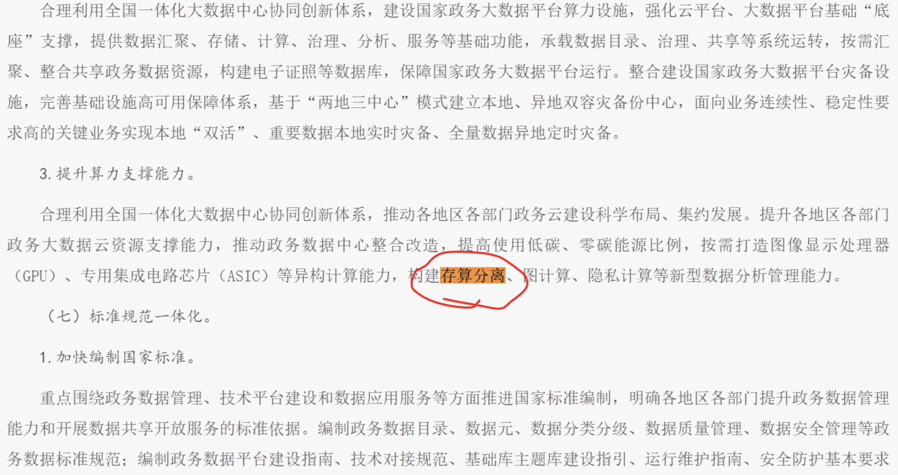
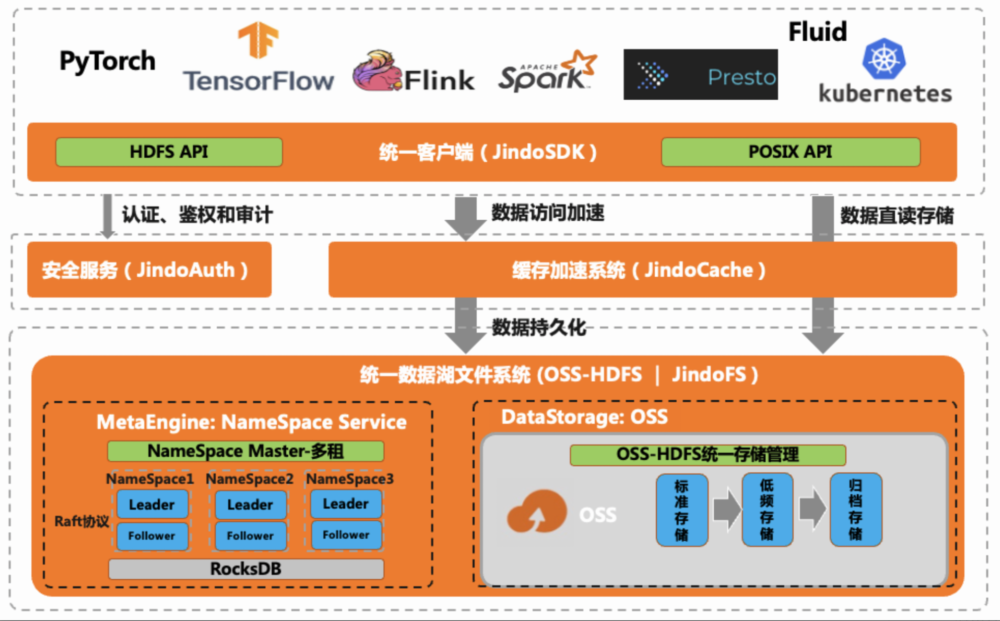
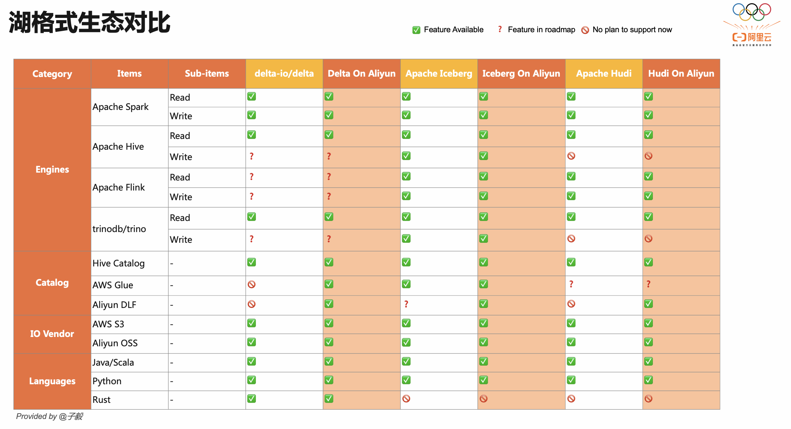
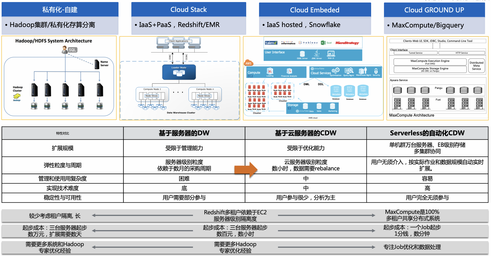
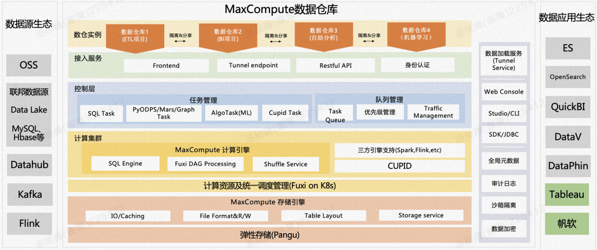

## 大数据研究-大数据上云存算分离演进思考与探讨2022

## 写在前面

作者：振策-阿里云计算平台产品解决方案

存算分离，数据湖，在离线混部在这些名词越来越多的出现在各行各业数字化转型的关键活动中。此文仅从大数据产品商业化从业者的视角来探讨与分析大数据领域的存算分离演进过程，核心价值，与相关所产生的蓬勃技术生态。内容来自阿里云计算平台大数据技术商业化思考与实践，与大家共同探讨。

## 0.[起源]存算分离不是新架构

**数据架构起源：**

Figure 1: 数据架构迭代演进

以上三张图分别代表过去三十年大规模数据架构演进过程。第一张图是最早的Shared-Disk架构主要是通过独立定制网络NAS于存储架构来实现第一代的存算分离架构，性能好但成本较高, 可扩展性较差(ScaleUp)。其中StorageAreaNetwork作为网络存储体系结构，采用网状通道（Fibre Channel ，简称FC，区别与Fiber Channel光纤通道）技术，通过FC交换机连接存储阵列和服务器主机，建立专用于数据存储的区域网络。第二张图是过去十几年Shared-Nothing架构大行其道，主要用于分布式数据仓库/大数据应用场景上，其特点在于性能好且性价比高，有一定的可扩展性(ScaleOut)。可以通过普通硬件实现类似高成本数据存储阵列所实现的效果。过去由于网络带宽的限制，我们习惯性的把计算和存储偶合在一起，以减少网络传输的压力。传统Hadoop大数据架构是MapReduce和HDFS，是**用优先本地IO后网络传输，是****存算一体****的一种形态**。但由于这样的架构，导致在资源利用率，异构工作负载等方面存在明显短板。第三图是为了解决存算一体架构问题而诞生的新一代**存算分离架构Storage Disaggregation**。其背景与趋势我在这里做一下阐述。

**背景一: 高速网络全面普及。以太网****传输协议和带宽能力已不再是IO瓶颈。**

因为网络的高速发展，以及大数据计算框架对 IO 的优化，使得数据本地化已经不再重要，存储和计算分离的架构才是未来。**高速以太网****Ethernet**吞吐量大幅提升而成本和部署灵活性相比FC和IB有大幅度改善，足以应对从当年的千兆迈入10GB，25GB，甚至100GB时代。无阻塞转发网络：比如FaceBook采用了CLOS网络拓扑，实现了分解式的网络，网络不会成为性能瓶颈，同时提供了灵活的组网能力。

**背景二: 云计算兴起，所带来低成本可扩展的网络存储方案**

在 AWS 等公有云上，**基于新网络架构的块存储/对象存储**逐步取代了单机的本地存储，使得公有云上的计算和存储耦合架构更加不合理。针对公有云设计的大数据分析服务，一开始就是采用了计算和存储分离的架构（直接使用 S3 作为存储）。这给产品带来了非常大的灵活性，按需创建和自动弹性伸缩的 Spark 集群是一大卖点（还能最大限度使用 Spot 节点来大大降低计算成本），非常受客户欢迎。AWS 上的先驱也是使用 S3 作为大数据的存储，他们针对 Hive 等做了很多改造才能稳定使用 （不是开源的S3mper）。

**趋势一：云计算AWS首先提出基于在公共云架构下云原生存算分离产品**

基于存算分离的云原生数据库。数据库2014年AWS首次推出了Aurora，阿里云在2017年推出了云原生数据库PolarDB。华为云在2020年推出了GaussDB for MySQL，华为存储也在2021年针对企业自建数据中心，推出OceanData分布式数据库存算分离方案。

**趋势二：大数据从_数据本地化Data Locality到DisAgg_**

Data Locality在大数据领域发展的前期更加重要，主要是因为分布式计算跨服务器的带宽瓶颈（2012年之前，跨核心交换机的带宽收敛比基本在1:10）,所以超大规模大数据计算的调度器对数据和计算locality匹配，需要特别优化。因为存储具有搬移困难的特点，**2012年之前，****做大规模计算的核心词是“Data Locality”**：让计算尽量靠近数据以提升效率。当时一个公认的模型是：构建一个足够大的资源池，把数据和计算融合在里面发挥规模效应。

2013 年Facebook做了一个这方面的研究，看在关闭 Hadoop 的数据本地化优化的情况下，对性能究竟有多少影响。实测表明，对计算任务的整体影响在 2%以内，**对数据的本地读优化已经不那么重要了(仅限于性能，不包括成本)**。后来 Facebook 就逐渐往Spark计算和存储分离的架构迁移，也对所用的大数据软件做了些调整以适应这种新的架构，他们在2015年的 Apache Spark & AI Summit 上做了主题为 <[Taking Advantage of a Disaggregated Storage and Compute Architecture](https://databricks.com/session/taking-advantage-of-a-disaggregated-storage-and-compute-architecture)> 详细的分享，他们把这种架构称为 Storage DisAggregation。

Figure 2: Spark Disagg

## 1.[定义]当前存算分离能力思考

新一代的存算分离StorageDisagg架构逐步普及的当下, 如何定义存算分离架构下的能力标准？如何确保以通用存算分离标准实现可扩展可运维的下一代大数据架构？如何确保存算分离架构的ROI为正？是我们一直在思考和探索的问题答案。围绕这存算分离具体应用场景，我们大致可以得到以下**7个重要定义指标用于定义存算分离能力标准**。

- **[系统态]计算节点集群与存储节点集群分离, 分别支持独立弹性扩缩容物理集群节点**
- **[系统态]计算层无状态，支持热升级 / 存储层数据无需重分布**
- **[用户态]用户可配置计算与存储资源成本计费分拆，精细化成本核算优化。**
- **[用户态]用户可配置计算资源与存储资源独立弹性扩缩容。公共云以分时Quota能力体现。**
- **[用户态]存储服务化。其形态有开放共享存储形态和存储开放服务形态**
		
			非独占的统一开放存储系统服务。多源数据存放在共享存储服务, 资源优化利用。
			提供统一存储Service外部访问接口,性能与稳定性更优,支持可访问可查询可分析/默认多副本。

- **[用户态]多种计算引擎查询访问此统一存储系统服务。计算引擎可访问多种统一存储系统服务**
- **[用户态]统一计算资源管控,细粒度资源单位拆分，按照细资源单元做弹性扩缩容**

以上的7个重要定义指标无论公共云与非公共云形态下都适用。

## 2.[价值]存算分离的业务价值分析-业务问题/业务场景/业务价值

在互联网广泛使用的存算分离架构，当前已在政企金融等行业越来越讨论到。企业将大数据上云与存算分离当作数字化转型中架构升级的必要路径。无论是内外部客户与同行都把存算分离当作救命稻草与灵丹妙药。用存算分离架构升级就能解决当前所遇到所有技术资源瓶颈与业务滞涨。这样的理解是有问题的，主要是缺少对其中背后的核心价值评估。

很多人说存算分离的需求很明确，存算分离技术方案就有价值且值得做的。笔者要说是需求与价值不完全等同。需求是价值的源头, 价值是需求的最终呈现方式。在实际业务实践中，往往需求方和决策方不是同一方。存算分离需求清晰明确后，我们需要思考如何存算分离改造后可量化的价值在哪里。**存算分离是技术手段，那核心目的or价值到底是reduce cost or involution fast？**

### 2.1.为什么要做存算分离？

无论是所有的技术架构升级与业务改造, **其根本逻辑就是一本投入产出价值的经济帐。**源于网络带宽的能力提升与成本下降，云计算带动了网络存储方案的低成本普及。此为技术突破准备。海量数据的激增(**数据多、算不动**)促使企业**从数据管理走向数据运营**，到**面临成本高、存不下；效率低、流不动；自动化差、管不好三大挑战**。此为问题需求。越来越多的企业发现相较于之前DataLocality的存算一体架构，新一代存算分离架构能够提供在性能不下降的情况更低成本的大数据方案。此为架构升级。

**总体上看，对存算分离的诉求以大数据资源效率+稳定性提升是首要目的，此外还包含着业务效率提升诉求(技术创新/业务增效)。**业务优先的客户对存算分离的诉求在于降低成本与业务稳定性提升。技术与业务并重的客户对存算分离的诉求在于成本优化与业务增效升级。从当前计算平台云原生存算分离业务实践来看，主要包括以下几个方面的核心价值：

***资源效率优化***

- **资源利用率提高：计算与存储资源解耦，资源使用成本优化**。作为底层的资源平台，基础IT环境的资源总是有限的，站在业务的角度是往往是存储先于计算达到瓶颈，到达时间点是不一样的。由于计算和存储的耦合设计，无论扩计算还是扩存储，都在会造成资源的浪费；
- **异构计算负载混部：** 在统一存储平台提供面向_异构计算的工作负载_下的多维度查询分析服务。
- **存储降本优化: 存储利用率+冷热分层**。支持基于分布式存储系统上的多层存储(热存储/标准存储/冷存储等)。举例来说，存储降本优化主要依赖于归档与冷存储占比大小。如冷存储占比40+%,存储成本大致下降20+%。

***系统稳定性提升***

- **SRE可靠性提升:** 业务稳定性-计算集群与存储集群分别高可用。运维易用提升：独立热升级-支持原地升级、滚动升级、补丁升级，升级时间短。原先耦合造成扩容不便：计算和存储耦合在一起的典型问题，例如每次扩容都需要考虑数据的迁移，给本来简单的扩容工作带来很多风险和不可控因素。

***技术创新/业务增效***

- **创新数据应用:** 基于统一存储平台之上对_多源异构数据_的深度分析数据价值的挖掘，大数据+AI的整合应用，以提升数据协同应用效率。
- **硬件利旧降本:** 从运维的角度来讲，降低服务器的款型是降低运维难度和工作量的有效手段。随着业务复杂度的增加和新业务线上的加快，对服务器新机型与资源配比的要求也会随之增加。降低服务器的款型很难做到。私有化存算分离改造目的是有两个, 通过存算分离来更顺滑的兼容更多硬件款型, 支持不同计算引擎间混部以降低硬件成本。
- **行业趋势:** 行业大数据改造升级。随着反全球化浪潮的加剧，政企/金融行业信创大数据升级改造的需求越来越多，如何实现基于自研和信创大数据体系下的存算分离架构成为客户普遍诉求

### 2.2.存算分离架构改造的成本核算

在关注存算分离的价值优势的同时, 我们无法回避的就是**存算分离改造所来的各种额外成本**。大数据平台从来就不是一个简单的数据产品，而是一个完整的围绕大数据的生态体系。大数据存算分离架构改造的可行性评估尤为重要。

Figure 3: 存算分离的价值与成本

#### 门槛一：为什么大数据存算分离架构先出现在公共云环境下？

大数据存算分离架构首先出现在公共云是有其一定确定性的。

- 1-基于高速网络的_低成本+高性价比分布式存储(文件系统/对象存储)方案_诞生。毕竟如果没有高速以太网的普及与更廉价且高可用的存储方案,大数据存算一体一定还是主流。以上两点技术升级，最先都落在云计算场景上。实现了理论上无限的分布式存储扩展，默认高可用。

- 2-云计算IaaS架构提供自动化运维能力。解决存储计算分离架构升级所带来运维复杂性问题(屏蔽稳定性风险，周期长)。

- 3-云计算架构支持多租户资源共用机制(网络/存储作为基础设施共用), 以降低支撑单用户的成本。用的人越多越成本越低。

云计算厂商所提供的基础平台能力基本上解决了运维稳定性风险，改造周期长，资源使用成本的问题。将整体存算分离改造的复杂度明显降低，可行性提升。三大问题的妥善解决(从技术到成本的核算后)，让工程师更多尝试在公共云标准IaaS环境下不断改进大数据存算分离的技术方案，无论是数据湖存储加速还是缓存加速等等。

#### 门槛二: 存算分离改造的技术债

首先是大数据存算分离本身是非常复杂的技术架构改造，其中牵涉到网络改造(带宽/网卡/交换机)，硬件适配(CPU，SSD磁盘)。从网络开销到本地磁盘IOPS的性能测试等等。虽然可以参考公共云大数据存算分离的架构实践，但因为由于技术差异较大，对大数据架构和运维提出了极高的要求。当前业内也有相关的商业化公司提供大数据存算分离的成熟方案。

- 读写IO性能损耗
- 从新架构到新硬件的适配
- 网络传输的稳定性风险
- 技术改造的不确定性风险
- 架构改造周期长，过渡期运维复杂度

#### 门槛三：私有化大数据存算分离改造的额外成本

- **新硬件采购成本**

私有化自持大数据存算分离架构需要定制相关硬件，包括网络设备部署，专线，存储设配等。在加上超高网络带宽改造、超低延迟支撑，整体的采购成本是非常高的(网络部署和使用成本、供电成本)

- **运维复杂度的明显提升**

之前已提, 存算分离本身是个异常复杂的架构改造工作。之后从改造开始到后续运维的很长一段时间内, 整体系统的稳定性问题和风险是会明显上升的。云计算厂商通过整体IaaS的统一架构布局，屏蔽了相关问题。但私有化部署场景下依然存在。

- **大多数硬件无法利旧**

很多情况下传统硬件对存算分离利旧可行性存疑，因为真正的存算分离架构对硬件(服务器/网络/交换机)都有比较明确的定制优化需求，常规通用的服务器往往无法满足存算分离的架构要求

- **满足监管合规要求**

在金融行业等强监管行业往往因为国家监管合规要求，导致机房物理隔离，网络隔离，其本身给存算分离改造造成了很多困难。这样讲产生新的额外成本负担。

### 2.3.在哪些数据密集型行业场景下存算分离解决什么业务问题？

大数据存算分离本身是一个技术解决方案。更多的需要选择合适的业务应用场景是支撑好业务价值转换。

在**互联网行业**的蓬勃发展一直有赖于海量多源数据不断的增长, 属于典型的数据密集型行业，通过数字化方式来分析挖掘来实现数据的价值。其对多源线上数据的探查/分析/挖掘有赖于存算分离架构上所构建的多源数据汇聚(统一存储数据湖)和实时离线混合分析能力(支持Hive/Spark/Presto/ES等各类计算引擎)。另外因为互联网行业对大数据SRE稳定性要求较高，存算分离改造后的业务SRE稳定性明显有提升。因此在互联网及泛互联网行业存算分离的需求是清晰而明确的。

相比互联网存算分离应用的遍地开花，在**非互联网行业**对数据密集型场景的应用挖掘需求日趋强烈，因为行业不同，其对大数据架构的主要诉求差异大。其中数据密集型的智能制造(汽车)与消费科技行业因其对各端数据的强烈需求，对处理数据的资源利用率要求高，伴随着存算分离应用增大。而金融行业正处在全面数字化改造的进程中，该业内普遍共识是依托于大数据存算分离等新技术来加速金融科技数字化转型升级。另外金融与互联网的互相借鉴，让金融行业中各类应用数据极速增长，产生了对资源成本优化与运维稳定性的典型诉求。而政企行业大多属于非数据密集型行业(除GA，运营商),对存算分离技术改造需求不算强烈。但随着政府国务院印发的全国一体化政务大数据体系建设指南中的体现，相信很快存算分离也将成为政企行业标准。

**引用:** **国务院办公厅关于印发全国一体化政务大数据体系建设指南的通知**

### 2.4.典型客户存算分离需求分析

以非互联网的金融行业为例，客户典型考虑存算分离为业务提供的整体价值(降本是必要非充分条件)。其中还裹挟着其他非功能性需求，包括监管合规，容灾备份，高可用等。因此实现广大的行业大数据存算分离改造，是非常复杂且庞杂的系统化工程。

#### 案例一：某互联网金融公司

**背景:**

存算一体架构。离线数仓存储增长261%，计算增长205%，受限于存算一体，存储和计算容量调整是同比例变化的，对于计算存在一定的浪费。

**主要需求：**

- 1-成本高，存不下

年年存储100%增长。计算资源增长不大。如何实现存算分离改造？

稳定性：离线数仓环境，由于存算一体部署共用磁盘资源，当磁盘io被计算资源占满后，导致dn服务不能正常发送心跳而失联，造成hdfs集群不稳定。

- 2-计算资源效率提升。在离线混部，降低成本

离线数仓每天晚批(0-9)点计算资源不足，而公司内联机业务服务器资源相对空闲，不能充分利用计算资源，存在资源浪费

- 3-要求线下存算分离，金融政策监管要求，不能上公共云。

- 4-灾备与双活

存算分离后，容灾备份主要依赖于统一存储的高可用能力与元数据定期备份机制

## 3.[内在]大数据存算分离统一能力拆解

### 3.1.存算分离骨架：计算与存储集群物理分离改造

可以实现计算和存储资源的单独扩容，然后原本分散的数据实现集中存储，打造统一数据湖。

计算存储的分离后，可便利实现_计算层产品版本_的灵活管理，_存储部分_求稳，要保持存储层版本稳定。计算部分求快，可以通过数据沙盒和容器技术，实现不同算力模型的快速交付，各部分独立升级互不影响。从湖仓一体到批流一体背后所体现的诉求都可以解决计算与存储不同资源的有效利用，资源错配问题。

### 3.2.存储服务化与异构存储应用

**独立部署HDFS及存在的问题**

HDFS独立部署，计算节点可以通过本地IO访问本地DataNode, 或者通过网络传输读取HDFS上的数据。

但是HDFS独立部署会存在如下问题：

- HDFS云上部署成本相对过高(ECS集群)，运维成本高。高可用方案三副本占用存储空间大。
- HDFS的NameNode 只能 Scale-up（垂直扩展：只能通过提高机器的配置实现扩展，无法通过增加机器数量实现扩展）。文件数量超过5亿只能做 Federation（联邦）,增加了运维管理的成本，也影响使用效率。
- NameNode只有双机互备方案，高可用性不足。
- Java GC会影响系统可用性。
- **根据实际运维经验，一般在 3 亿文件以内，运维 HDFS 基本可控的，3 亿文件之上运维的复杂度就会明显提升**，峰值可能就在 5 亿文件左右，就达到单机群的天花板了。文件量更多，需要引入 HDFS 的 Federation 联邦的机制，但是它就增加了很多的运维和管理的成本。

**存算分离作用：**

存算分离的架构需要对存储底座做选型。 传统大数据存储文件系统HDFS默认采用三副本，整体成本更高。HDFS适合存储大文件，更适合Hadoop的结构化/半结构化场景。相比之下，对象存储有以下优势：

- 第一，存储优化，采用EC纠删方法，可以实现更高的利用率，低成本且高可用。
- 第二，对象存储是服务化的，开箱即用免运维。不用做任何的部署监控运维这些工作，特别省事儿。
- 第三，弹性伸缩，企业可以按量付费，不用考虑任何的容量规划，开一个对象存储的 bucket ，有多少数据写多少数据，不用担心写满。

**另外，随着对象存储的使用更加普遍的趋势, 有越来越多技术方案来支持海量中小文件处理**。这对大数据/非结构化数据分析场景较有用。

Figure 4: 各种数据存储模式

**云端存算分离已成熟**: 基于对象存储之上的文件系统映射能力应用广泛(JindoFS&JuiceFS/虚拟文件系统Alluxio)

对象存储在并发访问的支持、前端应用的调用等方面，由于接口间接，默认高可用，以及采用成本可控的分布式架构，相比块存储和NAS存储有很大优势，对象存储因此是云端存算分离架构的主流存储底座。

**云下存算分离探索时**: 如果没有成熟且低成本的支持存算分离架构的独立存储解决方案。存算分离私有化都无从谈起。线下自持存储集群的成本普遍要高于借助云网络架构来搭建的分布式对象存储方案。以下介绍几种典型的线下分布式存储解决方案

- **开源存储方案-Ceph存储/CubeFS/Lustre文件系统**

不少业内大厂都在基于开源方案独立自研存储系统，以此来搭建支撑多业务的统一数据存储平台。

例如某些创新消费科技公司采用CubeFS/Lustre分布式文件系统作为存储平台等等。

### 3.3.存算分离资源池化: 统一调度/弹性伸缩

大数据资源管理与存储的架构，逐渐从HDFS与YARN紧耦合，演进到存储与资源管理的解耦的形态。

Figure 5: Hadoop的资源与存储分离架构

通过统一算力资源池实现资源统筹调度，对资源细粒度的优化管理与调度很有帮助。

- 可以将离线计算与其它在线计算任务进行资源混部达到峰谷互补的效果，有助于提升服务器资源利用率和管理运维效率。
- 可以根据业务优先级来为不同业务计算任务分配对应资源，确保资源间不存在资源抢占。
- 在业务高峰期，以极度弹性扩缩容模式调用算力资源。

### 3.4.异构计算的工作负载混部：计算和IO之间动态平衡

**存算分离作用：**

彻底解决多种计算引擎（数据仓库+数据湖）工作负载混部的问题。

在离线混部：支持离线计算与实时计算资源的Seamless切换

- 离线实时一体混部
- 湖仓一体混部
- 流批一体混部
- 大数据云上云下混部: 数据存储保留在本地，机器学习等计算资源部署在公有云，既考虑了安全性，又实现了计算的敏捷

### 3.5.大数据智能运维: DataOps+MLOps

**存算分离作用：**

- 热升级：支持原地升级、滚动升级、补丁升级，升级时间缩短
- 弹性伸缩：支持客户自助不停服，弹性扩缩容计算节点，存储节点可按照半年周期扩容。
- 故障解耦：存储故障和计算节点故障解耦，方便故障定位和恢复。
- 信创解耦：计算/存储节点信创适配主要由ECS/K8S/存储团队解决，不需要自己适配。

## 4.[应用]大数据存算分离之上的数据湖仓

### 4.1.数据湖的定义

数据湖本身的定义相对比较宽泛，当前所指的是狭义层面的数据湖。

- 统一集中分布式存储库，包含物理与逻辑数据湖
- 允许存放各类原始的结构化数据/半结构化数据/非结构化数据
- 数据湖存储支持服务化能力

从这个定义来看，把HDFS定义数据湖并不是准确的提法。HDFS主要支持相对结构化数据存储。

### 4.2.存算分离与数据湖的关系

关于存算分离与数据湖的关系，主要是要讲清楚现代数据湖的架构设计所需的构成因素。其中包括以下内容:     

		1.存算分离
		2.将单体框架分解为同类最佳框架
		3.无缝对接跨小型和大型文件/对象数据的性能
		4.支持横向可扩展的软件定义云原生解决方案

由此可以看出存算分离技术属于构建现代数据湖的必要非充分条件。大数据存算分离改造是实现数据湖的第一步。

### 4.3.数据湖与数据仓库的对比与关系

有了数据湖，是不是就不需要数据仓库了？在业务实践过程中发现，数据湖与数据仓库更多的是相辅相成的关系。我们可以看到数据湖与数据仓库虽然应用场景不同，但明显有互相融合的趋势。

首先，以下内容数据湖与数据仓库的能力对比

Figure 7: 数据湖与数据仓库的对比

其次，我们来看一下数据湖与数据仓库的相互融合的特性。

**从数据湖到湖仓一体**，**以数据湖为基石**，在湖扩展数据仓库的部分能力,走向LakeHouse。

**从数据仓库到仓湖一体，以数仓为核心**，扩展数据湖的开放性和可扩展性，支持非结构化等原生数据的处理等。

## 5.[实践]数据湖存算分离实践-公共云方案分析

从以上多个层面的分析可以看到，源于云计算IaaS兴起的存算分离架构。当前存算分离已在公共云环境下被广泛使用，其原因也已在上文所提及到。在此我们来分享基于阿里云公共云架构下的数据湖仓存算分离方案最佳实践。

### 5.1.DataLake数据湖存算分离参考架构

数据湖存算分离的参考架构可以被分解为三个大层面，分别是存储层，数据加速层和计算层。其架构优化路径也是从Botton Top的层次来实现。以下根据数据湖存储/数据湖存算中间件/统一元数据管理/LakeHouse湖格式等多个维度来体系化阐述数据湖的存算分离架构实现参考架构。

Figure 8: DataLake数据湖存算分离参考架构

### 5.2.数据湖分层存储：对象存储OSS服务化

对象存储在并发访问的支持、前端应用的调用等方面，由于接口间接，默认高可用，以及采用成本可控的分布式架构，相比HDFS文件系统，块存储和NAS存储有很大优势，对象存储因此是云端存算分离架构的主流存储底座。以阿里云OSS为例，建立统一数据湖存储。

Figure 9: OSS数据湖

**存算分离优先存储方案-云端对象存储服务化**

对比企业自建存储的费时费力，阿里云云上对象存储是个性价比更高且行之有效的方案。

Figure 10: 企业存储与对象存储OSS的对比

加上基于对象存储之上的分布式文件系统加速映射能力应用广泛(JindoFS&JuiceFS/虚拟文件系统Alluxio)

**优势一：OSS冷热分层存储。支持智能存储模式**

依托OSS分层存储能力，优化存储利用率

如在不使用缓存集群机制的情况下, 客户全量数据可都存放在OSS分层存储内，相比可再减少存储成本30+%。

**优势二：面向大数据场景的OSS-HDFS。HDFS一键上云**

•是在阿里云上把 JindoFS 全托管服务化的部署形态，开箱即用，无须运维 
•是在 OSS 上提供了全托管的 HDFS 元数据服务，数据仍然存储在 OSS 上
•该服务二进制兼容开源 HDFS，功能全面对齐，实现 HDFS 数据无缝迁移

**适用场景与限制**

•Hive/Spark 大数据分析、ETL 计算
•HBase、Flink 替代 HDFS
•HDFS 重度依赖，上云平迁
•AI 生态，充分 POSIX 支持

### 5.3.数据湖元数据管理DataLakeFormation

无论是从客户视角来看，还是从存算分离架构的需求来看，都需要在基于统一存储之上的独立元数据管理体系，来支持多种计算引擎来管理数据湖上结构化与非结构化的数据存储。在过去的业务实践中，有不止一次金融客户愿意采用类似阿里云DataLakeFormation/AWS Glue的元数据管理产品，用来补全数据湖存算分离架构的最后一块拼图。但是由于投入与人力受限，很难做到完善成熟的产品商业化输出。

Figure 12: DataLakeFormation元数据管理

### 5.4.数据湖分布式存储加速层

在存算分离架构下，计算集群与存储集群的分离会造成网络间数据交换的成本激增。在此情况下，存算中间层就变得尤为重要。存算中间层是要解决统一数据访问+通用存储计算加速的核心需求上。

以阿里云数据湖存储加速产品JindoData为例

Figure 13: JindoData数据湖存储加速产品

JindoData作为阿里云领先的数据湖优化产品系列。支持分布式数据编排与文件系统体系建设。 针对 原先的JindoFS 架构整体升级，将两个模式(Block模式与Cache模式)加以拆分，一分为二，分别定义为JindoFS 分布式文件存储系统与 JindoCache 缓存加速引擎系统，新升级的 JindoFS 专注打造下一代数据湖存储系统，缓存加速的功能则交给 JindoCahce 加速系统，两者松耦合同时也紧密协作。新的 JindoFS 作为统一文件系统，将 HDFS 兼容和功能对齐作为核心目标，把 HDFS 重度用户和头部用户的上云平迁作为核心考虑要素，并着重解决云原生数据湖场景跨产品打通访问的痛点。目前新版本 JindoFS 已经完成服务化部署嵌入到 OSS 产品，推出全托管 OSS-HDFS 服务，并上线开服使用。关于 JindoFS 我们会有多篇文章从多个方面对它展开介绍，本文着重把它和开源 HDFS 加以对比，系统阐述我们为什么把 JindoFS 打造成为 HDFS，而且是云时代更好的 HDFS。

### 5.5.LakeHouse湖格式TableFormat

**Lakehouse = 云上统一对象存储 + 湖格式 + 统一湖管理平台** 

Figure 15: LakeHouse湖仓一体

**开源湖格式TableFormat: Hudi / Iceberg / DeltaLake**

Figure 16: LakeHouse湖仓一体-湖格式

##### 阿里云开源大数据LakeHouse实践应用

- **Flink+Iceberg日趋成熟**
- Flink CDC实时入湖，ODS层的实时化
- Flink CDC分库分表合并，增量+全量
- 批流一体的写入和读取
- **Spark+Hudi/DeltaLake实践经验丰富**
- **创新方案: Flink+TableStore面向流计算的湖格式**
- **湖格式能力对比内容**

### 5.6.统一资源调度-从YARN到K8s

随着数据湖存算分离不断深入, 围绕基于云原生架构下来建立统一容器化资源调度系统成为数据湖存算分离发展的必要组件。为大数据与AI一体化架构提供统一资源池化与在离线混部的基础支撑。

​	**全局架构统一**：多种资源管理集群整合到统一调度架构，多业务资源池升级到统一资源池架构
​	**全局调度打通**：在不同业务之间实现在离线混部，支持在一个机房内，应用可跨多个k8s集群部署
​	**全局额度打通**：多业务之间应用额度可全局管理，确保全局范围内不超额，同时可实现额度相互共享与转移

Figure 17: 统一资源调度参考

### 5.7.数据湖存算分离公共云用例

数据湖存算分离的公共云应用实践主要是对外面向用户的提供更开放与更灵活的大数据分析能力, 支撑不同形态计算引擎能力与开放存储多源且不同结构的数据。以下数据湖存算分离产品体系是基于阿里云计算平台多年经验所沉淀的大数据应用最佳实践。来打造的数据湖湖仓一体的最佳实践。

Figure 18: 数据湖存算分离用例

#### 数据湖存算分离方案优势

- 围绕数据湖体系建立完备的标准云上大数据存算分离产品体系
- 数据湖存储加速套件JindoData(分布式文件系统+缓存加速)。支持OSS对象存储服务化
- 统一元数据管理DLF对齐AWS Glue，支持数据分层存储的全生命周期管理
- [开源]EMR弹性底座升级-太昊平台。极致弹性伸缩，多硬件适配，异构计算混部，数据开发平台对接

Figure 18: EMR 2.0 分业务场景的开源大数据集群类型

- [开源]EMR Doctor大数据医生
- [自研]MaxCompute / Hologres 基于OSS数据湖上的即席查询分析
- EMR+DataWorks统一数据开发平台，EMR+全托管Notebook

## 6.[对比]数据湖与ServelessDW存算分离方案对比

### 6.1.ServelessDW的存算分离架构特征

Serverless云数据仓库产品是面向云计算发展方向的解决极致扩展性和弹性伸缩，自动化运维(内置高可用和容错能力)的高性价比方案(Cloud Ground Up)。云数据仓库产品的存算分离架构应用需求与数据湖的开放存算分离应用有所不同。因为云数据仓库的无服务器化/免运维特性, 用户直接以Serverless服务化方式来使用数据分析工作, 对基础架构无感。其更多是对内解决海量数据增长后，对系统持续提升各类资源利用率的需求。例如阿里云云原生数据仓库ODPS-MaxCompute存算分离架构下可以在各种业务场景和负载条件下可以实现计算水位90%+、存储水位80%+。

对比当前业内最典型的ServerlessCloudDW产品形态：

**ODPS-MaxCompute ,** [**Google BigQuery**](https://cloud.google.com/bigquery/) **and** [**Azure SQL Data Warehouse**](https://docs.microsoft.com/en-us/azure/sql-data-warehouse/sql-data-warehouse-overview-what-is)**.****有三个重点的内容**

- 提供数仓存储能力，内置存算分离架构
- 离线ELT，ServerlessELT
- 近实时分析，支持大规模复杂聚合分析

### 6.2.ServerlessDW的优缺点

- **优：全托管模式，节省运营/运维费用**

云数据仓库可以让您将麻烦的管理任务外包给必须满足服务等级协议的云服务商。这样可以节省运营费用，并使您的内部团队专注于增长计划。

- **优：SLA保证，比本地数据仓库更好的正常运行时间**

云服务商有义务满足服务等级协议 (SLA)，并通过可顺畅扩缩的可靠云基础架构提供更好的正常运行时间。本地数据仓库具有规模和资源限制，可能会影响性能。

- **优：可灵活弹性扩缩**

云数据仓库具有弹性，因此可以根据您的业务需求变化顺畅扩容或缩减。

- **优：****按资源需求付费，****价格灵活，成本效益高**

借助云，您可以采用灵活的价格模式，选择根据用量付费或使用更可预测的统一费率方案。有些服务商按吞吐量或每节点每小时收费，有些服务商则对一定量的资源按固定价格收费。不管采用哪些模式，您都可以避免为每周 7 天、每天 24 小时不间断运行的本地数据仓库支付巨额费用，无论是否有在使用资源。

- **优：近实时分析**

云数据仓库支持流式数据，允许您实时查询数据，以便快速做出明智的业务决策。

- **优：机器学习和 AI 计划**

客户可以快速发掘机器学习的潜力并应用于相关使用场景，以预测业务成果。

- **缺：自研数仓依赖生态开放，缺少与第三方大数据生态产品整合对接**
- **缺：部分运维工作需要用户参与。ServerlessDW对用户运维学习能力要求高**

### 6.3.云原生数据仓库ODPS-MaxCompute的存算分离优势

#### ServerlessDW对比开源存算分离的核心优势

#### ServerlessDW对比开源存算分离的核心优势

- **MaxCompute产品优势**

- **MaxCompute存算分离能力演进**

**存算分离1.0: 物理存算分离架构**
	高安全与稳定性
**存算分离1.1: MCQA-MaxCompute ServiceMode查询加速优化。**

**存算分离2.0:ODPS仓湖一体**
	MCQA+DLF+OSS 外表查询
	Hologres+DLF+OSS即席查询分析能力
**存算分离2.1: 增量计算**
	增量计算-流式Tunnel写入
	增量计算-Schema Evolution
	增量计算-增量更新ACID2.0 Upsert
**存算分离2.2:MaxCompute开放存储 - StorageService**

**存算分离3.0:实时离线一体架构演进- 统一调度**

### 6.4.云原生数仓与开源数据湖的能力对比

| **特征分类**            | **ServerlessDW+仓湖一体-MaxCompute+Pangu** | **DataLake+LakeHouse湖仓一体-EMR+OSS** |
| ----------------------- | --------------------------------------------- | ----------------------------------------- |
| **存算分离定义**        | **ServerlessDW存算分离架构**                  | **数据湖存算分离架构**                    |
| 存算分离特性            | 更安全，更高效                                | 更开放，更灵活                            |
| 统一调度                | Fuxi on K8s                                   | Yarn on K8s / ACK                         |
| 计算引擎优化            | MaxC SQLEngine + MCQA                         | EMR-Spark3.0 / RSS                        |
| **存算中间层**          | **MaxCompute Cache**                          | **JindoData**                             |
| 统一元数据管理          | MaxC统一元数据                                | DataLakeFormation                         |
| 统一存储访问            | Storage Service                               | OSS API / OSS-HDFS API                    |
| **分层存储**            | MaxC分层存储                                  | OSS分层存储                               |
| **增量计算TableFormat** | **MaxC ACID2.0**                              | **DeltaLake/Hudi/Iceberg**                |
| 实时分析OLAP扩展        | Hologres                                      | Presto / StarRocks等                      |
| **大数据在离线混部**    | MaxC统一调度                                  | EMR+K8s+OSS                               |

从以上的能力对比侧面可以看到大数据技术领域已逐步走向成熟和融合，无论是数据湖还是数据仓库架构技术。 ODPS-MaxCompute云原生数仓正在向下一代云原生存算分离数仓演进。从存算分离1.0的物理存算分离，到存储分离2.0的仓湖一体，再到现在正在进行中存算分离3.0架构升级-统一调度/资源混部等等。

## 7.[总结]大数据存算分离方案总结

计算正向轻量化和容器化方向发展，计算存储分离架构演进随着云计算的普及已成为事实标准。大数据存储分离后，无论是使用云计算的低成本存储还是用企业级的存储基座，替代原来的原生大数据存储基座，可把当前企业级高性价比存储方案的先进技术带入到大数据系统里面来，包括高可靠、高利用率、多协议融合等能力，再加之更加弹性且精细化的资源管理体系。 更好地释放大数据的核心价值。

- 大数据存算分离因其复杂度高，运维难度大。其整体方案可行性需与业务价值挂钩。
- 大数据上云与存算分离紧密相关，有了云计算，才让大数据存算分离真正走向商业化。
- 大数据存算分离改造，公共云架构已日趋成熟，成为行业标准。专有云大数据存算分离因其本地化架构相对复杂，在持续演进与优化中。
- 无论是湖仓一体，流批一体，实时离线一体，都需要找到精准的数据应用场景才能有价值。否则皆是空谈。
- 大数据存算分离的技术核心主要来自于统一存储(分层存储)/统一资源调度(混部)/在线离线计算引擎协同的建设。其他皆是围绕其展开的。
- 大数据存算分离的产品表现形态各有差异，不能一概而论。**开放生态的数据湖存算分离**与**Serverless稳定高效的云数据仓库存算分离**，产品能力各有千秋。随着数据湖与数据仓库技术融合趋势凸显，数据湖仓的技术整合会越来越被关注。

以上[文章](https://xie.infoq.cn/article/de0971c840628b7b467a110dc)已发布InfoQ.

## 参考内容

- https://mp.weixin.qq.com/s/d7MC-9kyawOUMr-PVSFWXg
- https://www.sohu.com/a/587783648_355140
-	GCP DataWarehouse: https://cloud.google.com/learn/what-is-a-data-warehouse
- https://www.stitchdata.com/resources/google-bigquery/
- https://www.serverless.com/blog/things-consider-building-serverless-data-warehouse
- https://xie.infoq.cn/article/24f184b066c50a6d15c23f3ff