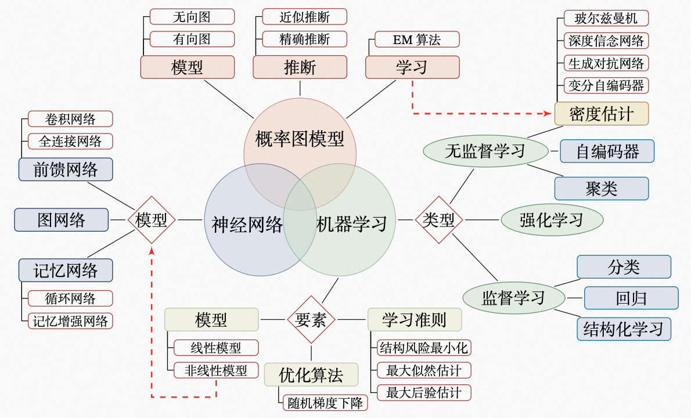

## AIGC&LLM Tech Business Notes

### 机器学习基础原理

### 1.AGI商业化-云计算平台基础

#### 1.1.商业化的思考

	--客户需求在哪里(行业) / 产品场景全链路 / 商业化定价与模式如何
	--从PaaS到SaaS. 定位是怎么样？AIGCaaS
	--2C为王/交易为王/高频为王
	--2B为什么比2C难做？因为当前技术没法细分领域垄断/从技术共建转化成产品沉淀的复杂度
	--AI机器学习平台 / AI生态应用工具 / LLM行业应用 --如何做到差异化
	--长期提供有竞争力的产品服务，其包括产品的质量，产品体验和产品的价格。
	--低价策略背后能够沉淀什么？产品能力 VS 业务商务能力 营销策略如何？
	--黑天鹅-安全可信合规

#### 1.2.思考: 人工智能 LLM 革命系列

https://ata.alibaba-inc.com/articles/256354

https://ata.alibaba-inc.com/articles/262624

### 2.NLP的突破-Transformer 模型

[Transformer **101问题**](https://www.notion.so/Transformer-101-a47acb277435483690b1eb772f65b610?pvs=21) 

[十分钟理解Transformer - 知乎](https://www.notion.so/Transformer-3d21622ac8cd41b08f96efd85ecd9ff4?pvs=21)

[**Transformer模型大盘点-Google AI**](https://www.notion.so/Transformer-Google-AI-680c0f3eb18a4832975bbd6a20a5b9d4?pvs=21)

[****Transformer模型有多少种变体？复旦邱锡鹏教授团队做了全面综述****](https://www.notion.so/Transformer-6686eabcff854ad18d9d907f2c8c849e?pvs=21)

[熬了一晚上，我从零实现了Transformer模型，把代码讲给你听](https://zhuanlan.zhihu.com/p/411311520)

[The Illustrated Transformer](https://jalammar.github.io/illustrated-transformer/)

### 2.LLM大模型对比

**2.1.LLM路径**

### 3.**ChatGPT的起源**

[拆解追溯 GPT-3.5 各项能力的起源](https://www.notion.so/GPT-3-5-360081d91ec245f29029d37b54573756?pvs=21) 

**[ChatGPT工作原理总结](https://ata.alibaba-inc.com/articles/259494)**

**1.GPT，GPT-2，GPT-3论文精读**

[GPT，GPT-2，GPT-3 论文精读【论文精读】_哔哩哔哩_bilibili](https://www.bilibili.com/video/BV1AF411b7xQ/?spm_id_from=333.337.search-card.all.click&vd_source=f5936d8ba3771bb1a3c2b76ca576cf60)

[探寻ChatGPT底层模型诞生之路 —— 3篇OpenAI关键论文解读](https://mp.weixin.qq.com/s/8_-F-k-0vu8g6mbEP_kDrw)

**2- GPT-3 开始-InstructGPT** 

**[Training language models to follow instructions with human feedback](https://arxiv.org/abs/2203.02155)**

新的对话数据集与InstructGPT数据集混合

[https://openai.com/blog/instruction-following/](https://links.jianshu.com/go?to=https%3A%2F%2Fopenai.com%2Fblog%2Finstruction-following%2F)

前面提到，GPT-3主张few-shot少样本学习，同时坚持无监督学习。

但是事实上,few-shot的效果，显然是差于fine-tuning监督微调的方式的。

InstructionGPT是基于GPT-3的一轮增强优化，所以也被称为GPT-3.5。

OpenAI给出新的答案： 在GPT-3的基础上，基于**人工反馈(RHLF）**训练一个reward model(奖励模型),再用reward model(奖励模型，RM)去训练学习模型。

使语言模型更大并不意味着它们能够更好地遵循用户的意图。例如，大型语言模型LLM可以生成不真实、有毒或对用户毫无帮助的输出。换句话说，这些模型与其用户不一致。在这篇文章中，我们展示了一种通过微调人类反馈来调整语言模型和用户在广泛任务中的意图的方法。从一组标注者编写的提示和通过OpenAI API提交的提示开始，我们收集了所需模型行为的标注者演示数据集，我们使用该数据集使用监督学习来微调GPT-3。然后，我们收集了一个模型输出排序的数据集，我们使用该数据集使用来自**人类反馈的强化学习**来进一步**fine-tunning**微调这个受监督的模型。我们将生成的模型称为**InstructGPT**。在对我们的即时分布的人类评估中，1.3B参数InstructGPT模型的输出优于175B GPT-3的输出，尽管其参数少了100倍。此外，InstructionGPT模型显示了真实性的提高和有毒输出生成的减少，同时在公共NLP数据集上具有最小的性能回归。尽管InstructGPT仍然会犯一些简单的错误，但我们的结果表明，对人类反馈进行微调是使语言模型与人类意图保持一致的一个有希望的方向。

InstructGPT 的训练流程分为三个阶段：

- 首先，通过监督学习对 GPT 进行微调，以获得更好的训练起点。监督学习微调SFT的过程是利用大量文本数据对 GPT 进行预训练，为其提供基本的语言理解和表达能力。
- 其次，训练一个能模拟人类反馈的奖励模型Reward。奖励模型训练的过程是收集人类对 GPT 输出内容的反馈，用于训练一个能够模拟人类评价的奖励模型。奖励模型可以评估 GPT 在不同场景下的表现，为后续强化学习提供依据。
- 最后，采用 RLHF（reinforcement learning from human feedback）思想来训练 InstructGPT。

相较于传统深度学习方法，**RLHF 使用了融合了 PPO 算法的 SFT 模型作为 Agent**，第二阶段训练出的奖励模型作为 Environment。SFT 模型的输入 Prompt 是 State，输出的 Response 是 Action，再结合奖励模型给出的 Reward。在 Agent 与 Environment 不断交互的过程中，最终训练出更接近人类思维和行为的模型。

****3.拆解追溯 GPT-3.5 各项能力的起源****

[https://yaofu.notion.site/GPT-3-5-360081d91ec245f29029d37b54573756](https://www.notion.so/GPT-3-5-360081d91ec245f29029d37b54573756?pvs=21)

4.**State of GPT：大神Andrej揭秘OpenAI大模型原理和训练过程**

https://mp.weixin.qq.com/s/zmEGzm1cdXupNoqZ65h7yg

**5.Sparks of GPT4-新鲜出炉的GPT-4 文档解读+分析**

https://ata.alibaba-inc.com/articles/263468

人工通用智能的火花：GPT4的早期实验

2.2.**Meta LLaMA: Open and Efficient Foundation Language Models**

https://ai.facebook.com/blog/large-language-model-llama-meta-ai/
****https://github.com/facebookresearch/llama/blob/main/MODEL_CARD.md

[Meta推出开源LLaMA，用1/10参数规模打败GPT-3，群"模"乱舞的2023拉开序幕](https://mp.weixin.qq.com/s?__biz=MzIwMDEwMDc0Nw==&mid=2453736276&idx=1&sn=574d06d59f44c1ead4a032914be8c33a&chksm=8137f5b0b6407ca64c9008c00948a1700f94124028ee71baf3399fc28aa884a45ac8a4542fa4&cur_album_id=2813917565419847683&scene=190#rd)

测试应用

**LLaMA—Standford alpaca**

https://crfm.stanford.edu/2023/03/13/alpaca.html

**LLaMA—Vicuna-排名第一**

[Vicuna: An Open-Source Chatbot Impressing GPT-4 with 90%* ChatGPT Quality](https://vicuna.lmsys.org/?spm=ata.21736010.0.0.7c5376cajOdrZV)

UC伯克利发布大语言模型排行榜，Vicuna夺冠，清华ChatGLM进前5 - 智源社区

**2.3.清华GLM**

2.4.Google PaLM2

https://ai.googleblog.com/2022/04/pathways-language-model-palm-scaling-to.html

2.5.多模态大模型-紫气东来

https://gitee.com/zidongtaichu/multi-modal-models

**6. RLHF模型代码可参考：**

OpenAI RLHF: https://spinningup.openai.com/en/latest/

RLHF：https://huggingface.co/blog/zh/rlhf

PyTorch-RLHF: https://github.com/lucidrains/PaLM-rlhf-pytorch

RLHF-PPO算法

[[细(戏)说]RLHF场景下的PPO算法的来龙去脉](https://zhuanlan.zhihu.com/p/631338315)

**Comments:**

1.GPT的涌现能力

2.复杂系统与大模型

3.Code与文本整合训练语料

4.英文与中文整合训练语料-生成翻译能力

5.把大模型训练好比化学实验炼丹，需要不断的尝试迭代。那么AI大模型基础框架(炼丹炉)的需求会爆发式的增长啊

6.模型参数的数量很重要，小参数比大参数效果好

7.寻找对称性的破坏的原因，因为复杂系统的涌现与复杂性

8.Statistical Mechanical of LLM

9.SFT与RLHF模型的占比 8:2

10.**OpenAI-Cookbook**

https://github.com/openai/openai-cookbook/tree/main/examples/vector_databases

11.ChatGPT与AI插件

GitHub ****Copilot / AutoPilot****

https://www.adept.ai/

****New Bing****

AutoGPT

15.****Compression as the Key to AGI - Jack Rae****

https://zhuanlan.zhihu.com/p/621201155

### **1.相比较于llama而言，llama2有哪些改进，对于llama2是应该如何finetune？**

llama和llama2都是一种大型语言模型（Large Language Model，LLM），它们可以用于多种自然语言处理的任务，如文本生成、文本摘要、机器翻译、问答等。l**lama是一种**基于Transformer的seq2seq模型，它使用了两种预训练任务，一种是无监督的Span级别的mask，另一种是有监督的多任务学习。llama将所有的下游任务都视为文本到文本的转换问题，即给定一个输入文本，生成一个输出文本。llama使用了一个干净的大规模英文预料C4，包含了约750GB的文本数据。llama的最大规模达到了11B个参数。**llama2是llama的改进版本**，它在以下几个方面有所提升：

数据量和质量：llama2使用了比llama1多40%的数据进行预训练，其中包括更多的高质量和多样性的数据，例如来自Surge和Scale等数据标注公司的数据。

上下文长度：llama2的上下文长度是llama1的两倍，达到了4k个标记，这有助于模型理解更长的文本和更复杂的逻辑。

模型架构：llama2在训练34B和70B参数的模型时使用了分组查询注意力（Grouped-Query Attention，GQA）技术，可以提高模型的推理速度和质量。

微调方法：llama2使用了监督微调（Supervised Fine-Tuning，SFT）和人类反馈强化学习（Reinforcement Learning from Human Feedback，RLHF）两种方法来微调对话模型（llama2-chat），使模型在有用性和安全性方面都有显著提升。

对llama2进行微调有以下步骤：

准备训练脚本：你可以使用Meta开源的llama-recipes项目，它提供了一些快速开始的示例和配置文件，以及一些自定义数据集和策略的方法。

准备数据集：你可以选择一个符合你目标任务和领域的数据集，例如GuanacoDataset，它是一个多语言的对话数据集，支持alpaca格式。你也可以使用自己的数据集，只要按照alpaca格式进行组织即可。

准备模型：你可以从Hugging Face Hub下载llama2模型的权重，并转换为Hugging Face格式。

启动训练：你可以使用单GPU或多GPU来进行训练，并选择是否使用参数高效微调（Parameter-Efficient Fine-Tuning，PEFT）或量化等技术来加速训练过程。具体命令可以参考这里。

### **2、什么是多模态，多模态中常见的SOTA模型有哪些？**

多模态是指涉及**多种模态（如图像、文本、音频、视频等）**的数据处理和分析。多模态学习是一种利用多种模态的数据来进行机器学习的方法，它可以挖掘不同模态之间的关联性和互补性，提高数据的表达能力和理解能力。多模态学习的应用场景非常广泛，例如图像描述、视觉问答、语音识别、跨模态检索等。多模态学习的意义在于，**它可以更好地模拟人类的认知和交互方式，提高机器的智能水平和用户体验。**多模态学习也可以克服单一模态数据的局限性和不足，例如缺失、噪声、歧义等，提高数据的完整性和可靠性。多模态学习还可以挖掘不同模态数据之间的潜在联系和规律，提高数据的价值和意义。

Vision Tr**ansformer (ViT)**：这是一种将自注意力机制引入计算机视觉领域的模型，通过将图像划分为**图像补丁并应用Transformer模型，实现**了在图像分类和目标检测等任务上的出色表现。

CLIP (Contrastive Language-Image Pre-training)：这是一种利用海量从网**络上搜集的图像-文本对进行对比学习的模型，使用一个图像编码器和一个文本编码器分别对图像和文本**独立编码，再以对比学习为优化目标训练模型。CLIP模型在零样本图像分类任务，以及图文匹配和检索等问题上取得了非常好的效果。

CoCa (Contrastive Captioners)：这是一种融合了单编码器、双编**码器和编码器-解码器三种结构的多模态模型，既能生成图像侧和文本侧独立的表示，又能进行**更深层次的图像、文本信息融合以及文本生成。CoCa在图像分类、图文检索、看图说话、VQA等多个任务上都取得了SOTA效果。

### **3、什么是stable diffusion,请你介绍一下diffusion模型的原理？**

Diffusion**模型是一种无监督的生成模型，它的基本思想是将一个真实的数据（如图像、文本、音频等）通过逐步添加高斯噪声的方式，转化为一个服从标准正态分布的随机变量。然后，通过一个反**向的去噪过程，从随机变量恢复出原始的数据。diffusion模型可以用于各种生成任务，如文本到图像、图像到图像、图像修复、图像绘制等diffusion模型有以下几个特点：

它不需要对数据进行复杂的建模，只需要一个简单的高斯分布假设。

它可以利用自注意力机制和Transformer结构来提高生成质量和效率。

它可以利用对比学习和CLIP模型来提高与文本描述的匹配度。

它可以利用潜在空间的扩散来降低计算复杂度和内存消耗。

Stable diffusion是d**iffusion模型的一种改进版本，它主要解决了原始的Diffusion模型在反向去噪过程中需要输入完整**尺寸的图像，导致速度慢和内存占用大的问题。stable diffusion的方法是先将图像压缩到一个低维的潜在空间，然后在潜在空间进行扩散和去噪，最后再将潜在空间的向量映射回原始空间。这样可以大大提高生成速度和节省内存。stable diffusion是一种生成模型，其原理基于Langevin动力学和扩散过程。其核心思想是通过多次迭代，逐渐将噪声信号演化为目标分布所对应的样本。具体原理如下：

- 初始化噪声信号为服从高斯分布的随机向量。
- 通过一系列的演化步骤，将噪声信号迭代地转化为目标分布的样本。每一步中，将当前噪声信号与目标分布的梯度信息结合，通过Langevin动力学方程进行更新，使噪声信号逐渐接近目标分布。
- 迭代的次数越多，噪声信号越接近目标分布，并最终生成目标分布的样本。

stable diffusion通过合理的选择演化步长和迭代次数，可以在生成样本的过程中平衡样本质量和生成速度。

### **4、instructGPT的原理，讲讲RLHF、SFT、和reward。**

instructGPT是一种基于强化学习的文本生成模型，其核心原理涉及两个概念：RLHF（Reinforcement Learning from Human Feedback）和reward shaping（奖励塑造）。

RLHF：在训练instructGPT时，首先使用有人类生成的示例对模型进行预训练。然后，通过与人类评估者进行交互，收集评估结果，以创建一个用于强化学习的数据集。该数据集包含了人类评估者对生成结果的评分或反馈，用于指导模型的强化学习训练。

Reward shaping：为了更好地引导模型的训练，reward shaping用于调整模型的奖励信号。通过将人类评估者的反馈与模型生成的文本进行比较，可以计算出一个差异度量，用作奖励信号的一部分。这样，模型可以根据这个奖励信号进行训练，并进行强化学习的训练。模型根据当前的状态（对话历史）生成文本，并通过奖励信号来评估生成文本的质量。模型的目标是最大化预期累积奖励，从而生成更高质量的文本。

通过RLHF和reward shaping的结合，instructGPT能够通过人类评估者的反馈指导模型的生成过程，并逐步提升生成文本的质量和一致性。监督微调（SFT）和人类反馈强化学习（RLHF）是两种用于微调大型语言模型的方法，它们的目的是使模型的输出更符合人类的偏好和价值观。它们的基本思想和步骤如下：

监督微调（SFT）：SFT是一种利用**人工标注的数据**来训练模型的方法，它可以使模型学习到一些基本的规则和约束，例如遵循人类的指令、避免有害或无用的输出等。SFT的步骤包括：

准备数据集：收集一些包含人类指令和期望输出的数据，例如Helpful and Harmless数据集，它包含了一些常见的对话场景和相应的标签。

训练模型：使用一个预训练好的语言模型，例如GPT-4，并在数据集上进行微调，使模型能够根据输入的指令生成合适的输出。

评估模型：使用一些评价指标，例如准确率、BLEU分数、ROUGE分数等，来衡量模型的性能和质量。

人类反馈强化学习（RLHF）：RLHF是一种**利用人类对模型输出的评价**来训练模型的方法，它可以使模型更好地适应人类的偏好和价值观，例如生成更有趣、更友好、更安全的输出等。RLHF的步骤包括：

训练奖励模型：收集一些包含人类对模型输出的评价或排名的数据，例如HumanEval数据集，它包含了一些由人类评价员对不同模型输出进行打分或排序的数据。

使用一个预训练好的语言模型，例如GPT-4，并在奖励模型上进行微调，使奖励模型能够根据输入和输出给出一个奖励值。

训练策略模型：使用一个预训练好的语言模型，例如GPT-4，并使用一种强化学习算法，例如近端策略优化（Proximal Policy Optimization，PPO），来更新模型参数。PPO算法会根据奖励模型给出的奖励值来调整模型生成不同输出的概率。

评估模型：使用一些评价指标，例如奖励值、人类标注、对话质量等，来衡量模型的性能和质量。

### **5、讲讲T5和Bart的区别，讲讲Bart的DAE任务。**

T5（Text-to-Text Transfer Transformer）和Bart（Bidirectional and Auto-Regressive Transformer）**都是基于Transformer的seq2seq模型**，可以用于多种自然语言处理的任务，如文本生成、文本摘要、机器翻译、问答等。它们的主要区别在于：

T5是一种基于Transformer的通用文本生成模型。T5的训练目标是将不同的自然语言处理（NLP）任务**统一为文本到文本的转换任务。**它采用了编码器-解码器结构，通过输入一个自然语言文本，输出另一个相关的自然语言文本，可以应用于机器翻译、摘要生成、问题回答等多个NLP任务。

Bart是建立在T5模型基础上的一个变种，**它专注于生成式任务**。Bart模型使用了自回归解码器，通过训练一个自编码器来重构原始文本，同时采用了标准的语言模型预训练目标，从而使得生成的文本更加流畅和连贯。Bart的主要应用领域包括文本生成、摘要生成、对话系统等。

在任务类型上，T5更加通用，适用于多种NLP任务的文本转换，而Bart则更加专注于生成式任务，并且在生成文本的质量和连贯性上有所优化。

关于Bart的DAE**（Denoising AutoEncoder）**任务，它是Bart模型的一种预训练目标。Bart的DAE任务是一种**利用自编码器来学习语言表示的方法，其基本思想是将一个真实的数据（如图像、文本、音频等）通过逐步添加高斯噪声的方式，转化为一个服从标准正态分布的随机变量。**然后，通过一个反向的去噪过程，从随机变量恢复出原始的数据。DAE任务要求模型从输入的有噪声的文本中恢复原始的无噪声文本。通过在训练过程中向输入文本中添加噪声，并要求模型重建无噪声的文本，**Bart可以学习到更好的文本表示和重构能力，从而提高生成文本的质量和准确性。**Bart在DAE任务中使用了以下几种噪声类型：

- Token Masking: 随机将一些token替换为特殊的[MASK]符号。
- Token Deletion: 随机删除一些token。
- Text Infilling: 随机将一段连续的token替换为一个[MASK]符号。
- Sentence Permutation: 随机打乱句子的顺序。
- Document Rotation: 随机选择一个token作为文档的开头。

### **6、讲讲Bart和Bert的区别。**

Bart和Bert是两个不同的预训练模型，它们之间的区别如下：

Bart是一种基于Transformer的生成式预训练模型，主要应用于文本生成、摘要生成、对话系统等任务。Bart采用了自回归解码器，通过自编码器预训练目标来重构输入文本，从而生成流畅、连贯的文本。

Bert（Bidirectional Encoder Representations from Transformers）是一种双向的预训练模型，用于生成文本的上下文表示。与Bart不同，Bert采用了双向的Transformer编码器，通过将上下文的信息融合到表示中，提供了更全面的语境理解能力。Bert主要应用于词嵌入、文本分类、命名实体识别等任务。

预训练**任务：Bert使用了**两种预训练任务，一种是无监督的掩码语言模型（Masked Languag**e Model**，MLM），另一种是有监督的下一个句子预测（Next Sentence Prediction，NSP）。Bart使用了一种去噪自编码**（Denoising Auto-Encoder，DAE）**的预训练任务，即在输入序列中加入不同类型的噪声，然后在输出序列中还原原始序列。

预训练数据：Bert使用了一个干净的大规模英文预料BookCorpus和Wikipedia，包含了约3300万个句子和2500万个词汇。Bart使用了一个小规模的英文预料XLM-R，包含了约1600万个句子和500万个词汇。

模型结构：Bert由Transformer的Encoder部分堆叠组成，具有双向的上下文表示能力。Bart由Transformer的Encoder和Decoder部分组成，具有自回归的生成能力。Bart相比于同等大小的Bert模型多了大约10%的参数。

总体上说，Bart侧重于生成式任务和文本生成，而Bert侧重于上下文表示和语境理解。它们在模型结构和应用场景上存在一定的差异。

### **7、对比学习负样本是否重要？负样本构造成本过高应该怎么解决？**

负样本是指在机器学习或深度学习的任务中，**与目标类别不匹配或不相关的数据样本。**负样本的作用是**帮助模型学习到区分不同类别的特征，提高模型的泛化能力和判别能力。**负样本的选择和采样方法会影响模型的性能和效率。例如，在目标检测任务中，数据集中部分图片没有出现目标，这些图片通常被称为负样本。在文本分类任务中，与某个类别不属于同一主题或情感的文本通常被称为负样本。

**对比学习负样本**是指与锚点（参考数据点）不相似或不相关的数据点，它们用于训练对比学习模型，**使模型能够学习到区分不同数据点的特征表示。**对比学习中负样本的重要性取决于具体的任务和数据。负样本可以帮助模型学习到样本之间的区分度，从而提高模型的性能和泛化能力。然而，负样本的构造成本可能会较高，特别是在一些领域和任务中。对比学习负样本的重要性在于：

它们可以提高模型的泛化能力和鲁棒性，因为它们可以使模型在面对多样化和复杂的数据时仍然能够保持较高的性能。

它们可以提高模型的判别能力和表达能力，因为它们可以使模型在学习到相似数据点之间的细微差异的同时，也能够忽略不相似数据点之间的无关信息。

它们可以提高模型的效率和效果，因为它们可以使模型在训练过程中更加专注于重要和有用的数据点，从而减少无效和冗余的计算。

对比学习负样本的构造成本过高是一个常见的问题，因为它们需要从大量的数据中进行筛选和采样，而且还要考虑到难度和多样性等因素。为了解决这个问题，有以下几种可能的方法：

降低负样本的构造成本：通过设计更高效的负样本生成算法或采样策略，减少负样本的构造成本。例如，可以利用数据增强技术生成合成的负样本，或者使用近似采样方法选择与正样本相似但不相同的负样本。

确定关键负样本：根据具体任务的特点，可以重点关注一些关键的负样本，而不是对所有负样本进行详细的构造。这样可以降低构造成本，同时仍然能够有效训练模型。

迁移学习和预训练模型：利用预训练模型或迁移学习的方法，可以在其他领域或任务中利用已有的负样本构造成果，减少重复的负样本构造工作。

使用一些简单而有效的采样策略，例如随机采样、困难采样、分层采样等，来根据不同的任务和目标选择合适的负样本。

使用一些基于自编码器或生成对抗网络等技术的方法，来生成一些具有一定难度和多样性的人工负样本。

使用一些基于互信息或对比损失等指标的方法，来动态地调整负样本的权重或数量，以适应不同阶段的训练目标

### **8、介绍一下Lora的原理和ptuning的原理。**

***Lora方法的核心是在大型语言模型上对指定参数增加额外的低秩矩阵***，也就是在原始PLM旁边增加一个旁路，做一个降维再升维的操作。并在模型训练过程中，固定PLM的参数，只训练降维矩阵A与升维矩阵B。

ptuning方法的核心是使用可微的virtual token替换了原来的discrete tokens，且仅加入到输入层，并使用prompt encoder（BiLSTM+MLP）对virtual token进行编码学习。

### **10.什么是Langchain，原理是什么，有什么应用？**

"nolink">Langchain是一个用于开发基于语言模型的应用程序的框架，它可以简化构建高级语言模型应用程序的过程。它提供了一套工具、组件和接口，可以轻松管理与语言模型的交互，将多个组件链接在一起，并集成额外的资源，例如API和数据库。

Langchain的原理是：

在langchain中，Component是模块化的构建块，可以组合起来创建强大的应用程序。Chain是组合在一起以完成特定任务的一系列Components（或其他Chain）。

langchain使用了两种预训练任务，一种是无监督的Span级别的mask，另一种是有监督的多任务学习。langchain将所有的下游任务都视为文本到文本的转换问题，即给定一个输入文本，生成一个输出文本。

Langchain使用了一个干净的大规模英文预料C4，包含了约750GB的文本数据。langchain还支持多种语言模型，例如GPT-4、T5、Bart等。

Langchain提供了用于处理不同类型的索引和检索器的工具和功能，例如矢量数据库和文本拆分器。这些可以用于文档检索、聚类和相似性比较等任务。

Langchain提供了一种名为Agent的抽象，表示在框架中驱动决策制定的实体。Agent可以访问一套工具，并可以根据用户输入决定调用哪个工具。Agent帮助构建复杂的应用程序，这些应用程序需要自适应和特定于上下文的响应。

Langchain有很多应用场景，例如：

文本生成：langchain可以根据任意的文本输入生成高质量、高分辨率、高逼真的图像，例如你可以输入一个故事的开头，然后让langchain为你生成相应的插图。你也可以输入一个图像的描述，然后让langchain为你生成相应的图像。这些功能可以用于创作、教育、娱乐等领域。

对话系统：langchain可以作为一个智能的对话伙伴，与用户进行自然、流畅、有趣的对话，例如你可以和langchain聊天，询问它的喜好、经历、想法等。你也可以和langchain玩游戏，比如猜谜语、讲笑话、唱歌等。这些功能可以用于社交、咨询、娱乐等领域。

信息检索：langchain可以根据用户的查询，从海量的数据中快速、准确地检索出相关的信息，例如你可以向langchain提问，它会为你返回最合适的答案或链接。你也可以向langchain描述一个需求，它会为你推荐最适合的产品或服务。这些功能可以用于搜索、推荐、购物等领域。

### **Explanation of terms**

➢**Prompt**：提示，通过构造提示模板，期待能唤醒语言模型预训练阶段的记忆，从而无需微调直接做出预测

➢**ICL**（In-context Learning）：上下文学习，构造上下文范例，将原始数据集 <x, y> 改造成 <in-context examples, x, y>，期待模型能结合上下文产生正确的预测，也是一种无需微调引导模型预测的技术

➢**Instruction Tuning**：指令微调，指对原始数据集 <x, y> 改造成类 <instruction, x, y> 的形式，使得语言模型除了学会 x 到 y 的映射以外，还学到了自然语言指令 instruction 的含义。从而无需在特定下游任务微调，通过自然语言指令直接与模型进行交互，让模型做特定的预测

➢**CoT**（Chain of Thought）：思维链，调教语言模型的一种手段，在让语言模型做预测前，加上一句魔法指令 "let's think step by step"，从而大幅提升语言模型的预测正确率，尤其是某些复杂的数学求解问题

~~~~~~~~~~~~~~~~~~~~~~~~~~~~~~~~~~~~~~~~

➢**AGI**（Artificial general intelligence）：通用人工智能

➢**BERT**（Bidirectional Encoder Representation from Transformer）：基于 Transformer 的双向编码器表征技术

➢**MLM**（Mask Language Modeling）：掩码语言模型，BERT 的代理任务之一，对句子挖空，然后预测空缺，从而挖掘语言知识

➢**GPT**（Generative Pre-trained Transformer）：基于 Transformer 的生成式预训练模型

➢**LLM**（Large Language Model）：大型语言模型，如 BERT 和 GPT

➢**Word2Vec**（Word to Vector）：一种将词转为稠密向量的模型

➢**NLP**（Natural Language Processing）：自然语言处理

➢**CNN**（Convolutional Neural Network）：卷积神经网络

➢**RNN**（Recurrent neural network）：循环神经网络

➢**Un/Self-supervised**：无/自监督，表示在无标签的数据集上设计一些代理任务来挖掘数据集内部蕴含的知识分布

➢**Pretrain**：预训练，通常和自监督相关，表示在代理任务上对模型预训练，学到的知识靠近代理任务，一般比较抽象，抽象层级越高的知识，通常能迁移到更广泛的下游任务上

➢**Finetune**：微调，通常是在预训练完成之后，在下游任务上对模型参数做进一步更新，以期学到专注领域的知识

➢**OOD**（Out-of-Domain）：领域之外，表示数据不在一个分布、领域之内，比如相对医药领域，音乐知识就是 OOD

➢**GD**（Gradient Descent）：梯度下降，一种数学优化算法，通过往梯度的反方向更新参数，以求得最优解

**➢epoch：**epoch是神经网络训练过程中的一个重要概念，通俗来说，一个epoch等于使用训练集中的全部样本训练一次的过程。当一个完整的数据集通过了神经网络一次并且返回了一次，即进行了一次正向传播和反向传播，这个过程称为一个epoch。epoch与batch和iteration一起被称为神经网络训练的三个基本概念。

**➢sequence length**: 其作用只是在每个序列达到它的实际长度后，把后面时间步的输出全部置成零、状态全部置成实际长度那个时刻的状态。

**➢神经网络训练：**

训练一个神经网络通常需要提供大量的数据，我们称之为数据集。**数据集一般被分为三类，即训练集(training set)，验证集(validation set)和测试集(test set)。**

一个epoch就是等于使用训练集中的全部样本训练一次的过程，所谓训练一次，指的是进行一次正向传播（forward pass）和反向传播( back pass )。

https://ai-studio-static-online.cdn.bcebos.com/22834a91ea8045718000e27dfe6b29484cac398e3bf348568fc02b0fbbddcd73

当一个epoch的样本（也就是训练集）数量太过庞大的时候，进行一次训练可能**会消耗过多的时间**，并且每次训练都使用训练集的全部数据是不必要的。因此，我们就需要**把整个训练集分成多个小块，也就是就是分成多个Batch来进行训练**。

一个epoch由一个或多个batch构成，batch为训练集的一部分，每次训练的过程只使用一部分数据，即一个batch。我们称训练一个batch的过程为一个iteration。

**当确定了epoch的个数和batch的大小，我们可以计算出iteration的个数，如图所示：**

https://ai-studio-static-online.cdn.bcebos.com/f13d24111734424d923495026f810c1386811235de1a4c2d81622aa3ed9ae377

通常来说，epoch的个数由不同的问题会存在不同的取值，我们经常看到的epoch个数为10，100，200等，但是这不是绝对的。其可以**在1到无穷中任意取值**。

总结下训练神经网络中最最基础的三个概念：Epoch, Batch, Iteration。

!https://pic3.zhimg.com/80/v2-18f7f8e6cf5c827217f076483f16e986_1440w.webp

## **2. 换算关系**

\mathbf{Number ~ of ~ Batches = \frac{Training ~ Set ~ Size}{Batch ~ Size}}

实际上，梯度下降的几种方式的根本区别就在于上面公式中的 Batch Size不同。

!https://pic3.zhimg.com/80/v2-a6c363c19d2cc4aa4ec90a7ed98cb776_1440w.webp

- 注：上表中 Mini-Batch 的 Batch 个数为 N / B + 1 是针对未整除的情况。整除则是 N / B。

## **3. 示例**

CIFAR10 数据集有 50000 张训练图片，10000 张测试图片。现在选择 Batch Size = 256 对模型进行训练。

- **每个 Epoch 要训练的图片数量：**50000
- **训练集具有的 Batch 个数：**50000 / 256 = 195 + 1 = 196
- **每个 Epoch 需要完成的 Batch 个数：**196
- **每个 Epoch 具有的 Iteration 个数：**196
- **每个 Epoch 中发生模型权重更新的次数：**196
- **训练** 10 **代后，模型权重更新的次数：**196 * 10 = 1960
- **不同代的训练，其实用的是同一个训练集的数据。第** 1 **代和第** 10 **代虽然用的都是训练集的五万张图片，但是对模型的权重更新值却是完全不同的。因为不同代的模型处于代价函数空间上的不同位置，模型的训练代越靠后，越接近谷底，其代价越小。**

