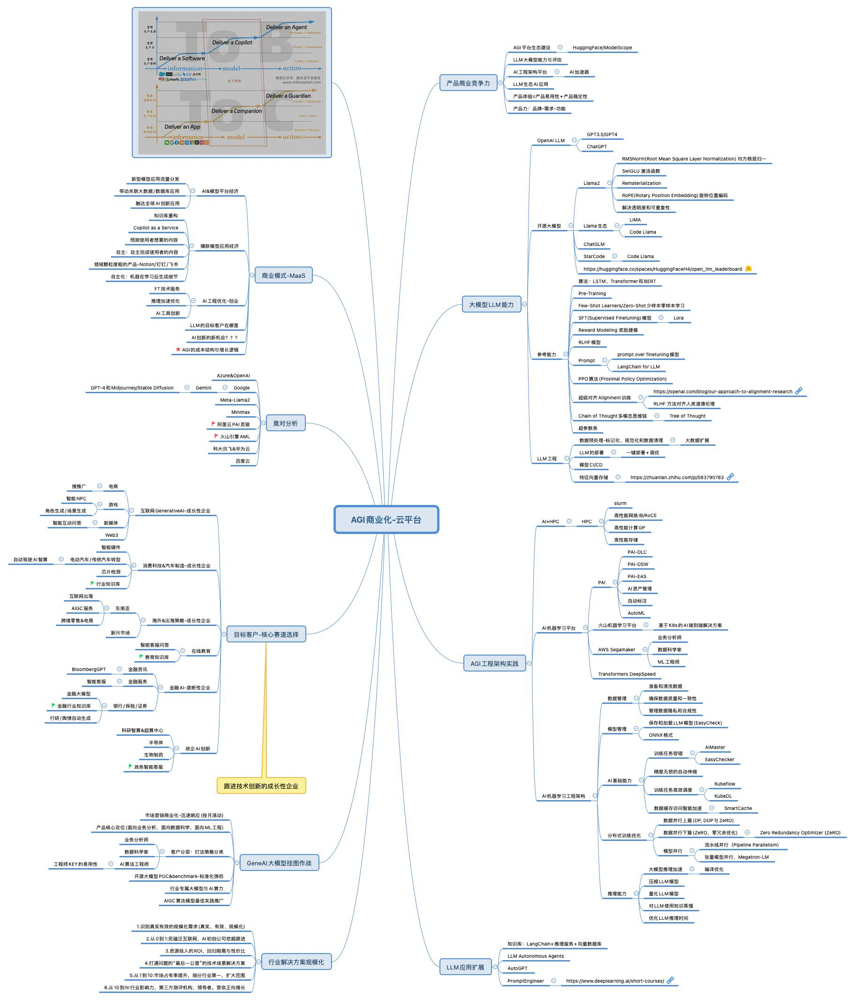

## AIGC&LLM Tech Business Notes

#### AGI商业化-云平台

#### 商业化的思考

客户需求在哪里(行业) / 产品场景全链路 / 商业化定价与模式如何

从PaaS到SaaS. 定位是怎么样？AIGCaaS

如何服务好LLM的从业者们，AI生态的建立(HuggingFace/ModelScope)

AI机器学习平台 / AI生态应用工具 / LLM行业应用 --如何做到差异化

整体规划(哪些行业不做)  / 商业化路径(从0到1，1到N) 

--组织：热点对接快，产品场景准，相关业务物料(doc,ppt,demo,效果展示,视频)

--长期提供有竞争力的产品服务，其包括产品的质量，产品体验和产品的价格。
--2C为王/交易为王/高频为王
--2B为什么比2C难做？因为当前技术没法细分领域垄断。
--低价策略背后能够沉淀什么？产品能力 VS 业务商务能力 营销策略如何？
--黑天鹅-安全可信合规

#### LLM Demo开发

https://github.com/aigc-apps/LLM_Solution

