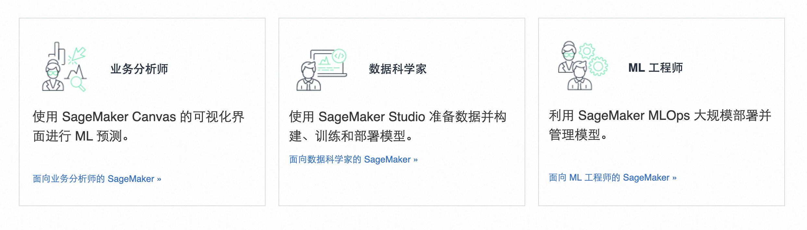
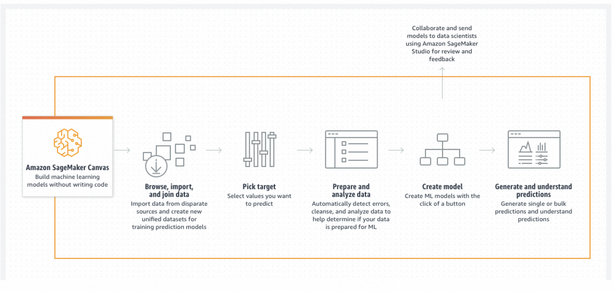
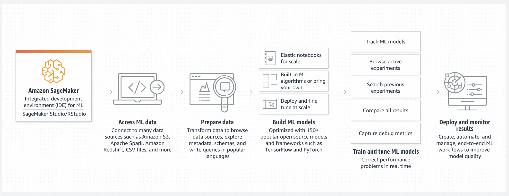
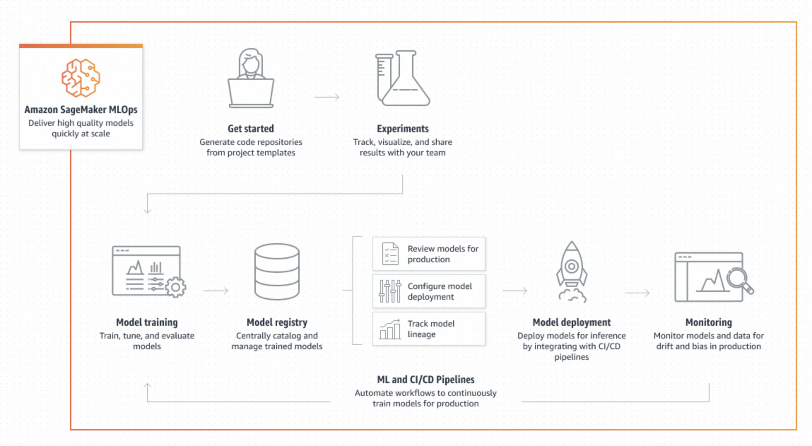
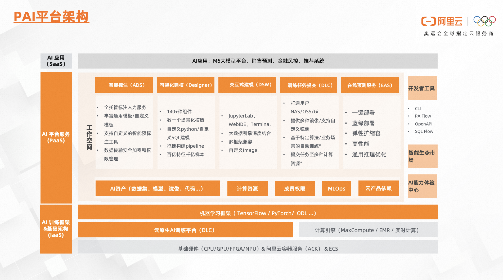
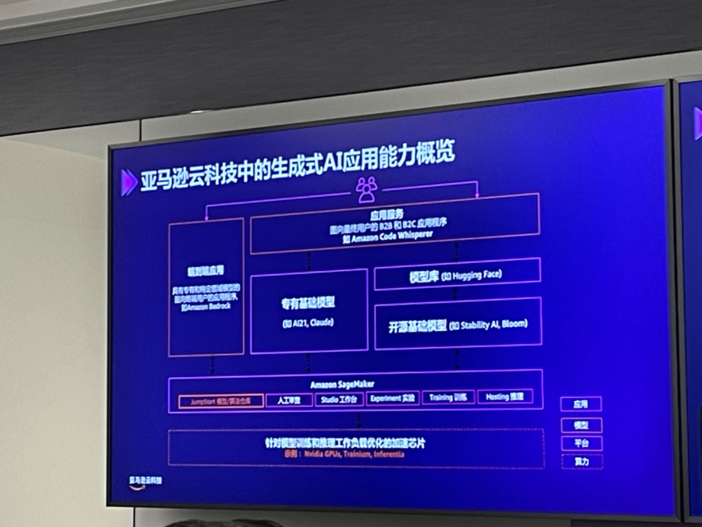
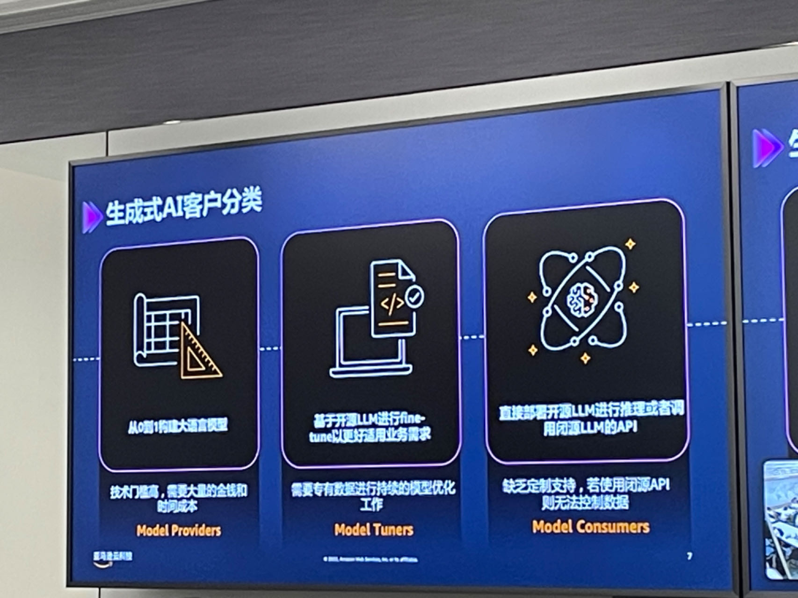
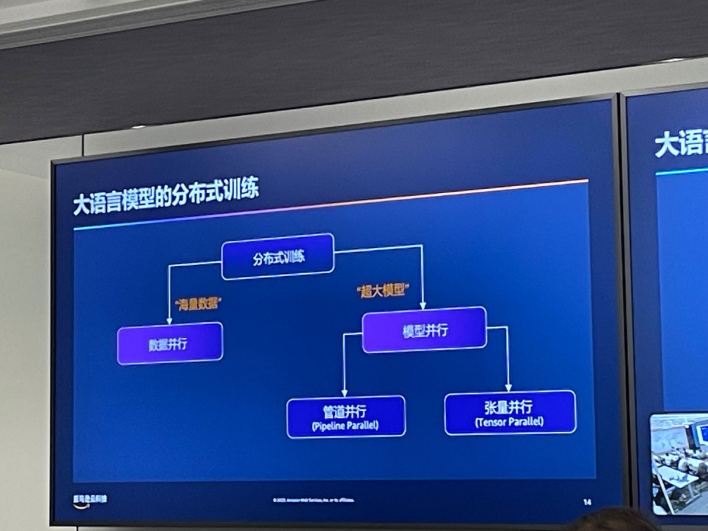
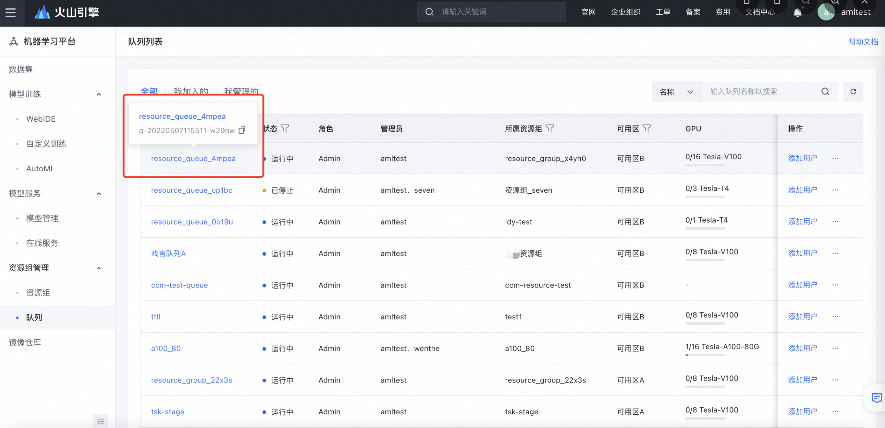

## AI DeepLearning Development Notes

### 1.AI深度学习开发场景

**For BA Engineer**

**For DS Engineer**

**For ML Engineer**

### 2.AI机器学习开发最佳实践

统一Workflow

### 3.机器学习工程平台

_**AliCloud PAI机器学习平台**_

_**AWS SegaMaker**_

_**火山引擎-机器学习平台**_

DeepSpeed Megatron-LM

### 3.ModelaaS

阿里云AI服务
- 模型广场-ModelScope
- 模型推理-DashScope/PAI-EAS
- 模型评测-Damo多语言多模态测试基准 M3Exam

M3Exam 有三个特征：
	Multilingual 多语言：我们综合考虑语言特点、资源高低、文化背景等多个因素，挑选了 9 个国家对应的语言，涵盖英文、中文、意大利语、葡萄牙语、越南语、南非荷兰语、斯瓦希里语、泰语、爪哇语，所有问题均来自于对应国家的官方试题。
	Multimodal 多模态：我们同时考虑纯文字以及带图片的题目，并且认真处理了所有图片从而方便模型进行处理。
	Multilevel 多阶段：我们考虑三个重要的教育阶段：小升初、初升高、高中毕业，并且从对应阶段的官方考试取得题目，使得可以比较不同阶段对应的不同智力要求下，模型的表现差异。

火山方舟-大模型服务平台
- 模型广场-HuggingFace
- 模型推理
	Lego算子优化
	ByteTransformer
	LightSeq训练加速引擎
- 模型精调-一键精调
- 模型评测-评测工具
- 运营干预
- 应用插件

训推一体？？
大模型矩阵-1+n
大模型安全-安全可信

加速大模型，大算力应用落地
--模型训练曲线--逐步放缓
--推理需求曲线--模型应用曲线

机器学习模型的数字化

### 5.AI+HPC

How to design HPC Cluster

### 6.LLM Ecosystem-LangChain

https://github.com/aigc-apps/LLM_Solution

### Ref

-- [大幅优化推理过程，字节高性能Transformer推理库获IPDPS 2023最佳论文奖](https://mp.weixin.qq.com/s/5TM4PXTUBZuOfZlltFfrsQ)
