## 导读:
本文将分享当前云原生大数据架构的发展历程/架构定义/核心能力/应用场景及趋势思考。主要包括以下四个部分：

- 从大数据上云看架构
- 云原生数据平台的核心能力
- Data+AI with Cloud-Native
- 未来趋势与思考

## 01-从大数据上云看数据架构演进

### 1.大数据AI的前世今生

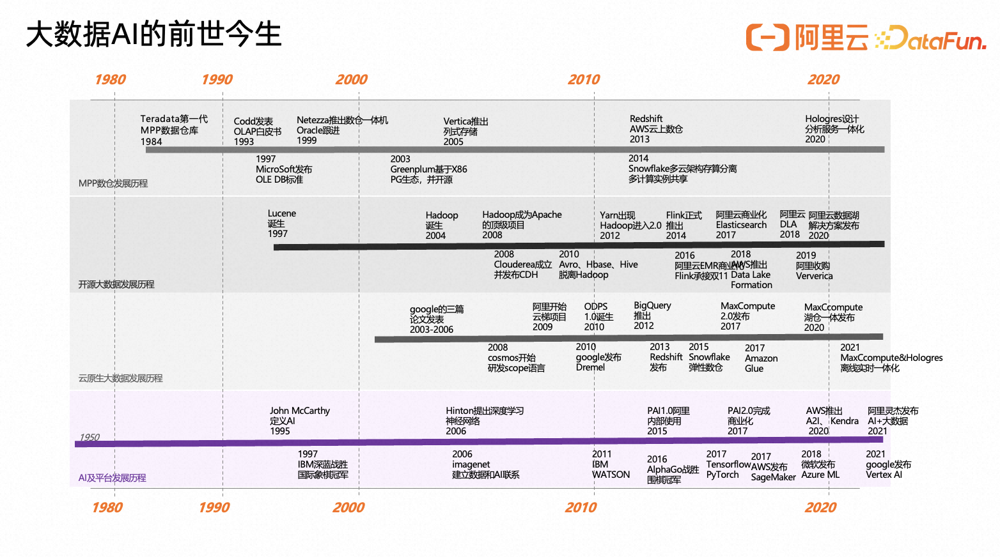

当今大数据AI早已成为IT技术发展的核心引擎。回望过去, 其技术演进的发展历经的几个重要阶段。从80年一体化TD数仓诞生到到2004年Hadoop出现分布式大数据架构，再到现在的大数据上云兴起。可以分为四个阶段, 从ScaleUp-共享存储架构、ScaleOut-大规模并行处理、SQL-ON-Hadoop、湖仓一体的数据架构。每个阶段都有各自的技术特点，也是适应当时环境而产生的。
（1）第一代架构：以共享存储的架构为代表（share storage），支持的节点很少，扩展困难，只能支撑报表分析的场景为主。
（2）第二代架构：以大规模并行处理 MPP 架构为代表（share nothing），节点规模能够达到百级，能够处理的数据规模得到了一定提升，但仍存在限制。
（3）第三代架构：以 Hadoop、Spark 为代表，基于分布式的存储、分布式的资源调度，获得了更大规模的集群规模及数据处理规模。
（4）第四代架构：湖仓一体架构，在新的网络传输速度背景下，基于统一的分布式存储、数据湖仓

融合技术，支持多种类型计算引擎，从而满足更多分析场景的需求。
其中伴随着AI深度学习蓬勃发展，云原生大数据AI一体化大行其道。阿里云在其中也扮演了重要的角色。从中我们能看到大数据统一架构趋势与新的变化。

### 2.大数据经典架构的组成

首先是大数据进入后红海时代, 从之前全面技术发展期已经进入到成熟期。其标志性特点在于大数据体系内容已经沉淀出经典技术架构方向。 此图可以理解为当今大数据最典型的技术架构图例。

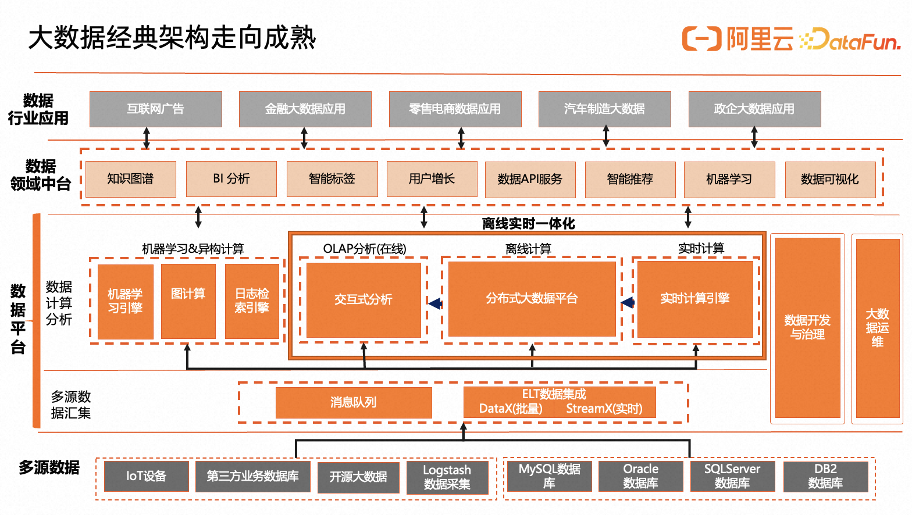

其从下往上分别是
1.多源数据接入-包括IoT设备/第三方业务DB等等
2.多源数据汇聚与整合-其包括消息队列 / ELT数据集成 (离线数据同步/实时数据同步等)
3.由于数据计算需求的多样性，面向离线/在线/实时等多种场景下, OLAP分析引擎/离线计算/实时计算引擎等多种数据计算分析的多种能力，机器学习平台引擎/图计算/日志检索引擎等等
（1）流批计算引擎：经过多年的迭代演进，Spark 和 Flink 逐渐成为企业级主流计算框架，目前呈现出擅长不同场景的态势：Spark 擅长高吞吐量的计算，以及机器学习、图计算等场景；而 Flink 则擅长实时性要求高、流批一体等场景；不同企业的选择也不尽相同。
（2）实时分析引擎：以 MPP 架构为例，近年来不断涌现新的 MPP 查询引擎、MPP 数据库，每个引擎都有各自擅长的场景，并处于快速发展和升级中，因此，各个企业的选择差异较大。
（3）机器学习平台引擎：伴随着AI机器学习需求的不断激增, AI机器学习平台变得越发重要, 帮助企业在传统机器学习/深度学习领域进行AI工程化的实践。
（4）图计算引擎：
4.数据领域中台的建设，从传统的搜索推荐与用户增长，再到知识图谱与当前GPT大模型的兴起，其带动数据AI能力的在多领域深度应用。
5.数据行业应用与价值转化：面向千行百业提供广泛的大数据AI业务价值变现路径。

### 3.大数据经典架构的背后挑战

其二是在此如火如荼的大数据经典架构背后，存在一直无法弥补的技术鸿沟。

如左图所示，抽象来看是所有大数据架构大多都由图中梳理出的9大领域架构组件来组成。万变不离其中。分布式存储 / 分布式调度 / 元数据服务 / 框架与接入层 / 多种计算模式 / 数据开发与应用工具 / 智能化 / 安全与隐私保护 / 运维。

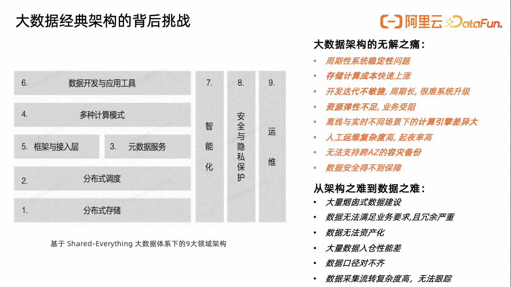

而围绕着这9个大数据领域架构下，我们能看到真实业务场景下背后的大数据架构的持续面临的未解之痛与以及架构之上的数据之难。
•	周期性系统稳定性问题
•	存储计算成本快速上涨
•	开发迭代不敏捷, 周期长, 很难系统升级
•	资源弹性不足, 业务受阻
•	离线与实时不同场景下的计算引擎差异大
•	人工运维复杂度高, 起夜率高
•	无法支持跨AZ的容灾备份
•	数据安全得不到保障

一直未能被解决是因为当前架构的未解之痛, 很难单点孤立的来破解。其关联问题不断地考验着大数据架构师的能力边界, 周期性的困境让技术人员一直如鲠在喉, 难以破解。于是我们在思考是不是有全新的技术架构能够更加全面的解决现在的未解之痛。

### 4.云计算对数据架构的体系重构

似乎云计算尝试给我们新的解决思考与实践路径, 面对现有大数据架构下无解之痛与数据之难。

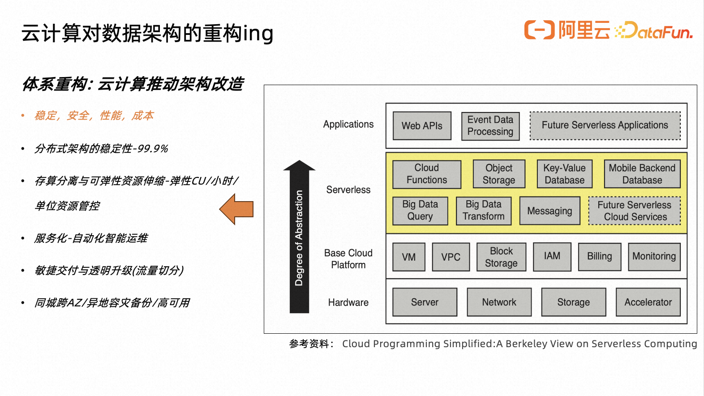

围绕着稳定，安全，性能，成本等四个核心维度，云计算与其云原生架构深刻改变传统数据架构的固有体系。使用云原生技术是对系统架构的一次重新编排与重构。如何持续确保分布式的稳定性与容错性，解决周期性系统异常的问题。存算分离后所带来的可弹性资源伸缩能力。服务化的自动化智能运维。敏捷交付与通过流量切分方式透明升级产品架构。

- 多样且几乎无限的资源通过 Service API 的形式提供，对于资源的调度和分配可以通过代码完成，这是革命性的变革。
- 一切资源明码标价(提前预估)，所以程序优化的方向从过去的一维的榨取最好的性能（因为硬件的成本已经事先支付），变成一个动态弹性的问题：尽量花小钱办大事, 动态调整。
- 云上的大数据产品，首先应该是多个自治的微服务组成的网络。云统一服务应该是无状态的（无副作用），方便快速的弹性扩展。放弃对于同步语义的坚持，这个世界是异步化且不可靠的。

很多时候, 从我们看来, 云计算不止是当作一种商业模式, 它同样也是对技术体系的新构建。

## 02-云原生数据架构的核心能力

### 1.云计算+大数据-架构进化：统一与解耦

很多时候我们都把云计算/大数据/AI能力并列当今技术领域三大重要方向。其实从另一维度来看到云计算所具备的核心新特性正在深刻的影响与推动数据架构向下一阶段演进与发展。

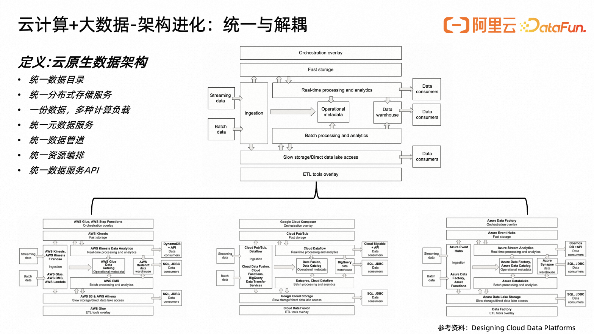

此图罗列了当前AWS/GCP/Azure三大云厂商大数据典型架构与产品组件，可以看到其在搭建在其各自的云计算平台之上的大数据产品体系都有着相同类似的云数据架构，从统一数据目录/统一分布式存储服务/离线在线实时等多种计算负载/统一元数据服务/统一数据管道/统一资源编排/统一数据服务API等等。在多个统一共享组件背后是基于云原生的Shared-Everything大数据架构，彻底的架构解耦将统一共用组件作为Serverless全局服务, 成为新的技术趋势。是新定义的云原生数据架构。

### 2.云计算+大数据-能力进化：Serverless与模块化

在新一代云原生数据架构体系下，云计算+大数据协同所带来的核心产品能力有更多的突破与进化。
当我们用更长的眼光去看的时候就会发现，我们要做的并不再是一个大数据产品软件，而是一个大数据服务，后者是包含前者的。这个认知的转变是云原生数据架构区别于经典分布式大数据架构主要差异，是最重要的一步。大数据服务形态也诞生了很多新的关键能力。以1+N+1的能力分层为主。

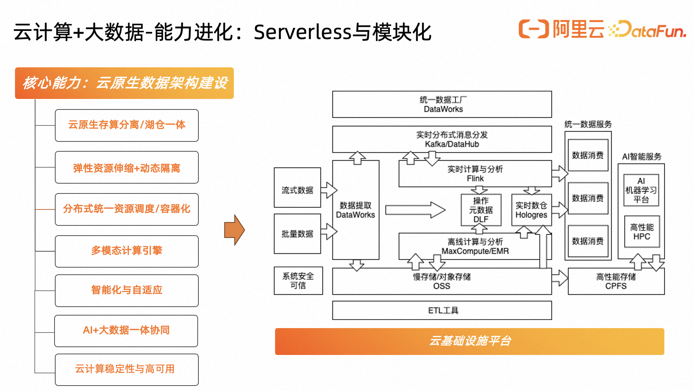

1是在云基础设施平台之上云原生存算分离与湖仓一体平台架构。此架构基本已经成为当前云计算数据平台的事实标准。以右图阿里云数据架构可见,在统一云基础设施平台之上, StorageLayer / StorageOptimizer / ComputeLayer 三层存算分离架构，支持两个不同形态。
（1）在数据仓库上支持数据湖（仓边建湖一体）：一般是通过在数仓中建外部表来实现，解决数据仓库如何更加灵活，以数仓为核心，支持访问数据湖。代表产品有 Snowflake, MaxCompute 等。
（2）在数据湖中支持数仓能力（湖上建仓一体）：一般是以数据湖存储为基础，在数据湖之上构建数据仓库的服务层，强化数据治理和数据服务的提供。代表产品是 Databricks，EMR等。

无论是仓边建湖还是湖上建仓，**对于云原生的数据产品而言，如何能利用好统一对象存储都会是关键** 

N是云原生数据架构详细能力建设。分别是
	- 弹性资源伸缩+动态隔离
	- 分布式统一资源调度/容器化
	- 多模态计算引擎
	- 智能化自适应能力
	- AI+大数据一体协同
	之后将具体分开讲述

最后1个1是云计算数据架构的基石。以云端冗余的基础资源来扩充与提升整体系统稳定性与高可用。

### 3.云原生数据架构核心能力1-弹性资源伸缩&动态隔离

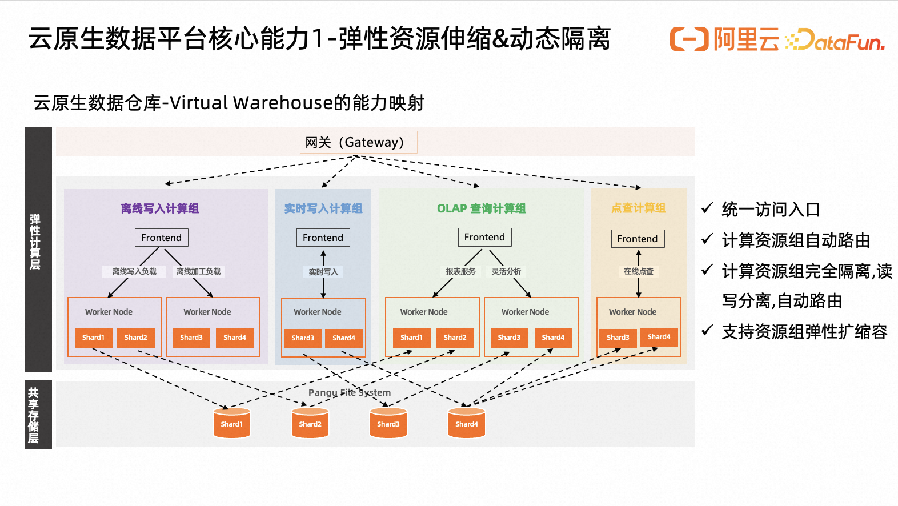

弹性资源伸缩&动态隔离能力是在云计算的存算分离架构之上，将资源按照不同业务需求来具体拆分，资源单位从Quota/计算资源组/实例/虚拟机等多细粒度提供扩缩容能力。其快速的弹性资源启动扩缩容时间(弹性CU/SpotJob等模式)，精准分配资源动态变化，完全扩展了云原生数据产品的使用场景和易用性；进一步的Scale-to-Zero，在多数场景中极大降低了资源使用的成本，随用随取。另外是动态资源隔离确保资源与资源互相不抢占。以上图为例，阿里云Hologres的VirtualWarehouse能力

•    一个实例拆分成不同资源的计算组，对外应用只提供一个访问入口endpoint，减少应用维护麻烦
•    可以随时设置默认资源组，通过用户账号进行计算组自动路由。
•    计算组之间的资源完全隔离，可以实现写写隔离、读写隔离、读读隔自动切流离等多种隔离方式
•    可以通过单独对计算组的扩缩容，实现资源的极致弹性利用，支持计算组的热扩缩容，降低对服务的影响

### 4.云原生数据架构核心能力2-统一资源调度容器化

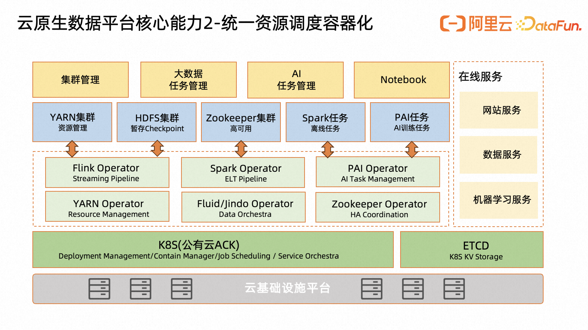

容器 + Kubernetes，是每个云都绕不开的必要服务。就像 Linux 一样，K8s 是云的操作系统, 统一计算资源池化的管理是云上必须要做到的。只有在云上实现统一调度与资源池化才能打破离线与实时之间的计算资源的不平衡，从而实现支持离线实时/大数据与AI不同计算资源的高效协同应用。

- 通过统一算力资源池实现资源统筹调度，对资源细粒度的优化管理与调度很有帮助。
- 可以将离线计算与其它在线计算任务进行资源混部达到峰谷互补的效果，有助于提升服务器资源利用率和管理运维效率。
- 可以根据业务优先级来为不同业务计算任务分配对应资源，确保资源间不存在资源抢占。
- 基于容器化任务调度, 支持多种调度方式。阿里云ACK容器服务为例, All-Or-Nothing类型任务的Gang Scheduling(在并发系统中将多个相关联的进程调度到不同处理器上同时运行的策略)、通过弹性配额提高集群整体资源利用率的Capacity Scheduling。最主要的原则是保证所有相关联的进程能够同时启动，防止部分进程的异常，避免整个关联进程组的阻塞。
- 在离线混部在集群中的资源灵活切换与调用。

从集群维度来看，混部是将多种应用在一个集群内部署，通过预测分析应用特性，实现业务对集群资源的充分利用；从节点维度来看，混部是将多个容器部署在同一个节点上，这些容器内的应用既包括在线类型，也包括离线类型。根据应用对资源质量需求的差异，在线应用可以归纳为延时敏感型LS（Latency Sensitive），通常对请求压力（QPS）或访问延迟（RT）等指标有明确的要求，对资源质量较为敏感；离线应用可以归纳为资源消耗型BE（Best Effort），通常是一些计算密集型的任务类应用，有较好的容错重试能力，对资源质量的要求相对较为宽松。

### 5.云原生数据架构核心能力3-统一数据湖管理BigMeta

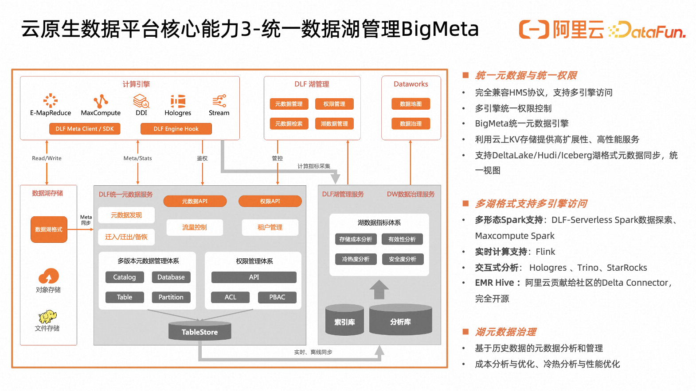

从客户视角来看，还是从云原生数据架构的需求来看，需要在基于云计算分布式存储之上的独立统一元数据管理体系，来支持多种计算引擎的元数据信息，来管理数据湖上结构化与非结构化的数据存储。在过去的业务实践中，有多位重要客户愿意采用类似Aliyun DataLakeFormation的数据湖元数据管理产品，用来补全云原生数据架构的重要一块拼图。实现对湖上数据管理的最佳实践。其能力包括:
- 统一元数据与统一权限
- 多湖格式支持多引擎访问
- 湖上元数据治理

### 6.云原生数据架构核心能力4-多模态计算引擎

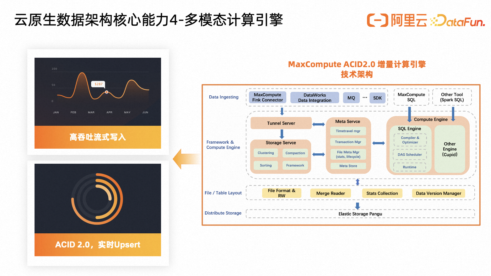

多模态计算引擎能力在这里指的是基于云原生LakeHouse湖仓一体架构上的离线近实时增量处理一体化实践。不同模态下的分钟级的增全量数据读写以及数据处理的能力, 能够真正满足业务对离线实时不同数据计算的复杂需求。以阿里云MaxCompute数仓为例，其实时增量处理引擎ACID2.0引擎，提供Upsert，TimeTravel等一系列湖仓能力。其设计主要集中在五个模块：数据接入、计算引擎、数据存储优化，元数据管理，数据文件组织。
-- 数据接入主要支持流式数据的高并发分钟级增量数据写入能力
-- 将近实时增量更新语义加入到SQL引擎中去。
-- Storage Service来负责智能的自动管理增量数据文件，其中包括小文件合并Clustering，数据Compaction，数据排序等优化服务。
-- 元数据管理主要负责增量场景下数据版本管理，Timetravel管理，事务并发冲突管理，元数据更新和优化
-- 数据文件组织主要包含对全量和增量数据文件格式的管理以及读写相关的模块

### 7.云原生数据架构核心能力5-智能自适应

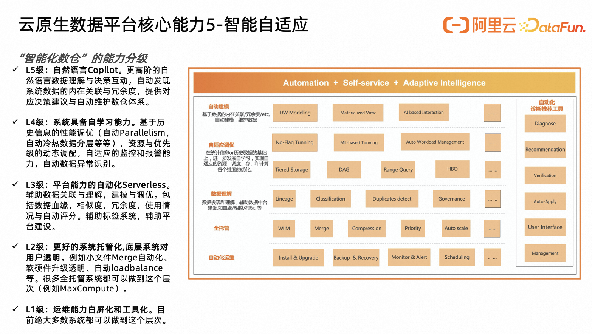

云原生架构所带来的Serverless能力不断迭代能够持续简化大数据产品的运维管理复杂度。
智能自适应是Serverless产品的必要能力。面向优化对象往往是作业集合，会利用丰富的历史统计信息、元仓、作业运行信息、海量的各种各样的query；有利于进一步AI for System，利用机器学习的能力做更好的系统决策。AI for System类似与大数据的‘自动驾驶’，可分为5级。

​	L1级：运维能力白屏化和工具化
​	L2级：更好的系统托管化,底层系统对用户透明
​	L3级：平台能力的自动化Serverless
​		辅助数据关联与理解，建模与调优。包括数据血缘，相似度，冗余度。数据平台健康分评估等
​	L4级：系统具备自学习能力
​		数据分布优化-distribution key推荐/sort key推荐面向data skipping优化/智能推荐和自动clustering
​		资源分配优化-用机器学习方法预测作业需要的资源消耗以及运行时间。选择执行的queue，提升小作业执行时间以及提升整体throughput/基于Query Predicator Framework，根据作业特征（执行计划、预估数据量等）预测，使用XGBOOST model。
​		物化视图智能推荐
​	L5级：自然语言Copilot
​		更高阶的自然语言数据理解与决策互动，自动发现系统数据的内在关联与冗余度，提供对应决策建议与自动维护数仓体系

## 03-Data+AI with 云原生

云原生大数据架构离不开AI的加持与协同，这部分我们分享一下Data+AI在云原生体系的应用

### 1.大数据+AI智能化

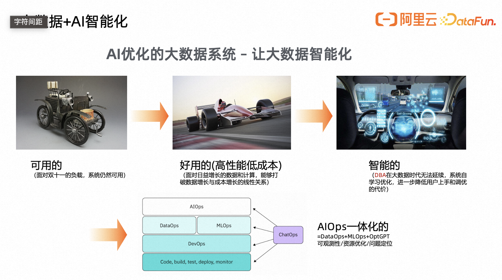

大数据+AI智能化。从最早的可用的，到当前主流的好用的(高性能低成本,成本优化)，再到智能的(AI for System 利用机器学习的能力做更好的系统决策)。AI智能优化的大数据系统已经成为云原生大数据技术演进的重要方向。正如之前所提到的智能自适应与AI机器学习相结合的智能数仓。整合了标准研发的DevOps/数据开发治理的DataOps/AI机器学习开发的MLOps，以GPTOps大模型辅助智能，AIOps一体化成为大数据智能化新趋势的一部分，智能实现可观测性/资源优化/问题定位等应用。

### 2.阿里云云原生大数据+AI参考架构

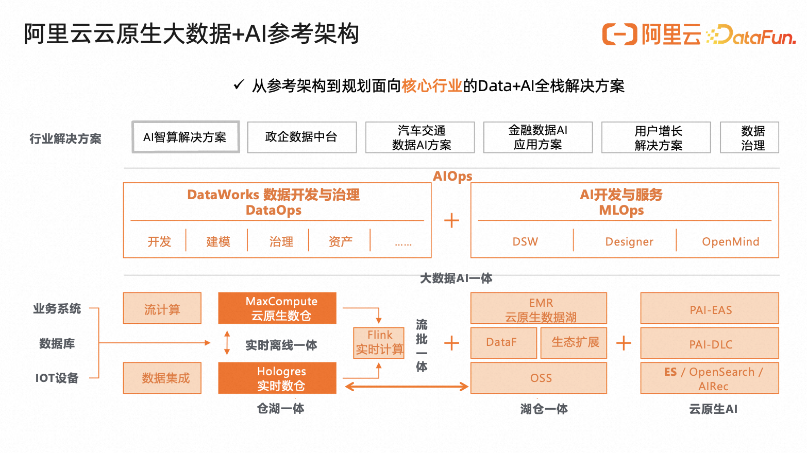

在此我介绍一下阿里云云原生大数据AI的4+1参考架构。其中4个一体架构包括离线实时一体/湖仓一体/流批一体/大数据AI一体，通过4个一体化架构覆盖阿里云核心自研与开源大数据产品，MaxCompute/Hologres/PAI/EMR/Flink/ES等等。1个统一数据AI平台，是整合DataWorks数据开发治理的DataOps 与 PAI机器学习平台的MLOps来构建面向未来的AIOps一体化平台能力。

### 3.云原生大数据+AI参考架构用例-自动驾驶

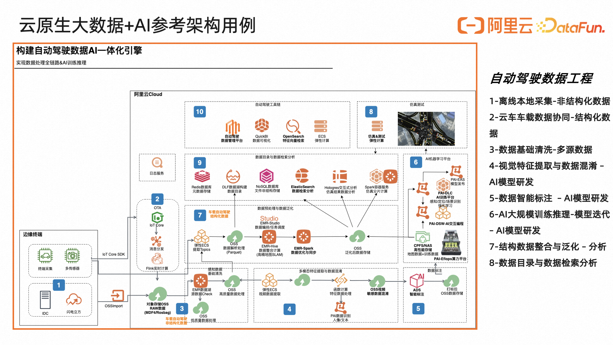

我们以阿里云汽车自动驾驶的数据工程作为用例，介绍大数据AI一体的参考架构如何实践落地。

### 4.AI+大数据一体化的技术新探索

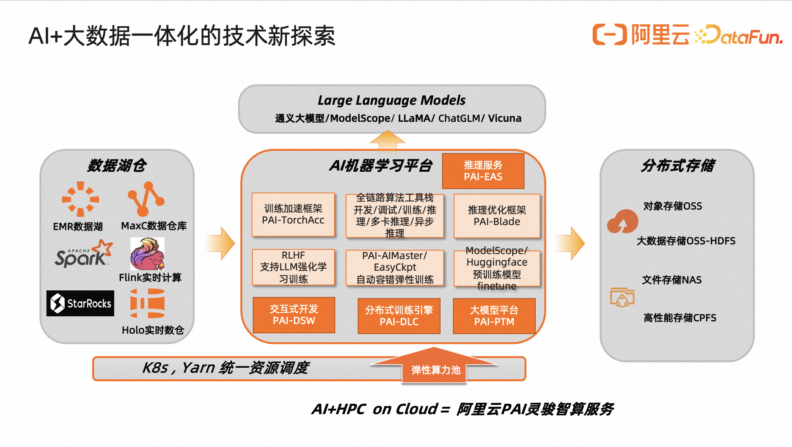

2023年是属于AI与大模型的一年，AI正在深刻地带动云原生大数据的持续发展。在此分享一下阿里云AI智算+大数据的参考流程。数据湖仓做数据预处理, AI机器学习平台接入清洗后数据，使用阿里云PAI灵骏智算服务进行分布式训练与推理，其中数据不断更新与交换到到分布式存储服务中，K8s提供统一资源调度。以此来搭建完备的AI+大数据一体化工程能力。

## 04-云原生大数据架构趋势总结

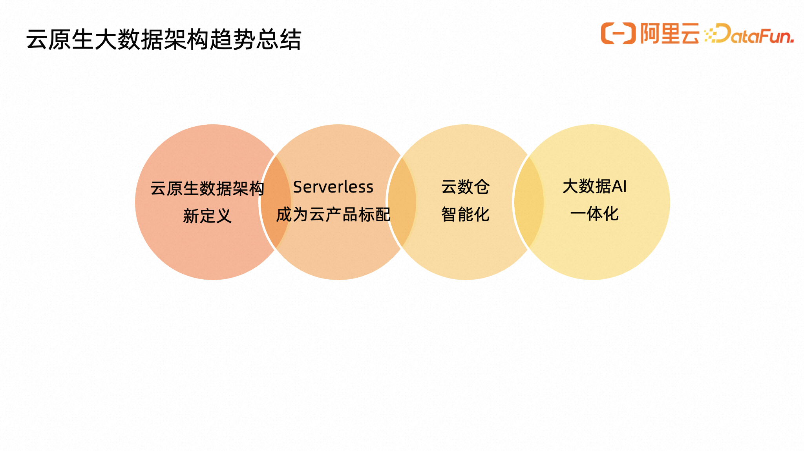

最后，总结一下本次分享的主要内容。云原生大数据架构已经成为最新一代大数据架构的重要方向与标准。
1-基于云原生的数据架构,借助云特性, 可有效解决大数据经典分布式架构的主要问题与痛点。包括周期性的系统不稳定，资源错配等
2-Severless形态将成为云原生大数据的重要标准组成。统一与解耦，包括统一Serverless共享服务, 更智能的自动化运维，极致弹性伸缩，Scale-to-Zero有效降低成本能力等等。
3-云原生数据架构下的数仓智能化将成为大数据的未来发展重要方向, 更加智能的数据产品，多模态计算引擎(增量计算)，以自然语言为主数仓Copilot.
4-云原生大数据AI一体化将越来越多在AI智能深度应用场景下发挥巨大的价值。从大数据预处理，模型训练、模型管理、部署和智能监控等建立起大数据与AI云原生工程体系。

## 参考内容
•	https://ata.alibaba-inc.com/articles/213633
•	https://cn.pingcap.com/blog/new-trend-of-database-development
•    https://mp.weixin.qq.com/s/8LIwihRXolhoOyZ22l23iQ
•	Book: Designing Cloud Data Platforms 
•	Paper: Cloud Programming Simplified:A Berkeley View on Serverless Computing in 2019
•	https://cloud.google.com/docs/open-tutorials

