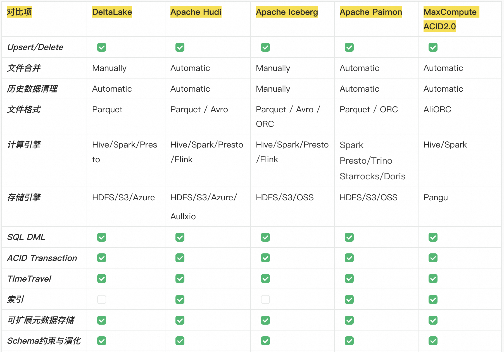

layout: post    
category : bigdata
tags : [cloud,datalake,thought]
title:  Big Data Research Note - Cloud LakeHouse Best Practice

----------------------------------------------------------------------------------------------------------------

## 大数据研究-大数据Cloud LakeHouse数据技术实践2023

## 写在前面

作者：振策-阿里云计算平台产品解决方案

## 0.Cloud LakeTableFormat数据格式的技术演进

云原生湖仓一体LakeHouse技术如火如荼, 之前我写过一篇关于大数据存算分离的技术架构的文章。主流的三大开源TableFormat(DeltaLake,**Hudi**,**Iceberg**)已被广泛使用，而阿里云也提出了包括Apache Paimon/MaxCompute ACID2.0的改进湖数据格式引擎。LakeTableFormat作为湖仓一体LakeHouse的主要组件, 在数据湖之上提供类似数仓的ACID数据管理能力。本文主要是尝试从技术应用角度分析基于大数据存储之上的表格存储技术对比，与大家共同探讨。

#### LakeTableFormat整体介绍

#### 主流LakeTableFormat能力对比分析

## 1.Apache Iceberg TableFormat技术分析

Iceberg定位是在计算引擎之下，又在存储之上。其次，它是一种数据存储格式，Delta Lake称其为"storage layer"，而Iceberg则称其为"table format"。这类技术是介于计算引擎和数据存储格式中间的数据组织格式。通过特定的方式将数据和元数据组织起来，因此称之为数据组织格式更为合理，而Iceberg将其定义为表格式也直观地反映出了它的定位和功能。

相比于Hudi，Delta Lake，***Iceberg提供了更为完整的表格式Schema Evolution的能力、类型的定义和操作的抽象***，并与上层数据处理引擎和底层数据存储格式的解耦。

-  对接上层，Iceberg提供了丰富的表操作接口，使得它非常容易与上层数据处理引擎对接，现已支持的包括Spark（Spark2和Spark3），Presto，Pig，社区正在做的是Hive和Flink的适配。其中Iceberg对于Spark的支持最好，它同时支持Spark2的Data Source V2 API和Spark3 的Data Source V2 API（包括multiple catalog支持），同时对于Spark的谓词下推能力有全面的支持。 
-  对接下层，Iceberg屏蔽了底层数据存储格式的差异，提供对于Parquet，ORC和Avro格式的支持。Iceberg起到了中间桥梁的能力，将上层引擎的能力传导到下层的存储格式。相比于Hudi，Delta Lake，Iceberg在设计之初并没有绑定某种特定的存储引擎，同时避免了与上层引擎之间的相互调用，使得Iceberg可以非常容易地扩展到对于不同引擎的支持。 

### 1.1.Iceberg的核心特性

#### *1.1.1.[系统架构]架构解耦：数据存储、计算引擎插件化*

Iceberg 提供一个开放通用的表格式（Table Format）实现方案，不和特定的数据存储、计算引擎绑定。目前大数据领域的常见数据存储（HDFS、S3…），计算引擎（Flink、Spark…）都可以接入 Iceberg。

在生产环境中，可选择不同的组件搭使用。甚至可以不通过计算引擎，直接读取存在文件系统上的数据。Iceberg支持Spark的读和写，包括Spark的结构化流。Trino (PrestoSQL) 也支持读取，但对删除的支持有限。同时支持Flink的读和写。最后，Iceberg为Hive提供了读支持。仅支持写时复制的方式，包含需要更新记录的文件会立即被重写。Iceberg的优势在于包含大量分区的表的读取性能很高。解决存储可用性问题: 更好的schema管理方式、时间旅行、多版本回滚支持等。

#### *1.1.2.[实时写入与查询]流批统一的写入和读取-实时流批一体*

Iceberg 上游组件将数据写入完成后，下游组件及时可读，可查询。可以满足实时场景。并且 Iceberg 同时提供了流/批读接口、流/批写接口。可以在同一个流程里，同时处理流数据和批数据，大大简化了ETL链路。

#### *1.1.3.[Compaction]自动化数据治理待优化。包括Upsert和Compaction操作*

由于

#### *1.1.4.[ACID]事务能力优化：ACID事务*

ACID是数据表格式的基本能力，Delta Lake、Hudi和Iceberg都提供了ACID能力，由ACID能力所衍生出来的row level update/delete更是这些表格式最吸引人的特性。

Iceberg提供了锁的机制来提供ACID的能力，在每次元数据更新时它会从Hive metastore中获取锁并进行更新。同时Iceberg保证了线性一致性（Serializable isolation），确保表的修改操作是原子性的，读操作永远不会读到部分或是没有commit的数据(通过事务保证了下游组件只能消费已 commit 的数据，而不会读到部分甚至未提交的数据)。Iceberg提供了乐观锁的机制降低锁的影响，并且使用冲突回退和重试机制来解决并发写所造成的冲突问题。  

基于乐观锁的并发支持MVCC。Iceberg 基于乐观锁提供了多个程序并发写入的能力并且保证数据线性一致。基于MVCC(Multi Version Concurrency Control)的机制,默认读取文件会从最新的的版本, 每次写入都会产生一个新的快照, 读写相互不干扰。基于多版本的机制可以实现回滚和时间旅行的功能, 读取或者回滚任意版本的快照数据。

#### *1.1.5.[Snapshot]基于快照的读写分离回溯：时间旅行(Time Travel)，以访问之前版本的数据*

基于ACID的能力，Iceberg提供了类似于MVCC的读写分离能力：每次写操作都会产生一个新的快照（snapshot），快照始终是往后线性递增，确保了线性一致性。而读操作只会读取已经存在了的快照，对于正在生成的快照读操作是不可见的。每一个快照拥有表在那一时刻所有的数据和元数据，因此提供了用户回溯（time travel）表数据的能力。利用Iceberg的time travel能力，用户可以读取那一时刻的数据，同时也提供了用户快照回滚和数据重放的能力。Iceberg 提供了查询表历史某一时间点数据镜像（snapshot）的能力。通过该特性可以将最新的SQL逻辑，应用到历史数据上。

#### *1.1.6.[Format]完备的自定义类型、分区方式和操作的抽象*

- ***数据表演化（Table Evolution）***

Iceberg 可以通过 SQL 的方式进行表级别模式演进。进行这些操作的时候，代价极低。不存在读出数据重新写入或者迁移数据这种费时费力的操作。

比如在常用的 Hive 中，如果我们需要把一个按天分区的表，改成按小时分区。此时，不能再原表之上直接修改，只能新建一个按小时分区的表，然后再把数据 Insert 到新的小时分区表。而且，即使我们通过 Rename 的命令把新表的名字改为原表，使用原表的上次层应用，也可能由于分区字段修改，导致需要修改 SQL，这样花费的经历是非常繁琐的。

- ***模式演化（Schema Evolution）Iceberg支持如下这些Schema Evolution操作(确保schema evolution是独立且没有副作用的)：***
  1).Add - 在表中或是在嵌套结构中新增column。
  2).Drop - 在表中或是在嵌套结构中移除已有的column。
  3).Rename - 在表中或是在嵌套结构中修改column的名字。
  4).Update - 提升数据的类型，支持column，struct field，map key，map value和list中的元素。
  5).Reorder - 调整表中说是嵌套结构中的column顺序。 

Iceberg 保证模式演化（Schema Evolution）是没有副作用的独立操作流程，一个元数据操作, 不会涉及到重写数据文件的过程。具体的如下:

	- 增加列时候，不会从另外一个列中读取已存在的的数据
	- 删除列或者嵌套结构中字段的时候，不会改变任何其他列的值
	- 更新列或者嵌套结构中字段的时候，不会改变任何其他列的值
	- 改变列列或者嵌套结构中字段顺序的时候，不会改变相关联的值

在表中，Iceberg 使用唯一 ID 来定位每一列的信息。新增一个列的时候，会新分配给它一个唯一 ID，并且绝对不会使用已经被使用的ID。

使用名称或者位置信息来定位列的, 都会存在一些问题，比如使用名称的话，名称可能会重复, 使用位置的话，不能修改顺序并且废弃的字段也不能删除。

- ***列和分区方式可以进化，而且进化对用户无感，即无需重新组织或变更数据文件；***

**分区演化（Partition Evolution）**

Iceberg 可以在一个已存在的表上直接修改，因为 Iceberg 的查询流程并不和分区信息直接关联。

当我们改变一个表的分区策略时，对应修改分区之前的数据不会改变，依然会采用老的分区策略，新的数据会采用新的分区策略，也就是说同一个表会有两种分区策略，旧数据采用旧分区策略，新数据采用新新分区策略，在元数据里两种分区策略相互独立，不重合。

在查询数据的时候，如果存在跨分区策略的情况，则会解析成两个不同执行计划，如 Iceberg 官网提供图所示：

图中 booking_table 表 2008 年按月分区，进入 2009年 后改为按天分区，这两中分区策略共存于该表中。

借助 Iceberg 的隐藏分区（Hidden Partition），在写 SQL 查询的时候，不需要在 SQL 中特别指定分区过滤条件，Iceberg 会自动分区，过滤掉不需要的数据。

Iceberg 分区演化操作同样是一个元数据操作， 不会重写数据文件。

**列顺序演化（Sort Order Evolution）**

Iceberg 可以在一个已经存在的表上修改排序策略。修改了排序策略之后，旧数据依旧采用老排序策略不变。往Iceberg里写数据的计算引擎总是会选择最新的排序策略，但是当排序的代价极其高昂的时候, 就不进行排序了。

#### *1.1.7.[Format]隐式分区HiddenPartition，使SQL不用针对分区方式特殊优化*

Iceberg 的分区信息并不需要人工维护，它可以被隐藏起来。不同于其他类似 Hive 的分区策略，Iceberg 的分区字段/策略（通过某一个字段计算出来），可以不是表的字段和表数据存储目录也没有关系。在建表或者修改分区策略之后，新的数据会自动计算所属于的分区。在查询的时候同样不用关心表的分区是什么字段/策略，只需要关注业务逻辑，Iceberg 会自动过滤不需要的分区数据。

正是由于 Iceberg 的分区信息和表数据存储目录是独立的，使得 Iceberg 的表分区可以被修改，而且不涉及到数据迁移。

#### *1.1.8.[FlieCrop]文件级数据剪裁*

Iceberg 的元数据里面提供了每个数据文件的一些统计信息，比如最大值，最小值，Count 计数等等。因此，查询 SQL 的过滤条件除了常规的分区，列过滤，甚至可以下推到文件级别，大大加快了查询效率。

#### *1.1.9.面向云存储的其他优势等*

Iceberg还有许多其他的优势，比如对象存储友好的数据组织方式，在数据存储格式之上的统一的向量化读取(基于Arrow实现)，完备的算子下推等等关于表结构的核心能力。

### 1.2.Iceberg存储结构

### 

Merge On Read 简称，是一种行级更新技术，本质上是 out-of-place update, 更新 和删除不直接修改历史数据，而是单独记录数据变更，在读取的时候再合并历 史数据和变更得到修改后的值。这种方式更新的时候代价较小，读取的时候代价较大。 

#### 1.2.1 数据文件 Data files

数据文件是 Apache Iceberg 表真实存储数据的文件，一般是在表的数据存储目录的 data 目录下，如果我们的文件格式选择的是 parquet,那么文件是以 .parquet 结尾。

例如：00000-0-atguigu_20230203160458_22ee74c9-643f-4b27-8fc1-9cbd5f64dad4-job_1675409881387_0007-00001.parquet 就是一个数据文件。

Iceberg 每次更新会产生多个数据文件（data files）。

#### 1.2.2 表快照 Snapshot

快照代表一张表在某个时刻的状态。每个快照里面会列出表在某个时刻的所有 data file 列表。data file 存储在不同的 manifest file 里面，manifest file 存储在一个 Manifest list文 件里面，而一个 Manifest list 文件代表一个快照。

#### 1.2.3 清单列表 Manifest list

manifest list 是一个元数据文件，列出构建表快照（Snapshot）的清单（Manifest file）。这个元数据文件中存储的是 Manifest file 列表，每个 Manifest file 占据一行。每行中存储了 Manifest file 的路径、其存储数据文件（data files）的分区范围，增加了几个数文件、删除了几个数据文件等信息，这些信息可以用来在查询时提供过滤，加快速度。

例如：snap-6746266566064388720-1-52f2f477-2585-4e69-be42-bbad9a46ed17.avro 就是一个 Manifest List 文件。

#### 1.2.4 清单文件 Manifest file

Manifest file 也是一个元数据文件，它列出组成快照（snapshot）的数据文件（data file）的列表信息。每行都是每个数据文件的详细描述，包括数据文件的状态、文件路径、分区信息、列级别的统计信息（比如每列的最大最小值、空值数等）、文件的大小以及文件里面数据行数等信息。其中列级别的统计信息可以在扫描表数据时过滤掉不必要的文件。

Manifest file 是以 avro 格式进行存储的，以 .avro 后缀结尾，例如：52f2f477-2585-4e69-be42-bbad9a46ed17-m0.avro。

### 1.3.Iceberg引擎对接

#### 1.3.1.与 Hive集成

#### 1.3.2.与 Spark SQL集成

#### 1.3.3.与 Flink SQL 集成

#### 1.3.4.与 Flink DataStream 集成

## 2.MaxCompute ACID2.0-对比开源

### 2.1. MaxCompute近实时增量处理技术架构

MaxCompute近实时增量处理整体架构的设计改动主要集中在五个模块：数据接入、计算引擎、数据优化服务，元数据管理，数据文件组织。其他部份直接复用MaxCompute已有的架构和计算流程，比如数据的分布式存储直接集成了阿里云基础设施-盘古存储服务。

- 数据接入主要支持各种数据源全量和近实时增量导入功能。MaxCompute联合相关产品定制开发多种数据接入工具，例如MaxCompute定制开发的Flink Connector，DataWorks的数据集成等，用来支持高效的近实时增量数据导入。这些工具会对接MaxCompute的数据通道服务Tunnel Server，主要支持高并发分钟级增量数据写入。此外，也支持MaxCompute SQL，以及其它一些接口用于支持全量数据高效写入。
- 计算引擎主要包含MC自研的SQL引擎，负责Timetravel和增量场景下的SQL DDL/DML/DQL的语法解析,优化和执行链路。此外，MaxCompute内部集成的Spark等引擎也在设计开发支持中。
- 数据优化服务主要由MaxCompute的Storage Service来负责智能的自动管理增量数据文件，其中包括小文件合并Clustering，数据Compaction，数据排序等优化服务。对于其中部分操作，Storage Service会根据数据特征，时序等多个维度综合评估，自动执行数据优化任务，尽可能保持健康高效的数据存储和计算状态。
- 元数据管理主要负责增量场景下数据版本管理，Timetravel管理，事务并发冲突管理，元数据更新和优化等。
- 数据文件组织主要包含对全量和增量数据文件格式的管理以及读写相关的模块。

#### 2.1.1. [Format]统一的数据文件组织格式

要支持全量和增量处理一体化架构首先需要设计统一的表类型以及对应的数据组织格式，这里称为upsertable transactional table，简称UTTable，基本可以支持普通表的所有功能，同时支持增量处理链路的新场景，包括timetravel查询、upsert操作等。

UTTable要生效只需要在创建普通表时额外设置主键primary key(PK)，以及表属性transactional为true即可。PK列用于支持Upsert链路功能，PK值相同的多行记录在查询或者Compaction会merge成一行数据，只保留最新状态。transactional属性则代表支持ACID事务机制，满足读写快照隔离，并且每行数据会绑定事务属性，比如事务timestamp，用来支持timetravel查询，过滤出正确数据版本的记录。此外UTTable的tblproperties还可以设置其他的一些可选的表属性，比如write.bucket.num用来配置数据写入的并发度，acid.data.retain.hours用来配置历史数据的有效查询时间范围等。

UTTable表数据文件存在多种组织格式用来支持丰富的读写场景。其中base file数据文件不保留Update/Delete中间状态，用来支撑全量批处理的读写效率，delta file增量数据文件会保存每行数据的中间状态，用于满足近实时增量读写需求。

为了进一步优化读写效率，UTTable支持按照BucketIndex对数据进行切分存储，BucketIndex数据列默认复用PK列，bucket数量可通过配置表属性write.bucket.num指定，数据写入的高并发可通过bucket数量水平扩展，并且查询时，如果过滤条件为PK列，也可有效的进行Bucket裁剪查询优化。数据文件也可按照PK列进行排序，可有效提升MergeSort的效率，并有助于DataSkipping查询优化。数据文件会按照列式压缩存储，可有效减少存储的数据量，节省成本，也可有效的提升IO读写效率。

#### 2.1.2. [实时写入与查询]数据近实时写入+查询

**前面介绍了统一的数据组织格式，接下来需要分析数据如何高效写入**UTTable**。**

数据流入主要分成近实时增量写入和批量写入两种场景。这里先描述如何设计高并发的近实时增量写入场景。用户的数据源丰富多样，可能存在数据库，日志系统或者其他消息队列等系统中，为了方便用户迁移数据写入UTTable， MaxCompute定制开发了Flink Connector、Dataworks数据集成以及其它开源工具，并且针对UTTable表做了很多专门的设计开发优化。这些工具内部会集成MaxCompute数据通道服务Tunnel提供的客户端SDK，支持分钟级高并发写入数据到Tunnel Server，由它高并发把数据写入到每个Bucket的数据文件中。

写入并发度可通过前面提及的表属性write.bucket.num来配置，因此写入速度可水平扩展。对同一张表或分区的数据，写入数据会按pk值对数据进行切分，相同pk值会落在同一个bucket桶中。此外，数据分桶的好处还有利于数据优化管理操作例如小文件clustering，compaction等都可以桶的粒度来并发计算，提高执行效率。分桶对于查询优化也非常有好处，可支持bucket裁剪、shuffle move等查询优化操作。

Tunnel SDK提供的数据写入接口目前支持upsert和delete两种数据格式，upsert包含insert / update两种隐含语义，如数据行不存在就代表insert，如已存在就代表update。commit接口代表原子提交这段时间写入的数据如返回成功就代表写入数据查询可见，满足读写快照隔离级别，如返回失败，数据需要重新写入。

#### SQL批量写入

批量导入主要通过SQL进行操作。为了方便用户操作，实现了操作UTTable所有的DDL / DML语法。SQL引擎内核模块包括Compiler、Optimizer、Runtime等都做了大量改造开发以支持相关功能，包括特定语法的解析，特定算子的Planner优化，针对pk列的去重逻辑，以及runtime构造Upsert格式数据写入等。数据计算写入完成之后，会由Meta Service来原子性更新Meta信息，此外，也做了大量改造来支持完整的事务机制保证读写隔离、事务冲突检测等等。

#### 增量查询

此外，SQL增量查询也是重点设计开发的场景，主要用于一些业务的近实时增量处理链路，新增SQL语法采用between and关键字，查询的时间范围是左开右闭，即begin是一个开区间，必须大于它，end是一个闭区间。

增量查询不会读取任何base file，只会读取指定时间区间内的所有delta files，按照指定的策略进行Merge输出。

通过上诉表格可进一步了解细节，如begin是t1-1，end是t1，只读取t1时间段对应的delta file (d1)进行输出, 如果end是t2，会读取两个delta files (d1和d2)；如果begin是t1，end是t2-1，即查询的时间范围为(t1, t2)，这个时间段是没有任何增量数据插入的，会返回空行。

对于Clustering和Compaction操作也会产生新的数据文件，但并没有增加新的逻辑数据行，因此这些新文件都不会作为新增数据的语义，增量查询做了专门设计优化，会剔除掉这些文件，也比较贴合用户使用场景。

#### 2.1.3.  [Compaction]小数据文件合并

由于UTTable 本身支持分钟级近实时增量数据导入，高流量场景下可能会导致增量小文件数量膨胀，从而引发存储访问压力大、成本高，并且大量的小文件还会引发meta更新以及分析执行慢，数据读写IO效率低下等问题，因此需要设计合理的小文件合并服务, 即Clustering服务来自动优化此类场景。

Clustering服务主要由MaxCompute 内部的Storage Service来负责执行，专门解决小文件合并的问题，需要注意的是，它并不会改变任何数据的历史中间状态，即不会消除数据的Update/Delete中间状态。

结合上图可大概了解Clustering服务的整体操作流程。Clustering策略制定主要根据一些典型的读写业务场景而设计，会周期性的根据数据文件大小，数量等多个维度来综合评估，进行分层次的合并。Level0到Level1主要针对原始写入的Delta小文件（图中蓝色数据文件）合并为中等大小的Delta文件(图中黄色数据文件)，当中等大小的Delta文件达到一定规模后，会进一步触发Level1到Level2的合并，生成更大的Delta文件（图中橙色数据文件）。

对于一些超过一定大小的数据文件会进行专门的隔离处理，不会触发进一步合并，避免不必要的读写放大问题，如图中Bucket3的T8数据文件。超过一定时间跨度的文件也不会合并，因为时间跨度太大的数据合并在一起的话，当TimeTravel或者增量查询时，可能会读取大量不属于此次查询时间范围的历史数据，造成不必要的读放大问题。

由于数据是按照BucketIndex来切分存储的，因此Clustering服务会以bucket粒度来并发执行，大幅缩短整体运行时间。

Clustering服务需要和Meta Service进行交互，获取需要执行此操作的表或分区的列表，执行结束之后，会把新老数据文件的信息传入Meta Service，它负责Clustering操作的事务冲突检测，新老文件meta信息原子更新、老的数据文件回收等。

Clustering服务可以很好的解决大文件数量膨胀引发的一系列效率低下的读写问题，但不是频率越高越好，执行一次也会消耗计算和IO资源，至少数据都要全部读写一遍，存在一定的读写放大问题。因此执行策略的选择尤其重要，所以目前暂时不会开放给用户手动执行，而是引擎根据系统状态智能自动触发执行，可保障Clustering服务执行的高效率。

#### 数据文件Compaction

除了小文件膨胀问题需要解决外，依然还有一些典型场景存在其它问题。UTTable支持update、delete格式的数据写入，如果存在大量此格式的数据写入，会造成中间状态的冗余记录太多，引发存储和计算成本增加，查询效率低下等问题。因此需要设计合理的数据文件compaction服务优化此类场景。

Compaction服务主要由MaxCompute 内部的Storage Service来负责执行，既支持用户手动执行SQL语句触发、也可通过配置表属性按照时间频率、Commit次数等维度自动触发。此服务会把选中的数据文件，包含base file和delta file，一起进行Merge，消除数据的Update / Delete中间状态，PK值相同的多行记录只保留最新状态的一行记录，最后生成新的只包含Insert格式的base file。

结合上图可大概了解Compaction服务的整体操作流程。t1到t3时间段，一些delta files写入进来，触发compaction操作，同样会以bucket粒度并发执行，把所有的delta files进行merge，然后生成新的base file。之后t4和t6时间段，又写入了一批新的delta files，再触发compaction操作，会把当前存在的base file和新增的delta files一起做merge操作，重新生成一个新的base file。

Compaction服务也需要和Meta Service进行交互，流程和Clustering类似，获取需要执行此操作的表或分区的列表，执行结束之后，会把新老数据文件的信息传入Meta Service，它负责Compaction操作的事务冲突检测，新老文件meta信息原子更新、老的数据文件回收等。

Compaction服务通过消除数据中间历史状态，可节省计算和存储成本，极大加速全量快照查询场景的效率，但也不是频率越高越好，首先执行一次也要读取一遍全量数据进行Merge，极大消耗计算和IO资源，并且生成的新base file也会占据额外的存储成本，而老的delta file文件可能需要用于支持timetravel查询，因此不能很快删除，依然会有存储成本，所以Compaction操作需要用户根据自己的业务场景和数据特征来合理选择执行的频率，通常来说，对于Update / Delete格式的记录较多，并且全量查询次数也较多的场景，可以适当增加compaction的频率来加速查询。

#### 2.1.4. [ACID]事务管理

以上主要介绍了典型的数据更新操作，而它们的事务并发管理都会统一由Meta Service进行控制。

上面表格详细展示了各个具体操作并发执行的事物冲突规则。Meta服务采用了经典的MVCC模型来满足读写快照隔离，采用OCC模型进行乐观事务并发控制。对于一些高频的操作单独设计优化了事务冲突检测和重试机制，如clustering操作和insert into 并发执行，即使事务Start和Commit时间出现交叉也不会冲突失败，都能成功执行，即使在原子提交Meta信息更新时出现小概率失败也可在Meta层面进行事务重试，代价很低，不需要数据重新计算和读写。

此外，各种数据文件信息以及快照版本也需要有效的管理，其中包含数据版本、统计信息、历史数据、生命周期等等。对于TimeTravel和增量查询，Meta层面专门进行了设计开发优化，支持高效的查询历史版本和文件信息。

#### 2.1.5.  [Snapshot]TimeTravel查询

基于UTTable，计算引擎可高效支持典型的业务场景TimeTravel查询，即查询历史版本的数据，可用于回溯历史状态的业务数据，或数据出错时，用来恢复历史状态数据进行数据纠正，当然也支持直接使用restore操作恢复到指定的历史版本。

对于TimeTravel查询，会首先找到要查询的历史数据版本之前最近的base file，再查找后面的delta files，进行合并输出，其中base file可以用来加速查询读取效率。

这里结合上图进一步描述一些具体的数据查询场景。比如创建一张UTTable表，schema包含一个pk列和一个val列。左边图展示了数据变化过程，在t2和t4时刻分别执行了compaction操作，生成了两个base file: b1和b2。b1中已经消除了历史中间状态记录（2,a），只保留最新状态的记录 (2,b)。

如查询t1时刻的历史数据，只需读取delta file (d1)进行输出; 如查询t2时刻，只需读取base file (b1) 输出其三条记录。如查询t3时刻，就会包含base file ( b1)加上delta file (d3)进行合并输出，可依此类推其他时刻的查询。

可见，base文件虽可用来加速查询，但需要触发较重的compaction操作，用户需要结合自己的业务场景选择合适的触发策略。

TimeTravel可根据timestamp和version两种版本形态进行查询，除了直接指定一些常量和常用函数外，我们还额外开发了get_latest_timestamp和get_latest_version两个函数，第二个参数代表它是最近第几次commit，方便用户获取我们内部的数据版本进行精准查询，提升用户体验。

#### 历史版本数据回收

由于Timetravel和增量查询都会查询数据的历史状态，因此需要保存一定的时间，可通过表属性acid.data.retain.hours来配置保留的时间范围。如果历史状态数据存在的时间早于配置值，系统会开始自动回收清理，一旦清理完成，TimeTravel就查询不到对应的历史状态了。回收的数据主要包含操作日志和数据文件两部分。

同时，也会提供purge命令，用于特殊场景下手动触发强制清除历史数据。

#### 2.1.6. 数据接入生态集成现状

初期上线支持接入UTTable的工具主要包括：

	- DataWorks数据集成：支持数据库等丰富的数据源表全量以及增量的同步业务。
	- MaxCompute Flink Connector：支持近实时的upsert数据增量写入，这一块还在持续优化中，包括如何确保Exactly Once语义，如何保障大规模分区写入的稳定性等，都会做深度的设计优化。
	- MaxCompute MMA：支持大规模批量 Hive数据迁移。很多业务场景数据迁移可能先把存在的全量表导入进来，之后再持续近实时导入增量数据，因此需要有一些批量导入的工具支持。
	- 阿里云实时计算Flink版Connector：支持近实时Upsert数据增量写入，功能还在完善中。
	- MaxCompute SDK：直接基于SDK开发支持近实时导入数据，不推荐
	- MaxCompute SQL：通过SQL批量导入数据

对其它一些接入工具，比如Kafka等，后续也在陆续规划支持中。

### 2.2.MaxCompute ACID2.0存储结构

### 2.3.MaxCompute ACID2.0与Iceberg对比分析:

以下对比主要基于开源Iceberg的技术框架，叠加对一些竞品对于Iceberg的改造优化，来进行一部分feature对比分析，不一定周全，甚至有可能分析错误。

#### 2.3.1.数据实时入湖-Upsert写入链路分析:

- MaxCompute: 写入并发可以横向扩展，并且MC Flink Connector做了专门优化，数据会按照primary key (PK)进行分组，因此相同PK的数据会发送给同一个Flink Sink节点进行写入，并且最终也会存储在同一个数据文件中。因此整个写入E2E链路，数据处理和网络传输的效率可以做到最优，每个sink的内存使用可以最小化以及尽可能稳定。最大的好处在于数据文件的存储方式非常适合后续的compaction和查询性能最优化。
- Iceberg: 写入并发也可以横向扩展，但E2E整体链路并没有按照primary key做专门的优化处理。

小文件数量膨胀：数据完全随机的写入到iceberg存储中，会导致数据文件碎片比较严重，尤其在海量分区场景会更加恶化。

数据实时写入分布不合理导致查询性能低下。数据传输效率也不高，虽然性能可能满足需求，但整体写入吞吐的稳定性和资源使用不是很有保障。

写入的存储文件可能会给其他的操作，比如小文件compaction问题，无效文件cleaning，以及查询等服务造成很大的计算成本消耗以及性能低下。

元数据文件数目的膨胀引起的性能降低。

数据本身缺乏生命周期管理。

#### 2.3.2.小文件合并Compaction分析:

- MaxCompute：由于数据是按照PK列进行分桶的，因此可以按照桶粒度并发执行，每个桶内的数据文件合并即可，并且数据本身是有序的，并且merge合并效率非常高，并且在合并生成新的数据文件后会立马删除老的数据文件，不会引发额外的存储成本。
- Iceberg: 因为存在数据文件和Delete文件，不仅仅需要合并数据文件，还需要把每一个历史Delete文件跟所有历史数据文件合并来消除Delete记录，计算和IO读写开销都非常大，并且任务的稳定性也会有影响，而且由于Delete文件和数据文件是一样多的，并且分钟级别生成，因此合并代价更大，如果数据没有按照PK进行组织排布优化的话(如果有，也需要比较大的代价进行数据排布优化)，那就是全量数据进行整体合并，那情况会进一步恶化。此外，合并后生成新的数据文件，老的数据文件也不是即时删除，需要单独的Cleaning服务来管理和删除，也会带来额外的存储开销和资源开销。

**CompactionService**

#### 2.3.3.自动化数据治理服务对比

- MaxCompute: 用户只需要关注写入和查询逻辑，其他任何后台的服务，包括sort/compact/clean服务等，都是系统后台异步根据系统负载智能自动化运行，也完全解决了事务冲突，不会对用户读写操作产生任何影响。因此任何后台服务都不会对用户收费，没有任何计算成本，完全由全托管的MC平台提供。
- Iceberg: 开源版本是没有自动化数据服务的，需要用户侧来同步触发，这会引发很大的时延问题，稳定性问题，以及资源保障问题。部分商业化系统对iceberg进行了改造，也支持后台异步触发一些后台服务，但在upsert海量分区流式写入场景下，后台的服务的效率和瓶颈也受限于上面提到的小文件合并等操作。此外，后台服务的资源保障大概率是需要用户来提供的。

#### 2.3.4.数据存储成本分析:

- MaxCompute: 只有数据文件，并且每一条upsert写入的数据只会写一行，数据是列式存储，并且按照PK进行排序，因此数据压缩率最高，存储成本最小化，并且读写查询效率最大化。
- Iceberg: 对于upsert写入场景，存在数据文件，equality-delete 文件，以及manifest等元信息文件。每次写入一条upsert数据，需要拆分出来一条insert记录存入数据文件中，另一条包含PK列的Delete记录存入equality-delete 文件中，因此多出来的Delete文件会增加不少的存储成本，此外也会导致小文件数量变成双倍，无论的存储访问的稳定性，读写效率，查询效率等数据操作都会产生很大负面影响。

#### 2.3.5.数据存储组织方式分析：

- MaxCompute：PK事务表的数据文件是按照PK进行分桶存储的，并且在数据导入时就已经分好桶了，因此针对数据的任何操作，比如compact或者查询，都可以每个桶为粒度进行并发执行，计算吞吐和读写效率非常高，基本就是为PK事务表量身定做的组织结构
- Iceberg: 数据时随机写入，因此写入的数据文件没有基于PK做组织优化，后续需要单独clustering操作对数据进行重新排布，计算代价比较大，也会引发一些事务并发冲突问题，同时导致很多无效文件增加，存储成本增加等

#### 2.3.6.数据存储效率分析:

- MaxCompute：基于内部非常稳定的分布式存储服务，无论是稳定性和效率上都完全有保障
- Iceberg: 取决于使用的分布式服务，如果是开源的HDFS，那效率就很一般了

#### 2.3.7.文件管理对比:

- MaxCompute: 只有数据文件，并且对应的元数据直接存储在统一的MetaServer中，管理非常高效，成本也低
- Iceberg: 需要同时管理数据文件，delete文件，manifest文件，以及无效文件等生命周期，并且删除不及时，都会引入额外的存储成本，以及管理开销。

## 3.Apache Hudi核心概念解析

AWS-Hudi / 小鹏汽车 / 任意门

https://yuque.antfin-inc.com/odps/xzg0zk/tcwrlp

https://yuque.antfin-inc.com/odps/cupid/oldpl7#ouxFc	 

## 4.Apache Paimon StreamingLakeFormation

- 流批一体FlinkSQL提供统一的数据开发体验
- 流批一体LakeStore提供统一的数据存储管理
- FlinkCDC全增量一体化数据入湖
- 全链路Flink流式处理，支持分钟级事务，准实时时效性
- 开放数据生态，支持主流计算引擎

Paimon 采用开放的数据格式和技术理念，可以与 Apache Flink / Spark / Trino 等诸多业界主流计算引擎进行对接，共同推进 Streaming Lakehouse 架构的普及和发展。

Paimon 以湖存储的方式基于[分布式文件系统](https://so.csdn.net/so/search?q=分布式文件系统&spm=1001.2101.3001.7020)管理元数据，并采用开放的 ORC、Parquet、Avro 文件格式，支持各大主流计算引擎，包括 Flink、Spark、Hive、Trino、Presto。未来会对接更多引擎，包括 Doris 和 Starrocks。

### 4.1.与其他数据湖的优势对比

- 阿里云在 Flink 社区主导，长期投入，与Flink配合最好。
- 得益于 LSM 数据结构的追加写能力，Paimon 在大规模的更新数据输入的场景中提供了出色的性能。

Paimon 创新的结合了 湖存储 + LSM + 列式格式 (ORC, Parquet)，为湖存储带来大规模实时更新能力，Paimon 的 LSM 的文件组织结构如下：

- 高性能更新：LSM 的 Minor Compaction，保障写入的性能和稳定性
- 高性能合并：LSM 的有序合并效率非常高
- 高性能查询：LSM 的 基本有序性，保障查询可以基于主键做文件的 Skipping
- 简单高效的流入数据湖

在最新的版本中，Paimon 集成了 Flink CDC，通过 Flink DataStream 提供了两个核心能力：

1. 实时同步 Mysql 单表到 Paimon 表，并且实时将上游 Mysql 表结构（Schema）的变更同步到下游的 Paimon 表中。
2. 实时同步 Mysql 整库级别的表结构和数据到 Paimon 中，同时支持表结构变更的同步，并且在同步过程中复用资源，只用少量资源，就可以同步大量的表。

通过与 Flink CDC 的整合，Paimon 可以让的业务数据简单高效的流入数据湖中。

- 数据表局部更新

在数据仓库的业务场景下，经常会用到宽表数据模型，宽表模型通常是指将业务主体相关的指标、维表、属性关联在一起的模型表，也可以泛指将多个事实表和多个维度表相关联到一起形成的宽表。

Paimon 的 Partial-Update 合并引擎可以根据相同的主键实时合并多条流，形成 Paimon 的一张大宽表，依靠 LSM 的延迟 Compaction 机制，以较低的成本完成合并。合并后的表可以提供批读和流读：

1. 批读：在批读时，读时合并仍然可以完成 Projection Pushdown，提供高性能的查询。
2. 流读：下游可以看到完整的、合并后的数据，而不是部分列。

- 流批一体数据读写

Paimon 作为一个流批一体的数据湖存储，提供流写流读、批写批读，你使用 Paimon 来构建 Streaming Pipeline，并且数据沉淀到存储中。

在 Flink Streaming 作业实时更新的同时，可以 OLAP 查询各个 Paimon 表的历史和实时数据，并且也可以通过 Batch SQL，对之前的分区 Backfill，批读批写。

不管输入如何更新，或者业务要求如何合并 (比如 partial-update)，使用 Paimon 的 Changelog 生成功能，总是能够在流读时获取完全正确的变更日志。

当面对主键表时，为什么你需要完整的 Changelog：

1. 你的输入并不是完整的 changelog，比如丢失了 UPDATE_BEFORE (-U)，比如同个主键有多条 INSERT 数据，这就会导致下游的流读聚合有问题，同个主键的多条数据应该被认为是更新，而不是重复计算。
2. 当你的表是 Partial Update，下游需要看到完整的、合并后的数据，才可以正确的流处理。

你可以使用 Lookup 来实时生成 Changelog：

如果你觉得成本过大，你也可以解耦 Commit 和 Changelog 生成，通过 Full-Compaction 和对应较大的时延，以非常低的成本生成 Changelog。 

## 5.LakeTableFormat数据技术验证Benchmark

LakeTableFormat(Apache Iceberg / Paimon / Hudi / MaxCompute ACID2.0) 技术能力测试验证

| **No.1**                                                     | **测试项目**             | **测试方式**                                                 | **性能指标** | **性能对比差异** |
| ------------------------------------------------------------ | ------------------------ | ------------------------------------------------------------ | ------------ | ---------------- |
|                                                              |                          |                                                              |              |                  |
| 1                                                            | 数据加载性能             | 将3TB Parquet格式的TPC-DS数据集加载到Delta、Iceberg CoW、Hudi CoW、Paimon格式的表中，记录各自数据加载的时间 | 加载时间     |                  |
| 2                                                            | 数据治理小文件Compaction |                                                              | 资源消耗时间 |                  |
| 3                                                            | 查询性能                 | 对Delta、Iceberg、Hudi、Paimon格式的表数据，分别执行TPC-DS 99个query三次，取平均值 | 查询时间     |                  |
| 4                                                            | 更新性能                 | 1. 加载100G Parquet格式的TPC-DS数据集到Delta、Iceberg、Hudi、Paimon格式的表中，记录各自数据加载的时间 | 加载时间     |                  |
| 2. 执行TPC DS 5个SQL（Q3, Q9, Q34,Q42, Q59）各三次，取平均值 | 查询时间                 |                                                              |              |                  |
| 3. 使用MERGE INTO执行10次更新操作（每次更新3%的原始数据）    | 更新时间                 |                                                              |              |                  |
| 4. 执行TPC DS 5个SQL（Q3, Q9, Q34,Q42, Q59）各三次，取平均值 | 查询时间                 |                                                              |              |                  |
| 5                                                            | 更新性能                 | 1.使用LHBench Microbench，生成一张表，并对表中的数据进行不同行数（1万行、10万行、100万行）的更新 | 更新时间     |                  |
| 2. 对更新后的表进行查询                                      | 查询时间                 |                                                              |              |                  |
| 6                                                            | 元数据处理性能           | 1. 选取TPC-DS store_sales table表，将其以10MB大小的文件块进行存储，按不同大小得到包含1k、50k、100k、200k文件数的表 | -            |                  |
| 2. 执行三种SQL：a. 查询某列select limit 1；b. 查询某个分区filter by partition；c. 过滤某个列值filter by value；执行三次取平均值 | -                        |                                                              |              |                  |
| 3. 获取查询启动时间（查询启动时间定义为提交查询到第一个数据扫描job开始执行之间的时间） | 查询时间                 |                                                              |              |                  |
| 4. 获取查询执行时间                                          | 查询时间                 |                                                              |              |                  |

## 6.总结与思考

### 6.1.共性技术能力构建

### 6.2.差异化技术选型与建议

### 6.3.未来技术发展判断

## 7.Reference

- https://blog.csdn.net/u012443641/article/details/132303932
- 云上湖仓一体解决方案参考架构:[https://ata.atatech.org/articles/11020132028](https://ata.atatech.org/articles/11020132028?spm=ata.28332957.dingcard)
- LHBench：https://lhbench.cs.berkeley.edu/
- Analyzing and Comparing Lakehouse Storage Systems: [www.cidrdb.org/cidr2023/papers/p92-jain.pdf](https://ata.atatech.org/articles/11020132028)
- Hudi, Delta lake和Iceberg对比：https://www.onehouse.ai/blog/apache-hudi-vs-delta-lake-vs-apache-iceberg-lakehouse-feature-comparison
- Apache Hudi vs Delta Lake - Transparent TPC-DS Data Lakehouse Performance Benchmarks：https://www.onehouse.ai/blog/apache-hudi-vs-delta-lake-transparent-tpc-ds-lakehouse-performance-benchmarks
- Apache Iceberg技术调研&在各大公司的实践应用大总结https://zhuanlan.zhihu.com/p/428739980

