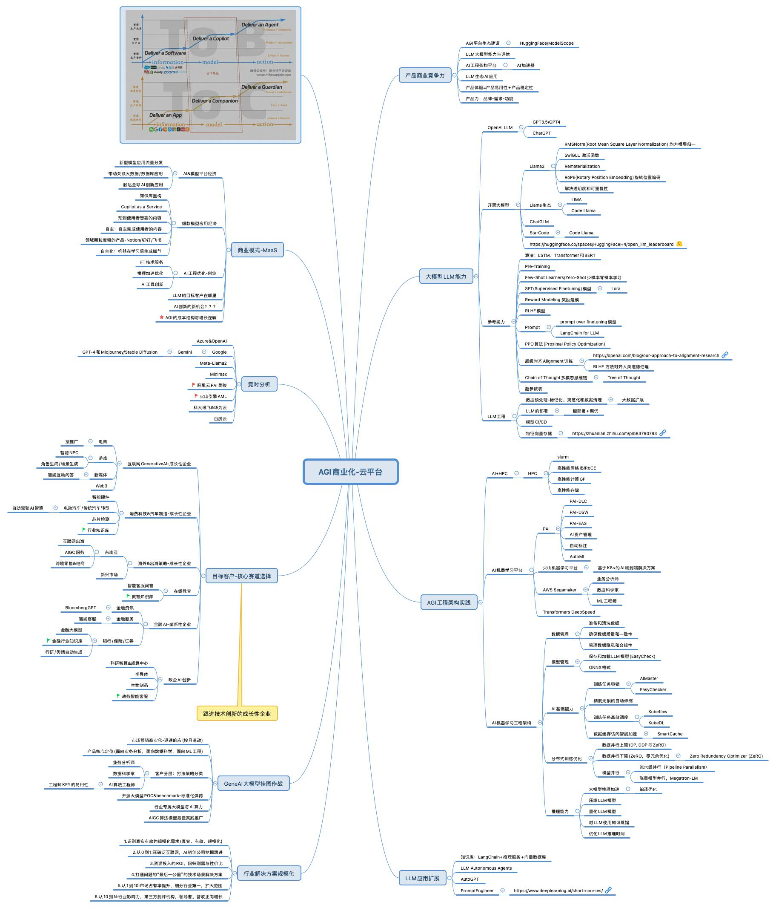

## AI Research-AIGC&LLM Tech Notes
---------------------------------------------

## 1.AGI商业化-云计算平台基础

### 1.1.思考：人工智能 LLM 革命系列

- [人工智能 LLM 革命前夜：一文读懂横扫自然语言处理的 Transformer 模型](https://mp.weixin.qq.com/s/qHtnL5iS_Wav8pEbJePCHA)
- [人工智能 LLM 革命破晓：一文读懂当下超大语言模型发展现状 /船长LLM革命系列2](https://mp.weixin.qq.com/s/UR8T3b3sTYHgZPyJYVPSRg)
- [Copilot as a Service 将打造无数超级个体，核心能力是预测与自主 by 麦克船长](https://mp.weixin.qq.com/s/RVsGXk0pmcbNH1JvwLJiDg)

### 1.2.商业化的思考

	--客户需求在哪里(行业) / 产品场景全链路 / 商业化定价与模式如何
	--从PaaS到SaaS. 定位是怎么样？AIGCaaS
	--2C为王/交易为王/高频为王
	--2B为什么比2C难做？因为当前技术没法细分领域垄断/从技术共建转化成产品沉淀的复杂度
	--AI机器学习平台 / AI生态应用工具 / LLM行业应用 --如何做到差异化
	--长期提供有竞争力的产品服务，其包括产品的质量，产品体验和产品的价格。
	--低价策略背后能够沉淀什么？产品能力 VS 业务商务能力 营销策略如何？
	--黑天鹅-安全可信合规

## 2.**NLP的突破-Transformer 模型**

LLM最重要的文件是这篇关于Transformer模型的学术论文，标题为"Attention Is All You Need"。该论文由Ashish Vaswani等人撰写，首次提出了一种全新的神经网络架构——Transformer，它完全基于注意力机制（Attention Mechanisms），摒弃了传统的循环神经网络（RNNs）和卷积神经网络（CNNs）中的循环和卷积操作。以下是该论文的核心内容概述：

1. **背景与动机**：
    - 传统的序列转换模型（如机器翻译、语言建模）主要基于复杂的循环或卷积神经网络，这些模型通常包含编码器（Encoder）和解码器（Decoder）。
    - 注意力机制已成为这些模型中不可或缺的一部分，允许在不考虑输入或输出序列中距离的情况下建模依赖关系。
    - Transformer模型完全依赖于自注意力（Self-Attention）机制，不使用序列对齐的RNNs或卷积。
2. **模型架构**：
    - 编码器和解码器均由N=6个相同的层堆叠而成，每层包含两个子层：多头自注意力机制（Multi-Head Self-Attention）和简单的逐位置全连接前馈网络（Position-wise Feed-Forward Networks）。
    - 编码器将输入序列映射到连续表示，解码器则基于这些表示生成输出序列。
    - 通过残差连接（Residual Connection）和层归一化（Layer Normalization）来提高模型性能。
3. **注意力机制**：
    - 介绍了缩放点积注意力（Scaled Dot-Product Attention）和多头注意力（Multi-Head Attention）的概念。
    - 多头注意力允许模型同时在不同的表示子空间中关注不同位置的信息。
4. **位置编码**：
    - 由于Transformer模型不包含循环和卷积，因此需要位置编码（Positional Encoding）来利用序列的顺序信息。
5. **训练**：
    - 描述了模型的训练过程，包括训练数据、硬件配置、优化器选择、学习率调整和正则化策略。
6. **实验结果**：
    - 在WMT 2014英德和英法机器翻译任务上，Transformer模型在质量上优于现有最佳模型，并且训练时间显著减少。
    - 论文还展示了Transformer在英语成分句法分析任务上的应用，证明了其在其他任务上的泛化能力。
7. **结论**：
    - Transformer模型在翻译任务上可以比基于循环或卷积层的架构更快地训练，并在多个翻译任务上达到了新的最佳水平。
    - 作者对基于注意力的模型的未来表示兴奋，并计划将其应用于其他任务，包括处理图像、音频和视频等非文本输入输出模态。

这篇论文对自然语言处理（NLP）领域产生了深远的影响，Transformer模型已成为许多后续研究和应用的基础，特别是在机器翻译、文本生成和其他序列到序列任务中。

