## AI Research-AI DeepLearning Reading List 30 IIya 
---------------------------------------------

## Ilya Sutskever’s Top 30 Reading List

- Ilya Sutskever shared a list of 30 papers with John Carmack and said, “If you really learn all of these, you’ll know 90% of what matters today”. Below we will review these [papers/resources](https://arc.net/folder/D0472A20-9C20-4D3F-B145-D2865C0A9FEE).

### Ilya Sutskever’s Top 30 Reading List

### 1. [Attention is All You Need](https://aman.ai/primers/ai/top-30-papers/#attention-is-all-you-need) --Ashish Vaswani, et al.

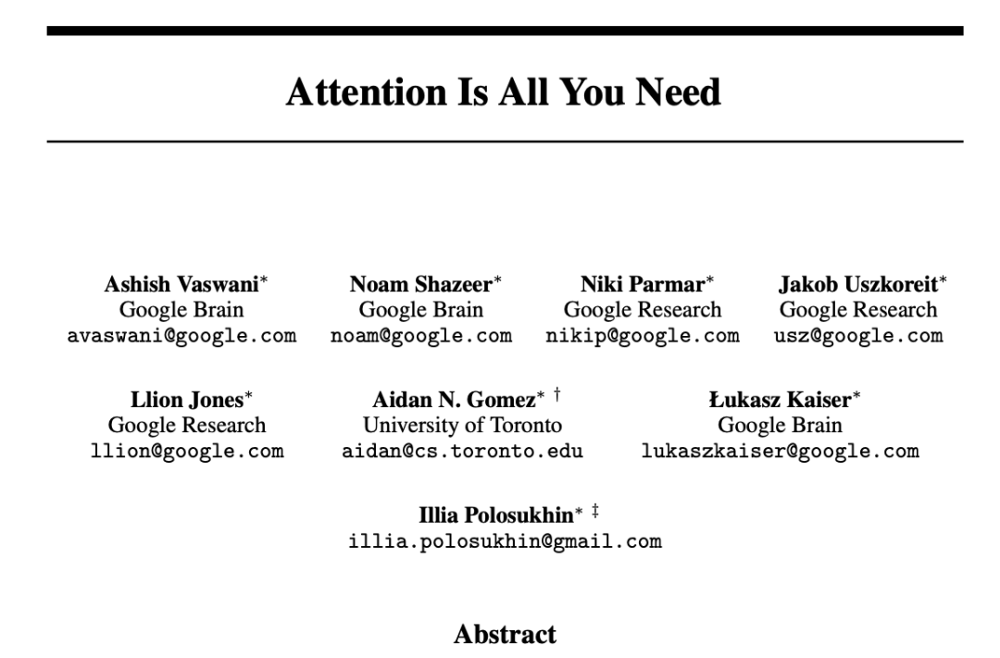

[地址](https://arxiv.org/pdf/1706.03762)

### 2. The Annotated Transformer.** Sasha Rush, et al. [[Blog\]](https://nlp.seas.harvard.edu/annotated-transformer/) [[Code\]](https://github.com/harvardnlp/annotated-transformer/)

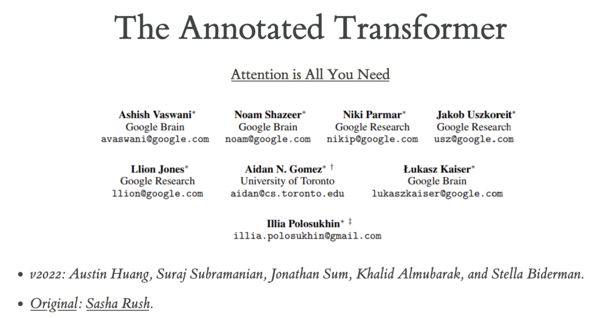

该文章是由康奈尔大学副教授 Alexander Rush 等研究者在 2018 年撰写的博客文章 ，该文章对transformer进行了逐行级的解释，并利用 Python 完整实现了 Transformer架构，可以帮助读者在了解理论的同时，结合实践加深认识。

[文章](https://arc.net/folder/D0472A20-9C20-4D3F-B145-D2865C0A9FEE) /[代码](https://github.com/harvardnlp/annotated-transformer/)

### 3. [The First Law of Complexodynamics](https://aman.ai/primers/ai/top-30-papers/#the-first-law-of-complexodynamics) --Scott Aaronson. [[Blog\]](https://scottaaronson.blog/?p=762)

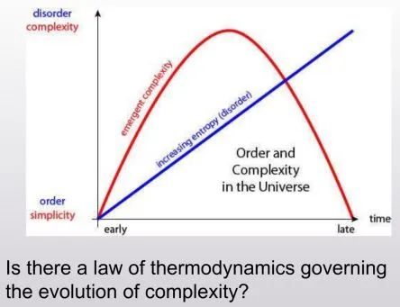

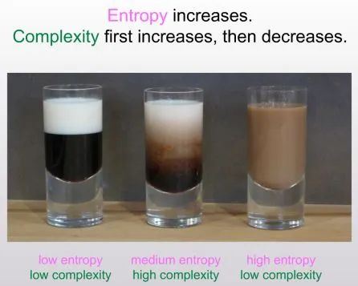

斯科特·阿伦森（Scott Aaronson）的文章《复杂动力学的第一定律》（The First Law of Complexodynamics）围绕肖恩·卡罗尔（Sean Carroll）在FQXi“时间正确设置”会议上提出的一个深刻问题展开：**为什么物理系统的复杂性会随时间先增加、达到峰值、然后减少，而熵却始终单调增加？** 这一问题触及了复杂性、熵和时间演化之间的深层关系，引发了从信息论、计算复杂性到热力学的跨学科思考。

#### 核心问题：复杂性与熵的对比

1. **熵的单调性**：
   - 熵是衡量系统无序程度的物理量，根据热力学第二定律，孤立系统的熵总是随时间增加，直到达到最大熵（热力学平衡态）。
   - 熵的增加是时间箭头的体现，也是物理系统演化的一个基本特征。
2. **复杂性的非单调性**：
   - 复杂性则表现出不同的行为：在系统演化的初期和末期，复杂性较低；而在中间阶段，复杂性达到峰值。
   - 这种“先增后减”的现象表明，复杂性捕捉了系统演化中某种特定的结构或信息特征，而不仅仅是无序程度。

#### 复杂性的量化：柯尔莫哥洛夫复杂性

为了解释复杂性的行为，阿伦森引入了**柯尔莫哥洛夫复杂性**（Kolmogorov Complexity）的概念：

- **定义**：柯尔莫哥洛夫复杂性是指生成某个字符串所需的最短计算机程序的长度。它衡量了描述一个系统或状态所需的信息量。
- **相关概念——精细度（Sophistication）**：精细度是指描述一个集合的最短程序长度，而目标字符串是该集合的典型成员。它进一步细化了复杂性的度量。

#### 新概念：复杂熵（Complextropy）

为了回答卡罗尔的问题，阿伦森提出了**复杂熵**（Complextropy）的概念：

- **定义**：复杂熵是一种考虑计算资源限制的复杂性度量。它反映了从某个集合中输出样本的最短高效程序的比特数，且目标字符串相对于该集合看起来是随机的。
- **猜想**：复杂熵在系统演化的初期和末期较小，而在中间阶段较大，这与观察到的复杂性行为一致。

#### 复杂熵的挑战与实证方法

1. **理论挑战**：
   - 复杂熵的计算非常困难，因为它依赖于最短高效程序，而这是一个不可计算的问题（类似于停机问题）。
   - 因此，复杂熵的定义需要引入计算资源的限制（如时间或空间），这使得其理论分析更加复杂。
2. **实证方法**：
   - 阿伦森提出了一种实用的近似方法：使用**gzip压缩文件的大小**作为柯尔莫哥洛夫复杂性的代理。
   - 通过压缩算法，可以间接估计描述系统状态所需的信息量，从而近似复杂熵。
   - 目前正在进行的研究项目旨在利用这种方法，通过实验验证复杂熵的猜想。

#### 复杂熵的意义与启示

1. **复杂性与熵的关系**：
   - 复杂熵的提出为理解复杂性与熵的关系提供了新的视角。它表明，复杂性不仅仅是无序的度量，而是与系统演化中的结构和信息模式密切相关。
   - 在系统演化的初期，复杂性较低，因为系统处于高度有序或高度随机的状态；在中间阶段，系统可能表现出丰富的结构和模式，导致复杂性增加；而在末期，系统趋向于热力学平衡态，复杂性再次降低。
2. **时间箭头与复杂性**：
   - 复杂熵的行为可能揭示了时间箭头的一种新维度。熵的增加描述了时间的方向性，而复杂性的变化则可能反映了系统在时间演化中的信息结构变化。
   - 这一观点可能对理解宇宙的演化、生命的起源以及复杂系统的涌现现象具有重要意义。
3. **跨学科的研究价值**：
   - 复杂熵的研究涉及物理学、计算机科学、信息论和复杂系统科学等多个领域，体现了跨学科研究的重要性。
   - 通过结合理论分析和实证方法，可以更深入地探索复杂性的本质及其在自然界中的作用。

#### 未来研究方向

1. **理论证明**：
   - 需要进一步发展复杂熵的数学框架，并尝试在特定模型（如统计力学模型或量子系统）中证明其行为。
   - 可能的工具包括算法信息论、计算复杂性理论和统计物理学。
2. **实证验证**：
   - 利用压缩算法等实用方法，对复杂熵的猜想进行实验验证。这可能涉及对物理系统（如流体动力学、量子系统）或计算模型（如元胞自动机）的模拟。
   - 通过大规模数据分析，验证复杂熵是否确实表现出“先增后减”的行为。
3. **复杂性与生命、宇宙的关系**：
   - 复杂熵的研究可能对理解生命的起源和演化提供新的线索。例如，生命系统是否处于复杂性较高的状态？宇宙的演化是否遵循复杂熵的规律？
   - 这些问题可能推动复杂系统科学和宇宙学的进一步发展。

#### 总结

阿伦森的文章通过引入复杂熵的概念，为理解复杂性的时间演化提供了新的理论框架。复杂熵不仅捕捉了系统演化中的信息结构变化，还为探索时间箭头、宇宙演化和生命起源等深刻问题提供了新的工具。尽管复杂熵的计算和证明面临巨大挑战，但其理论和实证研究具有重要的科学意义，可能在未来推动多个学科的交叉与融合。[文章](https://scottaaronson.blog/?p=762)

### 4. [The Unreasonable Effectiveness of Recurrent Neural Networks](https://aman.ai/primers/ai/top-30-papers/#the-unreasonable-effectiveness-of-recurrent-neural-networks) --Andrej Karpathy. [[Blog\]](https://karpathy.github.io/2015/05/21/rnn-effectiveness/) [[Code\]](https://github.com/karpathy/char-rnn)

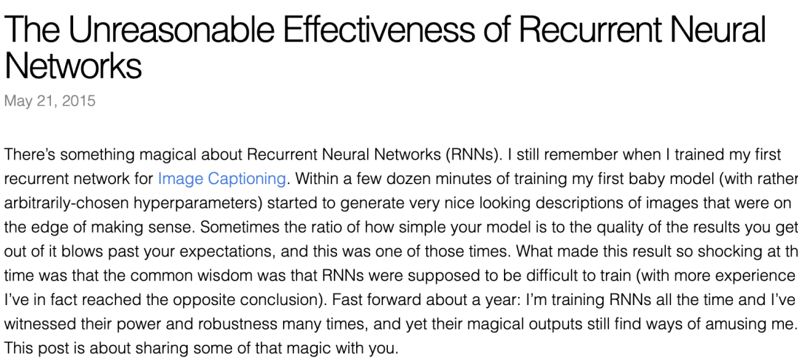

安德烈·卡帕西（Andrej Karpathy）的文章《循环神经网络的不可思议的有效性》（The Unreasonable Effectiveness of Recurrent Neural Networks）深入探讨了循环神经网络（RNNs）的强大能力。文章不仅展示了RNNs在序列数据处理中的独特优势，还通过生动的实例和详细的解释，揭示了RNNs在语言建模、文本生成等任务中的惊人表现。以下是对文章的深度分析与思考：

------

#### 1) **RNNs的核心优势：序列建模能力**

RNNs的核心特点是能够处理**序列数据**，这使得它们在许多任务中表现出色。与传统的神经网络不同，RNNs可以接受任意长度的输入序列，并生成相应长度的输出序列。这种能力使RNNs成为处理时间序列数据、自然语言文本、语音信号等任务的理想选择。

- **隐藏状态（Hidden State）**：RNNs通过隐藏状态来“记忆”之前输入的信息。这种记忆机制使得RNNs能够捕捉序列中的长期依赖关系，从而更好地理解上下文。
- **动态更新**：RNNs通过矩阵乘法和非线性函数（如tanh或ReLU）动态更新隐藏状态，从而逐步处理序列中的每个元素。

------

#### 2) **RNNs的训练与挑战**

尽管RNNs在理论上非常强大，但卡帕西指出，RNNs的训练长期以来被认为是非常困难的。主要原因包括：

- **梯度消失和梯度爆炸问题**：在长序列中，RNNs的梯度可能会变得非常小（消失）或非常大（爆炸），导致模型难以学习长期依赖关系。
- **计算复杂性**：RNNs需要逐步处理序列中的每个元素，这使得训练过程计算密集且耗时。

然而，卡帕西通过自己的实验发现，即使在没有精心调参的情况下，RNNs也能表现出令人惊讶的效果。例如，在图像描述任务中，RNNs能够生成看似合理的图像描述，尽管其初始设置是随机的。这表明RNNs具有强大的潜力，即使在实际应用中存在一些挑战。

------

#### 3) **LSTM：解决RNNs的局限性**

为了克服RNNs的局限性，卡帕西提到了**长短期记忆网络（LSTM）**，这是一种改进的RNN架构。LSTM通过引入门控机制（输入门、遗忘门、输出门）来控制信息的流动，从而有效地解决了梯度消失问题，并能够更好地捕捉长期依赖关系。

- **LSTM的应用**：LSTM在自然语言处理、语音识别、时间序列预测等领域取得了巨大成功，成为RNNs的主流变体之一。
- **RNNs vs. LSTM**：虽然LSTM更复杂，但它在实际任务中的表现通常优于普通RNNs，尤其是在处理长序列数据时。

------

#### 4) **字符级语言模型的强大表现**

卡帕西通过训练字符级语言模型，展示了RNNs在文本生成任务中的强大能力。具体来说，RNNs通过预测序列中的下一个字符，逐步生成文本。这种方法不仅简单，而且能够捕捉语言的复杂结构和上下文信息。

- **多样化的训练数据**：卡帕西使用了多种类型的文本数据（如保罗·格雷厄姆的散文、莎士比亚的作品、维基百科文章、LaTeX格式的代数几何、Linux源代码、婴儿名字等）来训练RNNs。这些实验表明，RNNs能够学习到不同领域的语言模式和语法规则。
- **生成的文本示例**：RNNs生成的文本不仅语法正确，还能捕捉到特定领域的风格和内容。例如，RNNs生成的莎士比亚风格的文本看起来非常逼真，甚至能够模仿其独特的语言风格。

------

#### 5) **RNNs的学习过程与可视化**

卡帕西还详细描述了RNNs的训练过程，并展示了模型在训练过程中逐渐改进的表现。通过可视化RNNs的内部状态，他揭示了模型如何学习特定的模式：

- **神经元的激活模式**：某些神经元会对特定的模式（如URL、Markdown语法）产生强烈的反应，这表明RNNs能够自动学习到数据中的有用特征。
- **从随机到有序**：在训练初期，RNNs生成的文本几乎是随机的；但随着训练的进行，模型逐渐学会生成符合语法和语义规则的文本。

------

#### 6) **RNNs的广泛应用与未来**

卡帕西强调，RNNs不仅在文本生成任务中表现出色，还在许多其他领域（如自然语言处理、计算机视觉、语音识别）中发挥着重要作用。随着深度学习技术的不断发展，RNNs及其变体（如LSTM、GRU）已经成为现代人工智能系统的核心组件之一。

- **开源代码与教育意义**：卡帕西鼓励读者通过他分享的GitHub代码亲自尝试训练RNNs，体验其强大能力。这种实践不仅有助于理解RNNs的工作原理，还能激发更多的创新和研究。
- **未来方向**：尽管RNNs已经取得了巨大成功，但卡帕西也暗示，未来可能会有更强大的模型（如Transformer）取代RNNs，进一步推动人工智能的发展。

------

#### 7) **总结与思考**

卡帕西的文章通过生动的实例和深入的分析，展示了RNNs在序列建模和文本生成任务中的强大能力。尽管RNNs在训练中存在一些挑战，但通过改进架构（如LSTM）和优化技术，它们已经成为现代人工智能的重要工具。

- **RNNs的哲学意义**：RNNs的成功再次证明了“简单而有效”的设计原则。尽管RNNs的基本结构相对简单，但它们能够捕捉复杂的模式和依赖关系，这反映了深度学习的核心思想——通过大规模数据和计算能力，从简单模型中涌现出复杂的行为。
- **对未来的启示**：RNNs的研究不仅推动了自然语言处理等领域的发展，还为理解人类语言的本质提供了新的视角。随着技术的进步，RNNs及其变体可能会在更多领域展现出“不可思议的有效性”。

------

卡帕西的文章不仅是一篇技术性的教程，更是一篇充满启发性的科学散文。它提醒我们，在人工智能的研究中，保持好奇心和探索精神是推动创新的关键。通过不断尝试和实验，我们可能会发现更多“不可思议”的现象，并推动技术的边界进一步扩展。[地址](https://karpathy.github.io/2015/05/21/rnn-effectiveness/)

### 5. [Understanding LSTM Networks](https://aman.ai/primers/ai/top-30-papers/#understanding-lstm-networks) --Christopher Olah. [[Blog\]](https://colah.github.io/posts/2015-08-Understanding-LSTMs/)

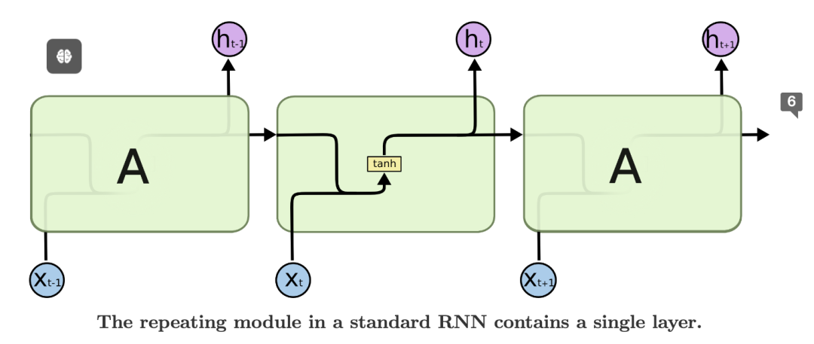

该文由Anthropic 联合创始人、Ilya 和 Christopher Olah 于 15 年撰写，本文介绍了LSTM长短期记忆，它是一种特殊的循环神经网络，能够处理长期依赖关系。它在语音识别、语言建模、翻译、图像描述等领域取得了巨大成功。克里斯托弗·奥拉（Christopher Olah）的文章《理解LSTM网络》（Understanding LSTM Networks）深入解析了长短期记忆网络（LSTM）的结构和工作原理。LSTM是一种特殊的循环神经网络（RNN），旨在解决传统RNN在处理长时依赖问题上的局限性。以下是对文章的深度分析与思考：

------

### 1. **传统RNN的局限性**

奥拉首先指出了传统神经网络和RNN在处理序列数据时的局限性：

- **固定输入输出**：传统神经网络只能处理固定大小的输入和输出，无法直接处理变长的序列数据。
- **短期记忆问题**：虽然RNN通过循环结构能够处理序列数据，但它们难以捕捉长时依赖关系。例如，在语言建模中，模型可能需要记住很久之前出现的单词来预测当前单词，而传统RNN往往无法有效传递这种远距离信息。
- **梯度消失与梯度爆炸**：在训练RNN时，梯度可能会随着时间步的增加而逐渐消失或爆炸，导致模型难以学习长时依赖关系。

------

### 2. **LSTM的核心思想**

为了克服传统RNN的局限性，LSTM引入了**细胞状态（Cell State）\**和\**门控机制（Gates）**。这些设计使得LSTM能够选择性地记住或忘记信息，从而有效地处理长时依赖问题。

- **细胞状态**：细胞状态是LSTM的核心，它像一个传送带，能够在序列的不同时间步之间传递信息。细胞状态的设计使得信息能够长期保存而不受干扰。
- **门控机制**：LSTM通过三个门（输入门、遗忘门、输出门）来控制信息的流动：
  - **遗忘门（Forget Gate）**：决定哪些信息从细胞状态中丢弃。
  - **输入门（Input Gate）**：决定哪些新信息添加到细胞状态中。
  - **输出门（Output Gate）**：决定哪些信息从细胞状态输出到隐藏状态。

------

### 3. **LSTM的工作流程**

奥拉通过详细的图示和公式，逐步解释了LSTM的工作流程：

1. **遗忘门**：遗忘门根据当前输入和上一时刻的隐藏状态，计算一个介于0和1之间的值，决定细胞状态中哪些信息需要保留或丢弃。
2. **输入门**：输入门决定哪些新信息需要添加到细胞状态中。同时，LSTM会生成一个候选值，表示可能添加到细胞状态的新信息。
3. **更新细胞状态**：细胞状态通过遗忘门和输入门的计算结果进行更新。遗忘门控制旧信息的保留，输入门控制新信息的添加。
4. **输出门**：输出门决定哪些信息从细胞状态输出到隐藏状态，并作为当前时间步的输出。

------

### 4. **LSTM的变体**

奥拉还讨论了LSTM的一些变体，这些变体在特定任务中可能表现更好：

- **窥视孔连接（Peephole Connections）**：允许门控机制直接查看细胞状态，从而更精确地控制信息流动。
- **门控循环单元（GRU）**：GRU是LSTM的简化版本，它将遗忘门和输入门合并为一个更新门，并去除了细胞状态。GRU在某些任务中表现与LSTM相当，但计算效率更高。

------

### 5. **LSTM的应用与意义**

LSTM在多个领域取得了显著的成功，包括：

- **自然语言处理**：如机器翻译、文本生成、语音识别等。
- **时间序列预测**：如股票价格预测、天气预测等。
- **序列建模**：如视频分析、音乐生成等。

奥拉指出，LSTM的成功不仅在于其强大的建模能力，还在于其设计思想对深度学习领域的深远影响。LSTM的门控机制为后续模型（如Transformer）的设计提供了重要启示。

------

### 6. **未来方向**

文章最后，奥拉提到了RNN研究的未来方向，包括：

- **注意力机制（Attention Mechanism）**：注意力机制通过动态选择重要信息，进一步增强了模型处理长时依赖的能力。
- **Grid LSTM**：Grid LSTM通过引入多维结构，扩展了LSTM的建模能力，适用于更复杂的任务。

------

### 7. **总结与思考**

奥拉的文章通过清晰的解释和图示，深入浅出地介绍了LSTM的结构和工作原理。LSTM的成功不仅在于其解决了传统RNN的局限性，还在于其设计思想对深度学习领域的深远影响。

- **LSTM的哲学意义**：LSTM的设计体现了“选择性记忆”的思想，这与人类大脑的工作方式有相似之处。通过选择性地记住重要信息、忘记无关信息，LSTM能够更有效地处理复杂任务。
- **对未来的启示**：LSTM的研究为深度学习领域提供了重要的理论基础和实践经验。随着注意力机制、Transformer等新技术的发展，LSTM的设计思想将继续影响未来的模型设计。

------

奥拉的文章不仅是一篇技术性的教程，更是一篇启发性的科学散文。它提醒我们，在人工智能的研究中，理解模型的本质和设计思想是推动创新的关键。通过不断探索和改进，我们可能会发现更多“不可思议”的现象，并推动技术的边界进一步扩展。

[地址](https://colah.github.io/posts/2015-08-Understanding-LSTMs/)

### 6. [Recurrent Neural Network Regularization](https://aman.ai/primers/ai/top-30-papers/#recurrent-neural-network-regularization) --Wojciech Zaremba, et al. [[ArXiv\]](https://arxiv.org/abs/1409.2329) [[pdf\]](https://arxiv.org/pdf/1409.2329) [[Code\]](https://github.com/wojzaremba/lstm)

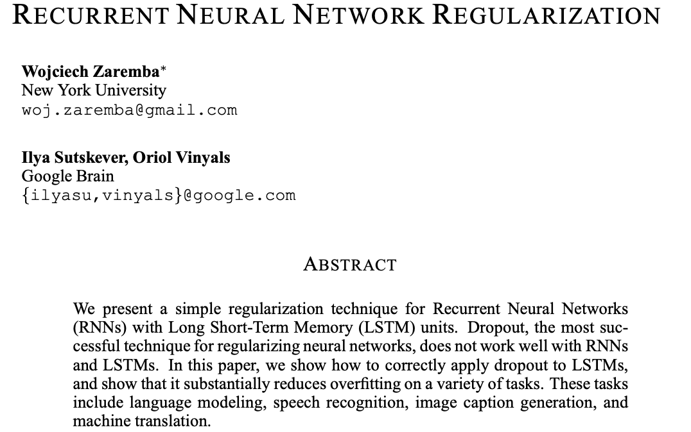

本文是由ilya 2015年撰写的，提出了一种递归神经网络的简单正则化技术（RNN）与长短期存储器（LSTM）单元。Dropout是正则化神经网络最成功的技术，但它不能很好地与RNN配合使用和LSTM。在本文中我们展示了如何正确地将dropout应用于LSTM，并表明它大大减少了对各种任务的过拟合。这些任务包括语言建模、语音识别、图像字幕生成，以及机器翻译。

[地址](https://arxiv.org/pdf/1409.2329.pdf)

### 7. [Keeping Neural Networks Simple by Minimizing the Description Length of the Weights](https://aman.ai/primers/ai/top-30-papers/#keeping-neural-networks-simple-by-minimizing-the-description-length-of-the-weights) --Geoffrey E. Hinton and Drew van Camp. [[Paper\]](https://dl.acm.org/doi/10.1145/168304.168306) [[pdf\]](https://www.cs.toronto.edu/~hinton/absps/colt93.pdf)

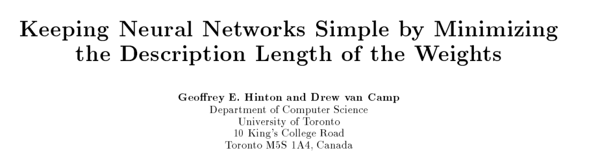

Geoffrey E. Hinton 和 Drew van Camp 的论文《通过最小化权重的描述长度保持神经网络简单》（Keeping Neural Networks Simple by Minimizing the Description Length of the Weights）提出了一种新颖的正则化方法，通过惩罚权重中的信息量来控制神经网络的复杂度。该方法的核心思想是在权重中添加高斯噪声，并在训练过程中动态调整噪声水平，以平衡网络误差和权重复杂度之间的权衡。

以下是对论文的深度分析与思考：

	1. 背景与动机
	过拟合问题：在训练数据有限的情况下，神经网络容易过拟合，即模型在训练集上表现良好，但在测试集上表现较差。

	正则化的目标：正则化的目的是通过限制模型的复杂度来提高其泛化能力。传统的正则化方法包括权重衰减（L2正则化）和 Dropout。

	最小描述长度（MDL）原则：MDL 是一种信息论方法，认为最佳模型是能够以最短的编码长度描述数据和模型本身的模型。Hinton 和 van Camp 将这一原则应用于神经网络，提出通过最小化权重的描述长度来正则化模型。

	2. 方法：基于 MDL 的正则化
	作者提出了一种基于 MDL 的正则化方法，具体包括以下步骤：

	添加高斯噪声：在权重中添加高斯噪声，从而控制权重的精度。噪声的方差决定了权重的描述长度：噪声越大，权重的精度越低，描述长度越短。

	动态调整噪声水平：在训练过程中，动态调整噪声的方差，以优化网络的性能。噪声水平的调整基于权重的信息量和网络的误差。

	计算导数：为了高效地优化噪声水平，作者推导了期望平方误差和权重信息量的导数。这些导数可以在不进行耗时的蒙特卡罗模拟的情况下计算，前提是输出单元是线性的。

	3. 核心思想：噪声权重的紧凑编码
	噪声权重的优势：通过添加高斯噪声，权重的值可以被更紧凑地编码。这是因为噪声使得权重的分布更加平滑，从而减少了描述权重所需的比特数。

	MDL 的权衡：该方法在权重精度和网络误差之间进行权衡。较高的噪声水平可以减少权重的描述长度，但可能会增加网络的误差；较低的噪声水平则相反。

	自适应高斯混合模型：作者还提出使用自适应高斯混合模型来编码权重。这种混合模型能够根据权重的分布动态调整，从而进一步提高模型的泛化能力。

	4. 实验与结果
	作者在多个任务上验证了该方法的有效性，包括语言建模、语音识别和图像描述生成。

	1) 高维任务中的实验
	任务：在高维任务（如语言建模）中，训练数据通常有限，模型容易过拟合。

	结果：实验表明，基于 MDL 的正则化方法能够有效地拟合复杂的非线性模型，其表现略优于传统的权重衰减方法。

	意义：该方法在处理高维、数据稀缺的任务时展现了潜力，为神经网络的正则化提供了新的思路。

	2) 与传统方法的对比
	权重衰减：传统的权重衰减方法通过惩罚权重的 L2 范数来限制模型的复杂度。然而，这种方法无法直接控制权重的信息量。

	MDL 方法的优势：基于 MDL 的方法通过控制权重的描述长度，能够更精细地平衡模型的复杂度和误差。

	5. 贡献与意义
	理论贡献：论文将 MDL 原则引入神经网络的正则化，提出了一种基于信息论的正则化方法。这一方法为理解模型复杂度与泛化能力之间的关系提供了新的视角。

	实践贡献：通过实验，作者证明了该方法在多个任务中的有效性，尤其是在数据稀缺的情况下。

	通用性：虽然论文主要针对神经网络，但基于 MDL 的正则化方法可以推广到其他机器学习模型。

	6. 未来方向
	进一步实验验证：作者指出，需要更多的实验来验证该方法在不同任务和数据集上的竞争力。

	与其他正则化技术的结合：将基于 MDL 的正则化与其他正则化技术（如 Dropout、批量归一化）结合，可能会进一步提升模型性能。

	理论分析：进一步研究该方法在更复杂模型（如深度神经网络、Transformer）中的应用，探索其理论极限。

	7. 总结与思考
	Hinton 和 van Camp 的论文通过引入基于 MDL 的正则化方法，为神经网络的正则化提供了新的工具。其核心思想是通过控制权重的描述长度来平衡模型的复杂度和误差，这一设计体现了信息论在深度学习中的深刻应用。

	正则化的新视角：传统的正则化方法通常基于启发式设计，而基于 MDL 的方法则从信息论的角度出发，为正则化提供了理论支持。

	对数据稀缺任务的启示：在处理高维、数据稀缺的任务时，基于 MDL 的正则化方法展现了显著的优势，为实际应用提供了新的解决方案。

	对未来的启示：随着深度学习模型的复杂度不断增加，正则化技术的研究将变得越来越重要。这篇论文为未来的研究提供了重要的理论基础和实践经验。

	总之，这篇论文不仅提出了一种有效的正则化方法，还通过实验验证了其在实际任务中的价值，为神经网络的研究和应用提供了新的方向。[地址](https://www.cs.toronto.edu/~hinton/absps/colt93.pdf)

### 8. [Pointer Networks](https://aman.ai/primers/ai/top-30-papers/#pointer-networks) --Oriol Vinyals, et al. [[Paper\]](https://papers.nips.cc/paper/5866-pointer-networks) [[pdf\]](https://arxiv.org/pdf/1506.03134)

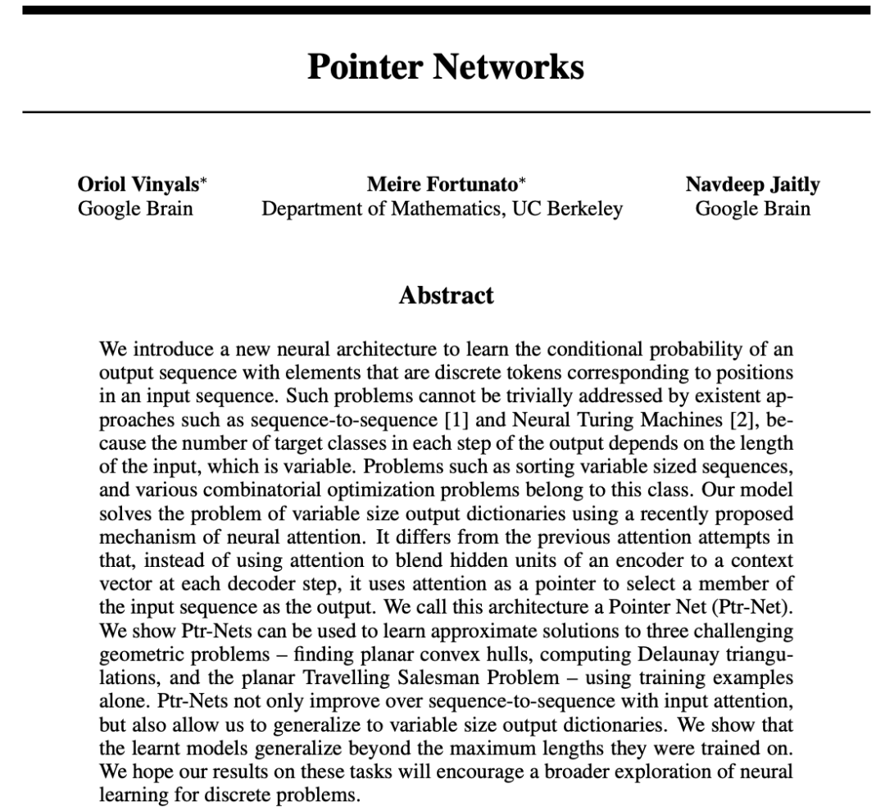

论文引入了一种新的神经网络架构，该架构旨在学习输出序列的条件概率，其中输出序列由代表输入序列位置的离散Token(代币)组成。现有的方法，如序列到序列转换  和神经图灵机，无法轻易解决这类问题，因为输出序列中每一步的目标类别数依赖于可变的输入长度。例如，排序可变长度序列和各类组合优化问题都属于这种问题。我们的模型利用最近提出的神经注意机制解决了可变长度输出字典的问题。与以前的注意力机制不同，我们的方法不是将注意力用于融合编码器的隐藏单元到每个解码步骤的上下文向量中，而是将注意力用作一个指针，选取输入序列中的元素作为输出。我们将这种架构称为指针网络（Ptr-Net）。通过只使用训练实例，我们证明了Ptr-Net能够学习到三个复杂几何问题-计算平面凸包、Delaunay三角剖分以及平面旅行商问题-的近似解。Ptr-Net不仅改进了带输入注意力的序列到序列模型，还实现了输出字典规模可变性的泛化。我们进一步展示了，这些学习到的模型能够泛化到超出训练时的最大长度。我们希望这些任务上的结果能鼓励对离散问题的神经网络学习方法进行更深入的研究。

[地址](https://arxiv.org/pdf/1506.03134)

### 9. [ImageNet Classification with Deep Convolutional Neural Networks](https://aman.ai/primers/ai/top-30-papers/#imagenet-classification-with-deep-convolutional-neural-networks)

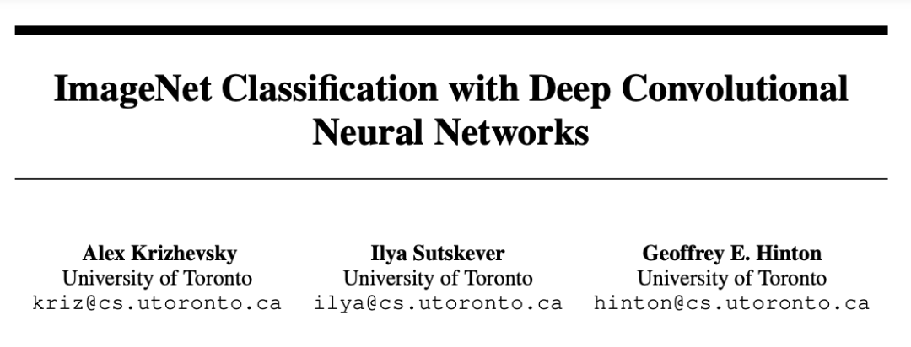

本文图灵奖得主 Geoffrey Hinton ，ilya等撰写，提出 AlexNet，颠覆图像识别领域，开启了深度学习革命。他们训练了一种庞大的深度卷积神经网络来对ImageNet LSVRC-2010竞赛的1.2百万张高清图像进行分类，这些图像被分为1000个不同类别。在测试数据集上，实现了37.5%的top-1错误率和17.0%的top-5错误率，显著优于之前的最佳水平。该神经网络拥有60,000,000个参数和650,000个神经元，由五个卷积层组成，部分卷积层后接最大池化层，还包括三个全连接层以及最后的1000维softmax输出层。为了加快训练速度，采用了非饱和神经元以及高效的GPU卷积操作实现。此外，为了降低全连接层的过拟合，采用了一种名为“dropout（随机失活）”的新近开发的正则化技术，这一技术非常有效。在ILSVRC-2012比赛中提交了这个模型的改进型，并以15.3%的top-5测试错误率赢得了冠军，较第二名低了10.9个百分点，这表明了模型的显著提升。

[地址](https://proceedings.neurips.cc/paper_files/paper/2012/file/c399862d3b9d6b76c8436e924a68c45b-Paper.pdf)

### 10. [Order Matters: Sequence to Sequence for Sets](https://aman.ai/primers/ai/top-30-papers/#order-matters-sequence-to-sequence-for-sets)  --Oriol Vinyals, et al. [[ArXiv\]](https://arxiv.org/abs/1511.06391) [[pdf\]](https://arxiv.org/pdf/1511.06391)

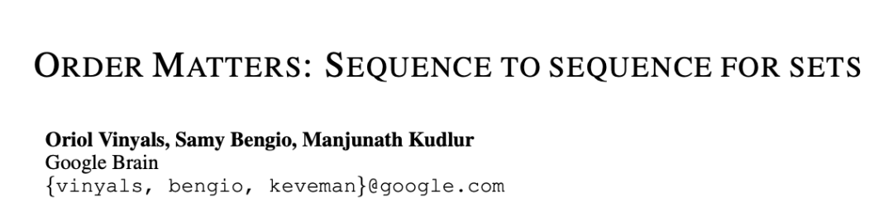

随着循环神经网络的兴盛，序列在有监督学习中越发重要。现在，许多复杂的任务，如映射观察序列，都可以通过使用序列到序列转换（seq2seq）框架来构建，该框架采用链式法则高效表示序列的联合概率。但在某些情况下，可变长度的输入/输出并不适合以序列形式表现。比如，对于排序任务，还不清楚如何把一组数字输入模型；相似地，当任务涉及建模随机变量的未知联合概率时，我们也不知道应如何组织输出。在这篇论文中，我们首先通过多个例子证明了输入/输出数据组织顺序对学习底层模式的显著影响。我们接着探讨了seq2seq框架的一种扩展，它能够超越序列处理，按照原理性的方法处理输入集。另外，我们提出了一种损失函数，它通过在训练过程中探讨不同的数据序列，解决输出集合结构缺失的问题。我们提供了关于订单重要性的实证证据，并展示了在语言建模和解析任务的基准测试，以及两个人造任务——数字排序和估计未知图模型的联合概率上对seq2seq框架所做的修改。

[地址](https://arxiv.org/pdf/1511.06391)

### 11. [GPipe: Easy Scaling with Micro-Batch Pipeline Parallelism](https://aman.ai/primers/ai/top-30-papers/#gpipe-easy-scaling-with-micro-batch-pipeline-parallelism) --Yanping Huang, et al. [[ArXiv\]](https://arxiv.org/abs/1811.06965) [[pdf\]](https://arxiv.org/pdf/1811.06965)

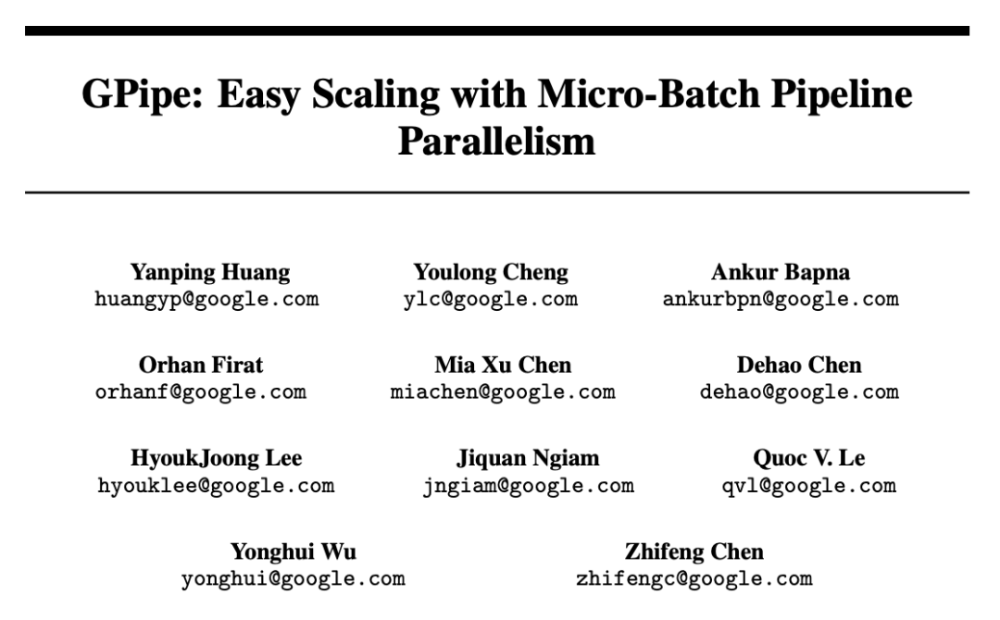

提升深度神经网络的计算容量已证明是提高多种机器学习任务中模型性能的有效办法。然而，在很多情况下，增加模型的计算力以超越单个加速设备的内存限制，通常需要开发专门的算法或基础架构。这些方案往往依赖于特定的硬件架构，且难以应用于其他任务。为了应对这种对于高效且与任务无关的模型并行性需求，文中介绍了GPipe，这是一个实现流水线并行化的库，它能使任何可以表示为层序列的网络进行规模化扩展。利用GPipe，通过在不同加速设备上对不同的层子序列进行流水线作业，可以灵活且高效地扩大各种网络的规模至巨大程度。此外，GPipe采用了一种创新的批处理分流算法，在将模型分配到多个加速设备时，几乎可实现线性的加速效果。通过在具有不同网络架构的两项不同任务上训练大规模神经网络来展示GPipe的优势：一是图像分类，训练了一个参数量达到5.57亿的AmoebaNet模型，在ImageNet-2012数据集上获得了84.4%的top-1准确率；二是多语言神经机器翻译，训练了一个包含128层Transformer结构、6亿参数量，覆盖超过100种语言的巨型模型，其表现超越了所有双语模型。

[地址](https://arxiv.org/pdf/1811.06965)

### 12. [Deep Residual Learning for Image Recognition](https://aman.ai/primers/ai/top-30-papers/#deep-residual-learning-for-image-recognition) --Kaiming He, et al.

### 13. [Multi-Scale Context Aggregation by Dilated Convolutions](https://aman.ai/primers/ai/top-30-papers/#multi-scale-context-aggregation-by-dilated-convolutions) --Fisher Yu and Vladlen Koltun.

### 14. [Neural Message Passing for Quantum Chemistry](https://aman.ai/primers/ai/top-30-papers/#neural-message-passing-for-quantum-chemistry)  --Justin Gilmer, et al.

### 15. [Neural Machine Translation by Jointly Learning to Align and Translate](https://aman.ai/primers/ai/top-30-papers/#neural-machine-translation-by-jointly-learning-to-align-and-translate) --Dzmitry Bahdanau, et al.

### 16. [Identity Mappings in Deep Residual Networks](https://aman.ai/primers/ai/top-30-papers/#identity-mappings-in-deep-residual-networks) --Kaiming He, et al.

### 17. [A Simple Neural Network Module for Relational Reasoning](https://aman.ai/primers/ai/top-30-papers/#a-simple-neural-network-module-for-relational-reasoning) --Adam Santoro, et al.

### 18. [Variational Lossy Autoencoder](https://aman.ai/primers/ai/top-30-papers/#variational-lossy-autoencoder) --Xi Chen, et al.

### 19. [Relational Recurrent Neural Networks](https://aman.ai/primers/ai/top-30-papers/#relational-recurrent-neural-networks) --Adam Santoro, et al.

### 20. [Quantifying the Rise and Fall of Complexity in Closed Systems: the Coffee Automaton](https://aman.ai/primers/ai/top-30-papers/#quantifying-the-rise-and-fall-of-complexity-in-closed-systems-the-coffee-automaton) --Scott Aaronson, et al.

### 21. [Neural Turing Machines](https://aman.ai/primers/ai/top-30-papers/#neural-turing-machines) --Alex Graves, et al.

### 22. [Deep Speech 2: End-to-End Speech Recognition in English and Mandarin](https://aman.ai/primers/ai/top-30-papers/#deep-speech-2-end-to-end-speech-recognition-in-english-and-mandarin) --Dario Amodei, et al.

### 23. [Scaling Laws for Neural Language Models](https://aman.ai/primers/ai/top-30-papers/#scaling-laws-for-neural-language-models) --Jared Kaplan, et al.

### 24. [A Tutorial Introduction to the Minimum Description Length Principle](https://aman.ai/primers/ai/top-30-papers/#a-tutorial-introduction-to-the-minimum-description-length-principle) --Peter Grunwald.

### 25. [Machine Super Intelligence](https://aman.ai/primers/ai/top-30-papers/#machine-super-intelligence) --Shane Legg.

### 26. [Kolmogorov Complexity and Algorithmic Randomness](https://aman.ai/primers/ai/top-30-papers/#kolmogorov-complexity-and-algorithmic-randomness) --A.Shen, V. A. Uspensky, and N. Vereshchagin.

### 27. [Stanford’s CS231n Convolutional Neural Networks for Visual Recognition](https://aman.ai/primers/ai/top-30-papers/#stanfords-cs231n-convolutional-neural-networks-for-visual-recognition) 

### Meta

### 28. Better & Faster Large Language Models Via Multi-token Prediction

   - [Key Takeaways:](https://aman.ai/primers/ai/top-30-papers/#key-takeaways)

### 29. Dense Passage Retrieval for Open-Domain Question Answering

   - [Dense Passage Retriever (DPR):](https://aman.ai/primers/ai/top-30-papers/#dense-passage-retriever-dpr)

### 30. [Retrieval-Augmented Generation for Knowledge-Intensive NLP Tasks](https://aman.ai/primers/ai/top-30-papers/#retrieval-augmented-generation-for-knowledge-intensive-nlp-tasks)

### HuggingFace

### 31. [Zephyr: Direct Distillation of LM Alignment](https://aman.ai/primers/ai/top-30-papers/#zephyr-direct-distillation-of-lm-alignment)

### Stanford

### 32. [Lost in the Middle: How Language Models Use Long Contexts](https://aman.ai/primers/ai/top-30-papers/#lost-in-the-middle-how-language-models-use-long-contexts)

### Misc

### 33. [Precise Zero-Shot Dense Retrieval Without Relevance Labels](https://aman.ai/primers/ai/top-30-papers/#precise-zero-shot-dense-retrieval-without-relevance-labels)

### 34. [ALCUNA: Large Language Models Meet New Knowledge](https://aman.ai/primers/ai/top-30-papers/#alcuna-large-language-models-meet-new-knowledge)

### 35. [The Perils & Promises of Fact-checking with Large Language Models](https://aman.ai/primers/ai/top-30-papers/#the-perils--promises-of-fact-checking-with-large-language-models)

## 参考Reference

- [Top30 Paper](https://aman.ai/primers/ai/top-30-papers/#deep-residual-learning-for-image-recognition)
