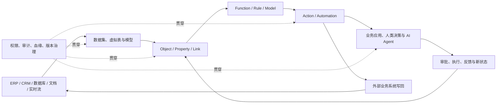
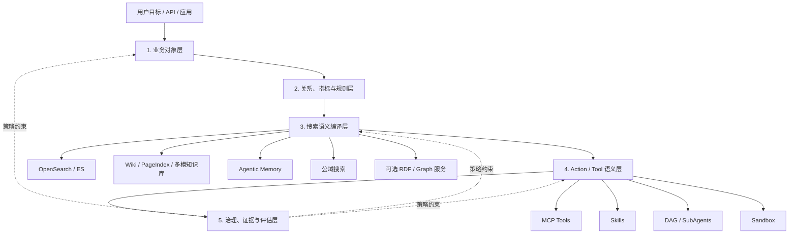
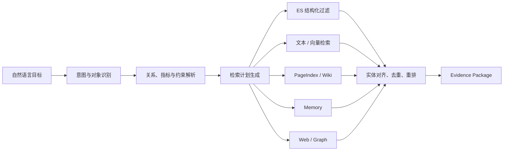

# Palantir Ontology 理论技术体系与 Agentic Search 2.0 语义层深度分析

> 面向内部产品、技术架构、搜索、知识库与 Agent 平台团队  
> 研究范围：Palantir Ontology、Ontology 与语义层、主流开源实现、Agentic Search 2.0 语义层建设  
> 研究日期：2026-07-25

## 一、执行摘要

### 1. 核心结论

1. **Palantir Ontology 不是传统意义上的 OWL 本体库，也不是 BI 语义层。**  
   它把企业中的数据、业务对象、关系、逻辑、动作、权限和应用运行时统一到一个“业务操作系统”中。其关键差异不在于定义了多少概念，而在于完成了从“业务名词”到“受治理业务动作”的闭环。

2. **Ontology 与语义层不是互斥概念。**  
   Ontology 解决“企业世界由什么构成、对象之间是什么关系、哪些规则成立”；语义层解决“上层应用如何以一致口径查询和使用这些数据”。语义层通常是 Ontology 的一个消费与服务层；Palantir 则把 Ontology 扩展成包含语义、运行逻辑和动作的完整系统。

3. **不存在权威的“全球开源 Ontology Top3”统一榜单。**  
   本报告按标准覆盖、社区成熟度、运行能力、企业集成能力和技术路线代表性，选择 **Apache Jena、Eclipse RDF4J、Ontop** 三套代表性开源方案。Protégé 是主流本体建模工具，但不是生产运行引擎，因此单独作为配套工具说明。

4. **Agentic Search 2.0 不应从“建设一套大而全的企业知识图谱”起步。**  
   推荐先建设一个面向 Agent 的轻量“可执行语义层”：
   - 用统一业务对象模型约束实体、关系、指标和文档；
   - 用语义查询规划器把用户目标编译为检索计划；
   - 用 Action Catalog 把业务对象映射到 MCP、Skill 和内部工具；
   - 用策略层统一权限、证据、审计和人工确认；
   - 在确有多跳关系推理需求的场景，再引入 RDF/OWL/图存储。

4. **推荐技术路线是“搜索引擎主存储 + 轻量语义注册中心 + 按需图能力”，而不是用三元组库替代。**  
   搜索数据库 继续承担文本、向量、结构化过滤与聚合；语义层负责理解、改写、路由、约束和结果归一；RDF/图引擎只承载复杂关系与规则推理。

### 2. 对 Agentic Search 2.0 的一句话建议

> 将语义层建设成 Agent 的“业务世界模型与行动契约”：让 Agent 不仅知道去哪里搜、搜什么，还知道对象之间如何关联、哪些动作可执行、谁有权限执行，以及结果如何被验证。

---

## 二、Ontology 的理论基础

### 1. Ontology 的基本定义

在知识工程中，Ontology 通常被定义为对某一领域概念体系的形式化说明。W3C 将 Ontology 描述为由群体共享的、形式化的领域词汇，使用类、属性、个体以及它们之间的关系定义概念含义。[OWL 2 官方概览](https://www.w3.org/TR/owl2-overview/)

一个较完整的 Ontology 通常包含：

| 构成 | 作用 | 示例 |
|---|---|---|
| Class / Concept | 定义概念类别 | Customer、Product、Incident |
| Individual / Instance | 表示具体对象 | 客户 A、产品 X、故障单 123 |
| Data Property | 描述对象属性 | 客户等级、产品价格、故障状态 |
| Object Property | 描述对象关系 | 客户购买产品、故障影响服务 |
| Axiom | 定义恒真约束 | VIPCustomer 是 Customer 的子类 |
| Rule / Constraint | 定义推理或校验规则 | 严重故障必须关联负责人 |
| Vocabulary | 统一术语和标识 | “客户”“账号”“租户”的标准定义 |

RDF 以“主体—谓词—客体”三元组表示事实；RDFS 增加类与属性层次；OWL 增加更强的形式语义和推理能力；SPARQL 用于查询 RDF 图；SHACL 用于验证图数据是否满足结构和业务约束。[SPARQL 1.1](https://www.w3.org/TR/sparql11-overview/) [SHACL](https://www.w3.org/TR/shacl/)

### 2. TBox、ABox 与规则

理解 Ontology 的一个实用方式是将其拆成三部分：

- **TBox（Terminological Box）**：概念模式，例如 Customer、Order、Product 以及继承关系。
- **ABox（Assertional Box）**：实例事实，例如“客户 A 创建订单 O1”。
- **规则与约束**：定义可推导事实和数据有效性，例如“订单金额大于 100 万且风险等级高，需要二次审批”。

对 Agent 而言，三者分别提供：

- TBox：可理解的业务词汇和规划空间；
- ABox：当前任务所需的业务事实和状态；
- 规则：推理边界、检索约束和动作前置条件。

### 3. Ontology 的价值不等于“上图数据库”

Ontology 是语义和规则模型，图数据库是存储与查询实现。Ontology 可以：

- 物化到 RDF 三元组库；
- 映射到关系数据库；
- 映射到属性图；
- 由搜索索引和关系表共同承载；
- 通过虚拟知识图谱在查询时生成。

因此，技术选型应先判断业务需要何种语义能力，再决定是否需要三元组库、属性图或虚拟映射。把现有数据全部复制成三元组，通常不是构建 Ontology 的必要条件。

---

## 三、Palantir Ontology 理论与技术体系

### 1. Palantir 对 Ontology 的重新定义

Palantir 将 Ontology 定义为位于企业数据资产之上的“运营层”。它把数据集、虚拟表和模型映射为现实世界中的对象、属性与关系，同时加入 Action、Function 和动态安全，使系统能支撑真实业务工作流。[Palantir Ontology Overview](https://www.palantir.com/docs/foundry/ontology/overview)

Palantir 官方进一步明确指出，其 Ontology 不是一个薄语义层，而是由 **Ontology Language、Ontology Engine、Ontology Toolchain** 组成的多模态系统，并围绕 **Data、Logic、Action、Security** 四个维度展开。[The Ontology system](https://www.palantir.com/docs/foundry/architecture-center/ontology-system)

这意味着 Palantir Ontology 的本质可以概括为：

> 企业数字对象模型 + 业务逻辑运行时 + 受控写回系统 + 应用开发平台。

### 2. “语义 + 动力学”双结构

Palantir 用两个部分表达企业运行：

#### 2.1 Semantic：企业中的“名词”

- Object Type：对象类型，如 Aircraft、Customer、Order；
- Property：对象属性，如状态、负责人、风险等级；
- Link Type：对象之间的关系；
- Interface：多个对象类型共享的抽象形状和能力；
- Object Set：满足条件的对象集合。

Interface 提供类似编程语言接口的多态能力。例如 Facility 接口可由 Airport、Manufacturing Plant 和 Maintenance Hangar 实现，使工作流无需了解具体对象类型也能统一处理设施对象。[Palantir Interfaces](https://www.palantir.com/docs/foundry/interfaces/interface-overview)

#### 2.2 Kinetic：企业中的“动词”

- Action Type：定义允许对对象、属性和关系执行的事务性修改；
- Function：读取、计算、聚合或修改 Ontology 对象的服务端逻辑；
- Automation：由状态变化或条件触发动作；
- Side Effect：通知、外部系统调用等副作用。

Action 不是裸字段更新。它封装参数、校验、权限、修改逻辑和副作用，并将结果反映到所有使用同一 Ontology 的应用中。[Palantir Action Types](https://www.palantir.com/docs/foundry/action-types/overview)

Function 可读取对象属性、遍历关系、计算指标、调用外部系统，并支持复杂的 Function-backed Action。[Palantir Functions](https://www.palantir.com/docs/foundry/functions/overview)

### 3. Palantir Ontology 的三层技术体系

| 层次 | 核心职责 | 关键能力 |
|---|---|---|
| Ontology Language | 描述企业世界和可执行行为 | Object、Link、Property、Interface、Action、Function、Security |
| Ontology Engine | 将模型实例化为可读写运行时 | 多后端查询、搜索、订阅、事务写入、批量变更、流、CDC |
| Ontology Toolchain | 支撑开发、应用和治理 | Ontology Manager、OSDK、API、MCP、Workshop、分析与自动化工具 |

#### 3.1 Language：统一业务定义

Language 不只描述数据结构，还描述：

- 对象和关系的业务含义；
- 哪些动作可以发生；
- 动作由什么逻辑实现；
- 对象和动作受什么安全策略保护；
- 应用可以消费哪些类型与能力。

#### 3.2 Engine：读写一体的运行时

Palantir Ontology Engine 同时处理：

- 高规模对象检索和聚合；
- 关系遍历；
- 实时状态变化订阅；
- 事务性对象修改；
- 批量与流式变更；
- 对外部系统的低延迟同步。

传统语义层大多生成 SQL 或指标查询，而 Palantir Engine 还承担对象状态写回和业务动作执行，这正是两者的主要边界。

#### 3.3 Toolchain：Ontology 即应用后端

Ontology SDK 可按应用所需对象、Action 和 Function 生成 Python、Java、TypeScript SDK。应用获得类型化对象访问、Action 执行和 Function 调用能力。[Palantir Developer Toolchain](https://www.palantir.com/docs/foundry/dev-toolchain/overview)

Palantir 还提供 Ontology MCP，把受限的 Ontology 资源暴露为 Agent 可读取和执行的 MCP 工具。其价值不是“让模型直连数据库”，而是让 Agent 在已定义的对象、动作和应用权限边界内运行。

### 4. Palantir 的闭环数据流



这个闭环体现了 Palantir 的核心竞争力：语义定义不是静态目录，而是实时业务状态、决策和执行的公共协议。

### 5. Palantir Ontology 的关键技术特征

#### 5.1 对象化，而非表暴露

应用与 Agent 面向 Customer、Order、Incident 等业务对象工作，而不是直接理解表名、字段名和连接条件。底层数据源变化时，可通过映射层维持上层对象契约稳定。

#### 5.2 读写闭环

大多数知识图谱用于读和推理；Palantir 将 Action 提升为一等公民，使 Ontology 可以驱动业务操作并捕获决策反馈。

#### 5.3 逻辑模块化

业务逻辑可以由规则、传统模型、机器学习模型、LLM Function 或多步骤编排实现，并与对象和 Action 解耦。逻辑升级不必改变所有消费应用。

#### 5.4 安全内生

权限不是外围网关的单次鉴权，而是与对象、数据、Action、应用和组织边界共同建模。外部应用还可通过资源限制和操作限制缩小可访问范围。[Palantir Application Restrictions](https://www.palantir.com/docs/foundry/developer-console/application-restrictions)

#### 5.5 类型化开发体验

OSDK 把 Ontology 变成类型安全的应用 API。开发者不是手写通用查询和动态 JSON，而是围绕生成的对象、Action、Function 构建应用。

#### 5.6 人机共同操作

同一对象与 Action 可被分析工具、业务应用、自动化流程和 AI Agent 使用，从而减少“人用一套语义、Agent 用另一套 Prompt”的分裂。

### 6. Palantir Ontology 的优势与局限

| 维度 | 优势 | 局限或成本 |
|---|---|---|
| 业务抽象 | 从数据表升级为业务对象和动作 | 前期需要业务专家与数据团队共同建模 |
| 闭环能力 | 查询、决策、写回、反馈一体 | 对平台运行时依赖较强 |
| 治理 | 权限、审计、血缘与应用统一 | 治理模型复杂，组织改造成本高 |
| Agent 支持 | Agent 可使用稳定对象和受控 Action | Action Catalog 质量决定 Agent 上限 |
| 开发效率 | 自动生成 SDK，应用复用对象模型 | 专有平台带来技术锁定和迁移成本 |
| 实时性 | 支持对象状态和业务流程变化 | 需要复杂的数据同步和一致性设计 |
| 推理能力 | 可结合规则、模型和 LLM | 不应直接等同于完整 OWL/DL 逻辑推理平台 |

### 7. 对 Palantir 的三个常见误解

1. **误解：Palantir Ontology 就是知识图谱。**  
   更准确地说，它包含知识图谱式对象关系，但核心是“对象—逻辑—动作—安全”的运营系统。

2. **误解：Palantir Ontology 等同于 W3C OWL。**  
   OWL 是开放的形式化本体语言；Palantir Ontology 是专有的企业运营抽象与运行时。二者可借鉴相同的知识建模思想，但技术契约不同。

3. **误解：复制对象模型就能复制 Palantir。**  
   真正困难的部分是持续数据映射、权限、写回一致性、Action 设计、开发工具链和组织治理，而不只是画出对象关系图。

---

## 四、Ontology 与语义层的关系与差异

### 1. 语义层的典型定义

现代数据平台中的语义层，通常位于数据源与消费工具之间，集中定义指标、维度、连接路径和访问规则，使 BI、应用和 AI Agent 使用一致的业务口径。dbt 将其核心价值概括为集中定义指标并自动处理连接；Cube 将其描述为面向所有消费端的受治理指标和维度模型。[dbt Developer Hub](https://docs.getdbt.com/) [Cube Data Modeling](https://cube.dev/product/data-modeling)

### 2. 关系判断

```text
Ontology：企业世界“是什么、如何关联、什么规则成立、可以发生什么”
语义层：上层应用“如何用统一口径访问、查询和解释数据”
```

二者关系可分三种：

1. **语义层不使用 Ontology**：只定义指标、维度和 Join，常见于 BI。
2. **Ontology 为语义层提供概念模型**：语义层把对象、关系映射成 SQL、API 或检索请求。
3. **Ontology 扩展为运行系统**：如 Palantir，将 Action、Function、安全和应用运行时纳入。

### 3. 详细对比

| 维度   | Ontology                                     | 语义层                                        |
| ---- | -------------------------------------------- | ------------------------------------------ |
| 核心目标 | 形式化表达领域概念、关系和约束                              | 为消费端提供一致的数据含义和查询口径                         |
| 主要对象 | Class、Individual、Property、Axiom、Rule         | Metric、Dimension、Entity、Join、Access Policy |
| 表达能力 | 可表示分类、关系、约束和逻辑推理                             | 主要表示聚合、维度、连接和查询规则                          |
| 数据范围 | 可覆盖结构化、非结构化、事件、知识与业务动作                       | 通常围绕结构化数据和分析查询                             |
| 查询方式 | SPARQL、图遍历、推理查询或对象 API                       | SQL、REST、GraphQL、指标 API、MCP                |
| 推理能力 | 可基于 RDFS/OWL/规则推导新事实                         | 通常只做查询解析、指标计算和 Join 规划                     |
| 写能力  | 标准 Ontology 本身不必负责写回；运营型 Ontology 可支持 Action | 多数为只读查询层                                   |
| 权限   | 可建模对象、属性、关系和动作权限                             | 常见为行列级、指标级或数据集级权限                          |
| 主要用户 | 知识工程师、领域专家、Agent、推理系统                        | 数据团队、BI、应用、AI Agent                        |
| 演进方式 | 概念版本、兼容性、实例迁移、规则变更                           | 指标版本、模型发布、查询兼容性                            |
| 典型风险 | 过度建模、推理复杂度、维护成本                              | 指标口径膨胀、模型与业务脱节                             |

### 4. 对 Agent 的不同价值

#### Ontology 为 Agent 提供

- 业务对象及其关系；
- 合法状态和约束；
- 多跳推理路径；
- 可执行 Action 的前置和后置条件；
- 领域词汇、同义词和分类体系。

#### 语义层为 Agent 提供

- 自然语言到指标、过滤、实体和查询的稳定映射；
- 经治理的检索入口；
- 自动 Join 和查询生成；
- 一致的数值口径；
- 面向 Agent 的简化 API、Tool 或 MCP 接口。

#### 最佳组合

对 Agentic Search，最有效的组合不是“Ontology 或语义层二选一”，而是：

> Ontology 负责世界模型，语义层负责把世界模型编译成可查询、可检索、可执行、可治理的 Agent 上下文。

---

## 五、三套主流开源 Ontology 技术实现方案

### 1. 选择口径

公开领域没有权威统一排名。本报告的“Top3”是代表性选型，评价维度包括：

- RDF/RDFS/OWL/SPARQL/SHACL 标准覆盖；
- 存储、查询、推理与服务化能力；
- 社区与维护持续性；
- Java/企业应用集成成熟度；
- 对现有关系数据库和搜索平台的适配性；
- 技术路线差异。

### 2. Apache Jena：完整的语义 Web 工具栈

Apache Jena 是 Java 生态中的综合 RDF/OWL 框架，包含 RDF API、SPARQL、Fuseki 服务、TDB2 三元组存储、推理、SHACL、文本检索与 GeoSPARQL 等组件。[Apache Jena Documentation](https://jena.apache.org/documentation/)

#### 核心组件

| 组件 | 作用 |
|---|---|
| RDF API | 操作 RDF 图和三元组 |
| Ontology API | 操作 RDFS/OWL 类、属性和个体 |
| ARQ | SPARQL 查询与更新 |
| Fuseki | HTTP SPARQL Server |
| TDB2 | 本地持久化三元组存储 |
| Inference | RDFS/OWL/规则推理 |
| SHACL | 图数据约束验证 |
| Text / GeoSPARQL | 全文与空间扩展 |

#### 优点

- 组件覆盖最完整，适合从模型、存储、查询到服务端的端到端原型；
- Apache 治理，开放标准兼容性强；
- 推理与规则接口丰富，适合需要显式规则的业务；
- Fuseki 便于独立部署为语义服务；
- 与 Java 企业技术栈集成成熟。

#### 缺点

- API 和配置体系较大，学习曲线陡；
- 内置推理在大规模持久数据上的性能需要谨慎评估；Jena 官方也提示，持久数据库上的细粒度推理查询可能产生较大开销；
- 高可用、分布式扩展、企业权限和运营能力需要自行建设；
- 不天然具备 Palantir 式 Action、Function、应用 SDK 和业务写回体系。

#### 适用场景

- 需要标准 RDF/OWL、SPARQL、SHACL 和规则推理；
- 建设独立语义服务或本体原型；
- 图数据规模可控，或可接受离线物化推理；
- 团队具有 Java 和语义 Web 技术能力。

### 3. Eclipse RDF4J：嵌入式、模块化 RDF 应用框架

Eclipse RDF4J 提供 RDF 模型、Repository、解析与序列化、存储、SPARQL、SHACL、联邦查询、全文检索和 REST 服务等能力，并提供连接不同 RDF 数据库的统一 API。[Eclipse RDF4J Documentation](https://rdf4j.org/documentation/)

#### 核心组件

| 组件 | 作用 |
|---|---|
| Model API | RDF 数据模型 |
| Repository API | 统一存储与查询接口 |
| Rio | RDF 多格式解析和输出 |
| SAIL | 可插拔存储与推理抽象 |
| RDF4J Server | REST 服务 |
| SHACL Sail | 数据校验 |
| FedX | 多 SPARQL Endpoint 联邦 |
| Lucene Sail | 全文检索 |

#### 优点

- Repository/SAIL 抽象清晰，适合嵌入业务应用；
- 模块化程度高，可按需组合存储、验证、全文和联邦查询；
- SHACL、FedX、Spring 集成较实用；
- 可作为多种商业或开源 RDF 数据库的统一客户端层；
- 相比 Jena，更适合作为 Java 微服务中的语义数据访问框架。

#### 缺点

- 自带平台能力较轻，生产集群、运维、权限和可观测需要外部体系；
- 推理能力依赖具体 Sail、规则或后端，完整 OWL 推理并非其单一强项；
- 对非 Java 团队不够友好；
- 同样不提供业务 Action 与 Agent 工具治理。

#### 适用场景

- 在现有 Java/Spring 服务中嵌入语义能力；
- 需要多 RDF 后端兼容和联邦查询；
- 需要灵活组合 SHACL、全文与 Repository；
- 语义服务是现有平台的一部分，而非单独大平台。

### 4. Ontop：虚拟知识图谱与 Ontology-Based Data Access

Ontop 是虚拟知识图谱系统。数据保留在关系数据库中，Ontop 根据 R2RML 或自有映射和轻量 OWL 2 QL Ontology，将 SPARQL 查询重写为 SQL，在源数据库执行。[Ontop Introduction](https://ontop-vkg.org/guide/) [Ontop Key Concepts](https://ontop-vkg.org/guide/concepts.html)

#### 核心机制


#### 优点

- 数据无需复制到三元组库，降低迁移和双写成本；
- 直接复用关系数据库的事务、权限、索引和计算能力；
- OWL 2 QL 专为大规模实例数据和查询重写设计；
- 非常适合在存量业务数据库之上快速建立统一业务对象视图；
- 与 Agentic Search“保留现有主存储、增加语义编译层”的方向最接近。

#### 缺点

- 主要面向关系数据库，不能直接覆盖所有文档、向量和多模数据；
- 本体表达受轻量 OWL 2 QL 路线约束，不适合复杂规则推理；
- 复杂 SPARQL 可能产生复杂 SQL，性能高度依赖映射质量和源库设计；
- 跨多源写回、Action、事件和工作流仍需额外平台；
- 与 OpenSearch/ES 的结合需要自研适配，而不是直接可用。

#### 适用场景

- 企业已有大量关系数据库，不希望复制数据；
- 重点是统一查询语义而非强逻辑推理；
- 希望快速验证 Ontology-Based Data Access；
- 需要用标准 SPARQL 访问存量结构化数据。

### 5. 三套方案横向对比

评分说明：5 表示相对更强，1 表示相对较弱；评分用于内部选型讨论，不代表权威基准。

| 维度 | Apache Jena | Eclipse RDF4J | Ontop |
|---|---:|---:|---:|
| RDF/OWL 工具完整度 | 5 | 4 | 3 |
| SPARQL 服务能力 | 5 | 4 | 4 |
| 本地三元组存储 | 4 | 4 | 1 |
| 规则/推理灵活性 | 5 | 3 | 3（偏 OWL 2 QL） |
| SHACL 与数据校验 | 5 | 5 | 2 |
| 嵌入业务服务 | 4 | 5 | 3 |
| 关系数据库复用 | 2 | 3 | 5 |
| 避免数据复制 | 2 | 2 | 5 |
| 与搜索引擎协同 | 3 | 3 | 2 |
| 开箱即用企业治理 | 2 | 2 | 2 |
| 适合 Agentic Search P0 | 3 | 4 | 4 |

### 6. 推荐结论

#### 如果目标是验证 OWL、规则与图推理

优先选 **Apache Jena**。它适合建立完整的语义标准实验栈。

#### 如果目标是把语义能力嵌入现有 Java 平台

优先选 **Eclipse RDF4J**。Repository/SAIL 抽象便于作为 Agentic Search 的内部语义微服务。

#### 如果目标是统一存量关系数据的业务视图

优先选 **Ontop**。它能用虚拟知识图谱降低数据搬迁成本。

#### 对 Agentic Search 2.0 的建议

不建议三选一后整体替换现有搜索架构。建议：

- P0 用自研轻量 Schema Registry + Query Planner；
- 如需 RDF 对象与 SHACL 校验，可嵌入 RDF4J；
- 如需规则推理和独立 SPARQL 服务，可验证 Jena/Fuseki；
- 如需统一关系数据，可把 Ontop 作为结构化数据适配器；
- OpenSearch/ES 继续承担主检索和聚合。

### 7. Protégé 的位置

Protégé 是 Stanford 维护的开源 Ontology 编辑器，适合领域专家定义 OWL 类、关系、属性、约束并使用插件调用推理器，但它不是生产查询和运行平台。[Protégé 官方介绍](https://protege.stanford.edu/about/)

推荐将其用于：

- 本体设计与评审；
- 领域词汇和层级关系维护；
- OWL 文件导出；
- 规则与一致性原型验证。

不推荐将其当作：

- 高并发检索服务；
- 企业权限系统；
- Action 执行平台；
- Agent 运行时。

---

## 六、Agentic Search 2.0 的语义层设计

### 1. 建设目标

现有 Agentic Search 2.0 产品资料已经具备以下基础能力：

- OpenSearch/ES、Memory、Wiki/PageIndex、公域搜索等多源检索；
- 文本、向量、结构化与多模态内容融合；
- Master Agent、SubAgent、DAG 和长任务编排；
- MCP、Skill、Sandbox 工具体系；
- Agentic Memory；
- 权限注入、审计、Trace 和交付物管理。

当前缺少的不是又一个召回源，而是跨这些能力的统一业务语义：

1. 同一实体在 ES、知识库、Memory 和工具中标识不一致；
2. Agent 仍可能依赖 Prompt 猜测索引、字段、过滤条件和 Join；
3. 检索结果与工具参数之间缺少类型化契约；
4. 权限通常在调用阶段校验，没有进入任务规划；
5. 事实、推断、用户记忆和模型生成内容边界不够清晰；
6. Skill 复用的是流程文本，但未稳定绑定业务对象与 Action。

因此，语义层的目标应是：

> 把用户业务目标编译为受权限约束、可解释、可执行的检索与行动计划。

### 2. 五层目标架构



#### 第一层：业务对象层

定义稳定、跨数据源的业务对象：

| 对象 | 关键属性 | 关键关系 |
|---|---|---|
| Customer | customer_id、name、industry、region | owns Account、has Opportunity |
| Product | product_id、version、capability | used_by Customer、affected_by Incident |
| Document | document_id、type、source、time、classification | mentions Entity、supports Claim |
| Claim | claim_id、statement、confidence、status | supported_by Evidence、about Entity |
| Task | task_id、goal、status、owner | consumes Evidence、produces Artifact |
| Tool | tool_id、capability、risk_level | operates_on Object、requires Permission |
| Memory | memory_id、scope、validity、provenance | about User/Task/Entity |

设计原则：

- 每个对象必须有稳定 ID；
- 区分对象类型与数据源类型；
- 属性必须包含类型、口径、来源、时效和敏感级别；
- 关系必须声明方向、基数、有效期和来源；
- 不把“文档块”直接等同于“业务事实”。

#### 第二层：关系、指标与规则层

该层维护四类模型：

1. **Taxonomy**：行业、产品、主题、事件和文档分类；
2. **Entity Relationship**：客户、产品、组织、事件、指标之间的关系；
3. **Metric Definition**：指标口径、维度、过滤、时间窗口和聚合逻辑；
4. **Constraint / Policy**：字段约束、关系约束、访问策略和动作条件。

示例：

```yaml
entity_type: Opportunity
id_field: opportunity_id
aliases: [商机, 销售机会, 项目机会]
properties:
  amount:
    type: decimal
    unit: CNY
    sensitivity: confidential
  stage:
    type: enum
    values: [lead, qualified, proposal, won, lost]
relations:
  customer:
    target: Customer
    cardinality: many_to_one
metrics:
  qualified_pipeline:
    expression: sum(amount)
    filter: stage in [qualified, proposal]
actions:
  update_stage:
    risk: medium
    requires: [opportunity.write]
    confirmation: required
```

#### 第三层：搜索语义编译层

这是 Agentic Search 2.0 最应优先建设的核心。

#### 输入

- 用户目标；
- 会话和任务上下文；
- 用户身份与组织权限；
- 语义模型版本；
- 可用数据源、预算和时延要求。

#### 编译过程



#### 输出

语义编译器不直接输出一段 Prompt，而应输出结构化 `SemanticQueryPlan`：

```json
{
  "intent": "compare_products",
  "entities": [
    {"type": "Product", "id": "product_a"},
    {"type": "Product", "id": "product_b"}
  ],
  "dimensions": ["capability", "price", "deployment", "security"],
  "time_range": {"from": "2026-01-01", "to": "2026-07-25"},
  "sources": ["enterprise_es", "wiki", "page_index", "web"],
  "filters": [{"field": "classification", "op": "<=", "value": "internal"}],
  "required_evidence": {"min_sources": 2, "citation": true},
  "permissions": ["product.read", "document.internal.read"],
  "budget": {"latency_ms": 15000, "max_tokens": 30000}
}
```

#### 检索语义层需要解决的关键问题

- 业务别名到标准对象和字段的映射；
- 查询类型到召回策略的映射；
- 对象关系到 Filter、Join、Graph Traversal 的编译；
- 指标定义到聚合语句的编译；
- 数据敏感级别到检索范围的裁剪；
- 证据要求到来源数量、时效和冲突处理策略的编译；
- 结果到标准对象、Claim、Evidence 的归一化。

#### 第四层：Action / Tool 语义层

借鉴 Palantir 的核心不是复制 Object Type，而是将“动词”建成一等公民。

每个 Tool、MCP 或 Skill 都应声明 Action Contract：

| 字段 | 说明 |
|---|---|
| action_id | 稳定动作标识 |
| verb | 业务动词，如 search、compare、update、notify |
| operates_on | 作用对象类型 |
| input_schema | 类型化输入 |
| preconditions | 执行前置条件 |
| side_effect | 是否产生外部变更 |
| risk_level | low / medium / high |
| required_permissions | 所需权限 |
| confirmation_policy | 是否人工确认 |
| idempotency | 是否支持幂等 |
| output_schema | 标准输出对象 |
| compensation | 失败后的补偿或回滚方式 |

示例：

```yaml
action_id: opportunity.update_stage
operates_on: Opportunity
input:
  opportunity_id: string
  target_stage: OpportunityStage
preconditions:
  - object.exists
  - transition.is_allowed
required_permissions:
  - opportunity.write
risk_level: medium
confirmation_policy: always
idempotency: true
output:
  object: Opportunity
  audit_event: AuditEvent
```

Agent 的 DAG 规划必须基于 Action Contract，而不是仅凭工具描述文本。这样可以：

- 在规划阶段排除无权限动作；
- 自动完成参数类型检查；
- 明确读操作与写操作；
- 为高风险动作插入人工确认节点；
- 根据前置条件和输出类型生成 DAG 依赖；
- 为失败重试、幂等和补偿提供依据。

#### 第五层：治理、证据与评估层

#### 5.1 权限治理

- 身份、组织、租户和业务域权限；
- 对象级、属性级、关系级、来源级权限；
- Tool/Action 操作权限；
- 敏感信息脱敏与传播控制；
- 语义规划阶段的权限裁剪；
- 输出阶段的二次泄露检查。

#### 5.2 证据模型

必须区分：

| 类型 | 定义 |
|---|---|
| Source | 原始数据或文档来源 |
| Evidence | 可定位到来源片段的证据 |
| Claim | 基于证据形成的陈述 |
| Inference | 由规则或模型推导的结论 |
| Memory | 从历史任务沉淀、具有作用域和有效期的信息 |
| Generated Content | 模型生成但尚未验证的内容 |

每个 Claim 至少包含：

- 内容；
- 来源和定位；
- 产生时间；
- 时效范围；
- 置信度；
- 事实/推断标记；
- 生成方法；
- 审核状态；
- 可见范围。

#### 5.3 版本与血缘

需要同时版本化：

- 业务对象 Schema；
- 指标与规则；
- 同义词和分类体系；
- 数据源映射；
- Action Contract；
- Prompt/Skill；
- 语义查询计划；
- Evidence Package。

任何交付物都应能回答：“使用了哪个版本的语义模型、哪些来源、哪些工具和哪些规则？”

### 3. Agentic Search 2.0 语义层组件建议

| 组件 | P0 方案 | 后续增强 |
|---|---|---|
| Semantic Registry | YAML/JSON Schema + Git/配置中心 | 可视化建模、审批和版本发布 |
| Entity Resolution | 规则 + Alias + ES 检索 | Embedding、Cross-Encoder、图消歧 |
| Query Planner | LLM 生成候选 + 规则校验 | 学习型路由、成本优化 |
| Metric Compiler | 受控 DSL 到 ES DSL/SQL | 跨源指标与缓存 |
| Retrieval Adapter | ES、Wiki、PageIndex、Memory、Web | RDF4J/Jena/Ontop、业务数据库 |
| Evidence Service | 统一 Evidence Package | Claim Graph、冲突与时效推理 |
| Action Registry | MCP/Skill 元数据统一注册 | 自动 SDK、版本兼容 |
| Policy Engine | RBAC/ABAC + 风险等级 | 对象/关系级策略、OPA 集成 |
| Semantic Gateway | 内部 API/MCP | 多语言 SDK |
| Evaluation | Hero Query + 人工评审 | 持续评估、线上反馈学习 |

### 4. 与现有 Agentic Search 2.0 架构的结合

#### 4.1 与 Master Agent

Master Agent 不直接根据 Prompt 猜测数据源和工具，而是调用 Semantic Gateway：

1. 解析目标；
2. 获得标准对象、指标和约束；
3. 获得候选检索计划和 Action；
4. 权限过滤；
5. 生成可验证 DAG。

#### 4.2 与 Answer Engine

Answer Engine 使用 SemanticQueryPlan 完成：

- Query Expansion；
- 字段选择；
- Filter/Boost；
- 多源路由；
- 指标聚合；
- 实体对齐；
- Evidence Package 生成。

#### 4.3 与 Execute Engine

Execute Engine 只执行 Action Catalog 中已注册、已授权、参数有效的动作。执行结果回写为标准业务对象、任务状态或 AuditEvent。

#### 4.4 与 Agentic Memory

Memory 不应只是向量召回库。每条 Memory 应绑定：

- subject：关于谁或什么对象；
- memory_type：偏好、事实、经验、任务状态、Skill；
- scope：用户、团队、租户、业务域；
- provenance：来源任务和证据；
- validity：生效时间和失效条件；
- confidence：置信度；
- permissions：可见范围。

Ontology 提供 Memory 的组织骨架；Memory 为 Ontology 提供使用反馈和经验事实。未经验证的模型推断不得直接升级为共享业务事实。

#### 4.5 与 Skill

Skill 从“流程说明文档”升级为：

```text
Skill = 适用对象 + 前置条件 + Action DAG + 证据标准 + 交付物 Schema + 评估规则
```

这样不同业务场景可复用同一检索和执行底座，仅替换对象、数据源、Action 与交付规范。

#### 4.6 与 OpenSearch/ES

OpenSearch/ES 在目标架构中的定位：

- 对象和文档的高性能检索索引；
- 结构化过滤与聚合；
- 文本和向量混合召回；
- 语义字段、别名和关系边的部分物化；
- Evidence 片段索引；
- 语义规划产生的 ES DSL 执行后端。

不建议：

- 把所有 OWL 逻辑塞进 ES Mapping；
- 用 Prompt 动态猜测 ES 字段；
- 让 Agent 直接拥有任意 ES 查询权限；
- 把向量相似度当作对象一致性。

### 5. 推荐 API 契约

#### 5.1 语义解析

`POST /semantic/resolve`

输入：自然语言、用户上下文、对象域。  
输出：标准实体、指标、关系、歧义候选。

#### 5.2 查询规划

`POST /semantic/query-plans`

输入：目标、约束、权限、预算。  
输出：一个或多个可执行检索计划、预估成本和解释。

#### 5.3 证据检索

`POST /semantic/evidence/search`

输入：SemanticQueryPlan。  
输出：标准 Evidence Package。

#### 5.4 Action 发现

`POST /semantic/actions/discover`

输入：目标对象、期望状态、身份权限。  
输出：可执行 Action、前置条件和风险等级。

#### 5.5 Action 执行

`POST /semantic/actions/{action_id}:execute`

输入：类型化参数、幂等键、确认凭证。  
输出：对象变更、审计事件和后置状态。

### 6. MVP 场景建议：深度研究 Agent

深度研究最适合作为首个语义层验证场景，因为：

- 主要以读操作为主，风险较低；
- 需要多源检索、实体对齐和证据链；
- 结果可由专家评审；
- 可复用现有 DeepResearch、Memory、Wiki、PageIndex 和 Web 能力；
- 可逐步增加写入 Wiki、发送报告等受控 Action。

#### MVP 对象

- ResearchQuestion
- Entity
- Topic
- Document
- Source
- Evidence
- Claim
- Report
- ResearchTask

#### MVP Action

- resolve_entity
- search_private_sources
- search_public_sources
- extract_evidence
- verify_claim
- generate_report
- request_human_review
- publish_artifact

#### MVP 交付物

- 研究问题树；
- 结构化 Evidence Package；
- Claim—Evidence 关系；
- 带引用的报告；
- 冲突证据清单；
- 语义查询计划和执行 Trace。

---

## 七、实施路线图

### P0：4–6 周，先建立可执行语义骨架

#### 目标

在一个深度研究场景中，让语义模型实际进入查询规划、证据归一、Action 发现和权限校验。

#### 工作项

1. 定义 8–12 个核心对象及稳定 ID；
2. 建立业务词汇、别名和分类体系；
3. 建立 Semantic Registry，支持版本发布；
4. 定义 SemanticQueryPlan 和 Evidence Package；
5. 接入 ES、Wiki/PageIndex、Memory、Web 四类 Adapter；
6. 建立 8–10 个只读或低风险 Action Contract；
7. 在 Master Agent 前增加 Semantic Gateway；
8. 建立 20–30 个 Hero Query 评测集；
9. 输出 Trace、权限决策和引用链。

#### P0 不做

- 不做全企业 Ontology；
- 不迁移所有数据到图数据库；
- 不做复杂 OWL DL 推理；
- 不开放高风险业务写操作；
- 不要求所有 Skill 一次性语义化。

### P1：6–12 周，扩展对象、指标和受控动作

- 引入 Metric Definition 和结构化分析；
- 增加 Action 的确认、幂等和补偿；
- 引入 SHACL 或等价 Schema 校验；
- 建设 Entity Resolution 服务；
- 将 Memory 绑定对象、来源和有效期；
- 建设语义模型变更审批与兼容检查；
- 对接内部结构化数据库；
- 评估 RDF4J 或 Ontop PoC。

### P2：3–6 个月，形成跨场景企业语义平台

- 覆盖客服、SRE、GTM、企业知识检索；
- 引入图关系与多跳推理；
- 建设 Claim Graph 和冲突/时效推理；
- 形成自动生成 MCP/SDK 的 Action Toolchain；
- 建立对象级和关系级策略；
- 建设语义运营控制台；
- 用任务反馈优化实体消歧、路由和 Action 推荐。

---

## 八、评估指标

### 1. 语义理解

| 指标 | 定义 | P0 建议目标 |
|---|---|---:|
| Entity Resolution Accuracy | 实体正确归一比例 | ≥90% |
| Intent Classification Accuracy | 意图分类准确率 | ≥90% |
| Metric Mapping Accuracy | 指标口径选择正确率 | ≥95% |
| Ambiguity Detection Recall | 应澄清问题被识别的比例 | ≥90% |

### 2. 检索与证据

| 指标 | 定义 | P0 建议目标 |
|---|---|---:|
| Evidence Recall@K | 标准证据在前 K 条中的覆盖 | 由 Hero Query 基线确定 |
| Citation Correctness | 引用是否支持对应 Claim | ≥95% |
| Source Coverage | 需要的来源类型覆盖率 | ≥90% |
| Conflict Detection Recall | 冲突证据发现率 | ≥80% |

### 3. Agent 执行

| 指标 | 定义 | P0 建议目标 |
|---|---|---:|
| Valid Plan Rate | 通过 Schema 与策略校验的计划比例 | ≥95% |
| Tool Selection Accuracy | 工具选择正确率 | ≥90% |
| Parameter Validity | Action 参数首次校验通过率 | ≥95% |
| Unauthorized Action Block Rate | 未授权动作拦截率 | 100% |
| Task Completion Rate | 任务达到验收条件比例 | 以当前基线提升为准 |

### 4. 治理与运营

- 每个结论可追溯率；
- 语义模型版本可定位率；
- 权限决策可解释率；
- 高风险 Action 人工确认覆盖率；
- Schema 兼容性失败数量；
- 每任务检索、模型与工具成本；
- 语义规划增加的 P95 延迟。

以上数字是内部建设目标建议，不是对外性能承诺，应通过真实数据集和基线测试校准。

---

## 九、主要风险与应对

| 风险 | 表现 | 应对 |
|---|---|---|
| 过度建模 | 建模周期长，业务还未使用 | 从 Hero Query 和 Action 反推最小对象集 |
| Schema 与业务脱节 | 模型正确但查询无收益 | 产品、领域专家、数据与搜索团队共同评审 |
| LLM 生成非法计划 | 字段、关系或 Action 幻觉 | Schema 约束、静态校验、候选计划重排 |
| 权限后置 | 规划中使用了不可见数据 | 权限进入 SemanticQueryPlan 编译 |
| 图数据库替代冲动 | 重建存储，周期和成本失控 | 坚持搜索主存储、按需图能力 |
| 事实与推断混淆 | Memory 污染和错误传播 | Claim/Evidence/Inference/Memory 分层 |
| Action 风险 | Agent 误写或重复执行 | 风险分级、确认、幂等、补偿、审计 |
| 版本不兼容 | Skill、工具和对象模型失配 | Schema Registry + 兼容检查 + 灰度发布 |
| 指标口径失控 | 同名指标结果不同 | Metric Definition 单一注册与版本治理 |
| 技术栈过重 | RDF、图、搜索、Agent 同时建设 | P0 只实现最小语义编译与证据闭环 |

---

## 十、最终建议

### 1. 产品定位

Agentic Search 2.0 的语义层不应被定义为“知识图谱模块”或“字段翻译层”，而应定义为：

> 面向搜索 Agent 的业务对象、查询、证据、动作和权限统一契约。

### 2. 架构原则

1. **对象优先**：Agent 面向业务对象，不面向底层索引字段；
2. **查询可编译**：自然语言必须转为结构化、可校验的 Query Plan；
3. **证据一等公民**：检索结果必须归一为 Evidence，并与 Claim 显式关联；
4. **动作受治理**：Tool 必须升级为带权限、风险和前置条件的 Action；
5. **权限进入规划**：不只在执行时拦截；
6. **搜索仍是主引擎**：Ontology 增强 OpenSearch，而不是替代 OpenSearch；
7. **图能力按需引入**：多跳关系和规则推理有明确收益时再建设；
8. **从场景反推模型**：先做深度研究 Agent，不做全企业大本体；
9. **Memory 有语义边界**：事实、偏好、经验和推断分开治理；
10. **版本与血缘贯穿全链路**：每次交付可复现、可审计。

### 3. 技术选型结论

推荐短期组合：

```text
OpenSearch / ES
  + Semantic Registry（自研轻量 Schema）
  + Semantic Query Planner
  + Evidence Service
  + Action Registry
  + Policy Engine
  + Agentic Memory
```

中期按需增加：

```text
RDF4J：嵌入式 RDF、SHACL、联邦与语义服务
Ontop：关系数据库虚拟知识图谱
Jena/Fuseki：完整 OWL/SPARQL/规则推理实验或独立服务
```

### 4. 最重要的产品判断

Palantir Ontology 最值得借鉴的不是“图”，而是以下闭环：

```text
业务对象
→ 统一关系与逻辑
→ 受控 Action
→ 人与 Agent 共同执行
→ 结果写回与反馈
→ 权限、审计和血缘贯穿
```

Agentic Search 2.0 已具备搜索、知识库、Memory、MCP、Skill、DAG 和 Sandbox 等关键部件。语义层的价值，是把这些部件从“可调用能力集合”组织成“面向企业业务对象的可执行系统”。这将是产品从强大的搜索 Agent 走向“业务自动驾驶”的关键基础设施。

---

## 十一、参考资料

### Palantir 官方

1. [Ontology Overview](https://www.palantir.com/docs/foundry/ontology/overview)
2. [The Ontology system](https://www.palantir.com/docs/foundry/architecture-center/ontology-system)
3. [Action Types Overview](https://www.palantir.com/docs/foundry/action-types/overview)
4. [Functions Overview](https://www.palantir.com/docs/foundry/functions/overview)
5. [Interfaces Overview](https://www.palantir.com/docs/foundry/interfaces/interface-overview)
6. [Developer Toolchain](https://www.palantir.com/docs/foundry/dev-toolchain/overview)
7. [Application Restrictions](https://www.palantir.com/docs/foundry/developer-console/application-restrictions)
8. [Application Reference](https://www.palantir.com/docs/foundry/getting-started/application-reference)

### W3C 标准

9. [OWL 2 Web Ontology Language Overview](https://www.w3.org/TR/owl2-overview/)
10. [SPARQL 1.1 Overview](https://www.w3.org/TR/sparql11-overview/)
11. [Shapes Constraint Language — SHACL](https://www.w3.org/TR/shacl/)

### 开源方案

12. [Apache Jena Documentation](https://jena.apache.org/documentation/)
13. [Apache Jena Ontology API](https://jena.apache.org/documentation/ontology/)
14. [Apache Jena Inference](https://jena.apache.org/documentation/inference/index.html)
15. [Eclipse RDF4J Documentation](https://rdf4j.org/documentation/)
16. [Ontop Introduction](https://ontop-vkg.org/guide/)
17. [Ontop Key Concepts](https://ontop-vkg.org/guide/concepts.html)
18. [Protégé About](https://protege.stanford.edu/about/)

### 语义层参考

19. [dbt Developer Hub — Semantic Layer](https://docs.getdbt.com/)
20. [Cube Data Modeling](https://cube.dev/product/data-modeling)

## 十二、内部资料边界

本报告依据 WorkObsidian 中已有产品材料整理，用于内部架构讨论。涉及具体上线状态、性能、客户案例和路线图的内容，应在对外使用前由产品与研发负责人再次确认。本报告未写入真实客户名称、收入、成本、合同、密钥或其他敏感信息。
